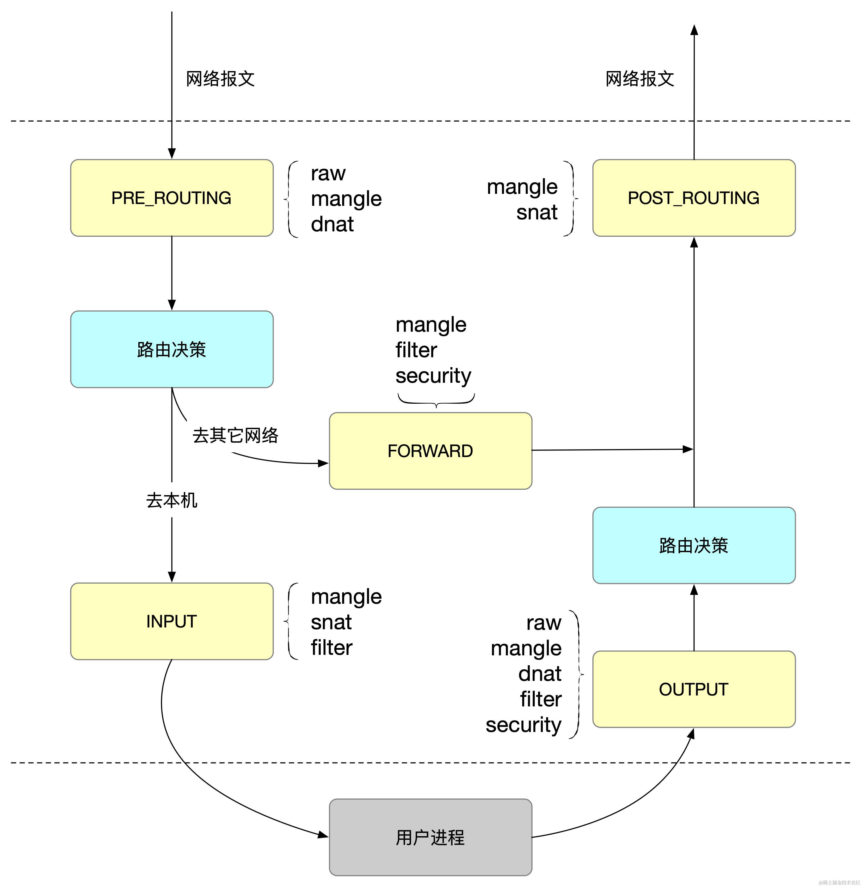
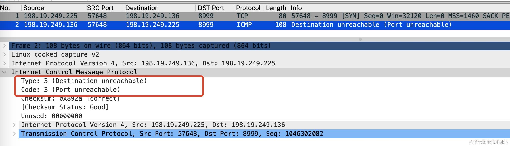
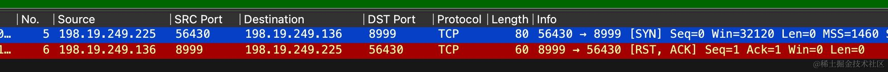
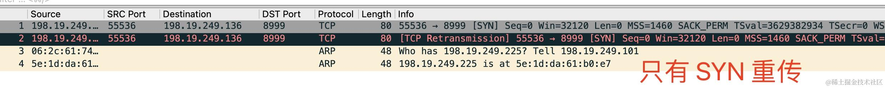
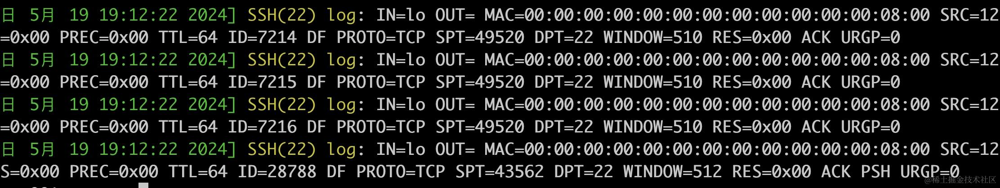
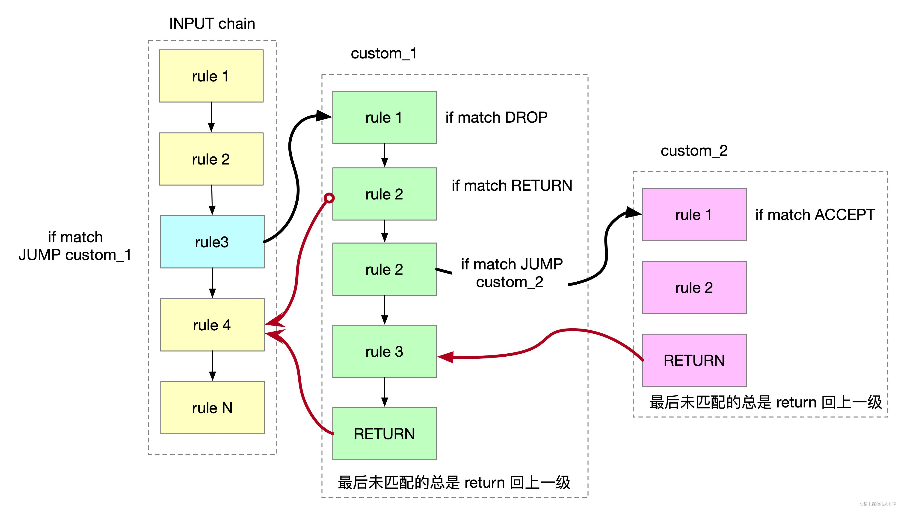

上一篇文章我们介绍了 netfilter 这一个强大的框架，这篇文章我们来详细介绍一下 iptables。iptables 是 Linux 管理防火墙规则的命令行工具，位于用户空间，netfilter 处于 Linux 内核空间。

## iptables 三大基本概念

在深入探讨 iptables 的使用之前，我们需要了解一些基本概念：table、chain 和 rule。



### table

iptables 中的 table 概念是为了组织和分类不同类型的网络包处理规则。每个 table 负责特定类型的网络包处理任务，这种设计使得规则管理更加清晰和高效。例如过滤规则、NAT 规则和包修改规则分别放在不同的 table 中，使得每个 table 的规则更加专注和简洁。

iptables 有 5 个内置表 filter、nat、mangle、raw、security，raw 和 security 较少用到，这里不展开。这5张表的优先级从高到低是：raw、mangle、nat、filter、security。

#### filter 表

filter 是 iptables 的默认表，用于定义网络包的过滤规则。它决定了网络包是被接受、拒绝还是丢弃。它包含三个内置 chain

*   INPUT：处理所有进入本机的数据包
*   FORWARD：处理所有通过本机转发的数据包
*   OUTPUT：处理所有从本机发出的数据包

这比较容易理解，IP 报文要么目标地址为本机（INPUT)，要么是本机产生的报文（OUTPUT)、要么是经过本机转发。

```powershell
# 允许所有到达本机 80 和 443 端口的 TCP 数据包
iptables -A INPUT -p tcp --dport 80 -j ACCEPT
iptables -A INPUT -p tcp --dport 443 -j ACCEPT

# 拒绝来自 IP 地址 192.168.1.10 的所有数据包。
iptables -A INPUT -s 192.168.1.10 -j REJECT

# 允许从 192.168.1.0/24 网段到 192.168.2.0/24 网段数据包的转发
iptables -A FORWARD -s 192.168.1.0/24 -d 192.168.2.0/24 -j ACCEPT

# 允许所有从本机 22 端口（SSH）发出的 TCP 数据包。
iptables -A OUTPUT -p tcp --sport 22 -j ACCEPT
```

#### nat 表

nat 表主要用于网络地址转换（NAT），它处理源地址和目标地址的转换，做端口转发和 IP 伪装。它包含三个内置链：

*   PREROUTING：在数据包进入路由决策之前处理数据包。常用于目的地址转换（DNAT），例如将外部请求转发到内部服务
*   OUTPUT：处理本地生成的数据包，常用于本地应用程序的地址转换
*   POSTROUTING：在数据包离开路由器之前处理数据包。常用于源地址转换（SNAT），例如将内部网络的请求转换为公共 IP 地址

比如

```powershell
# 将所有到达 eth0 接口的 SSH 请求转发到内部 IP 地址 192.168.1.100 的 SSH 服务器。
iptables -t nat -A PREROUTING -i eth0 -p tcp --dport 22 -j DNAT --to-destination 192.168.1.100:22
```


```powershell
# 将所有通过 eth0 接口的出站数据包的源地址修改为 eth0 接口的当前 IP 地址。
iptables -t nat -A POSTROUTING -o eth0 -j MASQUERADE
```

#### mangle 表

mangle 表主要用于修改网络包的内容，如修改 TTL 字段或设置 TOS（Type of Service）字段等，包含所有的 5 个内置链。

```powershell
# 将所有到达 80 端口的 TCP 数据包的 TTL 值设置为 128
iptables -t mangle -A PREROUTING -p tcp --dport 80 -j TTL --ttl-set 128

# 所有从本机发出的 DNS 查询数据包的 TOS 字段设置为 0x10
iptables -t mangle -A OUTPUT -p udp --dport 53 -j TOS --set-tos 0x10
```

### chain

iptables 中链（chain）是预定义的规则集合，用于处理不同类型的网络包。每个链都有特定的用途，当网络包到达某个链时，iptables 会按照规则的顺序逐一检查，直到找到匹配的规则或到达链的末尾。

iptables 中的链分为系统内置链和用户自定义链两种，k8s 中就大量使用了自定义链。

iptables 里有 PREROUTING、INPUT、FORWARD、OUTPUT 和 POSTROUTING 这五个内置链。这些链不是凭空出现的概念，它是对应于 netfilter 处理网络包的五个阶段。

*   **INPUT 链**：INPUT 链用于处理所有目标地址为本机的包
*   **FORWARD 链**：FORWARD 链用于处理转发到其他系统的网络包
*   **OUTPUT 链**：OUTPUT 链用于处理从本地系统发出的网络包，所有源地址为本地系统的包都会经过 OUTPUT 链。
*   **PREROUTING 链**：PREROUTING 链用于在路由决策之前处理网络包。所有进入本地系统的包在进行路由决策之前都会经过 PREROUTING 链。
*   **POSTROUTING 链**：POSTROUTING 链用于在路由决策之后处理网络包，所有离开本地系统的包在进行路由决策之后都会经过 POSTROUTING 链。

## rule

iptables 中的规则（rule）是网络包过滤和处理的基本单位。每条规则定义了匹配条件和相应的动作，当网络包匹配某条规则时，iptables 会执行该规则定义的动作。

每条 iptables 规则由以下几个部分组成：

*   链（chain）：规则所属的链，决定了规则应用的上下文。
*   匹配条件（match conditions）：定义哪些网络包应与规则匹配。
*   动作（target/action）：定义当网络包匹配规则时应执行的操作。

## 处理动作

动作定义了当网络包匹配规则时应执行的操作，常见的动作包括：

*   ACCEPT：允许数据包
*   DROP：丢弃数据包
*   REJECT：拒绝包并发送 ICMP 错误消息。
*   LOG：在/var/log/messages文件中记录日志信息，
*   DNAT：目标地址转换，便于外部流量访问内部服务
*   SNAT：源地址转换，便于内网地址访问外网
*   MASQUERADE：与 SNAT 类似，不过 MASQUERADE 不需要指定一个静态的 IP 地址作为源地址

比如

```powershell
iptables -A POSTROUTING -s 10.42.0.0/16 ! -d 224.0.0.0/4 -j MASQUERADE
```

这条 iptables 规则的作用是：对于源地址在 10.42.0.0/16 网段的数据包，且目的地址不在 224.0.0.0/4 地址范围内的数据包，在数据包离开本机之前，将其源地址伪装为出站接口的 IP 地址。

### Reject & Drop

Reject 与 Drop 一样都会丢弃报文，但 Reject 不同之处在于 Reject 还会发送一个 ICMP 错文报文，默认是返回 `port unreachable` 这个错误报文。也可以使用 `--reject-with` 选项指定返回的错误类型，常见的如下：

*   icmp-net-unreachable
*   icmp-host-unreachable
*   icmp-port-unreachable (默认)
*   tcp-reset

比如我们新增如下规则

```powershell
iptables -A INPUT -p tcp --dport 8999 -j REJECT
```

在与这台主机的 8999 端口服务建连 `nc 198.19.249.136 8999`，会收到一个 `port unreachable` 的 ICMP 错误消息。



如果增加 `--reject-with tcp-reset` 则会直接返回 RST 包



如果这里把 `-j REJECT` 改为 `-j DROP`，则不会收到 ICMP 错误消息



选择 DROP 还是 REJECT 取决你的使用需求：

*   REJECT 会明确告诉对方连接被拒绝，可以让对端迅速得到通知
*   使用 DROP 时客户端不知道报文被丢弃，会认为是丢包，会继续使用重传机制来发送报文，直到超时。
*   DROP 暴露给攻击者的信息更少，更安全，但出问题时调试更麻烦。
*   通常对内网信任主机，使用 REJECT 更友好。面向外部不受信网络，使用 DROP 则更稳妥

### DNAT

DNAT 是 Destination Network Address Translation 的缩写，用于将外部访问请求重定向到内部网络中的服务器。

比如下面这条规则可以做端口映射，将外部访问本机 80 端口请求流量重定向到 192.168.1.6 的 3000 端口

```powershell
iptables -t nat -A PREROUTING -p tcp --dport 80 -j DNAT --to-destination 192.168.1.6:3000
```

### SNAT

SNAT 是 Source Network Address Translation（源地址转换）的缩写，SNAT 用于局域网内主机通过少量公网 IP 地址访问互联网，隐藏局域网内部的私有 IP 地址。

比如下面的规则将 `192.168.1.0/24` 网段的源地址转换为 `10.0.2.15`

```powershell
iptables -t nat -A POSTROUTING -s 192.168.1.0/24 -o eth0 -j SNAT --to-source 10.0.2.15
```

### MASQUERADE

MASQUERADE（伪装）在 k8s 容器网络中用的非常多，与 SNAT 一样，它也是用来修改源 IP，它们的区别是：

*   SNAT 适用于静态 IP 地址，需要显式指定源地址
*   MASQUERADE 适用于动态 IP 地址，不需要显式指定源地址，自动使用出接口的当前 IP 地址

比如下面这条规则将 `192.168.1.0/24` 网段的源地址修改为 eth0 接口的当前 IP 地址

```powershell
iptables -t nat -A POSTROUTING –s 192.168.1.0/24 –o eth0 -j MASQUERADE
```

MASQUERADE 用起来更简单，但性能稍低一点点，需要频繁的查询接口的 IP 地址。

### LOG

LOG 与 ACCEPT 或 DROP 等终止目标不同，LOG 数据包在被记录后仍会继续通过链中的其他规则。LOG 目标在于调试、防火墙规则验时非常有用。

下面的规则将目标端口为 22 的 TCP 数据包记录到日志中，日志前缀为 "SSH(22) log: " ，每分钟最多记录 5 条。

```powershell
iptables -A INPUT -p tcp --dport 22 -m limit --limit 5/min -j LOG --log-prefix "SSH(22) log: " --log-level 4
```

查看 `/var/log/kern.log` 或者 `dmesg -T` 均可查看这个日志。



#### 默认策略

每个链都有一个默认策略，可以设置为 ACCEPT（接受）或 DROP（丢弃）。默认情况下链的策略都设置为 ACCEPT，即允许所有数据包通过。

可以使用以下命令修改链的默认策略：`iptables -P <链名> <策略>`，例如 `iptables -P INPUT DROP` 表示将 INPUT 链的默认策略设置为丢弃所有入站数据包

下面的命令将默认策略设置为拒绝所有的输入和转发流量，并允许所有的输出流量

```powershell
iptables -P INPUT DROP
iptables -P FORWARD DROP
iptables -P OUTPUT ACCEPT
```

## iptables 的过滤条件

> 匹配协议

使用 `-p` 指定协议（如 TCP、UDP、IGMP、ICMP 等）

```powershell
# 阻止所有 TCP 流量
iptables -A INPUT -p tcp -j DROP
```

> 匹配源地址、目标地址
> 使用 `-s` 和 `-d` 选项指定源 IP 和目标 IP。

```powershell
# 阻止来自 192.168.1.100 的所有流量
iptables -A INPUT -s 192.168.1.100 -j DROP

# 阻止发往 192.168.1.200 的所有流量
iptables -A OUTPUT -d 192.168.1.200 -j DROP
```

> 匹配端口

使用 `--sport` 和 `--dport` 指定源端口和目标端口

```powershell
# 阻止 22 端口（SSH）收到的所有 TCP 流量
iptables -A INPUT -p tcp --dport 22 -j DROP

# 阻止源端口为 80 端口（HTTP）的所有 TCP 流量
iptables -A OUTPUT -p tcp --sport 80 -j DROP
```

> 匹配接口

使用 -i 和 -o 选项指定输入和输出接口。

```powershell
# 允许通过 eth0 接口的所有流量
iptables -A INPUT -i eth0 -j ACCEPT

# 阻止通过 eth1 接口的所有流量
iptables -A OUTPUT -o eth1 -j DROP
```

> 匹配连接状态

使用 -m state --state 选项匹配连接状态，如 NEW、ESTABLISHED、RELATED、INVALID。

```powershell
# 允许已建立和相关的连接
iptables -A INPUT -m state --state ESTABLISHED,RELATED -j ACCEPT

# 阻止所有无效的连接
iptables -A INPUT -m state --state INVALID -j DROP
```

> 条件取反

使用 ! 进行条件反向匹配。

```powershell
# 允许所有非 TCP 流量
iptables -A INPUT -p ! tcp -j ACCEPT

# 阻止所有非 192.168.1.100 的流量
iptables -A INPUT -s ! 192.168.1.100 -j DROP
```

## iptables 常用命令

> 查看规则

使用 -L 选项可以查看某个表当前所有的 iptables 规则，使用 -t 选项可以查看特定表的规则，如果不指定，默认是查看 filter 表。例如查看 nat 表的规则：

```powershell
# 查看 nat 表的规则
iptables -L -t nat
```

`iptables -L`：列出当前所有的防火墙规则，默认显示 filter 表的规则。使用 -t 选项可以查看特定表的规则，比如要查看 nat 表的规则，可以使用 `iptables -t nat -L`。

`iptables -L --line-numbers`：以带行号的形式列出规则，便于后续删除特定规则

```powershell
# iptables -L --line-numbers

Chain INPUT (policy ACCEPT)
num  target     prot opt source               destination
1    KUBE-ROUTER-INPUT  all  --  anywhere             anywhere             /* kube-router netpol - 4IA2OSFRMVNDXBVV */
2    KUBE-NODEPORTS  all  --  anywhere             anywhere             /* kubernetes health check service ports */
3    KUBE-EXTERNAL-SERVICES  all  --  anywhere             anywhere             ctstate NEW /* kubernetes externally-visible service portals */
4    KUBE-FIREWALL  all  --  anywhere             anywhere
5    YJ-FIREWALL-INPUT  all  --  anywhere             anywhere
```

> 添加规则到链的末尾

`iptables -A <链名> <规则>`：在指定链的末尾添加一条新规则。例如：

```powershell
iptables -A INPUT -s 10.42.1.5 -j DROP 
```

表示丢弃来自 IP 地址 `10.42.1.5` 的所有数据包

> 删除规则

`iptables -D <链名> <规则>`：删除指定链中的某一条规则，可以按规则序号或内容删除。例如，iptables -D INPUT 1 删除 INPUT 链中的第一条规则

> 插入规则

`iptables -I <链名> <规则>`：在指定链中插入一条新规则，默认在第一行添加。例如：

```powershell
iptables -I INPUT 1 -p tcp --dport 80 -j ACCEPT 
```

表示在 INPUT 链的第一行插入一条允许目标端口 80 的 TCP 流量的规则

> 替换规则

`iptables -R <链名> <规则>`：修改或替换指定链中的某一条规则，可以按规则序号或内容替换

> 清空规则

`iptables -F`：清空所有规则链中的规则

## 自定义规则链

用户可以创建自定义链来组织和管理特定的规则集，自定义在 k8s 中大量使用，将相关的规则放在一个自定义链中统一管理，使得配置更加清晰和易于维护。

可以使用 -N 或 --new-chain 选项来创建一个自定义链，比如

```powershell
# 在 filter 标中创建名为 my_chain 的自定义链
iptables -N my_chain
```

在自定义链中添加规则

```powershell
# 这两条规则会允许来自 192.168.1.0/24 网段的数据包，并拒绝其他所有数据包。

iptables -A my_chain -s 192.168.1.0/24 -j ACCEPT
iptables -A my_chain -s 10.0.0.0/8 -j DROP
```

在内置链中跳转到自定义链，使用 `-j` 选项指定目标链

```powershell
# 将目标端口为 80 的TCP 数据包从 INPUT 链跳转到 my_chain 链进行处理
iptables -A INPUT -p tcp --dport 80 -j my_chain 
```

当一个数据包到达服务器时,它会按照以下顺序经过iptables的处理:

*   数据包首先到达INPUT链。INPUT链中的规则会按顺序进行匹配
*   如果数据包是TCP协议并且目标端口为80,它会匹配到第2条规则`-A INPUT -p tcp --dport 80 -j my_chain`,这条规则指定跳转到我们定义的 my\_chain 链中
*   进入 my\_chain 后，数据包会从第一条规则开始匹配。如果源IP属于`192.168.1.0/24`网段,就会匹配到`-A CUSTOM_CHAIN -s 192.168.1.0/24 -j ACCEPT`规则,数据包会被接受,不再继续匹配后面的规则,直接返回到INPUT链
*   如果数据包的源IP不属于192.168.1.0/24,就会继续匹配下一条规则。如果源IP属于10.0.0.0/8网段,就会匹配到`-A my_chain -s 10.0.0.0/8 -j DROP`规则,数据包会被丢弃,不再继续匹配,处理结束
*   如果数据包没有匹配 my\_chain 中的任何规则,就会返回到INPUT链,继续匹配INPUT链后面的规则

自定义链的规则如下：

*   自定义链类似一个子程序,从内置链中跳转进去处理，自定义链中的规则也是按顺序从上到下匹配。

*   如果自定义链中有匹配到规则,且规则指定了ACCEPT或DROP,数据包就不会再返回内置链

*   如果自定义链中没有匹配到规则或者匹配到RETURN,就会返回调用它的链,继续匹配链后面的规则

如下图所示：


