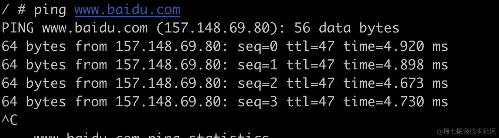
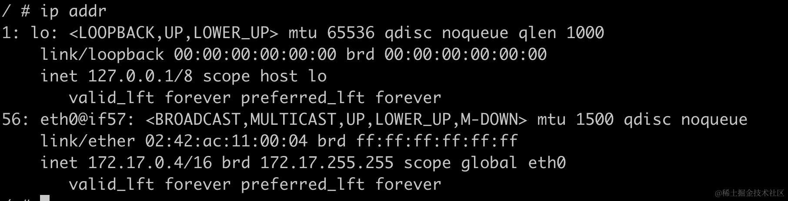
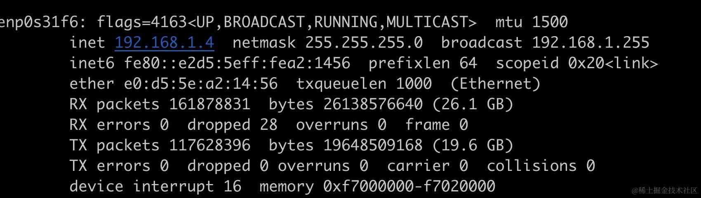
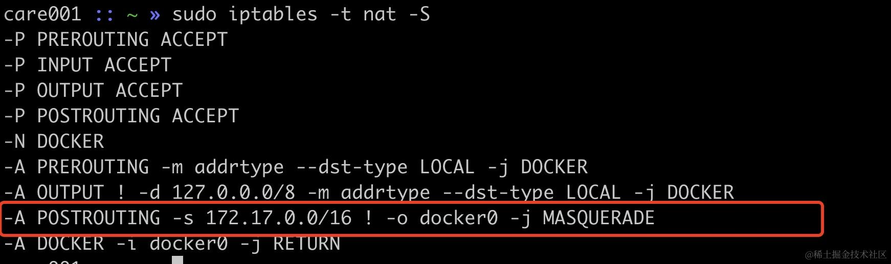
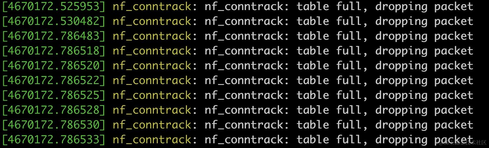
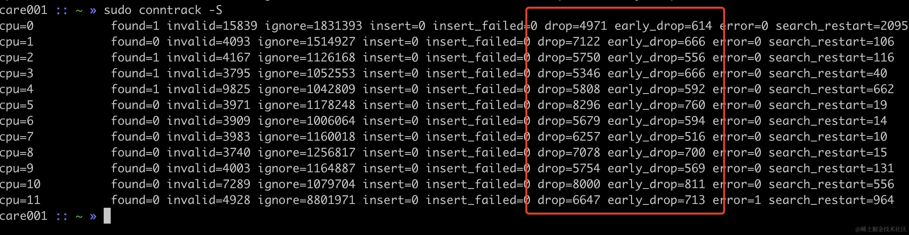

前面我们介绍了 netfilter 相关的知识，这里我们来介绍一下 conntrack 工具。Conntrack 是 netfilter 的一部分。它的主要作用是跟踪网络连接的状态，做 NAT 转换以及负载均衡等。

我们可以使用 conntrack 命令查看当前系统的连接跟踪表:

```powershell
# 列出所有连接
conntrack -L

# 只列出 TCP 连接
conntrack -L -p tcp

# 显示更详细的信息
conntrack -L -e
```

接下来我们看看 conntrack 在 NAT 中发挥的作用。

我们启动一个 docker 容器，这里以 busybox 为例:

```powershell
docker run -it busybox /bin/sh
```

不出意外，此时 docker 已经可以访问外网，



这里 docker 使用的是 bridge 方式进行容器的通信。容器 ip 是 172.17.0.4。



宿主机的网卡 ip 是 `192.168.1.4`



此时 172.17.0.4 想访问 157.148.69.80.80 这个 ip 时，需要做源地址 NAT（SNAT）。这里的 SNAT 是通过 iptables 来实现的。

我们此时用 iptables 来看一下


其中 `-A POSTROUTING` 表示该规则将被添加到 POSTROUTING 链中，前面 netfilter 中介绍过，POSTROUTING 阶段是已经经过路由，准备发往另外的网络设备。

`-s 172.17.0.0/16` 表示该规则只应用于源IP地址在 172.17.0.0/16 网段内的数据包，这是我安装的 Docker 默认使用的私有网络地址范围。

`! -o docker0` 这里的 `!` 表示取反，`-o docker0` 表示目标网络接口为 docker0 网桥，因此这里的意思就是：除了目的地是发往 `docker0` 网桥的数据包。

`-j MASQUERADE` 对匹配的数据包进行 MASQUERADE（伪装），也就是做源地址转换（SNAT），把数据包的源 IP 改为发送此数据包的主机 IP 地址。

接下来我们来做实验，看看 conntrack 的实际效果。在 busybox 容器内执行

```powershell
$ nc 157.148.69.80 80
```

在宿主机，执行 `conntrack -L` 就可以看到对应的连接信息了。

```powershell
sudo conntrack -L | grep 157.148.69.80

tcp      6 431990 ESTABLISHED src=172.17.0.4 dst=157.148.69.80 sport=41231 dport=80 src=157.148.69.80 dst=192.168.1.4 sport=80 dport=41231 [ASSURED] mark=0 use=1
```

这里的 `tcp      6 431990 ESTABLISHED` 表示这是一条 ID 为 431990 的 TCP 连接，状态为 ESTABLISHED。

接下来的 `src=172.17.0.4 dst=157.148.69.80 sport=41231 dport=80` 表示 DNAT 前的TCP 四元组：`172.17.0.4.41231->157.148.69.80.80`

接下来的 `src=157.148.69.80 dst=192.168.1.4 sport=80 dport=41231` 表示 DNAT 后的反向流量 TCP 四元组：`157.148.69.80.80->192.168.1.4.41231`。

值得注意的是，DNAT 前的临时端口号是 41231，对应到宿主机的端口号也是 41231，这是因为在没有冲突的情况下，可以这样处理。如果我们两个容器的临时端口号相同时，就不能这样处理了。我们可以来做一下实验看一下。

busybox 的 nc 在 connect 时可以使用 `-p` 指定临时端口

```powershell
$ nc -p 29999 157.148.69.80 80
```

在启动一个 busybox 容器运行同样的命令，然后在宿主机上查看 conntrack 信息

```powershell
$ sudo conntrack -L | grep 157.148.69.80
```


```powershell
tcp      6 431997 ESTABLISHED src=172.17.0.5 dst=157.148.69.80 sport=29999 dport=80 src=157.148.69.80 dst=192.168.1.4 sport=80 dport=29999 [ASSURED] mark=0 use=1
tcp      6 431990 ESTABLISHED src=172.17.0.4 dst=157.148.69.80 sport=29999 dport=80 src=157.148.69.80 dst=192.168.1.4 sport=80 dport=34105 [ASSURED] mark=0 use=1
```

可以看到 conntrack 的 DNAT 记录如下：

```powershell
172.17.0.5.29999->57.148.69.80.80 <-> 157.148.69.80.80->192.168.1.4.29999

172.17.0.4.29999->57.148.69.80.80 <-> 157.148.69.80.80->192.168.1.4.34105
```

也就是在容器内，都是使用 29999 这个临时端口与服务端建连，但在宿主机上一个使用了 29999，一个使用了 34105，不然的话，如果网卡收到发往 29999 的包，应该发给哪个容器处理呢？这就是 conntrack 在其中扮演的重要作用。

## conntrack 一些底层细节

conntrack 连接跟踪表底层使用哈希桶+链表来记录相关的信息，哈希桶的每一个 bucket 都包含一个链表，用来解决哈希冲突，如下所示。

    +---------------+
    | Bucket 0      |
    +---------------+
    | Bucket 1      |
    +---------------+    +-----------------------------------+
    | Bucket 2      |----| Entry 1 ->| Entry 2 ->| Entry 3 ->|
    +---------------+    +-----------------------------------+
    | Bucket 3      |
    +---------------+
    | ....          |
    +---------------+
    | ....          |
    +---------------+
    | ....          |
    +---------------+    +----------------------+
    | Bucket N      |----| Entry ->| Entry ->|--|
    +---------------+    +----------------------+

当收到一个新的数据包，内核先根据数据包的信息（源IP、目标 IP、port 等）计算出一个 hash 值，以这个哈希值作为索引，找到数据包所属的 bucket 链表，这一步哈希计算时间相对固定且比较快`O(1)`。接下来遍历 bucket 的链表，逐一匹配是否有匹配的 conntrack 连接。

可以看到如果 bucket 链表的元素越多，遍历链表所花的就会越长`O(n)`，这里可能带来性能上的问题。因此建议 bucket 链表的元素的个数需要控制在一个比较小的值，建议小于8。

bucket 的数量由 `net.netfilter.nf_conntrack_buckets` 参数决定，在我机器上默认值是 65536。

```powershell
$ sudo sysctl -a | grep nf_conntrack_buckets

net.netfilter.nf_conntrack_buckets = 65536
```

一切记录都是有代价的，conntrack 也不例外，每条 conntrack 都需要占用一定的内存，因此 linux 不会无上限的存储 conntrack 条目。`net.nf_conntrack_max` 配置值决定了最多允许 conntrack 跟踪多少连接。在我的机器上，这个默认值为 262144：

```powershell
$ sudo sysctl -a | grep net.nf_conntrack_max

net.nf_conntrack_max = 262144
```

net.nf\_conntrack\_max 默认值的计算方式是 nf\_conntrack\_buckets \* 4 = 65536 \* 4 = 262144。不过在更新版本的 linux 内核中已经默认将 `nf_conntrack_max` 设置为与 `nf_conntrack_buckets` 相同的值。

## conntrack 连接跟踪表满会发生什么

接下来我们来看一下，如果 conntrack 超过了 `net.nf_conntrack_max` 会发生什么。我们把当前的系统的 nf\_conntrack\_max 改小为 10000：

```powershell
$ sysctl -w net.nf_conntrack_max=10000
```

然后写一个程序大量建连（超过 10000），使用 `conntrack -C` 可以当前跟踪的连接条目的数量。

```powershell
$ sudo conntrack -C

10000
```

通过 dmesg 可以看到确实此时 conntrack 的表满了导致了丢包：



还可以通过 `conntrack -S` 来观察 drop 是否在持续的增加



## 小结

在本文中,我们详细介绍了 Linux 中的 conntrack 工具及其在网络连接跟踪和 NAT 转换中的作用。主要内容包括:

> conntrack 命令基本用法

*   使用 conntrack -L 列出当前系统的连接跟踪表
*   使用 -p 参数过滤特定协议的连接
*   使用 -e 参数显示更详细的连接信息
*   使用 -C 和 conntrack -S 监控 conntrack 表的使用情况

接着我们介绍了 conntrack 使用哈希桶+链表的数据结构，说明了哈希桶数量和链表长度对性能的影响，介绍了 net.netfilter.nf\_conntrack\_buckets 和 net.nf\_conntrack\_max 这两个关键参数。

文中有两个实战实验，一个是通过实验演示了 Docker 容器访问外网时，conntrack 如何记录 SNAT 转换前后的连接信息，希望你可以直观的感受 SNAT 的效果。一个是 conntrack 表满时的行为，会导致新连接被丢弃。
