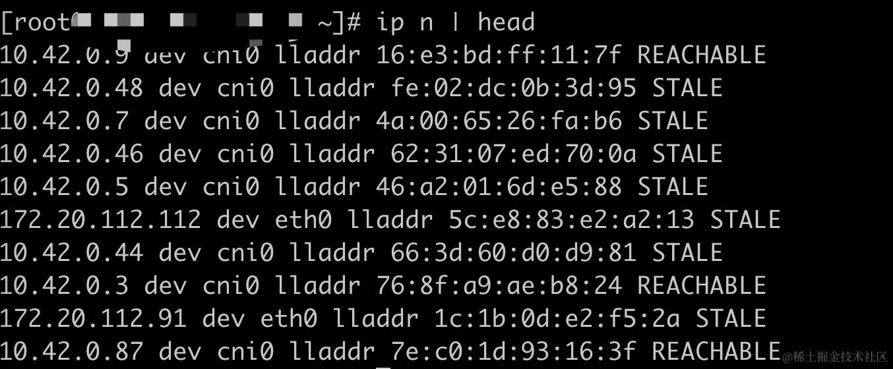
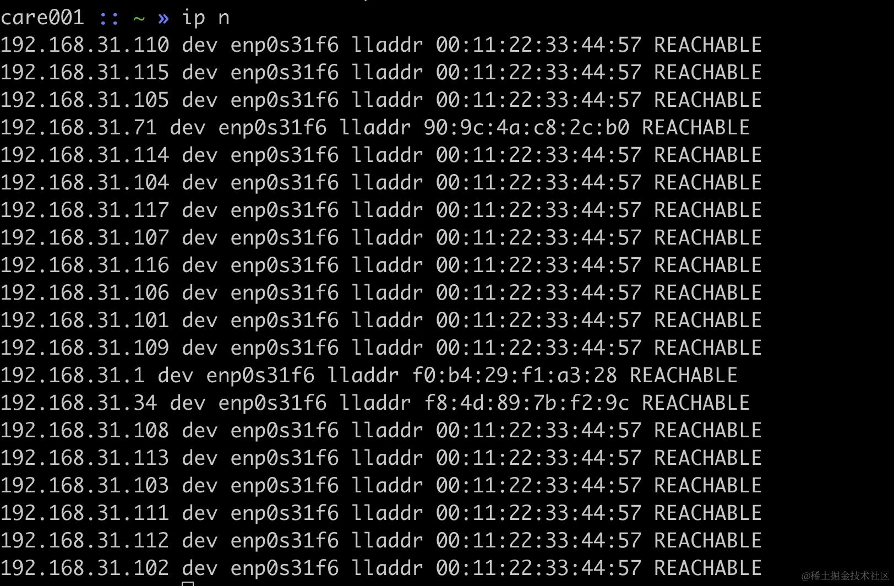
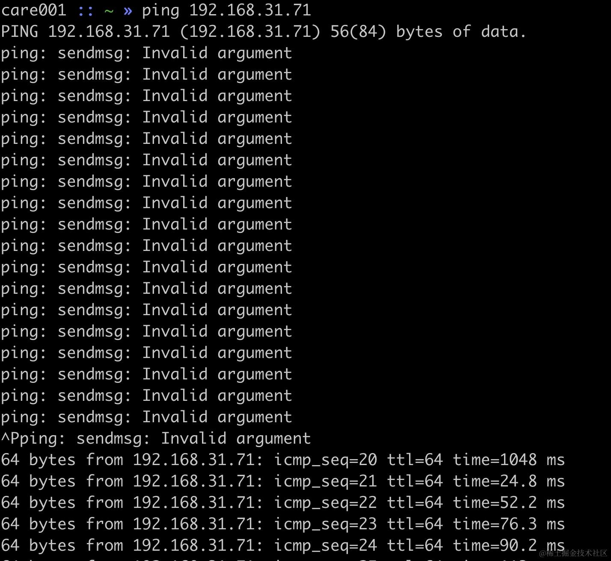
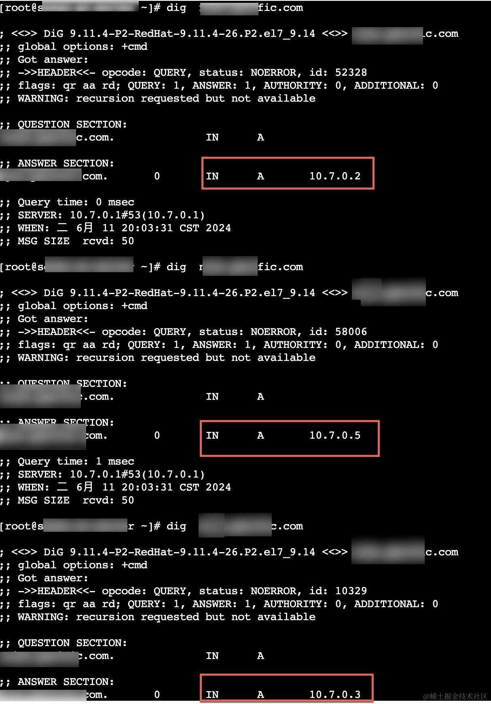

ARP(Address Resolution Protocol)是一种用于解析网络层地址(如IP地址)到数据链路层地址(如MAC地址)映射的协议。在日常的网络通信中,ARP扮演着至关重要的角色。本文将深入探讨Linux内核中ARP的实现原理,重点关注ARP缓存的状态机、相关的内核配置参数以及垃圾回收机制。通过学习ARP的内部工作原理,我们可以更好地理解和调优ARP。

## 查看 ARP 表

`ip neighbour` 命令用于查看 ARP 缓存，可以简写为 `ip neigh` 或者更简短的 `ip n`。



每一行的格式如下:

```powershell
<IP地址> dev <网络接口> lladdr <MAC地址> <状态>
```

为了更好的理解 ARP 协议，我们需要搞懂 ARP 的状态机。

## ARP 状态机

ARP 表项有这几种状态：INCOMPLETE、REACHABLE、STALE、DELAY、PROBE、FAILED。

当内核协议栈在发送网络包时,需要找到目标 IP 地址对应的 MAC 地址。如果 ARP 缓存中没有相应的记录,则会插入一个状态为 Incomplete 的新表项,同时发起 ARP 请求,询问此 IP 地址对应的 MAC 地址。

处于 Incomplete 状态的记录，如果收到 ARP 响应，表项状态会变为 Reachable。如果多次尝试后仍未收到响应，表项状态会变为 Failed。

Reachable 状态的表项在超时后会变为 Stale 状态。

当一个表项变为 stale 状态后，并不会立即从 ARP 缓存中删除。如果 Stale 状态的表项被引用来发送数据包，表项状态会变为 Delay。如果在 Delay 状态到期前收到 ARP 响应确认，表项状态会重新变为 Reachable。

若 Delay 状态到期未收到响应，表项状态会变为 Probe。

如果 stale 状态的表项一直没有被使用，超过了 `gc_interval` 指定的垃圾回收间隔（默认为 30 秒），该表项就会被从 ARP 缓存中删除

如下图所示：

## ARP 相关的内核配置

> net.ipv4.neigh.default.base\_reachable\_time\_ms

base\_reachable\_time\_ms 表示 ARP 的老化时间，这个时间值是一个基准，实际的可达时间是一个在 base\_reachable\_time\_ms 的 0.5 到 1.5 倍之间的随机值。如果 neigh.default.base\_reachable\_time\_ms 设置为 30 秒，那么实际的可达时间将在 15 秒到 45 秒之间随机变化。这种随机化机制有助于避免短时间内同时刷新 ARP 表项。

> net.ipv4.neigh.default.gc\_stale\_time

gc\_stale\_time 参数指定了每次检查 neighbour 记录的有效性的周期。默认值是 60s。

> net.ipv4.neigh.default.gc\_interval

gc\_interval 决定了 ARP 缓存垃圾回收的频率，默认值为 30 秒。

> net.ipv4.neigh.default.gc\_thresh1/2/3

这三个参数非常重要，决定了 ARP 缓存中表项的数量阈值，来确定什么时候进行垃圾回收

*   gc\_thresh1 表示 ARP 缓存项的最小阈值。当 ARP 缓存中的表项数量少于这个值时，垃圾回收器不会运行，默认值为 128。确保在 ARP 缓存中至少保留 gc\_thresh1 个表项，以避免频繁的垃圾回收操作。
*   gc\_thresh2 表示 ARP 缓存项的软上限。当 ARP 缓存中的条目数超过 gc\_thresh2 时，垃圾回收程序会允许缓存保持 5 秒钟的时间，然后再进行回收，默认值为 512。当表项数量超过 gc\_thresh2 时，垃圾回收器会更频繁地运行，以防止 ARP 缓存过度膨胀。
*   gc\_thresh3 表示 ARP 缓存中的硬上限条目数。如果 ARP 缓存中的条目数超过 gc\_thresh3，垃圾回收程序就会立即运行，默认值为 1024。确保 ARP 缓存不会超过 gc\_thresh3 个表项，从而防止系统内存被过多的 ARP 表项占用。

## ARP 表满对网络通信的影响

当不可回收的 ARP 表项达到 gc\_thresh3 时，会导致严重的问题，此时新的 ARP 表项无法插入，导致对应 ip 的网络包无法发送。在容器网络中，可能会导致 CoreDNS 无法返回 DNS 响应包，进而应用端表现为 DNS 解析失败。

我们先来把 gc\_thresh 的值调小为 20，方便复现。

```powershell
sudo sysctl -w net.ipv4.neigh.default.gc_thresh1=20
sudo sysctl -w net.ipv4.neigh.default.gc_thresh2=20
sudo sysctl -w net.ipv4.neigh.default.gc_thresh3=20
```

接下来使用 ip 命令手动批量添加 arp 记录，添加 192.168.31.101 到 192.168.31.200 区间的 arp 记录。

```powershell
#!/bin/bash

start=101
end=120

for i in $(seq $start $end); do
    ip="192.168.31.$i"
    echo "Executing command for IP: $ip"
    ip neigh add $ip lladdr "00:11:22:33:44:57" nud reachable dev enp0s31f6
done
```

此时查看当时的 arp 记录，可以看到有 20 条



此时 ping 一下局域网里的另外一个 ip（192.168.31.71），可以看到在很长一段时间都是不成功的，直到 gc 的时间到，才有机会插入 ARP 表记录，完成后续的 ARP 解析。



## ARP PERMANENT 状态

PERMANENT 状态的 ARP 表项不会被自动过期被回收，它们会一直保留在ARP缓存中，直到管理员手动删除。

下面是使用 ip 命令添加的 PERMANENT 状态的 ARP 记录。

```powershell
$ sudo ip neigh add 192.168.31.10 lladdr 00:11:22:33:44:55 dev enp0s31f6 nud permanent

$ ip n
192.168.31.10 dev enp0s31f6 lladdr 00:11:22:33:44:55 PERMANENT
...
```

## ARP 回收的内核实现

接下来我们来详细看下 ARP 回收相关的内核层实现，方便你更好的理解前面介绍的各项参数。

首先先来看下 neighbour 结构体，它用于表示网络 arp 表项。

```c
struct neighbour {
    struct neighbour    *next; // 同一哈希桶中下一个节点的指针
    struct neigh_table    *tbl; // arp 表
    struct neigh_parms    *parms;
    unsigned long        confirmed; // 确认时间戳
    unsigned long        updated; // 上次更新的时间戳
    rwlock_t        lock;
    refcount_t        refcnt; // 引用计数器，用于跟踪该邻居条目的引用次数
    struct sk_buff_head    arp_queue; // ARP 队列
    unsigned int        arp_queue_len_bytes;
    struct timer_list    timer; // 定时器，用于处理邻居条目的超时
    unsigned long        used;
    atomic_t        probes; // 探测计数器，记录发送的探测请求次数
    __u8            flags; // 用于存储 arp 条目的 flag 状态信息
    __u8            nud_state; // arp 条目的状态（如 REACHABLE、STALE 等）
    __u8            type; // 类型
    __u8            dead; // 标志位，指示该邻居条目是否已被标记为删除`
    seqlock_t        ha_lock;
    unsigned char        ha[ALIGN(MAX_ADDR_LEN, sizeof(unsigned long))];
    struct hh_cache        hh;
    int            (*output)(struct neighbour *, struct sk_buff *);
    const struct neigh_ops    *ops;
    struct rcu_head        rcu;
    struct net_device    *dev;
    u8            primary_key[0];
};

```

`neigh_alloc` 为 arp 分配一个新的表项，并初始化该条目的各个字段。如果 arp 表项中的条目数超过了某个阈值，则会尝试进行强制垃圾回收。如果内存分配失败，则会减少 arp 表中的条目数并返回 NULL。

```c
static struct neighbour *neigh_alloc(struct neigh_table *tbl, struct net_device *dev)
{
	struct neighbour *n = NULL;
	unsigned long now = jiffies;
	int entries;

	entries =&tbl->entries - 1;

	// 1. arp 条目数大于 gc_thresh3
	// 2. arp 条目数大于 gc_thresh2 且距最后清理时间已超过 5s 
	if (entries >= tbl->gc_thresh3 ||
	    (entries >= tbl->gc_thresh2 &&
	     time_after(now, tbl->last_flush + 5 * HZ))) {
	   // 如果强制垃圾回收失败并且条目数仍然超过 gc_thresh3，则打印日志
		if (!neigh_forced_gc(tbl) &&
		    entries >= tbl->gc_thresh3) {
			net_info_ratelimited("%s: neighbor table overflow!\n",
					     tbl->id);
			NEIGH_CACHE_STAT_INC(tbl, table_fulls);
			goto out_entries;
		}
	}
    // 分配内存给新的 arp 表项
	n = kzalloc(tbl->entry_size + dev->neigh_priv_len, GFP_ATOMIC);

    // 初始化 arp 表项的各个字段
	__skb_queue_head_init(&n->arp_queue);
	n->updated	  = n->used = now;
	n->nud_state	  = NUD_NONE;
	n->output	  = neigh_blackhole;
	n->parms	  = neigh_parms_clone(&tbl->parms);
	timer_setup(&n->timer, neigh_timer_handler, 0);
	n->tbl		  = tbl;
	// 把 refcnt 初始化为 1
	refcount_set(&n->refcnt, 1);
	n->dead		  = 1;
out:
	return n;

out_entries:
	atomic_dec(&tbl->entries);
	goto out;
}
```

`neigh_periodic_work` 函数的主要功能是定期检查和清理 arp 表中的条目，这个过程是异步的。

```c
static void neigh_periodic_work(struct work_struct *work)
{
    // 从work_struct指针获取包含它的neigh_table结构
    struct neigh_table *tbl = container_of(work, struct neigh_table, gc_work.work);
    struct neighbour *n;
    struct neighbour **np;    
    unsigned int i;
    struct neigh_hash_table *nht = tbl->nht;

    /*
     *    periodically recompute ReachableTime from random function
     */

    // 从随机函数重新计算 ReachableTime
    if (time_after(jiffies, tbl->last_rand + 300 * HZ)) {
        struct neigh_parms *p;
        tbl->last_rand = jiffies;
        list_for_each_entry(p, &tbl->parms_list, list)
            p->reachable_time =
                neigh_rand_reach_time(NEIGH_VAR(p, BASE_REACHABLE_TIME));
    }

    // 如果 arp 条目数小于gc_thresh1，则直接返回
    if (&tbl->entries < tbl->gc_thresh1)
        goto out;
    // 遍历 arp 哈希表的每个桶
    for (i = 0 ; i < (1 << nht->hash_shift); i++) {
        np = &nht->hash_buckets[i];

        // 遍历桶中所有的 arp 条目
        while ((n = rcu_dereference_protected(*np,
                lockdep_is_held(&tbl->lock))) != NULL) {
            unsigned int state = n->nud_state;
            // 如果是 PERMANENT 或者处于 TIMER 或者是从外部学习的，则跳过
            if ((state & (NUD_PERMANENT | NUD_IN_TIMER)) ||
                (n->flags & NTF_EXT_LEARNED)) {
                goto next_elt;
            }
            
            // 如果 used 时间早于 confirmed 时间，则更新 used 时间
            if (time_before(n->used, n->confirmed))
                n->used = n->confirmed;

            // 如果没有被引用且状态为 NUD_FAILED 或条目过期，则删除该条目
            if (&n->refcnt == 1 &&
                (state == NUD_FAILED ||
                 time_after(jiffies, n->used + NEIGH_VAR(n->parms, GC_STALETIME)))) {
                *np = n->next;
                n->dead = 1;
                write_unlock(&n->lock);
                neigh_cleanup_and_release(n);
                continue;
            }

next_elt:
            np = &n->next;
        }
        /*
         * It's fine to release lock here, even if hash table
         * grows while we are preempted.
         */
        cond_resched();
        nht = rcu_dereference_protected(tbl->nht,
                        lockdep_is_held(&tbl->lock));
    }
out:
    /* Cycle through all hash buckets every BASE_REACHABLE_TIME/2 ticks.
     * ARP entry timeouts range from 1/2 BASE_REACHABLE_TIME to 3/2
     * BASE_REACHABLE_TIME.
     */
    // 每BASE_REACHABLE_TIME/2个时钟周期循环遍历所有哈希桶 
    // ARP 条目超时时间范围从 1/2 BASE_REACHABLE_TIME 到 3/2 BASE_REACHABLE_TIME。
    queue_delayed_work(system_power_efficient_wq, &tbl->gc_work,
                  NEIGH_VAR(&tbl->parms, BASE_REACHABLE_TIME) >> 1);
}
```

`neigh_forced_gc` 用于对指定的 arp 表进行强制垃圾回收，这个过程是同步的。核心流程是遍历 arp 表哈希桶的每一个 arp 表项，对没有被引用且非 permanent 的表项进行删除。

```c
static int neigh_forced_gc(struct neigh_table *tbl)
{
	int shrunk = 0; // 用于标识是否有 arp 表项被回收
	int i;
	struct neigh_hash_table *nht;

	nht = rcu_dereference_protected(tbl->nht,
					lockdep_is_held(&tbl->lock));
    // 遍历哈希表的每个桶
	for (i = 0; i < (1 << nht->hash_shift); i++) {
		struct neighbour *n;
		struct neighbour **np;
        // 获取当前桶的指针
		np = &nht->hash_buckets[i];
		// 遍历桶中的每个 arp 条目
		while ((n = rcu_dereference_protected(*np,
					lockdep_is_held(&tbl->lock))) != NULL) {
			/* Neighbour record may be discarded if:
			 * - nobody refers to it.
			 * - it is not permanent
			 */
			 // arp 记录可以被删除的条件：没有被引用 && 非 permanent
			if (neigh_del(n, NUD_PERMANENT, NTF_EXT_LEARNED, np,
				      tbl)) {
				shrunk = 1; 
				continue;
			}
			np = &n->next;
		}
	}

    // 更新最后一次刷新时间
	tbl->last_flush = jiffies;

    // 告知调用者是否有 arp 表项被回收
	return shrunk;
}
```

## ARP 实战

我们部署在客户机房的边缘计算服务器，突然有一天 DNS 服务（10.7.0.1）故障了，发往 10.7.0.1 的 DNS 请求没有回应。

经过 tcpdump 抓包，10.7.0.1 DNS 服务器压根没有收到 DNS 请求，接着排查防火墙的问题，发现配置也是 OK 的，没有做 53 端口 udp 的拦截。

经仔细排查，发现是故障机器上 10.7.0.1 的 ARP 记录 mac 地址居然是错误的。


真正 DNS 服务器 10.7.0.1 的 mac 地址应该是 `bc:99:30:89:e0:f0`。这就有点奇怪了，于是先删除原纪录然后添加一条 permanent 的 arp 记录。

```powershell
ip n del 10.7.0.1 dev eth0
ip n add 10.7.0.1 lladdr bc:99:30:89:e0:f0 dev eth0 nud permanent
```

做了这个操作以后，我们边缘服务器的 DNS 解析就正常了。



后面经过排查，发现是因为局域网内有一台主机误把 ip 配置为了 10.7.0.1，导致 ip 冲突，arp 局部网广播时，会把 ARP 记录指向了这台错误主机。我们下线掉这个主机，DNS 服务就完全恢复正常了。

## 小结

这篇文章详细介绍了 linux 平台 arp 相关内核配置和 gc 回收相关的问题，这也是在实际工作中极有可能会遇到的，你可以动手做一下实验。

你还需要重点掌握 ARP 缓存的状态机。ARP表项有 INCOMPLETE、REACHABLE、STALE、DELAY、PROBE、FAILED 等几种状态,需要结合前面的图理解这些状态的转换过程。

对于不想通过 ARP 学习得到的 ARP 表现，我们可以通过 PERMANENT 状态的记录来强制设置。
