## 为什么要写这个小节

随着高级编程语言和现代编译器的发展，现在已经很少有人手写汇编了，不流行也不性感，为什么还要学汇编呢？

虽然不用写，对于开发者而已，读懂汇编的能力是一定要具备的，我能想到的好处就有下面这些：

1. 深入理解计算机工作原理：通过学习汇编，开发者可以更深入地理解计算机是如何执行指令的，CPU、内存是如何协同工作的。

2. 拨开高级语言的语法糖，探究语言实现的本质：通过学习汇编，我们可以深入地去理解高级编程语言背后的原理。

3. 性能优化：通过汇编分析程序的性能瓶颈，评估不同的写法的优劣。

4. 逆向工程：恶意软件分析、漏洞研究和逆向工程常常需要对汇编代码进行深入的理解和分析。

虽然在日常开发中可能不需要直接编写汇编代码，但掌握汇编语言和能力读懂汇编代码对于开发者来说仍然是一项宝贵的技能。它不仅有助于提升个人的技术深度和广度，还能在特定的场景下提供关键的技术支持。

因为目前服务端还是以 X86-64 为主，所以下面介绍的内容都是基于 X86-64 平台。


## 单行函数

以下面的代码为例：

```c
int foo() {
    return 100;
}

int main() {
    int result = foo();
}
```

使用 `O3` 级别优化编译后的汇编如下：

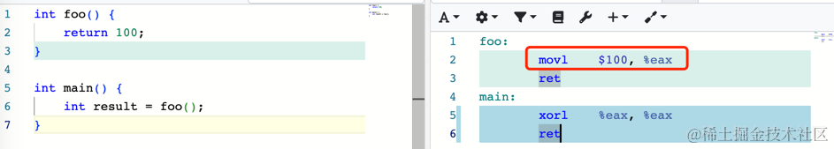

可以看到 foo 函数由两条汇编指令组成，第一条汇编 `movl $100, %eax` 将 100 存储到 EAX 寄存器，待会我们会介绍，EAX
寄存器在调用规约里用于存放函数的返回值。调用者会读取 EAX 当做函数返回结果。第二条汇编 ret 用于从函数返回。


## 通用寄存器

x86-64 平台有 16 个通用寄存器，它们分别是：RAX、RBX、RCX、RDX、RBP、RSP、RSI、RDI、R8、R9、R10、R11、R12、R13、R14、R15。这些寄存器的长度都是
64 位，如果只需要用到寄存器的低 32 位，R8～R15 寄存器可以使用 R8D～R15D，RAX、RBX 可以使用 EAX、EBX，以此类推其它寄存器也是一样。

## 函数的原理

### 函数与栈帧

当一个函数被调用时，系统都需要为其分配一块内存空间，用于存储这次函数调用所需的信息。这块特殊的内存区域就被称为"栈帧"(Stack
Frame)。当函数执行完毕后，栈帧也将被自动清楚，关闭栈帧，为下一次函数调用腾出空间。

栈帧在内存中是一段连续的内存空间，通过 SP 和 BP 这两个寄存器来表示栈的边界。

- SP 寄存器（Stack Pointer）用于指向当前的栈顶位置，在 x86 架构中，栈是向下增长的（向更低的地址增长），执行 push 和 pop
指令会自动修改 SP，当往栈压入数据时，SP 会减小，当从栈上弹出数据时，ESP 会增加。

- BP 寄存器（Base Pointer），也称为基址指针寄存器，它通常用来存储当前函数栈帧的基地址。在函数调用过程中，EBP 寄存器的值通常在函数的入口处被保存，并在函数退出前被恢复。因为 BP 寄存器的地址相对固定，可以通过 BP 固定的偏移量来访问函数的参数和局部变量。

在函数调用时，经常会看到这样一段函数序言（Prologue）汇编指令：

```powershell
pushq   %rbp       // 将调用者的BP值保存到栈上
movq    %rsp, %rbp // 将当前的SP值复制到BP，此时BP指向栈帧的开始位置
subq    $16, %rsp  // 会栈分配 16 字节的空间（栈向下生长，减去 16 表示栈扩大 16 字节）
```

这段函数序言通过上述三个步骤成功地建立了一个新的栈帧，为函数的执行做好了准备。函数调用过程发生了什么？

当调用函数时，首先需要做的就是保存返回地址，将当前指令指针（Instruction Pointer，IP）压入栈中，作为返回地址。这样在函数返回时，CPU
就知道应该跳转到哪里继续执行。

设置新的基址指针（Base Pointer，BP），接下来，被调用函数会执行 push %rbp 和 mov %rsp, %rbp 指令，将旧的基址指针保存在栈中，并用当前栈顶指针的值初始化新的基址指针。基址指针主要用于访问函数的局部变量和参数。

接下来我们用 gdb 调试的方式来带大家直观感受一下堆栈中到底存储了哪些东西。

```c
void bar(long a, long b) {
}

void foo() {
    long a = 0x1234;
    long b = 0xfefe;
    bar(a, b);
}

int main() {
    foo();
}
```

使用 gcc 编译，使用 gdb 运行，在第 7 行处打断点，也就是在调用 bar 函数之前，随后使用 `r` 运行此程序。

```powershell
$ gcc -O0 -g stack_frame_test.c
$ gdb ./a.out
(gdb) b 7
Breakpoint 1 at 0x5fc: file stack_frame_test.c, line 7.
(gdb) r
Starting program: /data/dev/a.out 

Breakpoint 1, foo () at stack_frame_test.c:7
7           bar(a, b);
(gdb) disas /m
```


查看对应的汇编代码：

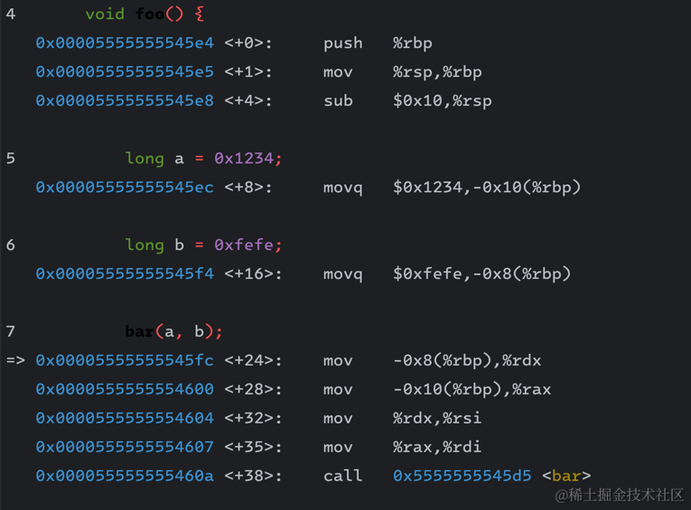


接下来我们来查看各个寄存器和堆栈中的数据布局：

```powershell
(gdb) i r rsp
rsp            0x7fffffffdf90      0x7fffffffdf90
(gdb) i r rbp
rbp            0x7fffffffdfa0      0x7fffffffdfa0
(gdb) p &a
$1 = (long *) 0x7fffffffdf90
(gdb) p &b
$2 = (long *) 0x7fffffffdf98
(gdb) x/32bx $rbp - 16
0x7fffffffdf90: 0x34    0x12    0x00    0x00    0x00    0x00    0x00    0x00  --- a
0x7fffffffdf98: 0xfe    0xfe    0x00    0x00    0x00    0x00    0x00    0x00  --- b
0x7fffffffdfa0: 0xb0    0xdf    0xff    0xff    0xff    0x7f    0x00    0x00  --- caller bp
0x7fffffffdfa8: 0x20    0x46    0x55    0x55    0x55    0x55    0x00    0x00  --- return addr
```


此时的 rbp 指向的是栈底，在高地址，栈顶大小是 0x10(16)，为了显示完整的栈空间，我们这里查看了从 rbp 再往前的总共 32 字节的数据。从低到高依次是：

*   foo 的 return addr，对应于 main 函数 foo 函数调用的下一行指令地址，也就是 foo 返回以后应该继续执行的位置；
*   caller bp 这里是 main 函数调用 foo 函数，这里的 caller bp 是 main 函数的 bp 值；
*   八字节的 long 型变量 b；
*   八字节的 long 型变量 a。

对应的栈帧布局如下：

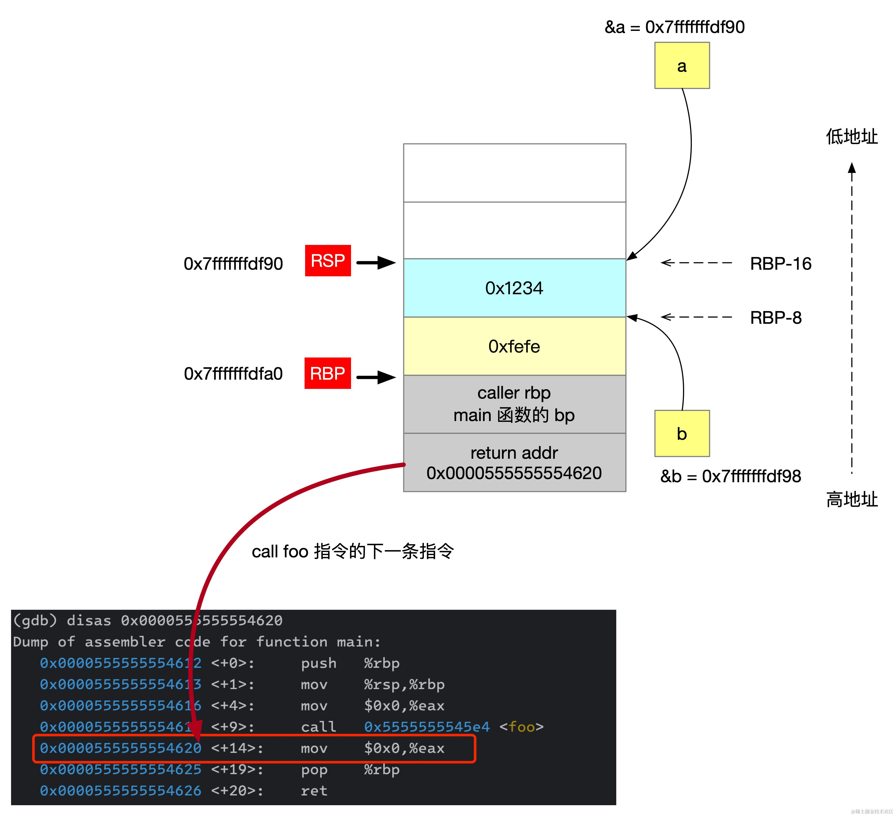

我们用一个实际的例子来看看栈的生长方向与函数调用的关系：

```c
#include <stdio.h>

void z() {
    long a = 0;
    printf("addr in z:    %p\n", &a);
}

void y() {
    long a = 0;
    printf("addr in y:    %p\n", &a);
    z();
}

void x() {
    long a = 0;
    printf("addr in x:    %p\n", &a);
    y();
}

int main() {
    long a = 0;
    printf("addr in main: %p\n", &a);
    x();
}
```

编译运行的结果如下：

```powershell
$ ./a.out 
addr in main: 0x7fffffffe020 
addr in x:    0x7fffffffe000 // 比上面小 0x20
addr in y:    0x7fffffffdfe0 // 比上面小 0x20
addr in z:    0x7fffffffdfc0 // 比上面小 0x20
```

可以看到随着函数的调用，函数中的局部变量的内存地址越来也小。


## 调用规约

调用规约（calling convention）指的是函数的调用方和被调用方对于函数调用的约定。如何传递参数、参数的顺序如何、返回值如何存储。

在 x86-64 linux 平台下使用 GCC 编译时，它优先使用 RDI、RSI、RDX、RCX、R8、 R9 寄存器传递前六个参数，然后利用栈传递其余的参数。

有趣的是 Go 语言在 Go 1.17 之前，它使用基于栈的调用约定，即函数的参数与返回值都通过栈来传递，这种方式跨平台特性好，但牺牲了性能，我们知道寄存器的访问速度要远高于内存。在 1.17 版本以后，它的调用规约也改为了基于寄存器，它们的官方测试数据是在一些典型场景，性能提升了 5%。

```c
#include <stdio.h>
#include <stdlib.h>

int add(int x, int y, int z, int a, int b, int c, int d, int e, int f, int g, int h, int l) {
    return x + y + z + a + b + c + d + e + f + g + h + l;
}

int main() {
    int res = add(1, 2, 3, 4, 5, 6, 7, 8, 9, 10, 11, 12);
    return 0;
}
```

main 函数对应的汇编代码如下：

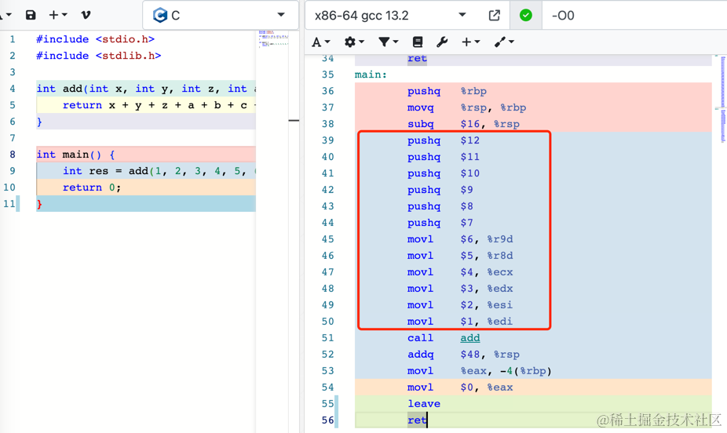

通过 `EDI、ESI、EDX、ECX、R8、 R9` 这 6 个寄存器的低 32 位传递了前 6 个参数。剩下的参数（7\~12）则通过栈传递，这里的 pushq
表示将对应的值压入函数堆栈。


## 函数与返回值

以下面这个简单的函数为例：

```c
long foo() {
    return 100;
}
```

对应的汇编如下：

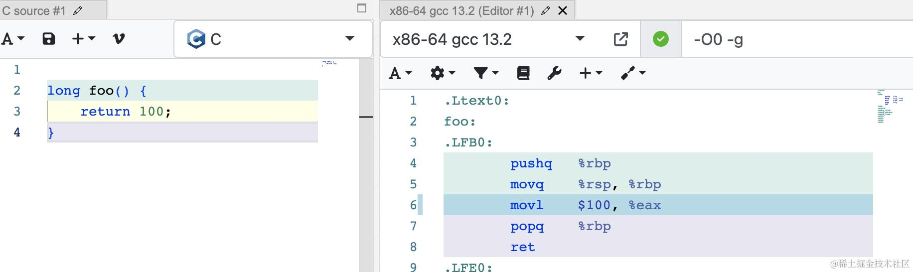

可以看到返回 100，实际上就是把 100 写入到 EAX 寄存器（RAX 的低 32 位）。

因为寄存器的长度最大是 8 字节，那如果返回的数据长度超过了 8 字节该怎么处理呢？

```c
struct Foo {
    long x[20];
};

struct Foo xyz() {
    struct Foo foo;
    return foo;
}

void abc(struct Foo *foo) {
}

void main_AAA() {
    struct Foo result = xyz();
}

void main_BBB() {
    struct Foo foo;
    abc(&foo);
}
```

这里定义了一个长度为 160 字节的结构体 Foo，xyz 函数返回了一个栈上分配的临时对象，可以看到 main\_AAA 和 main\_BBB 的汇编代码是一样的。main\_AAA 多了一行 `movl $0 %eax`，这行汇编在这里没有什么作用。

可以看到在这个场景中，返回超过 8 字节长度的函数的 xyz，实际上结构体的内存是在调用方的栈上分配的，xyz 函数只需要对结构体对象做赋值处理即可。

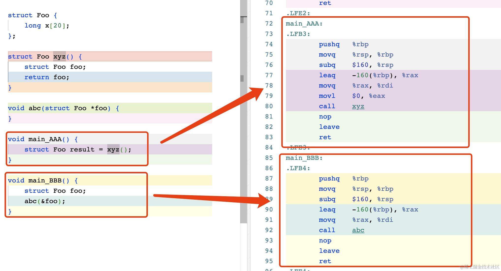

## c++ 的构造函数与析构函数

对于局部变量，当对象所在的作用域结束时，将调用对象的析构函数。对于堆中分配的对象，当调用 delete 释放对象时，也将调用对象的析构函数。

以下面代码为例，foo 是一个局部变量，当到局部作用域的末尾时，就会调用 Foo 类的析构函数。bar 是一个堆上分配的对象，当手动调用 delete 时，触发了析构函数的调用。

```cpp
#include <iostream>

class Foo {
public :
    Foo() {
        x = 100;
    }

    ~Foo() {
        std::cout << "~Foo() called" << std::endl;
    }

private:
    int x;
};

class Bar {

public:
    Bar() {
    }

    ~Bar() {
        std::cout << "~Bar() called" << std::endl;
    }
};

int main() {
    {
        Foo foo;
    }

    Bar *b = new Bar();
    delete b;
    return 0;
}
```

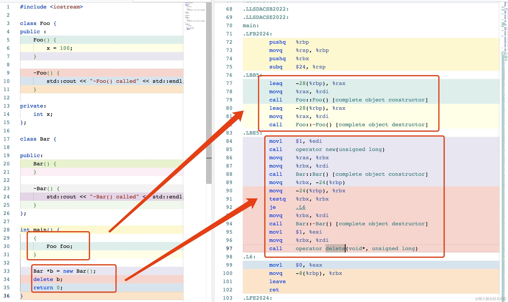

接下来我们来看下有父子继承的时候构造和析构函数的调用，以下面的代码为例：

```cpp
#include <iostream>

class Base {
public:
    Base() {
        this->x = 100;
    }

    ~Base() {
        std::cout << "~Base() called" << std::endl;
    }

private:
    long x;
};

class Foo : public Base {

public:
    Foo() {
        this->y = 200;
    }

    ~Foo() {
        std::cout << "~Foo() called" << std::endl;
    }

    void print() {
        std::cout << "hello" << this->y << std::endl;
    }

private:
    long y;
};

int main() {
    Foo foo;
    foo.print();
}
```


可以看到：

*   子类的构造函数中，会先调用父类的构造函数，然后再继续执行子类构造函数剩下的逻辑。
*   子类的析构函数中，会调用子类析构函数的逻辑，然后调用父类的析构函数。

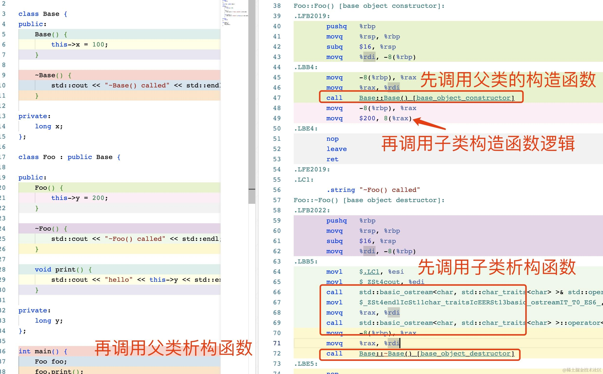


## 继承结构下的内存结构

在 C++ 中，子类对象可以直接访问父类声明为 public 和 protected 的数据变量和函数。对于 private 的成员变量，虽然子类在语法层面不能直接访问，但是在内存布局上，子类是拥有所有的父类的成员变量的。

以上一个例子的代码为例，我们使用 gdb 调试可以看到 foo 的内存布局实际上包含了父类的变量的。

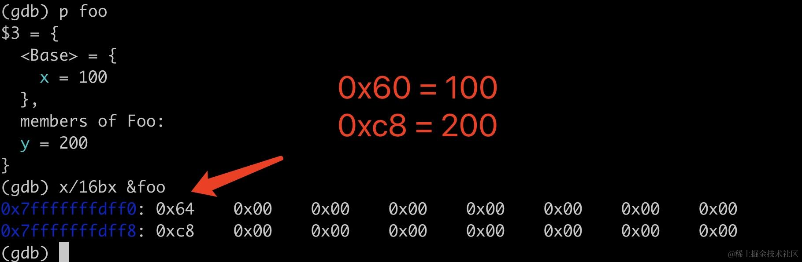

在内存上等价于这样的实现：

```cpp
class Base {...};

class Foo {
    public:
        Base base;
        long y;
}
```

## 虚函数


我们先来看下 base 对象的大小：

```powershell
(gdb) p sizeof(Base)
$1 = 88
```

大小并不是我们以为的 80，而是多了 8 个字节。查看一下此时 base 对象的内存布局：

```powershell
(gdb) p base
$1 = {
<Base> = {_vptr.Base = 0x555555755d38 <vtable for Foo+16>, 
x = {0, 0, 0, 0, 0, 0, 0, 0, 0, 0}}, <No data fields>}
```

可以看到多了一个 8 字节的 vptr 变量，这个变量是 C++ 中的虚函数表指针。这个虚函数表存储了 `getId_1`、`getId_2`、`getId_3` 函数的地址。

使用 x 命令查看虚函数表的三个指针地址：

```powershell
(gdb) x/3gx 0x555555755d38
0x555555755d38 <_ZTV3Foo+16>:	0x0000555555554aba	0x0000555555554a9a
0x555555755d48 <_ZTV3Foo+32>:	0x0000555555554aaa
```

接下来可以使用 disas 命令来查看这几个地址处的汇编指令，查看一下虚函数表是否符合我们的预期。

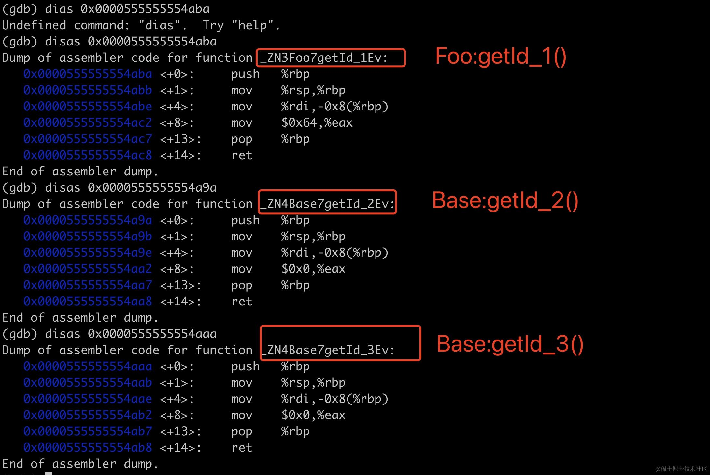

可以看到因为 Foo 实现了 getId\_1 函数，虚函数表中的函数指针也被替换了，剩下的两个函数 getId\_2 和 getId\_3 则保留了父类的函数指针。

我们也可以从方法调用上侧面印证虚函数表。下面是调用这个三个函数对应的的汇编指令，可以看到三次调用的区别就是在虚函数表指针偏移不同而已。

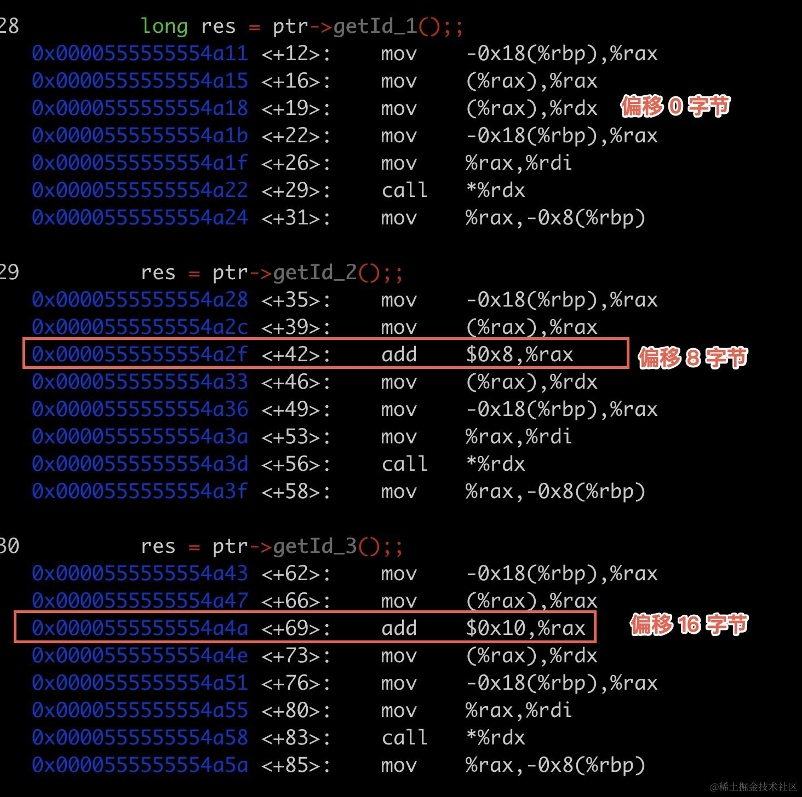

## 系统调用

Linux 下系统调用通过 syscall 指令来执行，使用 %EAX 寄存器存储系统调用编号，另外使用额外六个寄存器存储传入系统调用的参数，这几个寄存器是：

*   %EBX arg1
*   %ECX arg2
*   %EDX arg3
*   %ESI arg4
*   %EDI arg5
*   %EBP arg6

应用程序都是按「名字」来执行系统调用，比如 exit、write，底层上每个系统调用都对应一个数字，比如 exit 对应 1，write 对应 4，这些数字编号需要被存储到寄存器 %eax 中。

int 0x80 指令用来触发处理器从用户态切换到内核态，int 是 interrupt（中断）的缩写，不是整数的那个 int。内核收到 0x80 的中断请求以后，就会并根据前面准备好的寄存器的内容调用相应的系统调用。

下面这段汇编实现了通过调用 syscall 来打印 "Hello, World!" 到终端。

```powershell
.section .data

msg:
    .ascii "Hello, World!\n"

.section .text
.globl _start

_start:
    # write 的第 3个参数 count: 14
    movl $14,  %edx
    # write 的第 2 个参数 buffer: "Hello, World!\n"
    movl $msg, %ecx
    # write 的第 1 个参数 fd: 1
    movl $1,   %ebx
    #  write 系统调用本身的数字标识：4
    movl $4,   %eax
    #  执行系统调用: write(fd, buffer, count)
    int $0x80

    # status: 0
    movl $0,   %edi
    # 函数: exit
    movl $1,   %eax
    # system call: exit(status)
    int $0x80
```

然后使用 as 和 ld 将汇编代码编译链接为可执行文件：

```powershell
as test.s -o test.o
ld test.o -o test
./test

Hello, World!
```

这个过程如下所示：

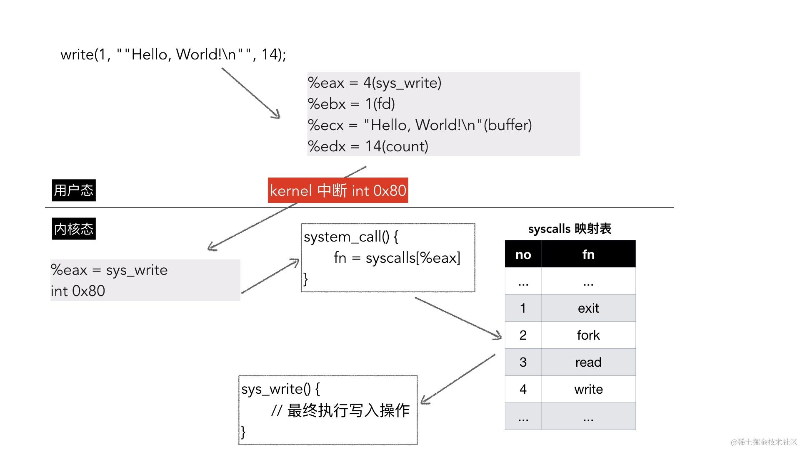


## 从汇编看 this 指针

为了让你更直观地理解 this 指针的作用，我写了两个函数，一个是 Foo 类的成员函数 bar，一个是普通的函数 xyz，可以看到这两个函数的汇编代码一模一样，可以认为这两者其实是在做同一件事情。

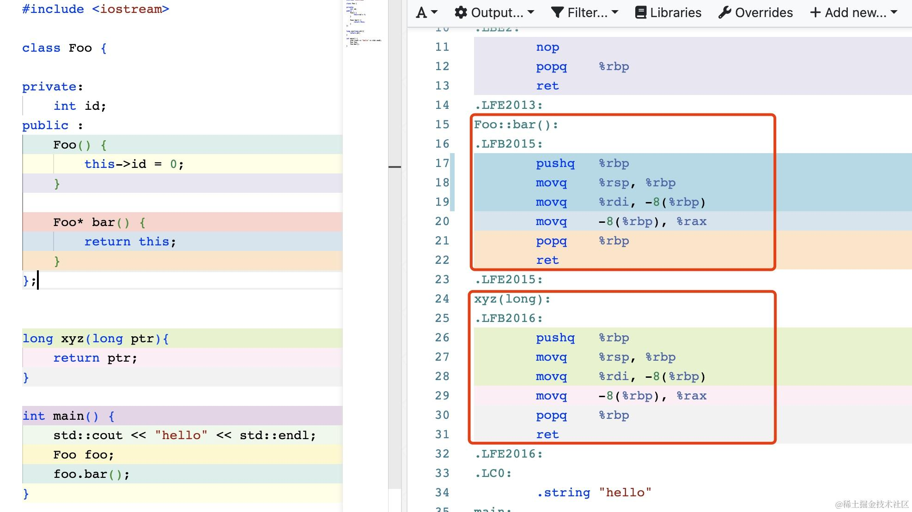

神秘的 this 指针无非是一个语法糖，其实就是一个 8 字节长度的指针，等价于成员函数的第一个参数永远是 this，只是这个 this 被语法糖省略了而已。

```cpp
class Foo {
    Foo* bar() {
        return this;
    }
}
```

等价于：

```cpp
Foo* bar(Foo* this_) {
    return this_;
}
```

## 小结

这篇文章简单介绍如何通过汇编理解函数调用、系统调用，通过汇编来理解 C/C++ 中的一些概念，希望可以帮助你理解编程语言和计算机实现基础。
