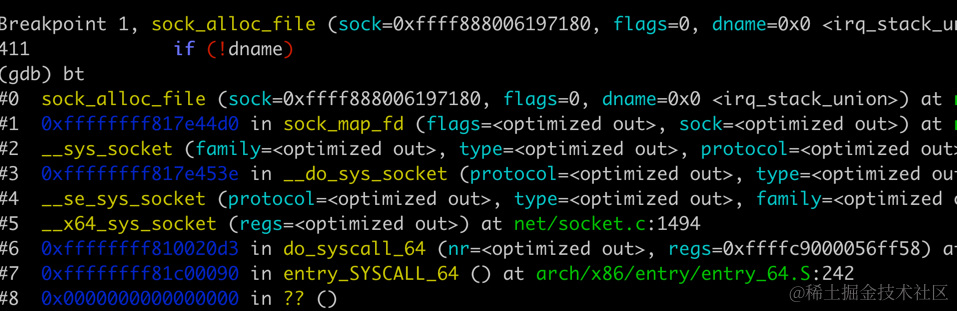
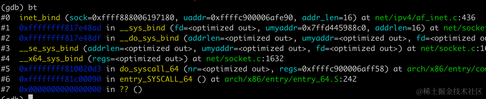
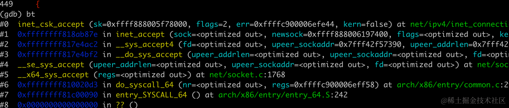

万物互联的时代，无论是构建服务端应用程序还是客户端应用程序,网络编程都扮演着关键角色。然而,对于大多数开发人员来说,网络编程的底层细节往往显得晦涩难懂。本文将揭开网络编程的神秘面纱,深入探讨在Linux系统中进行网络编程时,诸如创建套接字
socket、bind、listen、accept、connect等操作的底层源码实现原理。

通过对这些基本操作的剖析,希望你可以获得对网络编程更深刻的理解,从而能够编写出更高效、更可靠的网络应用程序。本节的内容基于
linux 4.19 版本的内核，在源码中我尽量删除了对于理解主线流程不相关的代码，你可以自行去找完整的实现源码。

## 创建套接字的底层实现

在做网络编程中，我们最先需要创建一个套接字，基于这个套接字进行后续的读写操作。这里我们来详细介绍创建一个套接字在 linux
中发生了什么。

linux 提供了一个系统调用用来创建 socket，libc 中 封装了 socket 函数：

```c
#include <sys/socket.h>
int socket(int domain, int type, int protocol);
```

其中

*   domain: 协议族,常见的有：UNIX (AF\_UNIX)、IPv4 (AF\_INET)、IPv6 (AF\_INET6)
*   type: 表示 socket 类型，常见的有流 socket（SOCK\_STREAM）、数据报 socket（SOCK\_DGRAM）
*   protocol: 指定协议,通常设置为0以使用默认协议

我们知道在 linux 中一切皆文件，统一通过 VFS 层进行操作，socket 也不例外，那 socket
是如何与文件做关联的呢？这个操作是在 `net/socket.c`
文件的 `sock_alloc_file` 函数中完成的。

调用的堆栈如下：



这个函数的详细注释如下：

```c
struct file *sock_alloc_file(struct socket *sock, int flags, const char *dname)
{
    // 声明一个指向struct file的指针。
    struct file *file;

    // 分配一个伪文件(pseudo file),并将 socket 的 inode 与之关联
    // socket_file_ops是文件操作的函数指针集合，定义了文件操作的行为。
    file = alloc_file_pseudo(SOCK_INODE(sock), sock_mnt, dname,
                O_RDWR | (flags & O_NONBLOCK),
                &socket_file_ops);

    // 将新分配的 file 结构体与 socket 双向绑定
    
    // 如果文件创建成功，将sock结构体中的file指针设置为新创建的file。
    // 这样socket和文件之间就建立了关联。
    sock->file = file;
    
    // 设置file结构体中的private_data字段，使其指向sock。
    // 这样可以通过文件结构体访问到socket结构体。
    file->private_data = sock;
    return file;
}
```

## bind 函数底层做了什么

我们在写 tcp 服务时，一般都是先创建 socket，然后 bind 再 listen，那 bind 这一步是做什么的呢？下面我来详细看一下。

bind 用于将一个 socket 绑定到一个地址 同 socket 一样，bind 也是一个系统调用，它的定义如下：

```c
#include <sys/socket.h>

int bind(int sockfd, const struct sockaddr *addr,
    socklen_t addrlen);
```

精简后的内核实现如下：

```c
int __sys_bind(int fd, struct sockaddr __user *umyaddr, int addrlen)
{
    struct socket *sock;
    struct sockaddr_storage address;
    int err;

    // 根据文件描述符fd查找对应的 socket
    sock = sockfd_lookup_light(fd, &err, &fput_needed);
    if (sock) {
        // 将用户空间的sockaddr结构体复制到内核空间的address中
        err = move_addr_to_kernel(umyaddr, addrlen, &address);
        
        // 调用sock->ops->bind绑定socket到指定的地址
        // sock->ops包含了协议相关的操作,如TCP或UDP的bind操作是 inet_bind
        err = sock->ops->bind(sock, (struct sockaddr *) &address, addrlen);
    }
    return err;
}
```

它主要流程是：

*   通过文件描述符 fd 查找对应的 socket 结构体
*   将用户空间的 sockaddr 结构体拷贝到内核空间
*   调用协议相关的 bind 函数执行真正的绑定 socket 到指定的地址

前面介绍过 socket 和 file 对象的双向绑定，这里的 sockfd\_lookup\_light 就是通过整型的 fd 值去找 socket 结构体。

```c
static struct socket *sockfd_lookup_light(int fd, int *err, int *fput_needed)
{
    // 通过 fd 整型值获取 fd 结构体对象,里面包含了 file 结构体指针
    struct fd f = fdget(fd);
    struct socket *sock;

    // 如果存在
    if (f.file) {
        // 通过 file 结构体 private_data 字段获取 socket 结构体指针
        sock = sock_from_file(f.file, err);
        return sock;
    }
    return NULL;
}
```

这里值得注意的是 sock->ops 是 socket 的函数操作指针集合，包含了connect、bind、accept 等，因为不同的 socket
类型可能需要调用不同的函数，如TCP或UDP的bind操作是 `inet_bind`



```c
#define PROT_SOCK    1024

int __inet_bind(struct sock *sk, struct sockaddr *uaddr, int addr_len,
        bool force_bind_address_no_port, bool with_lock)
{
    struct sockaddr_in *addr = (struct sockaddr_in *)uaddr;
    // 转换指针为 struct inet_sock 类型
    struct inet_sock *inet = inet_sk(sk);
    struct net *net = sock_net(sk);
    unsigned short snum;
    int chk_addr_ret;
    int err;
    
    // 检查是否允许绑定非本地地址
    if (!inet_can_nonlocal_bind(net, inet) &&
        addr->sin_addr.s_addr != htonl(INADDR_ANY) &&
        chk_addr_ret != RTN_LOCAL &&
        chk_addr_ret != RTN_MULTICAST &&
        chk_addr_ret != RTN_BROADCAST)
        goto out;

    // 获取传入的源端口号(将网络字节序转换为主机字节序)
    snum = ntohs(addr->sin_port);
    
    // 如果源端口号小于 1024(保留端口范围), 则需要判断是否有相应的权限
    if (snum && snum < PROT_SOCK &&
        !ns_capable(net->user_ns, CAP_NET_BIND_SERVICE))
        goto out;
    
    // 判断 socket 的状态，必须要是 TCP_CLOSE 状态,避免重复绑定
    if (sk->sk_state != TCP_CLOSE || inet->inet_num)
        goto out_release_sock;

    
    // 如果传入了端口号，则需要占用此端口，如果此端口占用失败，则返回 EADDRINUSE 失败
    if (snum) {
        // 尝试占用指定的端口号,判断端口是否可用
        if (sk->sk_prot->get_port(sk, snum)) {
            err = -EADDRINUSE;
            goto out_release_sock;
        }
    }

    // 设置inet_sport为绑定的端口号
    inet->inet_sport = htons(inet->inet_num);
    
    // 重置inet_daddr、inet_dport和sk_dst
    inet->inet_daddr = 0;
    inet->inet_dport = 0;
    
    return err;
}
```

bind 主要流程如下：

*   做一些校验，比如判断 socket 状态等
*   判断是否有权限绑定相应的端口号和 IP 地址
*   如果有传入端口号，判断端口号是否可用
*   为 inet\_sock 结构体赋值

## listen 的底层实现

服务端在调用 bind 以后绑定特定的端口，需要调用 listen 来监听端口,当服务端调用 listen 函数时，TCP 的状态被从 CLOSE 状态变为
LISTEN。

```c
#include <sys/socket.h>

int listen(int sockfd, int backlog);
```

其中：

*   sockfd 表示 socket 的文件描述符
*   backlog 用来指定全连接的队列的大小，指定了但又没完全指定。全连接队列的大小还与系统配置有关,同时这个值还会影响半连接队列的大小。

```c
int __sys_listen(int fd, int backlog)
{
    struct socket *sock;
    int err, fput_needed;
    int somaxconn;

    // 通过文件描述符fd来查找对应的套接字
    sock = sockfd_lookup_light(fd, &err, &fput_needed);
    if (sock) {
        // 读取 socket 关联的网络命名空间的 sysctl_somaxconn 配置值
        somaxconn = sock_net(sock->sk)->core.sysctl_somaxconn;
        // 检查传入的backlog值是否大于somaxconn。如果是，将backlog的值减小到somaxconn，以避免超过系统允许的最大值。
        if ((unsigned int)backlog > somaxconn)
            backlog = somaxconn;
            
        // 调用 sock 关联的 ops 的 listen 函数,对于 TCP 这个函数是 inet_listen
        err = sock->ops->listen(sock, backlog);
    }
    return err;
}
```

```c

/*
 *    Move a socket into listening state.
 */
int inet_listen(struct socket *sock, int backlog)
{
    struct sock *sk = sock->sk;
    unsigned char old_state;
    int err, tcp_fastopen;

    err = -EINVAL;

    old_state = sk->sk_state;
    // 如果 socket 的状态不是 CLOSE 或 LISTEN，则返回错误
    if (!((1 << old_state) & (TCPF_CLOSE | TCPF_LISTEN)))
        goto out;

    /* Really, if the socket is already in listen state
     * we can only allow the backlog to be adjusted.
     */
     // 如果已经是监听状态，则只需要更新 backlog 的值
    if (old_state != TCP_LISTEN) {
        // 调用 inet_csk_listen_start 执行真正的监听
        err = inet_csk_listen_start(sk, backlog);
    }
    // 更新 backlog 值
    sk->sk_max_ack_backlog = backlog;
    err = 0;

    release_sock(sk);
    return err;
}
```

`inet_csk_listen_start` 主要工作是初始化 accept 队列，处理套接字相关的端口分配、设置套接字状态为 LISTEN、哈希表添加等。

```c
int inet_csk_listen_start(struct sock *sk, int backlog)
{
    struct inet_connection_sock *icsk = inet_csk(sk);
    struct inet_sock *inet = inet_sk(sk);
    int err;

    // 为 accept 队列分配必要的资源
    reqsk_queue_alloc(&icsk->icsk_accept_queue);

    // 更新 backlog 值
    sk->sk_max_ack_backlog = backlog;
    
    sk->sk_ack_backlog = 0;
    inet_csk_delack_init(sk);

    /* There is race window here: we announce ourselves listening,
     * but this transition is still not validated by get_port().
     * It is OK, because this socket enters to hash table only
     * after validation is complete.
     */
    err = -EADDRINUSE;
    // 将套接字状态设置为 TCP_LISTEN
    inet_sk_state_store(sk, TCP_LISTEN);
    
    // 尝试获取一个端口号。如果成功（get_port 返回0）
    if (!sk->sk_prot->get_port(sk, inet->inet_num)) {
        // 设置套接字的源端口号
        inet->inet_sport = htons(inet->inet_num);

        // 将套接字加入哈希表
        err = sk->sk_prot->hash(sk);
        return 0;
    }

    // 如果前面的处理失败，则设置套接字状态为 CLOSE
    inet_sk_set_state(sk, TCP_CLOSE);
    return err;
}
```

至此，套接字已经为接受新连接做好了准备，接下来应用层就可以通过 accept 来从接受客户端的连接。

## accept 的底层实现

accept 在 `net/socket.c`的 `__sys_accept4`函数中实现：

```c
int __sys_accept4(int fd, struct sockaddr __user *upeer_sockaddr,
          int __user *upeer_addrlen, int flags)
{
    struct socket *sock, *newsock;
    struct file *newfile;
    int err, len, newfd, fput_needed;
    struct sockaddr_storage address;

    // 通过文件描述符 fd 获取监听套接字的 socket 结构
    sock = sockfd_lookup_light(fd, &err, &fput_needed);
    
    // 分配一个新的 socket 结构用于新连接
    newsock = sock_alloc();

    // 获取一个未使用的文件描述符用于新连接
    newfd = get_unused_fd_flags(flags);
    
    // 为新套接字分配一个文件 struct file 结构
    newfile = sock_alloc_file(newsock, flags, sock->sk->sk_prot_creator->name);

    // 调用协议特定的 accept 操作来接受新连接,不同的套接字类型，accept 实现可能不一样
    err = sock->ops->accept(sock, newsock, sock->file->f_flags, false);

    // 把对端（客户端）连接的地址复制到用户空间缓冲区中
    err = move_addr_to_user(&address, len, upeer_sockaddr, upeer_addrlen);

    // 将新的 fd 和 struct file 做关联
    fd_install(newfd, newfile);
    
    return newfd;
}
```

对于 AF\_INET 协议族来, accept 的实现是 `inet_accept`。

```c
// sock 表示监听套接字， newsock 表示新建立的套接字
int inet_accept(struct socket *sock, struct socket *newsock, int flags,
        bool kern)
{
    struct sock *sk1 = sock->sk;
    int err = -EINVAL;
    
    // 调用底层协议的 accept 操作,尝试从已完成连接队列中取出一个新连接
    struct sock *sk2 = sk1->sk_prot->accept(sk1, flags, &err, kern);

    // 将新的 sock 与调用者传进来的 socket 关联起来
    sock_graft(sk2, newsock);

    // 设置新连接的状态为 CONNECTED
    newsock->state = SS_CONNECTED;
    err = 0;
    release_sock(sk2);
    return err;
}
```

对于不同的协议，sk\_prot->accept 函数的实现可能不一样，对于 TCP 协议来说，这个 accept
的实现是 `net/ipv4/inet_connection_sock.c` 文件的 `inet_csk_accept` 函数。

```c
struct proto tcp_prot = {
    .name            = "TCP",
    .owner            = THIS_MODULE,
    .close            = tcp_close,
    .pre_connect        = tcp_v4_pre_connect,
    .connect        = tcp_v4_connect,
    .disconnect        = tcp_disconnect,
    .accept            = inet_csk_accept, // accept 的实现
    .ioctl            = tcp_ioctl,
     ...
}
```

可以通过 qemu 调试来验证上面的结论

inet\_csk\_accept 精简过的代码如下

```c
struct sock *inet_csk_accept(struct sock *sk, int flags, int *err, bool kern)
{
    struct inet_connection_sock *icsk = inet_csk(sk);
    // accept 队列
    struct request_sock_queue *queue = &icsk->icsk_accept_queue;
    struct request_sock *req;
    struct sock *newsk;
    int error;

    error = -EINVAL;
    
    // 如果 accept 接队列为空，根据套接字是否设置非阻塞以及超时时间来决定是否需要阻塞等待
    if (reqsk_queue_empty(queue)) {
        // 获取 sk 的超时时间，非阻塞模式下超时时间 timeo 为 0
        long timeo = sock_rcvtimeo(sk, flags & O_NONBLOCK);

        /* If this is a non blocking socket don't sleep */
        // 如果是非阻塞的套接字，没有新连接可以取走，则 accept 退出，返回错误码 EAGAIN
        error = -EAGAIN;
        // 如果超时为 0，则立刻退出
        if (!timeo)
            return error;

        // 等待连接建立,直到有新连接或者超时
        error = inet_csk_wait_for_connect(sk, timeo);
        if (error)
            return error;
    }
    // 到这里时，accept 队列不为空，从 accept 队列中移除一个连接请求
    req = reqsk_queue_remove(queue, sk);
    
    // 把 accept 队列中取出的 socket 赋值给 newsk
    newsk = req->sk;
    return newsk;
}
```

## connect 的底层实现

```c
int __sys_connect(int fd, struct sockaddr __user *uservaddr, int addrlen)
{
    struct socket *sock;
    struct sockaddr_storage address;
    int err, fput_needed;

    // 根据文件描述符 fd 查找 sock
    sock = sockfd_lookup_light(fd, &err, &fput_needed);
    
    // 将用户空间传入的 sockaddr 地址拷贝到内核空间
    err = move_addr_to_kernel(uservaddr, addrlen, &address);

    // 调用协议族特定的 connect 函数
    err = sock->ops->connect(sock, (struct sockaddr *)&address, addrlen,
                 sock->file->f_flags);
    return err;
}
```

对于 tcp 而言，其实现是 `inet_stream_connect`

```c

对应 tcp
const struct proto_ops inet_stream_ops = {
    .family           = PF_INET,
    .owner           = THIS_MODULE,
    .release       = inet_release,
    .bind           = inet_bind,
    .connect       = inet_stream_connect,
    .accept           = inet_accept,
    .ioctl           = inet_ioctl,
    .listen           = inet_listen,
    ...
}

// 对应 udp
const struct proto_ops inet_dgram_ops = {
    .family           = PF_INET,
    .owner           = THIS_MODULE,
    .release       = inet_release,
    .bind           = inet_bind,
    .connect       = inet_dgram_connect,
    .socketpair       = sock_no_socketpair,
    .accept           = sock_no_accept,
    .getname       = inet_getname,
    .listen           = sock_no_listen,
}
```

inet\_stream\_connect 精简过的代码逻辑如下

```c
int __inet_stream_connect(struct socket *sock, struct sockaddr *uaddr,
              int addr_len, int flags, int is_sendmsg)
{
    struct sock *sk = sock->sk;
    int err;
    long timeo;

    switch (sock->state) {
    default:
        err = -EINVAL;
        goto out;
    case SS_UNCONNECTED:
        err = -EISCONN;
        if (sk->sk_state != TCP_CLOSE)
            goto out;

        // 调用协议相关的 connect 函数
        err = sk->sk_prot->connect(sk, uaddr, addr_len);
        if (err < 0)
            goto out;

        // 修改 socket 的状态为 CONNECTING
        sock->state = SS_CONNECTING;

        // 设置错误码为 EINPROGRESS，非阻塞状态未就绪时返回这个错误 
        err = -EINPROGRESS;
        break;
    case SS_CONNECTED:
        // 如果连接已建立，则返回错误
        // ...
    case SS_CONNECTING:
        // ...
    }

    // 获取 connect 的超时时间,非阻塞状态返回 0
    timeo = sock_sndtimeo(sk, flags & O_NONBLOCK);

    // 如果套接字状态为 SYN_SENT 或 SYN_RECV，检查是否需要等待连接完成
    if ((1 << sk->sk_state) & (TCPF_SYN_SENT | TCPF_SYN_RECV)) {
        /* Error code is set above */
        // 非阻塞状态下 timeo 为 0, 阻塞等待直到连接成功或 timeout
        if (!timeo || !inet_wait_for_connect(sk, timeo))
            return err;
    }

    sock->state = SS_CONNECTED;
    err = 0;
    return err;
}
```

对于 tcp 来说这里协议相关的 connect 的实现是 `tcp_v4_connect`

```c
int tcp_v4_connect(struct sock *sk, struct sockaddr *uaddr, int addr_len)
{
    struct sockaddr_in *usin = (struct sockaddr_in *)uaddr;
    struct inet_sock *inet = inet_sk(sk);
    struct tcp_sock *tp = tcp_sk(sk);
    __be16 orig_sport, orig_dport;
    __be32 daddr, nexthop; // 目标地址和下一跳地址
    struct flowi4 *fl4; 
    struct rtable *rt; // 路由表项
    int err;
    struct ip_options_rcu *inet_opt;
    struct inet_timewait_death_row *tcp_death_row = &sock_net(sk)->ipv4.tcp_death_row;
```


```c
    // 初始化目的IP地址和下一跳IP地址，比如传入的 192.168.31.197
    nexthop = daddr = usin->sin_addr.s_addr;
    inet_opt = rcu_dereference_protected(inet->inet_opt,
                         lockdep_sock_is_held(sk));

    orig_sport = inet->inet_sport;
    // orig_dport 目标端口，比如 192.168.31.197:8080 中的 8080
    orig_dport = usin->sin_port;
    fl4 = &inet->cork.fl.u.ip4;
    
    // 查找路由
    rt = ip_route_connect(fl4, nexthop, inet->inet_saddr,
                  RT_CONN_FLAGS(sk), sk->sk_bound_dev_if,
                  IPPROTO_TCP,
                  orig_sport, orig_dport, sk);
                  
    // 如果查找路由失败（经查路由表不可达）,则返回错误
    if (IS_ERR(rt)) {
        return err;
    }

    if (!inet_opt || !inet_opt->opt.srr)
        daddr = fl4->daddr;

    if (!inet->inet_saddr)
        inet->inet_saddr = fl4->saddr;
    sk_rcv_saddr_set(sk, inet->inet_saddr);

    // 设置目的端口
    inet->inet_dport = usin->sin_port;
    // 设置目的IP地址
    sk_daddr_set(sk, daddr);

    inet_csk(sk)->icsk_ext_hdr_len = 0;
    if (inet_opt)
        inet_csk(sk)->icsk_ext_hdr_len = inet_opt->opt.optlen;

    // 设置MSS上限为默认值 TCP_MSS_DEFAULT(536)
    tp->rx_opt.mss_clamp = TCP_MSS_DEFAULT;

    // 设置TCP状态为SYN_SENT
    tcp_set_state(sk, TCP_SYN_SENT);
    // 查找一个可用的源端口， 并记录到哈希表
    err = inet_hash_connect(tcp_death_row, sk);

    sk_set_txhash(sk);

    // 重新获取路由以匹配新端口
    rt = ip_route_newports(fl4, rt, orig_sport, orig_dport,
                   inet->inet_sport, inet->inet_dport, sk);
                   
    // 设置GSO类型
    sk->sk_gso_type = SKB_GSO_TCPV4;
    // 设置套接字能力
    sk_setup_caps(sk, &rt->dst);

    // 如果没有设置初始序列号，生成一个
    if (!tp->write_seq) {
        tp->write_seq = secure_tcp_seq(inet->inet_saddr,
                              inet->inet_daddr,
                              inet->inet_sport,
                              usin->sin_port));
    }

    // 生成一个随机 inet_id
    inet->inet_id = prandom_u32();

    // 发送 SYN 报文
    err = tcp_connect(sk);

    return 0;
}
```

我们来做一个实验，对比访问本机的 ip 和外部 ip 对于此时路由策略的影响。

```powershell
# ip route
default via 10.0.3.1 dev eth0
10.0.3.0/24 dev eth0 scope link  src 10.0.3.2
```

比如在我的测试机器上访问外部服务 `nc 192.168.31.197 8080`，通过查找路由表，将通过IP地址为10.0.3.1的默认网关,使用名为eth0的网络接口发送出去

```powershell
(gdb) pt rt
type = struct rtable {
    struct dst_entry dst;
    int rt_genid;
    unsigned int rt_flags;
    __u16 rt_type;
    __u8 rt_is_input;
    __u8 rt_uses_gateway;
    int rt_iif;
    __be32 rt_gateway;
    u32 rt_mtu_locked : 1;
    u32 rt_pmtu : 31;
    struct list_head rt_uncached;
    struct uncached_list *rt_uncached_list;
} *

(gdb) p rt.rt_uses_gateway
$30 = 1 '\001'

(gdb) p rt.dst.dev.name
$32 = "eth0\000\000\060:03.0\000\000\000"
```

如果我们访问的是本机的服务 `nc 127.0.0.1 8080`,可以看到此时没有路由策略不使用网关，使用本机 lo 网络接口进行处理。

```powershell
(gdb) p rt.rt_uses_gateway
$37 = 0 '\000'
(gdb) p rt.dst.dev.name
$38 = "lo", '\000' <repeats 13 times>
```

本文详细介绍了Linux系统中网络编程的底层实现原理,包括创建套接字、绑定地址端口、监听连接请求、接受连接以及建立连接等关键步骤。通过追踪内核源代码,我们一窥网络编程在内核层面的工作机制.揭示了这些看似简单的API调用背后的复杂细节

深入了解这些底层原理,不仅能让我们对网络编程有更透彻的认识,也有助于我们在遇到网络相关问题时能够更好地分析和定位问题根源.
