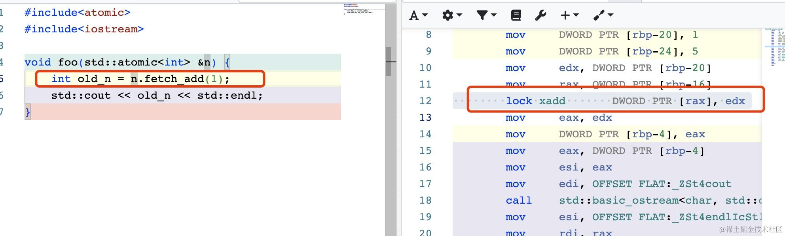

原子操作是并发编程中的一个核心概念，它确保了即使在多线程环境下某个操作要么完全执行，要么完全不执行，不会出现中间状态。这种特性对于保证数据的一致性和系统的稳定性至关重要。

在现代编程语言中，原子操作通常由特定的库或语言结构提供支持，例如
Java 中的 AtomicInteger 类或 Go 语言中的 sync/atomic 包。要深入理解原子操作的工作原理，我们需要探究其在汇编语言层面的实现。

以下面的 go 代码为例：

```go
package main

import (
	"sync/atomic"
)

func main() {
	a := int32(10)
	ok := atomic.CompareAndSwapInt32(&a, 10, 100)
	println(ok, a)
}
```

这段代码尝试原子地将变量 a 的值从 10 更改为 100。如果 a 的当前值与期望值 10 相等，则更新成功，ok 返回 true；否则，更新失败，ok
返回 false。

使用 GDB 的 disas 命令，我们可以查看 main 函数对应的汇编代码：

```powershell
mov    %rax,%rcx
mov    $0xa,%eax
mov    $0x64,%edx
lock cmpxchg %edx,(%rcx)
```

在这段汇编代码中，我们看到了两个关键的指令：`lock` 和 `cmpxchg`。接下来我们将详细介绍这两个指令的工作原理和用法。


## cmpxchg 指令

cmpxchg 是 Compare and Exchange 的缩写，它是实现原子操作的关键汇编指令之一，在多线程编程中，cmpxchg 被广泛用于构建无锁数据结构和同步机制。

cmpxchg 指令的典型语法如下：

```powershell
cmpxchg dst, src
```

其中，dst 是目标内存地址，src 通常是一个通用寄存器。cmpxchg 指令的工作流程如下：

*   将 EAX 寄存器的值与 dst 指向的内存值进行比较。
*   如果两者相等，则将 src 寄存器的值复制到 dst 指向的内存地址中，同时将寄存器 ZF 标志位置为 1。
*   如果两者不相等，则将 dst 指向的内存值复制到 EAX 寄存器中，同时清除 ZF 标记位（置为 0）。

可以用下面这段伪代码来表示：

```c
if (dst == $EAX) {
    ZF = 1;  // flag register
    dst = src
} else {
    ZF = 0;
    $EAX = dst
}
```

我们来用 GDB 实际运行一下相关的代码，体验 cmpxchg 前后 ZF 标志位和 EAX DST 的变化。

```cpp
#include <atomic>
#include<iostream>


int main(int argc, char *argv[]) {
    if (argc != 2) {
        std::cerr << "Usage: " << argv[0] << " <number>" << std::endl;
        return 1;
    }
    int num = atoi(argv[1]);

    std::atomic<int> n;
    std::atomic_init(&n, num);

    int expected = 10;
    int desired = 100;
    n.compare_exchange_strong(expected, desired);
    std::cout << "new:" << n << std::endl;
    return 0;
}
```

启动 GDB 调试我们的 C++ 程序：

```powershell
$ gdb ./a.out

(gdb) b main
Breakpoint 1 at 0x9e5: file atomic_test_01.cpp, line 5
```

接下来我们使用 `r 10`指定程序的输入参数为 10，类似于执行 `./a.out 10`：

```powershell
(gdb) r 10
Starting program: /data/a.out 

Breakpoint 1, main (argc=1, argv=0x7fffffffe088) at atomic_test_01.cpp:5
5       int main(int argc, char *argv[]) {

```

接下来使用 `disas` 查看 main 函数的汇编：

```powershell
(gdb) disas 
Dump of assembler code for function main(int, char**):
   0x00005555555549d5 <+0>:     push   %rbp
   0x00005555555549d6 <+1>:     mov    %rsp,%rbp
...
   0x0000555555554ae5 <+272>:   mov    %eax,-0x2c(%rbp)
   0x0000555555554ae8 <+275>:   mov    -0x3c(%rbp),%edx
   0x0000555555554aeb <+278>:   mov    -0x28(%rbp),%rcx
   0x0000555555554aef <+282>:   mov    -0x20(%rbp),%rax
   0x0000555555554af3 <+286>:   mov    (%rax),%eax
   0x0000555555554af5 <+288>:   lock cmpxchg %edx,(%rcx)
   0x0000555555554af9 <+292>:   mov    %eax,%edx
```

接下在 `lock cmpxchg` 处的指令前后加断点：

```powershell
(gdb) b *0x0000555555554af5
Breakpoint 2 at 0x555555554af5: file /usr/include/c++/11/bits/atomic_base.h, line 571.
(gdb) b *0x0000555555554af9
Breakpoint 3 at 0x555555554af9: file /usr/include/c++/11/bits/atomic_base.h, line 571.
```

然后使用 `c` 让程序运行到断点处（lock cmpxchg 汇编前） `0x0000555555554af5`。

其中 eax 寄存器表示比较 expected 的值（10），edx 表示 desired 的值（100），rcx 表示变量 n 的地址。

`lock cmpxchg %edx,(%rcx)` 这段汇编的含义是：首先 lock 前缀确保该指令是原子执行的，不会被其他 CPU 中断。然后执行 cmpxchg。

*   将 rcx 寄存器指向的内存地址处的值（10）与 eax 寄存器的值（10）进行比较，也就比较原子变量 n 的值与 eax 寄存器的值。
*   如果 n==\$eax，则将 edx 寄存器的值（100）写入到该 rcx 内存地址处，也就是给 n 赋值为 100，同时将 ZF 标志位设置为 1。
*   如果 n!=\$eax，则会把 n 的值赋值给 $eax，同时将 ZF 标志位重置为 0。

接下来我们来查看 cmpxchg 这行汇编执行前的参与的关键寄存器值：

```powershell
(gdb) p &n
$21 = (std::atomic<int> *) 0x7fffffffdf3c

(gdb) p/x $rcx
$27 = 0x7fffffffdf3c
(gdb) p/x *$rcx
$28 = 10
(gdb) p $edx
$29 = 100
(gdb) p $eax
$30 = 10
(gdb) i r eflags
eflags         0x206               [ PF IF ]
```

然后执行 `ni`，执行 `lock cmpxchg %edx,(%rcx)` 单行汇编，再次查看各关键寄存器值：

```powershell
(gdb) p/x $rcx
$31 = 0x7fffffffdf3c
(gdb) p *$rcx // changes here
$32 = 100
(gdb) p $edx
$33 = 100
(gdb) p $eax // no changes
$34 = 10
(gdb) i r eflags
eflags         0x246               [ PF ZF IF ]  // ZF changes here
```

可以看到在参数 n 为 10 的情况下，经过 `cmpxchg` 指令，因为和 expected 相等，所以会对 rcx 指向的地址处赋值为目标值 100，同时把
ZF 标志位设置为 1。

此时我们用 n 为 1234 再来运行一遍，在执行 `cmpxchg` 之前：

```powershell
(gdb) p/x $rcx
$34 = 0x7fffffffdf3c
(gdb) p *$rcx
$35 = 1234
(gdb) p $edx
$36 = 100
(gdb) p $eax
$38 = 10
(gdb) i r eflags
eflags         0x206               [ PF IF ]
```

执行 `cmpxchg` 之后：

```powershell
(gdb) p/x $rcx
$34 = 0x7fffffffdf3c
(gdb) p *$rcx // no changes
$41 = 1234
(gdb) p $edx
$42 = 100
(gdb) p $eax
$43 = 1234  // changes here
(gdb) i r eflags
eflags         0x283               [ CF SF IF ] // no ZF changes here
```

可以看到此时在参数 n 为 1234 的情况下，经过 `cmpxchg` 指令，因为和 expected 不相等，所以不会对 rcx 指向的地址处赋值为目标值
100，此时会把 eax 处的值赋值为 n（1234），同时为重置 ZF 标志位为 0。

为了加深理解，我们来继续用 cmpxchg 来实现一下原子的 compare-and-swap，实现类似下面代码的逻辑：

```c++
bool compare_and_swap(int *x, int a, int b) {
    if (*x == a) {
        *x = b;
        return true;
    }
    return false;
}
```

我们需要实现的函数是：

```c
extern "C" bool compare_and_swap(std::atomic<int> *x, int a, int b);
```

根据 x86-64 的函数调用规约，GCC 通过 RDI、RSI、RDX、RCX、R8 以及 R9 这几个寄存器传递函数的前 6 个参数，RAX 寄存器表示返回值，因此
x，a，b 分别对应
RDI、ESI、EDX 这三个寄存器，为了调用 cmpxchg 指令，我们需要做的首先将 esi 也就是 a 的值（expected）存入 eax 寄存器。然后调用
cmpxchg 来实现 cas 操作，完整的汇编代码如下：

```powershell
; bool compare_and_swap(std::atomic<int>* x, int a, int b)
;
; Atomically compares the value at the memory location pointed to by x
; with the value a. If they are equal, the value b is stored at the
; memory location pointed to by x. The original value at the memory
; location is returned.
;
; Arguments:
;   x (rdi) - pointer to the atomic integer value to be compared and swapped
;   a (esi) - the value to compare with
;   b (edx) - the new value to swap in if the comparison succeeds
;
; Returns:
;   The true or false to indicate success/failure

section .text
global compare_and_swap

compare_and_swap:
    mov eax, esi        ; Move a into eax
    lock cmpxchg [rdi], edx ; Atomically compare *x with eax
                        ; If equal, swap in rdx (b)
                        ; Otherwise, load *x into eax
    setz al             ; Set al to 1 if ZF = 1, 0 otherwise
    ret                 ; Return the original value of *x and success/failure flag
```

其中 `setz al` 用来设置返回值， 这里的 AL 寄存器表示 AX 寄存器的低 8 位，经常用于存储和传递较小的数据值，如单个字符或布尔值。在条件设置指令（如
setz、setnz
等）中，AL 寄存器常被用来存储操作的结果，因为这些指令只影响目标的低 8 位。

其中 `setz` 指令的作用是：

*   如果 ZF = 1（即前一个影响标志的操作的结果为零），setz 会将目标操作数 AL 设置为 1，也就是 return true。
*   如果 ZF = 0（即前一个操作的结果非零），setz 会将目标操作数设置为 0，也就是 return false。

接下来就可以在 c++ 代码中调用这个汇编函数了：

```cpp
#include <iostream>
#include <atomic>

extern "C" bool compare_and_swap(std::atomic<int> *x, int a, int b);

int main() {
    std::atomic<int> value(10);

    int expected = 10;
    int new_value = 100;

    std::cout << "Initial value: " << value.load() << ", expected: " << expected << ", new: " << new_value << std::endl;

    // 尝试将 value 从 10 更新为 100
    bool success = compare_and_swap(&value, expected, new_value);

    if (success) {
        std::cout << "Value updated successfully to " << value.load() << std::endl;
    } else {
        std::cout << "Value was not updated (maybe it was changed by another thread)" << std::endl;
        std::cout << "Current value: " << value.load() << std::endl;
    }

    return 0;
}
```

编译运行上面的程序：

```powershell
nasm -f elf64 cmp_and_swap.asm -o cmp_and_swap.o
g++ -o cmp_and_swap cmp_and_swap.cpp cmp_and_swap.o
./cmp_and_swap
```

不出意外，会输出 update 成功的日志。

```powershell
Initial value: 10, expected: 10, new: 100
Value updated successfully to 100
```

如果把 value 的值初始化改为一个其他值，比如 1234，再次编译运行，可以看到此时 cas 是失败的：

```powershell
Initial value: 1234, expected: 10, new: 100
Value was not updated (maybe it was changed by another thread)
Current value: 1234
```

为了实际验证多线程下同时 cas 的效果，我们来启动两个线程来执行 compare\_and\_swap 函数：

```cpp
#include <iostream>
#include <thread>
#include <atomic>

extern "C" bool compare_and_swap(std::atomic<int> *x, int a, int b);

std::atomic<int> counter{0};

void increment() {
    for (int i = 0; i < 1000000; ++i) {
        int old_val;
        int new_val;
        do {
            old_val = counter.load();
            new_val = old_val + 1;
        } while (!compare_and_swap(&counter, old_val, new_val));
    }
}

int main() {
    std::thread t1(increment);
    std::thread t2(increment);

    t1.join();
    t2.join();

    std::cout << "Counter: " << counter << std::endl;
    return 0;
}
```

编译运行上面的代码：

```powershell
nasm -f elf64 cmp_and_swap.asm -o cmp_and_swap.o
g++ -o cmp_and_swap2 cmp_and_swap2.cpp cmp_and_swap.o -lpthread
```

可以看到最后 counter 在两个线程并发执行下输出了正确的结果 200W。

```powershell
Counter: 2000000
```


### cmpxchg 指令示例

下面是一个使用 cmpxchg 指令实现的原子递增操作的汇编代码示例：

```powershell
; 寄存器定义
; eax - 比较值（旧值）
; ebx - 新值
; ecx - 目标内存地址（整数变量的地址）

; 初始化
mov ecx, [address_of_integer] ; 将整数变量的地址存储在ecx中
mov eax, [ecx]                ; 将整数变量的旧值存储在eax中

increment_loop:
    mov ebx, eax          ; 将旧值存储在ebx中
    add ebx, 1            ; 将ebx加1，得到新值
    lock cmpxchg [ecx], ebx ; 比较并交换
    jne increment_loop   ; 如果不相等，说明交换未成功，重新尝试

; 这时，整数变量已原子地递增
```

在这个示例中，我们使用 cmpxchg 指令尝试原子地递增存储在 ecx 中的整数变量。lock
前缀用于确保操作在多核处理器系统中是原子的。如果比较并交换未成功（目标内存位置的值与旧值不相等），我们会使用 jne 指令跳回
increment\_loop 重新尝试，直到操作成功为止。这样，我们可以确保在并发环境中对整数变量进行原子地递增。


### cmpxchg 在无锁数据结构中的应用

无锁数据结构（Lock-Free Data Structures）是一种高效的并发数据结构，它通过原子操作和内存顺序来实现线程安全，通过它的名字也可以知道这些数据结构不需使用锁。

相比于传统的基于锁的并发数据结构，无锁数据结构可以极大地提高并发性能，避免线程阻塞和上下文切换的开销。

cmpxchg 指令在实现无锁数据结构中发挥着重要作用。例如在构建无锁链表、队列、栈等数据结构时，cmpxchg 可以用于原子地修改指针，从而实现线程安全的操作。

以无锁链表为例，当我们需要插入一个新节点时，可以使用以下伪代码：

```cpp
node* ptr = head;
node* new_node = ...;
do {
    new_node->next = ptr->next;
} while (!cmpxchg(&ptr->next, new_node->next, new_node));
```

在这段代码中，我们首先读取头节点 head 的指针。然后尝试使用 cmpxchg 指令将新节点插入到链表中。如果 cmpxchg 操作失败（说明链表在此期间被其他线程修改），我们会重新读取头节点的指针，并再次尝试插入操作。这种方式可以避免使用互斥锁，从而提高性能。

一个示例的无锁 stack 的实现逻辑如下：

```cpp
struct node {
    int data;
    node *next;

    node(int x) : data(x), next(nullptr) {}
};

class Stack {
private:
    std::atomic<node *> top;
public:
    void push(int val) {
        node *newTop = new node(val);
        node *oldTop = nullptr;
        do {
            oldTop = top.load();
            newTop->next = oldTop;
        } while (!top.compare_and_swap(oldTop, newTop));
    }

    bool pop(int &val) {
        node *oldTop = nullptr;
        do {
            oldTop = top.load();
            if (oldTop == nullptr) {
                return false;
            }
        } while (!top.compare_and_swap(oldTop, oldTop->next));
        val = oldTop->data;
        return true;
    }
};
```

当然实际的无锁数据结果的实现会比这个更复杂，需要考虑更多的问题，比如 ABA、memory order 等，这不是我们这篇文章的重点，这里不展开。

在单核处理器的场景下，一条指令完成的操作可以被认为是原子的，但在多核处理器的环境中，cmpxchg 需要与 lock
前缀一起使用，以确保操作在多个核心之间是安全的。

## lock 指令

lock 指令是 Intel 处理器提供的一个前缀指令，用于确保某些操作在多核多线程系统中的原子性。当 lock
前缀附加到某些指令前时，它会锁定目标内存地址，阻止其他处理器或核心对该地址的访问，从而避免数据竞争和不一致的情况。

### lock 指令的使用范围

lock 前缀只能与特定的指令一起使用，这些指令包括 `ADD, ADC, AND, BTC, BTR, BTS, CMPXCHG, CMPXCH8B, DEC, INC, NEG, NOT, OR, SBB, SUB, XOR, XADD, XCHG`。

当 lock 前缀附加到这些指令前时，它会执行以下操作：

1.  在执行指令之前，CPU 会先锁定总线，阻止其他处理器或核心访问该内存地址。
2.  执行指令，完成对内存的读写操作。
3.  解锁总线，允许其他处理器或核心访问该内存地址。

这种机制可以确保在多核环境下，对共享内存的访问是原子的，从而避免了数据竞争和不一致的情况。

下面是一个使用 lock 前缀的汇编代码示例，这段 C++代码展示了如何原子地对 `std::atomic<int>` 类型的变量进行递增操作：

```cpp
#include<atomic>
#include<iostream>

void foo(std::atomic<int> &n) {
    int old_n = n.fetch_add(1);
    std::cout << old_n << std::endl;
}
```

对应的汇编如下：



在这个示例中，xadd 指令与 lock 前缀结合使用，实现了对 n 的原子递增操作。xadd 指令将 edx 寄存器的值与 rax
寄存器指向的内存地址中的值相加，并将结果存储回内存地址中，同时将原始内存值存储到 edx 寄存器中。这样，我们就可以在多线程环境中安全地递增
n 的值。

有了上面这些储备知识，我们回过头看看文章最开始的 go 代码的汇编。

```powershell
mov    %rax,%rcx
mov    $0xa,%eax
mov    $0x64,%edx
lock cmpxchg %edx,(%rcx)
```

*   第 1 行 `mov %rax,%rcx`：这行汇编将 rax 寄存器的值复制到 rcx 寄存器中。在这里，rax 寄存器存储了变量 a 的地址，即目标内存地址被存储到
    rcx 寄存器中。
*   第 2 行 `mov $0xa,%eax`：这行汇编将立即数 0xa（十进制 10）移动到 eax 寄存器中。这里的 eax 寄存器用来存储 a 的旧值。
*   第 3 行 `mov $0x64,%edx`：这行汇编将立即数 0x64（十进制 100）移动到寄存器 edx 中，edx 寄存器存储了变量 a 的新值。
*   第 4 行 `lock cmpxchg %edx,(%rcx)` 是一个比较并交换指令，其工作原理如下：
    *   比较 eax 寄存器的值（本例中是 10）和 rcx 寄存器指向的内存位置的值。
    *   如果这两个值相等，cmpxchg 将 edx 寄存器的值（本例中是 100）写入 rcx 寄存器指向的内存位置。
    *   如果 eax 和 rcx 指向的值不相等，cmpxchg 将 rcx 指向的内存位置的值加载到 eax 中。

通过这个分析，我们可以看到 Go 语言的 sync/atomic 包是如何利用汇编层面的原子指令来实现原子操作的。这种底层实现保证了即使在多核处理器和多线程环境中，原子操作也能正确无误地执行。

## 小结

这篇文章介绍了原子操作相关的底层实现原理，并带着用 gdb 和手写汇编的方式来实现了 CAS，希望你可以通过这些例子加深你对原子操作的理解。
