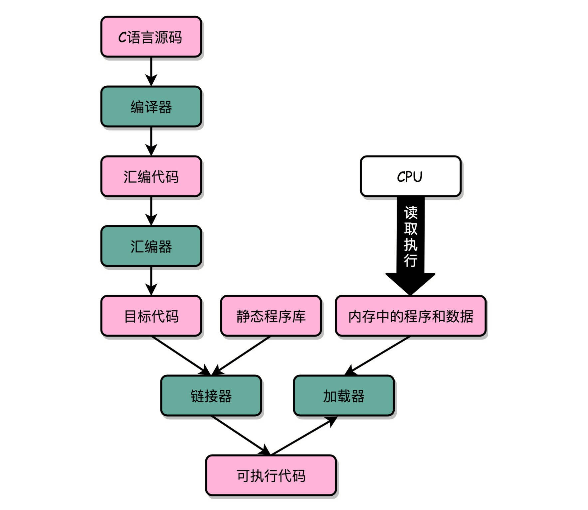
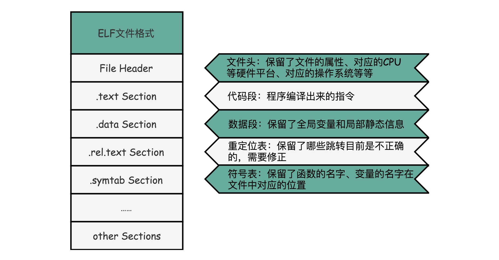
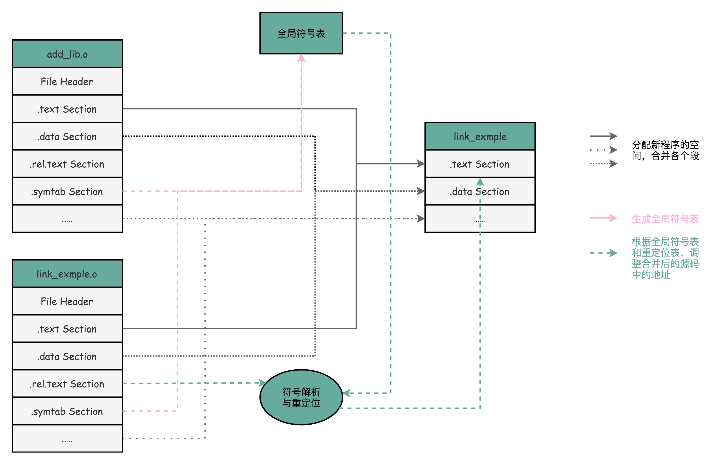

# 08 | ELF和静态链接：为什么程序无法同时在Linux和Windows下运行？
过去的三节，你和我一起通过一些简单的代码，看到了我们写的程序，是怎么变成一条条计算机指令的；if…else这样的条件跳转是怎么样执行的；for/while这样的循环是怎么执行的；函数间的相互调用是怎么发生的。

我记得以前，我自己在了解完这些知识之后，产生了一个非常大的疑问。那就是，既然我们的程序最终都被变成了一条条机器码去执行，那为什么同一个程序，在同一台计算机上，在Linux下可以运行，而在Windows下却不行呢？反过来，Windows上的程序在Linux上也是一样不能执行的。可是我们的CPU并没有换掉，它应该可以识别同样的指令呀？

如果你和我有同样的疑问，那这一节，我们就一起来解开。

## 编译、链接和装载：拆解程序执行

[第5节](https://time.geekbang.org/column/article/93359)我们说过，写好的C语言代码，可以通过编译器编译成汇编代码，然后汇编代码再通过汇编器变成CPU可以理解的机器码，于是CPU就可以执行这些机器码了。你现在对这个过程应该不陌生了，但是这个描述把过程大大简化了。下面，我们一起具体来看，C语言程序是如何变成一个可执行程序的。

不知道你注意到没有，过去几节，我们通过gcc生成的文件和objdump获取到的汇编指令都有些小小的问题。我们先把前面的add函数示例，拆分成两个文件add\_lib.c和link\_example.c。

<!-- [[[read_end]]] -->

```
    // add_lib.c
    int add(int a, int b)
    {
        return a+b;
    }
    

```

```
    // link_example.c
    
    #include <stdio.h>
    int main()
    {
        int a = 10;
        int b = 5;
        int c = add(a, b);
        printf("c = %d\n", c);
    }
    

```

我们通过gcc来编译这两个文件，然后通过objdump命令看看它们的汇编代码。

```
    $ gcc -g -c add_lib.c link_example.c
    $ objdump -d -M intel -S add_lib.o
    $ objdump -d -M intel -S link_example.o
    

```

```
    add_lib.o:     file format elf64-x86-64
    Disassembly of section .text:
    0000000000000000 <add>:
       0:   55                      push   rbp
       1:   48 89 e5                mov    rbp,rsp
       4:   89 7d fc                mov    DWORD PTR [rbp-0x4],edi
       7:   89 75 f8                mov    DWORD PTR [rbp-0x8],esi
       a:   8b 55 fc                mov    edx,DWORD PTR [rbp-0x4]
       d:   8b 45 f8                mov    eax,DWORD PTR [rbp-0x8]
      10:   01 d0                   add    eax,edx
      12:   5d                      pop    rbp
      13:   c3                      ret    
    

```

```
    link_example.o:     file format elf64-x86-64
    Disassembly of section .text:
    0000000000000000 <main>:
       0:   55                      push   rbp
       1:   48 89 e5                mov    rbp,rsp
       4:   48 83 ec 10             sub    rsp,0x10
       8:   c7 45 fc 0a 00 00 00    mov    DWORD PTR [rbp-0x4],0xa
       f:   c7 45 f8 05 00 00 00    mov    DWORD PTR [rbp-0x8],0x5
      16:   8b 55 f8                mov    edx,DWORD PTR [rbp-0x8]
      19:   8b 45 fc                mov    eax,DWORD PTR [rbp-0x4]
      1c:   89 d6                   mov    esi,edx
      1e:   89 c7                   mov    edi,eax
      20:   b8 00 00 00 00          mov    eax,0x0
      25:   e8 00 00 00 00          call   2a <main+0x2a>
      2a:   89 45 f4                mov    DWORD PTR [rbp-0xc],eax
      2d:   8b 45 f4                mov    eax,DWORD PTR [rbp-0xc]
      30:   89 c6                   mov    esi,eax
      32:   48 8d 3d 00 00 00 00    lea    rdi,[rip+0x0]        # 39 <main+0x39>
      39:   b8 00 00 00 00          mov    eax,0x0
      3e:   e8 00 00 00 00          call   43 <main+0x43>
      43:   b8 00 00 00 00          mov    eax,0x0
      48:   c9                      leave  
      49:   c3                      ret    
    

```

既然代码已经被我们“编译”成了指令，我们不妨尝试运行一下 ./link\_example.o。

不幸的是，文件没有执行权限，我们遇到一个Permission denied错误。即使通过chmod命令赋予link\_example.o文件可执行的权限，运行./link\_example.o仍然只会得到一条cannot execute binary file: Exec format error的错误。

我们再仔细看一下objdump出来的两个文件的代码，会发现两个程序的地址都是从0开始的。如果地址是一样的，程序如果需要通过call指令调用函数的话，它怎么知道应该跳转到哪一个文件里呢？

这么说吧，无论是这里的运行报错，还是objdump出来的汇编代码里面的重复地址，都是因为 add\_lib.o 以及 link\_example.o并不是一个**可执行文件**（Executable Program），而是**目标文件**（Object File）。只有通过链接器（Linker）把多个目标文件以及调用的各种函数库链接起来，我们才能得到一个可执行文件。

我们通过gcc的-o参数，可以生成对应的可执行文件，对应执行之后，就可以得到这个简单的加法调用函数的结果。

```
    $ gcc -o link-example add_lib.o link_example.o
    $ ./link_example
    c = 15
    

```

实际上，“**C语言代码-汇编代码-机器码**” 这个过程，在我们的计算机上进行的时候是由两部分组成的。

第一个部分由编译（Compile）、汇编（Assemble）以及链接（Link）三个阶段组成。在这三个阶段完成之后，我们就生成了一个可执行文件。

第二部分，我们通过装载器（Loader）把可执行文件装载（Load）到内存中。CPU从内存中读取指令和数据，来开始真正执行程序。



## ELF格式和链接：理解链接过程

程序最终是通过装载器变成指令和数据的，所以其实我们生成的可执行代码也并不仅仅是一条条的指令。我们还是通过objdump指令，把可执行文件的内容拿出来看看。

```
    link_example:     file format elf64-x86-64
    Disassembly of section .init:
    ...
    Disassembly of section .plt:
    ...
    Disassembly of section .plt.got:
    ...
    Disassembly of section .text:
    ...
    
     6b0:   55                      push   rbp
     6b1:   48 89 e5                mov    rbp,rsp
     6b4:   89 7d fc                mov    DWORD PTR [rbp-0x4],edi
     6b7:   89 75 f8                mov    DWORD PTR [rbp-0x8],esi
     6ba:   8b 55 fc                mov    edx,DWORD PTR [rbp-0x4]
     6bd:   8b 45 f8                mov    eax,DWORD PTR [rbp-0x8]
     6c0:   01 d0                   add    eax,edx
     6c2:   5d                      pop    rbp
     6c3:   c3                      ret    
    00000000000006c4 <main>:
     6c4:   55                      push   rbp
     6c5:   48 89 e5                mov    rbp,rsp
     6c8:   48 83 ec 10             sub    rsp,0x10
     6cc:   c7 45 fc 0a 00 00 00    mov    DWORD PTR [rbp-0x4],0xa
     6d3:   c7 45 f8 05 00 00 00    mov    DWORD PTR [rbp-0x8],0x5
     6da:   8b 55 f8                mov    edx,DWORD PTR [rbp-0x8]
     6dd:   8b 45 fc                mov    eax,DWORD PTR [rbp-0x4]
     6e0:   89 d6                   mov    esi,edx
     6e2:   89 c7                   mov    edi,eax
     6e4:   b8 00 00 00 00          mov    eax,0x0
     6e9:   e8 c2 ff ff ff          call   6b0 <add>
     6ee:   89 45 f4                mov    DWORD PTR [rbp-0xc],eax
     6f1:   8b 45 f4                mov    eax,DWORD PTR [rbp-0xc]
     6f4:   89 c6                   mov    esi,eax
     6f6:   48 8d 3d 97 00 00 00    lea    rdi,[rip+0x97]        # 794 <_IO_stdin_used+0x4>
     6fd:   b8 00 00 00 00          mov    eax,0x0
     702:   e8 59 fe ff ff          call   560 <printf@plt>
     707:   b8 00 00 00 00          mov    eax,0x0
     70c:   c9                      leave  
     70d:   c3                      ret    
     70e:   66 90                   xchg   ax,ax
    ...
    Disassembly of section .fini:
    ...
    

```

你会发现，可执行代码dump出来内容，和之前的目标代码长得差不多，但是长了很多。因为在Linux下，可执行文件和目标文件所使用的都是一种叫**ELF**（Execuatable and Linkable File Format）的文件格式，中文名字叫**可执行与可链接文件格式**，这里面不仅存放了编译成的汇编指令，还保留了很多别的数据。

比如我们过去所有objdump出来的代码里，你都可以看到对应的函数名称，像add、main等等，乃至你自己定义的全局可以访问的变量名称，都存放在这个ELF格式文件里。这些名字和它们对应的地址，在ELF文件里面，存储在一个叫作**符号表**（Symbols Table）的位置里。符号表相当于一个地址簿，把名字和地址关联了起来。

我们先只关注和我们的add以及main函数相关的部分。你会发现，这里面，main函数里调用add的跳转地址，不再是下一条指令的地址了，而是add函数的入口地址了，这就是EFL格式和链接器的功劳。



ELF文件格式把各种信息，分成一个一个的Section保存起来。ELF有一个基本的文件头（File Header），用来表示这个文件的基本属性，比如是否是可执行文件，对应的CPU、操作系统等等。除了这些基本属性之外，大部分程序还有这么一些Section：

1.  首先是.text Section，也叫作**代码段**或者指令段（Code Section），用来保存程序的代码和指令；

2.  接着是.data Section，也叫作**数据段**（Data Section），用来保存程序里面设置好的初始化数据信息；

3.  然后就是.rel.text Secion，叫作**重定位表**（Relocation Table）。重定位表里，保留的是当前的文件里面，哪些跳转地址其实是我们不知道的。比如上面的 link\_example.o 里面，我们在main函数里面调用了 add 和 printf 这两个函数，但是在链接发生之前，我们并不知道该跳转到哪里，这些信息就会存储在重定位表里；

4.  最后是.symtab Section，叫作**符号表**（Symbol Table）。符号表保留了我们所说的当前文件里面定义的函数名称和对应地址的地址簿。

链接器会扫描所有输入的目标文件，然后把所有符号表里的信息收集起来，构成一个全局的符号表。然后再根据重定位表，把所有不确定要跳转地址的代码，根据符号表里面存储的地址，进行一次修正。最后，把所有的目标文件的对应段进行一次合并，变成了最终的可执行代码。这也是为什么，可执行文件里面的函数调用的地址都是正确的。



在链接器把程序变成可执行文件之后，要装载器去执行程序就容易多了。装载器不再需要考虑地址跳转的问题，只需要解析 ELF 文件，把对应的指令和数据，加载到内存里面供CPU执行就可以了。

## 总结延伸

讲到这里，相信你已经猜到，为什么同样一个程序，在Linux下可以执行而在Windows下不能执行了。其中一个非常重要的原因就是，两个操作系统下可执行文件的格式不一样。

我们今天讲的是Linux下的ELF文件格式，而Windows的可执行文件格式是一种叫作**PE**（Portable Executable Format）的文件格式。Linux下的装载器只能解析ELF格式而不能解析PE格式。

如果我们有一个可以能够解析PE格式的装载器，我们就有可能在Linux下运行Windows程序了。这样的程序真的存在吗？没错，Linux下著名的开源项目Wine，就是通过兼容PE格式的装载器，使得我们能直接在Linux下运行Windows程序的。而现在微软的Windows里面也提供了WSL，也就是Windows Subsystem for Linux，可以解析和加载ELF格式的文件。

我们去写可以用的程序，也不仅仅是把所有代码放在一个文件里来编译执行，而是可以拆分成不同的函数库，最后通过一个静态链接的机制，使得不同的文件之间既有分工，又能通过静态链接来“合作”，变成一个可执行的程序。

对于ELF格式的文件，为了能够实现这样一个静态链接的机制，里面不只是简单罗列了程序所需要执行的指令，还会包括链接所需要的重定位表和符号表。

## 推荐阅读

想要更深入了解程序的链接过程和ELF格式，我推荐你阅读《程序员的自我修养——链接、装载和库》的1～4章。这是一本难得的讲解程序的链接、装载和运行的好书。

## 课后思考

你可以通过readelf读取出今天演示程序的符号表，看看符号表里都有哪些信息；然后通过objdump读取出今天演示程序的重定位表，看看里面又有哪些信息。

欢迎留言和我分享你的思考和疑惑，你也可以把今天的内容分享给你的朋友，和他一起学习和进步。