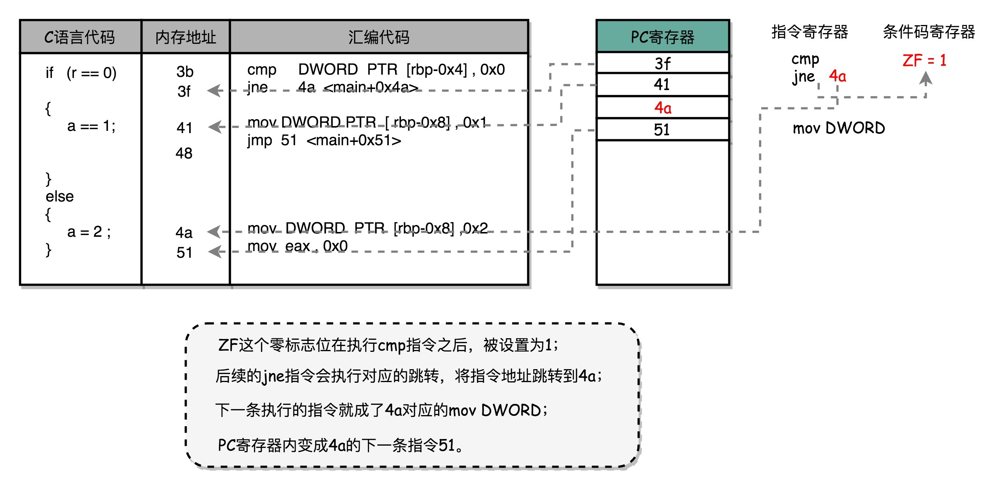
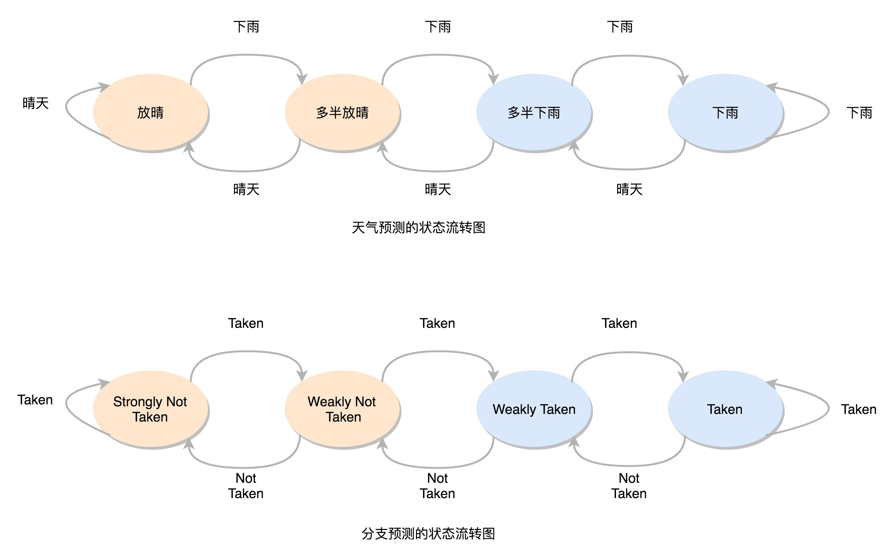

# 25 | 冒险和预测（四）：今天下雨了，明天还会下雨么？
过去三讲，我主要为你介绍了结构冒险和数据冒险，以及增加资源、流水线停顿、操作数前推、乱序执行，这些解决各种“冒险”的技术方案。

在结构冒险和数据冒险中，你会发现，所有的流水线停顿操作都要从**指令执行阶段**开始。流水线的前两个阶段，也就是取指令（IF）和指令译码（ID）的阶段，是不需要停顿的。CPU会在流水线里面直接去取下一条指令，然后进行译码。

取指令和指令译码不会需要遇到任何停顿，这是基于一个假设。这个假设就是，所有的指令代码都是顺序加载执行的。不过这个假设，在执行的代码中，一旦遇到 if…else 这样的条件分支，或者 for/while 循环，就会不成立。



回顾一下第6讲的条件跳转流程

我们先来回顾一下，[第6讲](https://time.geekbang.org/column/article/94075)里讲的cmp比较指令、jmp和jle这样的条件跳转指令。可以看到，在jmp指令发生的时候，CPU可能会跳转去执行其他指令。jmp后的那一条指令是否应该顺序加载执行，在流水线里面进行取指令的时候，我们没法知道。要等jmp指令执行完成，去更新了PC寄存器之后，我们才能知道，是否执行下一条指令，还是跳转到另外一个内存地址，去取别的指令。

这种为了确保能取到正确的指令，而不得不进行等待延迟的情况，就是今天我们要讲的**控制冒险**（Control Harzard）。这也是流水线设计里最后一种冒险。

<!-- [[[read_end]]] -->

## 分支预测：今天下雨了，明天还会继续下雨么？

在遇到了控制冒险之后，我们的CPU具体会怎么应对呢？除了流水线停顿，等待前面的jmp指令执行完成之后，再去取最新的指令，还有什么好办法吗？当然是有的。我们一起来看一看。

### 缩短分支延迟

第一个办法，叫作**缩短分支延迟**。回想一下我们的条件跳转指令，条件跳转指令其实进行了两种电路操作。

第一种，是进行条件比较。这个条件比较，需要的输入是，根据指令的opcode，就能确认的条件码寄存器。

第二种，是进行实际的跳转，也就是把要跳转的地址信息写入到PC寄存器。无论是opcode，还是对应的条件码寄存器，还是我们跳转的地址，都是在指令译码（ID）的阶段就能获得的。而对应的条件码比较的电路，只要是简单的逻辑门电路就可以了，并不需要一个完整而复杂的ALU。

所以，我们可以将条件判断、地址跳转，都提前到指令译码阶段进行，而不需要放在指令执行阶段。对应的，我们也要在CPU里面设计对应的旁路，在指令译码阶段，就提供对应的判断比较的电路。

这种方式，本质上和前面数据冒险的操作数前推的解决方案类似，就是在硬件电路层面，把一些计算结果更早地反馈到流水线中。这样反馈变得更快了，后面的指令需要等待的时间就变短了。

不过只是改造硬件，并不能彻底解决问题。跳转指令的比较结果，仍然要在指令执行的时候才能知道。在流水线里，第一条指令进行指令译码的时钟周期里，我们其实就要去取下一条指令了。这个时候，我们其实还没有开始指令执行阶段，自然也就不知道比较的结果。

### 分支预测

所以，这个时候，我们就引入了一个新的解决方案，叫作**分支预测**（Branch Prediction）技术，也就是说，让我们的CPU来猜一猜，条件跳转后执行的指令，应该是哪一条。

最简单的分支预测技术，叫作“**假装分支不发生**”。顾名思义，自然就是仍然按照顺序，把指令往下执行。其实就是CPU预测，条件跳转一定不发生。这样的预测方法，其实也是一种**静态预测**技术。就好像猜硬币的时候，你一直猜正面，会有50\%的正确率。

如果分支预测是正确的，我们自然赚到了。这个意味着，我们节省下来本来需要停顿下来等待的时间。如果分支预测失败了呢？那我们就把后面已经取出指令已经执行的部分，给丢弃掉。这个丢弃的操作，在流水线里面，叫作Zap或者Flush。CPU不仅要执行后面的指令，对于这些已经在流水线里面执行到一半的指令，我们还需要做对应的清除操作。比如，清空已经使用的寄存器里面的数据等等，这些清除操作，也有一定的开销。

所以，CPU需要提供对应的丢弃指令的功能，通过控制信号清除掉已经在流水线中执行的指令。只要对应的清除开销不要太大，我们就是划得来的。


### 动态分支预测

第三个办法，叫作**动态分支预测**。

上面的静态预测策略，看起来比较简单，预测的准确率也许有50\%。但是如果运气不好，可能就会特别差。于是，工程师们就开始思考，我们有没有更好的办法呢？比如，根据之前条件跳转的比较结果来预测，是不是会更准一点？

我们日常生活里，最经常会遇到的预测就是天气预报。如果没有气象台给你天气预报，你想要猜一猜明天是不是下雨，你会怎么办？

有一个简单的策略，就是完全根据今天的天气来猜。如果今天下雨，我们就预测明天下雨。如果今天天晴，就预测明天也不会下雨。这是一个很符合我们日常生活经验的预测。因为一般下雨天，都是连着下几天，不断地间隔地发生“天晴-下雨-天晴-下雨”的情况并不多见。

那么，把这样的实践拿到生活中来是不是有效呢？我在这里给了一张2019年1月上海的天气情况的表格。


我们用前一天的是不是下雨，直接来预测后一天会不会下雨。这个表格里一共有31天，那我们就可以预测30次。你可以数一数，按照这种预测方式，我们可以预测正确23次，正确率是76.7\%，比随机预测的50\%要好上不少。

而同样的策略，我们一样可以放在分支预测上。这种策略，我们叫**一级分支预测**（One Level Branch Prediction），或者叫**1比特饱和计数**（1-bit saturating counter）。这个方法，其实就是用一个比特，去记录当前分支的比较情况，直接用当前分支的比较情况，来预测下一次分支时候的比较情况。

只用一天下雨，就预测第二天下雨，这个方法还是有些“草率”，我们可以用更多的信息，而不只是一次的分支信息来进行预测。于是，我们可以引入一个**状态机**（State Machine）来做这个事情。

如果连续发生下雨的情况，我们就认为更有可能下雨。之后如果只有一天放晴了，我们仍然认为会下雨。在连续下雨之后，要连续两天放晴，我们才会认为之后会放晴。整个状态机的流转，可以参考我在文稿里放的图。



这个状态机里，我们一共有4个状态，所以我们需要2个比特来记录对应的状态。这样这整个策略，就可以叫作**2比特饱和计数**，或者叫**双模态预测器**（Bimodal Predictor）。

好了，现在你可以用这个策略，再去对照一下上面的天气情况。如果天气的初始状态我们放在“多半放晴”的状态下，我们预测的结果的正确率会是22次，也就是73.3\%的正确率。可以看到，并不是更复杂的算法，效果一定就更好。实际的预测效果，和实际执行的指令高度相关。

如果想对各种分支预测技术有所了解，[Wikipedia](https://en.wikipedia.org/wiki/Branch_predictor)里面有更详细的内容和更多的分支预测算法，你可以看看。

## 为什么循环嵌套的改变会影响性能？

说完了分支预测，现在我们先来看一个Java程序。

```
    public class BranchPrediction {
        public static void main(String args[]) {        
            long start = System.currentTimeMillis();
            for (int i = 0; i < 100; i++) {
                for (int j = 0; j <1000; j ++) {
                    for (int k = 0; k < 10000; k++) {
                    }
                }
            }
            long end = System.currentTimeMillis();
            System.out.println("Time spent is " + (end - start));
                    
            start = System.currentTimeMillis();
            for (int i = 0; i < 10000; i++) {
                for (int j = 0; j <1000; j ++) {
                    for (int k = 0; k < 100; k++) {
                    }
                }
            }
            end = System.currentTimeMillis();
            System.out.println("Time spent is " + (end - start) + "ms");
        }
    }
    

```

这是一个简单的三重循环，里面没有任何逻辑代码。我们用两种不同的循环顺序各跑一次。第一次，最外重循环循环了100次，第二重循环1000次，最内层的循环了10000次。第二次，我们把顺序倒过来，最外重循环10000次，第二重还是1000次，最内层100次。

事实上，这段代码在这个专栏一开始的几讲里面，就有同学来提问，想要弄明白这里面的关窍。

你可以先猜一猜，这样两次运行，花费的时间是一样的么？结果应该会让你大吃一惊。我们可以看看对应的命令行输出。

```
    Time spent in first loop is 5ms
    Time spent in second loop is 15ms
    

```

同样循环了十亿次，第一段程序只花了5毫秒，而第二段程序则花了15毫秒，足足多了2倍。

这个差异就来自我们上面说的分支预测。我们在前面讲过，循环其实也是利用cmp和jle这样先比较后跳转的指令来实现的。如果对for循环的汇编代码或者机器代码的实现不太清楚，你可以回头去复习一下第6讲。

这里的代码，每一次循环都有一个cmp和jle指令。每一个 jle 就意味着，要比较条件码寄存器的状态，决定是顺序执行代码，还是要跳转到另外一个地址。也就是说，在每一次循环发生的时候，都会有一次“分支”。


分支预测策略最简单的一个方式，自然是“**假定分支不发生**”。对应到上面的循环代码，就是循环始终会进行下去。在这样的情况下，上面的第一段循环，也就是内层 k 循环10000次的代码。每隔10000次，才会发生一次预测上的错误。而这样的错误，在第二层 j 的循环发生的次数，是1000次。

最外层的 i 的循环是100次。每个外层循环一次里面，都会发生1000次最内层 k 的循环的预测错误，所以一共会发生 100 × 1000 = 10万次预测错误。

上面的第二段循环，也就是内存k的循环100次的代码，则是每100次循环，就会发生一次预测错误。这样的错误，在第二层j的循环发生的次数，还是1000次。最外层 i 的循环是10000次，所以一共会发生 1000 × 10000 = 1000万次预测错误。

到这里，相信你能猜到为什么同样空转次数相同的循环代码，第一段代码运行的时间要少得多了。因为第一段代码发生“分支预测”错误的情况比较少，更多的计算机指令，在流水线里顺序运行下去了，而不需要把运行到一半的指令丢弃掉，再去重新加载新的指令执行。

## 总结延伸

好了，这一讲，我给你讲解了什么是控制冒险，以及应对控制冒险的三个方式。

第一种方案，类似我们的操作数前推，其实是在改造我们的CPU功能，通过增加对应的电路的方式，来缩短分支带来的延迟。另外两种解决方案，无论是“假装分支不发生”，还是“动态分支预测”，其实都是在进行“分支预测”。只是，“假装分支不发生”是一种简单的静态预测方案而已。

在动态分支预测技术里，我给你介绍了一级分支预测，或者叫1比特饱和计数的方法。其实就是认为，预测结果和上一次的条件跳转是一致的。在此基础上，我还介绍了利用更多信息的，就是2比特饱和计数，或者叫双模态预测器的方法。这个方法其实也只是通过一个状态机，多看了一步过去的跳转比较结果。

这个方法虽然简单，但是却非常有效。在 SPEC 89 版本的测试当中，使用这样的饱和计数方法，预测的准确率能够高达93.5\%。Intel的CPU，一直到Pentium时代，在还没有使用MMX指令集的时候，用的就是这种分支预测方式。

这一讲的最后，我给你看了一个有意思的例子。通过交换内外循环的顺序，我们体验了一把控制冒险导致的性能差异。虽然执行的指令数是一样的，但是分支预测失败得多的程序，性能就要差上几倍。

## 推荐阅读

想要进一步了解控制冒险和分支预测技术，可以去读一读《计算机组成与设计：硬件/软件接口》的4.8章节。

如果想对各种分支预测技术有所了解，[Wikipedia](https://en.wikipedia.org/wiki/Branch_predictor)里面有更详细的内容和更多的分支预测算法。

## 课后思考

我在上面用一个三重循环的Java程序，验证了“分支预测”出错会对程序带来的性能影响。你可以用你自己惯用的语言来试一试，看一看是否会有同样的效果。如果没有的话，原因是什么呢？

欢迎留言和我分享你的疑惑和见解。你也可以把今天的内容，分享给你的朋友，和他一起学习和进步。