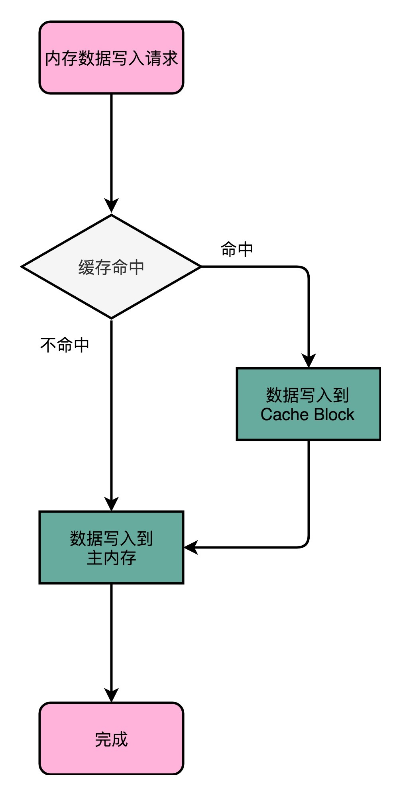

# 38 | 高速缓存（下）：你确定你的数据更新了么？
在我工作的十几年里，写了很多Java的程序。同时，我也面试过大量的Java工程师。对于一些表示自己深入了解和擅长多线程的同学，我经常会问这样一个面试题：“**volatile这个关键字有什么作用？**”如果你或者你的朋友写过Java程序，不妨来一起试着回答一下这个问题。

就我面试过的工程师而言，即使是工作了多年的Java工程师，也很少有人能准确说出volatile这个关键字的含义。这里面最常见的理解错误有两个，一个是把volatile当成一种锁机制，认为给变量加上了volatile，就好像是给函数加了sychronized关键字一样，不同的线程对于特定变量的访问会去加锁；另一个是把volatile当成一种原子化的操作机制，认为加了volatile之后，对于一个变量的自增的操作就会变成原子性的了。

```
    // 一种错误的理解，是把volatile关键词，当成是一个锁，可以把long/double这样的数的操作自动加锁
    private volatile long synchronizedValue = 0;
    
    // 另一种错误的理解，是把volatile关键词，当成可以让整数自增的操作也变成原子性的
    private volatile int atomicInt = 0;
    amoticInt++;
    

```

事实上，这两种理解都是完全错误的。很多工程师容易把volatile关键字，当成和锁或者数据数据原子性相关的知识点。而实际上，volatile关键字的最核心知识点，要关系到Java内存模型（JMM，Java Memory Model）上。

虽然JMM只是Java虚拟机这个进程级虚拟机里的一个内存模型，但是这个内存模型，和计算机组成里的CPU、高速缓存和主内存组合在一起的硬件体系非常相似。理解了JMM，可以让你很容易理解计算机组成里CPU、高速缓存和主内存之间的关系。

<!-- [[[read_end]]] -->

## “隐身”的变量

我们先来一起看一段Java程序。这是一段经典的volatile代码，来自知名的Java开发者网站[dzone.com](https://dzone.com/articles/java-volatile-keyword-0)，后续我们会修改这段代码来进行各种小实验。

```
    public class VolatileTest {
        private static volatile int COUNTER = 0;
    
        public static void main(String[] args) {
            new ChangeListener().start();
            new ChangeMaker().start();
        }
    
        static class ChangeListener extends Thread {
            @Override
            public void run() {
                int threadValue = COUNTER;
                while ( threadValue < 5){
                    if( threadValue!= COUNTER){
                        System.out.println("Got Change for COUNTER : " + COUNTER + "");
                        threadValue= COUNTER;
                    }
                }
            }
        }
    
        static class ChangeMaker extends Thread{
            @Override
            public void run() {
                int threadValue = COUNTER;
                while (COUNTER <5){
                    System.out.println("Incrementing COUNTER to : " + (threadValue+1) + "");
                    COUNTER = ++threadValue;
                    try {
                        Thread.sleep(500);
                    } catch (InterruptedException e) { e.printStackTrace(); }
                }
            }
        }
    }
    

```

我们先来看看这个程序做了什么。在这个程序里，我们先定义了一个volatile的int类型的变量，COUNTER。

然后，我们分别启动了两个单独的线程，一个线程我们叫ChangeListener。另一个线程，我们叫ChangeMaker。

ChangeListener这个线程运行的任务很简单。它先取到COUNTER当前的值，然后一直监听着这个COUNTER的值。一旦COUNTER的值发生了变化，就把新的值通过println打印出来。直到COUNTER的值达到5为止。这个监听的过程，通过一个永不停歇的while循环的忙等待来实现。

ChangeMaker这个线程运行的任务同样很简单。它同样是取到COUNTER的值，在COUNTER小于5的时候，每隔500毫秒，就让COUNTER自增1。在自增之前，通过println方法把自增后的值打印出来。

最后，在main函数里，我们分别启动这两个线程，来看一看这个程序的执行情况。程序的输出结果并不让人意外。ChangeMaker函数会一次一次将COUNTER从0增加到5。因为这个自增是每500毫秒一次，而ChangeListener去监听COUNTER是忙等待的，所以每一次自增都会被ChangeListener监听到，然后对应的结果就会被打印出来。

```
    Incrementing COUNTER to : 1
    Got Change for COUNTER : 1
    Incrementing COUNTER to : 2
    Got Change for COUNTER : 2
    Incrementing COUNTER to : 3
    Got Change for COUNTER : 3
    Incrementing COUNTER to : 4
    Got Change for COUNTER : 4
    Incrementing COUNTER to : 5
    Got Change for COUNTER : 5
    

```

这个时候，我们就可以来做一个很有意思的实验。如果我们把上面的程序小小地修改一行代码，把我们定义COUNTER这个变量的时候，设置的volatile关键字给去掉，会发生什么事情呢？你可以自己先试一试，看结果是否会让你大吃一惊。

```
    private static int COUNTER = 0;
    

```

没错，你会发现，我们的ChangeMaker还是能正常工作的，每隔500ms仍然能够对COUNTER自增1。但是，奇怪的事情在ChangeListener上发生了，我们的ChangeListener不再工作了。在ChangeListener眼里，它似乎一直觉得COUNTER的值还是一开始的0。似乎COUNTER的变化，对于我们的ChangeListener彻底“隐身”了。

```
    Incrementing COUNTER to : 1
    Incrementing COUNTER to : 2
    Incrementing COUNTER to : 3
    Incrementing COUNTER to : 4
    Incrementing COUNTER to : 5
    

```

这个有意思的小程序还没有结束，我们可以再对程序做一些小小的修改。我们不再让ChangeListener进行完全的忙等待，而是在while循环里面，小小地等待上5毫秒，看看会发生什么情况。

```
    static class ChangeListener extends Thread {
        @Override
        public void run() {
            int threadValue = COUNTER;
            while ( threadValue < 5){
                if( threadValue!= COUNTER){
                    System.out.println("Sleep 5ms, Got Change for COUNTER : " + COUNTER + "");
                    threadValue= COUNTER;
                }
                try {
                    Thread.sleep(5);
                } catch (InterruptedException e) { e.printStackTrace(); }
            }
        }
    }
    

```

好了，不知道你有没有自己动手试一试呢？又一个令人惊奇的现象要发生了。虽然我们的COUNTER变量，仍然没有设置volatile这个关键字，但是我们的ChangeListener似乎“睡醒了”。在通过Thread.sleep\(5\)在每个循环里“睡上“5毫秒之后，ChangeListener又能够正常取到COUNTER的值了。

```
    Incrementing COUNTER to : 1
    Sleep 5ms, Got Change for COUNTER : 1
    Incrementing COUNTER to : 2
    Sleep 5ms, Got Change for COUNTER : 2
    Incrementing COUNTER to : 3
    Sleep 5ms, Got Change for COUNTER : 3
    Incrementing COUNTER to : 4
    Sleep 5ms, Got Change for COUNTER : 4
    Incrementing COUNTER to : 5
    Sleep 5ms, Got Change for COUNTER : 5
    

```

这些有意思的现象，其实来自于我们的Java内存模型以及关键字volatile的含义。**那volatile关键字究竟代表什么含义呢？它会确保我们对于这个变量的读取和写入，都一定会同步到主内存里，而不是从Cache里面读取。**该怎么理解这个解释呢？我们通过刚才的例子来进行分析。

刚刚第一个使用了volatile关键字的例子里，因为所有数据的读和写都来自主内存。那么自然地，我们的ChangeMaker和ChangeListener之间，看到的COUNTER值就是一样的。

到了第二段进行小小修改的时候，我们去掉了volatile关键字。这个时候，ChangeListener又是一个忙等待的循环，它尝试不停地获取COUNTER的值，这样就会从当前线程的“Cache”里面获取。于是，这个线程就没有时间从主内存里面同步更新后的COUNTER值。这样，它就一直卡死在COUNTER=0的死循环上了。

而到了我们再次修改的第三段代码里面，虽然还是没有使用volatile关键字，但是短短5ms的Thead.Sleep给了这个线程喘息之机。既然这个线程没有这么忙了，它也就有机会把最新的数据从主内存同步到自己的高速缓存里面了。于是，ChangeListener在下一次查看COUNTER值的时候，就能看到ChangeMaker造成的变化了。

虽然Java内存模型是一个隔离了硬件实现的虚拟机内的抽象模型，但是它给了我们一个很好的“缓存同步”问题的示例。也就是说，如果我们的数据，在不同的线程或者CPU核里面去更新，因为不同的线程或CPU核有着自己各自的缓存，很有可能在A线程的更新，到B线程里面是看不见的。

## CPU高速缓存的写入

事实上，我们可以把Java内存模型和计算机组成里的CPU结构对照起来看。

我们现在用的Intel CPU，通常都是多核的的。每一个CPU核里面，都有独立属于自己的L1、L2的Cache，然后再有多个CPU核共用的L3的Cache、主内存。

因为CPU Cache的访问速度要比主内存快很多，而在CPU Cache里面，L1/L2的Cache也要比L3的Cache快。所以，上一讲我们可以看到，CPU始终都是尽可能地从CPU Cache中去获取数据，而不是每一次都要从主内存里面去读取数据。


这个层级结构，就好像我们在Java内存模型里面，每一个线程都有属于自己的线程栈。线程在读取COUNTER的数据的时候，其实是从本地的线程栈的Cache副本里面读取数据，而不是从主内存里面读取数据。如果我们对于数据仅仅只是读，问题还不大。我们在上一讲里，已经看到Cache Line的组成，以及如何从内存里面把对应的数据加载到Cache里。

但是，对于数据，我们不光要读，还要去写入修改。这个时候，有两个问题来了。

**第一个问题是，写入Cache的性能也比写入主内存要快，那我们写入的数据，到底应该写到Cache里还是主内存呢？如果我们直接写入到主内存里，Cache里的数据是否会失效呢？**为了解决这些疑问，下面我要给你介绍两种写入策略。

### 写直达（Write-Through）



最简单的一种写入策略，叫作写直达（Write-Through）。在这个策略里，每一次数据都要写入到主内存里面。在写直达的策略里面，写入前，我们会先去判断数据是否已经在Cache里面了。如果数据已经在Cache里面了，我们先把数据写入更新到Cache里面，再写入到主内存里面；如果数据不在Cache里，我们就只更新主内存。

写直达的这个策略很直观，但是问题也很明显，那就是这个策略很慢。无论数据是不是在Cache里面，我们都需要把数据写到主内存里面。这个方式就有点儿像我们上面用volatile关键字，始终都要把数据同步到主内存里面。

### 写回（Write-Back）


这个时候，我们就想了，既然我们去读数据也是默认从Cache里面加载，能否不用把所有的写入都同步到主内存里呢？只写入CPU Cache里面是不是可以？

当然是可以的。在CPU Cache的写入策略里，还有一种策略就叫作写回（Write-Back）。这个策略里，我们不再是每次都把数据写入到主内存，而是只写到CPU Cache里。只有当CPU Cache里面的数据要被“替换”的时候，我们才把数据写入到主内存里面去。

写回策略的过程是这样的：如果发现我们要写入的数据，就在CPU Cache里面，那么我们就只是更新CPU Cache里面的数据。同时，我们会标记CPU Cache里的这个Block是脏（Dirty）的。所谓脏的，就是指这个时候，我们的CPU Cache里面的这个Block的数据，和主内存是不一致的。

如果我们发现，我们要写入的数据所对应的Cache Block里，放的是别的内存地址的数据，那么我们就要看一看，那个Cache Block里面的数据有没有被标记成脏的。如果是脏的话，我们要先把这个Cache Block里面的数据，写入到主内存里面。然后，再把当前要写入的数据，写入到Cache里，同时把Cache Block标记成脏的。如果Block里面的数据没有被标记成脏的，那么我们直接把数据写入到Cache里面，然后再把Cache Block标记成脏的就好了。

在用了写回这个策略之后，我们在加载内存数据到Cache里面的时候，也要多出一步同步脏Cache的动作。如果加载内存里面的数据到Cache的时候，发现Cache Block里面有脏标记，我们也要先把Cache Block里的数据写回到主内存，才能加载数据覆盖掉Cache。

可以看到，在写回这个策略里，如果我们大量的操作，都能够命中缓存。那么大部分时间里，我们都不需要读写主内存，自然性能会比写直达的效果好很多。

然而，无论是写回还是写直达，其实都还没有解决我们在上面volatile程序示例中遇到的问题，也就是**多个线程，或者是多个CPU核的缓存一致性的问题。这也就是我们在写入修改缓存后，需要解决的第二个问题。**

要解决这个问题，我们需要引入一个新的方法，叫作MESI协议。这是一个维护缓存一致性协议。这个协议不仅可以用在CPU Cache之间，也可以广泛用于各种需要使用缓存，同时缓存之间需要同步的场景下。今天的内容差不多了，我们放在下一讲，仔细讲解缓存一致性问题。

## 总结延伸

最后，我们一起来回顾一下这一讲的知识点。通过一个使用Java程序中使用volatile关键字程序，我们可以看到，在有缓存的情况下会遇到一致性问题。volatile这个关键字可以保障我们对于数据的读写都会到达主内存。

进一步地，我们可以看到，Java内存模型和CPU、CPU Cache以及主内存的组织结构非常相似。在CPU Cache里，对于数据的写入，我们也有写直达和写回这两种解决方案。写直达把所有的数据都直接写入到主内存里面，简单直观，但是性能就会受限于内存的访问速度。而写回则通常只更新缓存，只有在需要把缓存里面的脏数据交换出去的时候，才把数据同步到主内存里。在缓存经常会命中的情况下，性能更好。

但是，除了采用读写都直接访问主内存的办法之外，如何解决缓存一致性的问题，我们还是没有解答。这个问题的解决方案，我们放到下一讲来详细解说。

## 推荐阅读

如果你是一个Java程序员，我推荐你去读一读 [Fixing Java Memory Model](https://www.ibm.com/developerworks/java/library/j-jtp03304/index.html) 这篇文章。读完这些内容，相信你会对Java里的内存模型和多线程原理有更深入的了解，并且也能更好地和我们计算机底层的硬件架构联系起来。

对于计算机组成的CPU高速缓存的写操作处理，你也可以读一读《计算机组成与设计：硬件/软件接口》的5.3.3小节。

## 课后思考

最后，给你留一道思考题。既然volatile关键字，会让所有的数据写入都要到主内存。你可以试着写一个小的程序，看看使用volatile关键字和不使用volatile关键字，在数据写入的性能上会不会有差异，以及这个差异到底会有多大。

欢迎把你写的程序分享到留言区。如果有困难，你也可以把这个问题分享给你朋友，拉上他一起讨论完成，并在留言区写下你们讨论后的结果。