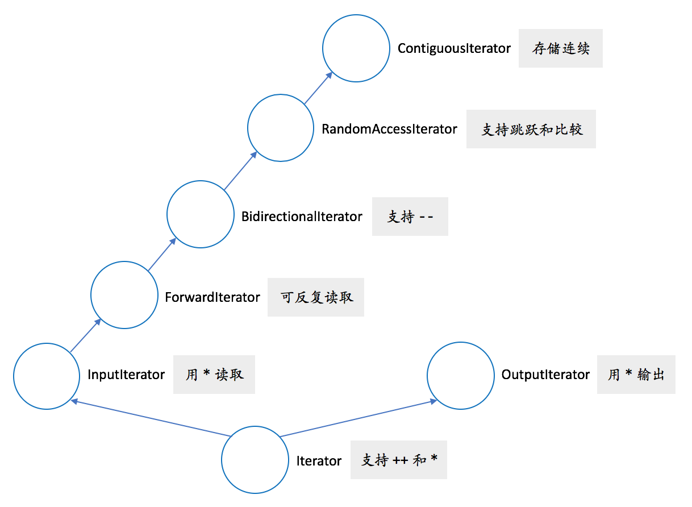

# 07 | 迭代器和好用的新for循环
你好，我是吴咏炜。

我们已经讲过了容器。在使用容器的过程中，你也应该对迭代器（iterator）或多或少有了些了解。今天，我们就来系统地讲一下迭代器。

## 什么是迭代器？

迭代器是一个很通用的概念，并不是一个特定的类型。它实际上是一组对类型的要求（\[1\]）。它的最基本要求就是从一个端点出发，下一步、下一步地到达另一个端点。按照一般的中文习惯，也许“遍历”是比“迭代”更好的用词。我们可以遍历一个字符串的字符，遍历一个文件的内容，遍历目录里的所有文件，等等。这些都可以用迭代器来表达。

我在用 output\_container.h 输出容器内容的时候，实际上就对容器的 `begin` 和 `end` 成员函数返回的对象类型提出了要求。假设前者返回的类型是 I，后者返回的类型是 S，这些要求是：

* I 对象支持 `*` 操作，解引用取得容器内的某个对象。
* I 对象支持 `++`，指向下一个对象。
* I 对象可以和 I 或 S 对象进行相等比较，判断是否遍历到了特定位置（在 S 的情况下是是否结束了遍历）。

注意在 C++17 之前，`begin` 和 `end` 返回的类型 I 和 S 必须是相同的。从 C++17 开始，I 和 S 可以是不同的类型。这带来了更大的灵活性和更多的优化可能性。

上面的类型 I，多多少少就是一个满足输入迭代器（input iterator）的类型了。不过，output\_container.h 只使用了前置 `++`，但输入迭代器要求前置和后置 `++` 都得到支持。

<!-- [[[read_end]]] -->

输入迭代器不要求对同一迭代器可以多次使用 `*` 运算符，也不要求可以保存迭代器来重新遍历对象，换句话说，只要求可以单次访问。如果取消这些限制、允许多次访问的话，那迭代器同时满足了前向迭代器（forward iterator）。

一个前向迭代器的类型，如果同时支持 `--`（前置及后置），回到前一个对象，那它就是个双向迭代器（bidirectional iterator）。也就是说，可以正向遍历，也可以反向遍历。

一个双向迭代器，如果额外支持在整数类型上的 `+`、`-`、`+=`、`-=`，跳跃式地移动迭代器；支持 `[]`，数组式的下标访问；支持迭代器的大小比较（之前只要求相等比较）；那它就是个随机访问迭代器（random-access iterator）。

一个随机访问迭代器 `i` 和一个整数 `n`，在 `*i` 可解引用且 `i + n` 是合法迭代器的前提下，如果额外还满足 `*(addressdof(*i) + n)` 等价于 `*(i + n)`，即保证迭代器指向的对象在内存里是连续存放的，那它（在 C++20 里）就是个连续迭代器（contiguous iterator）。

以上这些迭代器只考虑了读取。如果一个类型像输入迭代器，但 `*i` 只能作为左值来写而不能读，那它就是个输出迭代器（output iterator）。

而比输入迭代器和输出迭代器更底层的概念，就是迭代器了。基本要求是：

* 对象可以被拷贝构造、拷贝赋值和析构。
* 对象支持 `*` 运算符。
* 对象支持前置 `++` 运算符。

迭代器类型的关系可从下图中全部看到：



迭代器通常是对象。但需要注意的是，指针可以满足上面所有的迭代器要求，因而也是迭代器。这应该并不让人惊讶，因为本来迭代器就是根据指针的特性，对其进行抽象的结果。事实上，`vector` 的迭代器，在很多实现里就直接是使用指针的。

## 常用迭代器

最常用的迭代器就是容器的 `iterator` 类型了。以我们学过的顺序容器为例，它们都定义了嵌套的 `iterator` 类型和 `const_iterator` 类型。一般而言，`iterator` 可写入，`const_iterator` 类型不可写入，但这些迭代器都被定义为输入迭代器或其派生类型：

* `vector::iterator` 和 `array::iterator` 可以满足到连续迭代器。
* `deque::iterator` 可以满足到随机访问迭代器（记得它的内存只有部分连续）。
* `list::iterator` 可以满足到双向迭代器（链表不能快速跳转）。
* `forward_list::iterator` 可以满足到前向迭代器（单向链表不能反向遍历）。

很常见的一个输出迭代器是 `back_inserter` 返回的类型 `back_inserter_iterator` 了；用它我们可以很方便地在容器的尾部进行插入操作。另外一个常见的输出迭代器是 `ostream_iterator`，方便我们把容器内容“拷贝”到一个输出流。示例如下：

```c++
    #include <algorithm>  // std::copy
    #include <iterator>   // std::back_inserter
    #include <vector>     // std::vector
    using namespace std;
```

```c++
    vector<int> v1{1, 2, 3, 4, 5};
    vector<int> v2;
    copy(v1.begin(), v1.end(),
         back_inserter(v2));
```

```c++
    v2
```

> `{ 1, 2, 3, 4, 5 }`

```c++
    #include <iostream>  // std::cout
    copy(v2.begin(), v2.end(),
         ostream_iterator<int>(cout, " "));
```

> `1 2 3 4 5`

## 使用输入行迭代器

下面我们来看一下一个我写的输入迭代器。它的功能本身很简单，就是把一个输入流（`istream`）的内容一行行读进来。配上 C++11 引入的基于范围的 for 循环的语法，我们可以把遍历输入流的代码以一种自然、非过程式的方式写出来，如下所示：

```c++
    for (const string& line :
         istream_line_reader(is)) {
      // 示例循环体中仅进行简单输出
      cout << line << endl;
    }
```

我们可以对比一下以传统的方式写的 C++ 代码，其中需要照顾不少细节：

```c++
    string line;
    for (;;) {
      getline(is, line);
      if (!is) {
        break;
      }
      cout << line << endl;
    }
```

从 `is` 读入输入行的逻辑，在前面的代码里一个语句就全部搞定了，在这儿用了 5 个语句……

我们后面会分析一下这个输入迭代器。在此之前，我先解说一下基于范围的 for 循环这个语法。虽然这可以说是个语法糖，但它对提高代码的可读性真的非常重要。如果不用这个语法糖的话，简洁性上的优势就小多了。我们直接把这个循环改写成等价的普通 for 循环的样子。

```c++
    {
      auto&& r = istream_line_reader(is);
      auto it = r.begin();
      auto end = r.end();
      for (; it != end; ++it) {
        const string& line = *it;
        cout << line << endl;
      }
    }
```

可以看到，它做的事情也不复杂，就是：

* 获取冒号后边的范围表达式的结果，并隐式产生一个引用，在整个循环期间都有效。注意根据生命期延长规则，表达式结果如果是临时对象的话，这个对象要在循环结束后才被销毁。
* 自动生成遍历这个范围的迭代器。
* 循环内自动生成根据冒号左边的声明和 `*it` 来进行初始化的语句。
* 下面就是完全正常的循环体。

生成迭代器这一步有可能是——但不一定是——调用 `r` 的 `begin` 和 `end` 成员函数。具体规则是：

* 对于 C 数组（必须是没有退化为指针的情况），编译器会自动生成指向数组头尾的指针（相当于自动应用可用于数组的 `std::begin` 和 `std::end` 函数）。
* 对于有 `begin` 和 `end` 成员的对象，编译器会调用其 `begin` 和 `end` 成员函数（我们目前的情况）。
* 否则，编译器会尝试在 `r` 对象所在的名空间寻找可以用于 `r` 的 `begin` 和 `end` 函数，并调用 `begin(r)` 和 `end(r)`；找不到的话则失败报错。

## 定义输入行迭代器

下面我们看一下，要实现这个输入行迭代器，需要做些什么工作。

C++ 里有些固定的类型要求规范。对于一个迭代器，我们需要定义下面的类型：

```c++
    class istream_line_reader {
    public:
      class iterator {  // 实现 InputIterator
      public:
        typedef ptrdiff_t difference_type;
        typedef string value_type;
        typedef const value_type* pointer;
        typedef const value_type& reference;
        typedef input_iterator_tag
          iterator_category;
        …
      };
      …
    };
```

仿照一般的容器，我们把迭代器定义为 `istream_line_reader` 的嵌套类。它里面的这五个类型是必须定义的（其他泛型 C++ 代码可能会用到这五个类型；之前标准库定义了一个可以继承的类模板 `std::iterator` 来产生这些类型定义，但这个类目前已经被废弃 \[2\]）。其中：

* `difference_type` 是代表迭代器之间距离的类型，定义为 `ptrdiff_t` 只是种标准做法（指针间差值的类型），对这个类型没什么特别作用。
* `value_type` 是迭代器指向的对象的值类型，我们使用 `string`，表示迭代器指向的是字符串。
* `pointer` 是迭代器指向的对象的指针类型，这儿就平淡无奇地定义为 `value_type` 的常指针了（我们可不希望别人来更改指针指向的内容）。
* 类似的，`reference` 是 `value_type` 的常引用。
* `iterator_category` 被定义为 `input_iterator_tag`，标识这个迭代器的类型是 input iterator（输入迭代器）。

作为一个真的只能读一次的输入迭代器，有个特殊的麻烦（前向迭代器或其衍生类型没有）：到底应该让 `*` 负责读取还是 `++` 负责读取。我们这儿采用常见、也较为简单的做法，让 `++` 负责读取，`*` 负责返回读取的内容（这个做法会有些副作用，但按我们目前的用法则没有问题）。这样的话，这个 `iterator` 类需要有一个数据成员指向输入流，一个数据成员来存放读取的结果。根据这个思路，我们定义这个类的基本成员函数和数据成员：

```c++
    class istream_line_reader {
    public:
      class iterator {
        …
        iterator() noexcept
          : stream_(nullptr) {}
        explicit iterator(istream& is)
          : stream_(&is)
        {
          ++*this;
        }
    
        reference operator*() const noexcept
        {
          return line_;
        }
        pointer operator->() const noexcept
        {
          return &line_;
        }
        iterator& operator++()
        {
          getline(*stream_, line_);
          if (!*stream_) {
            stream_ = nullptr;
          }
          return *this;
        }
        iterator operator++(int)
        {
          iterator temp(*this);
          ++*this;
          return temp;
        }
    
      private:
        istream* stream_;
        string line_;
      };
      …
    };
```

我们定义了默认构造函数，将 `stream_` 清空；相应的，在带参数的构造函数里，我们根据传入的输入流来设置 `stream_`。我们也定义了 `*` 和 `->` 运算符来取得迭代器指向的文本行的引用和指针，并用 `++` 来读取输入流的内容（后置 `++` 则以惯常方式使用前置 `++` 和拷贝构造来实现）。唯一“特别”点的地方，是我们在构造函数里调用了 `++`，确保在构造后调用 `*` 运算符时可以读取内容，符合日常先使用 `*`、再使用 `++` 的习惯。一旦文件读取到尾部（或出错），则 `stream_` 被清空，回到默认构造的情况。

对于迭代器之间的比较，我们则主要考虑文件有没有读到尾部的情况，简单定义为：

```c++
        bool operator==(const iterator& rhs)
          const noexcept
        {
          return stream_ == rhs.stream_;
        }
        bool operator!=(const iterator& rhs)
          const noexcept
        {
          return !operator==(rhs);
        }
```

有了这个 `iterator` 的定义后，`istream_line_reader` 的定义就简单得很了：

```c++
    class istream_line_reader {
    public:
      class iterator {…};
      istream_line_reader() noexcept
        : stream_(nullptr) {}
      explicit istream_line_reader(
        istream& is) noexcept
        : stream_(&is) {}
      iterator begin()
      {
        return iterator(*stream_);
      }
      iterator end() const noexcept
      {
        return iterator();
      }
    
    private:
      istream* stream_;
    };
```

也就是说，构造函数只是简单地把输入流的指针赋给 `stream_` 成员变量。`begin` 成员函数则负责构造一个真正有意义的迭代器；`end` 成员函数则只是返回一个默认构造的迭代器而已。

以上就是一个完整的基于输入流的行迭代器了。这个行输入模板的设计动机和性能测试结果可参见参考资料 \[3\] 和 \[4\]；完整的工程可用代码，请参见参考资料 \[5\]。该项目中还提供了利用 C 文件接口的 file\_line\_reader 和基于内存映射文件的 mmap\_line\_reader。

## 内容小结

今天我们介绍了所有的迭代器类型，并介绍了基于范围的 for 循环。随后，我们介绍了一个实际的输入迭代器工具，并用它来简化从输入流中读入文本行这一常见操作。最后，我们展示了这个输入迭代器的定义。

## 课后思考

请思考一下：

1.  目前这个输入行迭代器的行为，在什么情况下可能导致意料之外的后果？
2.  请尝试一下改进这个输入行迭代器，看看能不能消除这种意外。如果可以，该怎么做？如果不可以，为什么？

欢迎留言和我交流你的看法。

## 参考资料

\[1\] cppreference.com, “Iterator library”. <https://en.cppreference.com/w/cpp/iterator>

\[1a\] cppreference.com, “迭代器库”. <https://zh.cppreference.com/w/cpp/iterator>

\[2\] Jonathan Boccara, “std::iterator is deprecated: why, what it was, and what to use instead”. <https://www.fluentcpp.com/2018/05/08/std-iterator-deprecated/>

\[3\] 吴咏炜, “Python `yield` and C++ coroutines”. <https://yongweiwu.wordpress.com/2016/08/16/python-yield-and-cplusplus-coroutines/>

\[4\] 吴咏炜, “Performance of my line readers”. <https://yongweiwu.wordpress.com/2016/11/12/performance-of-my-line-readers/>

\[5\] 吴咏炜, nvwa. <https://github.com/adah1972/nvwa/>