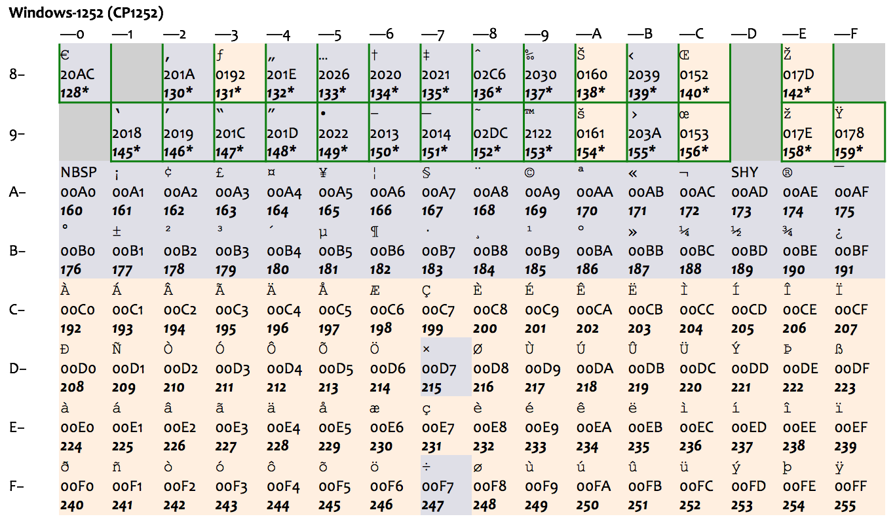
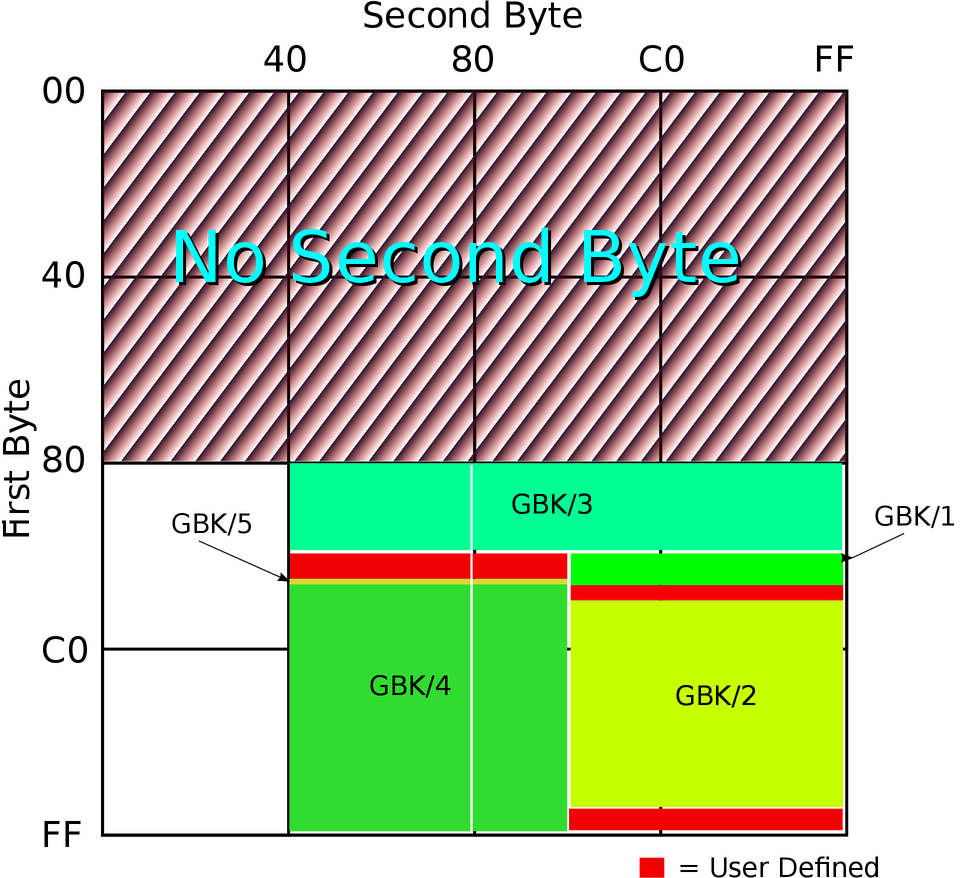

# 11 | Unicode：进入多文字支持的世界
你好，我是吴咏炜。

这一讲我们来讲一个新话题，Unicode。我们会从编码的历史谈起，讨论编程中对中文和多语言的支持，然后重点看一下 C++ 中应该如何处理这些问题。

## 一些历史

ASCII \[1\] 是一种创立于 1963 年的 7 位编码，用 0 到 127 之间的数值来代表最常用的字符，包含了控制字符（很多在今天已不再使用）、数字、大小写拉丁字母、空格和基本标点。它在编码上具有简单性，字母和数字的编码位置非常容易记忆（相比之下，设计 EBCDIC \[2\] 的人感觉是脑子进了水，哦不，进了穿孔卡片了；难怪它和 IBM 的那些过时老古董一起已经几乎被人遗忘）。时至今日，ASCII 可以看作是字符编码的基础，主要的编码方式都保持着与 ASCII 的兼容性。


ASCII 里只有基本的拉丁字母，它既没有带变音符的拉丁字母（如 é 和 ä ），也不支持像希腊字母（如 α、β、γ）、西里尔字母（如 Пушкин）这样的其他欧洲文字（也难怪，毕竟它是 American Standard Code for Information Interchange）。很多其他编码方式纷纷应运而生，包括 ISO 646 系列、ISO/IEC 8859 系列等等；大部分编码方式都是头 128 个字符与 ASCII 兼容，后 128 个字符是自己的扩展，总共最多是 256 个字符。每次只有一套方式可以生效，称之为一个代码页（code page）。这种做法，只能适用于文字相近、且字符数不多的国家。比如，下图表示了 ISO-8859-1（也称作 Latin-1）和后面的 Windows 扩展代码页 1252（下图中绿框部分为 Windows 的扩展），就只能适用于西欧国家。

<!-- [[[read_end]]] -->



最早的中文字符集标准是 1980 年的国标 GB2312 \[3\]，其中收录了 6763 个常用汉字和 682 个其他符号。我们平时会用到编码 GB2312，其实更正确的名字是 EUC-CN \[4\]，它是一种与 ASCII 兼容的编码方式。它用单字节表示 ASCII 字符而用双字节表示 GB2312 中的字符；由于 GB2312 中本身也含有 ASCII 中包含的字符，在使用中逐渐就形成了“半角”和“全角”的区别。

国标字符集后面又有扩展，这个扩展后的字符集就是 GBK \[5\]，是中文版 Windows 使用的标准编码方式。GB2312 和 GBK 所占用的编码位置可以参看下面的图（由 John M. Długosz 为 Wikipedia 绘制）：



图中 GBK/1 和 GBK/2 为 GB2312 中已经定义的区域，其他的则是后面添加的字符，总共定义了两万多个编码点，支持了绝大部分现代汉语中还在使用的字。

Unicode \[6\] 作为一种统一编码的努力，诞生于八十年代末九十年代初，标准的第一版出版于 1991—1992 年。由于最初发明者的目标放得太低，只期望对活跃使用中的现代文字进行编码，他们认为 16 比特的“宽 ASCII”就够用了。这就导致了早期采纳 Unicode 的组织，特别是微软，在其操作系统和工具链中广泛采用了 16 比特的编码方式。在今天，微软的系统中宽字符类型 wchar\_t 仍然是 16 位的，操作系统底层接口大量使用 16 位字符编码的 API，说到 Unicode 编码时仍然指的是 16 位的编码 UTF-16（这一不太正确的名字，跟中文 GBK 编码居然可以被叫做 ANSI 相比，实在是小巫见大巫了）。在微软以外的世界，Unicode 本身不作编码名称用，并且最主流的编码方式并不是 UTF-16，而是和 ASCII 全兼容的 UTF-8。

早期 Unicode 组织的另一个决定是不同语言里的同一个字符使用同一个编码点，来减少总编码点的数量。中日韩三国使用的汉字就这么被统一了：像“将”、“径”、“网”等字，每个字在 Unicode 中只占一个编码点。这对网页的字体选择也造成了不少麻烦，时至今日我们仍然可以看到这个问题 \[7\]。不过这和我们的主题无关，就不再多费笔墨了。

## Unicode 简介

Unicode 在今天已经大大超出了最初的目标。到 Unicode 12.1 为止，Unicode 已经包含了 137,994 个字符，囊括所有主要语言（使用中的和已经不再使用的），并包含了表情符号、数学符号等各种特殊字符。仍然要指出一下，Unicode 字符是根据含义来区分的，而非根据字形。除了前面提到过中日韩汉字没有分开，像斜体（italics）、小大写字母（small caps）等排版效果在 Unicode 里也没有独立的对应。不过，因为 Unicode 里包含了很多数学、物理等自然科学中使用的特殊符号，某些情况下你也可以找到对应的符号，可以用在聊天中耍酷，如 𝒷𝒶𝒹（但不适合严肃的排版）。

Unicode 的编码点是从 0x0 到 0x10FFFF，一共 1,114,112 个位置。一般用“U+”后面跟 16 进制的数值来表示一个 Unicode 字符，如 U+0020 表示空格，U+6C49 表示“汉”，U+1F600 表示“😀”，等等（不足四位的一般写四位）。

Unicode 字符的常见编码方式有：

* UTF-32 \[8\]：32 比特，是编码点的直接映射。
* UTF-16 \[9\]：对于从 U+0000 到 U+FFFF 的字符，使用 16 比特的直接映射；对于大于 U+FFFF 的字符，使用 32 比特的特殊映射关系——在 Unicode 的 16 比特编码点中 0xD800–0xDFFF 是一段空隙，使得这种变长编码成为可能。在一个 UTF-16 的序列中，如果看到内容是 0xD800–0xDBFF，那这就是 32 比特编码的前 16 比特；如果看到内容是 0xDC00–0xDFFF，那这是 32 比特编码的后 16 比特；如果内容在 0xD800–0xDFFF 之外，那就是一个 16 比特的映射。
* UTF-8 \[10\]：1 到 4 字节的变长编码。在一个合法的 UTF-8 的序列中，如果看到一个字节的最高位是 0，那就是一个单字节的 Unicode 字符；如果一个字节的最高两比特是 10，那这是一个 Unicode 字符在编码后的后续字节；否则，这就是一个 Unicode 字符在编码后的首字节，且最高位开始连续 1 的个数表示了这个字符按 UTF-8 的方式编码有几个字节。

在上面三种编码方式里，只有 UTF-8 完全保持了和 ASCII 的兼容性，目前得到了最广泛的使用。在我们下面讲具体编码方式之前，我们先看一下上面提到的三个字符在这三种方式下的编码结果：

* UTF-32：U+0020 映射为 0x00000020，U+6C49 映射为 0x00006C49，U+1F600 映射为 0x0001F600。
* UTF-16：U+0020 映射为 0x0020，U+6C49 映射为 0x6C49，而 U+1F600 会映射为 0xD83D DE00。
* UTF-8：U+0020 映射为 0x20，U+6C49 映射为 0xE6 B1 89，而 U+1F600 会映射为 0xF0 9F 98 80。

Unicode 有好几种（上面还不是全部）不同的编码方式，上面的 16 比特和 32 比特编码方式还有小头党和大头党之争（“汉”按字节读取时是 6C 49 呢，还是 49 6C？）；同时，任何一种编码方式还需要跟传统的编码方式容易区分。因此，Unicode 文本文件通常有一个使用 BOM（byte order mark）字符的约定，即字符 U+FEFF \[11\]。由于 Unicode 不使用 U+FFFE，在文件开头加一个 BOM 即可区分各种不同编码：

* 如果文件开头是 0x00 00 FE FF，那这是大头在前的 UTF-32 编码；
* 否则如果文件开头是 0xFF FE 00 00，那这是小头在前的 UTF-32 编码；
* 否则如果文件开头是 0xFE FF，那这是大头在前的 UTF-16 编码；
* 否则如果文件开头是 0xFF FE，那这是小头在前的 UTF-16 编码（注意，这条规则和第二条的顺序不能相反）；
* 否则如果文件开头是 0xEF BB BF，那这是 UTF-8 编码；
* 否则，编码方式使用其他算法来确定。

编辑器可以（有些在配置之后）根据 BOM 字符来自动决定文本文件的编码。比如，我一般在 Vim 中配置 `set fileencodings=ucs-bom,utf-8,gbk,latin1`。这样，Vim 在读入文件时，会首先检查 BOM 字符，有 BOM 字符按 BOM 字符决定文件编码；否则，试图将文件按 UTF-8 来解码（由于 UTF-8 有格式要求，非 UTF-8 编码的文件通常会导致失败）；不行，则试图按 GBK 来解码（失败的概率就很低了）；还不行，就把文件当作 Latin1 来处理（永远不会失败）。

在 UTF-8 编码下使用 BOM 字符并非必需，尤其在 Unix 上。但 Windows 上通常会使用 BOM 字符，以方便区分 UTF-8 和传统编码。

## C++ 中的 Unicode 字符类型

C++98 中有 `char` 和 `wchar_t` 两种不同的字符类型，其中 `char` 的长度是单字节，而 `wchar_t` 的长度不确定。在 Windows 上它是双字节，只能代表 UTF-16，而在 Unix 上一般是四字节，可以代表 UTF-32。为了解决这种混乱，目前我们有了下面的改进：

* C++11 引入了 `char16_t` 和 `char32_t` 两个独立的字符类型（不是类型别名），分别代表 UTF-16 和 UTF-32。
* C++20 将引入 `char8_t` 类型，进一步区分了可能使用传统编码的窄字符类型和 UTF-8 字符类型。
* 除了 `string` 和 `wstring`，我们也相应地有了 `u16string`、`u32string`（和将来的 `u8string`）。
* 除了传统的窄字符/字符串字面量（如 `"hi"`）和宽字符/字符串字面量（如 `L"hi"`），引入了新的 UTF-8、UTF-16 和 UTF-32 字面量，分别形如 `u8"hi"`、`u"hi"` 和 `U"hi"`。
* 为了确保非 ASCII 字符在源代码中可以简单地输入，引入了新的 Unicode 换码序列。比如，我们前面说到的三个字符可以这样表达成一个 UTF-32 字符串字面量：`U" \u6C49\U0001F600"`。要生成 UTF-16 或 UTF-8 字符串字面量只需要更改前缀即可。

使用这些新的字符（串）类型，我们可以用下面的代码表达出 UTF-32 和其他两种 UTF 编码间是如何转换的：

```c++
    #include <iomanip>
    #include <iostream>
    #include <stdexcept>
    #include <string>
    
    using namespace std;
    
    const char32_t unicode_max =
      0x10FFFF;
    
    void to_utf_16(char32_t ch,
                   u16string& result)
    {
      if (ch > unicode_max) {
        throw runtime_error(
          "invalid code point");
      }
      if (ch < 0x10000) {
        result += char16_t(ch);
      } else {
        char16_t first =
          0xD800 |
          ((ch - 0x10000) >> 10);
        char16_t second =
          0xDC00 | (ch & 0x3FF);
        result += first;
        result += second;
      }
    }
    
    void to_utf_8(char32_t ch,
                  string& result)
    {
      if (ch > unicode_max) {
        throw runtime_error(
          "invalid code point");
      }
      if (ch < 0x80) {
        result += ch;
      } else if (ch < 0x800) {
        result += 0xC0 | (ch >> 6);
        result += 0x80 | (ch & 0x3F);
      } else if (ch < 0x10000) {
        result += 0xE0 | (ch >> 12);
        result +=
          0x80 | ((ch >> 6) & 0x3F);
        result += 0x80 | (ch & 0x3F);
      } else {
        result += 0xF0 | (ch >> 18);
        result +=
          0x80 | ((ch >> 12) & 0x3F);
        result +=
          0x80 | ((ch >> 6) & 0x3F);
        result += 0x80 | (ch & 0x3F);
      }
    }
    
    int main()
    {
      char32_t str[] =
        U" \u6C49\U0001F600";
      u16string u16str;
      string u8str;
      for (auto ch : str) {
        if (ch == 0) {
          break;
        }
        to_utf_16(ch, u16str);
        to_utf_8(ch, u8str);
      }
      cout << hex << setfill('0');
      for (char16_t ch : u16str) {
        cout << setw(4) << unsigned(ch)
             << ' ';
      }
      cout << endl;
      for (unsigned char ch : u8str) {
        cout << setw(2) << unsigned(ch)
             << ' ';
      }
      cout << endl;
    }
```

输出结果是：

> `0020 6c49 d83d de00`  
> `20 e6 b1 89 f0 9f 98 80`

## 平台区别

下面我们看一下在两个主流的平台上一般是如何处理 Unicode 编码问题的。

### Unix

现代 Unix 系统，包括 Linux 和 macOS 在内，已经全面转向了 UTF-8。这样的系统中一般直接使用 `char[]` 和 `string` 来代表 UTF-8 字符串，包括输入、输出和文件名，非常简单。不过，由于一个字符单位不能代表一个完整的 Unicode 字符，在需要真正进行文字处理的场合转换到 UTF-32 往往会更简单。在以前及需要和 C 兼容的场合，会使用 `wchar_t`、`uint32_t` 或某个等价的类型别名；在新的纯 C++ 代码里，就没有理由不使用 `char32_t` 和 `u32string` 了。

Unix 下输出宽字符串需要使用 `wcout`（这点和 Windows 相同），并且需要进行区域设置，如下所示：

```c++
    std::locale::global(
        std::locale(""));
    std::wcout.imbue(std::locale());
```

由于没有什么额外好处，反而可能在某些环境因为区域设置失败而引发问题，Unix 平台下一般只用 `cout`，不用 `wcout`。

### Windows

Windows 由于历史原因和保留向后兼容性的需要（Windows 为了向后兼容性已经到了大规模放弃优雅的程度了），一直用 `char` 表示传统编码（如，英文 Windows 上是 Windows-1252，简体中文 Windows 上是 GBK），用 `wchar_t` 表示 UTF-16。由于传统编码一次只有一种、且需要重启才能生效，要得到好的多语言支持，在和操作系统交互时必须使用 UTF-16。

对于纯 Windows 编程，全面使用宽字符（串）是最简单的处理方式。当然，源代码和文本很少用 UTF-16 存储，通常还是 UTF-8（除非是纯 ASCII，否则必须加入 BOM 字符来和传统编码相区分）。这时可能会有一个小小的令人惊讶的地方：微软的编译器会把源代码里窄字符串字面量中的非 ASCII 字符转换成传统编码。换句话说，同样的源代码在不同编码的 Windows 下编译可能会产生不同的结果！如果你希望保留 UTF-8 序列的话，就应该使用 UTF-8 字面量（并在将来使用 `char8_t` 字符类型）。

```c++
    #include <stdio.h>
    
    template <typename T>
    void dump(const T& str)
    {
      for (char ch : str) {
        printf(
          "%.2x ",
          static_cast<unsigned char>(ch));
      }
      putchar('\n');
    }
    
    int main()
    {
      char str[] = "你好";
      char u8str[] = u8"你好";
      dump(str);
      dump(u8str);
    }
```

下面展示的是以上代码在 Windows 下系统传统编码设置为简体中文时的编译、运行结果：

> `c4 e3 ba c3 00`  
> `e4 bd a0 e5 a5 bd 00`

Windows 下的 `wcout` 主要用在配合宽字符的输出，此外没什么大用处。原因一样，只有进行了正确的区域设置，才能输出跟该区域相匹配的宽字符串（不匹配的字符将导致后续输出全部消失！）。如果要输出中文，得写 `setlocale(LC_ALL, "Chinese_China.936");`，这显然就让“统一码”输出失去意义了。

但是（还是有个“但是”），如果你**只用** `wcout`，不用 `cout` 或任何使用窄字符输出到 `stdout` 的函数（如 `puts`），这时倒有个还不错的解决方案，可以在终端输出多语言。我也是偶然才发现这一用法，并且没有在微软的网站上找到清晰的文档……代码如下所示：

```c++
    #include <fcntl.h>
    #include <io.h>
    #include <iostream>
    
    int main()
    {
      _setmode(_fileno(stdout),
               _O_WTEXT);
      std::wcout
        << L"中文 Español Français\n";
      std::wcout
        << "Narrow characters are "
           "also OK on wcout\n";
      // but not on cout...
    }
```

由于窄字符在大部分 Windows 系统上只支持传统编码，要打开一个当前编码不支持的文件名称，就必需使用宽字符的文件名。微软的 `fstream` 系列类及其 `open` 成员函数都支持 `const wchar_t*` 类型的文件名，这是 C++ 标准里所没有的。

### 统一化处理

要想写出跨平台的处理字符串的代码，我们一般考虑两种方式之一：

* 源代码级兼容，但内码不同
* 源代码和内码都完全兼容

微软推荐的方式一般是前者。做 Windows 开发的人很多都知道 tchar.h 和 `_T` 宏，它们就起着类似的作用（虽然目的不同）。根据预定义宏的不同，系统会在同一套代码下选择不同的编码方式及对应的函数。拿一个最小的例子来说：

```c++
    #include <stdio.h>
    #include <tchar.h>
    
    int _tmain(int argc, TCHAR* argv[])
    {
      _putts(_T("Hello world!\n"));
    }
```

如果用缺省的命令行参数进行编译，上面的代码相当于：

```c++
    #include <stdio.h>
    
    int main(int argc, char* argv[])
    {
      puts("Hello world!\n");
    }
```

而如果在命令行上加上了 `/D_UNICODE`，那代码则相当于：

```c++
    #include <stdio.h>
    
    int wmain(int argc, wchar_t* argv[])
    {
      _putws(L"Hello world!\n");
    }
```

当然，这个代码还是只能在 Windows 上用，并且仍然不漂亮（所有的字符和字符串字面量都得套上 `_T`）。后者无解，前者则可以找到替代方案（甚至自己写也不复杂）。C++ REST SDK 中就提供了类似的封装，可以跨平台地开发网络应用。但可以说，这种方式是一种主要照顾 Windows 的开发方式。

相应的，对 Unix 开发者而言更自然的方式是全面使用 UTF-8，仅在跟操作系统、文件系统打交道时把字符串转换成需要的编码。利用临时对象的生命周期，我们可以像下面这样写帮助函数和宏。

utf8\_to\_native.hpp：

```c++
    #ifndef UTF8_TO_NATIVE_HPP
    #define UTF8_TO_NATIVE_HPP
    
    #include <string>
    
    #if defined(_WIN32) || \
        defined(_UNICODE)
    
    std::wstring utf8_to_wstring(
      const char* str);
    std::wstring utf8_to_wstring(
      const std::string& str);
    
    #define NATIVE_STR(s) \
      utf8_to_wstring(s).c_str()
    
    #else
    
    inline const char*
    to_c_str(const char* str)
    {
      return str;
    }
    
    inline const char*
    to_c_str(const std::string& str)
    {
      return str.c_str();
    }
    
    #define NATIVE_STR(s) \
      to_c_str(s)
    
    #endif
    
    #endif // UTF8_TO_NATIVE_HPP
```

utf8\_to\_native.cpp：

```c++
    #include "utf8_to_native.hpp"
    
    #if defined(_WIN32) || \
        defined(_UNICODE)
    #include <windows.h>
    #include <system_error>
    
    namespace {
    
    void throw_system_error(
      const char* reason)
    {
      std::string msg(reason);
      msg += " failed";
      std::error_code ec(
        GetLastError(),
        std::system_category());
      throw std::system_error(ec, msg);
    }
    
    } /* unnamed namespace */
    
    std::wstring utf8_to_wstring(
      const char* str)
    {
      int len = MultiByteToWideChar(
        CP_UTF8, 0, str, -1,
        nullptr, 0);
      if (len == 0) {
        throw_system_error(
          "utf8_to_wstring");
      }
      std::wstring result(len - 1,
                          L'\0');
      if (MultiByteToWideChar(
            CP_UTF8, 0, str, -1,
            result.data(), len) == 0) {
        throw_system_error(
          "utf8_to_wstring");
      }
      return result;
    }
    
    std::wstring utf8_to_wstring(
      const std::string& str)
    {
      return utf8_to_wstring(
        str.c_str());
    }
    
    #endif
```

在头文件里，定义了在 Windows 下会做 UTF-8 到 UTF-16 的转换；在其他环境下则不真正做转换，而是不管提供的是字符指针还是 `string` 都会转换成字符指针。在 Windows 下每次调用 `NATIVE_STR` 会生成一个临时对象，当前语句执行结束后这个临时对象会自动销毁。

使用该功能的代码是这样的：

```c++
    #include <fstream>
    #include "utf8_to_native.hpp"
    
    int main()
    {
      using namespace std;
      const char filename[] =
        u8"测试.txt";
      ifstream ifs(
        NATIVE_STR(filename));
      // 对 ifs 进行操作
    }
```

上面这样的代码可以同时适用于现代 Unix 和现代 Windows（任何语言设置下），用来读取名为“测试.txt”的文件。

## 编程支持

结束之前，我们快速介绍一下其他的一些支持 Unicode 及其转换的 API。

### Windows API

上一节的代码在 Windows 下用到了 `MultiByteToWideChar` \[12\]，从某个编码转到 UTF-16。Windows 也提供了反向的 `WideCharToMultiByte` \[13\]，从 UTF-16 转到某个编码。从上面可以看到，C 接口用起来并不方便，可以考虑自己封装一下。

### iconv

Unix 下最常用的底层编码转换接口是 iconv \[14\]，提供 `iconv_open`、`iconv_close` 和 `iconv` 三个函数。这同样是 C 接口，实践中应该封装一下。

### ICU4C

ICU \[15\] 是一个完整的 Unicode 支持库，提供大量的方法，ICU4C 是其 C/C++ 的版本。ICU 有专门的字符串类型，内码是 UTF-16，但可以直接用于 IO streams 的输出。下面的程序应该在所有平台上都有同样的输出（但在 Windows 上要求当前系统传统编码能支持待输出的字符）：

```c++
    #include <iostream>
    #include <string>
    #include <unicode/unistr.h>
    #include <unicode/ustream.h>
    
    using namespace std;
    using icu::UnicodeString;
    
    int main()
    {
      auto str = UnicodeString::fromUTF8(
        u8"你好");
      cout << str << endl;
      string u8str;
      str.toUTF8String(u8str);
      cout << "In UTF-8 it is "
           << u8str.size() << " bytes"
           << endl;
    }
```

### codecvt

C++11 曾经引入了一个头文件 \<codecvt> \[16\] 用作 UTF 编码间的转换，但很遗憾，那个头文件目前已因为存在安全性和易用性问题被宣告放弃（deprecated）\[17\]。\<locale> 中有另外一个 `codecvt` 模板 \[18\]，本身接口不那么好用，而且到 C++20 还会发生变化，这儿也不详细介绍了。有兴趣的话可以直接看参考资料。

## 内容小结

本讲我们讨论了 Unicode，以及 C++ 中对 Unicode 的支持。我们也讨论了在两大主流桌面平台上关于 Unicode 编码支持的一些惯用法。希望你在本讲之后，能清楚地知道 Unicode 和各种 UTF 编码是怎么回事。

## 课后思考

请思考一下：

1.  为什么说 UTF-32 处理会比较简单？
2.  你知道什么情况下 UTF-32 也并不那么简单吗？
3.  哪种 UTF 编码方式空间存储效率比较高？

欢迎留言一起讨论一下。

## 参考资料

\[1\] Wikipedia, “ASCII”. <https://en.wikipedia.org/wiki/ASCII>

\[2\] Wikipedia, “EBCDIC”. <https://en.wikipedia.org/wiki/EBCDIC>

\[3\] Wikipedia, “GB 2312”. <https://en.wikipedia.org/wiki/GB_2312>

\[3a\] 维基百科, “GB 2312”. <https://zh.wikipedia.org/zh-cn/GB_2312>

\[4\] Wikipedia, “EUC-CN”. <https://en.wikipedia.org/wiki/Extended_Unix_Code#EUC-CN>

\[4a\] 维基百科, “EUC-CN”. <https://zh.wikipedia.org/zh-cn/EUC#EUC-CN>

\[5\] Wikipedia, “GBK”. <https://en.wikipedia.org/wiki/GBK_(character_encoding)>

\[5a\] 维基百科, “汉字内码扩展规范”. <https://zh.wikipedia.org/zh-cn/汉字内码扩展规范>

\[6\] Wikipedia, “Unicode”. <https://en.wikipedia.org/wiki/Unicode>

\[6a\] 维基百科, “Unicode”. <https://zh.wikipedia.org/zh-cn/Unicode>

\[7\] 吴咏炜, “Specify LANG in a UTF-8 web page”. <http://wyw.dcweb.cn/lang_utf8.htm>

\[8\] Wikipedia, “UTF-32”. <https://en.wikipedia.org/wiki/UTF-32>

\[9\] Wikipedia, “UTF-16”. <https://en.wikipedia.org/wiki/UTF-16>

\[10\] Wikipedia, “UTF-8”. <https://en.wikipedia.org/wiki/UTF-8>

\[11\] Wikipedia, “Byte order mark”. <https://en.wikipedia.org/wiki/Byte_order_mark>

\[11a\] 维基百科, “字节顺序标记”. <https://zh.wikipedia.org/zh-cn/位元組順序記號>

\[12\] Microsoft, “MultiByteToWideChar function”. <https://docs.microsoft.com/en-us/windows/win32/api/stringapiset/nf-stringapiset-multibytetowidechar>

\[13\] Microsoft, “WideCharToMultiByte function”. <https://docs.microsoft.com/en-us/windows/win32/api/stringapiset/nf-stringapiset-widechartomultibyte>

\[14\] Wikipedia, “iconv”. <https://en.wikipedia.org/wiki/Iconv>

\[15\] ICU Technical Committee, ICU—International Components for Unicode. <http://site.icu-project.org/>

\[16\] cppreference.com, “Standard library header \<codecvt>”. <https://en.cppreference.com/w/cpp/header/codecvt>

\[17\] Alisdair Meredith, “Deprecating \<codecvt>”. <http://www.open-std.org/jtc1/sc22/wg21/docs/papers/2017/p0618r0.html>

\[18\] cppreference.com, “std::codecvt”. <https://en.cppreference.com/w/cpp/locale/codecvt>