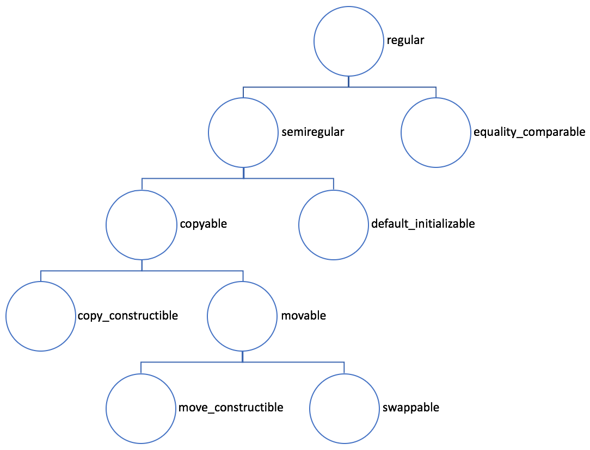
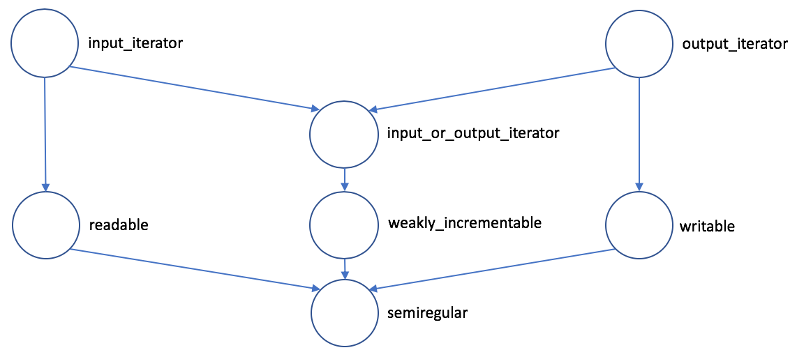

# 28 | Concepts：如何对模板进行约束?
你好，我是吴咏炜。

从这一讲开始，我们进入了未来篇，展望一下即将在 C++20 出现的新功能。我们第一个要讨论的，是 concepts（概念）——一个难产了很多年才终于进入 C++ 的新功能。

## 一个小例子

老规矩，要讲“概念”，我们先看例子。

我们知道 C++ 里有重载，可以根据参数的类型来选择合适的函数。比如，我们可以定义 `half` 对于 `int` 和 `string` 有不同的作用：

```c++
    int half(int n)
    {
      return n / 2;
    }
    
    string half(string s)
    {
      s.resize(s.size() / 2);
      return s;
    }
```

初看，似乎重载可以解决问题，但细想，不对啊：除了 `int`，我们还有差不多的 `short`、`long` 等类型，甚至还有 `boost::multiprecision::cpp_int`；除了 `string`，我们也还有 `wstring`、`u16string`、`u32string` 等等。上面的每个函数，实际上都适用于一族类型，而不是单个类型。重载在这方面并帮不了什么忙。

也许你现在已经反应过来了，我们有 SFINAE 啊！回答部分正确。可是，你告诉我你有没有想到一种很简单的方式能让 SFINAE 对整数类型可以工作？Type traits？嗯嗯，总是可以解决的是吧，但这会不会是一条把初学者劝退的道路呢？……

<!-- [[[read_end]]] -->

C++ 的概念就是用来解决这个问题的。对于上面的例子，我们只需要事先定义了 `Integer` 和 `String` 的概念（如何定义一个概念我们后面会说），我们就可以写出下面这样的代码：

```c++
    template <Integer N>
    N half(N n)
    {
      return n / 2;
    }
    
    template <String S>
    S half(S s)
    {
      s.resize(s.size() / 2);
      return s;
    }
```

我们应当了解一下，从概念上讲，上面这种形式的含义和下面的代码实质相同（以上面的第一个函数为例）：

```c++
    template <typename N>
      requires Integer<N>
    N half(N n)
    {
      return n / 2;
    }
```

即，这个 `half` 是一个函数模板，有一个模板参数，启用这个模板的前提条件是这个参数满足 `Integer` 这个约束。

## Concepts 简史

2019 年 11 月，上海，当在 C++ 峰会上被问起他最喜欢的 C++ 特性有哪些时，Bjarne 的回答里就有 concepts。这丝毫不让我感到惊讶。虽然 C++ 的“概念”看起来是个挺简单的概念，但它的历史并不短——Bjarne 想把它加入 C++ 已经有好多年了 \[1\]。

从基本概念上来讲，“概念”就是一组对模板参数的约束条件。我们讨论过模板就是 C++ 里的鸭子类型，但我们没有提过，Bjarne 对模板的接口实际上是相当不满意的：他自己的用词直接就是 lousy，并认为这一糟糕的接口设计是后面导致了恐怖的模板编译错误信息的根源。

从另一方面讲，Alex Stepanov 设计的 STL 一开始就包含了“概念”的概念，如我们在[\[第 7 讲\]](https://time.geekbang.org/column/article/176842) 中提到的各种不同类型的迭代器：

* Output Iterator
* Input Iterator
* Forward Iterator
* Bidirectional Iterator
* Random Access Iterator
* …

这些概念出现在了 STL 的文档中，有详细的定义；但它们只是落在纸面上，而没有在 C++ 语言中有真正的体现。后来，他还进一步把很多概念的形式描述写进了他于 2009 年（和 Paul McJones 一起）出版的“神作” _Elements of Programming_ \[2\] 中，并给出了假想的实现代码——其中就有关键字 `requires`——即使那时没有任何编译器能够编译这样的代码。

在 C++ 第一次标准化（1998）之后，Bjarne 多次试图把“概念”引入 C++（根据我看到的文献，他在 03 到 09 年直接有至少九篇单独或合著的论文跟“概念”有关），但一直没有成功——魔鬼在细节，一旦进入细节，人们对一个看起来很美的点子的分歧就非常大了。一直到 C++11 标准化，“概念” 还是因为草案复杂、争议多、无成熟实现而没有进入 C++ 标准。

目前 C++20 里的“概念”的基础是 2009 年重新启动的 Concepts Lite，并在 2015 年出版成为技术规格书 Concepts TS（正式的 TS 文档需要花钱购买，我们需要进一步了解可以查看正式出版前的草案 \[3\]）。很多人参与了相关工作，其中就包括了 Andrew Sutton、Bjarne Stroustrup 和 Alex Stepanov。这回，实现简化了，有了一个实现（GCC），争议也少多了。然而，“概念”还是没有进入 C++17，主要由于下面这些原因：

* 从 Concepts TS 出版到标准定稿只有不到四个⽉的时间（C++20 的内容也同样是在 2019 年就全部冻结了，到正式出版前的时间留个修正小问题和走批准流程）
* “概念”只有一个实现（GCC）
* Concepts TS 规格书的作者和 GCC 中的概念实现者是同⼀个⼈，没有⼈独⽴地从规格书出发实现概念
* Concepts TS ⾥没有实际定义概念，标准库也没有把概念用起来

当然，大家还是认可“概念”是个好功能，到了 2017 年 7 月，“概念”就正式并入 C++20 草案了。之后，小修订还是不少的（所以“概念”没有进入 C++20 也不完全是件坏事）。从用户的角度，最大的一个改变是“概念”的名字：目前，所有标准“概念”从全部由大写字母打头改成了“标准大小写”——即全部小写字母加下划线 \[4\]。比如，允许相等比较这个概念，原先写作 `EqualityComparable`，现在要写成 `equality_comparable`。

## 基本的 Concepts

下图中给出了 C++ 里对象相关的部分标准概念（不完整）：



我们从下往上快速看一下：

* `move_constructible`：可移动构造
* `swappable`：可交换
* `movable`：可移动构造、可交换，合在一起就是可移动了
* `copy_constructible`：可拷贝构造
* `copyable`：可拷贝构造、可移动，合在一起就是可复制了（注：这儿“拷贝”和“复制”只是我在翻译中做的一点小区分，英文中没有区别）
* `default_initializable`：可默认初始化（名字不叫 `default_constructible` 是因为目前的 type traits 中有 `is_default_constructible`，且意义和 `default_initializable` 有点微妙的区别；详见[问题报告 3338](https://timsong-cpp.github.io/lwg-issues/3338)）
* `semiregular`：可复制、可默认初始化，合在一起就是半正则了
* `equality_comparable`：可相等比较，即对象之间可以使用 `==` 运算符
* `regular`：半正则、可相等比较，合在一起就是正则了

这些“概念”现在不只是文字描述，绝大部分是可以真正在代码中定义的。现在，准标准的定义已经可以在 cppreference.com 上找到 \[5\]。从实际的角度，下面我们列举部分概念在 CMCSTL2 \[6\]——一个 Ranges（我们下一讲讨论）的参考实现——中的定义。

从简单性的角度，我们自上往下看，首先是 `regular`：

```c++
    template <class T>
    concept regular =
      semiregular<T> &&
      equality_comparable<T>;
```

很简单吧，定义一个 concept 此处只是一些针对类型的条件而已。可以看出，每个概念测试表达式（如 `semiregular<T>`）的结果是一个布尔值（编译期常量）。

然后是 `semiregular`：

```c++
    template <class T>
    concept semiregular =
      copyable<T> &&
      default_initializable<T>;
```

再看一眼 `equality_comparable`：

```c++
    template <class T, class U>
    concept WeaklyEqualityComparable =
      requires(
          const remove_reference_t<T>& t,
          const remove_reference_t<U>& u) {
        { t == u } -> boolean;
        { t != u } -> boolean;
        { u == t } -> boolean;
        { u != t } -> boolean;
      };
    
    template <class T>
    concept equality_comparable =
      WeaklyEqualityComparable<T, T>;
```

这个稍复杂点，用到了 `requires` \[7\]，但不需要我讲解，你也能看出来 `equality_comparable` 的要求就是类型的常左值引用之间允许进行 `==` 和 `!=` 的比较，且返回类型为布尔类型吧。

注意上面的定义里写的是 `boolean` 而不是 `bool`。这个概念定义不要求比较运算符的结果类型是 `bool`，而是可以用在需要布尔值的上下文中。自然，`boolean` 也是有定义的，但这个定义可能比你想象的复杂，我这儿就不写出来了😜。

我们之前已经讲过了各种迭代器，每个迭代器也自然地满足一个“概念”——概念名称基本上就是之前给的，只是大小写要变化一下而已。最底下的 `iterator` 是个例外：因为这个名字在标准里已经被占用啦。所以现在它的名字是 `input_or_output_iterator`。

迭代器本身需要满足哪些概念呢？我们看下图：



注意这张跟上面那张图不一样，概念之间不是简单的“合取”关系，而是一种“继承”关系：上面的概念比它指向的下面的概念有更多的要求。具体到代码：

```c++
    template <class I>
    concept weakly_incrementable =
      semiregular<I> && requires(I i) {
        typename iter_difference_t<I>;
        requires signed_integral<
          iter_difference_t<I>>;
        { ++i } -> same_as<I&>;
        i++;
      };
```

也就是说，`weakly_incrementable` 是 `semiregular` 再加一些额外的要求：

* `iter_difference_t<I>` 是一个类型
* `iter_difference_t<I>` 是一个有符号的整数类型
* `++i` 的结果跟 `I&` 是完全相同的类型
* 能够执行 `i++` 操作（不检查结果的类型）

`input_or_output_iterator` 也很简单：

```c++
    template <class I>
    concept input_or_output_iterator =
      __dereferenceable<I&> &&
      weakly_incrementable<I>;
```

就是要求可以解引用、可以执行 `++`、可以使用 `iter_difference_t` 提取迭代器的 `difference_type` 而已。

剩下的概念的定义也不复杂，我这儿就不一一讲解了。感兴趣的话你可以自己去看 CMCSTL2 的源代码。

### 简单的概念测试

为了让你再简单感受一下标准的概念，我写了下面这个简单的测试程序，展示一些标准概念的测试结果：

```c++
    #include <armadillo>
    #include <iostream>
    #include <memory>
    #include <type_traits>
    
    using namespace std;
    
    #if defined(__cpp_concepts)
    
    #if __cpp_concepts < 201811
    
    #include <experimental/ranges/concepts>
    using namespace experimental::ranges;
    
    #else
    
    #include <concepts>
    
    #endif
    
    #else // defined(__cpp_concepts)
    
    #error "No support for concepts!"
    
    #endif
    
    #define TEST_CONCEPT(Concept,      \
                         Type)         \
      cout << #Concept << '<' << #Type \
           << ">: "                    \
           << Concept<Type> << endl
    
    #define TEST_CONCEPT2(             \
      Concept, Type1, Type2)           \
      cout << #Concept << '<'          \
           << #Type1 << ", " << #Type2 \
           << ">: "                    \
           << Concept<Type1,           \
                      Type2> << endl
    
    int main()
    {
      cout << boolalpha;
      cout << "__cpp_concepts is "
           << __cpp_concepts << endl;
      TEST_CONCEPT(regular, int);
      TEST_CONCEPT(regular, char);
      TEST_CONCEPT(integral, int);
      TEST_CONCEPT(integral, char);
      TEST_CONCEPT(readable, int);
      TEST_CONCEPT(readable,
                   unique_ptr<int>);
      TEST_CONCEPT2(
        writable, unique_ptr<int>, int);
      TEST_CONCEPT2(writable,
                    unique_ptr<int>,
                    double);
      TEST_CONCEPT2(writable,
                    unique_ptr<int>,
                    int*);
      TEST_CONCEPT(semiregular,
                   unique_ptr<int>);
      TEST_CONCEPT(semiregular,
                   shared_ptr<int>);
      TEST_CONCEPT(equality_comparable,
                   unique_ptr<int>);
      TEST_CONCEPT(semiregular,
                   arma::imat);
      TEST_CONCEPT2(assignable_from,
                    arma::imat&,
                    arma::imat&);
      TEST_CONCEPT(semiregular,
                   arma::imat22);
      TEST_CONCEPT2(assignable_from,
                    arma::imat22&,
                    arma::imat22&);
    }
```

代码照顾了两种可能的环境：

* 最新的 MSVC（需要使用 `/std:C++latest`；我用的是 Visual Studio 2019 16.4.4）
* GCC（需要使用 `-fconcepts`；我测试了 7、8、9 三个版本都可以）和 CMCSTL2（需要将其 include 目录用 `-I` 选项加到命令行上）

程序在 MSVC 下的结果如下所示：

> `__cpp_concepts is 201811`  
> `regular<int>: true`  
> `regular<char>: true`  
> `integral<int>: true`  
> `integral<char>: true`  
> `readable<int>: false`  
> `readable<unique_ptr<int>>: true`  
> `writable<unique_ptr<int>, int>: true`  
> `writable<unique_ptr<int>, double>: true`  
> `writable<unique_ptr<int>, int*>: false`  
> `semiregular<unique_ptr<int>>: false`  
> `semiregular<shared_ptr<int>>: true`  
> `equality_comparable<unique_ptr<int>>: true`  
> `semiregular<arma::imat>: true`  
> `assignable_from<arma::imat&, arma::imat&>: true`  
> `semiregular<arma::imat22>: false`  
> `assignable_from<arma::imat22&, arma::imat22&>: false`

除了第一行 `__cpp_concepts` 的输出，GCC 的结果也是完全一致的。大部分的结果应当没有意外，但也需要注意，某些用起来没问题的类（如 `arma::imat22`），却因为一些实现上的特殊技术，不能满足 `semiregular`。——概念要比鸭子类型更为严格。

## 概念、出错信息和 SFINAE

显然，对于上面出现的这个例子：

```c++
    template <Integer N>
    N half(N n)
    {
      return n / 2;
    }
```

我们用 `enable_if` 也是能写出来的：

```c++
    template <typename N>
    enable_if_t<Integer<N>, N>
    half(N n)
    {
      return n / 2;
    }
```

不过，你不会觉得这种方式更好吧？而且，对于没有返回值的情况，要用对 `enable_if` 还是非常麻烦的（参见 \[8\] 里的 Notes /注解部分）。

更重要的是，“概念”可以提供更为友好可读的代码，以及潜在更为友好的出错信息。拿 Andrew Sutton 的一个例子 \[9\]（根据我们上节说的编译环境做了改编）：

```c++
    #include <string>
    #include <vector>
    
    using namespace std;
    
    #if defined(__cpp_concepts)
    
    #if __cpp_concepts < 201811
    
    #include <experimental/ranges/concepts>
    using namespace experimental::ranges;
    
    #else
    
    #include <concepts>
    #include <ranges>
    using namespace ranges;
    
    #endif
    
    #define REQUIRES(x) requires x
    
    #else // defined(__cpp_concepts)
    
    #define REQUIRES(x)
    
    #endif
    
    template <typename R, typename T>
      REQUIRES(
        (range<R> &&
         equality_comparable_with<
           T, typename R::value_type>))
    bool in(R const& r, T const& value)
    {
      for (auto const& x : r)
        if (x == value)
          return true;
      return false;
    }
    
    int main()
    {
      vector<string> v{"Hello",
                       "World"};
      in(v, "Hello");
      in(v, 0);
    }
```

以 GCC 8 为例，如果不使用概念约束，`in(v, 0)` 这行会产生 166 行出错信息；而启用了概念约束后，出错信息缩减到了 8 行。MSVC 上对于这个例子不使用概念错误信息也较短，但启用了概念后仍然能产生更短、更明确的出错信息：

> `test.cpp(47): error C2672: 'in': no matching overloaded function found`  
> `test.cpp(47): error C7602: 'in': the associated constraints are not satisfied`  
> `test.cpp(34): note: see declaration of 'in'`

随着编译器的改进，概念在出错信息上的优势在消减，但在代码表达上的优势仍然是实实在在的。记得[\[第 14 讲\]](https://time.geekbang.org/column/article/181636) 里我们费了好大的劲、用了几种不同的方法来定义 `has_reserve` 吗？在概念面前，那些就成了“回”字有几种写法了。我们可以飞快地定义下面的概念：

```c++
    template <typename T>
    concept has_reserve =
      requires(T& dest) {
        dest.reserve(1U);
      };
```

这个概念用在编译期条件语句里，效果和之前的完全相同……哦，错了，不用再写 `::value` 或 `{}` 了😂。

在[\[第 13 讲\]](https://time.geekbang.org/column/article/181608) 我给出过的 `fmap`，在实际代码中我也是用了 SFINAE 来进行约束的（略简化）：

```c++
    template <
      template <typename, typename>
      class OutContainer = vector,
      typename F, class R>
    auto fmap(F&& f, R&& inputs)
      -> decltype(
        begin(inputs),
        end(inputs),
        OutContainer<decay_t<
          decltype(f(*begin(
            inputs)))>>());
```

我费了老大的劲，要把返回值写出来，实际上就是为了利用 SFINAE 而已。如果使用“概念”，那代码可以简化成：

```c++
    template <
      template <typename, typename>
      class OutContainer = vector,
      typename F, class R>
      requires requires(R&& r) {
        begin(r);
        end(r);
      }
    auto fmap(F&& f, R&& inputs);
```

上面的 `requires requires` 不是错误，正如 `noexcept(noexcept(…))` 不是错误一样。第一个 `requires` 开始一个 **requires 子句**，后面跟一个常量表达式，结果的真假表示是否满足了模板的约束条件。第二个 `requires` 则开始了一个 **requires 表达式**：如果类型 `R` 满足约束——可以使用 `begin` 和 `end` 对 `R&&` 类型的变量进行调用——则返回真，否则返回假。

不过，在 C++20 里，上面这个条件我是不需要这么写出来的。有一个现成的概念可用，这么写就行了：

```c++
    template <
      template <typename, typename>
      class OutContainer = vector,
      typename F, class R>
      requires range<R>
    auto fmap(F&& f, R&& inputs);
```

如你所见，我今天第二次用了 `range` 这个概念。究竟什么是 range？我们留到下一讲再说。

## 内容小结

今天我们讨论了 C++20 里可以说是最重要的新功能——概念。概念可以用来对模板参数进行约束，能取代 SFINAE，产生更好、更可读的代码。

注意本讲的内容并非一个形式化的描述，请你在阅读了本讲的内容之后，再对照参考资料 \[6\] 的内容看一下更严格的描述，然后再回过头来读一下例子，来加深你对本讲内容的理解。

## 课后思考

请结合自己的 C++ 项目，考虑一下，“概念”可以为开发具体带来哪些好处？反过来，负面的影响又可能会是什么？

## 参考资料

\[1\] Bjarne Stroustrup, “Concepts: the future of generic programming, or how to design good concepts and use them well”. <http://www.stroustrup.com/good_concepts.pdf>

\[2\] Alexander Stepanov and Paul McJones, _Elements of Programming_. Addison-Wesley, 2009. 有中文版（裘宗燕译《编程原本》，人民邮电出版社，2019 年）

\[3\] ISO/IEC JTC1 SC22 WG21, N4549, “Programming languages — C++ extensions for concepts”. <http://www.open-std.org/jtc1/sc22/wg21/docs/papers/2015/n4549.pdf>

\[4\] Herb Sutter et al., “Rename concepts to standard\_case for C++20, while we still can”. <http://www.open-std.org/jtc1/sc22/wg21/docs/papers/2019/p1754r1.pdf>

\[5\] cppreference.com, “Standard library header \<concepts>”. <https://en.cppreference.com/w/cpp/header/concepts>.

\[5a\] cppreference.com, “标准库头文件 \<concepts>”. <https://zh.cppreference.com/w/cpp/header/concepts>.

\[6\] Casey Carter et al., cmcstl2. <https://github.com/CaseyCarter/cmcstl2>

\[7\] cppreference.com, “Constraints and concepts”. <https://en.cppreference.com/w/cpp/language/constraints>

\[7a\] cppreference.com, “约束与概念”. <https://zh.cppreference.com/w/cpp/language/constraints>

\[8\] cppreference.com, “std::enable\_if”. <https://en.cppreference.com/w/cpp/types/enable_if>

\[8a\] cppreference.com, “std::enable\_if”. <https://zh.cppreference.com/w/cpp/types/enable_if>

\[9\] Andrew Sutton, “Introducing concepts”. <https://accu.org/index.php/journals/2157>