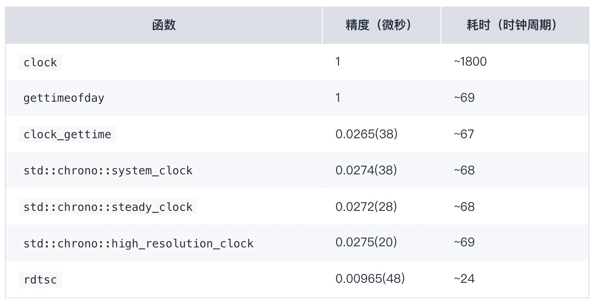

# 33｜性能测试的正确姿势：性能、时间和优化
你好，我是吴咏炜。

在上一讲讲完后，原本计划是要聊一聊内存池的。不过，要说内存池的好坏，就得讨论性能，而之前并没有专门讲过性能测试这个话题。鉴于这个问题本身有一定的复杂性，我们还是先专门用一讲讨论一下性能测试的相关问题。

## 意外的测试结果

假设你想测试一下，`memset` 究竟有没有性能优势。于是，你写下了下面这样的测试代码：

```c++
    #include <stdio.h>
    #include <string.h>
    #include <time.h>
    
    int main()
    {
      constexpr int LOOPS = 10000000;
      char buf[80];
      clock_t t1;
      clock_t t2;
    
      t1 = clock();
      for (int i = 0; i < LOOPS; ++i) {
        memset(buf, 0, sizeof buf);
      }
      t2 = clock();
      printf("%g\n", (t2 - t1) * 1.0 /
                       CLOCKS_PER_SEC);
    
      t1 = clock();
      for (int i = 0; i < LOOPS; ++i) {
        for (size_t j = 0;
             j < sizeof buf; ++j) {
          buf[j] = 0;
        }
      }
      t2 = clock();
      printf("%g\n", (t2 - t1) * 1.0 /
                       CLOCKS_PER_SEC);
    }
```
<!-- [[[read_end]]] -->

然后你运行一下，啊哈，使用 `memset` 要快出 50 倍以上！

> `0.044433`  
> `2.53513`

好奇如你，也许就会想到，开启优化会不会有区别呢？于是，你加上了 `-O2` 命令行选项。在某些编译器上，你可能会对类似下面的结果目瞪口呆的：

> `2e-06`  
> `1e-06`

`memset` 更慢？优化比不优化快了一百万倍？编译器这是疯掉了吗？😱

* * *

到了这里，我们需要复习一下[第 20 讲](https://time.geekbang.org/column/article/186708)里关于内存模型和优化的这两句话：

> 为了优化的必要，编译器是可以调整代码的执行顺序的。唯一的要求是，程序的“可观测”外部行为是一致的。

当时我这么写是要说明，单线程下正确的行为可能到了多线程就有问题。但从性能测试的角度，即使单线程也一样会遇到鬼！编译器非常聪明，它看到了：你往内存里写数据了，又没有使用写到内存的数据；同时这是本地变量，你也没有把变量的引用或指针传到其他地方去。所以，外界不会观测到数据的改变。没人看到的东西，干吗需要存在？于是乎，编译器就把写内存的代码彻底优化没了，没了……

你模模糊糊想起来，`volatile` 关键字可以影响编译器优化。那加上这个关键字是不是有效呢？经过一番折腾，你把代码改成了下面这个样子：

```c++
      volatile char buf[80];
      …
      for (int i = 0; i < LOOPS; ++i) {
        memset(const_cast<char*>(buf),
               0, sizeof buf);
      }
      …
```

运行之后，可能得到下面这样的结果：

> `0.104638`  
> `0.467247`

哈，这就合理多了！看起来，我们可以得出结论，`memset` 确实比手工填充数据要快不少啊。

* * *

不过，这个结论真的正确吗？

答案为否。

`volatile` 关键字确实阻止了编译器优化。但这回它反向影响了。`volatile` 在 C++ 里的语义是，严格按照代码的指示对内存进行读写：你写一次，编译器就产生相应写的代码；你读一次，编译器就产生相应读的代码——一个不多，一个不少。这就导致了对内存操作的性能劣化。通常，你只在进行内存映射的输入输出时才有这么用的必要。

如果不用 `volatile`，那编译器至少在理论上是可以对上面的代码做出更好的优化的。我们把 `buf` 改成一个普通的全局变量，就能测到一个更接近真实的效果了。我们可以看到，GCC 和 Clang 都做出了更好的优化，对 `memset` 和循环清零产生了完全相同的代码。GCC 在 Core i7 架构（`-march=corei7`）上产生的汇编代码如下（参见 <https://godbolt.org/z/xeohT4v1P>）：

```c++
    pxor    xmm0, xmm0
    movaps  XMMWORD PTR buf[rip], xmm0
    movaps  XMMWORD PTR buf[rip+16], xmm0
    movaps  XMMWORD PTR buf[rip+32], xmm0
    movaps  XMMWORD PTR buf[rip+48], xmm0
    movaps  XMMWORD PTR buf[rip+64], xmm0
```

也就是说，编译器洞察了你要做的事情是往 `buf` 里写入 80 个零，因而采取了最高效的方式，一次写 16 个零，连写五次，根本就没有循环了……

## 如何进行性能测试

我上面给出了答案，但我忽略了一些测试细节。很遗憾，这个问题真的有点复杂。我们现在再回过来讨论一下。

### 内存屏障问题

使用全局变量并不意味着我们一定就能测到真实数据。以上面的这个测试为例，虽然编译器看到我们往全局变量写入，就一定不可能把写入完全忽略掉，但它完全可能会做一些写入的合并。事实上，实测下来 Clang 就做了写入的合并，因此测试的结果数据看起来比 GCC 和 MSVC 要漂亮很多。从测试上面两种写法的区别上讲，问题还不算大，但如果我们想拿这个数据来计算代码的性能数据的话，那就要了命了。

一种可能的解法是加入内存屏障，告诉编译器到现在为止的内存修改都得给我完成了。全局锁就是一种通用的内存屏障，但在上面的代码里加入全局锁的话，加解锁的开销就会完全掩盖我们要测试部分的开销了。每种处理器架构都有自己的内存屏障指令，这比 C++ 或操作系统的锁要轻量一点，但对于我们上面的测试来讲，仍然是重了（约 10 倍的性能下降）。每一种编译器，基本上也都有非标准的轻量级内存屏障指令，只影响编译器优化，而不影响 CPU 的处理性能。

最后一种方式看起来最有希望，但遗憾的是，在我们上面的例子里，加入内存屏障本身会影响 GCC 产生的代码。仅针对目前的代码，我们可以写出下面这样一个内存屏障的函数：

```c++
    #ifdef _MSC_VER
    #include <intrin.h>
    #endif
    
    inline void memory_fence()
    {
    #ifdef _MSC_VER
      _ReadWriteBarrier();
    #elif defined(__clang__)
      __asm__ __volatile__("" ::: "memory");
    #endif
    }
```

然后我们在测试代码后调用这个函数，确保对内存的写入会生效。注意我们仍需使用全局变量作为写入目标才行。

这种解法的问题是，它实在太脆弱了。从原理上来讲，它能不能工作并没有任何人可以保证。对于一个新的编译器，代码很可能会无效；对于当前工作的编译器的一个新版本，代码也可能会变为无效……

目前最可靠也最跨平台的解决方案仍然是用锁。如果想使用锁，我们需要有一种比 `clock()` 精度高得多的测量时间的办法。

### 时间测量问题

不同的平台有不同的时间测量函数。具体的细节我就不讨论了，直接给出我的测试结果。

Linux：



Windows：


精度的测量是取当函数返回的数值变化时的差值。当连续调用某一个计时函数时，它返回的结果是可能不变的。当它变化时，变化的数值就是它的测时精度。表中展示的就是这些精度测量结果的平均值（及方差，如果测试结果不完全一样的话）。

精度受 API 设计的影响，也受函数实现的影响。比如，Windows 上定义 `CLOCKS_PER_SEC` 为 1000，显然 `clock()` 也就不可能获得高于一毫秒的精度了。C++11 的三种时钟从目前实现的接口上来看都允许实现一纳秒的精度，但实际精度则要远远低于一纳秒。

测试结果当然跟具体的硬件也可能有关系，但至少这里可以看到一些基本的共性：

* 首先，`clock()` 函数不是个好选择，它的精度可能很差，本身耗时也可能会比较长。
* 其次，C++11 带来的三种时钟不管是精度还是自身开销都还算不错。既然其他方面没有区别，我们就选择使用能提供稳定增长保证的 `steady_clock`（`system_clock` 是不稳定的，系统时间被调整时，时钟返回的数值也会变化；`high_resolution_clock` 的稳定性在标准中没有进行规定）\[1\]。
* 最后，如果时间戳计数器（Time Stamp Counter \[2\]）可用的话，它能提供最高的精度和最短的耗时。它是处理器上的硬件计数器，精度高，速度快，在多核系统上也能提供正确的读数；但在多 CPU 插槽的系统上则不一定能提供相应的保证，因而在那种情况下可能需要把测试程序绑定到某个核上运行。

`rdtsc` 返回的数值单位是时钟周期数（但频率可能跟处理器的实际运行频率不同）。上表中测量各个函数的耗时用的就是 `rdtsc`。

我目前在[代码库](https://github.com/adah1972/geek_time_cpp)里加入了 rdtsc.h 文件。它的实现就是优先使用 x86 和 x86-64 平台提供的 `rdtsc` 的实现，在找不到时转而使用 `stead_clock` 作为替代。有兴趣的可以自行查看。

额外提一句，我这边讲的性能测试是微观层面的测试，即所谓的 microbenchmarking，一般以函数为单位。这种测试是单线程的，需要干扰尽可能少。可能的干扰有：

* 其他的应用程序——应尽可能关闭其他应用，尤其是会耗 CPU的。
* 处理器的自动频率变化——最好关闭这类功能，如 Intel 的 Turbo Boost。
* 不同性能核之间的迁移——如果你的测试系统上有所谓的大小核，而你又没办法把程序绑定到某个核上面的话，那这样的系统不适合用来做微观层面的性能测试。

### 通用测试方法

下面我们讨论一种我个人经常使用的通用的性能测试方法。由于编译器的很多优化机制并不能由代码来控制，这也只能算是一种最佳实践而已。根据你的特定平台，也许你可以找出更好的测试方法。

我的基本方法是：

* 把待测的代码放到一个函数里，这样容易消除一些其他干扰。
* 可选地，把这个函数用 `__attribute__((noinline))` \[3\] 或 `__declspec(noinline)` \[4\] 标注为不要内联。
* 确保有一个依赖函数执行结果的数值会被写到某个全局变量里。根据代码的规模和组织，可以直接在这个函数里写入，或者通过外部传入的一个全局变量的指针或引用来写入。
* 在函数的开头和结尾测量时间，并把测得的时长累加到某个地方。
* 在循环里反复调用被测函数，并在每次调用函数前后进行加解锁，产生内存屏障。

比如，`memset` 的测试代码可能就会变成这个样子：

```c++
    char buf[80];
    uint64_t memset_duration;
    std::mutex mutex;
    
    void test_memset()
    {
      uint64_t t1 = rdtsc();
      memset(buf, 0, sizeof buf);
      uint64_t t2 = rdtsc();
      memset_duration += (t2 - t1);
    }
    
    int main()
    {
      constexpr int LOOPS = 10000000;
      for (int i = 0; i < LOOPS; ++i) {
        std::lock_guard guard{mutex};
        test_memset();
      }
      printf("%g\n", memset_duration * 1.0 / LOOPS);
    }
```

使用这种方法，我们确实可以验证出在 GCC 和 Clang 下，两种清零方法在缓冲区大小已知的情况下可以获得相同的性能（如果大小要运行时才能决定，那就是另外一个需要单独测试的问题了）。

### 一个小测试框架

利用 RAII（[第 1 讲](https://time.geekbang.org/column/article/169225)），我们可以使用一个框架把代码再整理一下，使得测试更加简单和自动。这个框架比较简单，设计和实现我就不讲了。下面给你简单介绍一下它的使用。

对于当前的例子，首先我们需要声明两个待测函数的索引：

```c++
    enum profiled_functions {
      PF_TEST_MEMSET,
      PF_TEST_PLAIN_LOOP,
    };
```

然后，我们需要声明函数索引和函数名的关系：

```c++
    name_mapper name_map[] = {
      {PF_TEST_MEMSET, "test_memset"},
      {PF_TEST_PLAIN_LOOP, "test_plain_loop"},
      {-1, nullptr}};
```

对于待测函数，我们需要在函数开头插入一行代码，表示要对这个函数进行性能测试（利用一个 RAII 对象）：

```c++
    void test_memset()
    {
      PROFILE_CHECK(PF_TEST_MEMSET);
      memset(buf, 0, sizeof buf);
    }
```

这样就行了。下面输出的代码也不需要了，程序会在最后进程退出的时候自动打印汇总测试数据（利用另外一个 RAII 对象），如下所示：

> `0 test_memset:`  
> `Call count: 10000000`  
> `Call duration: 240756468`  
> `Average duration: 24.0756`  
> `1 test_plain_loop:`  
> `Call count: 10000000`  
> `Call duration: 241429159`  
> `Average duration: 24.1429`

完整代码请参考 GitHub 上的[代码库](https://github.com/adah1972/geek_time_cpp)。如果想检查不同架构下的性能差异的话，可以在 cmake 命令行上指定编译器和附加参数，如：

`CXX='g++ \-march=corei7' cmake …`

此外，需要说明一下，跟 `assert` 类似，`PROFILE_CHECK` 宏在 `NDEBUG` 宏被定义时就不生效了。所以，上面的输出在使用了 `cmake \-DCMAKE_BUILD_TYPE=Release …` 时就不会有了。

最后，注意我举这个例子，主要是为了说明测试的复杂性和测试的方法。对于这个例子本身，由于代码简单、运行时间非常短，测试带来的额外开销过大，因而检查汇编输出可能是最好的检查性能的方式。显然，对于更大更复杂的代码，从汇编代码推断性能就困难多了。在那时候，类似目前的测试框架这样的代码就会非常有用。

## 浅谈优化的问题

今天提到的测试困难，很大程度上都是 C++ 编译器的优化造成的。事实上，C++ 里很多未定义行为之所以成为未定义行为，也是跟性能有关的。为了追求性能，C++ 编译器是可谓无所不用其极。有些人觉得编译器忽略了人的意图，感到很不爽，但事实是，C++ 编译器在优化方面确实比大部分程序员做得更好。这也是现在基本上没人写汇编的原因——即使不考虑可移植性，在某一特定平台上要写出超过 C++ 编译器水平的汇编代码，也已经越来越困难了。

但这种优化，虽然常常对程序有好处，也常常是违背程序员的直觉的。我这里另外举两个简单的例子，来说明一下为什么 C++ 编译器**需要**违反程序员的直觉。

### 优化和未定义行为

假如我们有一个 `int` 类型的变量 `x`，那 `x * 2 / 2` 的结果是几？

如果 C++ 把有符号整数运算溢出的结果定义为补码的内存表示，也就是说，32 位正整数 `0x40'00'00'00`（\$2\^\{30\}\$）乘以 2 的结果就是 `0x80'00'00'00`（\$-2\^\{31\}\$），再除以 2 的话，我们就不能得回原先的数值，而是得到了 `0xC0'00'00'00`（\$-2\^\{30\}\$）。这样的话，`x * 2 / 2` 就不能优化为 `x`！

那能不能使用异常呢？也不行。跟除零不一样，整数运算溢出不会产生硬件中断。而如果我们在每条加法、减法、乘法、除法（对，除法也可能溢出—— `INT_MIN / \-1` 就会）上都加入指令来检查是否发生溢出、并在发生溢出时报告异常的话，性能的退步将是不可接受的 \[5\]。

所以，C++ 的处理方式就是，规定有符号整数运算溢出为未定义行为 \[6\]，即程序员需要保证这种情况不会发生，否则后果自负。这在允许编译器把 `x * 2 / 2` 优化成 `x` 的同时，也意味着，下面这样的代码返回的结果可能会跟程序员预想的不同（参见 <https://godbolt.org/z/Ex5ad6vM9>）：

```c++
    bool test(int n)
    {
      return (n + 1) == INT_MIN;
    }
```

你想的是，如果 `n + 1` 溢出了，应该会得到 `INT_MIN` 这个特殊的结果。但编译器可以认为溢出是永远不会发生的（因为正确的程序里不应该有未定义行为），因此可以直接返回 `false`。——这也是实际可以在 GCC 和 Clang 上测到的结果。

### 优化和执行顺序

假设我们有三个全局 `int` 变量 `x`、`y` 和 `a`，然后我们执行下面的代码：

```c++
    x = a;
    y = 2;
```

那是不是编译器会产生先写入 `x`、再写入 `y` 的代码呢？

我想你猜到了，答案为“不一定”。下面是某些编译器实际产生的汇编代码（参见 <https://godbolt.org/z/zsfvsf63E>）：

```c++
    mov     eax, DWORD PTR a
    mov     DWORD PTR y, 2
    mov     DWORD PTR x, eax
```

我们可以看到，编译器产生的代码是：先读入 `a`，再写入 `y`，最后写入 `x`。

为什么要这样？一样，是因为优化。读入 `a` 的数值到 eax 寄存器里，跟写入 2 到 `y` 里是两个不相关操作，可以同时执行。这样的代码，比起完全按程序员指定的执行顺序产生的代码，可望得到更高的性能。

## 内容小结

本讲我们通过一个小例子，讨论了优化跟性能测试的一些问题。希望你在学完这一讲之后，能够了解优化对代码和测试产生的影响，并能正确地测试代码的性能。

## 课后思考

请尝试修改代码，让编译器没法在编译期得到需要清零的数据块大小。测试这种情况下的性能。（提示：你这次需要上面讲到的要求不内联的标注了。）

如果对结果有疑惑，建议使用 Compiler Explorer 网站（[第 21 讲](https://time.geekbang.org/column/article/187980)有介绍）或编译器生成汇编代码（`-S` 或 `/Fa`）的选项来仔细检视一下。

如果有任何疑问，欢迎留言和我讨论。

## 参考资料

\[1\] cppreference.com, “Date and time utilities – Clocks”. <https://en.cppreference.com/w/cpp/chrono#Clocks>

\[1a\] cppreference.com, “日期和时间工具 – 时钟”. <https://zh.cppreference.com/w/cpp/chrono#.E6.97.B6.E9.92.9F>

\[2\] Wikipedia, “Time Stamp Counter”. <https://en.wikipedia.org/wiki/Time_Stamp_Counter>

\[3\] GCC, “GCC 11.2 Manual – Common Function Attributes”. <https://gcc.gnu.org/onlinedocs/gcc-11.2.0/gcc/Common-Function-Attributes.html>

\[4\] Microsoft, “noinline”. <https://docs.microsoft.com/en-us/cpp/cpp/noinline?view=msvc-170>

\[5\] Will Dietz, Peng Li, John Regehr, and Vikram Adve, “Understanding Integer Overflow in C/C++”. <https://www.cs.utah.edu/~regehr/papers/overflow12.pdf>

\[6\] cppreference.com, “Undefined behavior”. <https://en.cppreference.com/w/cpp/language/ub>

\[6a\] cppreference.com, “未定义行为”. <http://zh.cppreference.com/w/cpp/language/ub>