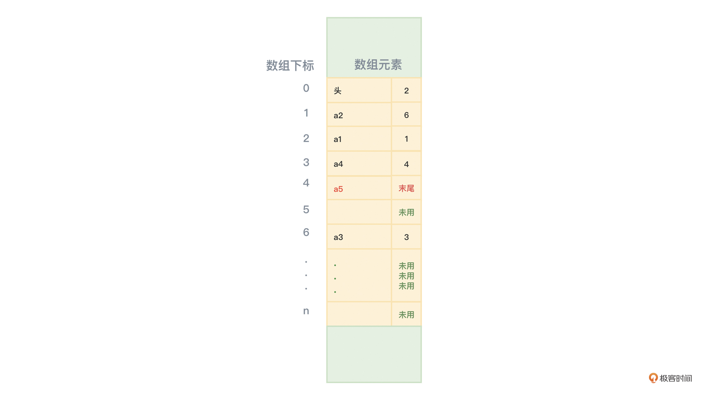
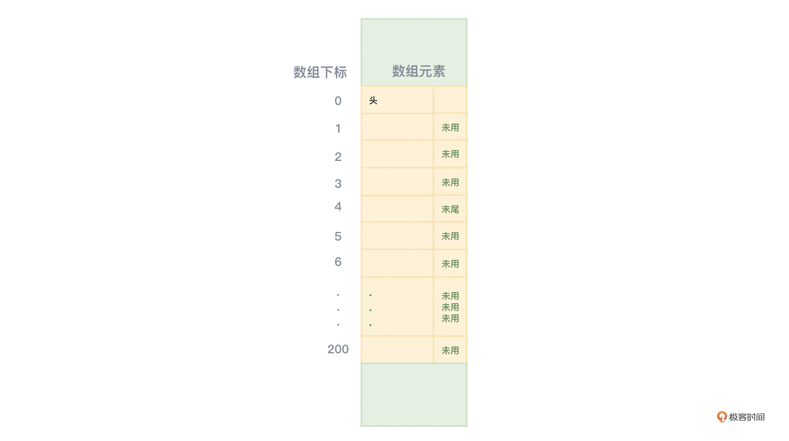
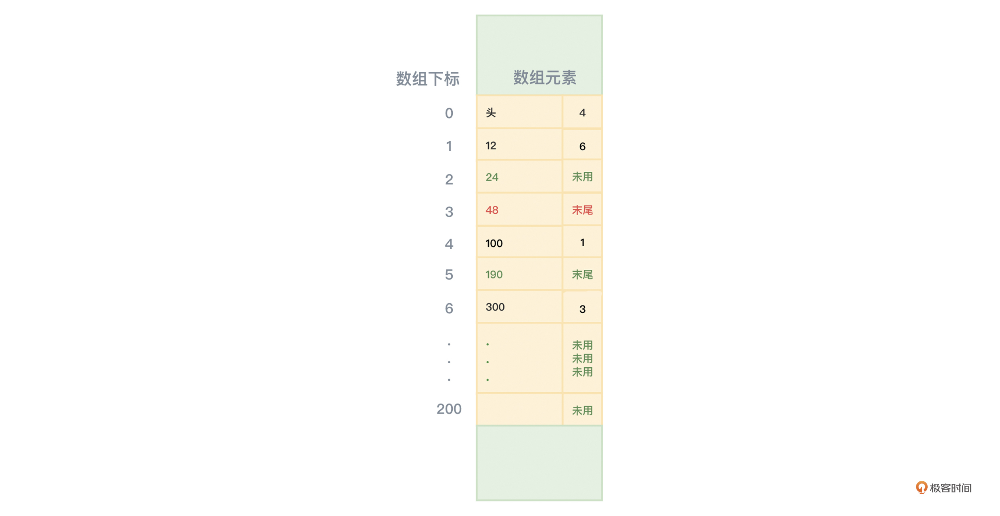

# 07｜静态链表：用一维数组表达的链表
你好，我是王健伟。

前面已经聊了很多种链表，今天我们再来聊一聊最后一种链表——“静态链表”。

有些早期的高级语言，并没有指针这种概念，之前我们探讨的链表实现方法在这些高级语言中并不适用。于是，用 **一维数组** 代替 **指针** 来描述单链表的想法应运而生，这种用一维数组描述的链表，就称为 **静态链表**。

之前我们说过，单链表节点之间在内存中并不需要紧密相连地存放，而采用数组存储数据时则需要数据在内存中紧密相连。所以不难想象，静态链表在内存中也需要分配一整块连续的内存空间，如图8所示：



你会发现，说是内存空间紧密相连，但是链表中的各个节点却是并不需要紧密地连在一起的。

每个数组元素都是由两个数据域组成：data和cur。其中data用来存储链表中每个节点的数据，cur用来存储链表中后继节点所属的数组元素的下标（cur也称为 **游标**，用来 **模拟指针**）。比如图8中存储数据a2的区域就是data域，存储数字6的区域就是cur域。

注意，如果cur域的值为“末尾（一个负数作为标记）”，则表示该cur所代表的数组元素是链表中的最后一个节点，比如图8中存储数据a5的节点。下标为0的数组元素可以看成是链表的头节点，其cur域的值（数字2）用于指示链表第一个数据节点对应的数组下标。所以，数据a1所在的节点，其实就是静态链表的第一个数据节点。

理解之后，我们就来说具体的实现方式了。静态链表的实现代码有很多种，这里我选择一种从代码可读性上比较好理解的实现方法来讲解。在后面的课后思考中，我会让你实现一个稍微复杂点的静态链表。

# 静态链表的类定义、初始化操作

还是先说类定义和初始化操作。

下面是静态链表的类定义、初始化操作的相关实现代码。

```plain
#define MaxSize 201 //静态链表的尺寸，可以根据实际需要设定该值。可用数组下标为0-200
//节点使用情况枚举标记值
enum NODEUSE
{
	//这些枚举值都给负值，以免和数组下标（从0开始的正值）冲突
	e_NOUSE = -1,  //未使用（未用）
	e_LAST  = -2   //最后一个节点（末尾）
};

//静态链表中每个节点的定义
template <typename T> //T代表数据元素的类型
struct Node
{
	T        data;  //元素数据域，存放数据元素
	int      cur;   //游标，记录下个静态链表节点的数组下标
};

//静态链表的定义
template <typename T>
class StaticLinkList
{
public:
	StaticLinkList();                    //构造函数
	~StaticLinkList() {};                //析构函数

public:
	int  findAnIdlePos();                //找到一个空闲位置用于保存数据
	bool ListInsert(int i, const T& e);  //在第i个位置插入指定元素e
	bool ListDelete(int i);              //删除第i个位置的元素

	bool GetElem(int i, T& e);           //获得第i个位置的元素值
	int  LocateElem(const T& e);       //按元素值查找其在静态链表中第一次出现的位置

	void DispList();                     //输出静态链表中的所有元素
	int  ListLength();                   //获取静态链表的长度
	bool Empty();                        //判断静态链表是否为空

private:
	Node<T> m_data[MaxSize]; //保存节点数据的数组
	int m_length;            //当前长度，也就是当前保存的数据节点数目
};

//通过构造函数对静态链表进行初始化
template <typename T>
StaticLinkList<T>::StaticLinkList()
{
	for (int i = 1; i < MaxSize; ++i) //从下标1开始的节点用于保存实际的数据，这些节点的cur有必要设置值，而头节点其实不用给任何初值
	{
		m_data[i].cur = e_NOUSE; //标记这些节点都没使用
	}
	m_length = 0; //还未向其中存入任何数据元素
}

```

之后，我们在main主函数中，可以加入下面的代码创建一个静态链表对象。

```plain
StaticLinkList<int> slinkobj;

```

这个时候，所创建的静态链表对象应该如图9所示，静态链表已经创建完毕，只不过这个链表中目前还没有存储任何数据，可以认为是一个空链表。



# 静态链表元素插入操作

在指定位置插入元素的操作，可以分为4个核心步骤。

1. 找到一个空闲位置代表新插入的节点，在其中存入数据元素。
2. 从头节点开始，找到待插入位置的前一个（前趋）节点。
3. 设置新插入节点的cur值以指向前趋节点所指向的节点，设置前趋节点的cur值以指向这个新插入的节点。
4. 如果新插入的节点是最后一个节点，要设置其cur标记为“末尾”。

下面是插入操作ListInsert的实现代码（同时引入辅助函数findAnIdlePos）。

```plain
//在m_data中找到一个空闲位置用于保存数据，若没有找到（静态链表满了），则返回-1
template <typename T>
int StaticLinkList<T>::findAnIdlePos()
{
	for (int i = 1; i < MaxSize; ++i) //因为下标0是头节点，不能用于保存数据，所以循环变量从1开始
	{
		if (m_data[i].cur == e_NOUSE) //未使用
			return i;
	}
	return -1;
}

//在第iPos个位置（位置编号从1开始）插入指定元素e
template <typename T>
bool StaticLinkList<T>::ListInsert(int iPos, const T& e)
{
	if (iPos < 1 || iPos > (m_length + 1))
	{
		cout << "元素" << e << "插入的位置" << iPos << "不合法，合法的位置是1到" << m_length + 1 << "之间!" << endl;
		return false;
	}

	int iIdx;
	if ((iIdx = findAnIdlePos()) == -1) //静态链表满了
	{
		cout << "静态链表已满!" << endl;
		return false;
	}

	//既然需要在第iPos个位置插入元素，那么肯定要找到第iPos-1个位置。
	int iDataCount = 1; //统计静态链表中元素数量
	int iIdxPrev;       //保存第iPos-1个位置对应的m_data数组的下标

	if (iPos == 1) //向第一个位置插入元素，要单独处理
	{
		m_data[iIdx].data = e;
		if (m_length == 0) //空表
		{
			m_data[iIdx].cur = e_LAST;
		}
		else //非空表
		{
			m_data[iIdx].cur = m_data[0].cur;
		}
		m_data[0].cur = iIdx;
	}
	else
	{
		int iPosCount = 0; //位置计数
		int tmpcur = m_data[0].cur;

		//前面已经判断过插入位置合法，所以一定可以找到合适的位置，while(true)循环肯定可以正常退出
		while (true)
		{
			iPosCount++;
			if (iPosCount >= (iPos - 1)) //找到了第iPos-1个位置
			{
				iIdxPrev = tmpcur;
				break;
			}
			tmpcur = m_data[tmpcur].cur;

		} //end while

		int iTmpCurr = m_data[iIdxPrev].cur;
		m_data[iIdxPrev].cur = iIdx;
		m_data[iIdx].data = e;
		m_data[iIdx].cur = iTmpCurr;
	}
	cout << "成功在位置为" << iPos << "处插入元素" << e << "!" << endl;
	m_length++;	   //实际表长+1
	return true;
}

```

在main主函数中，我们继续加入测试代码。

```plain
slinkobj.ListInsert(1, 12);
slinkobj.ListInsert(1, 24);
slinkobj.ListInsert(3, 48);
slinkobj.ListInsert(2, 100);
slinkobj.ListInsert(5, 190);
slinkobj.ListInsert(4, 300);

```

执行上述代码后，静态链表存储数据的情形以及对应的单链表应该如图10所示：


执行结果为：


# 静态链表元素显示、获取等操作

静态链表元素的显示、获取操作相关的函数一共有三个，分别为DispList、GetElem、LocateElem。取得静态链表长度的是ListLength函数，判断静态链表是否为空的为Empty函数。我们分别看一看。

首先，输出静态链表中的所有元素。

```plain
//输出静态链表中的所有元素，时间复杂度为O(n)
template<class T>
void StaticLinkList<T>::DispList()
{
	if (m_length < 1)
	{
		//静态链表为空
		return;
	}
	int tmpcur = m_data[0].cur;
	while (true)
	{
		cout << m_data[tmpcur].data << " ";
		if ((tmpcur = m_data[tmpcur].cur) == e_LAST)
			break;
	} //end while
	cout << endl; //换行
}

```

再来，是按照位置，或按照元素值查找。

```plain
//获得第i个位置的元素值，时间复杂度为O(n)
template<class T>
bool StaticLinkList<T>::GetElem(int i, T& e)
{
	if (m_length < 1)
	{
		//静态链表为空
		cout << "当前静态链表为空，不能获取任何数据!" << endl;
		return false;
	}

	if (i < 1 || i > m_length)
	{
		cout << "获取元素的位置" << i << "不合法，合法的位置是1到" << m_length << "之间!" << endl;
		return false;
	}
	int tmpcur = m_data[0].cur;
	int iPos = 0;
	while (true)
	{
		iPos++;
		if (iPos == i)
		{
			e = m_data[tmpcur].data;
			cout << "成功获取位置为" << i << "的元素，该元素的值为" << e << "!" << endl;
			return true;
		}
		tmpcur = m_data[tmpcur].cur;
	}
	return false;
}

//按元素值查找其在静态链表中第一次出现的位置，时间复杂度为O(n)
template<class T>
int StaticLinkList<T>::LocateElem(const T& e)
{
	if (m_length < 1)
	{
		//静态链表为空
		cout << "当前静态链表为空，不能获取任何数据!" << endl;
		return -1;
	}
	int tmpcur = m_data[0].cur;
	int iPos = 0;
	while (true)
	{
		iPos++;
		if (m_data[tmpcur].data == e && m_data[tmpcur].cur != e_NOUSE)
		{
			cout << "值为" << e << "的元素在静态链表中第一次出现的位置为" << iPos << "!" << endl;
			return tmpcur;
		}
		if (m_data[tmpcur].cur == e_LAST)
		{
			//这是没找到
			break;
		}
		tmpcur = m_data[tmpcur].cur;
	}
	cout << "值为" << e << "的元素在静态链表中没有找到!" << endl;
	return -1;  //返回-1表示查找失败
}

```

最后，是两个其他操作，获取长度以及判断链表是否为空。

```plain
//获取静态链表的长度，时间复杂度为O(1)
template<class T>
int  StaticLinkList<T>::ListLength()
{
	return m_length;
}

//判断静态链表是否为空，时间复杂度为O(1)
template<class T>
bool StaticLinkList<T>::Empty()
{
	if (m_length < 1)
	{
		return true;
	}
	return false;
}

```

在main主函数中，继续增加代码。

```plain
slinkobj.DispList();
slinkobj.LocateElem(190);
slinkobj.LocateElem(24);
slinkobj.LocateElem(300);
cout << "----------------" << endl;
int eval = 0;
slinkobj.GetElem(0, eval); //如果GetElem()返回true，则eval中保存着获取到的元素值
slinkobj.GetElem(1, eval);
slinkobj.GetElem(3, eval);
slinkobj.GetElem(6, eval);

```

新增代码的执行结果为：


# 静态链表元素删除操作

删除指定位置元素的操作核心步骤我们可以分为3步。

1. 从头节点开始，找到待删除节点的前一个（前趋）节点。
2. 设置前趋节点的cur值等于当前待删除节点的cur值以指向当前节点所指向的节点。
3. 设置被删除节点的状态为“未用”状态。

下面是删除操作ListDelete的实现代码。

```plain
//删除第iPos个位置的元素
template < typename T>
bool StaticLinkList<T>::ListDelete(int iPos)
{
	if (m_length < 1)
	{
		cout << "当前静态链表为空，不能删除任何数据!" << endl;
		return false;
	}
	if (iPos < 1 || iPos > m_length)
	{
		cout << "删除的位置" << iPos << "不合法，合法的位置是1到" << m_length << "之间!" << endl;
		return false;
	}

	int tmpcur = m_data[0].cur; //第一个数据节点的数组下标
	if (iPos == 1) //删除第一个位置元素，要单独处理
	{
		if (m_length != 1)
		{
			//这个静态链表里有多个元素，那么
			m_data[0].cur = m_data[tmpcur].cur; //头节点指向第二个数据节点的数组下标
		}
		m_data[tmpcur].cur = e_NOUSE;
		cout << "成功删除位置为" << iPos << "的元素，该元素的值为" << m_data[tmpcur].data << "!" << endl;
	}
	else
	{
		int iIdxPrev; //第iPos-1个位置对应的m_data数组的下标
		int iPosCount = 0; //位置计数

		//前面已经判断过删除位置合法，所以一定可以找到合适的位置，while(true)循环肯定可以正常退出
		while (true)
		{
			iPosCount++;
			if (iPosCount >= (iPos - 1)) //找到了第i-1个位置
			{
				iIdxPrev = tmpcur;
				break;
			}
			tmpcur = m_data[tmpcur].cur;
		} //end while

		int iTmpCurr = m_data[iIdxPrev].cur; //当前要删除的这个节点的数组下标
		m_data[iIdxPrev].cur = m_data[iTmpCurr].cur;//前一个节点的cur指向当前要删除节点的cur
		m_data[iTmpCurr].cur = e_NOUSE; //标记被删除数据节点的数组下标为未用状态
		cout << "成功删除位置为" << iPos << "的元素，该元素的值为" << m_data[iTmpCurr].data << "!" << endl;
	} //end if (iPos == 1)
	m_length--;       //实际表长-1
	return true;
}

```

在main主函数中，继续增加代码测试。

```plain
cout << "----------------" << endl;
slinkobj.ListDelete(1);
slinkobj.ListDelete(5);
slinkobj.ListDelete(10);
slinkobj.DispList();

```

新增加代码行的执行结果为：


此时，静态链表存储数据的情形应该如图11所示：



在图11中，删除了两个数据后，原来值为24和190的位置已经被标记为“未用”状态，此时，该位置的数字就没有任何存在的意义了，因为该位置已经是一个未被使用的位置，下次插入新数据时，findAnIdlePos函数会直接找到并使用这些“未用”的位置。

我们在main主函数中继续增加代码行。

```plain
cout << "----------------" << endl;
slinkobj.ListInsert(1, 500);
slinkobj.ListInsert(3, 600);
slinkobj.ListInsert(4, 700);
slinkobj.DispList();

```

新增加代码行的执行结果为：


结合图11，想一想，这个时候的静态链表存储数据的情形如何呢？就留给你思考和亲测吧。

# 小结

这节课我们讲解了静态链表。静态链表的实现代码有很多种，非常灵活。

在今天的讲解中，我们是通过findAnIdlePos函数寻找了一个空闲位置，保存数据的时候，每次也都是从头节点的后继节点开始寻找，这就导致，当链表中数据较多的时候，恐怕会影响效率。

因此，你也可以采用不同的静态链表实现方式——比如将静态链表中的第一个和最后一个节点作为特殊节点来使用（不保存数据）。

- 第一个节点的cur存放第一个未被使用的节点所对应的数组下标（这些未被使用的节点可以通过cur串起来，构成一个未被使用的节点链）。
- 最后一个节点的cur存放第一个有数据的节点对应的数组下标（相当于头节点），该值为0相当于链表为空。

这样的静态链表实现方式，虽然代码会更加繁琐，但在插入数据的时候可以明显提高寻找空闲节点的效率，时间复杂度会从O(n)变为O(1)。如果你有兴趣，也可以自行实现相关的代码。

静态链表中，元素的插入和删除操作并不需要移动元素，仅仅是修改游标。所以仍旧具备链表的主要优点——插入和删除节点非常方便，同时，也避免了顺序表要求所有数据元素在内存中必须紧挨在一起的缺点。

另外，存取数据时，静态链表无法进行随机存取，只能从头节点开始依次向后查找。而且静态链表的大小是固定的，无法扩容，所以静态链表往往比较适合 **不支持指针的程序开发语言环境且数据最大容量是固定不变的场合**，目前的应用并不是十分广泛，但其中代码的实现方式，绝对值得我们学习和借鉴。

最后，我们来总结一下目前为止所讲过的各种数据结构保存数据的特点。

- 顺序表：所分配的内存空间连续，其中保存的各个数据节点也紧密相连。
- 单（双）链表、单（双）循环链表：分配的内存空间不连续（每个数据节点单独分配内存），当然链表中的数据节点也就不可能紧密相连。
- 静态链表：所分配的内存空间连续，所有的数据节点都会保存在这块内存空间中，但因为引入了游标来寻找各个数据节点，所以静态链表中各个数据节点并不要求紧密相连。

# 归纳思考

在小结中，我们提到了一种不同的静态链表实现方式——将静态链表中的第一个和最后一个节点作为特殊节点来使用，你可以尝试自行实现这种静态链表相关的代码。

欢迎你在留言区和我互动。如果觉得有所收获，也可以把课程分享给更多的朋友一起学习进步。我们下节课见！