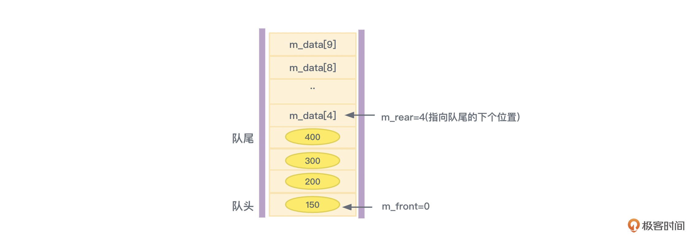
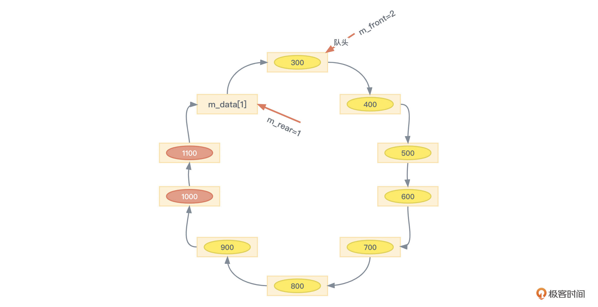

# 09｜队列：如何实现数据的先进先出？
你好，我是王健伟。

上节课我们提到的“栈”，用的是“桶”和“抽屉”做类比，实现的是先进后出。这节课我们来聊“队列”，根据名字想象一下，它实现的是不是 **先进先出** 了呢？

是的。队列也是一种受限的线性表，它的特点是在一端进行插入操作，在另一端进行删除操作（与栈刚好相反）。把允许进行插入操作的一端称为 **队尾**，允许删除操作的一端称为 **队头**。

把队列想象成人们排队购物，排在队伍第一位的人最先购买然后最先离开，而排在队伍最后一位的人最后购买最后离开。我们向队列中插入元素，就叫做入队，从队列中删除元素，叫做出队。不包含任何数据的队列，就是空队列。

队列也被称为先进先出（First In First Out：FIFO）的线性表。换句话说，插入数据只能在队尾（队列尾部）进行，删除数据只能在队头（队列头部）进行。

用队列存取数据的示意图，如图1所示：


如果我们分别将数据a1、a2、a3、a4、a5入队，那么在将数据出队的时候，顺序同样是a1、a2、a3、a4、a5，和入队顺序是一样的。

队列支持的操作和栈非常类似，一般包括队列的创建、入队（插入/增加数据）、出队（删除数据）、获取队头元素（查找数据）、判断队列是否为空或者是否已满等等操作。

接下来，我们就看下这些操作的实现。

# 队列的顺序存储（顺序队列）

所谓顺序队列，就是顺序存储，也就是用一段连续的内存空间，去依次存储队列中的数据。和顺序栈一样，为了数据存满时可以对队列进行扩容，顺序队列也会采用为一维数组动态分配内存的方案来编写实现代码。

## 基础实现代码

先来看一些基础的实现代码：类定义、初始化以及释放操作。

```plain
#define MaxSize 10       //数组的尺寸
template <typename T> //T代表数组中元素的类型
class SeqQueue
{
public:
	SeqQueue();                          //构造函数
	~SeqQueue();                         //析构函数

public:
	bool EnQueue(const T& e);            //入队列（增加数据）
	bool DeQueue(T& e);                  //出队列（删除数据）
	bool GetHead(T& e); //读取队头元素，但该元素并没有出队列而是依旧在队列中
	void ClearQueue();                   //将队列清空

	void DispList();                     //输出顺序队列中的所有元素
	int  ListLength();                  //获取顺序队列的长度（实际拥有的元素数量）
	bool IsEmpty();                      //判断顺序队列是否为空
	bool IsFull();                       //判断顺序队列是否已满

private:
	T* m_data;                           //存放顺序队列中的元素
	int m_front;                         //队头指针(数组下标)，允许删除的一端，如果队列不为空，则指向队列头元素
	int m_rear;                          //队尾指针(数组下标)，允许插入的一端 ，如果队列不为空，则指向队尾元素的下一个位置
};

//通过构造函数对顺序队列进行初始化
template <typename T>
SeqQueue<T>::SeqQueue()
{
	m_data = new T[MaxSize];  //为一维数组动态分配内存

	//空队列约定m_front和m_rear都为0
	m_front = 0;
	m_rear = 0;
}

//通过析构函数对顺序队列进行资源释放
template <typename T>
SeqQueue<T>::~SeqQueue()
{
	delete[] m_data;
}

```

之后，就是入队列、出队列、读取队头元素操作代码。

```plain
//入队列（增加数据），也就是从队尾增加数据
template <typename T>
bool SeqQueue<T>::EnQueue(const T& e)
{
	if (IsFull() == true)
	{
		cout << "顺序队列已满，不能再进行入队操作了!" << endl;
		return false;
	}

	m_data[m_rear] = e; //将数据放入队尾
	m_rear++;//队尾指针向后走，本行和上一行可以合并写成一行代码：m_data[m_rear++] = e;
	return true;
}

//出队列（删除数据），也就是删除队头数据
template <typename T>
bool SeqQueue<T>::DeQueue(T& e)
{
	if (IsEmpty() == true)
	{
		cout << "当前顺序队列为空，不能进行出队操作!" << endl;
		return false;
	}

	e = m_data[m_front];  //队头元素值返回到e中。
	m_front++;//本行和上一行可以合并写成一行代码：e = m_data[m_front++];
	return true;
}

//读取队头元素，但该元素并没有出队列而是依旧在队列中
template <typename T>
bool SeqQueue<T>::GetHead(T& e)
{
	if (IsEmpty() == true)
	{
		cout << "当前顺序队列为空，不能读取队头元素!" << endl;
		return false;
	}

	e = m_data[m_front];  //队头元素返回到e中。
	return true;
}

```

最后，是一些顺序队列的常用操作，比如输出所有元素、获取长度、判断是否为空、是否已满、将队列清空。

```plain
//输出顺序队列中的所有元素，时间复杂度为O(n)
template<class T>
void SeqQueue<T>::DispList()
{
	//按照从队头到队尾的顺序来显示数据
	for (int i = m_front; i < m_rear ; ++i)
	{
		cout << m_data[i] << " ";  //每个数据之间以空格分隔
	}
	cout << endl; //换行
}

//获取顺序队列的长度（实际拥有的元素数量），时间复杂度为O(1)
template<class T>
int SeqQueue<T>::ListLength()
{
	return m_rear - m_front;
}

//判断顺序队列是否为空，时间复杂度为O(1)
template<class T>
bool SeqQueue<T>::IsEmpty()
{
	if (m_front == m_rear)
	{
		return true;
	}
	return false;
}

//判断顺序队列是否已满，时间复杂度为O(1)
template<class T>
bool SeqQueue<T>::IsFull()
{
	if(m_rear >= MaxSize) //队尾指针和数组容量做比较
	{
		return true;
	}
	return false;
}

//将队列清空
template<class T>
void SeqQueue<T>::ClearQueue()
{
	m_front = m_rear = 0;
	}

```

在main主函数中，我们可以加入下面的测试代码，实现4个数据的入队列。

```plain
SeqQueue<int> seqobj;
seqobj.EnQueue(150);
seqobj.EnQueue(200);
seqobj.EnQueue(300);
seqobj.EnQueue(400);
seqobj.DispList();

```

执行结果为：


此时，队列的情形如2所示：



之后，我们可以继续在main中加入下面的代码来将2个元素出队。

```plain
cout << "---------" << endl;
int eval = 0;
seqobj.DeQueue(eval);
seqobj.DeQueue(eval);
seqobj.DispList();

```

新增代码的执行结果如下：


从结果中可以看到，队头的两个元素出队（被删除）了，此时，队列的情形如图3所示：


从图3可以看到，将两个元素出队后，队头指针m\_front从0变成了2。而此时m\_data\[0\]和m\_data\[1\]这两个能够容纳元素的位置实际上是空出来了。但如果此时继续将新的元素入队，那么m\_rear值会不断增加，元素会被继续放入m\_data\[4\]、m\_data\[5\]、m\_data\[6\]… m\_data\[9\]等位置。

试想，当m\_data\[9\]被放入了元素后，继续向队列中放入元素，就会导致IsFull成员函数返回true，意味着队列已满，无法入队更多元素，而实际上此时m\_data\[0\]和m\_data\[1\]这两个位置还是可以容纳两个元素的。所以， **此时队列的满** **，** **是一种虚假的满。**

那要如何解决这个问题呢？也许你会想在入队并发现数组头还有空闲位置的时候，通过数据搬运的方式来填补空闲位置，不过这并不是一个好办法，会大大增加入队的时间复杂度，所以解决的办法是对上述代码做适当改进，引入循环队列的概念。

## 循环队列

什么是循环队列？在图3中，即便IsFull成员函数返回true，但实际上队列也并没有满。因为m\_data\[0\]和m\_data\[1\]这两个位置还是可以容纳新元素的。所以必须让m\_rear指针指回到m\_data\[0\]去，这样才可以继续从m\_data\[0\]开始保存新元素。

为了做到这一点，我们可以修改EnQueue这个入队成员函数，下面是修改后的代码。

```plain
//入队列（增加数据），也就是从队尾增加数据
template <typename T>
bool SeqQueue<T>::EnQueue(const T& e)
{
	if (IsFull() == true)
	{
		cout << "顺序队列已满，不能再进行入队操作了!" << endl;
		return false;
	}

	m_data[m_rear] = e; //将数据放入队尾
	//m_rear++; //队尾指针向后走，本行和上一行可以合并写成一行代码：m_data[m_rear++] = e;
	m_rear = (m_rear + 1) % MaxSize; //队尾指针加1并取余，这样m_data的下标就控制在了0到(MaxSize-1)之间了
	return true;
	}

```

可以看到，这里是对m\_rear这个队尾指针加1后取余，这样，当m\_rear到达9（MaxSize-1）后再次入队元素时，m\_rear就会变为0，就正好可以在m\_data\[0\]这个位置继续保存新入队的元素。

换句话说，此时随着新元素的入队，在队列不满的情况下，m\_rear值的变化就是从0到9，然后再变回0，不断增加到9……如此反复。显然，我们可以 **把顺序队列看成是一个环状的队列，队列首尾相连，保存数据元素的空间就好像是一个环状空间，这种头尾相接的队列，就叫做循环队列。**

之后，继续在main中加入代码行来向队列中继续增加5个元素。

```plain
cout << "---------" << endl;
seqobj.EnQueue(500);
seqobj.EnQueue(600);
seqobj.EnQueue(700);
seqobj.EnQueue(800);
seqobj.EnQueue(900);
	seqobj.DispList();

```

新增代码的执行结果如下：


此时的循环队列示意图，如图4所示：


如果此时再入队1个元素，那么这个元素将保存在m\_data\[9\]的位置且m\_rear将等于0。这样再次入队新元素时，m\_data\[0\]、m\_data\[1\]这样的空闲位置就可以被使用了。

不过，问题又来了。要怎么判断循环队列什么时候满了呢？目前判断队列是否已满的成员函数IsFull的判满条件是只要m\_rear >= MaxSize，也就是只要队尾指针达到了数组容量，就认为队列满了，这显然不行。我们之前已经看到，m\_rear的值因为取余的原因，永远都小于MaxSize，也就是队列永远不会满，这显然是不对的。

想象一下，如果把图4中的m\_data\[0\]到m\_data\[9\]全部存满数据，那队列显然就是满的了，此时m\_rear == m\_front就会成立。我们知道，判断队列是否为空的成员函数IsEmpty的判断条件同样是m\_front == m\_rear，这意味着判断队列空和队列满的代码是相同的，这是不可以的。

为此，一个比较常用的判断循环队列是否满的方法，就是通过牺牲一个保存元素的空间来判断，如图5所示：



你看，在图5中，队列中一共有10个位置，但只保存了9个元素，留出了1个空闲位置不允许插入元素，这个时候，就满足条件m\_rear+1 == m\_front，或者更严谨地说，应该是(m\_rear + 1) % MaxSize == m\_front，也就是说，当该条件成立时，就认为队列满了（即使该队列还有一个空闲位置）。

下面是修改后的IsFull成员函数代码。

```plain
//判断顺序队列是否已满，时间复杂度为O(1)
template<class T>
bool SeqQueue<T>::IsFull()
{
	//if(m_rear >= MaxSize) //队尾指针和数组容量做比较
	if((m_rear + 1) % MaxSize == m_front)
	{
		return true;
	}
	return false;
}

```

当然，出队列成员函数DeQueue也必须做出修改以控制m\_front的取值范围，下面是修改后的代码。

```plain
//出队列（删除数据），也就是删除队头数据
template <typename T>
bool SeqQueue<T>::DeQueue(T& e)
{
	if (IsEmpty() == true)
	{
		cout << "当前顺序队列为空，不能进行出队操作!" << endl;
		return false;
	}

	e = m_data[m_front];  //队头元素值返回到e中。
	//m_front++;//本行和上一行可以合并写成一行代码：e = m_data[m_front++];
	m_front = (m_front +1) % MaxSize; //队头指针加1并取余
	return true;
	}

```

其他一些需要修改的成员函数代码这里也给出了参考。

```plain
//获取顺序队列的长度（实际拥有的元素数量），时间复杂度为O(1)
template<class T>
int SeqQueue<T>::ListLength()
{
	//return m_rear - m_front;
	return (m_rear + MaxSize - m_front) % MaxSize;
}

//输出顺序队列中的所有元素，时间复杂度为O(n)
template<class T>
void SeqQueue<T>::DispList()
{
	//按照从队头到队尾的顺序来显示数据
	//for (int i = m_front; i < m_rear ; ++i)
	for (int i = m_front; i != m_rear;)
	{
		cout << m_data[i] << " ";  //每个数据之间以空格分隔
		i = (i + 1) % MaxSize;
	}
	cout << endl; //换行
	}

```

如果你认为，就为了判断队列是不是满了，就浪费了一个空闲队列的位置，实在是不值得，那么你还可以引入其他的方法，这里列举两种。

- 引入一个int类型的成员变量m\_size，初始值为0，当成功入队列一个元素时，m\_size自加1，当成功出队列一个元素时，m\_size自减1，那么，就可以通过m\_size的值来判断队列是满还是空了（m\_size==0为空，m\_size== MaxSize为满）。

- 引入一个char（一个字节够了）类型的成员变量m\_tag，初始值为0。当执行出队列（删除）操作时，把该变量的值设置为0，当执行入队列（插入）操作时，把该变量的值设置为1，这样就标记了最近是执行了删除操作还是插入操作。注意，只有出队列操作才会导致队列为空，只有入队列操作才会导致队列变满，所以，代码大概就会是下面的样子。


```plain
template <typename T>
bool SeqQueue<T>::EnQueue(const T& e) //入队列操作
{
	if (IsFull() == true)
	{
		cout << "顺序队列已满，不能再进行入队操作了!" << endl;
		return false;
	}
	m_tag = 1; //入队
	......
}
template<class T>
bool SeqQueue<T>::IsFull()//判断顺序队列是否已满
{
	if (m_front == m_rear && tag == 1)
		return true;
	return false;
}
template <typename T>
bool SeqQueue<T>::DeQueue(T& e) //出队列操作
{
	if (IsEmpty() == true)
	{
		cout << "顺序队列为空，不能进行出队操作!" << endl;
		return false;
	}
	m_tag = 0; //出队
	......
}
template<class T>
bool SeqQueue<T>::IsEmpty()//判断顺序队列是否为空
{
	if (m_front == m_rear && tag == 0)
	{
		return true;
	}
	return false;
	}

```

# 队列的链式存储（链式队列）

一般来讲，如果队列长度的最大值比较确定的情况下，可以考虑使用顺序队列（循环队列），否则，就可以考虑使用链式队列了。

所谓链式队列，就是用链式存储的方式来实现的队列。你可以把它理解成一个操作受限的单链表，只允许在尾部插入元素，只允许在头部删除元素。之前学习过单链表的你，这里再学习链式队列，就会非常容易。

和单链表一样，链式队列可以带头结点，也可以不带头结点，同样为编程方便，这里我会采用带头节点的实现方式去讲解。

先来看一些基础的实现代码。先说类定义、初始化以及释放操作。

```plain
//链式队列中每个节点的定义
template <typename T> //T代表数据元素的类型
struct QueueNode
{
	T data;       //数据域，存放数据元素
	QueueNode<T>* next;  //指针域，指向下一个同类型（和本节点类型相同）节点
};

//链式队列的定义
template <typename T> //T代表数组中元素的类型
class LinkQueue
{
public:
	LinkQueue();                          //构造函数
	~LinkQueue();                         //析构函数

public:
	bool EnQueue(const T& e);            //入队列（增加数据）
	bool DeQueue(T& e);                  //出队列（删除数据）
	bool GetHead(T& e);   //读取队头元素，但该元素并没有出队列而是依旧在队列中

	void DispList();                     //输出链式队列中的所有元素
	int  ListLength();                  //获取链式队列的长度（实际拥有的元素数量）
	bool IsEmpty();                      //判断链式队列是否为空

private:
	QueueNode<T>* m_front;              //头指针（指向头结点），这一端允许出队（删除）
	QueueNode<T>* m_rear;                //专门引入尾指针以方便入队（插入）操作
	int m_length;                        //记录长度，方便获取长度
};

//通过构造函数对链式队列进行初始化
template <typename T>
LinkQueue<T>::LinkQueue()
{
	m_front = new QueueNode<T>; //先创建一个头结点
	m_front->next = nullptr;
	m_rear = m_front;
	m_length = 0;

	//若不带头节点的链式队列初始化代码应该如下，供参考
	/*m_front = nullptr;
	m_rear = nullptr;*/
}

//通过析构函数对链式队列进行资源释放
template <typename T>
LinkQueue<T>::~LinkQueue()
{
	QueueNode<T>* pnode = m_front->next;
	QueueNode<T>* ptmp;
	while (pnode != nullptr) //该循环负责释放数据节点
	{
		ptmp = pnode;
		pnode = pnode->next;
		delete ptmp;
	}
	delete m_front;             //释放头结点
	m_front = m_rear = nullptr; //非必须
	m_length = 0;               //非必须
}

```

之后，就是入队列、出队列、读取队头元素操作代码。

```plain
//入队列（增加数据），也就是从队尾增加数据
template <typename T>
bool LinkQueue<T>::EnQueue(const T& e)
{
	QueueNode<T>* node = new QueueNode<T>;
	node->data = e;
	node->next = nullptr;

	m_rear->next = node; //新节点插入到m_rear后面
	m_rear = node;       //更新队列尾指针

	m_length++;
	return true;
}

//出队列（删除数据），也就是删除队头数据
template <typename T>
bool LinkQueue<T>::DeQueue(T& e)
{
	if (IsEmpty() == true)
	{
		cout << "当前链式队列为空，不能进行出队操作!" << endl;
		return false;
	}

	QueueNode<T>* p_willdel = m_front->next;
	e = p_willdel->data;

	m_front->next = p_willdel->next;
	if (m_rear == p_willdel) //队列中只有一个元素节点（被删除后，整个队列就为空了）
		m_rear = m_front;  //设置队列为空(尾指针指向头指针)

	delete p_willdel;
	m_length--;
	return true;
}

//读取队头元素，但该元素并没有出队列而是依旧在队列中
template <typename T>
bool LinkQueue<T>::GetHead(T& e)
{
	if (IsEmpty() == true)
	{
		cout << "当前链式队列为空，不能读取队头元素!" << endl;
		return false;
	}

	e = m_front->next->data;
	return true;
}

```

最后，是一些链式队列的常用操作，比如输出所有元素、获取长度、判断是否为空。

```plain
//输出链式队列中的所有元素，时间复杂度为O(n)
template<class T>
void LinkQueue<T>::DispList()
{
	QueueNode<T>* p = m_front->next;
	while (p != nullptr)
	{
		cout << p->data << " ";  //每个数据之间以空格分隔
		p = p->next;
	}
	cout << endl; //换行
}

//获取链式队列的长度（实际拥有的元素数量），时间复杂度为O(1)
template<class T>
int LinkQueue<T>::ListLength()
{
	return m_length;
}

//判断链式队列是否为空，时间复杂度为O(1)
template<class T>
bool LinkQueue<T>::IsEmpty()
{
	//当然，换一种判断方式也行：if(m_front->next == nullptr) return true;
	if (m_front == m_rear)
	{
		return true;
	}
	return false;
	}

```

之后，在main中加入代码行。

```plain
LinkQueue<int> lnobj;
lnobj.EnQueue(150);

int eval2 = 0;
lnobj.DeQueue(eval2);
lnobj.EnQueue(200);
lnobj.EnQueue(700);
	lnobj.DispList();

```

执行结果为：


从代码中可以看到，引入的两个指针，分别是头指针和尾指针。在构造函数中，需要将这两个指针进行初始化，初始化后的头尾指针分别指向头结点，这也意味着此时该链式队列为空，如图6所示：


入队新元素需要在链的末尾（队尾）进行。图7是入队两个元素的情形，注意，尾指针始终要保持指向最后一个元素节点。


代码中引入了成员变量m\_length以快速获取队列的长度（通过成员函数ListLength），时间复杂度仅为O(1)，如果用传统的从头指针遍历到尾指针的方法来计算队列长度，那么时间复杂度就会变成O(n)。所以，如果需要频繁获取队列长度，引入m\_length就会明显提升效率。

另一个值得说的是，顺序队列存在队列满的问题，而链式队列因为是通过new来创建元素节点，所以不存在队列满的问题，除非物理内存不足。而如果不是软件导致内存泄漏，通常物理内存不会不足，一旦物理内存不足，就会导致整个程序运行崩溃，此时必须全面对程序进行排错。

# 双端队列

前面所讨论的顺序或者链式队列可以看成是普通队列，其实，还有一些变种的队列——双端队列。双端队列允许在两端插入数据，也允许在两端删除数据。它的存取数据示意图，如图8所示：


当然，我们也可以对双端队列存取数据进行一定的限制，这样就可以得到“输入受限的双端队列”和“输出受限的双端队列”两种情况。

所谓输入受限的双端队列，指的是数据只能从一端插入但可以从两端删除的双端队列，如图9所示：


而输出受限的双端队列，指的是数据可以从两端插入但只能从一端删除的双端队列，如图10所示：


从功能上来讲，双端队列的功能既包括了栈功能，又包括了队列功能，灵活性大大增强，但从实用性来讲，人们更经常使用的是栈和普通队列而不是双端队列。有兴趣的话，你也可以利用前面学习过的知识，尝试实现自己的双端队列。

# 小结

这节课，我们学习了队列这种常用的数据结构，分别用代码实现了队列的顺序存储（顺序队列）和链式存储（链式队列）。此外，还引出了双端队列的概念。在后面的课程中，会多次用到队列这种数据结构来保存数据，相信那时你会对队列的用途有更深刻的理解。

队列是一种与栈相对的数据结构，之所以这样讲，是因为 **栈** 是一种 **后进先出** 的数据结构，而 **队列** 是一种 **先进先出** 的数据结构。

队列的应用十分广泛，这里我们举两个典型应用的例子。

1. 去营业大厅办理业务时使用的叫号系统就是一个队列，办理业务的人要先取号后等待叫号，号码按照取号的顺序保存在队列中，叫号时最先取号的人会被最先叫到。

2. 多人同时使用网络打印机打印文件，因为打印机的速度很慢，所以每个人提交的打印任务需要在一个队列中进行排队（打印队列），打印机根据先进先出（先来先服务）的原则，依次从打印队列中取出打印任务并进行打印工作。


其实， **对于许多服务资源有限的场合，都可以通过队列来实现对服务请求的排队。**

在STL（标准模板库）中，提供了一个名字叫做queue的容器，该容器实现了队列的功能，有兴趣可以对其源码做适当研究。队列同栈一样，也分为顺序存储和链式存储。同样，STL中也提供了名字叫做deque的容器——一个典型的双端队列，有兴趣的话，你也可以读一读它的实现代码。

# 归纳思考

你可以使用一下STL中提供的deque容器，了解一下它提供的各种调用接口，参考这些调用接口，自己尝试实现一个双端队列。

欢迎你在留言区和我分享实践的成果，如果觉得有所收获，也可以把课程分享给更多的朋友一起学习进步，我们下节课见！