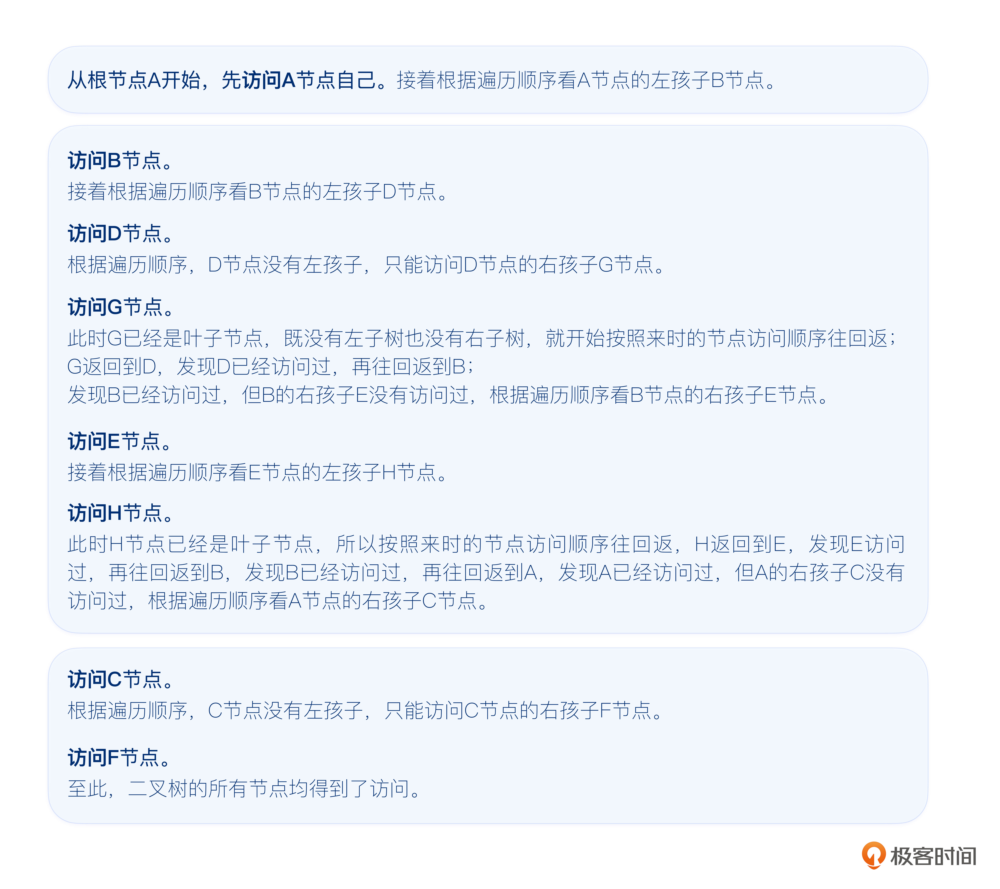
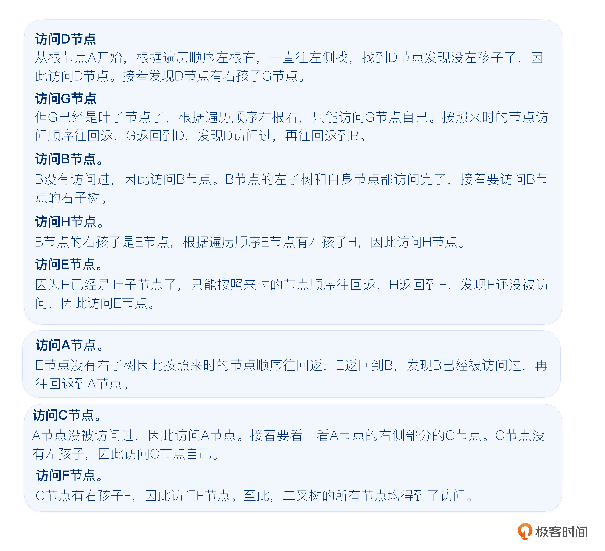
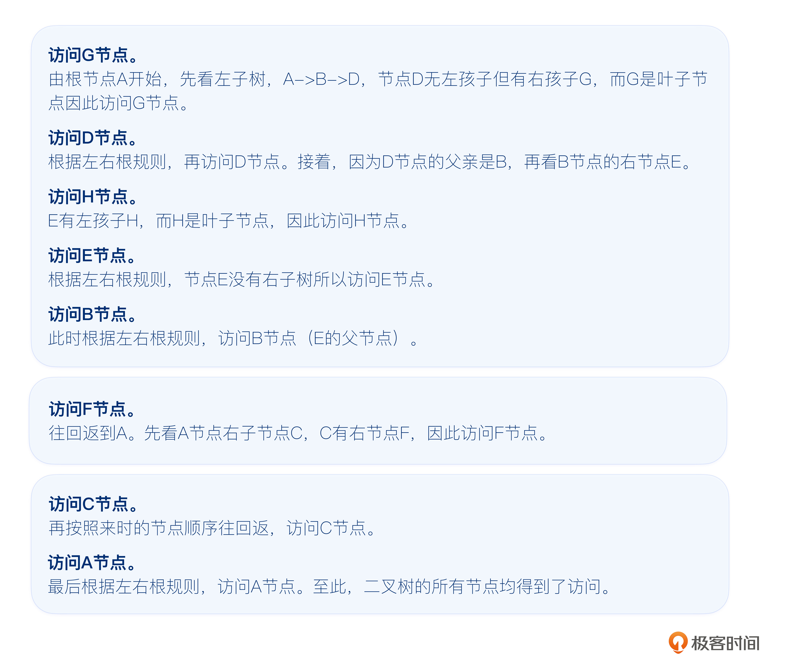

# 11｜二叉树：深度优先和广度优先遍历是什么？
你好，我是王健伟。

今天我们来聊一个非常重要的二叉树遍历问题。

二叉树的遍历，就是指从根节点出发，按照某种次序（某条搜索路径）依次访问二叉树中的所有节点，使每个节点都被访问且只被访问一次。“访问”的含义比较广泛，比如对节点做各种处理，显示节点所保存的数据等等。

前面在讲解线性表时，遍历是很简单的事，但二叉树是非线性结构，每个节点都可能有0~2个子节点，所以，我们需要让二叉树的节点排列成一个线性队列的形式，才能够顺利地访问到各个节点。

二叉树的经典遍历方法有三种： **前序遍历、中序遍历、后序遍历**。这三种遍历方式也称为 **深度优先遍历** 或 **深度优先搜索**，见名知意，深度优先遍历就是沿着每一个分支路径进行深入访问。我们先从它们开始说起。

## 什么是前序遍历、中序遍历、后序遍历？

图1列出了三个2层的二叉树，其中第2个二叉树没有右子树，第3个二叉树没有左子树。


先说 **前序遍历**，也叫先序遍历或者先根遍历。如果二叉树为空，则直接返回，否则从根节点开始。每个节点都是先访问该节点，比如显示该节点的数据，再访问该节点的左子树，最后访问该节点的右子树。访问的顺序总结成口诀就是“ **根左右**”。

说回到图1。三类二叉树的遍历顺序，按照“根左右”的口诀，就应该是：ABC，AB，AC。

再说 **中序遍历**，也叫中根遍历。如果二叉树为空，则直接返回，否则从访问根节点开始（并不意味着先访问根节点）。每个节点都是先访问该节点的左子树，再访问该节点，最后访问该节点的右子树。访问的顺序总结成口诀就是：“ **左根右**”。

还是以图1为例。三类二叉树的遍历顺序， 按照“左根右”的口诀，就应该是：BAC、BA、AC。

**后序遍历** 也叫后根遍历：如果二叉树为空，则直接返回，否则从访问根节点开始。每个节点都是先访问该节点的左子树，再访问该节点的右子树，最后访问该节点。访问的顺序总结成口诀就是：“ **左右根**”。

那么回到图1，三类二叉树的遍历顺序又是什么呢？按照“左右根”的口诀，应该是：BCA、BA、CA。

你可以看到，这几种遍历方式 **命名的由来取决于对根的访问顺序**，而且，对于左右子树来讲，总是 **先访问左子树，再访问右子树，这个访问顺序是不变的**，不可以改变。

### 3层满二叉树的遍历顺序范例

理解了基础概念之后 ，我们接下来就要上点难度了。想一想，3层满二叉树是什么样的？它的遍历顺序又是什么呢？

这里我先说一个总的原则提示： **二叉树的前、中、后序遍历实际上是一个递归的过程。** 什么意思呢？

- 对于前序遍历，就是先输出根节点的数据，然后再递归地输出左子树，最后递归地输出右子树（根左右的顺序）。
- 对于中序遍历，就是先递归地输出左子树，然后再输出根节点的数据，最后递归地输出右子树（左根右的顺序）。
- 对于后序遍历，就是先递归地输出左子树，然后再递归地输出右子树，最后输出根节点的数据（左右根的顺序）。

这些概念看起来有点复杂，我们利用图2这个3层的满二叉树，尝试用前序、中序、后序遍历的方式来看一下节点的访问顺序：


想一想，在图2这个3层的满二叉树中， **前序遍历** **、中序遍历、后序遍历** 节点访问顺序应该是什么样的呢？我把整个思考的过程放到了下面，你也可以尝试自己思考。


到这里，相信你也利用 **分支节点逐层展开** 的方式理解了前序、中序、后序遍历对节点的访问顺序，下面，我们再更换一种更适合 **书写递归程序** 的方式来解释前序、中序、后序遍历对节点的访问顺序。

### 普通二叉树的遍历顺序是怎么样的？

普通二叉树的前序、中序、后序稍微繁琐一点，但只要掌握住节点访问顺序以及递归这两个核心思想，就不会出错。

来看一看图3里，前序遍历时对普通二叉树节点的访问顺序：


虚线圆圈中的小数字就是对该节点的访问顺序，所以，前序遍历对图3所示的二叉树的遍历顺序为ABDGEHCF。

为什么是这个顺序呢？只需要记住前序遍历的遍历原则：先访问节点自身，再递归访问该节点的左子树，最后递归访问该节点的右子树，这个遍历顺序就自然得出了。



为了方便理解，这里给出前序遍历的伪代码，后面我也会带你写真实的代码。

```plain
void preOrder(BinaryTreeNode* tNode)  //前序遍历二叉树
{
	if (tNode != nullptr) //若二叉树非空
	{
		//根左右顺序
		visit(tNode); //访问根节点，比如输出节点的数据域的值
		preOrder(tNode->leftChild);  //递归方式前序遍历左子树
		preOrder(tNode->rightChild); //递归方式前序遍历右子树
	}
}

```

参考图4看一看中序遍历时对二叉树节点的访问顺序：


图4中序遍历对二叉树的遍历顺序为DGBHEACF。看一看这个遍历顺序是如何得出的。



给出中序遍历的伪代码。

```plain
void inOrder(BinaryTreeNode* tNode)  //中序遍历二叉树
{
	if (tNode != nullptr) //若二叉树非空
	{
		//左根右顺序
		inOrder(tNode->leftChild);  //递归方式中序遍历左子树
		visit(tNode); //访问根节点，比如输出节点的数据域的值
		inOrder(tNode->rightChild); //递归方式中序遍历右子树
	}
}

```

最后，参考图5看一看后序遍历时对二叉树节点的访问顺序：


图5后序遍历对二叉树的遍历顺序为GDHEBFCA。注意后续遍历顺序与中序遍历顺序的差异，后续遍历是先访问左子节点，再访问右子节点，最后才访问当前节点本身。

简单解释一下这个遍历顺序是如何得出的。



给出后序遍历的伪代码。

```plain
void postOrder(BinaryTreeNode* tNode)  //后序遍历二叉树
{
	if (tNode != nullptr) //若二叉树非空
	{
		//左右根顺序
		postOrder(tNode->leftChild);  //递归方式后序遍历左子树
		postOrder(tNode->rightChild); //递归方式后序遍历右子树
		visit(tNode); //访问根节点，比如输出节点的数据域的值
	}
}

```

到这里，二叉树的前序、中序、后序遍历我们都可以去推导了，但是如果反过来呢？根据遍历顺序可以反推出一棵二叉树吗？

### 遍历顺序能反推二叉树吗？

首先给出一条结论， **已知中序、前序、后序、前序和后序遍历，是无法唯一确定一棵二叉树的**。为什么这么说呢？我们可以分类讨论一下。

首先，已知 **中序遍历**，是无法唯一确定一棵二叉树的。也就是说，两棵完全不同的二叉树，进行中序遍历时得到的遍历序列可能是相同的。如图6所示的几棵二叉树，他们的节点数据内容不同，但进行中序遍历得到的序列都是BADCE：


其次，已知 **前序遍历**，同样无法唯一确定一棵二叉树。如图7所示的几棵二叉树，他们的节点数据内容不同，但进行前序遍历得到的序列都是BADCE：


最后，已知 **后序遍历**，还是无法唯一确定一棵二叉树。如图8所示的几棵二叉树，他们的节点数据内容不同，但进行后序遍历得到的序列都是BADCE：


**那如果加一个条件，已知前序和后序遍历呢？** 其实，还是同样无法唯一确定一棵二叉树。如图9所示的几棵二叉树。他们各不相同，但进行前序遍历得到的序列都是ABCD，进行后序遍历得到的序列都是DCBA：


观察一下图9，因为前序遍历的遍历顺序是“根左右”且遍历得到的序列是ABCD，所以可以确定A一定是二叉树的根。后序遍历的遍历顺序是“左右根”且遍历得到的序列是DCBA，但哪个节点是左子树，哪个节点是右子树还是无法确定的。

**那么问题就明确了，要想由前序、中序、后序遍历其中的两类来反推二叉树，我们需要明确的是“左右”的位置。**

现在给出第二条结论，已知“ **前序和中序** 遍历序列”或者已知“ **中序和后序** 遍历序列”，是能够唯一确定一棵二叉树的。可见， **中序遍历** 的存在对于唯一确定一棵二叉树是 **必要** 的。大致的思路是：

1. **前序或者后序遍历** 可以让我们找到 **根** 节点是哪个（在最前面或者最后面）。
2. **中序遍历** 的顺序是 **左根右** 可以让我们找到 **左右子树** 是哪些。

两者结合，就可以唯一确定一棵二叉树。

举个例子。如果已知一棵二叉树的前序遍历序列是ABCDEF，中序遍历序列是CBAEDF，如何得到这棵二叉树的后序遍历结果呢？

- 根据前序遍历序列，可以知道该二叉树的根节点是A。那么根节点在中序遍历序列中的位置也就知道了。

- 根据中序遍历序列CBAEDF，可以知道C、B是根节点A的左子树中的节点，而E、D、F是根节点A的右子树中的节点。如图10所示：


- 看看左子树C、B，前序遍历（根左右）序列是ABCDEF，给出的线索是B在C前面（根在前），满足这个条件C必须是B的子节点（你可以自己画画图试一试），但无法确定C是B的左孩子还是右孩子，所以继续看，中序遍历（左根右）序列是CBAEDF，给出的线索是C在B前面，满足这个条件的C一定是B的左孩子。如图11所示：


- 看看右子树E、D、F，前序遍历（根左右）序列是ABCDEF，给出的线索是D在E前面，F在E后面，满足这个条件D必须是A的右子节点（根在前），但E和F的排列确定不了，因为可能E是D的左孩子F是D的右孩子，也可能E是D的右孩子而F是D的左孩子，所以继续看，中序遍历（左根右）序列是CBAEDF，给出的线索是E在D前面，F在D后面，满足这个条件的E一定是D的左孩子，那么F一定是D的右孩子。如图12所示：


- 既然完全确定了一棵二叉树，其后序遍历结果序列自然也就得出了：CBEFDA。

最后，我们总结一下根据给定的遍历序列确定一个二叉树的方法：

- 找到树的根节点。
- 根据中序遍历序列划分左子树和右子树。
- 进一步找到左右子树根节点以及分支和叶子节点。

### 扩展二叉树/扩充二叉树

说完普通二叉树的遍历问题，我们来补充一类：扩展二叉树。

什么是扩展二叉树呢？对于一棵二叉树的任意节点（包括树根、树枝、树叶节点）：

- 如果该节点缺左子节点，就给它补一个左子节点。
- 如果该节点缺右子节点，就给它补一个右子节点。
- 如果该节点既缺左子节点又缺右子节点，就给它补一个左子节点和一个右子节点。

所补的子节点的值为一个特定的值，比如为一个“#”，补完子节点后生成的二叉树就称为原二叉树的扩展二叉树。

图13中，左侧是一棵二叉树，右侧为该二叉树的扩展二叉树。


通过前面的学习已经了解到，单独知道前序、中序或后序遍历，都无法唯一确定一棵二叉树。

这里给出2条新结论：

- 如果给出一个扩展二叉树的前序或后序遍历序列，是能够唯一确定一棵二叉树的。图13中，右侧的扩展二叉树的前序遍历序列为“ABD###C#E##”，通过这个序列是可以唯一确定图13左侧这个二叉树的。你不妨根据这个序列绘制一下对应的二叉树，看是否能够验证该结论的正确性。

- 给出一个扩展二叉树的中序遍历序列，是无法唯一确定一棵二叉树的。如下图14的两棵二叉树，他们的扩展二叉树中序遍历序列相同，都为“#C#B#A#”。


## 层序遍历/层次遍历

除三种经典的二叉树遍历方法外，还有一种二叉树的遍历方法被称为 **层序遍历**，层序遍历也被称为 **广度优先遍历** 或 **广度优先搜索**。

见名知意，层序遍历就是一层一层的遍历这个二叉树的节点。换句话说，就是对树的每一层节点依次进行访问，一般借助队列来实现访问。层序遍历也叫层次遍历，如果二叉树为空，就会直接返回，否则从树的第一层（根节点）开始，从上到下逐层遍历，而在同一层中，按照从左到右的顺序对节点进行逐个访问。

我们参考图15看一看层序遍历时对普通二叉树节点的访问顺序：


图15所示二叉树的层序遍历序列为ABCDEFGH。层序遍历理解起来比较简单，只需要从根节点开始，按照从上到下从左到右的顺序对节点逐个遍历即可。

已知层序遍历序列是无法唯一确定一棵二叉树。如前面图9所示的几棵二叉树。他们的层序遍历得到的序列都是ABCD。

给出一条新结论：已知“ **层序和中序遍历** 序列”，是能够唯一确定一棵二叉树的。图15所示二叉树的中序遍历序列是“DGBHEACF”，看看如何通过层序和中序遍历序列来唯一确定这棵二叉树。

- 层序遍历序列的第一个结点就是根结点。所以根节点是A。根据中序遍历序列DGBHEACF可以知道，D、G、B、H、E是A的左子树中的节点，而C、F是A的右子树中的节点。如图16所示：


- 看看左子树DGBHE，根据层序遍历序列ABCDEFGH，给出的线索是B（在左子树节点中）必然是A的左孩子，C（在右子树节点中）必然是A的右孩子。如图17所示：


- 看看左子树DGHE，根据中序遍历序列“DGBHEACF”的左根右规则，可以知道D、G是B的左子树中的节点，H、E是B的右子树中的节点，如图18所示：


- 层序遍历序列ABCDEFGH，给出的线索是B的两个孩子应该是D和E。那么G和H肯定是D和E的孩子，如图19：


- 看看中序遍历序列是“DGBHEACF”，G在D后面，H在E的前面，F在C的后面，根据中序遍历的左根右规则，G是D的右孩子， H是E的左孩子，F是C的右孩子。这样，完整的二叉树就确定下来了，如前面图15所示。

要得到二叉树的层序遍历序列需要借助队列来完成，这里需要强调的是队列是一种先进先出的数据结构，只允许在尾部插入元素，只允许在头部删除元素。

后面会提供详细的层序遍历代码，在这里先把遍历的过程描述一下。

- 步骤一：初始化一个队列。
- 步骤二：把二叉树的根节点入队列。
- 步骤三：判断队列是否为空，如果非空，就让队头节点出队（相当于访问/遍历了该节点），同时要将这个刚刚出队的节点的左孩子和右孩子分别入队（如果该节点有左右孩子）。
- 步骤四：重复步骤三，一直到队列为空。

## 小结

这节课，我们首先给出二叉树 **前序、中序、后序遍历（深度优先遍历）** 的基本概念及范例。接着给出了二叉树前序、中序、后序遍历的实现伪代码。

接着，给出了二叉树遍历的推导以及是否能唯一确定一棵二叉树的一些结论。

- 已知 **中序、前序、后序** 遍历中的任意一种，都无法唯一确定一棵二叉树。
- 已知 **前序和后序** 遍历，无法唯一确定一棵二叉树。

而只有已知 **前序和中序** 遍历序列或者已知 **中序和后序** 遍历序列，才能能够唯一确定一棵二叉树。因为中序遍历序列，可以帮助我们确定“左右”的位置。

然后，我给出了扩展二叉树的概念以及是否能唯一确定一棵二叉树的一些结论，这些结论包括：

- 给出一个扩展二叉树的 **前序或后序** 遍历序列，能够唯一确定一棵二叉树。
- 给出一个扩展二叉树的 **中序** 遍历序列，无法唯一确定一棵二叉树。

接着，给出了 **层序遍历（广度优先遍历）** 的基本概念以及是否能唯一确定一棵二叉树的一些结论：

- 已知层序遍历序列，无法唯一确定一棵二叉树。
- 已知层序和中序遍历序列，能够唯一确定一棵二叉树。

针对上面给出的各种遍历序列是否能够唯一确定一棵二叉树，想一想，你能整理出一个表格吗？

说了这么多，我们回到这节课的标题，强调一下到底什么是深度优先遍历和广度优先遍历，请你注意这两个概念的区别。

- **深度优先遍历（包括前序、中序、后序遍历）**：沿着树的每个孩子节点路径进行深入访问。这种遍历方式属于对树的节点进行纵向、一头扎到底的访问。
- **广度优先遍历（层序遍历）**：一层一层的遍历树的节点。这种遍历方式是从根节点开始，遍历下一层中所有的子节点，然后再继续遍历下一层子节点。

## 归纳思考

已知一棵二叉树的中序遍历序列和后序遍历序列，尝试得到这棵二叉树的前序遍历结果。提示一下，不要忘记，在后续遍历序列中，最后出现的节点是根节点。

欢迎你在留言区和我互动。如果觉得有所收获，也欢迎你把课程分享给更多的朋友一起交流学习！我们下节课见。