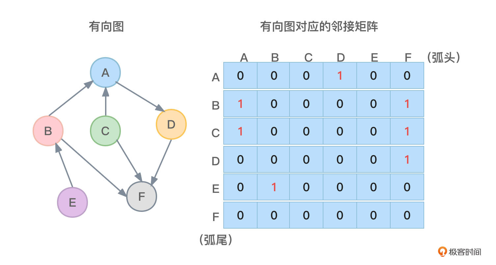
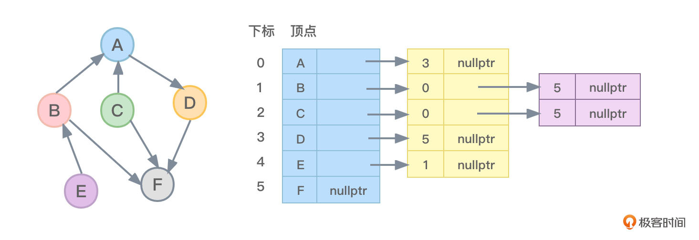

# 24｜图的存储（上）：邻接矩阵、邻接表和十字链表有什么不同？
你好，我是王健伟。

对于图这个话题，我们要解决的第一个问题是要把图存储起来，也就是图的存储结构问题。

首先要说的是，对于图来讲，顶点位置是个相对概念，任何一个顶点都可以看成第一个顶点，这个点的邻接点之间也不存在次序关系。所以对于图的存储是需要一些特殊方法的。

那么，图都有哪些存储结构呢？我们先从邻接矩阵开始说起。

## 邻接矩阵

邻接矩阵法又叫做数组表示法。一个图的关系最重要的就是两点：顶点、边（弧）。

如果用顶点组成二维数组，某两个顶点之间有边或者弧的地方标记为1，没有边或者弧的地方标记为0，这种表示图的方法就称为邻接矩阵法，如图1所示：


仔细观察，在图1中间的图中，横向和纵向分别由A、B、C、D、E、F这6个顶点组成一个二维数组（矩阵）。该二维数组一共由36个格组成，如果两个顶点之间有边，则该格子中标记为1，否则标记为0。比如顶点A和B之间有连线，则A和B之间交叉对应的格子中标记1，而这必然也代表顶点B和A之间有连线，所以B和A之间交叉对应的格子中也会标记1。

当然，你也可以把这个二维数组看成一个矩阵。显然，这个无向图对应的矩阵是一个以主对角线为对称轴，各元素对应相等的矩阵。



我们再说有向图的邻接矩阵。参考图2，与无向图不同的是，因为有向图的方向性，在这个有向图中，B到A之间有一条有向边，但A到B之间却没有边。

如果边之间带了权值，那么图1和图2的表格中的1（能到达）就可以用权值来代替，而0（不能到达）就用∞代替。这里注意，因为权值有可能是0，所以不能到达改用∞表示。而在具体代码中，可以用一个比较大的数字比如2100000000来代表∞。

在实现代码中，会用到两个数组来表示图。一个一维数组存储图中的顶点信息，一个二维数组（邻接矩阵）存储图中的边或者弧的信息。

针对一个无向图的邻接矩阵具体实现代码，引入GraphMatrix类模板的定义和实现代码，具体可以 [参考课件](https://gitee.com/jianw_wang/geektime_cpp_dsa/blob/master/26%EF%BD%9C%E5%9B%BE%E7%9A%84%E5%AD%98%E5%82%A8%EF%BC%88%E4%B8%8A%EF%BC%89%EF%BC%9A%E9%82%BB%E6%8E%A5%E7%9F%A9%E9%98%B5%E3%80%81%E9%82%BB%E6%8E%A5%E8%A1%A8%E5%92%8C%E5%8D%81%E5%AD%97%E9%93%BE%E8%A1%A8%E6%9C%89%E4%BB%80%E4%B9%88%E4%B8%8D%E5%90%8C%EF%BC%9F/MyProject.cpp)。

在main主函数中，加入下面的测试代码。

```plain
GraphMatrix<char> gm;

//向图中插入顶点
gm.InsertVertex('A');
gm.InsertVertex('B');
gm.InsertVertex('C');
gm.InsertVertex('D');
gm.InsertVertex('E');
gm.InsertVertex('F');
//向图中插入边
gm.InsertEdge('A', 'B');
gm.InsertEdge('A', 'C');
gm.InsertEdge('A', 'D');
gm.InsertEdge('B', 'E');
gm.InsertEdge('B', 'F');
gm.InsertEdge('C', 'F');
gm.InsertEdge('D', 'F');
gm.DispGraph();
//删除图中的边
gm.DeleteEdge('A', 'D');
gm.DispGraph();
//删除图中的顶点
gm.DeleteVertex('C');
gm.DispGraph();

```

执行结果如下：


在GraphMatrix类模板的定义和实现代码中，值得一说的是，删除顶点这个成员函数DeleteVertex的执行效率问题。演示代码中为了使观察顶点更顺畅，当删除图中顶点C的时候，为保持行和列显示的顶点顺序依旧是A、B、C、D、E、F，所以在邻接矩阵中采用了“下面的行覆盖上面的行”，然后“右面的列再覆盖左面的列”的方式来删除某个顶点。

这个操作比较耗费效率，增加了时间复杂度，如果不需要保持行和列显示时的顶点顺序，完全可以用最后一行代替顶点所在行，用最后一列代替顶点所在列。

这样的话，删除图中顶点C的时候，C所在的行列直接用顶点F的行列代替，那么行和列的顶点顺序会变为A、B、F、D、E，但是时间复杂度会大幅度减少，即从O($\|V\|^{2}$)变成O(\|V\|)。当然，也可以只对删除的顶点做一个删除标记（bool类型）而不做实际的删除动作，这样只需要O(1)的时间复杂度。使用邻接矩阵存储图所需要的空间复杂度是O($\|V\|^{2}$)（\|V\|表示图中顶点个数）。

如果要求得无向图中某个顶点的度，则只需要求出该顶点所在的行或列非零元素个数即可。同理，如果要求得有向图顶点的入度，只需求出该顶点所在列非零元素的个数，出度只需求出该顶点所在行非零元素的个数，于是，有向图顶点的度数（入度+出度）即可求得。

你可以尝试根据上述无向图代码写出对应有向图的代码。

值得一提的是，如果图的顶点数很多，边数很少，则邻接矩阵中的很多空间都被浪费了，所以邻接矩阵比较适合用于存储稠密图（边比较多）。

另外，因为一个无向图对应的邻接矩阵是一个对称矩阵，因此可以只存储矩阵的上三角区域或者下三角区域，当然在代码实现上可能稍微复杂一些，比如不再使用二维数组存储，而是使用一维数组按照行优先的原则将各个元素存储到一个一维数组中，这样可以节省原二维数组一半的存储空间。如果你有兴趣可以通过搜索引擎寻找“对称矩阵的压缩存储”字样来进一步了解对称数组的存储，当然也可以采用这种方式对邻接矩阵实现的图的源码进一步改进。

不难看到，邻接矩阵存储图的方式对于稀疏图来讲就会造成空间的浪费。那么接下来，我们再看一看针对图的其他存储结构。

## 邻接表

邻接表是一种链式存储结构。它对邻接矩阵存储图的方式进行了改进，需要对图中的每个顶点建立一个单链表，这个单链表用于存储和该顶点相关的边信息。

图3就是一个无向图对应的邻接表。


在图3中可以看到，将A、B、C、D、E、F这6个顶点从0开始进行编号，6个顶点的编号为0、1、2、3、4、5。给每个顶点建立一个单链表，链表中的节点代表着该顶点与其他顶点之间有边。

比如对于顶点A，观察其右侧所对应的单链表，单链表的节点中所记录的编号是1、2、3，这代表着顶点A与B（编号1）、C（编号2）、D（编号3）之间有边。整体来看，整个无向图有7条边，既然是无向图，所以从顶点A到顶点B有一条边则也意味着从顶点B到顶点A有一条边。所以，图中6个顶点所对应的单链表节点总数量为14个。



如果要求得 **无向图** 中某个顶点的度就只需要求出该顶点所在链表的边节点个数即可。同理，在 **有向图** 中，该顶点所在链表的边节点个数是顶点的出度，要想求得顶点的入度，则需要遍历整个邻接表，找出其他顶点中涉及该顶点的边节点个数。比如图4中，顶点F的出度为0，入度为3，而顶点B的出度为2，入度为1。

对于有向图，还有 **逆邻接表** 的概念，逆邻接表和邻接表非常类似，只不过逆邻接表中针对顶点所记录的边节点是 **指向该顶点的边** 的编号（入度）而非出度，如图5所示。所以，对于求解顶点的入度，使用逆邻接表就会非常方便。


针对一个 **无向图** 的邻接表具体实现代码，引入GraphLink类模板的定义和实现代码，具体可以 [参考课件](https://gitee.com/jianw_wang/geektime_cpp_dsa/blob/master/26%EF%BD%9C%E5%9B%BE%E7%9A%84%E5%AD%98%E5%82%A8%EF%BC%88%E4%B8%8A%EF%BC%89%EF%BC%9A%E9%82%BB%E6%8E%A5%E7%9F%A9%E9%98%B5%E3%80%81%E9%82%BB%E6%8E%A5%E8%A1%A8%E5%92%8C%E5%8D%81%E5%AD%97%E9%93%BE%E8%A1%A8%E6%9C%89%E4%BB%80%E4%B9%88%E4%B8%8D%E5%90%8C%EF%BC%9F/MyProject.cpp)。

在main主函数中，加入下面的测试代码。

```plain
GraphLink<char> gm2;
//向图中插入顶点
gm2.InsertVertex('A');
gm2.InsertVertex('B');
gm2.InsertVertex('C');
gm2.InsertVertex('D');
gm2.InsertVertex('E');
gm2.InsertVertex('F');
//向图中插入边
gm2.InsertEdge('A', 'B');
gm2.InsertEdge('A', 'C');
gm2.InsertEdge('A', 'D');
gm2.InsertEdge('B', 'E');
gm2.InsertEdge('B', 'F');
gm2.InsertEdge('C', 'F');
gm2.InsertEdge('D', 'F');
gm2.DispGraph();
gm2.DeleteEdge('A', 'D');
gm2.DeleteEdge('E', 'B');
gm2.DeleteEdge('E', 'C'); //删除一个不存在的边
cout <<"-----------------"<< endl;
gm2.DispGraph();
gm2.DeleteVertex('C');
cout <<"-----------------"<< endl;
gm2.DispGraph();

```

执行结果如下：


注意，上述代码中，删除顶点的代码段DeleteVertex相对繁琐，编写时一定要细致，防止出现遗漏而导致错误。此外，如果边与边之间有权值信息，也可以扩充EdgeNode结构来记录。

上述代码中有两个函数请注意——GetFirstNeighbor和GetNextNeightbor。

GetFirstNeighbor用于获取某个顶点的第一个邻接顶点的下标，比如，在图3这个无向图中，顶点B（下标1）的第一个邻接顶点的下标是0（即顶点A），如图6所示：


GetNextNeightbor用于获取某个顶点的邻接顶点的下一个邻接顶点的下标，比如顶点B（下标1）的邻接顶点D（下标4）的下一个邻接顶点的下标是5（顶点F），如图7所示：


GetFirstNeighbor和GetNextNeightbor后续在进行图的遍历时会用到，请你好好理解。当然，上述代码使用邻接表存储图时相邻节点采用的是头插法，所以得到的实际邻接表中节点内容与图3呈现的结果不同，这很正常，比如，若采用头插法可能会得到如下图8的邻接表，请与图3比较一下看有什么不同。


对于无向图，边节点的数量是2\|E\|（\|E\|表示图中边的条数），因此使用邻接表存储无向图所需要的空间复杂度是O(\|V\|+2\|E\|)（\|V\|表示图中顶点个数）。这意味着每条边会进行两次存储，因此是有信息冗余的，同时意味着删除顶点和删除边等操作的时间复杂度会较高。对于有向图，边的条数是\|E\|，因此使用邻接表存储有向图所需要的空间复杂度是O(\|V\|+\|E\|)。

邻接表中一个顶点指向的边节点构成的单链表中，边节点的顺序可以是任意的，这也意味着图的邻接表表示方式并不唯一，而图的邻接矩阵表示方式是唯一的。

稍微总结一下，邻接矩阵存储图数据的空间复杂度较高，存在很多存储空间被浪费的可能。因此邻接矩阵适合存储顶点和边数都很多的图。而对于顶点很多边很少时可以采用邻接表的存储方式。而邻接表存储有向图数据时，在求解顶点入度时比较繁琐，需要遍历整个邻接表，逆邻接表虽然求解有向图中顶点入度很方便，但求解顶点出度时比较繁琐。

## 十字链表

十字链表是用于存储有向图的另一种链式存储结构，可以看成是将有向图的邻接表与逆邻接表结合起来得到的链表。链表中的指针横纵交叉，有横向指针，有纵向指针，很像十字路口，从而命名为十字链表。

在十字链表中，也会分表示弧（边）的节点结构和表示顶点的节点结构。表示弧的节点结构一般如下定义：

```plain
//表示弧的节点结构
struct EdgeNode_cross
{
	int tailidx; //弧尾顶点下标
	int headidx; //弧头顶点下标
	EdgeNode_cross* headlink;//弧头相同的下一个弧
	EdgeNode_cross* taillink; //弧尾相同的下一个弧
	//int weight; //权值，可以根据需要决定是否需要此字段
};

```

表示顶点的节点结构一般像下面这样定义。

```plain
//表示顶点的节点结构
template<typename T>
struct VertexNode_cross
{
	T data;    //顶点中的数据
	EdgeNode_cross* firstin; //该顶点作为弧头的第一条弧（入度指针）
	EdgeNode_cross* firstout; //该顶点作为弧尾的第一条弧（出度指针）
};

```

如图9所示，看一看一个图如何用十字链表来表示：


图9所示的十字链表并未绘制完整，目的是让你更好地理解十字链表的绘制步骤，从而更流畅地写出实现代码。

你可以看到，图中的7条弧所对应的7个弧的节点结构已经全部绘制出来了。图中有A、B、C、D、E、F共6个顶点，这6个顶点分别存储在一个数组中，数组下标分别为0、1、2、3、4、5。观察每个顶点，找到以顶点为弧尾的边，然后进行下面的步骤。

- 对于顶点A，有一条弧是指向顶点D的，所以顶点A的firstout指针指向了标记为“0、3”的弧节点，因为顶点A的下标为0，顶点D的下标为3。因为从A出发没有更多的指向其他顶点的弧，所以“0、3”的弧的taillink指针指向nullptr。
- 对于顶点B，有一条弧是指向顶点A的，另一条弧是指向顶点F的，所以顶点B的firstout指针指向了标记为“1 、0”的弧节点结构，而标记为“1 、0”的弧的taillink指针又指向了标记为“1、5”的弧节点。
- 顶点C、D、E绘制方法同顶点A、B类似。
- 对于顶点F，没有指向任何弧，因此顶点F的firstout指针指向为nullptr。

继续完善图9，最终结果如图10：


图10接着图9继续绘制并绘制完整了，一共包含6个顶点节点结构和7个弧节点结构。在图10中，继续观察每个顶点，找到以这些顶点为弧头的边，然后继续进行下面的步骤。

- 对于顶点A，有两条弧（“1、0”，“2、0”）指向该顶点。因此，让顶点A的firstin指针指向这两条弧中的任意一条——这里指向“1、0”弧节点，然后，让“1、0”弧节点的headlink指针指向“2、0”弧节点，“2、0”弧节点的headlink指针指向nullptr。
- 对于顶点B，和顶点A类似，但只有一条弧（“4、1”）指向该顶点。所以顶点B的firstin指针指向了标记为“4、1”的弧节点，“4、1”弧节点的headlink指针指向nullptr。
- 对于顶点C，因为没有任何一条弧指向该顶点，因此顶点C的firstin指针指向nullptr。
- 对于顶点D，情况和顶点B类似，而顶点E的情况和顶点C类似。
- 对于顶点F，有三条弧（“1、5”，“2、5”，“3、5”）指向该顶点。因此，让顶点F的firstin指针指向这三条弧中的任意一条——这里指向“1、5”弧节点，然后，让“1、5”弧节点的headlink指针指向“2、5”弧节点，再让“2、5”弧节点的headlink指针指向“3、5”弧节点，“3、5”弧节点的headlink指针指向nullptr。

不难发现，用十字链表存储的有向图，找到某顶点指向的边以及找到哪些边指向该顶点都很方便，换句话说，对于任意顶点的入度和出度计算都会比较容易。使用十字链表存储有向图所需要的空间复杂度是O(\|V\|+\|E\|)。

图的十字链表存储方式理解难度相对大一些，用到的机会相对较少。如果在某些场合中需要频繁地计算有向图顶点的出度和入度，或者需要频繁地了解某两个顶点之间的邻接和逆邻接关系时，就可以采用十字链表的存储方式。

## 小结

本节我们学习了可以用哪些数据结构来存储图。我们分别讲解了用邻接矩阵、邻接表、十字链表来存储图。

在 **邻接矩阵** 中，我们用两个数组来表示图。一个一维数组存储图中的顶点信息，一个二维数组存储图中的边或者弧的信息。可以说，邻接矩阵比较适合存储顶点和边都比较多的稠密图。

**邻接表** 这种链式存储结构需要对图中的每个顶点建立一个单链表，这个单链表用于存储和该顶点相关的边信息。但用这种存储结构时求有向图中顶点的入度信息很不方便，因此，我们又提出了逆邻接表的概念。

逆邻接表求解有向图顶点的入度非常方便。使用邻接表存储无向图时，每条边会进行两次存储，因此有信息冗余，空间复杂度比较高也导致了删除顶点和删除边等操作的时间复杂度较高。

最后， **十字链表** 是用于存储有向图的一种链式存储结构，可以看成是将有向图的邻接表与逆邻接表结合起来得到的链表。十字链表用于计算任意顶点的入度和出度都比较容易。但十字链表理解难度相对大，用到的机会相对较少。不过，可以在需要频繁地计算有向图顶点的出度和入度，或需要频繁地获取某两个顶点之间的邻接和逆邻接关系的时候使用。

虽然本节课我们讲解了三种存储结构，但是，在某些场合下，可能一些其他的存储结构更加适合，下节课，我们将继续讲解图的另外几种存储结构以及这些存储结构所适用的场景。

## 归纳思考

这节课，我带你完成了用邻接矩阵和邻接表存储图的代码。请你参照邻接表存储图的实现代码来完成十字链表存储图的实现代码。

欢迎你在留言区和我分享编写成果。如果觉得有所收获，也可以把课程分享给更多的朋友一起学习进步。我们下一讲见！