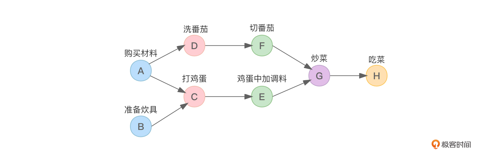
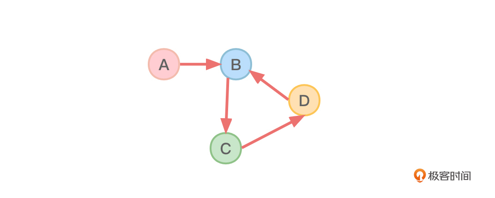

# 31｜图的应用：如何通过拓扑排序找到合理的先后顺序？
你好，我是王健伟。

在我和你分享了两个图的应用，最小生成树和最短路径相关的算法之后，我们来说说拓扑排序。

拓扑排序主要是解决一个工程能否按顺序进行的问题。在正式讲解之前，我们首先来一起认识一下几个基本概念。

## 拓扑排序基本概念

首先，有向无环图（Directed Acyclic Graph，简称DAG），这是一种特殊的有向图。如果一个有向图中不存在环，那就叫做有向无环图。

其次，AOV网（Activity On Vertex Network）。在现代化管理中，人们常用有向图来描述和分析一项工程的计划和实施过程。一个工程常被分为多个小的子工程，这些子工程被称为活动（Activity）。

在有向图中，如果以 **顶点** 表示 **活动**，有向边（弧）表示活动之间的 **先后** 关系，那么这样的有向图就叫做 **顶点表示活动的网**，简称为AOV网。AOV网就是我们刚刚说的有向无环图。AOV网的边不设权值，如果存在两个顶点之间的边<vi,vj>，那就表示活动i必然发生在活动j之前。你可以理解为活动之间存在制约关系。

最后， **拓扑排序**。对于一个有向无环图，满足若从顶点vi到顶点vj有一条路径，则在顶点序列中顶点vi必然在顶点vj之前，这样的顶点序列称为一个 **拓扑序列**。

**拓扑排序** 就是对一个有向图构造拓扑序列的过程，也是对有向无环图顶点的一种排序。拓扑排序主要是解决 **一个工程能否按顺序进行的问题**。换句话说， **能够进行正常的拓扑排序，就表示工程能够按顺序进行**。

我来总结几个拓扑排序需要注意的关键点。

- 拓扑序列中每个顶点出现且仅出现一次。
- 若顶点vi排在顶点vj之前，则图中不会存在从顶点vj到顶点vi的路径。
- 每个AOV网都有 **一个或者多个** 拓扑排序序列。
- 拓扑排序，就是用来找到 **做事情合理的先后顺序**。

这些概念理解起来可能有些复杂，没关系，我们尝试以做一盘番茄炒蛋菜为例来描述拓扑排序。在这里，做一盘番茄炒蛋菜就是一个工程。看一看这个工程需要经历哪些步骤，如图1所示：


图1中右侧一列是执行某一步骤之前需要完成的步骤，比如要打鸡蛋必须要先购买材料（买鸡蛋）和准备炊具（准备筷子来搅拌鸡蛋）。

在这里，如果以做菜过程中经历的各个步骤作为顶点，以各种步骤之间的关系作为弧，就可以绘制一个代表做菜过程的图。如图2所示：



图2表达了做一盘番茄炒蛋菜时各个步骤之间的前趋和后继关系。我们看一看做一盘番茄炒蛋菜过程（工程）的拓扑排序（做事情合理的先后顺序）是什么样子的。

- 购买材料和准备炊具谁先谁后都可以（这代表一个图的拓扑序列是不唯一的）。
- 洗番茄和打鸡蛋谁先谁后都可以。
- 切番茄和在鸡蛋中加调料谁先谁后都可以。

拓扑排序所得到的一个拓扑序列如下图3所示：


从图3可以总结一下拓扑排序的实现方法：

- 从AOV网中选择一个没有前趋（入度为0）的顶点并输出。
- 从AOV网中删除该节点和所有以该顶点为尾的弧或者说删除该顶点和所有以该顶点为起点的有向边。
- 重复上面两个步骤直到全部顶点都被输出。

当然，如果整个图中存在环，就没有办法根据上面的描述输出图中的全部顶点。你可以试试看，一定会发现明明还有剩余的顶点没有输出，但每个剩余的顶点都有前趋。

比如图4这个存在环的图，你会发现，用上面描述的拓扑排序实现方法，你没有办法把A,B,C,D四个顶点全部输出出来。



## 拓扑排序和逆拓扑排序算法

我的实现代码会采用邻接表作为图的存储结构。这里注意，编码时，有这么几点需要说明。

- 可以考虑在表示顶点的结构中增加indegree成员变量来记录顶点的入度，当插入弧时将弧头的入度数值加1。当然，如果这样做，删除节点或删除边的操作也要维护好剩余顶点的入度数值。这样仅仅为了求得拓扑排序就为顶点结构增加成员的方式似乎不太妥当，所以我准备只在求拓扑排序的时候临时求得顶点的入度信息以便使用。
- 需要先使用堆栈来保存入度为0的顶点，当然，队列也可以。这里的堆栈采用C++标准库中的堆栈std::stack就可以，或者也可以采用前面自己编写的栈代码。
- 接着就要用一个循环处理拓扑排序问题，实现细节可以参考后面的实现代码。

我们复用前面邻接表存储图结构的代码，当时的代码存储的是无向图，而对于有向图的存储，需要对代码进行适当的改造，改造InsertEdge成员函数，将其中的一些多余代码进行删除。

下面是最新的实现代码。

```plain
//插入边
bool InsertEdge(const T& tmpv1, const T& tmpv2) //在tmpv1和tmpv2两个顶点之间插入一条边
{
	int idx1 = GetVertexIdx(tmpv1);
	int idx2 = GetVertexIdx(tmpv2);
	if (idx1 == -1 || idx2 == -1) //某个顶点不存在，不可以插入边
		return false;

	//判断是否边重复
	EdgeNode* ptmp = m_VertexArray[idx1].point;
	while (ptmp != nullptr)
	{
		if (ptmp->curridx == idx2)
			return false; //边重复
		ptmp = ptmp->next;
	}

	//可以正常插入
	ptmp = new EdgeNode;
	ptmp->curridx = idx2;
	ptmp->next = m_VertexArray[idx1].point;  //为简化编码和提升代码执行效率，采用头插法将边节点插入到单链表的最前面
	m_VertexArray[idx1].point = ptmp;
	m_numEdges++; //边数量增加1
	return true;
}

//拓扑排序算法
bool TopologicalSort()
{
	int* pInVexDegree = new int[m_numVertices]; //分配空间记录顶点入度
	memset(pInVexDegree, 0, sizeof(int) * m_numVertices); //清0
	//统计各个顶点的入度值
	for (int i = 0; i < m_numVertices; ++i)
	{
		EdgeNode* pEdgenode = m_VertexArray[i].point;
		while (pEdgenode != nullptr)
		{
			pInVexDegree[pEdgenode->curridx]++; //注意[]中内容
			pEdgenode = pEdgenode->next;
		} //end while
	} //end for

	//将入度为0的顶点先入栈
	std::stack<int> tempstack; //#include <stack>
	for (int i = 0; i < m_numVertices; ++i)
	{
		if (pInVexDegree[i] == 0)
		{
			tempstack.push(i);
		}
	} //end for

	int iOutputVexcount = 0; //输出的顶点数量统计
	//栈不为空则循环
	while (tempstack.empty() == false)
	{
		//出栈
		int topidx = tempstack.top(); //获取栈顶元素
		cout << m_VertexArray[topidx].data <<"";  //输出没有前趋的顶点
		iOutputVexcount++;  //输出的拓扑顶点数量统计
		tempstack.pop(); //删除栈顶元素
		//要将topidx对应顶点的各个邻接点入度减1，所以要先找到第一条边
		EdgeNode* pEdgenode = m_VertexArray[topidx].point;
		while (pEdgenode != nullptr)
		{
			int tmpidx = pEdgenode->curridx;
			if (pInVexDegree[tmpidx] != 0) //入度已经为0的顶点，不理会
			{
				pInVexDegree[tmpidx]--; //入度值减1
				if (pInVexDegree[tmpidx] == 0)//入度为0的点入栈
					tempstack.push(tmpidx);
			}
			pEdgenode = pEdgenode->next;
		} //end while
	} //end while
	cout << endl; //换行
	delete[] pInVexDegree;

	if (iOutputVexcount != m_numVertices) //拓扑排序失败
	{
		cout <<"输出顶点数量:"<< iOutputVexcount <<",而图中实际顶点数量:"<< m_numVertices <<",说明图中有环，没办法输出所有顶点序列（非AOV网，拓扑排序错误）"<< endl;
		return false;
	}
	return true;
}

```

在main主函数中加入代码进行测试。

```plain
GraphLink<char> gm2;
//向图中插入顶点
gm2.InsertVertex('A');
gm2.InsertVertex('B');
gm2.InsertVertex('C');
gm2.InsertVertex('D');
gm2.InsertVertex('E');
gm2.InsertVertex('F');
gm2.InsertVertex('G');
gm2.InsertVertex('H');

//向图中插入边
gm2.InsertEdge('A', 'C');
gm2.InsertEdge('A', 'D');
gm2.InsertEdge('B', 'C');
gm2.InsertEdge('C', 'E');
gm2.InsertEdge('D', 'F');
gm2.InsertEdge('E', 'G');
gm2.InsertEdge('F', 'G');
gm2.InsertEdge('G', 'H');
//gm2.InsertEdge('H', 'G');//模拟图中有环的情形
gm2.DispGraph();
cout <<"拓扑排序的结果为：";
gm2.TopologicalSort();

```

执行结果如下：


在上述代码中，统计各个顶点的入度值的for循环不应该计算在算法时间复杂度之中。搜索入度为0的顶点并入栈的for循环所需要的时间复杂度为O(\|V\|)。而每个顶点会入一次栈，再出一次栈，所需要的时间复杂度为O(\|V\|)。你可以自己统计一下看看，套在双层while循环中的入度值减1的操作其实一共执行了\|E\|次，所以算法的总时间复杂度为O(\|V\|+\|E\|)。

对图采用不同存储结构，则拓扑排序算法得到的时间复杂度也会不同，比如采用邻接矩阵存储图，拓扑排序算法时间复杂度可能会是O($\|V\|^{2}$)，因为需要扫描整个邻接矩阵。所以实现拓扑排序算法选择邻接表来存储图更加合适。

逆拓扑排序算法与拓扑排序算法正好相反，如果采用下面的步骤进行排序，就叫做 **逆拓扑排序。**

- 从AOV网中选择一个没有后继（ **出度为0**）的顶点并输出。
- 从AOV网中 **删除该节点和所有以该顶点为终点** 的有向边。
- 重复上面两个步骤直到全部顶点都被输出。

根据逆拓扑排序的描述，针对图2，我们可以得到一个逆拓扑序列。如图4所示：


逆拓扑排序的实现源码可以参考拓扑排序的实现源码。有一个值得说的问题是， **对图采用不同的存储结构会影响到逆拓扑排序算法的时间复杂度。**

因为在逆拓扑排序中删除一个顶点后需要删除指向该顶点的边，如果采用邻接表存储图找到指向这个顶点的边需要遍历整个邻接表，而采用邻接矩阵存储图时，找到指向该顶点的边只需要遍历该顶点对应的一列数据。算法的时间复杂度显然会提升很多。当然，如果采用逆邻接表存储图的数据，那么通过逆邻接表实现逆拓扑排序算法会更高效。

另外，深度优先遍历（DFS）算法实现代码经过适当的改进，也可以得到图的逆拓扑序列。当然，如何判断图中存在环也是一个需要思考和解决的问题。这里我提示一下，有环则代表无法得到逆拓扑序列，如果你有兴趣可以进一步研究一下。

## 小结

本节我为你讲解了通过拓扑排序解决一个工程能否按顺序进行的问题。

我们首先了解了有向无环图、AOV网、拓扑排序的概念。

在理解拓扑排序的时候，我们把做一盘番茄炒蛋菜看成一个工程，以做菜过程中经历的各个步骤作为顶点，以各种步骤之间的关系作为弧建立起了一个有向无环图作为AOV网，以此展现了做这盘番茄炒蛋菜时各个步骤之间的前趋和后继关系。最终，得到了一个拓扑序列。

在这节课的最后，我也带你实现了求拓扑序列的代码编写工作，同时给出了逆拓扑排序算法的实现思路，这里理解就好，不用死记硬背。

## 归纳思考

1. 你是否能想到现实生活中还有哪些问题可以通过拓扑排序来解决？
2. 请在邻接表、邻接矩阵、逆邻接表这三种存储图的方式中任选一种来实现逆拓扑排序算法。

欢迎你在留言区分享自己的思考。如果觉得有所收获，也可以把课程分享给更多的同学一起学习进步。我们下节课见！