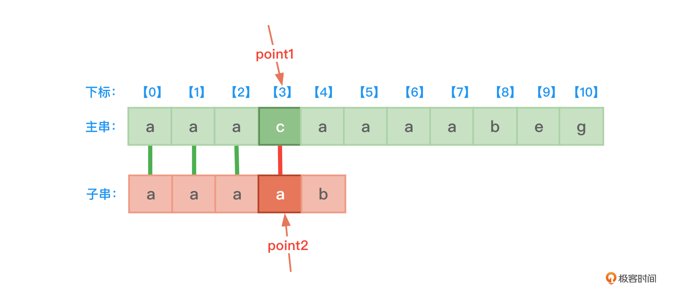
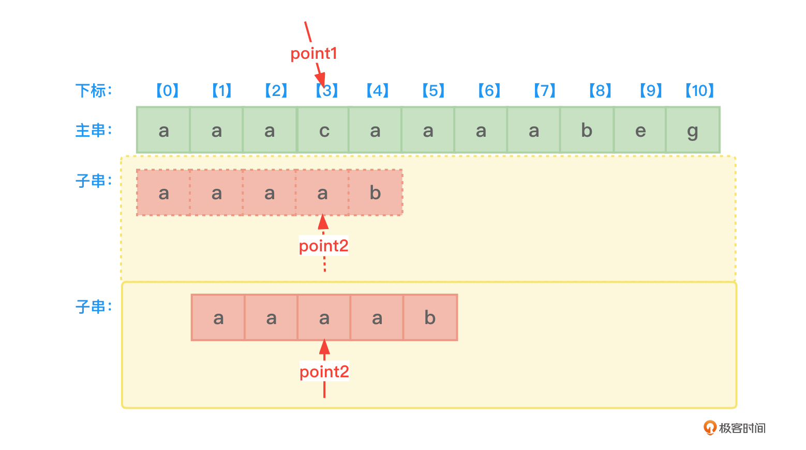
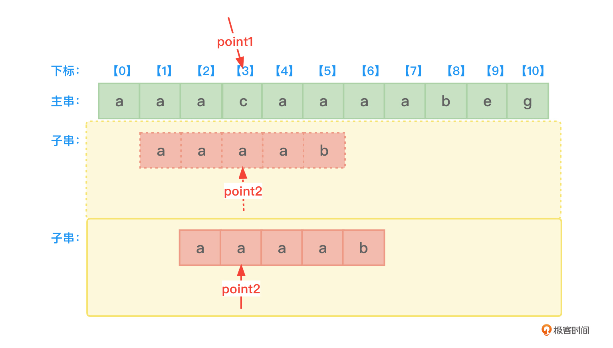
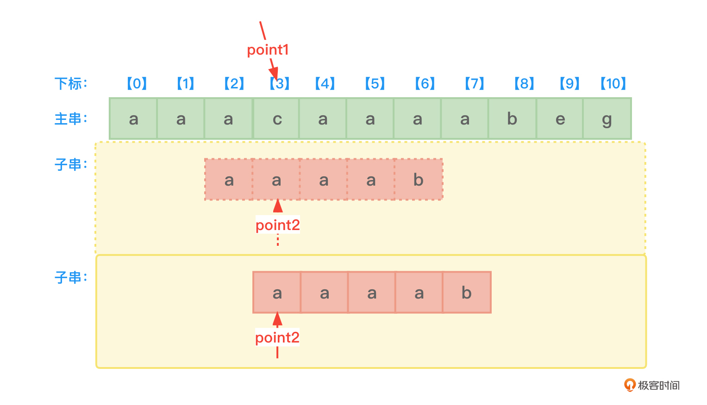
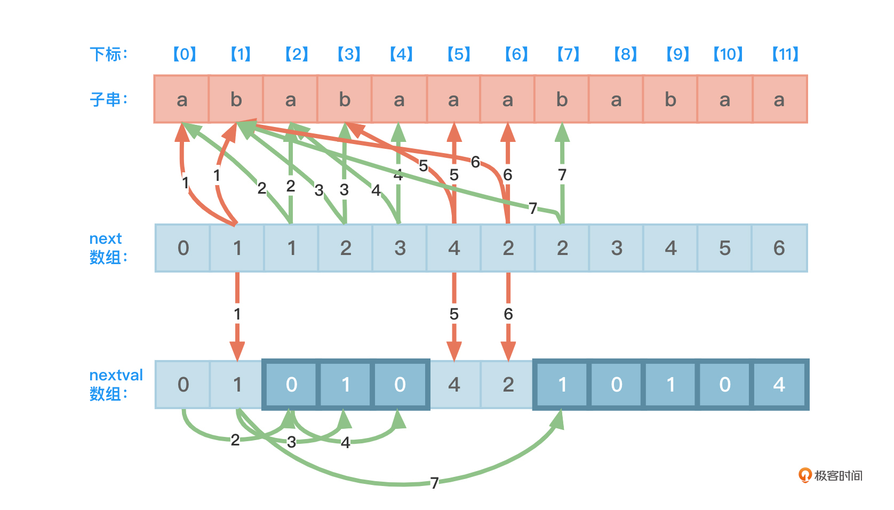
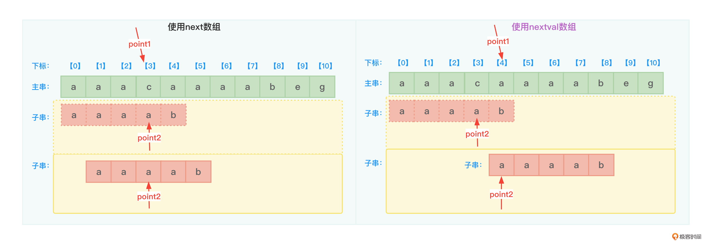
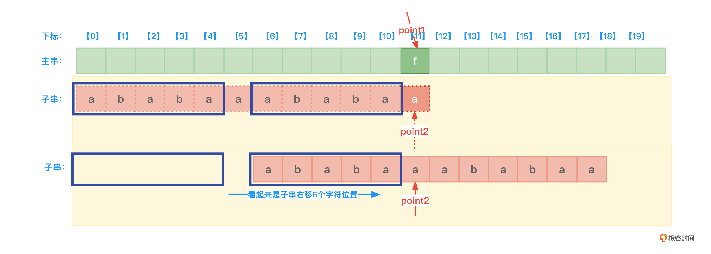

# 43｜串的KMP模式匹配算法之改进：通过优化代码解决多次重复比较问题
你好，我是王健伟。

上节课介绍的KMP模式匹配算法是通过next数组参与计算来达到加速匹配的目的。但是，在next数组中，因为没考虑当前字符的位置情况，只考虑了字符不匹配时单纯的指针移动问题（point1和point2值的改变），这很可能导致移动后将进行比较的字符仍和上一次不匹配的字符相同导致产生多次重复的无效比较。

那这个问题要怎么解决呢？别着急，我们一步一步分析。

## next数组使用中暴露的问题

下面我会用一个相对简单点的主串和子串，通过图示说明多次重复无效比较这件事。

假设主串S为“aaacaaaabeg”，子串T为“aaaab”，可以求得子串的next数组为如图1所示：


主串与子串开始比较。当比较到下标为3的位置时，子串中的字符是a，主串中的字符是c，两者不同了，如图2所示：



依据子串的next数组（依据next\[3\]的值），子串的point2指针应该恢复到子串第3个字符位置再用该位置的字符a与主串中point1所指向的字符c做比较，如图3所示：



图2中已经进行了主串中的c和子串中的a比较，而图3又再次进行了主串中的c和子串中的a比较，显然这第2次比较毫无意义。

第2次主串中的c和子串中的a再比较，两者还是不同，依据子串的next数组（依据next\[2\]的值），子串的point2指针应该恢复到子串第2个字符位置再用该位置的字符a与主串中point1所指向的字符c作比较，如图4所示：



这是第3次主串中的字符c和子串中的字符a进行比较，这次比较也毫无意义。

第3次主串中的c和子串中的a再比较，两者还是不同，依据子串的next数组（依据next\[1\]的值），子串的point2指针应该恢复到子串第1个字符位置再用该位置的字符a与主串中point1所指向的字符c作比较，如图5所示：



这是第4次主串中的字符c和子串中的字符a进行比较，这次比较也毫无意义。

此时主串中point1的值会指向下个位置（依据next\[0\]的值）。接着进行比较，最终在主串中找到子串。如图6所示：


好了，我们总结一下使用next数组的字符串比较过程。

- 第1次比较：point1=0，point2=0；到point1=point2=3时出现主串字符c和子串a不匹配。
- 第2次比较：point2= **2**；主串字符c和子串a比较，多余的一次比较。
- 第3次比较：point2= **1**；主串字符c和子串a比较，多余的一次比较。
- 第4次比较：point2= **0**；主串字符c和子串a比较，多余的一次比较。
- 第5次比较：point1= **4**；point2=0，开始了新的主串与子串字符比较。
- 后续的描述步骤省略。

综合而言，第2、3、4次主串中的字符c与子串中的字符a比较是多余的。因为子串中的第4个字符与第3个、第2个、第1个字符都相同——都是a。

## nextval数组的求解步骤

看到了上述这么多次多余比较的产生，你就会发现KMP模式匹配算法仍有改进空间，也就是说，它可以进一步减少无意义的比较来提升效率。

这里我先揭晓答案， **KMP算法是使用nextval数组取代next数组来达成提效的目的**。

nextval数组可以通过next数组求得。nextval数组被看作是优化过的next数组，首先看一看如何通过next数组推导出nextval数组。

这里以前面的一个稍复杂点的子串T=“ababaaababaa”以及该子串的next数组为例叙述一下求解该子串的nextval数组的步骤，如图7所示：


- nextval\[0\]：值固定是0，和next\[0\]同值；
- nextval\[1\]：next\[1\]-1=1-1=0，因为T\[0\]≠T\[1\]，所以nextval\[1\]保持next\[1\]不变=1；
- nextval\[2\]：next\[2\]-1=1-1=0，因为T\[0\]=T\[2\]，所以nextval\[2\]要等于nextval\[0\]=0；
- nextval\[3\]：next\[3\]-1=2-1=1，因为T\[1\]=T\[3\]，所以nextval\[3\]要等于nextval\[1\]=1；
- nextval\[4\]：next\[4\]-1=3-1=2，因为T\[2\]=T\[4\]，所以nextval\[4\]要等于nextval\[2\]=0；
- nextval\[5\]：next\[5\]-1=4-1=3，因为T\[3\]≠T\[5\]，所以nextval\[5\]保持next\[5\]不变=4（在T\[3\]≠T\[5\]时保持nextval\[5\]和next\[5\]值相同可以称为 **保留不同，可以看作是nextval数组的计算原则**）；
- nextval\[6\]：next\[6\]-1=2-1=1，因为T\[1\]≠T\[6\]，所以nextval\[6\]保持next\[6\]不变=2；
- nextval\[7\]：next\[7\]-1=2-1=1，因为T\[1\]=T\[7\]，所以nextval\[7\]要等于nextval\[1\]=1；
- nextval\[8\]：next\[8\]-1=3-1=2，因为T\[2\]=T\[8\]，所以nextval\[8\]要等于nextval\[2\]=0；
- nextval\[9\]：next\[9\]-1=4-1=3，因为T\[3\]=T\[9\]，所以nextval\[9\]要等于nextval\[3\]=1；
- nextval\[10\]：next\[10\]-1=5-1=4，因为T\[4\]=T\[10\]，所以nextval\[10\]要等于nextval\[4\]=0；
- nextval\[11\]：next\[11\]-1=6-1=5，因为T\[5\]=T\[11\]，所以nextval\[11\]要等于nextval\[5\]=4；

观察一下上面这行（其他行也同样有这个规律），可知T\[5\]和T\[11\]是什么关系，正好是子串中下标11左侧的0~10共11个字符的公共前后缀“ababa”的下一个字符。

为了方便观察，我们简单地把上述这些文字描述表示成图。但因为线条太密集，所以这里我只绘制了nextval\[0\]~nextval\[7\]的求值过程，箭头中的数字代表下标，比如求解nextval\[1\]时，next\[1\]向上指向的两个红色箭头表示指向的T\[0\]和T\[1\]不等（相等用绿色箭头），next\[1\]指向nextval\[1\]的箭头表示nextval\[1\]的值来自于next\[1\]，如图8所示：



我们可以通过上面的描述总结出求解nextval数组的规则（数组下标用i表示）。

1. 数组nextval下标i为0的元素值固定为0。
2. 数组nextval下标i>0时，分两种情况：

- 如果T\[i\]≠T\[next\[i\]-1\]，则nextval\[i\] 等于next\[i\]。
- 如果T\[i\]=T\[next\[i\]-1\]，则nextval\[i\]等于nextval\[next\[i\]-1\]。

前面说过两个重要的观点：

1. next数组存在的意义是指示当子串中某个位置的字符与主串相应位置字符不匹配时，应该将子串中的哪一位字符与主串中的当前位/下一位字符做比较。
2. 在next数组中，因为没考虑当前字符的位置情况，只考虑了字符不匹配时单纯的指针移动问题（point1和point2值的改变），这很可能导致移动后将进行比较的字符仍和上一次不匹配的字符相同导致产生多次重复无效比较。

显然，nextval数组存在的意义与next数组相同。而nextval数组对next数组的值进行了进一步修正，排除掉了一些无效的移动和比较，保证子串中下一个即将（与主串当前位置）参与比较的字符和上次参与比较且不匹配的字符不同。

这里为了方便观察，再说回前面图1所示的子串和其next数组，优化该next数组得到nextval数组，这次我们换一种方式叙述一下通过next数组求解nextval数组的步骤。

1. 先把next数组的各个元素值原封不动的赋给nextval数组。

2. 然后从左到右依次检查nextval数组的各个元素。


- nextval\[0\]值是0固定不变。
- nextval\[1\]：next\[1\]-1=1-1=0，因为T\[0\]=T\[1\]，所以nextval\[1\]要等于nextval\[0\]=0；这意思应该就是子串中下标为1的字符和下标为0的字符相同（都是a），因此如果和下标为0的字符不等，则就不必和下标为1的字符比较了。
- nextval\[2\]：next\[2\]-1=2-1=1，因为T\[1\]=T\[2\]，所以nextval\[2\]要等于nextval\[1\]=0；这意思应该就是子串中下标为2的字符和下标为1的字符相同，因此如果和下标为1的字符不等，则就不必和下标为2的字符比较了。
- nextval\[3\]：next\[3\]-1=3-1=2，因为T\[2\]=T\[3\]，所以nextval\[3\]要等于nextval\[2\]=0；这意思应该就是子串中下标为3的字符和下标为2的字符相同，因此如果和下标为2的字符不等，则就不必和下标为3的字符比较了。
- nextval\[4\]：next\[4\]-1=4-1=3，因为T\[3\]≠T\[4\]，所以nextval\[4\]保持next\[4\]不变=4；

1. 最终nextval数组值如图9所示：


现在，在执行KMP模式匹配算法从主串中查找子串时，将不再使用next数组，而是使用nextval数组，我们来看看具体的操作步骤。

首先，前面图2中，主串与子串开始进行比较，当比较到下标为3的位置时，子串中的字符是a，主串中的字符是c，两者不同了。

其次，依据子串的nextval\[3\]的值0，代表着主串中point1会指向下个位置，同时子串的point2会指向子串的开始位置。接着主串和子串的当前位置字符再做比较，如图10所示使用next数组和使用nextval数组的区别：



最后，从图10可以看到，使用nextval数组子串向右跳跃的位置远比使用next数组大（大量减少了对比次数的发生）。使用KMP算法的效率得到进一步提升。

## nextval数组的工作原理

基于next数组来求解nextval数组。可能许多同学会疑惑为什么会这样来求nextval数组。也许你把这个问题理解复杂了，其实是挺简单的，就以前面图8这个子串以及它对应的next数组和nextval数组来解释，重新绘制如下图11所示：


这里就以下标11这个位置的子串字符a来说明next数组和nextval数组的用途。从下标0到10，主串和子串的对应字符都相等，但当主串和子串比较到下标为11的字符时，发现两者不等。如图12所示：


在图12中，主串的字符f和子串的字符a不匹配，如果使用next数组，则next\[11\]值为6，这意味着子串中下标为11的字符a之前有宽度为5个字符的最长公共前后缀，所以子串中的point2指针应该如下图13这样调整：



从图13可以看到，point2指针指向了 **针对于子串的下标为5（6-1）的位置**，看上去好像是子串针对主串右移了6个字符位置。next\[11\] = 6，这个数字6其实与子串中下标为11的字符（第12个字符）a没有任何关系。这就是next数组记录数据的不足之处——只能记录该位置之前的所有字符的公共前后缀长度信息。接下来，还是要进行子串中第6个字符a与主串中的字符f比较，这显然是重复比较。

KMP优化算法不再使用next数组，而是使用了nextval数组。通过前面的图11可以看到，nextval\[11\]=4。下面看一看当主串和子串第11个下标位置字符不等时使用nextval数组的效果。子串中的point2指针应该如下图14这样调整：


从图14可以看到，point2指针指向了针对于子串的下标为3（4-1）的位置，看上去好像是子串针对主串右移了8个字符位置。nextval\[11\] = 4。这个数字4怎么来的，通过前面的学习你应该很清楚，如果忘记了不妨回顾前面的内容。这里我也给你一个提示：nextval\[11\]要等于nextval\[5\]=4。

最后，我们比较一下next\[11\]和nextval\[11\]。

首先，next\[11\]=6，而nextval\[11\]=4，两者相差了2。

其次，next\[11\]=6，这个数字6与子串T中的字符T\[11\]没有任何关系。该数字只代表下标11这个位置之前的所有字符的公共前后缀长度信息（6-1=5）。

接着，nextval\[11\]=4，根据next数组推导nextval数组的步骤你应该知道，这个数字4就与子串T中的T\[11\]有关系了，我不得不佩服该优化算法设计者超越常人的思考能力。因为4-1=3，这个3可以理解成包含下面两个信息。

1. 下标11这个位置之前的所有字符的公共前后缀长度信息长度是5个。
2. 额外还有2个字符与当前T\[11\]位置的字符相同，在比较的时候应该略过。5-2=3，所以point2直接跳到了针对于子串的下标为3（4-1）的位置，从而也就避免了图13中再次进行子串的字符a与主串字符f比较的浪费。

## nextval数组的求解实现代码

先求出next数组，然后根据求解nextval数组的规则来求得nextval数组值当然是可以的。但是，通过修改求next数组的代码，求next数组的同时也求得nextval数组也是完全可以做到的。

仿照前面求解next数组的代码getNextArray\_Classic()来实现同时求解next和nextval数组的getNextAndNextValArray\_Classic()，代码如下：

```plain
//根据给的nextval的下标值，求nextval[idx]的值
void getNextValArray(int i, int next[], int nextval[])
{
	//数组nextval下标i为0的元素值固定为0
	if (i == 0)
	{
		nextval[i] = 0;
	}
	else //数组nextval下标i > 0时，分两种情况：
	{
		if (ch[i] != ch[next[i] - 1])
		{
			//如果T[i]≠T[next[i]-1]，则nextval[i] 等于next[i]
			nextval[i] = next[i];
		}
		else
		{
			//如果T[i] = T[next[i] - 1]，则nextval[i]等于nextval[next[i] - 1]
			nextval[i] = nextval[next[i] - 1];
		}
	}
	return;
}

//求本串的next和nextval数组
void getNextAndNextValArray_Classic(int next[],int nextval[])
{
	if (length < 1)
		return;

	//next数组的前两个元素肯定是0和1
	if (length == 1) //只有一个字符
	{
		next[0] = 0;
		return;
	}

	next[0] = 0;
	next[1] = 1;

	getNextValArray(0, next, nextval);
	getNextValArray(1, next, nextval);

	if (length == 2) //只有二个字符
	{
		return;
	}

	//至少三个字符
	int next_idx = 2;    //需要求的next数组中下标为2的元素值
	int qz_tail_idx = 0; //前缀末尾位置

	while (next_idx < length)
	{
		if (ch[qz_tail_idx] == ch[next_idx - 1]) //next_idx-1代表后缀末尾位置
		{
			next[next_idx] = (qz_tail_idx + 1) + 1;   //qz_tail_idx+1就是前缀的宽度

			//这里求nextval元素值：求next元素值后就可以求nextval元素值
			getNextValArray(next_idx, next, nextval);

			next_idx++;
			qz_tail_idx++; //前缀末尾位置：其实这样写也OK：qz_tail_idx = next[next_idx - 1] - 1;
		}
		else
		{
			//qz_tail_idx = next[qz_tail_idx] - 1; //这句是最难理解的代码
			qz_tail_idx = nextval[qz_tail_idx] - 1; //注意可以用这句替换上一句，其实不替换也可以

			//qz_tail_idx允许等于0，等于0有机会下次while时再比较一次，所以下面只判断qz_tail_idx < 0 的情形
			if (qz_tail_idx < 0)
			{
				//没找到前缀
				qz_tail_idx = 0;
				next[next_idx] = 1;

				//这里求nextval元素值：求next元素值后就可以求nextval元素值
				getNextValArray(next_idx, next, nextval);

				++next_idx;
			}
		}
	} //end while (next_idx < length)
	return;
}

```

接着，就可以利用nextval数组取代原来的next数组来进行子串查找了。

但要正常使用nextval数组，还需要对StrKMPIndex()实现代码升级优化一下。这里提示一下，优化后是可以兼容以往对该成员函数的调用的。因为以往StrKMPIndex实现中next数组除下标为0的数组元素外，其他数组元素的值都大于0，而采用nextval数组后，任何一个nextval数组元素值都可能等于0。

升级后的StrKMPIndex实现代码如下：

```plain
//KMP模式匹配算法接口，返回子串中第一个字符在主串中的下标，如果没找到子串，则返回-1
//nextornextval：下一步数组（前缀表/前缀数组）
//pos：从主串的什么位置开始匹配子串，默认从位置0开始匹配子串
int StrKMPIndex(const MySString& substr, int nextornextval[], int pos = 0)
{
	if (length < substr.length) //主串还没子串长，那不可能找到
		return -1;

	int point1 = pos; //指向主串
	int point2 = 0;  //指向子串

	while (ch[point1] != '\0' && substr.ch[point2] != '\0')
	{
		if (ch[point1] == substr.ch[point2])
		{
			//两个指针都向后走
			point1++;
			point2++;
		}
		else //两者不同
		{
			//point1和point2两个指针的处理
			if (point2 == 0) //图7.5.3_1可以看到，下标0号位置子串的字符如果与主串字符不匹配则后续就要用子串的第1个字符（字符a）与主串下一位（1号下标位）字符做比较
			{
				point1++; //主串指针指向下一位
			}
			else
			{
				//新增对nextval数组的处理
				if (nextornextval[point2] == 0)//因为nextval数组的任何元素都可能等于0
				{
					point1++; //主串指针指向下一位
					point2 = 0; //子串的point2值会指向子串的开始位置
				}
				else
				{
					//走到这个分支的，主串指针point1不用动，只动子串指针point2
					point2 = nextornextval[point2] - 1; //第这些个子串中的字符与主串当前位字符做比较
				}
			}
		}
	}//end while

	if (substr.ch[point2] == '\0')
	{
		//找到了子串
		return point1 - point2;
	}
	return -1;
}

```

在main主函数中，增加如下测试代码：

```plain
//求本串的next和nextval数组——典型的KMP算法求解next数组的代码写法
MySString mys15sub; //子串
mys15sub.StrAssign("ababaaababaa");
int* mynextarray15 = new int[mys15sub.length];	 //next数组
int* mynextvalarray15 = new int[mys15sub.length]; //nextval数组
cout <<"本次采用典型的KMP算法求解next和nextval数组然后利用nextval数组进行模式串匹配查找：----"<< endl;
mys15sub.getNextAndNextValArray_Classic(mynextarray15, mynextvalarray15); //求next数组和nextval数组
MySString mys15master; //主串
mys15master.StrAssign("abbabbababaaababaaa");
cout <<"StrKMPIndex()结果为"<< mys15master.StrKMPIndex(mys15sub, mynextvalarray15) << endl;
delete[]mynextarray15;
delete[]mynextvalarray15;

```

新增代码执行结果如下：


改进后的KMP算法，引入了nextval数组，虽然nextval数组的值是借助next数组的值来计算的，但通过适当的修改代码，不通过next数组而是直接求得nextval数组的值也是可以的。这说明改进后的KMP算法执行效率更高，但空间复杂度方面并没有发生改变。

## 小结

这节课，我带你详细理解了“KMP模式匹配算法通过next数组参与计算来达到加速查找子串”的过程中， **next数组存在的局限性在于多次重复无效比较导致的效率降低**。

于是，我们提出了KMP模式匹配算法的改进，也就是用nextval数组取代next数组来进一步减少无意义的比较以提升效率。

这节课我们详细讨论了通过next数组来求解nextval数组，并解释了之所以这样求解nextval数组的原理，相信对你理解算法的改进思路有着不小的帮助。

最后，我给出了求解nextval数组的实现代码，也给出了通过nextval数组实现KMP模式匹配算法的范例，最终使得在主串中寻找子串的效率更高。

## 思考题

1. 请分析KMP模式匹配算法中nextval数组的含义和作用，并与使用next数组时的算法进行比较。
2. 试着比较改进后的KMP模式匹配算法和原算法的时间复杂度和空间复杂度，并说明改进后的算法的优势和不足。

欢迎你在留言区和我交流，如果觉得有所收获，也可以把课程分享给更多的朋友一起学习。我们下节课见！