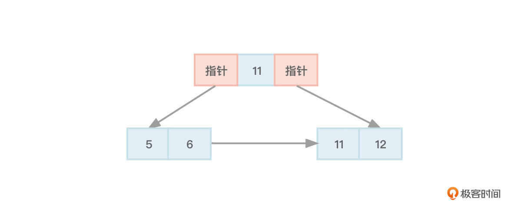
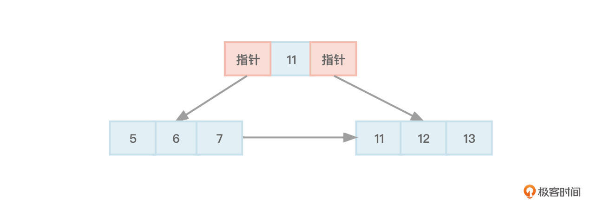
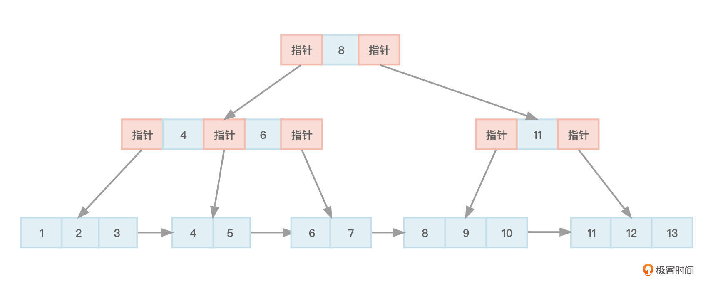
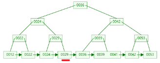
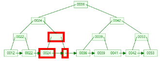
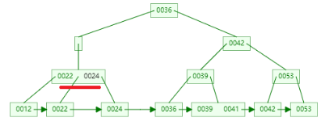
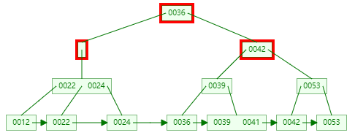
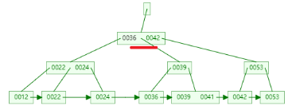

# 48｜多路查找树：B+树的插入与删除操作详解
你好，我是王健伟。

上节课我们详细讲解了多路查找树中的B树，这节课我们来聊一聊B+树。B+树有人理解为B树的升级，有人理解为B树的变形（变体），都可以。性质上来看，B+树与B树基本相同，但还是有一些不同点的。

- B+树的所有非叶子节点中的数据都会包含在叶子节点中。
- B+树的所有叶子节点相连，从而构成了一个数据从小到大排列的链表（虽然绘制时 常绘制成一个单链表，但实际应用中，往往实现成一个双链表以方便对数据的查找）。

下面，我带你看一看B+树都有哪些操作。

## B+树的插入操作

B+树的插入操作和B树非常类似。在这里看一个B+树节点插入的步骤。假如要按顺序给出如下数据创建一棵4阶B+树：

11，12，6，5，13，7，3，4，2，1，9，8，10

4阶B+树同样遵循每个节点最少有1个数据，最多有3个数据。创建的步骤如下：

- 因为当前并不存在B+树，所以以11为根创建一棵B+树。
- 插入12，因为12大于11，所以12位于11的右侧，与11共用一个节点。
- 插入6，因为6小于11，所以6位于11的左侧，与11、12共用一个节点。
- 插入5，因为5小于6，所以5位于6的左侧，此时注意，5、6、11、12共用一个节点。但因为4阶B+树最多有3个数据，因此这个节点必须要进行拆分（分裂），拆分的原则与B树一样—取这几个数据中间（⌈m/2⌉）的那个数据并作为根节点，剩余的数据分别做这个节点的左孩子和右孩子节点。讲解B树时取了第2个数据作为根节点，在这里取第3个数据作为根节点（4个数据中，第2个或者第3个数据都可以看成是中间的数据）。对于5、6、11、12，取第3个数据11作为根节点，将数据5、6所代表的节点作为11的左孩子，将12所代表的节点作为11的右孩子。

这里必须强调的两点：

1. B+树需要叶子节点存放所有非叶子节点的数据，所以数据11也要保存在叶子节点中，把数据11放到右孩子（数据12所代表的节点）中。换句话说，11如果在叶子节点中，并且要作为分拆后的根节点，那么11就要在分拆后的叶子节点中留一份拷贝。在编写代码时，要遵循这句描述以免代码出现错误。
2. B+树需要叶子节点相连。

目前的B+树如图1所示：

- 插入13，从根节点11开始，因为13大于11，因此沿着11的右指针向下找，找到11、12这个节点，因为13大于12，因此按照排列顺序，11、12、13三个数据被放到一起作为一个节点。
- 插入7，从根节点11开始，通过比较大小，将7放到5、6所在的节点中，注意顺序，现在5、6、7在一个节点中。如图2所示：

- 插入3，从根节点11开始，通过比较大小，将3、5、6、7这4个数据放到一起作为一个节点，因为4阶B+树最多有3个数据，因此这个节点必须要进行拆分，将6作为根节点，将3、5这两个数据所代表的节点作为6的左孩子，将6、7这两个数据所代表的节点作为6的右孩子。再将6这个节点并到数字11所代表的根节点中（因为根节点还不超过3个数据），注意因为11大于6，因此11排在6后面，如图3所示：

- 插入4，放到3、5所在的节点中，注意顺序，现在3、4、5在一个节点中。
- 插入2，将2、3、4、5这4个数据放到一起作为一个节点，必须要对该节点进行拆分，将4作为根节点，将2、3作为4的左孩子，将4、5作为4的右孩子，将4并到6、11所在的节点，如图4所示：

- 插入1，放到2、3所在的节点中，注意顺序，现在1、2、3在一个节点中。
- 插入9，放到6、7所在的节点中，注意顺序，现在6、7、9在一个节点，如图5所示：

- 插入8，放到6、7、9所在的节点中，注意顺序，现在6、7、8、9这4个数据放到一起作为一个节点，必须要对该节点进行拆分，将8作为根节点，将6、7作为8的左孩子，将8、9作为8的右孩子，将8并到4、6、11所在的节点，如图6所示：

图6是这棵B+树的中间状态，因为4、6、8、11所在节点需要继续进行拆分。将8作为根节点，将4、6作为8的左孩子，将11作为8的右孩子。注意这里仅仅将11作为8的右孩子，因为8已经不是叶子节点，8在叶子节点中已经存在了，所以不能将8和11放在一起作为8的右孩子。如图7所示：

插入10，放到8、9所在的节点中，注意顺序，现在8、9、10在一个节点中，如图8所示：

特别提示，B+树在不同的资料中表述和实现存在差异。前面谈到的B+树，非叶子节点的子节点数目比该节点的数据数目多1。但有的资料中对B+树的表述是非叶子节点的子节点数目是和数据数目相等的。这两种表述得到的B+树外观和实现代码都会有些不同，但都是B+树的正确实现方式。这里我就采用“非叶子节点的子节点数目是比该节点的数据数目多1”的表述和实现方式来实现B+ 树，因为这种实现方式与前面所实现的B树最接近。

B+树的插入操作实现代码与B树的插入操作实现代码大同小异。考虑到已经完整的实现过B树的插入代码，这里我就不实现B+树的插入操作代码了。你如果有兴趣，可以自行实现相关的代码。如果在代码编写中遇到问题，可以参考前面的“ [可视化数据结构算法演示网站](https://www.cs.usfca.edu/~galles/visualization/Algorithms.html)”页面并单击其中的“B+  Trees”链接，或者直接访问 [页面](https://www.cs.usfca.edu/~galles/visualization/BPlusTree.html) 对B+树中插入、删除等操作进行演示，这对更深入的理解B+树和对正确的写出B+树的插入、删除等操作将起到至关重要的作用。

## B+树的删除操作

B+树的删除操作其实和B树也非常类似。因为B+树的所有非叶子节点中的数据都会包含在叶子节点中，所以删除B+树中的任何数据在终端节点（叶子节点）中都可以找到。明确一下B+树每个节点有多少个数据。以一棵5阶B+树为例：

- 一棵5阶B+树，每个节点最多有4个数据。
- 根节点可以只有1个数据，非根节点至少有2个数据。

删除终端节点中的数据，一棵5阶B+树为例，分为两种情况。如图9所示的一棵5阶B+树：

- **情况一：删除数据后节点中的数据数量不低于下限**

只要删除数据后节点中的数据数量不低于下限，就可以直接在该节点中将数据删除。然后判断被删数据在原节点中是否位于最左侧（在原节点中值最小），若是意味着该数据很可能在其前辈节点中也存在，此时需要继续向树根方向回溯，查看该被删除的数据在中间节点或根节点是否存在，若存在则用叶子节点中该数据的后继数据（该数据右侧的数据）取代在中间节点或根节点中的该值。

在图9中，若要删除数据75，则直接在叶子节点中删除即可。而若要删除数据70，则除在叶子节点中删除数据70，还要用70的后继数据75来取代根节点中的数据70。所以，删除数据70后得到的结果如图10所示：

**情况二：** **如果将数据删除后节点的数据数量低于2，就会导致节点的合并**

- 如果兄弟节点数据的个数是超过数量2的，就可以从兄弟中借一个数据过来。还是以图9为例。现在要删除数据50，删除50后所在的节点只剩余数据60，低于2个数据，此时左侧兄弟节点（30、35、40）数据个数超过2个，可以借一个数据。具体步骤是把左侧兄弟中最大值40拿来和数据60放到一起，现在这个节点中最小的值就是40。又因为删除数据50之前，50是所在节点最左侧的数据，所以继续向树根方向回溯，查看50在中间节点或根节点是否存在，若存在则用40（被删除数据所在节点中当前最小值）取代。最终得到的B+树如图11所示：

- 如果兄弟节点数据的个数不超过数量2，就无法从兄弟中借数据。此时，被删除了数据的节点就会和兄弟节点、父节点进行合并。继续以图9为例。如果删除数据15，则该节点只剩余数据18，这就不满足5阶B+树非根节点至少有2个数据的要求，于是，父节点中的15也用18替代，我们将“18所在节点”与“父节点18、20、30、50”以及“18的左兄弟节点5、10”进行合并，如图12以及图13所示。

合并时注意的是因为18在叶子节点中已经不是最左侧的数值，不应该出现在非叶子节点中，因此父节点中应该将18删除，新的父节点是20、30、50。

再看一看图14这棵3阶B+树，现在要删除数据29：

叶子节点29删除后，所在的节点就没有数据了，此时该节点与24所在节点以及父（29）所在节点就要合并，合并前发现父节点也包含29，将这个29删除。如图15所示：

合并之后子节点仍旧只有数据24，父节点依旧为空，如图16所示：

如图16，因为此时父节点（节点24的父亲）为空，不满足3阶B+树节点数据最少为1的情形，所以该父节点和其左兄弟22以及该父节点的父节点24要继续合并。合并后如图17所示：

此时22、24合并为一个新节点，但该新节点的父亲又为空节点，所以这个空节点要继续与其右兄弟节点42和其父节点36合并，如图18所示：

合并后如图19所示：

此时36、42合并为一个新节点，但该新节点的父亲又为空节点，而该空节点恰恰是根节点，所以只需要把这个空的根节点删除，让36、42所在的节点作为整棵B+树的根节点即可，如图20所示：

从代码实现的角度来讲，B+树的删除代码与B树大同小异但要稍微复杂一点，所以要注意非叶子节点中也存在要删除或者替换的数据，也要注意维持叶子节点之间的相连关系。考虑到已经完整的实现过B树的删除代码，这里我就不实现B+树的删除操作代码了。

## 小结

本节我带你详细学习了多路查找树中的B+树。B+树是B树的升级或变体。它的性质与B树基本相同，但也有如下的不同点：

- B+树的所有非叶子节点中的数据都会包含在叶子节点中。
- B+树的所有叶子节点相连，从而构成了一个数据从小到大排列的链表。

这节课的重点在于B+树的插入和删除操作的具体步骤。考虑到相关的实现代码与B树非常类似，所以我没有为你提供B+树的具体实现代码，如果你有兴趣的话，可以参考B树的实现代码来自行实现。

你可能会有疑惑，B+树无论从代码实现复杂程度上还是从节点需要保存的数据数量上都高于B树，那B+树为什么要这样组织数据呢？这就涉及下节课所讲解的B+树的具体应用了。

## 思考题

1. B+树作为B树的变体，它在B树的基础之上进行了哪些改变，试着阐述B+树相对于B树的优势有哪些？
2. 尝试描述如何利用B+树实现数据记录的范围查询？

欢迎你在留言区和我交流。如果觉得有所收获，也可以把课程分享给更多的朋友一起学习。我们下节课见！