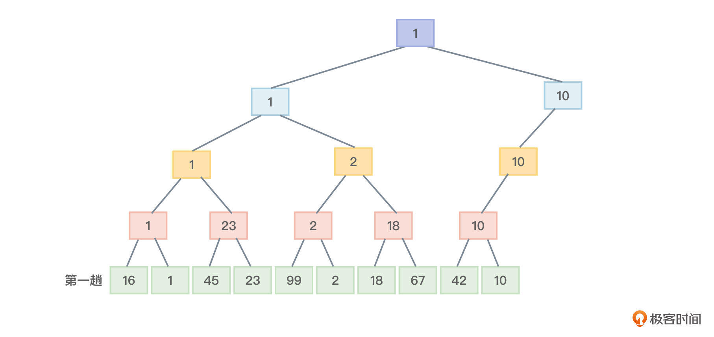
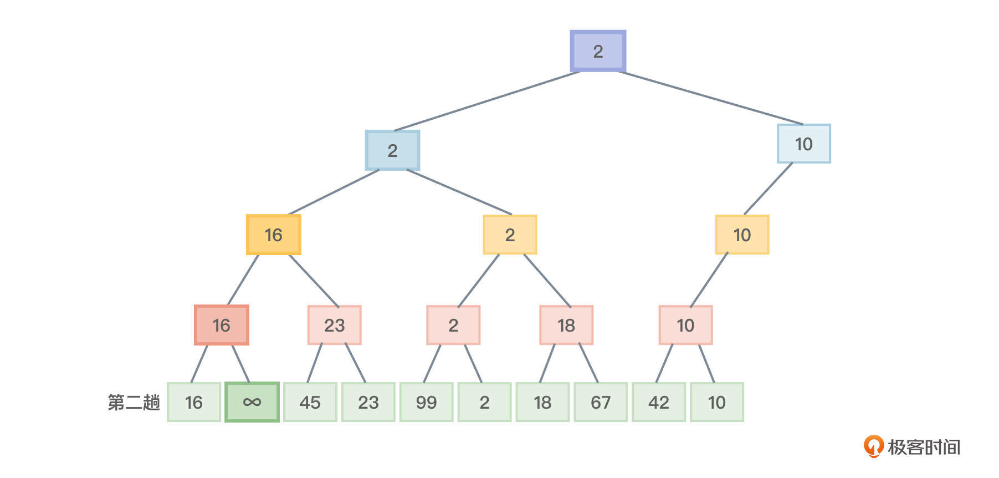
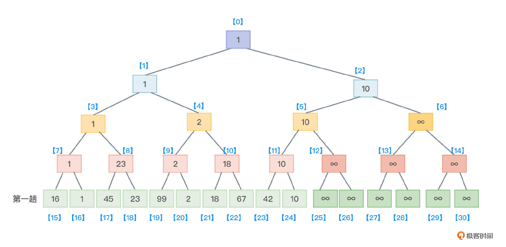
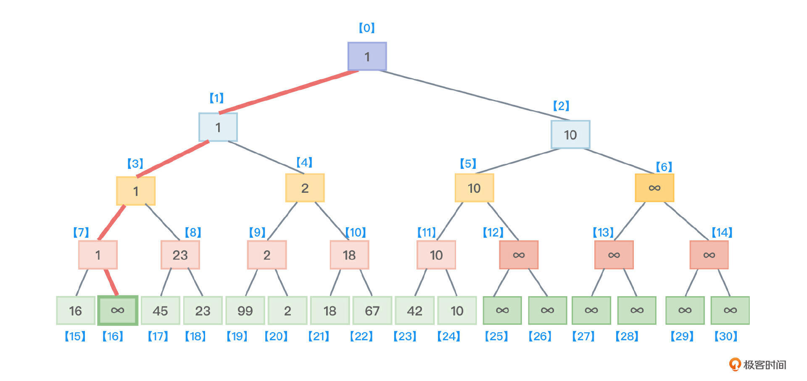
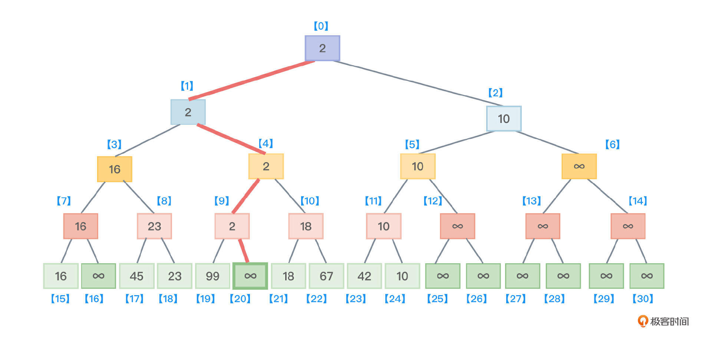

# 51｜树形选择排序：按照锦标赛的思想进行排序
你好，我是王健伟。

在选择类排序中，除了我们以往学习过的简单选择排序和堆排序之外，比较重点的还有树形选择排序，因为这种排序在面试中也偶有出现，所以这节课我们也来讲一讲。

## 基本概念与算法描述

树形选择排序又叫锦标赛排序（Tournament Sort），是一种按照锦标赛的思想进行选择排序的方法。属于对简单选择排序的一种改进。

我们尝试描述一下树形选择排序算法：对n个记录的关键字进行两两比较。然后在其中 ⌈$\\frac{n}{2}$⌉ 个较小者中再进行两两比较，如此重复，直到选出最小关键字（按从小到大排序）为止。

以数组 { 16,1,45,23,99,2,18,67,42,10 } 为例，参考图1。



图1从下向上观察，这是第一趟排序，目的是从所有数组中选出值最小的元素。我们尝试描述下具体的操作步骤。

- 开始两两比较，于是元素16和1比较选择1，元素45和23比较选择23，元素99和2比较选择2，18和67比较选择18，42和10比较选择10。
- 现在，选择出的元素1、23、2、18、10又进行两两比较，元素1和23比较选择1，元素2和18比较选择2，元素10没有比较的对象直接被选择。
- 现在，选择出的元素1、2、10又进行两两比较，元素1和2比较选择1，元素10没有比较的对象直接被选择。
- 现在，选择出的元素1、10又进行比较，选择1。最终这个1也是树形结构的树根，找个地方保存本趟排序的最小元素1。

接着，在树叶中把第一趟已经选择出的元素1标记为一个最大值 ∞（这表示元素1不可能在比较中被再次选中了），然后进行第二趟排序，如图2所示。



图2还是从下向上观察，这是第二趟排序，前面挑选出的最小值1已经找了个地方保存，这里直接把1的值修改为一个最大值∞，这样，对节点进行两两比较时，标记为最大值的节点就不可能被选中。第二趟排序需要进行什么比较呢？

- 开始两两比较，元素16和最大值比较，选择元素16。元素45和23、99和2、18和67、42和10就不需要再次比较（因为第一趟排序比较过了）。
- 现在，选择出的元素16和23比较，选择元素16。元素2和18，元素10同样因为第一趟比较过，不需要再次比较。
- 现在，选择出的元素16和2比较，元素10同样因为第一趟比较过，不需要再次比较。
- 现在，选择出的元素2、10进行比较，选择2。最终这个2也是树形结构的树根，找个地方保存本趟排序的最小元素2。

然后继续把第二趟中已经选择出的元素2标记为一个最大值，就可以开始第三趟排序，这里就不赘述了。

所以可以看到，经过一次（第一趟）的完全比较后，从第二趟开始就不再需要完全的两两比较，这样就达到了节省时间提高效率的目的，这就是树形选择排序相较于简单选择排序一个重大的改进之处。但是也应该看到，树形选择排序需要通过构造出二叉树这种树形结构来辅助排序，所以还需要辅助存储空间。

上述图1和图2意在阐述树形选择排序理论，理论上来说树形选择排序并不复杂。但若通过代码实现，则是需要构建一棵完全二叉树来实现对数据排序的。换句话说，图1和图2绘制得比较简单，很多额外的节点并没有绘制出来。

回忆一下二叉树的性质5——具有n（n>0）个节点的完全二叉树的高度为 ⌈$log\_{2}^{n+1}$⌉ 或者 ⌊$log\_{2}^{n}$⌋ +1。同时，你也需要知道，含有n个叶子节点的完全二叉树的高度是 ⌈$log\_{2}^{n}$⌉ +1。以这个理论为指导（为了能够正确编写出代码），绘制一下更详细的树形选择排序示意图。依旧以数组 { 16,1,45,23,99,2,18,67,42,10 } 举例来解释树形选择排序。

- 把该数组中的所有元素都看成是完全二叉树的叶子，根据“含有n个叶子节点的完全二叉树的高度是 ⌈$log\_{2}^{n}$⌉ +1”，树形选择排序所要创建的这棵完全二叉树高度应该是5。
- 第一趟，两两比较，找到最小值保存到根节点中，如图3所示。



- 接着，沿着根节点向叶子节点找，找到了最小值1所在的叶子节点，把该叶子节点的值从原来保存的1修改为最大值 ∞，如图4所示。



- 接着要开始第二趟比较了，第二趟比较时叶子节点之间不再需要两两比较，只需要16和∞作比较，此时当然是16更小，于是，沿着这个比较路线再前进到树根，就能把当前树中的最小节点找到并保存到根中。如图5所示。


- 接着，沿着根节点向叶子节点找，找到了最小值2所在的叶子节点，把该叶子节点的值从原来保存的2修改为最大值 ∞，如图6所示。



持续上述步骤，就可以把整个数据序列按从小到大的顺序排列好。

## 实现代码

下面我给出树形选择排序的实现代码。

```plain
#define INT_MAX_MY 2147483647//整型能够保存的最大数值，作为标记使用
//树形选择排序（从小到大）
template<typename T>
void TreeSelSort(T myarray[], int length)
{
	//ceil是系统函数：ceil(x)函数返回的是大于或等于x的最小整数
	int treelvl = (int)ceil(log(length) / log(2)) + 1; //5:完全二叉树高度(含有n个叶子节点的完全二叉树的高度是⌈logn⌉ +1)

	//treelvl高的完全二叉树最多有nodecount个节点，如果有nodecount个节点，此时的完全二叉树其实是满二叉树
	int nodecount = (int)pow(2, treelvl) - 1; //31：满二叉树是指一棵高度为h，且含有2h-1个节点的二叉树

	//treelvl-1 高的完全二叉树最多有nodecount2个节点
	int nodecount2 = (int)pow(2, treelvl - 1) - 1; //15

	int* pidx = new int[nodecount];//保存节点的下标用的内存

	//叶子节点保存元素的下标值（就等于保存了元素的值）
	for (int i = 0; i < length; ++i)
	{
		pidx[nodecount2 + i] = i; //pidx[15] = 0; pidx[16] = 1....;pidx[24] = 9
	} //end for

	//给多余的叶子节点赋予一个最大值作为标记
	for (int i = nodecount2 + length; i < nodecount; ++i) //i=25~30
	{
		pidx[i] = INT_MAX_MY;  //pidx[25] = MAX;pidx[26] = MAX; ......pidx[30] = MAX
	}

	int tmpnode2 = nodecount2;  //15
	int tmpnode = nodecount;    //31

	//现在要开始给非叶子节点赋值了,非叶子节点下标是[0]~[14]
	//第一趟排序要给非叶子节点赋值，还要两两进行节点比较，所以要单独处理
	while (tmpnode2 != 0)
	{
		//第一次for执行i值分别为：15、17、19、21、23、25、27、29
		//第二次for执行i值分别为：7,9,11,13
		//第三次for执行i值分别为：3,5
		//第四次for执行i值分别为：1
		for (int i = tmpnode2; i < tmpnode; i += 2)
		{
			//第一次for这个pidx的下标【(i + 1) / 2 - 1】分别是7,8,9,10,11,12,13,14
			//第二次for这个pidx的下标【(i + 1) / 2 - 1】分别是3,4,5,6
			//第三次for这个pidx的下标【(i + 1) / 2 - 1】分别是1,2
			//第四次for这个pidx的下标【(i + 1) / 2 - 1】分别是0
			//把两个孩子中小的孩子值给爹
			if (pidx[i] != INT_MAX_MY && pidx[i + 1] != INT_MAX_MY)  //如果pidx[i]和pidx[i+1]都是正常值，那自然是可以比较
			{
				if (myarray[pidx[i]] <= myarray[pidx[i + 1]])
				{
					pidx[(i + 1) / 2 - 1] = pidx[i];
				}
				else
				{
					pidx[(i + 1) / 2 - 1] = pidx[i + 1];
				}
			}
			else if( pidx[i] != INT_MAX_MY) //pidx[i]是正常值，因为有上个if在，说明pidx[i + 1]不是正常值
			{
				pidx[(i + 1) / 2 - 1] = pidx[i];
			}
			else //走到这里，说明pidx[i + 1]是正常值或者是INT_MAX_MY值
			{
				pidx[(i + 1) / 2 - 1] = pidx[i + 1];
			}
		} //end for
		tmpnode = tmpnode2;  //15,7,3,1
		tmpnode2 = (tmpnode2 - 1) / 2; //7,3,1,0
	} //end while

	T* ptmparray = new T[length]; //临时保存排好序的数据

	for (int i = 0; i < length; i++)
	{
		ptmparray[i] =  myarray[pidx[0]]; //将当前最小值赋给ptmparray[i]临时保存

		int leafidx = 0;

		//沿树根找最小值结点在叶子中的序号
		//leafidx = 0,1,3,7,16分别追溯到叶子中的编号
		for (int j = 1; j < treelvl; j++)
		{
			if (pidx[2 * leafidx + 1] == pidx[leafidx])
			{
				leafidx = 2 * leafidx + 1;
			}
			else
			{
				leafidx = 2 * leafidx + 2;
			}
		} //end for j

		//此时的leafidx就是完全二叉树叶子节点中的那个最小值的下标
		pidx[leafidx] = INT_MAX_MY; //leafidx = 16。
		while (leafidx)
		{
			//leafidx = 7,3,1,0
			leafidx = (leafidx + 1)/2 - 1;//序号为leafidx的结点的双亲结点序号
			if (pidx[2 * leafidx + 1] != INT_MAX_MY && pidx[2 * leafidx + 2] != INT_MAX_MY)  //如果pidx[i]和pidx[i+1]都是正常值，那自然是可以比较
			{
				if (myarray[ pidx[2 * leafidx + 1]] <= myarray[pidx[2 * leafidx + 2]])
				{
					pidx[leafidx] = pidx[2 * leafidx + 1];
				}
				else
				{
					pidx[leafidx] = pidx[2 * leafidx + 2];
				}
			}
			else if (pidx[2 * leafidx + 1] != INT_MAX_MY)
			{
				pidx[leafidx] = pidx[2 * leafidx + 1];
			}
			else
			{
				pidx[leafidx] = pidx[2 * leafidx + 2];
			}
		}//end while
	} //end for i

	//把数据从ptmparray拷贝回myarray
	for (int i = 0; i < length; i++)
	{
		myarray[i] = ptmparray[i];
	} //end for i

	//释放内存
	delete[] ptmparray;
	delete[] pidx;
	return;
}

```

在main主函数中，加入测试代码。

```plain
int arr[] = {16,1,45,23,99,2,18,67,42,10};
int length = sizeof(arr) / sizeof(arr[0]);   //数组中元素个数
TreeSelSort(arr, length);//对数组元素进行树形选择排序
cout <<"树形选择排序结果为：";
for (int i = 0; i < length; ++i)
{
	cout << arr[i] <<"";
}
cout << endl; //换行

```

代码的执行结果如下：


树形选择排序算法因为含有n个叶子节点的完全二叉树的高度是 ⌈$log\_{2}^{n}$⌉ +1，除了最小关键字外，每次选择其他最小关键字只需要 ⌈$log\_{2}^{n}$⌉ 次比较，因为还有 n-1 个关键字需要进行这个次数的比较，所以可以认为该算法的时间复杂度是 O(n$log\_{2}^{n}$)。

对于算法的空间复杂度，在上述实现代码中，是需要一些辅助空间帮忙实现排序的（空间换时间），比如存储完全二叉树节点，还可能需要存储其他一些数据比如临时的排好序的数据。当然，也可以用其他办法，而不是必须用临时空间保存排好序的数据，不过总体来看，树形选择排序的空间复杂度为O(n)。

此外，经过我测试，认为上述算法的实现代码是稳定的。如果你稍微调整一下其实现代码，改为不稳定的也很容易。

## 小结

这节课我带你一起学习了选择类排序中的树形选择排序。树形选择排序是一种按照锦标赛的思想进行选择排序的方法，属于对简单选择排序的一种改进。它会通过多趟排序来对n个记录的关键字进行两两比较，然后在其中 ⌈$\\frac{n}{2}$⌉ 个较小者中再进行两两比较，如此重复，直到选出最小关键字（按从小到大排序）为止。

**树形选择排序的每一趟排序都会减少需要两两比较的元素数量，从而达到了节省时间提高效率的目的，这就是树形选择排序相较于简单选择排序一个重大的改进之处。** 但是我们也应该看到，树形选择排序需要通过构造出二叉树这种树形结构来辅助排序，所以还需要辅助存储空间。

这节课我们也详细解释了树形选择排序的概念，通过多个示意图对该排序的算法进行了详尽的描述，也为你提供了完整的实现代码。最后强调一个细节，树形选择排序算法的时间复杂度是 O(n$log\_{2}^{n}$)，空间复杂度为 O(n)，算法是稳定的。

## 思考题

在这节课的最后，我也给你留了几道复习思考题。

1. 请描述用树形选择排序对以下数组进行排序的过程 { 15，6，2，23，8，9，27，12 } 。
2. 试比较树形选择排序与堆排序的区别。

欢迎你在留言区和我互动。如果觉得有所收获，也可以把课程分享给更多的朋友一起学习。我们下节课见！