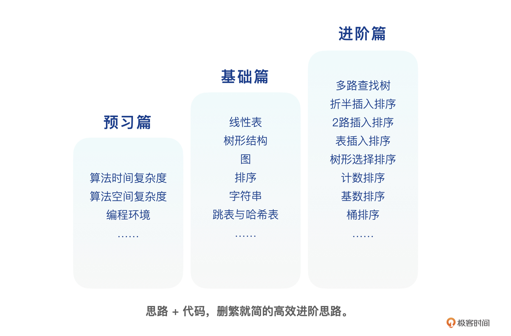

# 开篇词｜学习数据结构与算法，也可以是件小事
你好，我是王健伟。欢迎和我一起学习数据结构与算法。

提到数据结构与算法，就一定会伴随着诸多所谓的坚持和抱怨。同时，还有两个词总是出现，一个是内功，是对知识的定位，一个是吃透，是对自己的期待。可是，我们是不是被这两个词束缚太久了，以至于出现了很多的问题呢？

- 时间不多，数据结构与算法的知识体系庞大，总是学了后面忘了前面，很难坚持。
- 刷了不少题，但面对面试官的提问和新的题目，我总是没有思路。
- 代码细节总是写不对，环境、语言都可能成为我的“绊脚石”。
- 书上的东西看是看懂了，但到底要怎么实践？
- ……

如果你也有这样的想法，不必担心，我们来一一拆解一下。

## 为什么数据结构与算法总让我觉得沉重？

我把所有的疑问分门别类，最后汇总出了两个问题——关于基础，关于时间。估计你也能从这里找到自己的影子。

**第一个问题：都说这部分知识是内功，一定要不断修炼，保证吃透，可是何为内功？何为吃透？**

有人把学习数据结构与算法比喻为练内功，但我不赞成这样的说法。 **程序员真正的内功其实是解决复杂问题的全局把控能力以及细节实现能力**，这往往需要十数年甚至数十年的持续修炼才能体会得到。除非你将所有计算机基础知识都称为内功，否则这样的比喻并不恰当。

不可否认的是，数据结构和算法方面的知识是计算机的基础知识之一，但是，这不意味着你一定要给它贴上一个宏大的标签，甚至扛着极大的心理压力和包袱去学习。

吃透这个词也挺有意思。数据结构和算法方面的知识博大精深，深入挖掘下去还会用到许多数学知识。因此，我们的首要目标不应该是吃透，而应该是尝一尝，把知识读薄，指向实践，够用即可。后续要在某个非常具体的数据结构或者算法领域取得一定成就，才会需要吃透其中的一些东西。

所以我的回答是， **轻装上阵，先做到大而全也不是什么坏事**。

**第二个问题：怎么分配系统学习和刷题的时间呢？**

有一句话很重要，做选择之前要明白自己到底想要什么。

刷题，基本都是为了应付面试。如果非要说是为了锻炼解决问题的思维能力，以及快速用合适的数据结构去解决现实中的问题，这个作用当然也有，但却是次要的。对于软件工程师来讲，还有很多比数据结构更重要的知识需要去学会。

如果你确定要去某个大厂应聘某个算法岗，而该算法岗是需要你刷题的，那么你就在系统学习之后，在网上找找相关的试卷或者考题，有目的地到LeetCode上去刷。

如果你不去大厂或者并不去应聘一些专门的算法岗职位，那么直接去系统学习一门课就好。把时间节省出来好好学些更重要的知识吧。切记，时间对于软件开发工程师非常非常珍贵，甚至是你最珍贵的资源、最宝贵的财富。 **千万不要大手大脚的占用大量时间去学习太多没必要的知识**。

一言以蔽之，也就是没有孰重孰轻，但 **系统的学习是刷题的基础**。想象一下，你会在不认识汉字的情况下去读小说吗？

## 越是大而全，越要删繁就简

卸下了包袱，明确了目标，接下来的问题就是怎么学习了。

很多同学感觉到自己的时间有限，数据结构和算法知识体系太过庞大，学了后面忘了前面，很难坚持学完。造成这种情况的原因很多，比如有些资料把简单问题复杂化了，有些资料则非常晦涩，数学知识过多，学术性过强，甚至是表达不清，很难让人有舒适的学习体验。

所以，删繁就简，顺其自然，不仅是我设计课程的思路，更是咱们后续学习的基调。不论你是面试，还是要为后续的一系列提升打基础， **我们首先要做的，都是一起回归最基础的概念，写出最优质的代码。**

不论你是否已经具备了一定的基础，接下来，就让我们放平心态，先来梳理下在每个模块的学习目标到底是什么。

**1\. 预习篇**

在预习篇，我会讲解算法的时间复杂度和空间复杂度的概念，为后续的学习铺路。此外，我会和你一起逐步完成编程环境的搭建工作。正所谓工欲善其事必先利其器，后续我们要写很多代码，要保证这些代码的正确运行，一个能够正常工作的编程环境是基础且必要的。

**2\. 线性表**

学习任何知识都要由浅入深，由易到难。线性表会是我们这门课程讲解的第一个数据结构，和其它结构相比，它更为简单直接，也最好理解，从代码实现上也最容易，是学习其他更复杂数据结构的基础。同样，也一定能让你对之后的学习更有信心。

**3\. 树形结构**

不过，在一些复杂的领域中，线性表这种简单的数据结构还不足以表达问题，这个时候，树形结构就出现了。

它是算法面试中最常出现的数据结构，也是在实际开发中我们经常会有意无意用到的数据结构，想要写出正确且更高效的程序代码，这部分的内容还是要打好基础的。

**4\. 图**

图是比树形结构更复杂的数据结构。如果说树形结构的应用往往体现在程序编写中，那么对图的应用往往更接地气，更体现在实际生活中。比如可以通过图来解决找出两个城市之间如何行走距离最短、最节省时间、花费的金钱最少问题等等，还可以用图来估算一个工程能否按顺序进行以及估算该工程需要的最短时间。

**5\. 排序**

我们知道，数据结构是为算法服务的。所以在讲解完线性表、树形结构、图这三种数据结构后，我们正式进入到算法知识的讲解中。在各种算法知识中，尤其以排序算法最经典，实用且在面试中最常出现。排序算法有十数种，每种排序算法的适用场合、时间以及空间复杂度、稳定性等各不相同，搞定了这部分的内容，也就可以应付面试了。

**6\. 字符串**

这里我们要插入字符串的讲解。这种数据结构非常常见，同时也有着广泛的应用，比如在搜索引擎中搜索的关键词、在文章中需要过滤的敏感词等等，都属于字符串。

其中，最需要解决的问题是子串在整个字符串中的查找问题。我会主要为你介绍两种查找子串的算法实现方式。第一种实现方式称为朴素模式匹配算法，容易理解但执行效率相对较低；第二种是KMP模式匹配算法，这种算法执行效率很高，但理解起来却颇有难度。尤其值得注意的是，有些面试官非常喜欢考KMP模式匹配算法实现的子串查找，这里的重要程度也就不言而喻了。

**7\. 跳表与哈希表**

跳表与哈希表这两种数据结构都非常实用且有趣味性，可以理解成是属于更高级的数据结构范畴。不过放心，虽然高级，但代码实现上却没有那么复杂。

你可以把跳表看作强化版的线性表，可以极大提升元素查询速度。而哈希表是对数组的扩展，对于查找操作同样有非常良好的性能表现。引入这两个话题，一是为了丰富你的眼界和开发思路，以备在日后的开发中随时采用，二来也是避免不了的老调重弹——为了应付面试的需要。

**8\. 进阶篇**

我把一些难度相对大，在面试中出现频率没那么高的内容放入到了进阶篇中。这当然不意味着你可以完全不学其中的内容。我建议你可以相对少花一点精力来学。比如你可以少敲一些代码，把课程中讲解的内容理解好就可以了。

可以说， **这门课给了你去LeetCode等网站刷题之前应该具备的各种理论和实践知识**。我会先详细讲解一个数据结构或一个算法的概念和思路，在你充分理解后，再把这些思路通过代码的方式实现出来，整个过程会更简单、顺理成章。就好像我们讲一个故事，你自然是要先理清故事的脉络，再通过语言表达出来。这样，思路和语言实现，都不会再成为我们的绊脚石。

## 写在最后

最后，做个自我介绍吧。我1995年从哈尔滨工程大学毕业，有着二十多年软件开发经验，以C++语言为主。曾经历过数十个软件项目，所涉及到的开发领域主要集中在电信、网络安全、网络游戏。

从2018年开始，我踏足了在线教育行业，先后发布了7门C++语言视频课程，涉及了C++语言基础知识的方方面面。这些课程在C++类课程排行榜中基本都处于最前列位置，尤其获得了很多颇具开发经验同学的超高评价。许多同学通过学习我的课程取得了国内外大型公司的offer。

从2020年开始，我和清华大学出版社合作先后出版了五本《C++新经典》系列书籍，交到了很多学友，也收获到了很多读者的良好反馈。复杂的问题会被我尽量简单化地讲出来，讲解的深度也不至于把人带偏、讲糊涂。

在软件开发行业，我们经常听到一些高大上的词汇，比如架构、微服务、大数据、云计算等等，却往往忽略了作为一个软件开发人员最最基础的编程能力。所以你经常会看到很多人写出的代码到处是问题，要么乱写，乱抄，或者乱改，程序执行效率极其低下甚至频繁崩溃。就算不是你写出来的，接手这样的代码，也一定是件让人崩溃的事。

因此，我特别希望这个专栏不仅能帮你抛下身上对于数据结构与算法的沉重包袱，更能潜移默化地为你打开思维，建立数据结构与算法的敏感度，为之后的每一次实战打下坚实的基础。

课程中讲的东西看懂就行了，不必太有负担，想着怎么实践，至少这个问题当下无需多虑，等将来你进入公司参与到实际的开发工作中，自然会遇到实际的生产环境，也会有人带你参与实践。没发生的事情就先不要去想，抛开包袱，往前走就是了。

要记住， **数据结构与算法，本来就是一件小事**。

日拱一卒，功不唐捐。这是我非常喜欢的一句话，这里也送给即将踏上旅程的你。请你放心，接下来的路虽然很长，但一定会让你有拨云见日的感觉。我们下一讲见。