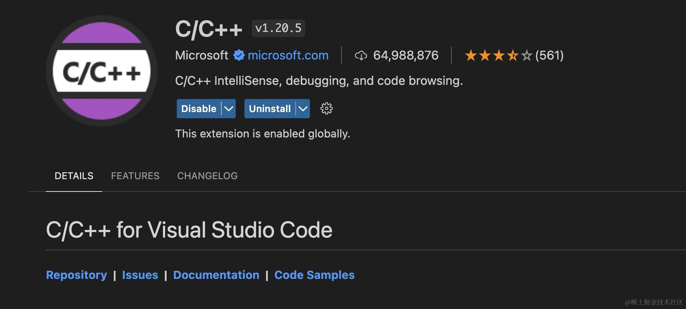
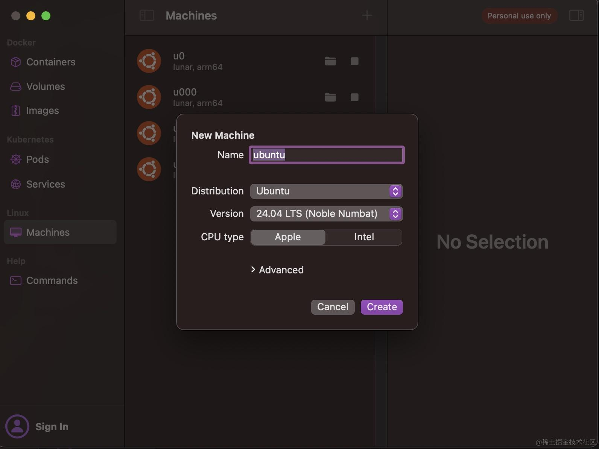

## 你需要准备

如果想更好地消化这本小册的内容，需要你也费心准备下面这些事项。

### Linux 内核源码

下载与你线上环境相匹配的 Linux 内核源码，并使用 VSCode 或其他你熟悉的软件打开，以便查阅和分析。

如果你使用 vscode，则需要额外安装 "C/C++" 扩展：

### Linux 环境

如果你的开发环境是 Mac，你可以使用 Parallel Desktop 或者其他虚拟化软件来安装运行 linux。我这里推荐一个我常用的 [orbstack](https://orbstack.dev/)。

这个软件速度很快，可以在 mac 上快速创建各类架构和版本的 linux 环境。

不仅支持虚拟机，还可以运行 docker 容器和 k8s，非常强大，而且免费，强烈推荐大家使用。

### 一些基础知识的学习

有一些基础知识，需要你结合小册自学，我并没有完全涵盖，比如 linux 基础命令、汇编、网络基础等，这个小册更多是结合实践，从我日常遇到的问题着手去介绍可能你实际会遇到的问题。

### 开发语言及工具

这本小册主要涉及的开发语言是 C/C++、Go、Rust，使用 C/C++ 是为了更贴近底层，方便你理解很多底层原理的实现，使用 Go 和 Rust 是为了开发便捷，相信你如果有一点其它语言的基础，理解看懂这些语言非常容易。

IDE 我推荐首选 jetbrains 家的全家桶，C/C++ 使用 CLion，Go 使用 GoLand，Rust 使用 RustRover，当然 vscode 也是不错的选项。

## 阅读顺序

这个小册大体按照 **`五大章节`** 在组织，分别是：

*   **基础篇**
*   **CPU 篇**
*   **内存篇**
*   **IO 篇**
*   **容器篇**

这五个章节相对独立，你可以选择你感兴趣的章节开始阅读。

**`基础篇`** 的内容涵盖了多个核心工具和技术的使用及原理，主要包含下面这些内容：

*   了解 GDB 的基本使用方法，包括如何启动调试、设置断点、查看变量和单步执行等；
*   揭开 GDB 的神秘面纱，深入探讨 GDB 的工作机制，了解其如何通过 ptrace 系统调用实现对被调试程序的控制和调试；
*   讲解如何使用 QEMU 和 GDB 调试 Linux 内核；
*   简单了解汇编语言的基本概念，能结合搜索引擎和大模型看懂理解汇编代码，从汇编的角度理解 C/C++、Go 的诸多细节；
*   探讨同步机制和锁的实现原理，介绍计算机先驱们是如何优化锁的；
*   带你深入理解线程本地存储 TLS 的实现原理；
*   介绍 Linux 系统中的时钟源和高性能计时方法，以及 vdso 系统调用的实现和应用；
*   介绍零拷贝技术的原理和实现，了解如何通过零拷贝提高数据传输效率；
*   介绍 `LD_PRELOAD` 的使用方法和应用场景，介绍在审计、故障注入、性能分析上的应用；
*   深入分析系统调用的实现原理，如何传参，系统调用涉及的上下文切换等；
*   介绍 ftrace 和 trace-cmd 工具的使用方法，方便你追踪内核调用过程，理解业务的调用会触发那些内核函数；
*   手写 tcpdump。

**`CPU 篇`** 包含下面这些内容：

*   进程线程的本质，详细讲解 Linux 内核中 task\_struct 结构；
*   介绍进程的各种状态及其转换条件，帮助你理解进程的生命周期，尤其是 D 状态等；
*   讲解孤儿进程和僵尸进程的概念及其处理方法；
*   探讨 Kubernetes 中的 pause 容器和僵尸进程问题；
*   介绍 D 状态进程的含义及其对系统负载的影响，如何构造 D 状态的进程；
*   详细讲解进程上下文切换的本质，让你了解上下文切换发生什么，了解其对系统性能的影响；
*   介绍完全公平调度（CFS）算法的原理和实现，理解线程是如何分配到 CPU 时间的；
*   介绍实时进程调度算法的原理和实现，很多内核线程都是以实时调度策略运行的，我们需要搞懂实时调度算法到底意味着什么；
*   介绍火焰图的概念和使用方法，帮助你分析和优化 CPU 性能；
*   讲解 CPU 亲和性和超线程技术的原理和应用，了解在多核处理器中我们应该注意什么；
*   通过实际代码示例，讲解如何手写协程，帮你了解协程的本质。

**`内存篇`** 包含下面这些内容：

*   理解虚拟内存和物理内存的概念；
*   比较 brk 和 mmap 两种内存分配系统调用的原理和应用场景，了解内存是如何分配的；
*   介绍进程内存分布的基本概念和结构，这在我们分析进程的内存占用时十分有用；
*   了解什么是缺页中断 PageFault；
*   深入分析 Linux OOM 机制，了解 overcommit、oom\_score\_adj 等概念；
*   讲解 malloc 和 free 函数的底层实现原理，理解 ptmalloc、jemalloc 等内存分配器的角色。

**`IO 篇`** 主要包含下面这些内容：

*   介绍虚拟文件系统（VFS）的概念和四大数据结构，理解 Linux 一切皆文件的精妙设计；
*   了解文件描述符（fd）分配的最低未使用原则；
*   重点理解文件描述符表（进程级）、打开文件列表（系统级）、i-node 表（系统级）这三者之间的关系；
*   剖析 epoll 源码，理解等待队列、epoll 数据结构、事件回调等知识。

**`容器篇`** 主要介绍容器原理以及网络相关的知识：

*   支撑容器实现的实现原理：cgroup、namespace、rootfs 等概念；
*   容器网络基石：veth、bridge、tun/tap 等；
*   剖析内核层 conntrack 的实现；
*   理解 iptables 的基础概念与自定义规则链；
*   详细介绍 DNS 的实现原理以及在各大语言中的注意事项；
*   介绍 ARP 的基础知识以及 GC 的注意事项；
*   通过源码走读，介绍 socket 编程中的核心函数的内核层实现。

## 最后

动手！一定要动手！Get your hands dirty！
