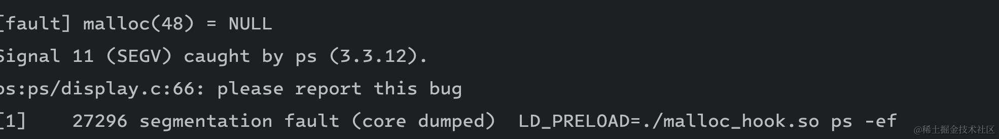
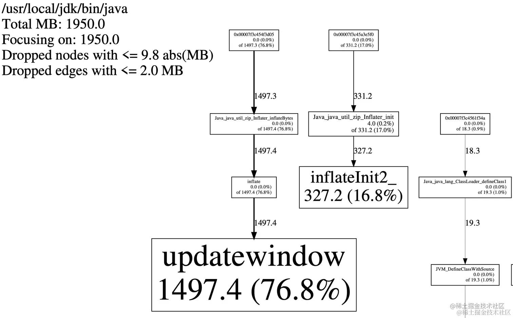

在 Linux 系统中，`LD_PRELOAD` 是动态链接技术中提供的一个强大的扩展功能，允许在程序运行前优先加载指定的动态链接库，从而改变程序的行为，而无需修改程序源代码。

在实际的工作中，`LD_PRELOAD` 的使用场景是非常多的，比如替换 linux 的内存分配器、故障注入、安全审计等。这篇文章我们来详细看看 `LD_PRELOAD` 的原理和使用方法。


## `LD_PRELOAD` 的工作原理

LD\_PRELOAD 是一个环境变量，通过 LD\_PRELOAD 这个环境变量指定的共享库可以覆盖其他库中的同名符号。利用这一特性，我们可以拦截某些库函数的调用，修改其行为，或者在调用前后插入一些代码。

我们接下来通过 LD\_PRELOAD 实现在 open 函数的前后都注入一行打印。在这之前，我们需要介绍一些前置的知识。


### dlsym 函数

dlsym 的作用是在一个已经打开的动态链接库中查找符号（函数或变量）的地址，定义如下：

```c
void *dlsym(void *handle, const char *symbol);
```

其中 handle 是动态链接库句柄，symbol是要查找的符号名（函数或变量）。比如查找 printf 函数：

```c
dlsym(RTLD_NEXT, "printf");
```

RTLD\_NEXT 是一个特殊的标记，使用 `RTLD_NEXT` 时 dlsym 会从当前共享对象之后的下一个共享对象中查找 printf 函数的地址。

如果要能彻底理解 RTLD\_NEXT，需要弄清楚动态链接库的加载顺序和内存映射，应该大部分同学接触不到，我这里先不展开。

先来看一下 `open` 函数的原始定义：

```c
#include <fcntl.h>

int open(const char *pathname, int flags, ...
          /* mode_t mode */ );
```

为了实现 open 函数的 hook，我们需要定义一个 open 函数的函数指针定义 orig\_open ，用来接受 dlsym 函数的返回值。

```c
int (*orig_open)(const char *, int, ...);
```

完整的代码如下：

```c
#define _GNU_SOURCE

#include <stdio.h>
#include <dlfcn.h>
#include <fcntl.h>

int (*orig_open)(const char *, int, ...);

int open(const char *filename, int flags, ...) {
    orig_open = dlsym(RTLD_NEXT, "open");
    int mode = 0; // todo: get mode from varargs
    int result = orig_open(filename, flags, mode);
    fprintf(stderr, "[audit] open %s, fd: %d\n", filename, result);
    return result;
}
```

把这个文件编译为 `open_hook.so` 文件：

```powershell
gcc -shared -fPIC -o open_hook.so open_hook.c -ldl
```


用 LD\_PRELOAD 加载，就可以拦截目标进程的文件访问，输出审计日志：

```powershell
» LD_PRELOAD=./open_hook.so cat /etc/hosts

[audit] open /etc/hosts, fd: 3
127.0.0.1       localhost.localdomain   localhost 
::1             localhost6.localdomain6 localhost6
...
```

通过 LD\_PRELOAD 审计，我们就可以记录 cat 命令读取和输出 /etc/passwd 文件的过程。


## 使用 LD\_PRELOAD 做故障注入

我们可以修改内存分配函数的行为、模拟内存不足等异常情况，测试程序的健壮性。下面这段代码随机让 malloc 函数返回 ENOMEM 错误，看上层应用是否可以正确处理。

```c
#define _GNU_SOURCE
#include <dlfcn.h>
#include <stdio.h>
#include <stdlib.h>
#include <unistd.h>
#include <string.h>
#include <errno.h>

void *(*orig_malloc)(size_t);

void *malloc(size_t size) {
    orig_malloc = dlsym(RTLD_NEXT, "malloc");

    if (rand() % 3 == 0) {
        fprintf(stderr, "[fault] malloc(%ld) = NULL\n", size);
        errno = ENOMEM;
        return NULL;
    }

    void* result = orig_malloc(size);
    fprintf(stderr, "[audit] malloc(%ld) = %p\n", size, result);
    return result;
}
```

此时我们执行 `LD_PRELOAD=./malloc_hook.so ps -ef` 会发现 ps 命令没有很好地处理 malloc 返回异常的情况，直接 panic 了。



而有些命令则很好的处理了，比如 `LD_PRELOAD=./malloc_hook.so ls` 命令。


## 使用 ld\_preload 来做内存分析

默认的 Linux 内存分配器 ptmalloc 在性能和内存碎片方面表现不是很好，另外 profile 的功能很弱，可以尝试替换默认的内存分配器为 jemalloc 或者 tcmalloc。它们的原理都是 hook 系统 malloc、free 等内存申请释放函数的实现，增加 profile 的逻辑。

从源码编译 tcmalloc（<https://github.com/gperftools/gperftools>） LD\_PRELOAD 来 hook 内存分配释放的函数：

```powershell
HEAPPROFILE=./heap.log 
HEAP_PROFILE_ALLOCATION_INTERVAL=104857600 
LD_PRELOAD=./libtcmalloc_and_profiler.so
java -jar xxx ..
```

启动过程中就会看到生成了很多内存 dump 的分析文件，接下来使用 pprof 将 heap 文件转为可读性比较好的 pdf 文件。内存申请的链路如下图所示：



通过这里可以看到绝大部分的内存申请都耗在了 Java\_java\_util\_zip\_Inflater\_inflateBytes，接下来就可以进一步分析。

## 小结

有了 LD\_PRELOAD 的能力，可以在不修改源码的情况下 hack 很多应用程序的功能，不过它也有一些限制：

*   不适用静态链接的程序。
*   要千万小心避免递归调用，比如在自定义的 malloc 函数中调用 printf 可能会再次调用 malloc，导致无限递归。可以使用 sprintf 而不是 printf 来避免这种情况。
