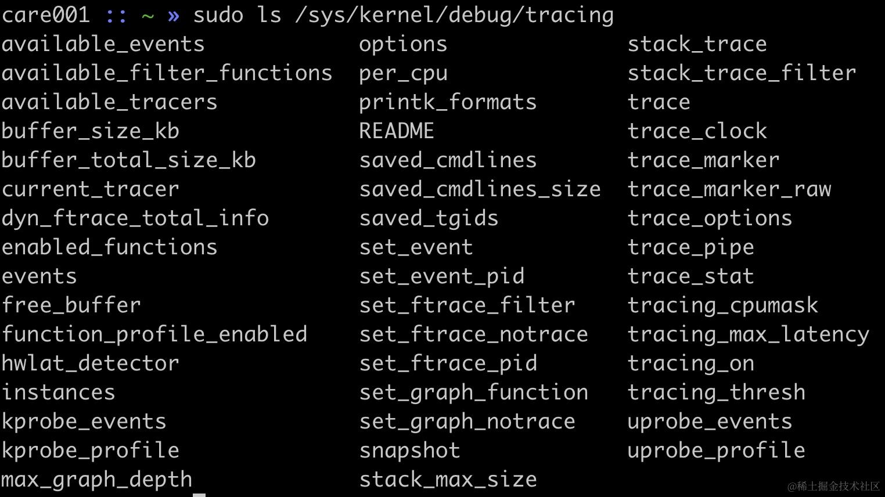
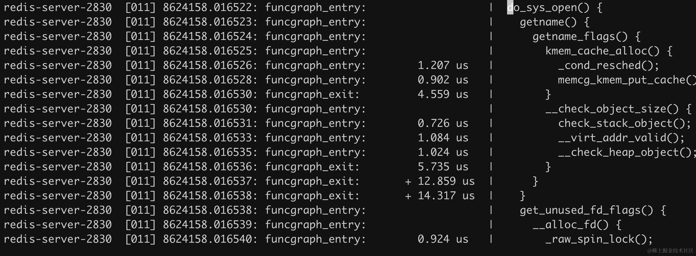
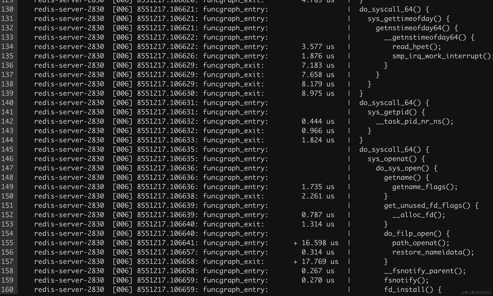
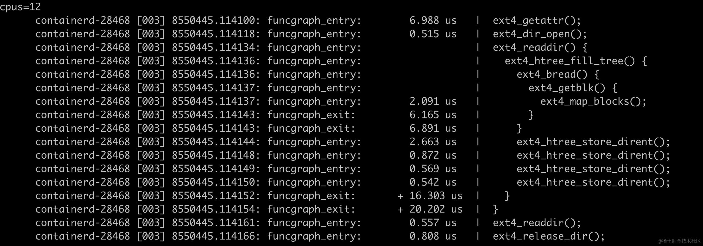

Ftrace 是 Linux 内核自带的调试工具，自 2.6 内核版本起就已支持。它最初是用于函数级别的跟踪（function trace），但随着发展 Ftrace 已经演变成一个通用的调试框架，能够实现多种跟踪目的。

ftrace 通过 `debugfs` 虚拟文件系统向用户空间提供访问接口。debugfs 默认挂载在 `/sys/kernel/debug` 目录下。而ftrace的相关控制和输出文件就位于该目录下的`tracing` 子目录中，完整路径为 `/sys/kernel/debug/tracing`。



以观测 do\_sys\_open 调用栈为例，ftrace 的使用如下：

```powershell

# 设置跟踪器类型为 function_graph
sudo sh -c "echo function_graph > /sys/kernel/debug/tracing/current_tracer"

# 设置要观测调用栈的函数
sudo sh -c "echo do_sys_open > /sys/kernel/debug/tracing/set_graph_function"

# 设置观测选项：启用进程TASK/PID打印
sudo sh -c "echo funcgraph-proc > /sys/kernel/debug/tracing/trace_options"

# 开启跟踪
sudo sh -c "echo 1 > /sys/kernel/debug/tracing/tracing_on"

# 等待一段时间

# 关闭跟踪
sudo sh -c "echo 1 > /sys/kernel/debug/tracing/tracing_on"

# 查看 trace
sudo cat /sys/kernel/debug/tracing/trace
```

trace 的内容如下：


## 指定 ftrace 跟踪器

Ftrace支持多种追踪类型，包括函数调用、函数图、硬件延迟、中断关闭、抢占关闭等，我们可以通过 `/sys/kernel/debug/` 相关的文件来查看 ftrace 支持的跟踪类型。

```powershell
sudo cat /sys/kernel/debug/tracing/available_tracers

hwlat blk mmiotrace function_graph wakeup_dl wakeup_rt wakeup function nop
```

其中比较常用的是 function 和 function\_graph。如要要设置跟踪器类型，需要把类型写入到 `current_tracer` 文件。比如设置类型为 function\_graph 可以这样操作：

```powershell
sudo sh -c "echo function_graph > /sys/kernel/debug/tracing/current_tracer"
```

## 设置要 trace 的函数

`set_ftrace_filter` 表示要跟踪的函数，比如追踪 `epoll_wait` 可以这样操作：

```powershell
sudo sh -c "echo SyS_epoll_wait > /sys/kernel/debug/tracing/set_ftrace_filter"
```

`set_graph_function` 用于设置 function\_graph 跟踪器的触发函数。它不仅跟踪指定的函数，还跟踪该函数调用的所有子函数。

## ftrace 的开关

ftrace 的开关是通过 `tracing_on` 文件来控制的。

```powershell
# 关闭 trace
sudo sh -c "echo 0 > /sys/kernel/debug/tracing/tracing_on"
# 开启 trace
sudo sh -c "echo 1 > /sys/kernel/debug/tracing/tracing_on
```

## 查看 trace

```powershell
sudo cat /sys/kernel/debug/tracing/trace

# tracer: function
#
# entries-in-buffer/entries-written: 2972/2972   #P:12
#
#                              _-----=> irqs-off
#                             / _----=> need-resched
#                            | / _---=> hardirq/softirq
#                            || / _--=> preempt-depth
#                            ||| /     delay
#           TASK-PID   CPU#  ||||    TIMESTAMP  FUNCTION
#              | |       |   ||||       |         |
    redis-server-2831  [007] .... 8269637.719334: SyS_epoll_wait <-do_syscall_64
    redis-server-2830  [010] .... 8269637.720688: SyS_epoll_wait <-do_syscall_64
```

通过这个 trace 我可以看到进程名、进程号、进程运行的 CPU、执行函数的时间戳等信息。

从上面的例子看出使用 ftrace 还是挺麻烦的，真正使用时实际上使用 trace-cmd 更多一点。trace-cmd 是一个用户空间的命令行工具，用于与 ftrace 进行交互。它提供了一个更方便的接口来配置和使用 ftrace，避免了直接操作 debugfs 文件系统的麻烦。


## trace-cmd 的使用

trace-cmd 的常见命令如下：

*   trace-cmd record：记录实时跟踪数据并将其写入 trace.dat 文件。
*   trace-cmd report：读取 trace.dat 文件并将二进制数据转换为可读的 ASCII 文本格式。
*   trace-cmd start：开始跟踪但不记录到 trace.dat 文件。
*   trace-cmd stop：停止跟踪。
*   trace-cmd extract：从内核缓冲区提取数据并创建 trace.dat 文件。
*   trace-cmd reset：禁用所有跟踪并恢复系统性能。

接下来我们用 trace-cmd 来实现前面 ftrace 观测 `do_sys_open` 函数调用图的效果。

首先使用 record 记录 trace 数据：

```powershell
trace-cmd record -p function_graph -g do_sys_open
```

注意 trace-cmd 默认开启了 funcgraph-proc 这个 trace-option，不需要手动指定。

使用 `ctrl-c` 退出这个 trace-cmd 时，会在当前目录生成 trace.dat 文件。接下来使用 report 读取 trace.dat 生成可读的文本：




## trace-cmd 的常用选项

### 查看可以跟踪的事件

当我们不知道可以跟踪哪些事件时，我们可以使用 `trace-cmd list` 列举当前系统上所有可用的事件：

```powershell
trace-cmd list -e
```

它还可以带一个可选的参数，使用正则表达式进行过滤：

```powershell
trace-cmd list -e '^sched.*'  # 列出所有以 sched 开头的事件
```

### 跟踪特定进程的函数调用

如果只想跟踪特定进程的函数调用，可以使用 -P 选项指定进程的 PID。例如，要跟踪 PID 为 10885 的进程，可以使用以下命令：

```powershell
trace-cmd record -p function_graph -P 2830
```



### 函数过滤

\-g 选项用于 function\_graph 插件，`-g do_sys_open` 表示只跟踪 `do_sys_open` 函数及其调用的所有子函数。


\-l 选项指定要跟踪的函数。例如，要跟踪所有以 `ext4_` 开头的函数，可以使用以下命令：

```powershell
trace-cmd record -p function_graph -l "ext4_*"
```



\-l 和 -g 的区别也比较显而易见：

*   \-l 不会跟踪其内部的调用子函数；
*   \-g 会跟踪函数内部调用的子函数。


### 限制跟踪深度

默认情况下，trace-cmd 的 function\_graph 会记录所有嵌套的函数调用。可以通过设置 `--max-graph-depth` 来限制跟踪深度。例如要将深度设置为 2，可以使用以下命令：

```powershell
trace-cmd record -p function_graph --max-graph-depth 2 -P 2830
```


### 追踪特定事件

可以结合事件追踪 `-e` 来获取更详细的信息，比如 `-e sched:sched_switch` 将指定追踪调度切换事件。还可以使用正则表达式过滤，比如追踪 nfs 相关的事件：

```powershell
trace-cmd record -e "nfs:*"
```


## ftrace 与 kprobe、kretprobe

通过向 /sys/kernel/debug/tracing/kprobe\_events 文件写入特定格式的字符串来添加 Kprobe 事件。例如，要跟踪 do\_sys\_open 函数的调用，可以使用如下命令：

```powershell
sudo sh -c "echo 'p:myopen do_sys_open filename=+0(%si):string' > /sys/kernel/debug/tracing/kprobe_events"
```

其中 `p:myopen do_sys_open` 指定了一个名为 myopen 的 kprobe 事件，目标追踪函数是 `do_sys_open`。 

do\_sys\_open 这个函数的定义如下：

```c
/**
 * vfs_open - open the file at the given path
 * @path: path to open
 * @file: newly allocated file with f_flag initialized
 * @cred: credentials to use
 */
int vfs_open(const struct path *path, struct file *file)
{
	file->f_path = *path;
	return do_dentry_open(file, d_backing_inode(path->dentry), NULL);
}
```

file 是它的第二个参数，在 x86-64 的调用规约中，使用 6 个寄存器（RDI、RSI、RDX、RCX、R8、R9）传递函数前 6 项参数，用 RAX 存储返回值。因此第二个参数 file 采用寄存器 SI 来传递。

接下来我们使用 trace-cmd 来完成 kprobe 事件的记录：

```powershell
sudo trace-cmd record  -e myopen
```

生成的 trace 日志如下：


ftrace 是一个很强大的框架，推荐大家好好研究一下，对于我们分析内核调用作用非常有用，调用作用非常大。
