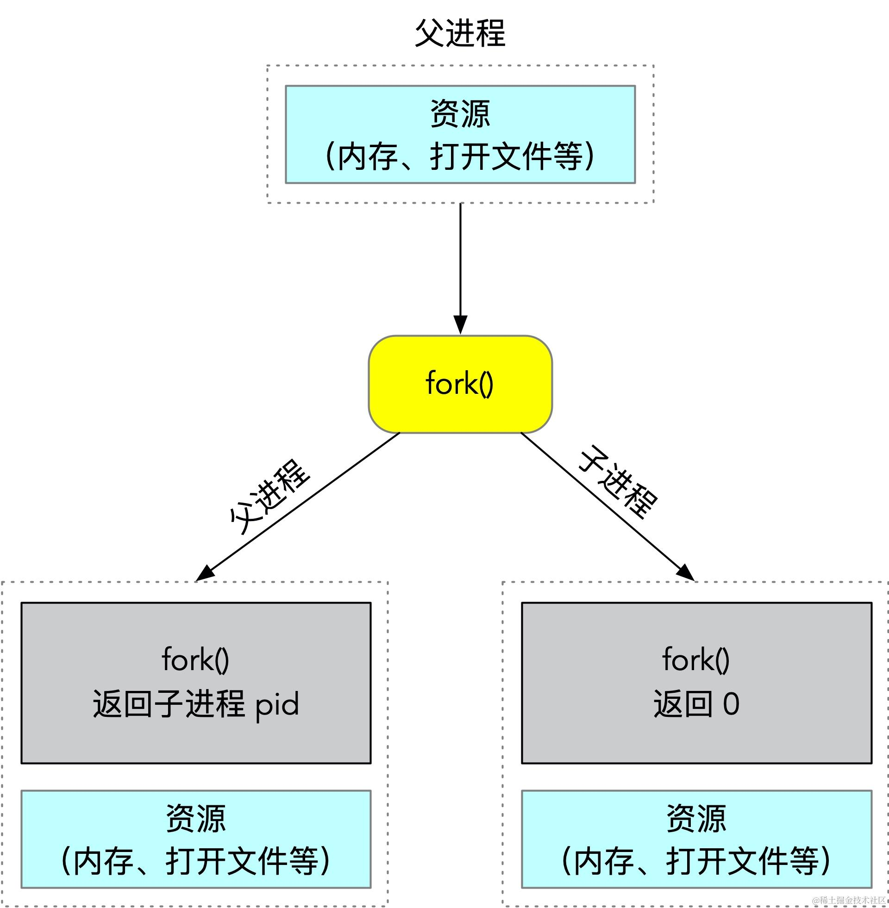

GDB 是类 Unix 操作系统下的一款 C/C++ 代码调试器，由大名鼎鼎的 Richard Stallman 开发，这人就是 GNU 项目的发起人，成立了自由软件基金会，贡献了 GCC、GDB、GNU Emacs 等基础软件。

## 为什么要写这个小节

工欲善其事，必先利其器，虽然我们很少写 C/C++ 代码，但是我们用到服务器操作系统都是 Linux，大量开源组件都是 C/C++开发的，比如 MySQL、Nginx、Redis、JVM、NodeJS 等，掌握 GDB 对这些组件的调试至关重要。另外在理解函数调用、内存布局方面更是要用到 GDB 的强大特性。

## 安装

```powershell
yum install gdb
```

## gdb 与调试信息

默认情况下使用 gcc 等编译工具不会把调试信息也编译进可执行文件，这样调试起来没法对应到行号、变量名等信息。如下面的：

```c
#include <stdio.h>
int foo(int x) {
    printf("%s\n", "enter foo");
    printf("x:%d\n", x);
    printf("%s\n", "exit foo");
}
int main() {
    printf("%s\n", "hello, world!");
    foo(1234);
    getchar();

    return 0;
}
```

使用 gcc 编译，gdb 运行：

```powershell
$ gcc test.c  
$ gdb a.out      
Reading symbols from /home/ya/a.out...(no debugging symbols found)...done.
```

打印出来的 `no debugging symbols found` 就表示该程序不包含调试信息。


## GDB 启动方式

GDB 有三种启动方式：

*   目标进程未启动的情况下，可以使用 `gdb executable` 的方式启动。
*   目标进程已经启动的情况下，可以使用 `gdb attach pid` 的方式启动，也可以先启动 gdb，然后在命令行中输入 `attach pid` 来进行调试。
*   目标进程 coredump 了，可以使用 `gdb executable corefile` 的方式启动。


## 基础命令入门

### run 命令

如果使用 gdb executable 的方式来启动目标调试文件，实际上目标调试文件还没有开始运行，需要使用 run 命令（简写 r）来运行该文件。

```powershell
$ gdb a.out
(gdb) r
Starting program: /home/ya/dev/linux_study/gdb/a.out
hello, world!
```

如果进程已经是启动状态，输入 run 命令是重新启动程序。


### break 命令

break 命令（简写 b）用来设置断点，下面三种方式都可以设置断点：

*   break function，在函数名为 function 的入口处添加断点；
*   break lineNO，在当前文件行号为 lineNO 处添加断点；
*   break file:lineNO，在 file 文件行号为 lineNO 处添加断点。

如下所示：

```powershell
(gdb) b foo
Breakpoint 1 at 0x400581: file test.c, line 3.
(gdb) b 4
Breakpoint 2 at 0x40058b: file test.c, line 4.
(gdb) b test.c:5
Breakpoint 3 at 0x400595: file test.c, line 5.
```


### info break 命令

info break 命令（简写为 info b）用来查看所有的断点列表。

```powershell
(gdb) info b
Num     Type           Disp Enb Address            What
1       breakpoint     keep y   0x0000000000400581 in foo at test.c:3
2       breakpoint     keep y   0x000000000040058b in foo at test.c:4
3       breakpoint     keep y   0x0000000000400595 in foo at test.c:5
```

如果断点不想使用，可以使用 delete 删除断点。比如，可以使用 delete 2 删除断点 2：

```powershell
(gdb) delete 2
(gdb) info b
Num     Type           Disp Enb Address            What
1       breakpoint     keep y   0x0000000000400581 in foo at test.c:3
3       breakpoint     keep y   0x0000000000400595 in foo at test.c:5
```


### enable、disable 命令

除了删除还可以使用 enable、disable 启用禁用断点，不加断点编号表示对所有断点进行启用或禁用。

```powershell
(gdb) disable 1
(gdb) info b
Num     Type           Disp Enb Address            What
1       breakpoint     keep n   0x0000000000400581 in foo at test.c:3
3       breakpoint     keep y   0x0000000000400595 in foo at test.c:5
```

Enb 那一栏可以看到 1 号断点的 enable 状态为 n，表示不启动此断点。


### continue 命令

当运行到断点处停下来时，可以使用 continue 继续执行直到遇到断点。

```powershell
(gdb) r
Starting program: /home/ya/dev/linux_study/gdb/a.out
hello, world!
Breakpoint 1, foo () at test.c:3
3	    printf("%s\n", "enter foo");

(gdb) c
Continuing.
enter foo

Breakpoint 2, foo () at test.c:4
4	    printf("%s\n", "in foo");
(gdb) c
Continuing.
in foo
```

### backtrace 命令

backtrace 命令（简写为 bt）用来查看当前调用堆栈，如下所示：

```powershell
(gdb) bt
#0  foo () at test.c:3
#1  0x00000000004005b9 in main () at test.c:9
```

当前的断点是 foo 函数，位于 test.c 文件的第三行，它的上一级调用是 main 函数。


### list 命令

list 命令（简写为 l）用来查看当前断点处附近的代码，如下所示：

```powershell
(gdb) b main
Breakpoint 1 at 0x4005a5: file test.c, line 8.
(gdb) l
1	#include <stdio.h>
2	int foo() {
3	    printf("%s\n", "enter foo");
4	    printf("%s\n", "in foo");
5	    printf("%s\n", "exit foo");
6	}
7	int main() {
8	    printf("%s\n", "hello, world!");
9	    foo();
10	    getchar();
```

通过 gdb 的输出可以看到当前断点在第 8 行，list 命令会显示第 8 行附近的 10 行代码。


### print 命令

print 命令（简写为 p）可以说是除了断点以外用的最频繁的命令之一了，通过 print 命令可以查看修改变量的值。还是以之前的代码为例，在 foo 函数处设置一个断点。

```powershell
(gdb) b foo
Breakpoint 2 at 0x4005c8: file test.c, line 3.

(gdb) c
Continuing.

(gdb) p x
$1 = 1234
```

然后就可以使用 p 打印 x 的值。

除了可以查看变量的值，还可以修改变量的值。

```powershell
(gdb) p x=1235
$2 = 1235
(gdb) c
Continuing.
enter foo
x:1235
exit foo
```

可以看到，通过 print 命令就把变量的值从 1234 修改为了 1235。


## 调试控制命令

前面讲到的还没有涉及到关于控制流的相关的，主要有下面这些 next、step、finish、until。

- next 命令（简写 n），其它调试工具也称为 step over。它的作用是执行到下一条命令，遇到函数不会进入到函数内部。

- step 命令（简写 s），也称为 step into，进入函数内部继续调试。

- finish 命令，也称为 stop out，执行完当前函数并跳出到上一层调用函数处。

- until 命令（简写为 u）让程序运行到特定的行数，快速跳过中间的代码。这与先在目标行加一个 breakpoint，然后调用 continue 的效果类似。


## info 命令

info 命令可以查看很多有用的信息，通过 help info 可以查看。

```powershell
(gdb) help info
Generic command for showing things about the program being debugged.

List of info subcommands:

info address -- Describe where symbol SYM is stored
info all-registers -- List of all registers and their contents
info args -- Argument variables of current stack frame
...
info variables -- All global and static variable names
info vector -- Print the status of the vector unit
info vtbl -- Show the virtual function table for a C++ object
```


比如，info args（简写为 i args）可以查看当前函数的参数值，如下所示：

```powershell
(gdb) i args
x = 1234
```

info vtbl 可以查看 C++ 对象的虚函数表，后面我们讲到 C++ 汇编的时候会详解介绍这个命令。


## 进阶使用

### 条件断点

我们在调试过程中经常需要命中某一条件才使能某一断点，gdb 同样是支持的，以下面的代码为例：

```c
#include <stdio.h>

int main() {
    int i;
    for (i = 0; i < 10000; ++i) {
        printf("%d\n", i);
    }
    return 0;
}
```

如果我们想在 i 等于 100 的时候停下来，可以使用条件断点。

```powershell
(gdb) b 6 if i==100
(gdb) r

0
1
2
3
...
98
99

Breakpoint 1, main () at cond_gdb.c:6
6               printf("%d\n", i);
```

### 多线程相关

使用 info thread（简写为 i thread）可以查看线程相关的信息，以 gdb 调试 redis 为例，i thread 的结果如下：

```powershell
(gdb) i thread
  Id   Target Id         Frame
  4    Thread 0x7ffff0bb8700 (LWP 8689) "redis-server" pthread_cond_wait@@GLIBC_2.3.2 ()
    at ../nptl/sysdeps/unix/sysv/linux/x86_64/pthread_cond_wait.S:185
  3    Thread 0x7ffff03b7700 (LWP 8690) "redis-server" pthread_cond_wait@@GLIBC_2.3.2 ()
    at ../nptl/sysdeps/unix/sysv/linux/x86_64/pthread_cond_wait.S:185
  2    Thread 0x7fffefbb6700 (LWP 8691) "redis-server" pthread_cond_wait@@GLIBC_2.3.2 ()
    at ../nptl/sysdeps/unix/sysv/linux/x86_64/pthread_cond_wait.S:185
* 1    Thread 0x7ffff7fea740 (LWP 8688) "redis-server" 0x00007ffff71e1e63 in epoll_wait ()
    at ../sysdeps/unix/syscall-template.S:81
```


可以看到 redis server 所说的单线程其实并不意味着 redis 的进程是单线程的。Redis 的单线程指的是网络 IO 请求处理是由一个线程来处理，但是 redis 其它的功能，比如持久化、异步淘汰过期 key 等还是通过其它的线程来处理的，与此类似的还有 Node.js。

i thread 输出中前面带 \* 号的表述当前 gdb 调试所处的线程，这个例子中我们看到当前的调试线程是 1。

我们也可以通过 thread 命令切换调试线程。

```powershell
(gdb) thread 2
(gdb) thread 2
[Switching to thread 2 (Thread 0x7fffefbb6700 (LWP 8691))]
#0  pthread_cond_wait@@GLIBC_2.3.2 () at ../nptl/sysdeps/unix/sysv/linux/x86_64/pthread_cond_wait.S:185
185	62:	movl	(%rsp), %edi
```

### scheduler-locking 命令

gdb 调试多线程程序时，使用 step 或者 continue 命令调试当前线程时，其它线程是同时执行的。set scheduler-locking off|on|step 选项可以配置只让被调试线程运行，其它线程暂停。

*   on：锁定当前被调试线程可执行。
*   off：不锁定任何线程，所有线程均可执行，gdb 的默认选项是这个。
*   step：用的较少，这里不展开。

以下面的代码为例：

```c
#include <stdio.h>
#include <pthread.h>
#include <unistd.h>
static int a = 0;
static int b = 0;
void *runnable1(void *args) {
    while (1) {
        a++;
        sleep(1);
    }
}

void *runnable2(void *args) {
    while (1) {
        b++;
        sleep(1);
    }
}

int main(void) {
    pthread_t t1, t2;

    pthread_create(&t1, NULL, runnable1, NULL);
    pthread_create(&t2, NULL, runnable2, NULL);

    pthread_join(t1, NULL);
    pthread_join(t2, NULL);
    return 0;
}
```

使用 gcc 编译上面的程序：

```powershell
gcc multithread_gdb.c -g -lpthread  
```

接下来在 a++ 处增加一个断点：

```powershell
(gdb) b 8
Breakpoint 1 at 0x4006a9: file multithread_gdb.c, line 8.
```

接下来输入 r，运行目标程序：

```powershell
(gdb) r
[Switching to Thread 0x7ffff77f0700 (LWP 22258)]

Breakpoint 1, runnable1 (args=0x0) at multithread_gdb.c:8
8               a++;
```

然后输入 continue 继续运行程序，马上会再次命中断点，这个时候打印 a 和 b 的值如下：

```powershell
(gdb) p a
$3 = 1
(gdb) p b
$4 = 2
```

可以看到，线程 2 也运行了，更改了 b 的值。

接下来，我们来测试 set scheduler-locking on 的效果：

```powershell
(gdb) b 8
Breakpoint 1 at 0x4006a9: file multithread_gdb.c, line 8.
(gdb) r
Starting program: a.out 
(gdb) set scheduler-locking on
(gdb) p b
$2 = 0
(gdb) c
Continuing.
(gdb) p a
$4 = 3
(gdb) p b
$5 = 0
```

经过多次 continue，可以看到 a 的值一直在增加，b 的值一直没变化。

通过 `show scheduler-locking` 命令可以查看当前的 scheduler-locking 状态，如下所示：

```powershell
(gdb) show scheduler-locking
Mode for locking scheduler during execution is "on".
```


### 多进程调试

gdb 与多进程调试相关的命令常用的有下面这些：

*   set follow-fork-mode parent|child
*   set detach-on-fork on|off
*   i inferiors接下来我们来看看这些命令有什么作用，在此之前我们来回顾一下多进程的 fork 过程，如下所示：




默认情况下，fork 成功以后就会有一个进程处于 detach 状态，不受 GDB 的控制，detach-on-fork 参数可以控制这一行为，默认为 on，也就有一个进程会 detach，如果设置为 off，则父子进程都会受到 gdb 的调试控制。

在 detach-on-fork 为 on 的情况下，父子进程哪一个会被调试，哪一个会被 detach 呢？这个行为由 follow-fork-mode 参数决定，可以为 parent 或者 child，默认值为 parent，也就是说默认情况下，gdb 会调试父进程。如果这个值为 child，则 fork 以后 gdb 会调试子进程，父进程会处于 detach 状态。

我们来看一个实际的例子，代码如下：

```c
#include <unistd.h>
#include <stdio.h>
#include <sys/syscall.h>
#include <stdlib.h>

pid_t gettid() {
    return syscall(__NR_gettid);
}
int main() {
    pid_t pid;
    pid = fork();
    if (pid < 0) {
        exit(1);
    } else if (pid == 0) {
        printf("in child, pid: %d, tid:%d\n", getpid(), gettid());
        pause();
        exit(0);
    } else {
        printf("in parent, pid: %d, tid:%d\n", getpid(), gettid());
    }
    return 0;
}
```

使用 gcc 编译，然后 gdb 运行，在 main 函数上打上断点，运行目标程序。

```powershell
$ gdb a.out 
(gdb) b main
(gdb) r
Breakpoint 1, main () at fork_gdb.c:11
11          pid = fork();

```

此时调试断点走到了 11 行，也就是 fork 之前。接下来输入 n，让程序往下执行。

```powershell
(gdb) n
[Detaching after fork from child process 31847]
in child,  pid: 31847, tid:31847
12          if (pid < 0) {
```

可以输出了 "Detaching after fork from child process 31847"，也就是说 child 进程处于 deatch 状态，同时 child 没有 gdb 调试的影响，继续往下执行，输出了 child 的打印输出。此时使用 print 打印 pid 的值为 31847：

```powershell
(gdb) p pid
$2 = 31847
```

这样验证了父进程 fork 的返回值等于子进程的 pid 的结论。

接下来我们把 follow-fork-mode 设置为 child 来试一下：

```powershell
set follow-fork-mode child
```

重新运行程序：

```powershell
(gdb) n
[Attaching after process 32387 fork to child process 32387]
[New inferior 2 (process 32387)]
[Detaching after fork from parent process 32312]
[Inferior 1 (process 32312) detached]
in parent, pid: 32312, tid:32312
[Switching to process 32387]
12          if (pid < 0) {
```

可以看到父进程 32312 在 fork 子进程以后处于 detach 状态，此时使用 print 打印 pid 的值会为 0，因为 gdb 已经处于子进程中，子进程 fork 的返回值等于 0。

在 detach-on-fork 为 on 的情况下，父子进程只能有一个处于调试状态，设置为 off 的情况下，一个进程可以正常调试（根据 follow-fork-mode 来决定），另外一个进程处于暂停状态。

当前调试的进程，可以通过 `i inferiors` 查看所有的 inferior 列表，如下所示：

```powershell
(gdb) i inferiors 
  Num  Description       Executable        
  2    process 7487      /home/ya/dev/gdb/a.out 
* 1    process 7482      /home/ya/dev/gdb/a.out
```

前面有 \* 号开始的表示当前调试的进程。如要切换调试进程，可以通过 `inferior` 命令进行切换，比如可以用 `inferior 2` 切换到子进程：

```powershell
(gdb) inferior 2
[Switching to inferior 2 [process 7487] (/home/ya/dev/linux_study/gdb/a.out)]
[Switching to thread 2 (process 7487)] 
```

### x 命令

x 命令是用来查看内存：

*   x/x 以十六进制输出；
*   x/d 以十进制输出；
*   x/c 以单字符输出；
*   x/i 反汇编；
*   x/s 以字符串输出。


### 反汇编

使用 disas 可以进行反汇编，以下面的代码为例：

```c
#include <stdio.h>
int foo(int a, int b) {
    return a * b;
}

int main() {
    int ret = foo(100, 101);
    printf("%d\n", ret );
    return 0;
}
```

使用 gdb 启动程序，在 foo 函数处加上断点，如下所示：

```powershell
(gdb) r
Starting program: /home/ya/dev/linux_study/gdb/a.out 

Breakpoint 1, foo (a=100, b=101) at disas_gdb.c:3
3           return a * b;
```

然后使用 disas 查看 foo 函数的反汇编代码：

```powershell
(gdb) p $edi
$2 = 100
(gdb) p $esi
$3 = 101

(gdb) disas
Dump of assembler code for function foo:
   0x000000000040052d <+0>:     push   %rbp
   0x000000000040052e <+1>:     mov    %rsp,%rbp
   0x0000000000400531 <+4>:     mov    %edi,-0x4(%rbp)
   0x0000000000400534 <+7>:     mov    %esi,-0x8(%rbp)
=> 0x0000000000400537 <+10>:    mov    -0x4(%rbp),%eax
   0x000000000040053a <+13>:    imul   -0x8(%rbp),%eax
   0x000000000040053e <+17>:    pop    %rbp
   0x000000000040053f <+18>:    retq   
```

Linux 系统中，会优先使用 RDI、RSI、RDX、RCX、R8、R9 这 6 个寄存器传递函数所需的头 6 个参数，然后使用数据栈传递其余的参数，这里的 EDI、ESI 是相应寄存器的低 32 位。然后使用 EAX 用来存放返回值。

第 4、7 行汇编代码的意思是将 edi 位置的值（也就是 a）赋值给 rbp-0x04 处的位置，把 esi 的值（也就是 b）赋值给 rbp-0x8 处的位置

第 10 行将 a 的值赋值给 eax，第 13 行将 b\*a 的值赋值给 eax 寄存器中，通过 p 命令也可以验证。

```powershell
(gdb) p $eax
$4 = 10100
```
