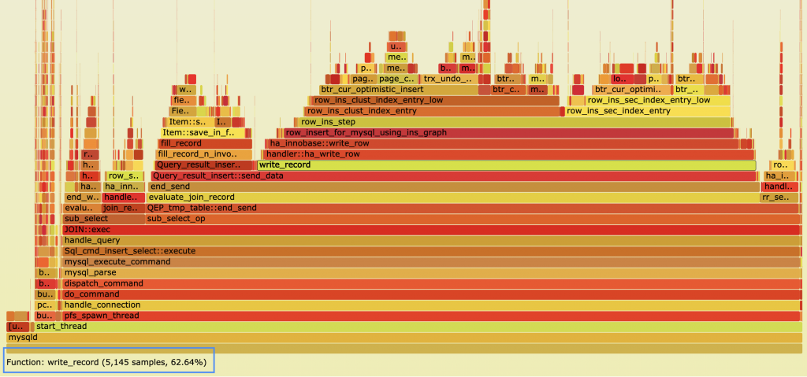
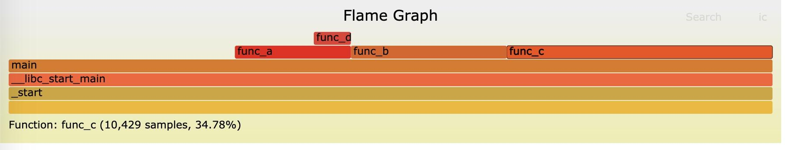
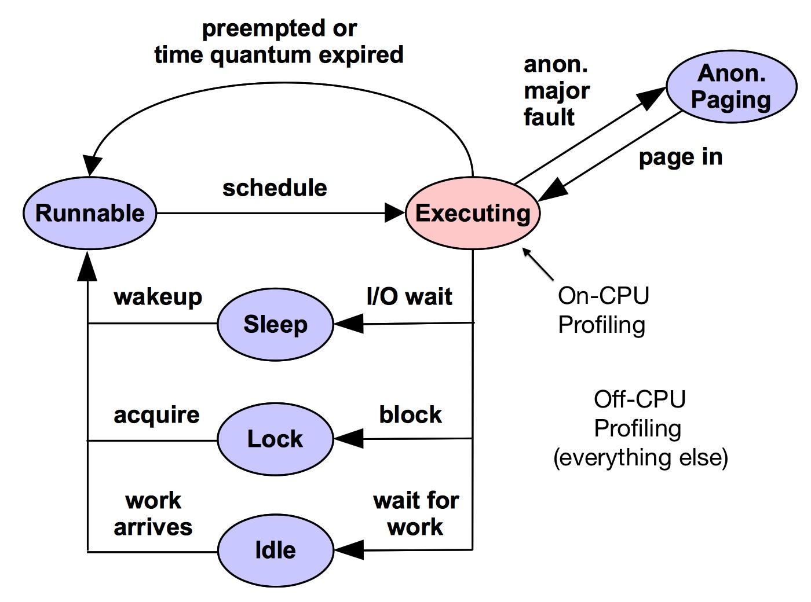
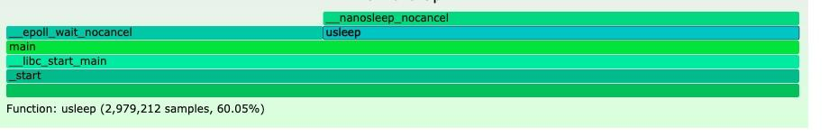

做过性能分析的同学一定听说过`火焰图（flame graph）`，这篇文章我们来详细看看火焰图是什么、火焰图生成的原理，以及on cpu 和 off cpu 火焰图的区别。

## 火焰图是什么

火焰图是由 Linux 性能分析权威 Brendan Gregg 发明的，火焰图看起来像一个跳动的火苗，这也是其名字的由来。火焰都起源于火焰根部，火苗根部到尖部可以想象为一个调用栈。

进程对 CPU 的使用分为两大类：

- On CPU：线程获取到 CPU 时间片执行。
- Off CPU：线程释放 CPU 执行权，花时间在等 I/O、锁、定时器、paging/swapping 等待。

下面是一个 MySQL 的 On CPU 火焰图：



该怎么样来看这个火焰图呢？

- X 轴表示抽样数，每一个方框都是一个调用函数，方框越宽，表示这个函数在抽样过程中被抽样到的次数越多，可以理解为执行的时间越久。

- Y 轴表示函数调用栈，上一层函数是下一层函数的子调用，最顶部的函数是 CPU 正在执行的操作。


## On CPU 火焰图

接下来我们来看看 On CPU 火焰图是如何生成的。待测试的代码如下：

```c
#include <pthread.h>


void func_d() {
    for (int i = 5 * 10000; i--;);
}

void func_a() {
    for (int i = 10 * 10000; i--;);
    func_d();
}

void func_b() {
    for (int i = 20 * 10000; i--;);
}

void func_c() {
    for (int i = 35 * 10000; i--;);
}

int main(void) {
    while (1) {
        for (int i = 30 * 10000; i--;);
        func_a();
        func_b();
        func_c();
    }
    return 0;
}
```

编译运行这个程序：

```powershell
$ gcc -std=c99 flame_test.c; 
$ ./a.out
```

OpenResty 的作者章亦春在他的 openresty-systemtap-toolkit 工具集中提供了一个 sample-bt 脚本。这个脚本其实就是对 systemtap 的一个封装，这个脚本根据不同的参数值，生成了不同的 systemtap 脚本，然后调用 systemtap 执行这个脚本：

```powershell
sudo ./sample-bt -p `pidof a.out` -t 30 -u > tmp.bt
```

这个脚本参数的含义是，-p 指定跟踪的进程号，`-t 30` 表示采集的时间为 30s，-u 表示只采集 user space 的数据，采集的结果输出到 tmp.bt 文件中。

这个脚本运行 30s 以后会自动退出，在生成的 tmp.bt 文件中，我们可以看到 systemtap 采集的数据其实是堆栈数据和对应堆栈出现的次数。

```powershell
$ cat tmp.bt

 0x400561 : func_c+0x15/0x1b [/home/ya/dev/linux_study/process/flamegraph/a.out]
 0x4005a2 : main+0x3b/0x49 [/home/ya/dev/linux_study/process/flamegraph/a.out]
 0x7ffff7a2f505 : __libc_start_main+0xf5/0x1c0 [/usr/lib64/libc-2.17.so]
 0x400429 : _start+0x29/0x30 [/home/ya/dev/linux_study/process/flamegraph/a.out]
    8282
    
 0x40057a : main+0x13/0x49 [/home/ya/dev/linux_study/process/flamegraph/a.out]
 0x7ffff7a2f505 : __libc_start_main+0xf5/0x1c0 [/usr/lib64/libc-2.17.so]
 0x400429 : _start+0x29/0x30 [/home/ya/dev/linux_study/process/flamegraph/a.out]
    6227
...
```

接下来我们使用 Brendan Gregg 提供的 FlameGraph 工具集中的 stackcollapse-stap.pl 折叠上面的堆栈信息。

```powershell
git clone https://github.com/brendangregg/FlameGraph
cd  FlameGraph

./stackcollapse-stap.pl tmp.bt > stap_unfolded.out
```

这个所说的“折叠”其实就是把上面堆栈信息简化，stap_unfolded.out 文件的内容如下：

```powershell
$ cat stap_unfolded.out
_start;__libc_start_main;main 8878
_start;__libc_start_main;main;func_a 3097
_start;__libc_start_main;main;func_a;func_d 1457
_start;__libc_start_main;main;func_b 6122
_start;__libc_start_main;main;func_c 10429
```

从这个文件，我们就知道相应的堆栈信息和调用次数了。

接下来，还有一步是用 flamegraph.pl 工具将前面生成的折叠信息生成为一个 svg 图。

```powershell
./flamegraph.pl stap_unfolded.out > stap-out.svg
```

生成的 svg 图如下：



把鼠标循环在 main 函数上，可以看到 main 函数在 30s 采用时间内共被采样了 29983 次，占比 100%。把鼠标悬浮在对应的函数上，可以看到 main、func_a、func_b、func_c、func_d 的采样次数和比例，其中：

- main: 100%
- func_a: 15.19%
- func_b: 20.42% 
- func_c: 34.78%
- func_d: 4.86%

这与实际代码中的循环次数比例能完全对应上。

sample-bt 工具还提供了一个贴心的 -d 参数可以将生成的 systemtap 脚本打印出来。

```c
global bts;
global quit = 0;

probe timer.profile {
    if (pid() == target()) {
        if (!quit) {
            bts[ubacktrace()] <<< 1;
        } else {
            foreach (bt in bts- limit 1024) {
                print_ustack(bt);
                printf("\t%d\n", @count(bts[bt]));
            }
            exit()
        }
    }
}

probe timer.s(30) {
    nstacks = 0
    foreach (bt in bts limit 1) {
        nstacks++
    }

    if (nstacks == 0) {
        warn("No backtraces found. Quitting now...\n")
        exit()
    } else {
        warn("Time's up. Quitting now...(it may take a while)\n")
        quit = 1
    }
}
```

接下我们来详细介绍一下这个脚本的原理。

timer.profile 是每个 CPU 上周期触发的定时器，我们可以通过一个实验看看它触发的频率。

```c
global stick, ptick

probe timer.profile { 
    ptick++ 
}
probe timer.s(1) {
    stick++
    printf("%d\n", ptick/stick)
}
```

使用 stap 运行上面的脚本，输出结果如下：

```powershell
sudo stap timer.stp

2000
2000
1999
1999
2000
1999
```

可以看到在我双核的虚拟机上，timer.profile 触发的频率是每秒 2000 次左右，每个核 1000 次左右，可以看到这个采样的频率还是挺高的。我们刚提到总采样次数是 29983 次，这是因为我们这是一个单线程程序，只跑在一个核心上，采样时间是 30s，所以总采样次数是 30 * 1000 = 30000 次左右。

在每次采样里，systemtap 使用 bts 记录当前的用户堆栈信息。

```c
bts[ubacktrace()] <<< 1;
```

其中 ubacktrace() 是 systemtap 的内置函数，表示了 CPU 上当前运行的函数堆栈，它的返回值是一个 16 进制的字符串地址，可以通过这个地址获取到完整的 CPU 上运行的函数堆栈。

`<<<` 是 systemtap 的语法，用来做 aggregate 统计，它使用「<<< value」运算来把一个 value 加到这个集合里。以下面的脚本为例：

```c
map["foo"] <<< 10
map["foo"] <<< 12
map["foo"] <<< 5
```

执行完上面的三行语句以后，map 集合里存储的数据可以理解为下面这样：

```c
map["foo"] = listof(10, 12, 5)
```

接下来就可以对这个列表的数据做聚合运算，计算次数、求和、最大值、最小值、平均值等。

```c
global map
probe begin {
    map["foo"] <<< 10
    map["foo"] <<< 12
    map["foo"] <<< 5
    printf("count: %d\n", @count(map["foo"]))
    printf("sum  : %d\n", @sum(map["foo"]))
    printf("min  : %d\n", @min(map["foo"]))
    printf("max  : %d\n", @max(map["foo"]))
    printf("avg  : %d\n", @avg(map["foo"]))
}
```

运行上面的脚本，输出结果如下：

```powershell
$ sudo stap aggre.stap

count: 3
sum  : 27
min  : 5
max  : 12
avg  : 9
```

因此 `bts[ubacktrace()] <<< 1` 的含义是采样中获取当前的堆栈，将该堆栈的集合中增加一个元素 1，这样在结束采样时，就可以通过 `@count(bts[bt]) `计算对应堆栈的次数了。


`probe timer.s(30)` 是一个定时器，30s 触发一次，30s 定时器到达时，将 quit 变量设置为 1，timer.profile 在 quit 为 1 的情况下，会遍历 bts 关联数组，打印所有的堆栈信息以及对应堆栈出现的次数。

`foreach (bt in bts- limit 1024)` bts 后面的负号表示降序遍历，采样次数多的输出在最前面。

至此，我们对火焰图的生成原理就非常清楚了，总结起来，火焰图的生成就分为三步：

- 采集数据（systemtap 等）
- 折叠堆栈
- 生成火焰图 svg

除了 systemtap 工具，还可以使用 perf 等其它工具生成火焰图，这些工具与 systemtap 不同之处在于如何采集数据。

使用 perf 生成火焰图的过程如下：

```powershell
perf record -F 99 -a -g -- sleep 30
perf script | ./stackcollapse-perf.pl > out.perf-folded
./flamegraph.pl out.perf-folded > perf-out.svg
```

这里我们展开介绍，感兴趣的同学自己动手试一下。


## Off CPU 火焰图

前面我们介绍的是 On CPU 火焰图，程序的性能只看 On CPU 的函数调用是远远不够的，有时候程序的性能瓶颈可能在 Off CPU 的操作上，比如：

- 拿不到 mutex 锁，花了大量的时间在等锁；
- 等待 IO、网络事件完成；
- 内存不足，直接回收内存（Direct Reclaim）；
- 进程因为被抢占、时间片用完被调度出 CPU 的时间过长；
- 等待内存 Page in、swap in；
- ……

Brendan Gregg 的博客中有一个图很清楚的 On CPU 和 Off CPU 的一些场景，如下所示：



图中蓝色的部分都是 Off CPU 的范畴，红色是 On Cpu 的范畴。

接下来我们用实际的代码来进行测试：

```c
#include <sys/epoll.h>
#include <stdio.h>
#include <pthread.h>
#include <unistd.h>

#define MAX_EVENT 10

int main() {
    int ep_fd;
    ep_fd = epoll_create(MAX_EVENT);
    struct epoll_event events[MAX_EVENT];
    int ready;
    while (1) {
        ready = epoll_wait(ep_fd, events, MAX_EVENT, 20); // 阻塞 20ms，超时后返回
        usleep(30 * 1000); // 睡眠 30ms ，超时后返回
    }
    close(ep_fd);
    return 0;
}
```

这段代码在 while 死循环中使用 epoll 做超时控制，epoll_wait 没有事件触发的情况下，每 20ms 返回一次。接下来调用 usleep 睡眠 30ms。

同样我们可以用 systemtap 来生成 Off CPU 的 profile 数据，章亦春的 openresty-systemtap-toolkit 中有一个名为 sample-bt-off-cpu 的脚本，生成火焰图的过程如下：

```powershell
sudo ./sample-bt-off-cpu -p `pidof a.out` -t 5 -u > tmp.bt

./stackcollapse-stap.pl tmp.bt > stap_unfolded.out
./flamegraph.pl stap_unfolded.out > stap-off-cpu.svg
```

生成的 svg 图如下所示：





可以看到 usleep 函数占比是 60%，epoll_wait 占比是 40%，对应 epoll 和 sleep 阻塞和睡眠的时间比例。

接下来我们来看 sample-bt-off-cpu 生成 Off CPU 火焰图的原理，同之前一样，它也是用 systemtap 采集数据。sample-bt-off-cpu 有一个 `-d` 参数可以输出 systemtap 的脚本。

```c
global bts
global start_time

global quit = 0;
global found

probe begin {
    warn(sprintf("Tracing %d", target()))
}

probe scheduler.cpu_off {
    if (pid() == target()) {
        if (!quit) {
            // 记录线程失去 CPU 的时间点
            start_time[tid()] = gettimeofday_us()
        } else {
            // 遍历 bts 数组，打印线程堆栈和耗时总和
            foreach (bt in bts- limit 1024) {
                print_ustack(bt)
                printf("\t%d\n", @sum(bts[bt]))
            }
            exit()
        }
    }
}

probe scheduler.cpu_on {
    if (pid() == target() && !quit) {
        t = tid()

        begin = start_time[t]
        // 如果在 cpu_off 中没有记录过，则不处理
        if (begin > 0) {
            // 计算线程从失去 CPU 到获取到 CPU 中所花费的时间
            elapsed = gettimeofday_us() - begin
            // 忽略小于 4us 的切换
            if (elapsed >= 4) {
                // 将时间差追加到对应堆栈的集合列表中
                bts[ubacktrace()] <<< elapsed 
                found = 1
            }
            // 重置 start_time
            delete start_time[t]
        }
    }
}

probe timer.s(5) {
    if (!found) {
        warn("No backtraces found. Quitting now...\n")
        exit()
    } else {
        warn("Time's up. Quitting now...(it may take a while)\n")
        quit = 1
    }
}
```

可以看到 sample-bt-off-cpu 就是利用了 cpu_on 和 cpu_off 的事件。

在 scheduler.cpu_off 事件中，也就是线程失去 cpu 的时候，使用 start_time 关联数组记录这个线程失去 cpu 的时间点。然后在这个线程再次获取 cpu 时，根据当前的时间，就可以知道这个线程 off cpu 的时间是多长了。通过 ubacktrace() 还可以获取到用户空间的堆栈信息。

`probe timer.s(5)` 表示设置一个 5s 的定时器，在定时器时间到时，将 quit 设置为 1，退出整个采集过程。

至此，我们就搞清楚了 off cpu 火焰图采集的底层原理。

