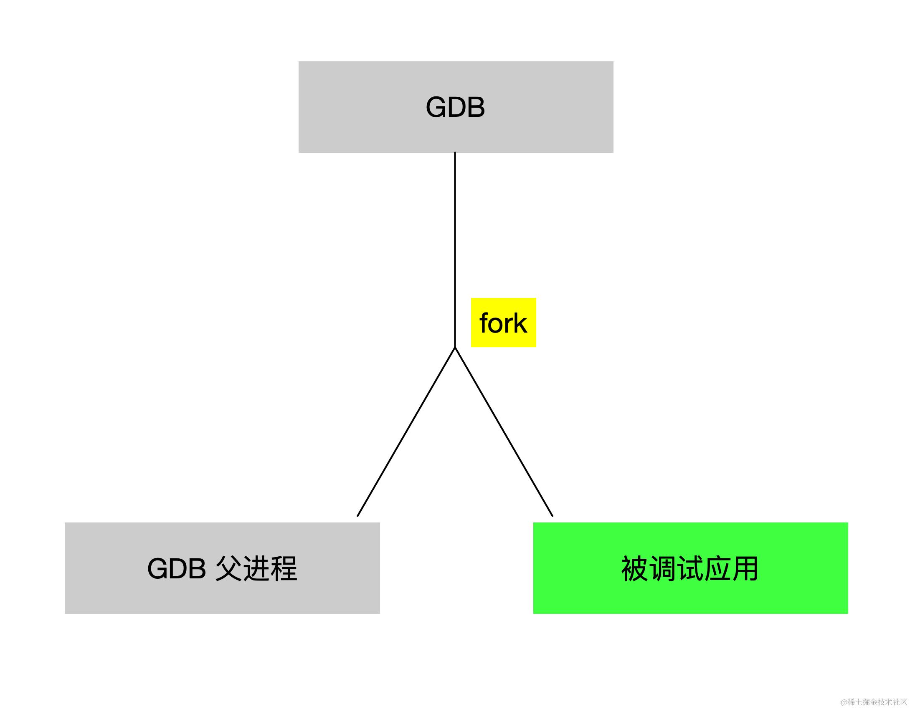
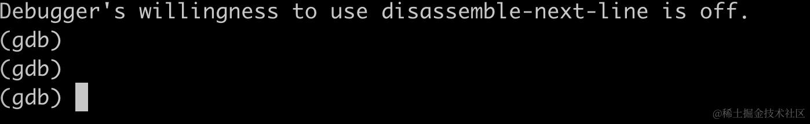
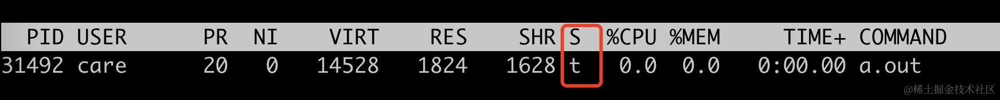
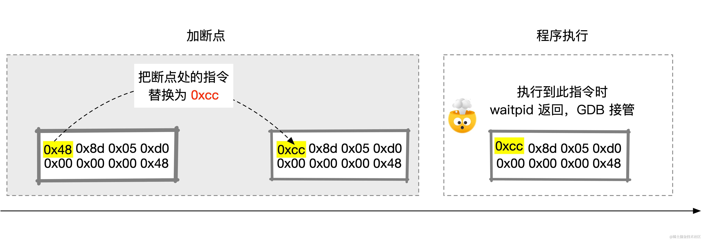
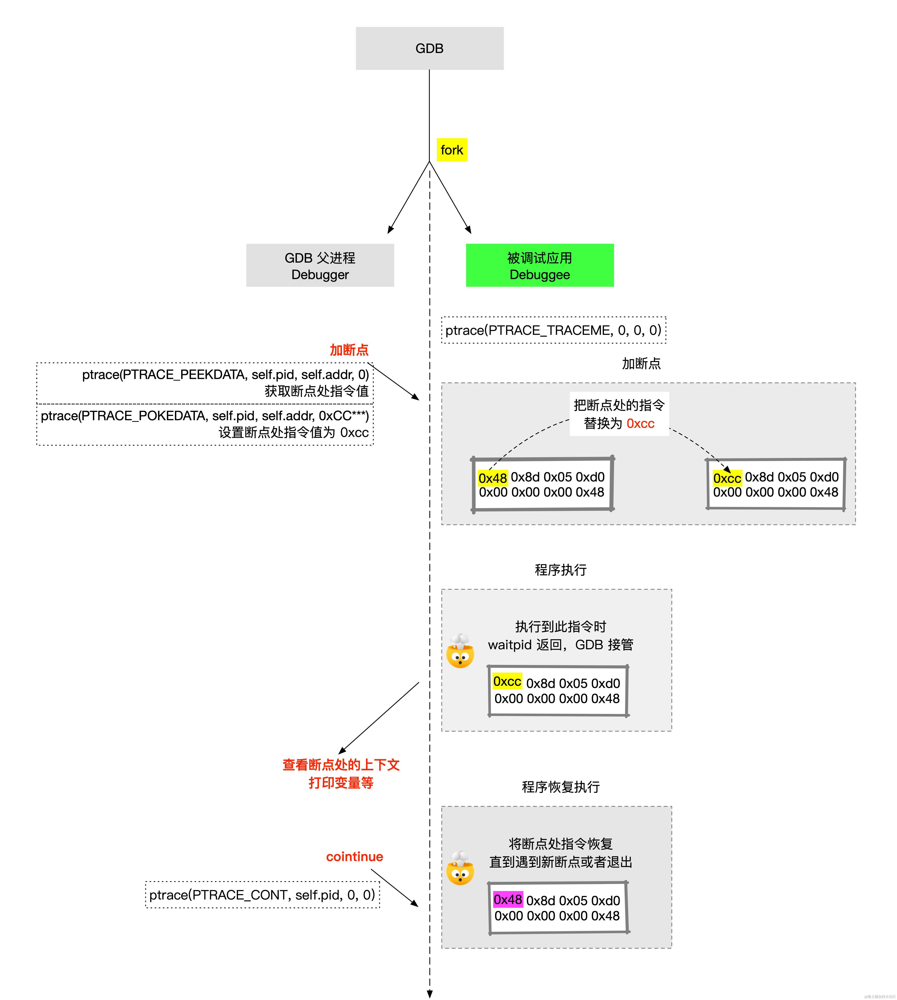
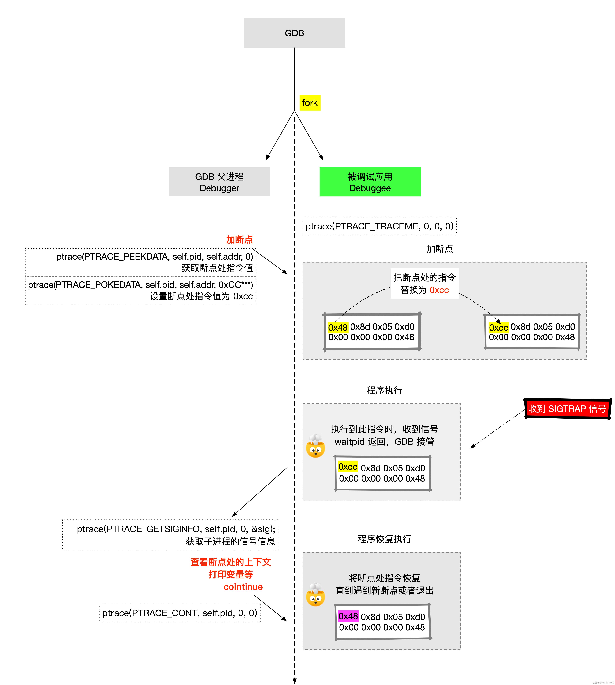
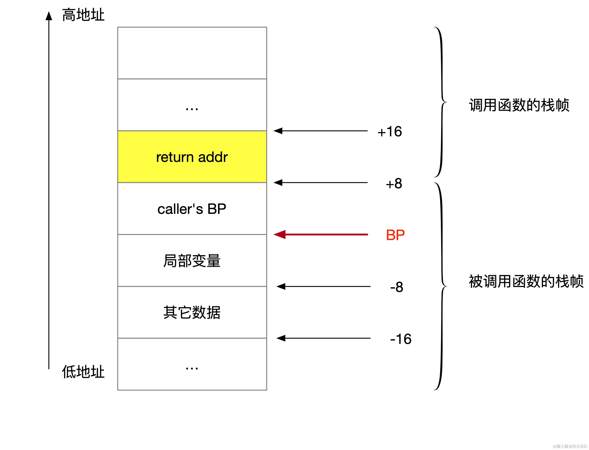

可能很多人用过 GDB 或者 go 工具库中的 delve，但它们底层是通过什么来实现的可能很少有人去研究，这个小节带大家深入研究一下 GDB 的底层实现原理。


## 进程关系

当我们用 GDB 启动一个程序时，实际上这里面涉及两个进程，一个是 GDB 进程，一个是被调试的进程。



gdb fork 一个新进程以后调用 exec 系列函数将新程序加载到进程的地址空间，替换 GDB 父进程的栈、数据段等。

伪代码如下：

```rust
let prog = "/path/to/app";

let pid = fork();
    
if pid == 0 {
    println!("in child");
    execv(prog, argv);
} else {
    println!("in GDB process, start debug {}", pid);
}
```

那 GDB 是如何设置断点，又是如何控制被调试进程按照 GDB 的要求进行单步等调试的呢？

为了理解这一点，首先要先学习一个新的系统调用 ptrace。


## ptrace 系统调用

ptrace 的函数原型如下：

```c
long ptrace(enum __ptrace_request request, pid_t pid, void *addr, void *data);
```

1.  **request**：一个枚举值，指定 `ptrace` 要执行的操作。常见的操作包括 `PTRACE_TRACEME`（让调用进程被父进程跟踪），`PTRACE_PEEKTEXT`、`PTRACE_PEEKDATA`（读取进程的内存），`PTRACE_POKETEXT`、`PTRACE_POKEDATA`（修改进程的内存），`PTRACE_CONT`（继续执行被跟踪的进程），待会会详细介绍这些操作类型。
2.  **pid**：被跟踪的目标进程的进程标识符（PID）。
3.  **addr**：这个参数一般是地址值，指示要读取或写入的进程内存地址。
4.  **data**：根据 `request` 的类型，这个参数可能用于提供数据，例如写入目标进程的内存，或者用于接收某些类型的输出。

前面介绍过，gdb 会 fork 一个新进程来执行被调试应用，接下来在子进程中，需要调用 ptrace(PTRACE\_TRACEME) 来允许 GDB 调试它。

```rust
let prog = "/path/to/app";

let pid = fork();
    
if pid == 0 {
    println!("in child");
    ptrace(PTRACE_TRACEME, 0, 0, 0); // 新增此调用
    execv(prog, argv);
} else {
    println!("in GDB process, start debug {}", pid);
}
```

这样在 GDB 的进程中，就可以通过 waitpid 来等待子进程加载完成。

```rust
let prog = "/path/to/app";

let pid = fork();
    
if pid == 0 {
    println!("in child");
    ptrace(PTRACE_TRACEME, 0, 0, 0); // 新增此调用
    execv(prog, argv);
} else {
    println!("in GDB process, start debug {}", pid);
    let mut status = 0;
    waitpid(pid, &mut status, 0);
}
```

接下 GDB 父进程要做到事情，就是启动一个可交互的命令行，类似于下面这样：



可以通过这个交互式命令行设置断点、continue 执行、退出等。这个不用我们实现，不同语言下有不同的实现，比如 C/C++ 下有大名鼎鼎的 [linenoise](https://github.com/antirez/linenoise) 。

```rust
let prog = "/path/to/app";

let pid = fork();
    
if pid == 0 {
    println!("in child");
    ptrace(PTRACE_TRACEME, 0, 0, 0); // 新增此调用
    execv(prog, argv);
} else {
    println!("in GDB process, start debug {}", pid);
    let mut status = 0;
    waitpid(pid, &mut status, 0);
    loop {
        let line = line_noise.readline("(gdb) ")
        match line {
            "exit" | "quit" => {
                break;
            }
            _ => {
                handle_command(line);
            }
        }
    }
}
```

如果用 ps 或者 top 去看此时的子进程，会发现它处于 `t` 状态。



可以在 `handle_command` 中模拟处理一下 GDB 的 continue。

GDB 的 continue 实际上只是简单地调用了一下 `ptrace(PTRACE_CONT)`，通知子进程继续跑，直到遇到断点。

```rust
pub fn handle_command(&mut self, line: &str) {
    if line == "c" {
        ptrace(PTRACE_CONT, self.pid, 0, 0);
    }
}
```


## GDB 断点到底是什么

X86 系列处理器从第一代就提供了一条专门用来支持调试的指令 `INT 3`，这条指令使得我们可以在感兴趣的地方插入一条 `INT 3` 指令，使子进程执行到这条指令时停下来，让当前进程可以接受调试，对调试断点处进行各种分析，这便是断点的本质。

值得注意的是系统对 INT 3 指令有特殊处理，给它分配了一个单字节机器码 0xCC。

加断点不是直接在断点处直接插入 0xCC，而是把断点直接替换为 `0xCC`，同时在 GDB 中记录替换前的指令值是什么，在断点 disable 或者被删掉时，将断点处的内存值恢复回来。



为了能获取特定地址处的指令值，需要用到 `ptrace(PTRACE_PEEKDATA)`，对应的设置特定地址处的指令值，需要用到 `ptrace(PTRACE_POKEDATA)`。

对应的伪代码如下：

```rust
pub struct BreakPoint {
    pub pid: pid_t,
    pub addr: u64,
    pub saved_data: u8,
}

pub fn enable(&mut self) {
    // 获取 addr 处的指令值    
    let data = ptrace(PTRACE_PEEKDATA, self.pid, self.addr, 0);
    // 取第一个字节
    self.saved_data = (data & 0xff_u64) as u8;

    // 设置第一个字节设置为 0xcc(int3)
    let replaced_data = (data & (!0xff_u64)) | 0xcc; 
    ptrace(PTRACE_POKEDATA, self.pid, self.addr, replaced_data);
}


pub fn disable(&mut self) {
    // 获取 addr 处的指令值  
    let data = ptrace(PTRACE_PEEKDATA, self.pid, self.addr, 0);
    // 把指令恢复为原本的值
    let replaced_data = (data & !0xff) | self.saved_data as u64;
    ptrace(PTRACE_POKEDATA, self.pid, self.addr, replaced_data);
}
```

这个过程如下图所示：




## DWARF

在加断点时，我们一般是针对函数名或者函数行加断点，比如在 main 函数加断点，而不是手动计算出对应的内存地址。

```powershell
(gdb) b main
Breakpoint 1 at 0x619: file main.c, line 3.
```

GDB 在单步执行时，会输出当前正在执行哪一行。

```powershell
(gdb) n
hello, world1
4	    printf("hello, world2\n");
```

对于 GDB 而言，它打交道是是内存地址，它需要一个二进制与源代码直接的桥梁，这个桥梁便是调试符号信息。

DWARF 是一种调试信息格式，被 GCC 在内的很多编译器采用，GCC 把 DWARF 信息直接内置到 ELF 文件格式中。DWARF 名字看起来比较奇怪，据说是 Debugging With Attributed Record Formats 的缩写（没被官方证实）。

通过 dwarfdump 可以查看一个 ELF 文件的 dwarf 信息：

```powershell
$ dwarfdump a.out

.debug_info

// 这部分描述了整个编译单元的信息，对应 main.c 源文件
DW_TAG_compile_unit
    DW_AT_producer              GNU C17 11.1.0 -mtune=generic -march=x86-64 -g -fasynchronous-unwind-tables -fstack-protector-strong
    DW_AT_language              DW_LANG_C99
    DW_AT_name                  main.c
    DW_AT_comp_dir              /data/dev/ya/
    DW_AT_low_pc                0x00000615
    DW_AT_high_pc               <offset-from-lowpc>86

// 这部分描述了一个子程序（在这里是 main 函数）的调试信息                    
DW_TAG_subprogram
  DW_AT_name                  main
  DW_AT_decl_file             0x00000001 /data/dev/ya/rgdb/main.c
  DW_AT_low_pc                0x00000615
  DW_AT_high_pc               <offset-from-lowpc>86

// 这部分显示的是源代码行号信息。每一行代表源代码中的一个位置，与执行的机器指令相对应。
.debug_line: line number info for a single cu
0x00000615  [   2,12] NS uri: "/data/dev/ya/main.c"
0x00000619  [   3, 5] NS
0x00000628  [   4, 5] NS
0x00000637  [   5, 5] NS
0x00000646  [   6, 5] NS
0x00000655  [   7, 5] NS
0x00000664  [   8,12] NS
0x00000669  [   9, 1] NS
0x0000066b  [   9, 1] NS ET  
```

通过 DWARF 可以获取下面这些信息：

*   编译的基本信息，比如用什么编译器、编译选项、编程语言、源文件、编译时的目录等。
*   函数和行号信息，函数的调试信息，包括函数对应的机器指令在内存中的起始和结束位置、函数声明在源文件中的位置。
*   变量和数据结构的调试信息：查看程序中变量和数据结构的定义。

有了 DWARF 的加持，GDB 就可以轻松地获取丰富的源代码级别的上下文信息，比如局部变量、当前正在执行的代码行等。

除了内置到 ELF 文件中，DWARF 文件也可以单独存储，这对于减少可执行文件二进制文件、代码保密有一点作用，真正需要的时候再把调试关联起来即可。


## SIGTRAP 信号

前面我们提到，GDB 父进程会使用 waitpid 来等待自己子进程返回，在 ptrace 调试中，当执行到 `INT 3` 指令（遇到设置的断点）时，子进程会收到一个 SIGTRAP 信号，这样 GDB 父进程就可以从 waitpid 返回，接管控制权。

```rust
pub fn wait_for_signal(&self) {
    println!("start wait for signal....");
    let mut status = 0;
    waitpid(self.pid, &mut status, 0);
    let sig : siginfo_t;
    // 获取子进程的信号信息
    ptrace(PTRACE_GETSIGINFO, self.pid, 0, &sig);
    match sig.si_signo {
        SIGTRAP => {
            println!("got SIGTRAP");
            // ... handle SIGTRAP
        }
        _ => {
            println!("got signal: {}", sig.si_code);
        }
    }
    println!("end  wait for signal....");
}
```

过程如下图所示：




## 单步调试的原理

ptrace 提供了针对于单条汇编指令的单步运行：

```rust
ptrace(PTRACE_SINGLESTEP, self.pid, 0, 0); 
```

因为一行源代码对应的汇编可能有很多条，为了类似实现 GDB 的单行调试功能，那么我们可以结合 dwarf 信息，找到这一行对应的开始指令地址和解释指令地址，一直单步执行直到遇到的汇编指令对应的代码行与当前代码行不相等为止，示例伪代码如下（不考虑函数调用的情况）：

```rust
// 获取当前执行的指令地址
let offset_pc = self.get_offset_pc();

// 获取当前指令地址对应的源码行位置
let old_loc = self.source_for_pc(offset_pc);

loop {
    // 一直单步执行
    self.single_step();
    // 获取当前指令地址对应的源码行位置
    let loc = self.source_for_pc(self.get_offset_pc());;
    // 如果当前执行的源码行与之前的不相等，则说明当前代码行已经执行完了
    if loc != old_loc {
        break;
    }
}
```

## 跳出当前函数

在 GDB 中我们可以使用 finish 跳出当前被调试的函数，实现原理也非常简单：

*   获取当前函数的 return 地址；
*   在 return 地址上打断点；
*   continue 继续执行，直到遇到断点。

那怎么获取函数的 return 地址呢？在 x86-64 体系下，RBP 指向栈帧的底部，向上获取返回地址，向下获取函数的局部变量。



这样我们在当前栈帧的返回地址处加一个断点，就可以实现跳出当前函数的功能。

伪代码如下：

```rust
fn step_out(&mut self) {
    let fp = get_reg(self.pid, &Reg::RBP);
    // 读取 RBP+8 处的值，也就是返回地址
    let return_addr = self.read_memory(fp + 8);
    // 在返回地址处加断点
    self.set_breakpoint(return_addr);
    // continue
    self.continue_execution()?;
}
```

## 调试正在运行的程序

前面我们介绍都是 GDB 启动一个程序，很多时候我们是去 attach 一个正在运行的程序，ptrace 提供了 PTRACE\_ATTACH 类型的请求，让我们可以动态地调试一个正在运行的程序，其它与前面介绍的内容一致，这里就不展开了。

至此，我们就把 GDB 调试的底层原理基本上介绍完了。
