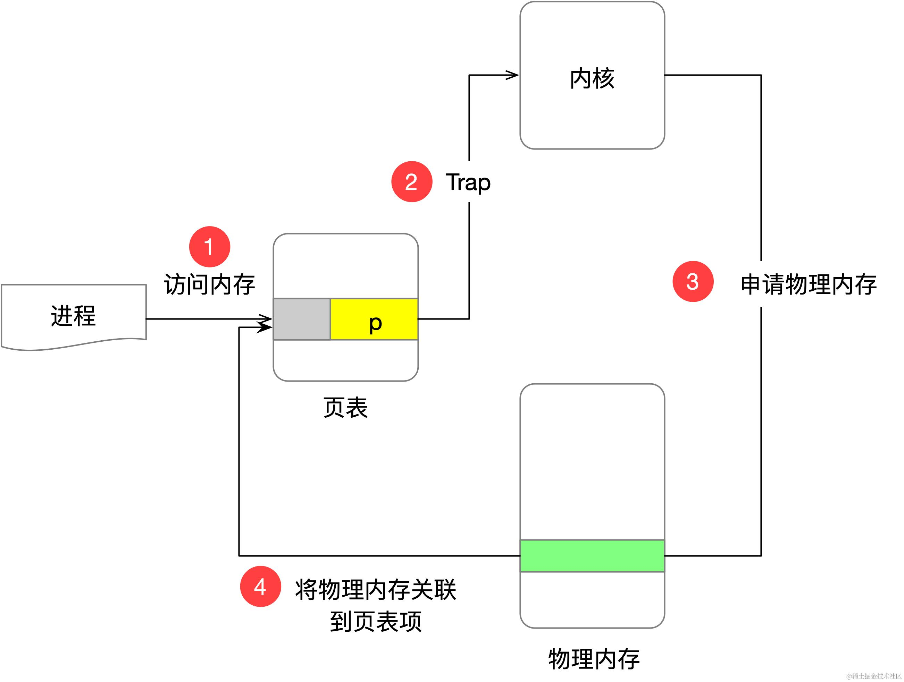
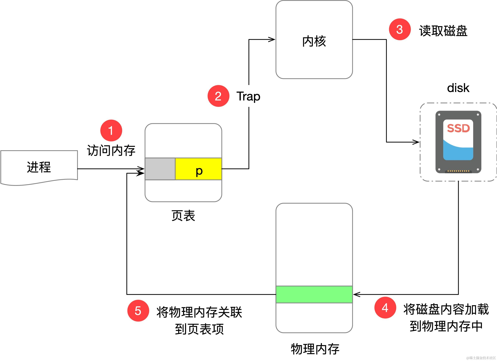

当进程访问一个虚拟内存地址时，通过页表来查找物理内存地址，但是对应的物理内存可能没有分配，这种情况下 CPU 就会触发一个缺页中断（page fault），根据 page fault 发生的原因，可以分为下面这几种。

*   Minor page fault：表示 page table 存在，但是对应的 page table entry 没有分配实际的物理内存或者 page table entry 还没有创建。Linux 默认情况下在内存申请时只会分配虚拟地址空间，在真正写入的时候才会真正触发 Minor page fault。

*   Major page fault：表示此次 page fault 伴随磁盘 IO 读取行为。比如在有文件背景的内存页被写回到磁盘再次被读取时就会触发  Major page fault
*   Invalid page fault：表示进程写入一个非法的地址空间或者内存区域的权限不对，比如尝试写只读的 TEXT 段。这种情况下的一个特殊场景是 copy-on-write 的场景，此时不属于非法情况。

接下来我们要用 systemtap 来进行测试，脚本如下：

```c

#! /usr/bin/env stap
global fault_begin_time // 记录 pagefault 发生的时间
global fault_address    // 记录 pagefault 发生的地址
global fault_access     // 记录 pagefault 是不是 write access

probe begin { printf("pagefault probe begin...\n") }

probe vm.pagefault {
  if (pid() == target() || ppid() == target()) {
      fault_begin_time = gettimeofday_s()
      // address 表示发生 pagefault 时的地址
      fault_address = address 
      // write_access 表示这次 pagefault 是不是一次 write access, 1 表示 write，0 表示 read
      fault_access = write_access
  } 
} 
function vm_fault_str(fault_type: long) {
    if(vm_fault_contains(fault_type, VM_FAULT_OOM))
        return "OOM";
    else if(vm_fault_contains(fault_type, VM_FAULT_SIGBUS))
        return "SIGBUS";
    else if(vm_fault_contains(fault_type, VM_FAULT_MINOR))
        return "MINOR";
    else if(vm_fault_contains(fault_type, VM_FAULT_MAJOR))
        return "MAJOR";
    else if(vm_fault_contains(fault_type, VM_FAULT_NOPAGE))
        return "NOPAGE";
    else if(vm_fault_contains(fault_type, VM_FAULT_LOCKED))
        return "LOCKED";
    else if(vm_fault_contains(fault_type, VM_FAULT_ERROR))
        return "ERROR";
    return "???";
} 
                
probe vm.pagefault.return {
  if (pid() == target() || ppid() == target()) {
    printf("[%s] pid:%d, address:%p access:%s, type:%s\n",
          ctime(fault_begin_time), // time
          pid(),                              // pid
          fault_address,           // address
          fault_access ? "w" : "r",// write、read access
          vm_fault_str(fault_type)          // minor、major
    )
  }
}
```

## 情况 1：Region valid, but page not allocated

这种情况是最常见的，当进程尝试想向一个虚拟地址写数据但是这块虚拟内存还没映射物理内存。

以下面的测试代码为例：

```c
#include <stdio.h>
#include <stdlib.h>

int main() {
    getchar();
    char *p = malloc(1024);
    printf("p: %p\n", p);
    p[0] = 1;
    return 0;
}
```

编译运行这个程序，使用 systemtap 运行。

```powershell
$ sudo stap pagefault.stp -x `pidof a.out`
```

然后输入 enter，上面的程序会打印 p 指针的值。

```powershell
p: 0x602010
```

然后 systemtap 中输出的结果如下：

```powershell
pagefault probe begin...
...
[Sun Dec 20 08:38:02 2020] pid:21073, address:0x602008 access:w, type:MINOR
...
```

可以看到此时的 page fault 产生的原因是写入了一个合法的虚拟内存，这个虚拟内存未分配物理内存，类型为 minor，不涉及文件操作。

这个过程如下图所示：



## 场景 2：匿名内存被交换到 swap 分区，读取时触发

我们来用一个实验来有验证，实验结果要求开启 swap 分区功能。

```powershell
sudo swapon -a
```

测试代码如下：

```c
#include <stdio.h>
#include <stdlib.h>

int main() {
    char *p = calloc(256 * 1024 * 1024, sizeof(char));
    printf("p: %p\n", p);
    getchar();
    printf("get char %d", p[0]);
    return 0;
}
```

运行结果如下：

```powershell
$ ./a.out                                                                                                                     
p: 0x7fffe7a0c010
```

这段代码运行后申请分配 256M 物理内存，虚拟内存的其实地址为 0x7fffe7a0c010，此时使用 top 命令查看，a.out 进程占用的内存大小为 256M，如下所示：

```powershell
  PID USER      PR  NI    VIRT    RES    SHR S  %CPU %MEM     TIME+
30741 ya        20   0  260.1m 256.4m   0.3m S   0.0 14.0   0:00.03
```

此时开启另外一个狂占内存的程序，这里使用 `tail /dev/zero` 来实现。

```powershell
$ tail /dev/zero
```

此时 top 命令 RES 显示 a.out 大部分内存已经被挤出去了，只剩下 100k 左右。

```powershell
$ top -p `pidof a.out`

  PID USER      PR  NI    VIRT    RES    SHR S  %CPU %MEM     TIME+
30741 ya        20   0  260.1m   0.1m   0.0m S   0.0  0.0   0:00.03
```

此时在 a.out 的命令行中输入任意字符，让其访问被 swap 到 swap 分区的内存，观察 systemtap 的输出中 0x7fffe7a0c010 地址的 pagefault 信息。

```powershell
pagefault probe begin...
...
[Sun Dec 20 09:21:12 2020] pid:518, address:0x7fffe7a0c010 access:r, type:MINOR
...
```

可以看到读取被 swap 到 swap 分区内存也会造成 pagefault。

与此类似的还有有文件背景的内存页被写入到磁盘，需要读取的时候。


## 场景 3：文件背景内存被写回到磁盘，再次读取

实验前提是生成一个大文件，这里使用 dd 生成一个 512M 的文件 dd.out。

```powershell
$ dd if=/dev/zero of=/home/ya/dd.out bs=4096 count=$((1024*128))
```

测试代码如下：

```c
#include <sys/mman.h>
#include <stdlib.h>
#include <fcntl.h>
#include <stdio.h>
#define SRC_FILE_PATH "/home/ya/dd.out"

#define MAP_SIZE 512  * 1024 * 1024

int main(int argc, char **argv) {
    char *m;
    int fd = open(SRC_FILE_PATH, O_RDWR, S_IRUSR);
    m = mmap(0, MAP_SIZE, PROT_READ | PROT_WRITE, MAP_SHARED, fd, 0);
    printf("m: %p\n", m);
    int i;
    int j;
    for (i = 0; i < MAP_SIZE; ++i) {
        j += m[i];
    }

    printf("j=%d\n", j);

    getchar();
    printf("m[0]=%d\n", m[0]);
    getchar();
    munmap(m, MAP_SIZE);
    close(fd);
}
```

运行上面的程序会占用 512M 的内存。

```powershell
$ top -p `pidof a.out`

  PID USER      PR  NI    VIRT    RES    SHR S  %CPU %MEM     TIME+
 3033 ya        20   0  516.1m 512.4m 512.3m S   0.0 27.9   0:01.66
```

此时运行 tail 消耗内存，这个操作会将 a.out 占用的 512M 内存挤出去内存，写回到文件，通过 top 可以看到此时内存占用只有 100 多 k。

```powershell
$ top -p `pidof a.out`

  PID USER      PR  NI    VIRT    RES    SHR S  %CPU %MEM     TIME+
 3033 ya        20   0  516.1m   0.1m   0.0m S   0.0  0.0   0:01.66

```

接下来在 a.out 的命令行中输入任意字符，让程序继续执行，读取 m\[0]，观察此时的 systemtap 输出：

```powershell
pagefault probe begin...
...
[Sun Dec 20 09:40:00 2020] pid:2882, address:0x7fffd7a0d000 access:r, type:MAJOR
[Sun Dec 20 09:40:00 2020] pid:2882, address:0x7fffd7a0d000 access:r, type:MINOR
...
```

可以看到此时因为涉及到从文件中重新读取文件，触发了 major page fault。

这个过程如下图所示：



## 场景 4：对只读页表项进行写操作

这里分为两种场景，如果页表项是 COW，则会复制一份然后将其标记位可写。如果确实是对只读的页表非法写入，则会触发 segmentfault 段错误。

我们先来看读只读段写入的场景，有两个 C 文件 `const_test.c` 和 `page_fault_04.c`。

```c
// const_test.c
const int i = 100;

// page_fault_04.c
#include <stdio.h>
#include <errno.h>
#include <signal.h>

extern int i;

int main() {
    printf("%p\n", &i);
    getchar();
    i = 101;
    return 0;
}
```

编译运行上面的软件：

```powershell
$ gcc -g const_test.c page_fault_04.c
$ ./a.out
```

需要注意的是，之前的 systemtap 脚本不能试用段错误类型的 invalid page fault，可以通过注入内核函数 `bad_area*()` 来实现。完整的 systemtap 脚本如下：

```c
probe begin {
    printf("probe begin\n");
}

probe kernel.function("bad_area*") {
    if (pid() == target()) {
        printf("%s pid: %d error_code: %d addr: %p\n", probefunc(), pid(), $error_code, $address)
        print_backtrace()
    }
 }
```

在 a.out 的命令行中输入 enter，让代码继续往下，尝试对只读的 i 赋值，systemtap 的输出如下：

```powershell
probe begin
bad_area_access_error pid: 24409 error_code: 7 addr: 0x400640
 0xffffffff8169d49c : bad_area_access_error+0x0/0x4a [kernel]
 0xffffffff816b02e5 : do_page_fault+0x35/0x90 [kernel]
 0xffffffff816ac508 : page_fault+0x28/0x30 [kernel]
 0x7ffff7fea740
```

可以看到在地址为 0x400640 的 p 指针处触发了 page\_fault，造成了 SIGSEGV 段错误。

## 场景 5：Copy-on-write 造成的 page fault

测试的代码如下：

```c
#include <unistd.h>
#include <stdio.h>
#include <string.h>
#include <stdlib.h>

int main(int argc, char *argv[]) {
    printf("in main, pid=%d\n", getpid());

    char *c = calloc(100, sizeof(char));
    int pid;
    pid = fork();

    if (pid == 0) {
        getchar();
        printf("modify c in child process\n");
        c[0] = 100;
        printf("c in child: %p\n", c);
        sleep(10000);
    } else {
        sleep(10000);
        printf("x in parent: %p\n", c);
    }
}
```

这段代码的逻辑是在 fork 生成的子进程中修改只读的 COW 内存区域。

systemtap 的结果如下：

```powershell
[Mon Dec 21 13:18:23 2020] pid:7057, address:0x602010 access:w, type:MINOR
```

   

