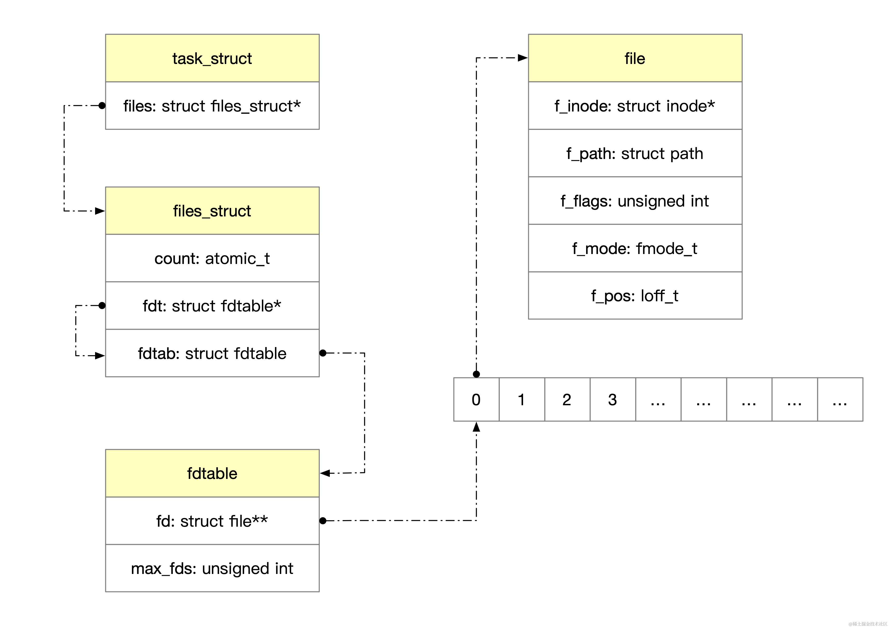
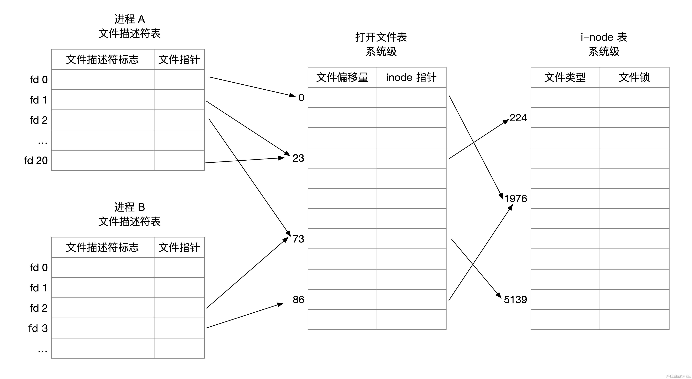
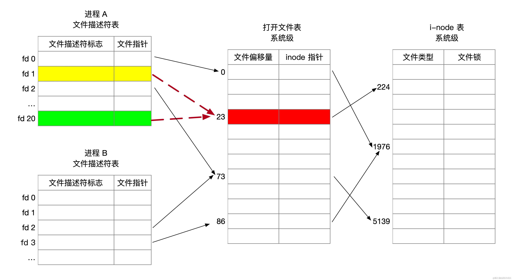
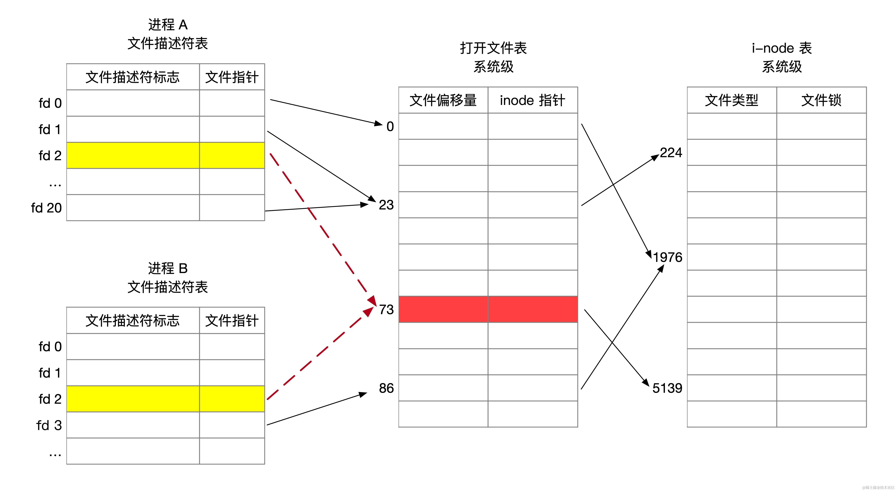
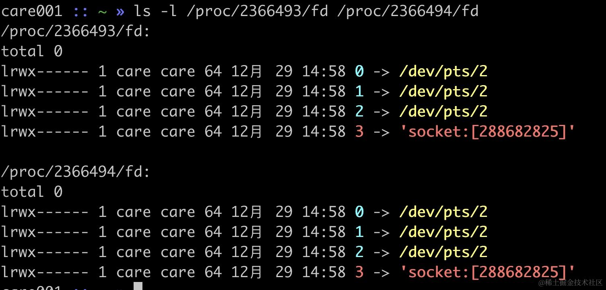

在 linux 中所有的文件操作都是通过文件描述符（fd）来实现的，接下来我们就来介绍相关的知识。

### 文件描述符 fd（File Descriptor）是什么？

文件描述符 fd 是一个非负整数，用来标识一个打开的文件，由内核负责生成。每个进程都有一个文件描述符表，用于跟踪打开的文件，fd 是进程私有的，不同的进程中使用同样的文件描述符不会指向同一个文件。

那如何获得一个 fd 呢？在 C/C++ 语言中使用 open 函数打开一个文件时，系统就会为了分配一个进程级的 fd，示例代码如下：

```cpp
string file_name = "/tmp/test.txt";
int fd = open(file_name.c_str(), O_RDWR);
if (fd == -1) {
    // 打开文件失败
    std::cout << "open failed: " << file_name << std::endl;
} else {
    // 可以使用此 fd 进行文件读写
    cout << "file fd: " << fd << endl;
}
```

这里的 open 最终会调用 open 系统调用，函数原型如下

```c
#include <fcntl.h>

int open(const char *pathname, int flags);
int open(const char *pathname, int flags, mode_t mode);
```

其中，pathname 参数指定要打开的文件的路径，`flags` 参数指定打开文件的方式，比如`O_RDWR+O_CREAT` 表示以读写方式打开文件，文件不存在则创建。`mode` 参数指定文件的访问权限，比如可以使用 `0644` 表示 `rw-r--r--` 权限。

不知道有没有人好奇过，文件描述符 fd 到底是如何分配的，是直接递增吗？那如果是递增，fd 有最大值吗？

## 文件描述符分配机制

Linux 文件描述符分配遵循「最小未使用原则」。也就是说，在分配一个新的文件描述符时，系统会选择最小的未被使用的整数作为新描述符。接下来我们将通过内核源码来解释这一过程。

在 Linux 内核中，分配文件描述符的函数为 \_\_alloc\_fd()，位于 `fs/file.c` 文件中。该函数的关键步骤如下：

```c
/*
 * allocate a file descriptor, mark it busy.
 */
int __alloc_fd(struct files_struct *files,
	       unsigned start, unsigned end, unsigned flags)
{
	unsigned int fd;
	int error;
	struct fdtable *fdt;

	spin_lock(&files->file_lock); // 自旋锁来实现互斥上锁
repeat:
    // 获取进程的文件描述符表
	fdt = files_fdtable(files);
    // 将 fd 设置为 start 和 files->next_fd 中的较大值。
	fd = start;
	if (fd < files->next_fd)
		fd = files->next_fd;
    // 如果 fd 小于 fdt->max_fds，则调用 find_next_fd() 函数在文件描述符表中查找下一个空闲的文件描述符。
	if (fd < fdt->max_fds)
		fd = find_next_fd(fdt, fd); // 通过位图找到未使用的文件描述符

	/*
	 * N.B. For clone tasks sharing a files structure, this test
	 * will limit the total number of files that can be opened.
	 */
	error = -EMFILE;
    // 如果找到的文件描述符大于等于 end，说明没有可用的文件描述符，设置错误为 EMFILE，然后跳转到 out 标签。
	if (fd >= end)
		goto out;
		
    // 扩展进程的文件描述符表，以确保能够容纳新的文件描述符
	error = expand_files(files, fd);
    // 如果 start 小于等于 files->next_fd，则更新 files->next_fd 为 fd + 1。
	if (start <= files->next_fd)
		files->next_fd = fd + 1;
    // set_bit 设置位图，将找到的空闲文件描述符标记为已用
	__set_open_fd(fd, fdt);
	error = fd;

out:
	spin_unlock(&files->file_lock);
	return error;
}


static unsigned int find_next_fd(struct fdtable *fdt, unsigned int start)
{
	unsigned int maxfd = fdt->max_fds;
	unsigned int maxbit = maxfd / BITS_PER_LONG;
	unsigned int bitbit = start / BITS_PER_LONG;

	bitbit = find_next_zero_bit(fdt->full_fds_bits, maxbit, bitbit) * BITS_PER_LONG;
	if (bitbit > maxfd)
		return maxfd;
	if (bitbit > start)
		start = bitbit;
	return find_next_zero_bit(fdt->open_fds, maxfd, start);
}
```

`find_next_zero_bit` 用于查找位图中第一个值为 0 的位，这个位置对应的索引即为最小的可用文件描述符。通过使用位图，Linux的文件描述符分配机制能够以一种高效且可靠的方式实现最小未使用原则。

## 内核层表示

通过 fd 是一个非负整数这个结论，你应该也可以大概猜得到，fd 只是一个马甲，并不是文件在内核中真正的表现形态。进程可以打开多个文件，这些文件需要被记录和维护，linux 的每个进程都创建了一个打开文件表，用来表示进程打开的文件列表信息。进程是资源的封装单位，文件也是一种资源，自然也不例外。

进程结构体 `task_struct` 中有一个类型为 `files_struct` 的指针 `files`，用来追踪进程打开的文件。代码如下：

```c
struct task_struct {
	/* Open file information: */
	struct files_struct		*files;
}
```

`files_struct` 结构代码如下：

```c
/*
 * Open file table structure
 */
struct files_struct {

	atomic_t count; // 表示进程打开的文件数量

	struct fdtable *fdt; // 指向文件描述符表
  	struct fdtable fdtab;

	// 只有少量文件打开的情况下，用这个结构体中数组即可，不用再分配内存
	struct file * fd_array[NR_OPEN_DEFAULT]; 
};
```

可以看到 `files_struct` 结构体有两个 `fdtable` 相关的字段 fdt 和 fdtab，这是因为内核在这里做了一个特殊的优化，一般而言一个进程打开的文件不会太多，在初始情况下，fdt 指针就指向当前结构体中的 fdtab。当当前进程打开的文件数量超过 `fdtab.max_fds` 时，就会发生类似数组扩容的动作，重新申请一个更大的数组，将当前的数组的内容拷贝到新数组中，fdt 指针也就不在指向 fdtab 了，而是指向新的更大容量的 fdtable。

`fdtable` 结构体用来封装管理 `struct file` 结构体，本质就是一个数组 len 和动态分配数组的首地址。

```c
struct fdtable {
	unsigned int max_fds; // 数组大小
	struct file **fd;      // 指针数组
};
```

`file` 结构体表示一个打开的文件，文件的信息都包含在这个结构体里，比如文件路径、文件打开标记（只读、只写等）、文件读写 offset、文件对应的 inode。

```c
struct file {
	struct path		f_path; // 文件路径
	struct inode		*f_inode;	// inode
	const struct file_operations	*f_op;

	atomic_long_t		f_count;
	unsigned int 		f_flags;
	fmode_t			f_mode;
	struct mutex		f_pos_lock;
	loff_t			f_pos; // 文件偏移量
}
```

它们几者之间的关系如下图所示。



## 内核中关于文件的三个数据结构

在内核中，与文件描述符相关的三个主要数据结构分别是：

*   文件描述符表（进程级）：这是每个进程所拥有的数据结构，用于维护进程中打开的所有文件描述符。每个 fd 在这个表中都有一个对应的条目，指向更底层的文件表示结构。

*   打开文件列表（系统级）：这是一个全系统范围内的数据结构，用于跟踪所有已打开的文件。当一个文件被打开时，不管它被打开了多少次，系统级的列表中都有一个对应的条目。这个列表包含了文件的当前状态，如文件指针的位置和访问模式。

*   i-node 表（系统级）：这是文件系统级别的数据结构，包含了文件系统中所有文件的 inode。inode 是一个存储文件元数据的数据结构，例如文件的大小、权限、所有者以及文件数据所在的位置。每个文件或目录在文件系统中都有一个唯一的 inode。

这里我们借用《Linux/UNIX 系统编程手册》这本书中的这张图来介绍这三个数据结构的区别



先开看进程 A，它的 1 号 fd 和 20 号 fd 指向了打开文件表（系统级）的同一项。



这种情况一个可能原因是进程 A 调用 dup/dup2 使得新的 fd 指向了同一个打开文件表项。

```c
#include <unistd.h>
#include <sys/file.h>

int main() {
    // stdout_fd = 3
    int stdout_fd = open("/tmp/output.log", O_RDWR|O_CREAT|O_APPEND, 0600);
    // err_fd = 4
    int err_fd = open("/tmp/error.log", O_RDWR|O_CREAT|O_APPEND, 0600);
    // dup(3, 1)，将 1 号 fd 指向 3 号 fd 指向的打开文件表项
    dup2(stdout_fd, STDOUT_FILENO);
    // dup(4, 2)，将 2 号 fd 指向 4 号 fd 指向的打开文件表项
    dup2(err_fd, STDERR_FILENO);
    sleep(1000);
    return 0;
}
```

对应的 fd 信息如下

```powershell
$ ls -l /proc/`pidof a.out`/fd
total 0
lrwx------ 1 care care 64 1月  12 22:48 0 -> /dev/pts/0
lrwx------ 1 care care 64 1月  12 22:48 1 -> /tmp/output.log
lrwx------ 1 care care 64 1月  12 22:48 2 -> /tmp/error.log
lrwx------ 1 care care 64 1月  12 22:48 3 -> /tmp/output.log
lrwx------ 1 care care 64 1月  12 22:48 4 -> /tmp/error.log
```

另外一个非常典型的场景是重定向，在使用 shell 时，我们经常会把标准输出、错误输出都保持同时到文件中，可以这样来写，以 sleep 命令为例

```powershell
sleep 1000 > sleep.log 2>&1
```

这样 shell 通过把标准错误（fd 为 2）重定向到了标准输出（fd 为 1），通过观察 sleep 进程打开的 fd 列表可以确认

```powershell
$ ls -l  /proc/`pidof sleep`/fd
total 0
lrwx------ 1 care care 64 1月  12 17:01 0 -> /dev/pts/1
l-wx------ 1 care care 64 1月  12 17:01 1 -> /data/dev/ya/sleep.log
l-wx------ 1 care care 64 1月  12 17:01 2 -> /data/dev/ya/sleep.log
```

它的底层实际上也是通过 dup2 系统调用来实现的，前面已经介绍过，这里不赘述。

再来看 A 进程的 2 号 fd 和 B 进程的 2 号 fd 都指向了同一个打开文件表项（标号为 73）



出现这一个情况典型的场景父进程打开了某文件，然后 fork 创建了子进程。

```cpp
const int PORT = 8080;
const int BACKLOG = 5;
using namespace std;

void bind_and_listen(int sockfd) {
    struct sockaddr_in server_addr;
    std::memset(&server_addr, 0, sizeof(server_addr));
    server_addr.sin_family = AF_INET;
    server_addr.sin_addr.s_addr = INADDR_ANY;
    server_addr.sin_port = htons(PORT);
    bind(sockfd, (struct sockaddr *) &server_addr, sizeof(server_addr));
    listen(sockfd, BACKLOG);
}

int main() {

    int sockfd = socket(AF_INET, SOCK_STREAM, 0);
    // 绑定地址和端口, 监听连接
    bind_and_listen(sockfd);
    pid_t pid;
    pid = fork();
    if (pid < 0) {
        std::cerr << "Failed to fork child" << std::endl;
        return 1;
    }
    cin.get();
}

```

代码运行后父进程会 fork 一个子进程，以监听套接字为例，这个子进程会继承监听套接字，两个进程指向同一个打开文件 struct file。



再来看，这里进程 A 的 0 号 fd 和进程 B 的 3 号 fd，指向了打开文件表（系统级）的不同项，但最后映射到了 i-node 表中的同一项。


出现这一情况的可能原因是，A 进程和 B 进程都 open 某一个文件。这情况下。

我们知道，对文件的 lseek、read、write 都会移动偏移量，如果不同的 fd 指向同一个打开文件表（系统级），则它们将共享文件的偏移量，也就是说一个 fd 的读写会影响第二个 fd 的偏移量。

## 小结

这篇文章介绍了文件描述符 fd 的本质是什么，文件描述符的分配遵循"最小未使用原则，需要你重点理解的是内核中与文件描述符相关的三个主要数据结构以及它们之间的关系:

*   文件描述符表(进程级):每个进程拥有,维护进程打开的所有fd
*   打开文件列表(系统级):跟踪系统中所有已打开文件,包含文件状态信息
*   i-node表(文件系统级):存储文件元数据,每个文件或目录对应一个唯一inode
