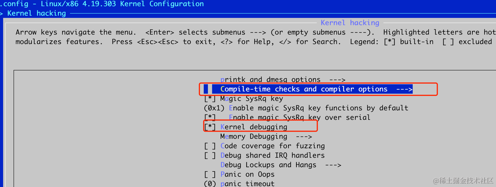
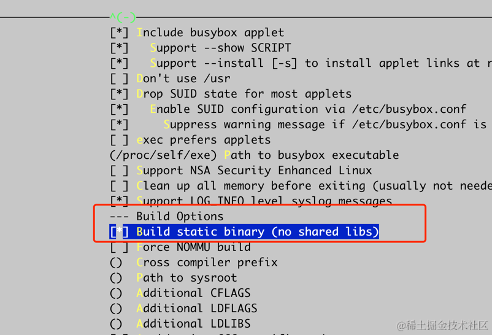
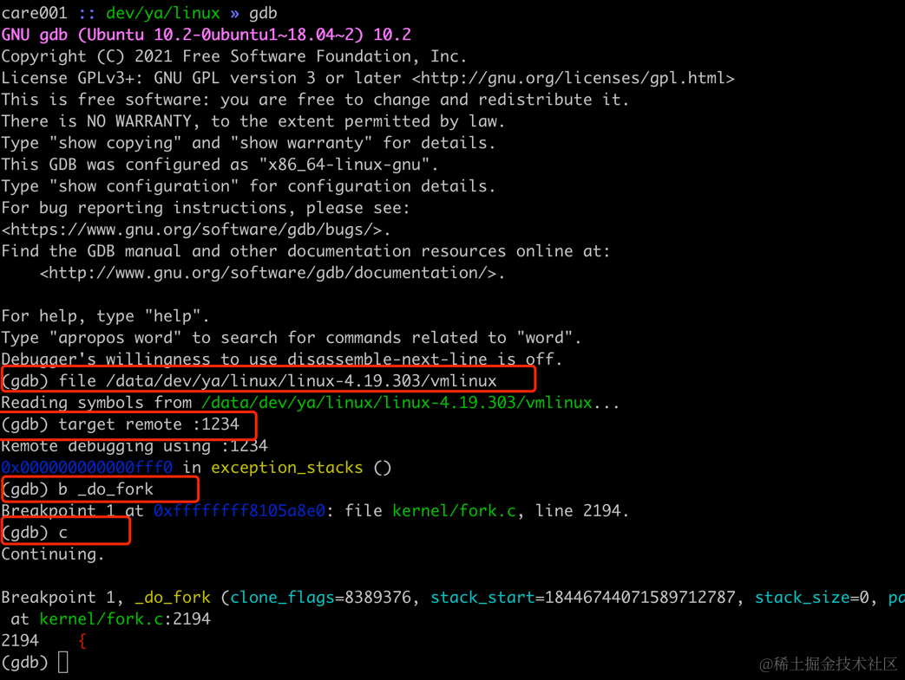
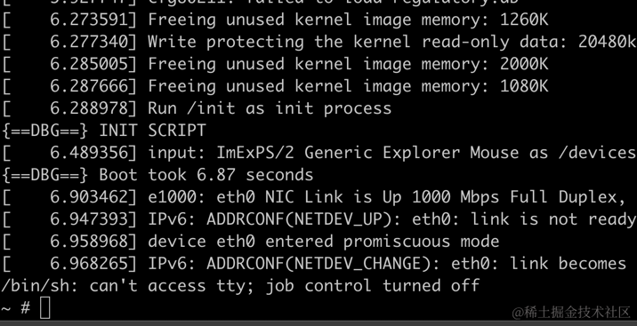
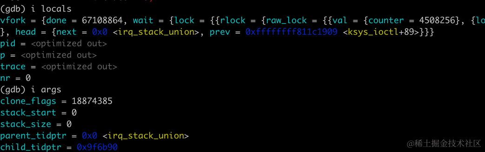
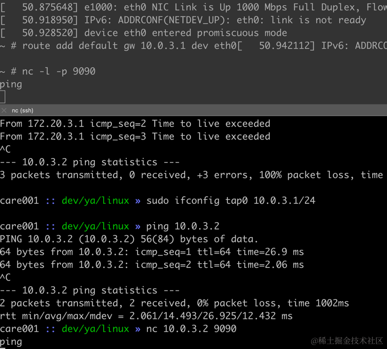
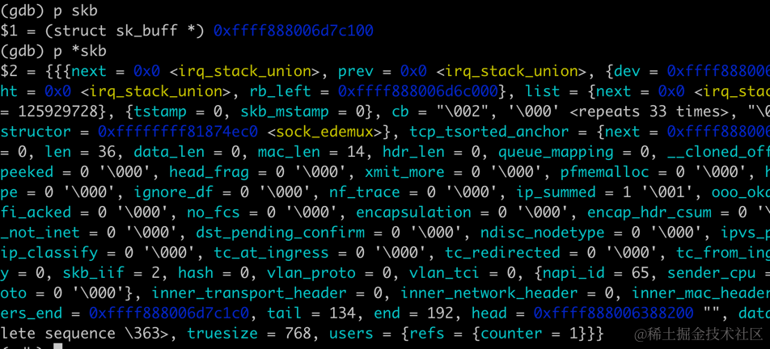

在阅读 linux 内核源码的过程中，我们经常希望能单步运行调试内核函数的运行，通过 systemtap 或者 bpf
等技术可以窥探到一些细节，但还是不如单步来得直接，这篇文章我们来看看 qemu + GDB 如何单步调试内核，当我们对进程管理、内存管理、文件系统的实现有什么困惑就可以动手
debug 一下，实践出真知。

QEMU (Quick Emulator) 是大神 Fabrice Bellard 开源的一款功能强大的开源虚拟化软件，可以在一台计算机上模拟运行另一个操作系统。它支持多种架构，包括
x86、ARM、MIPS、PowerPC 等，使得我们可以像调试应用进程一样调试 linux 内核程序。


## linux 内核编译

首先需要下载你感兴趣的 linux 版本内核源码，因为我们线上用的是 4.19 版本，这里我以 4.19 版本为例：

```powershell
wget https://cdn.kernel.org/pub/linux/kernel/v4.x/linux-4.19.303.tar.xz
tar -xvf linux-4.19.303.tar.xz
```

接下来需要执行 `make menuconfig` 做一些基础的内核编译配置。menuconfig 是一个基于文本的菜单驱动的配置工具，提供了一个类似于现代文件管理器的用户界面，它使用
ncurses 库在终端中渲染菜单和对话框。

```powershell
$ cd linux-4.19.30
$ make menuconfig
```



我们需要开启 `Compile the kernel with debug info`，同时关闭地址随机化，具体的配置路径如下：

```powershell
$ make menuconfig

Kernel hacking  ---> 
    [*] Kernel debugging
    Compile-time checks and compiler options  --->
        [*] Compile the kernel with debug info
        [*]   Provide GDB scripts for kernel debuggin
```


```powershell
Processor type and features ---->
    [] Randomize the address of the kernel image (KASLR)
```

接下来使用 make 命令进行编译（-j 可以指定使用多少核进行编译）， 安装过程可能缺少一些工具，比如`ncurses-dev`
等，可以根据你的需要安装。

```powershell
$ make -j8
```

等待一段时间，如果编译没有出错，就可以得到可启动的内核映像文件 `bzImage`。这是一个自解压的 gzip 压缩内核映像，可以直接从引导加载程序加载。

```powershell
$ ls -lh ./arch/x86/boot/bzImage
-rw-rw-r-- 1 care care 8.0M 4月   1 23:21 ./arch/x86/boot/bzImage
```

除了 bzImage，还有生成一个一个比较重要的文件 vmlinux，这是一个未压缩的内核镜像文件，包含了内核的所有代码的调试信息和符号表，后面
GDB 调试的时候需要用到。

```powershell
$ ls -lh vmlinux
-rwxrwxr-x 1 care care 241M 4月   1 23:21 vmlinux
```


## 构建 rootfs

有了 bzImage 和 vmlinux 内核的镜像，我们还需要构建一个 rootfs（根文件系统），因为内核只是提供了内存管理、进程调度等基本功能，单独的内核是无法运行的。

rootfs 是一个特殊的文件系统,包含了启动 Linux 系统所需的目录结构、配置文件、可执行程序和库文件等。它提供了根目录"/"
下的基本目录和文件。在 Linux 启动过程中，内核首先会挂载 rootfs 作为初始的根文件系统。之后，init 进程和其他用户空间进程就运行在这个 rootfs 上。rootfs 中包含了类似 /bin、/sbin、/etc、/lib 等关键目录，提供了 shell 命令、系统配置、动态链接库等，使得内核能够正常启动并与用户空间进程交互。

简单来说，内核只负责底层的资源管理和硬件控制，而 rootfs 则提供了操作系统的基本用户空间环境，两者相辅相成，缺一不可。这与 docker
构建镜像运行需要一个 rootfs，然后跑在不同的 linux 内核下本质是类似的。

rootfs 有很多可以选择的，这里我们选择构建速度快、体积小的 busybox。如内核一样，我们需要先去下载 busybox 文件，然后解压。

```powershell
wget https://busybox.net/downloads/busybox-1.36.1.tar.bz2
tar -xvf busybox-1.36.1.tar.bz2
```

接下来需要执行 `make menuconfig` 做一些基础的配置，勾选 Build static binary (no shared libs)：

```powershell
$ make menuconfig
-> Settings
　--- Build Options
　　[*] Build static binary (no shared libs)
```

如下图所示：



接下来执行 make 进行编译：

```powershell
make && make install  

```

构建后的文件在 \_install 目录中：

```powershell
$ cd _install

$ ls -lrht
total 13M
lrwxrwxrwx 1 care care   11 1月   3 10:42 linuxrc -> bin/busybox
drwxrwxr-x 2 care care 4.0K 1月   3 10:42 sbin
drwxrwxr-x 4 care care 4.0K 1月   3 10:42 usr
drwxrwxr-x 2 care care 4.0K 1月   5 22:31 sys
drwxrwxr-x 2 care care 4.0K 1月   5 22:31 proc
drwxrwxr-x 2 care care 4.0K 1月   5 22:31 dev
-rwxrwxr-x 1 care care  351 1月   9 17:01 init
drwxrwxr-x 2 care care 4.0K 1月   9 17:40 bin
```

接下来需要在这个目录新增一个 init 文件，同时设置为其添加可执行权限：

```powershell
$ touch init
$ chmod a+x init 
```

init 文件的内容如下：

```powershell
#!/bin/sh
echo "{==DBG==} INIT SCRIPT"
mkdir /tmp
mount -t proc none /proc
mount -t sysfs none /sys
mount -t debugfs none /sys/kernel/debug
mount -t tmpfs none /tmp
mdev -s
echo -e "{==DBG==} Boot took $(cut -d' ' -f1 /proc/uptime) seconds"
exec /bin/sh
```

后面我们如果有一些系统初始化的配置，比如网卡配置、路由配置、内核参数配置等可以放在这里执行，不用每次在终端中运行命令。

接下来就是制作 rootfs 镜像了，使用 cpio 命令将当前目录下的所有文件和子目录打包到一个名为 rootfs.img 的根文件系统镜像文件中。

```powershell
$ find . | cpio -o --format=newc > ./rootfs.img
```

至此，我们的内核镜像和 rootfs 镜像都制作完成，接下来就可以使用 qemu 来启动了。


## qemu 启动内核

qemu 可以采用自己编译或者通过 apt 等方式安装，具体过程这里不展开介绍，然后执行下面的命令：

```powershell
/path/to/qemu-system-x86_64 -s -S 
-kernel /path/to/linux-4.19.303/arch/x86/boot/bzImage 
-initrd /path/to/busybox-1.36.1/_install/rootfs.img 
-nographic -append "console=ttyS0" 
-net nic -net tap,ifname=tap0,script=no,downscript=no
```

其中：

*   \-s -S：这两个参数用于在启动后监听 1234 端口，同时暂停虚拟机，以便进行 GDB attach 调试。
*   \-kernel /path/to/linux-4.19.303/arch/x86/boot/bzImage：指定要加载的 Linux 内核镜像文件路径。
*   \-initrd /path/to/busybox-1.36.1/\_install/rootfs.img：指定要使用的初始 RAM 磁盘(initrd)文件，它包含了根文件系统(rootfs)。
*   \-nographic：禁用 QEMU 的图形输出，使其在终端中运行。
*   \-append "console=ttyS0"：将内核命令行参数设置为 console=ttyS0，这将把内核的控制台输出重定向到第一个串行端口(ttyS0)。
*   \-net nic：启用 QEMU 的网络设备模拟。
*   \-net tap,ifname=tap0,script=no,downscript=no：使用 TAP 网络接口，将虚拟机连接到主机的 tap0 网络接口。script=no 和
    downscript=no 表示不运行任何网络脚本。关于 tun/tap 设备可以查看我们这个小册对应的章节。

接下来就可以使用 gdb 来进行调试了，启动 gdb，在其中使用 `file /path/to/linux-4.19.303/vmlinux` 来指定 vmlinux
的路径，然后执行使用 `target remote :1234`命令 attach 到虚拟机的内核。



接下来执行 `continue`，让镜像运行起来，运行起来后就得到了一个可交互的终端 sh：



接下来可以尝试打一个断点，比如 `_do_fork`，然后在 sh 中执行任意命令都会触发这个断点。




## qemu 网络配置

如果想调试网络相关的功能，需要额外的配置。 

我们先使用 ip 命令查看一下当前的网卡列表、ip 地址：

```powershell
# ifconfig -a

eth0      Link encap:Ethernet  HWaddr 52:54:00:12:34:56
          BROADCAST MULTICAST  MTU:1500  Metric:1
          RX packets:0 errors:0 dropped:0 overruns:0 frame:0
          TX packets:0 errors:0 dropped:0 overruns:0 carrier:0
          collisions:0 txqueuelen:1000
          RX bytes:0 (0.0 B)  TX bytes:0 (0.0 B)

lo        Link encap:Local Loopback
          LOOPBACK  MTU:65536  Metric:1
          RX packets:0 errors:0 dropped:0 overruns:0 frame:0
          TX packets:0 errors:0 dropped:0 overruns:0 carrier:0
          collisions:0 txqueuelen:1000
          RX bytes:0 (0.0 B)  TX bytes:0 (0.0 B)
```

此时使用 ip route 应该没有任何路由存在：

```powershell
# ip route
```

我们先来给 eth0 网卡配置上 ip 地址，然后启用这个网卡：

```powershell
ifconfig eth0 10.0.3.2 netmask 255.255.255.0 promisc up
```

然后增加一个默认路由：

```powershell
route add default gw 10.0.3.1 dev eth0
```

此时的路由规则如下：

```powershell
# ip route
default via 10.0.3.1 dev eth0
10.0.3.0/24 dev eth0 scope link  src 10.0.3.2
```

此时在 qemu 中 ping 宿主机 ip 发现是不通的：

```powershell
# ping -c 1 -w 1 192.168.1.4
PING 192.168.1.4 (192.168.1.4): 56 data bytes

--- 192.168.1.4 ping statistics ---
1 packets transmitted, 0 packets received, 100% packet loss
```

因为我们还没有为 tap 设备配置对应的 ip，在宿主机上执行 ifconfig 为 tap0 配置 ip：

```powershell
$ sudo ifconfig tap0 10.0.3.1/24

$ ifconfig -a

enp0s31f6: flags=4163<UP,BROADCAST,RUNNING,MULTICAST>  mtu 1500
        inet 192.168.1.4  netmask 255.255.255.0  broadcast 192.168.1.255
        inet6 fe80::e2d5:5eff:fea2:1456  prefixlen 64  scopeid 0x20<link>
        ether e0:d5:5e:a2:14:56  txqueuelen 1000  (Ethernet)
        RX packets 173267342  bytes 28186941774 (28.1 GB)
        RX errors 0  dropped 28  overruns 0  frame 0
        TX packets 127523647  bytes 21249611666 (21.2 GB)
        TX errors 0  dropped 0 overruns 0  carrier 0  collisions 0
        device interrupt 16  memory 0xf7000000-f7020000
        
tap0: flags=4163<UP,BROADCAST,RUNNING,MULTICAST>  mtu 1500
        inet 10.0.3.1  netmask 255.255.255.0  broadcast 10.0.3.255
        ether 42:28:b3:9b:75:6d  txqueuelen 1000  (Ethernet)
        RX packets 5  bytes 386 (386.0 B)
        RX errors 0  dropped 14  overruns 0  frame 0
        TX packets 12  bytes 1132 (1.1 KB)
        TX errors 0  dropped 0 overruns 0  carrier 0  collisions 0
```

此时在 qemu 中 ping 192.168.1.4 就成功了。此时在宿主机访问 qemu 内的 ip 地址 10.0.3.2 也可以成功的，这是因为宿主机上也有相应的路由。

```powershell
» ip route
default via 192.168.1.1 dev enp0s31f6 proto dhcp src 192.168.1.4 metric 100
10.0.3.0/24 dev tap0 proto kernel scope link src 10.0.3.1
```

在 qemu 其中一个 tcp 服务器监听 9090 端口 `nc -l -p 9090`，在宿主机上执行 nc 与这个服务建立 tcp 连接，这样两个进程就可以通信了。

```powershell
$ nc 10.0.3.2 9090
```



我们可以在 tcp 流程中的任意感兴趣的函数上加断点，比如 `tcp_v4_rcv`：

```powershell
(gdb) b tcp_v4_rcv
Breakpoint 2 at 0xffffffff81893890: file net/ipv4/tcp_ipv4.c, line 1715.
```

随便在 nc 中发送一点数据，就可以在 GDB 中看到断点命中了，使用 bt 查看调用堆栈：


还可以打印相关的函数参数或者局部变量：



此时 qemu 内的程序还只能访问本机网络，不能访问外网：

```powershell
~ # ping -c 1 -w 1 8.8.8.8
PING 8.8.8.8 (8.8.8.8): 56 data bytes

--- 8.8.8.8 ping statistics ---
1 packets transmitted, 0 packets received, 100% packet loss
```

如果访问外网，则需要做 SNAT（源地址转换）：

```powershell
sudo iptables -t nat -A POSTROUTING -s 10.0.3.0/24 ! -o enp0s31f6 -j MASQUERADE
```

增加了这条 iptables 规则以后，请求还是失败，这是因为我们还需要增加 forward 默认允许策略为 ACCEPT：

```powershell
sudo iptables -P FORWARD ACCEPT
```

还需要启用 IP 转发功能，允许 Linux 系统将充当路由器，可以转发流经它的 IP 数据包：

```powershell
sudo sysctl -w net.ipv4.conf.all.forwarding=1
sudo sysctl -w net.ipv4.ip_forward=1
```

然后再次访问 8.8.8.8，则可以看到可以正常访问了。

```powershell
ping -c 1 -w 1 8.8.8.8
PING 8.8.8.8 (8.8.8.8): 56 data bytes
64 bytes from 8.8.8.8: seq=0 ttl=112 time=11.426 ms

--- 8.8.8.8 ping statistics ---
1 packets transmitted, 1 packets received, 0% packet loss
round-trip min/avg/max = 11.426/11.426/11.426 ms
```

此时抓包确认，确实从 qemu 中发出去的包，都经过了 SNAT，源 ip 从 10.0.3.2 变为了 192.168.1.4，从 enp0s31f6 网卡发出。等
enp0s31f6 收到回包以后再将包发送给 qemu 内部 10.0.3.2 ip。

```powershell
sudo tcpdump -i any icmp -nn

19:40:19.547334 IP 10.0.3.2 > 8.8.8.8: ICMP echo request, id 1060, seq 0, length 64
19:40:19.547356 IP 192.168.1.4 > 8.8.8.8: ICMP echo request, id 1060, seq 0, length 64

19:40:19.556451 IP 8.8.8.8 > 192.168.1.4: ICMP echo reply, id 1060, seq 0, length 64
19:40:19.556463 IP 8.8.8.8 > 10.0.3.2: ICMP echo reply, id 1060, seq 0, length 64
```

## 小结

这篇文章介绍了如何编译 linux 内核镜像、如何编译 busybox 生成 rootfs 镜像，然后重点介绍了 qemu 的 tap 网络配置。qemu
是一个功能非常丰富的软件，这里只是介绍了它功能的冰山一角，你可以基于这篇文章的实操去探索更多有意思的东西。
