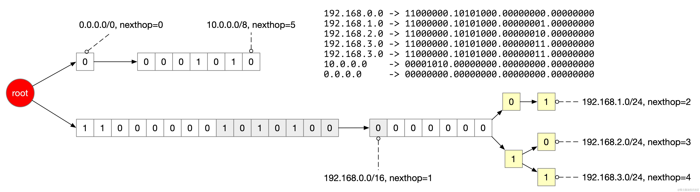

在Linux操作系统中，路由表是网络通信的核心部分，它决定了数据包如何从源地址转发到目的地址，可以称之为网络包的导航地图。

路由功能依赖于内核中的路由表， 路由表是一个数据结构,用于存储网络拓扑信息和路由规则。当一个数据包到达时,内核会查询路由表,根据目标地址和可用路由规则选择合适的下一跳,将数据包转发到正确的网络接口。

## 初识路由表

使用 route 命令可以很方便的查看 Linux 路由表，

```powershell
# route -n
Kernel IP routing table
Destination     Gateway         Genmask         Flags Metric Ref    Use Iface
0.0.0.0         172.16.250.1    0.0.0.0         UG    0      0        0 eth0
10.42.0.0       0.0.0.0         255.255.255.0   U     0      0        0 cni0
169.254.0.0     0.0.0.0         255.255.0.0     U     1002   0        0 eth0
172.16.250.0    0.0.0.0         255.255.255.0   U     0      0        0 eth0
```

除了 route 命令以外，强大的 iproute2 的工具集 `ip route`或者使用 `netstat -nr` 也可以查看路由表，这里展开。

以上面 route 的输出结果为例：

第一行路由

```powershell
Destination     Gateway         Genmask         Flags Metric Ref    Use Iface
0.0.0.0         172.16.250.1    0.0.0.0         UG    0      0        0 eth0
```

Destination 为 0.0.0.0 表示默认路由，所有未被其他路由匹配的数据包都将走这条路由。这里的 Gateway 172.16.250.1 是默认网关的IP地址。Flags UG 表示该路由生效(U)并且路由表项下一跳为网关(G)，Iface eth0 表示数据包将从eth0网卡出去。

第二行路由

```powershell
Destination     Gateway         Genmask         Flags Metric Ref    Use Iface
10.42.0.0       0.0.0.0         255.255.255.0   U     0      0        0 cni0
```

这行路由规则表示目标网段是 10.42.0.0/24 的数据包将命中这条路由，Iface cni0 表示数据包将从cni0网卡直接发送出去，这是一个直连路由，不需要经过任何网关（gateway 为全 0的值）。

第三行

```powershell
Destination     Gateway         Genmask         Flags Metric Ref    Use Iface
169.254.0.0     0.0.0.0         255.255.0.0     U     1002   0        0 eth0
```

这行路由表示，目标网段为 169.254.0.0/16 的数据包将命中这条路由，数据包将从eth0网卡出去，这也是一个直连路由，不需要经过任何网关。

第四行

```powershell
Destination     Gateway         Genmask         Flags Metric Ref    Use Iface
172.16.250.0    0.0.0.0         255.255.255.0   U     0      0        0 eth0
```

这行路由的意思是：目标网段为 172.16.250.0/24 的数据包会命中这条路由，
数据包将从eth0网卡出去，这也是一个直连路由，不需要经过任何网关。

## 路由选择过程

当数据包需要被发送到目的 IP 地址时,路由器会根据路由表中的信息进行决策,选择合适的下一跳地址。

路由器采用最长前缀匹配算法来确定应该使用哪个路由表项。具体来说,它会逐位比对目的IP地址与每个路由表项的网段前缀,选择与目的IP地址最长匹配的那个表项。如果有多个表项与目的IP地址等长匹配,则会随机挑选其中之一作为路由。

我们可以使用 `ip route get` 来查询特定的 ip 地址在当前 Linux 路由表中会选择哪一个路由表项。这个命令会输出被匹配的路由表项的详细信息,包括下一跳IP地址、出接口等,方便我们了解路由选择的具体过程。

这个命令非常有用，特别是在复杂的网络环境中，你想知道数据包将如何被转发，或者当你想验证你的路由设置是否正确。

基本语法如下：

```powershell
ip route get [目的地址]
```

例如下面的命令将显示数据包如何路由到 IP 地址 `8.8.8.8`。

```powershell
ip route get 8.8.8.8

8.8.8.8 via 192.168.31.1 dev enp0s31f6 src 192.168.31.197 uid 1000
```

这个输出的意思是：

*   `8.8.8.8`: 这是你查询的目的地址。
*   `via 192.168.31.1`: 表示数据包将通过网关（`192.168.31.1`） 进行转发，在这个例子中，这个 ip 是路由器的地址。
*   `dev enp0s31f6`: 表示数据包将从网络接口 `enp0s31f6` 发送。
*   `src 192.168.31.197`: 表示数据包的源 IP 地址将是 `192.168.31.197`。

## 路由的分类

根据配置方式和路由表的生成方式，路由可以分为下面这几类：

*   接口路由：在设置网络接口 IP 时自动生成的。当数据包的目的地址与接口 IP 所在网段匹配时,数据包就会通过该接口发送出去
*   静态路由：由程序自动或者管理员手动配置，适用于网络拓扑结构简单且稳定的小型网络环境。静态路由的缺点是无法自动适应网络拓扑的变化。后面我们会看到静态路由这种方式在 flannel host-gw 模式上的应用，使用 etcd 监听网络拓扑的变化实时修改静态路由信息
*   动态路由：依赖于路由协议自动发现并生成路由表，这里先不展开

## 路由在 Flannel host-gw 容器网络中的应用

Flannel 提供了三种常见的后端实现方式:VXLAN、UDP 和 host-gw。host-gw 是 Host Gateway 的缩写，host-gw 充分利用了路由机制,实现了跨主机容器之间的通信。

host-gw 这种方式不需要额外对网络包进行覆盖网络（overlay）常见的封包和解包操作,直接由 flannel 负责在主机上配置路由规则,将目标为其他主机上容器网段的流量直接路由到对应主机,性能基本无损耗，是性能最强的一种方案。但 host-gw 要求各主机之间必须二层连通,这对网络架构有一定要求。

下面这是一个 flannel host-gw 后端模式的一个真实的案例，有两台主机：

*   主机 1（198.19.249.136），被分配的容器网段为 172.17.100.0/24
*   主机 2（198.19.249.225），被分配的容器网段为 172.17.23.0/24

flannel 会监听 etcd 中的主机注册和下线。当主机新注册上来时，为主机分配一个唯一的网段，随后其他的所有的主机会添加对应的路由表。

主机 1 初始路由表如下（省略了部分）

```powershell
Destination     Gateway         Genmask         Flags Metric Ref    Use Iface
0.0.0.0         198.19.249.1    0.0.0.0         UG    100    0        0 eth0
```

当主机 1 的 flannel 启用以后，从 etcd 中分配一个唯一的网段（172.17.100.0/24），当容器 A 启动时通过 cni 分配一个唯一的 ip（172.17.100.2），此时会在主机 1 新增这样一个路由，

```powershell
Destination     Gateway         Genmask         Flags Metric Ref    Use Iface
0.0.0.0         198.19.249.1    0.0.0.0         UG    100    0        0 eth0
172.17.100.0    0.0.0.0         255.255.255.0   U     0      0        0 cni0
```

当主机 2 的 flannel 启用以后，从 etcd 中分配一个唯一的网段（172.17.23.0/24），当容器 B 启动时通过 cni 分配一个唯一的 ip（172.17.23.2），首先会在本机（主机 2）新增这样一个路由

```powershell
Destination     Gateway         Genmask         Flags Metric Ref    Use Iface
0.0.0.0         198.19.249.1    0.0.0.0         UG    100    0        0 eth0
172.17.23.0     0.0.0.0         255.255.255.0   U     0      0        0 cni0
```

又因为 flannel 会监听 etcd 的数据变化，主机 1 和主机 2 都会知悉这两个主机注册的消息，于是主机 1 在本机增加了与主机 2容器网段（172.17.23.0/24）的路由

```powershell
Destination     Gateway         Genmask         Flags Metric Ref    Use Iface
172.17.23.0     198.19.249.225  255.255.255.0   UG    0      0        0 eth0
```

在主机 2 那里，同样新增了主机 1 容器网段（172.17.100.0/24）的路由：

```powershell
Destination     Gateway         Genmask         Flags Metric Ref    Use Iface
172.17.100.0    198.19.249.136  255.255.255.0   UG    0      0        0 eth0
```

整体的路由通信过程如下所示：


## 路由表的内核层实现

Linux 系统中有三个默认的路由表 local、main 和 default，定义在 `include/uapi/linux/rtnetlink.h` 中

```c
enum rt_class_t {
	RT_TABLE_UNSPEC=0,
/* User defined values */
	RT_TABLE_COMPAT=252,
	RT_TABLE_DEFAULT=253,
	RT_TABLE_MAIN=254,
	RT_TABLE_LOCAL=255,
	RT_TABLE_MAX=0xFFFFFFFF
};
```

可以通过查看 `/etc/iproute2/rt_tables` 查看当前系统的路由表的 id

```powershell
» cat /etc/iproute2/rt_tables
#
# reserved values
#
255	local
254	main
253	default
0	unspec
#
# local
#
#1	inr.ruhep
```

可以使用 `ip route show table` 来查看对应的路由表

```powershell
# 查看 local 路由表
ip route show table local

# 查看 main 路由表 
ip route show table main

# 查看 default 路由表
ip route show table default
```

我们使用 `ip route` 或者 `route -n` 查看的就是 `main` 这个路由表。default 路由表一般都是空的。

## 最长路径匹配的底层实现 Lc-Trie 树

在 Linux 内核中，传统的路由查找算法主要有以下几种：

*   查找：逐个比较路由表中的每个条目，直到找到匹配项。该方法简单但效率低下，查找时间与路由表大小成正比。
*   哈希表：将 IP 地址作为键，将路由条目存储在哈希表中。查找时间为 O(1)，但在处理最长前缀匹配时效率较低。
*   二叉查找树：将路由条目存储在二叉查找树中，查找时间为 O(log n)。但在处理最长前缀匹配时，需要遍历多个分支，效率有限。
*   基于 Trie 的算法：Trie（前缀树）是一种树形数据结构，常用于字符串的快速检索。将 IP 地址的二进制表示作为 Trie 的键，可以实现高效的最长前缀匹配。目前 Linux 内核中使用正是 Trie 树来做路由匹配的。

为了解决传统路由查找算法的局限性，研究人员提出了 Level-Compressed Trie（LCTrie）算法。LCTrie 是一种基于 Trie 的改进算法，它的核心思想是将 Trie 树的层次结构压缩，减少树的高度和节点数量，从而提高查找和更新性能。

*   路径压缩：将 Trie 树中只有一个子节点的内部节点合并，形成一个压缩路径。这样可以减少树的高度，加快查找速度。
*   层次压缩：将多个位于同一层次的节点合并为一个节点，称为 LC 节点。LC 节点中存储了这些节点的公共前缀以及相应的子树指针。
*   位图索引：在 LC 节点中，使用位图来标记子树的存在情况。位图中的每一位对应一个可能的子树，如果该位为 1，则表示相应的子树存在。这样可以快速判断是否存在匹配的子树，避免了不必要的指针遍历。

在 Linux 上，我们可以通过 `/proc/net/fib_trie` 文件来查看当前的路由表 trie 树。比如前面图中例子，对应的 Lc-Trie 前缀树的结构如下，这里我们不展开 Lc-Trie 内部压缩的细节。

```powershell
Main:
  +-- 0.0.0.0/0
     +-- 172.17.0.0/17
        |-- 172.17.23.0/24
        +-- 172.17.100.0/24
```

如果只是从我们理解最长前缀匹配的过程，我们可以先忽略 LCTrie 高级的压缩能力，用最普通 trie 树来解释路由匹配的过程，比如下面这样一个例子：

```powershell
192.168.0.0/16 eth0,
192.168.1.0/24 eth1,
192.168.2.0/24, eth2
192.168.3.0/24, eth3
10.0.0.0/8, eth4
0.0.0.0/0, eth5
```

要构建一个Trie树来表示给定的路由表，并使用左右子树（0和1）来表示二进制位，我们首先需要将每个IP地址转换为二进制形式，并根据其前缀长度来确定每个节点的位置。在Trie树中，左子树代表二进制位0，右子树代表二进制位1。

首先，将每个IP地址转换为二进制形式：

*   "192.168.0.0" -> 11000000.10101000.00000000.00000000
*   "192.168.1.0" -> 11000000.10101000.00000001.00000000
*   "192.168.2.0" -> 11000000.10101000.00000010.00000000
*   "192.168.3.0" -> 11000000.10101000.00000011.00000000
*   "10.0.0.0" -> 00001010.00000000.00000000.00000000
*   "0.0.0.0" -> 00000000.00000000.00000000.00000000

这棵 trie 树的构造如下：



## 内核层实现

```c
struct fib_table {
	struct hlist_node	tb_hlist; // 用于将fib_table链入哈希表
	u32			tb_id;  // 路由表ID,如LOCAL表为255,MAIN表为254
  // ...
	unsigned long 		*tb_data; // 存储前缀树
	// ...
};
```

其中前缀树 trie 树就存储在 tb\_data 这个字段中。

当发送一个数据包时，会先调用 fib\_lookup 函数，FIB 是 Forwarding Information Base（转发信息表）的缩写，也就是这里的路由表。


`fib_lookup` 在获取 main 路由表，然后在这个路由表中进行查找

```c
static inline int fib_lookup(struct net *net, const struct flowi4 *flp,
			     struct fib_result *res, unsigned int flags)
{
	struct fib_table *tb;

	tb = fib_get_table(net, RT_TABLE_MAIN);
	if (tb)
		err = fib_table_lookup(tb, flp, res, flags | FIB_LOOKUP_NOREF);

	return err;
}
```

fib\_table\_lookup 的逻辑比较复杂，主要是我们前面介绍的查找最长前缀匹配的路由项。

```c
int fib_table_lookup(struct fib_table *tb, const struct flowi4 *flp,
		     struct fib_result *res, int fib_flags)
{
  // 从 fib_table 结构体的私有数据字段 tb_data
	struct trie *t = (struct trie *) tb->tb_data;

  // 把目标 ip 地址当做 trie 树搜索的 key
	const t_key key = ntohl(flp->daddr);

	/* Step 1: Travel to the longest prefix match in the trie */
	for (;;) {
	   // 查找 trie 树
	}
	// ...
}
```

在 fib\_table\_lookup 函数上加一个断点，使用 `telnet 1.2.3.4 5678` 时，会命中这个断点函数，

```powershell
(gdb) x/4bx &flp.daddr
0xffff888006e03bd4:	0x01	0x02	0x03	0x04
(gdb) p *tb
$7 = {
  tb_hlist = {
    next = 0x0 <irq_stack_union>,
    pprev = 0xffff888006b137f8
  },
  tb_id = 255,
  tb_num_default = 0,
  tb_data = 0xffff888005e5f370,
}
```

## 小结

这篇文章通过详细的示例和代码解释了Linux路由表的工作原理及其在容器网络中的应用，主要内容如下：

你需要重点掌握 route 路由表的查看方式

*   `route -n`
*   `ip route`
*   `netstat -nr`

以及使用 `ip route get` 查询特定IP地址在当前路由表中的路由选择。

路由表的路由选择过程采用最长前缀匹配算法，选择与目的IP地址最长匹配的路由表项。可以使用ip route get命令查询特定IP地址在当前路由表中的路由选择。

在容器网络中，Flannel host-gw 容器网络中，路由机制被充分利用，实现跨主机容器之间的通信。Flannel监听etcd中的主机注册和下线，为主机分配唯一的网段，并在其他主机上添加对应的路由表。

最后简要的解读了一下路由在内核中的实现，希望可以帮助你深入理解路由机制。
