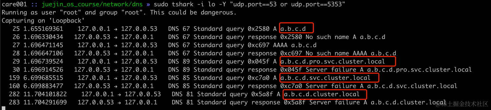
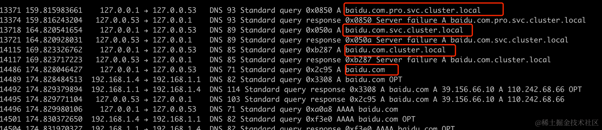
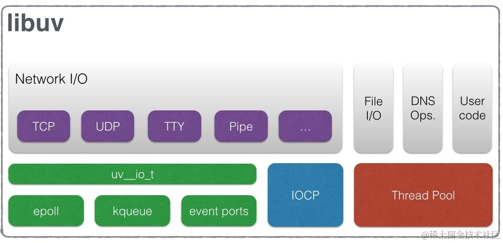
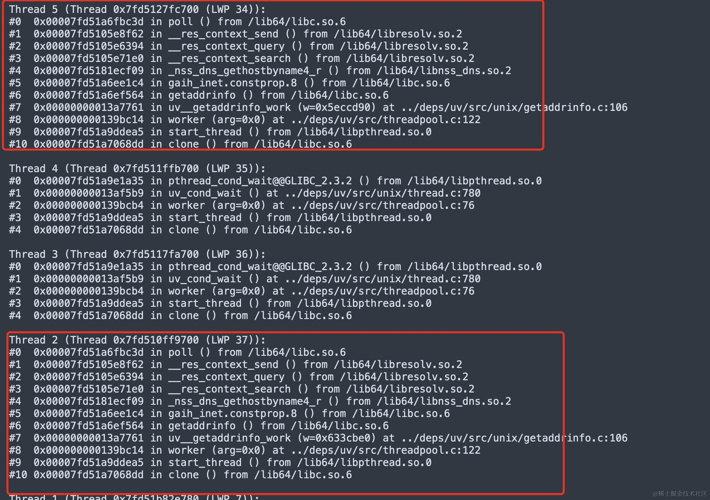
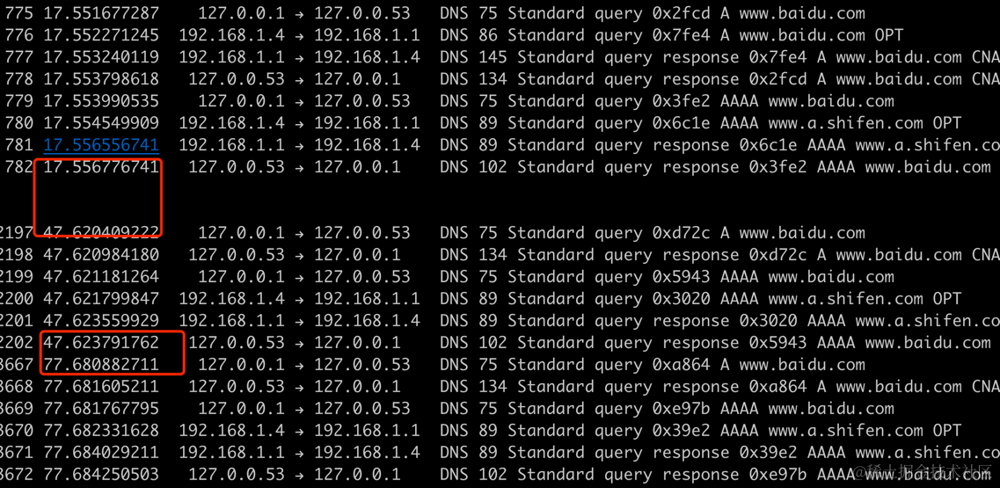
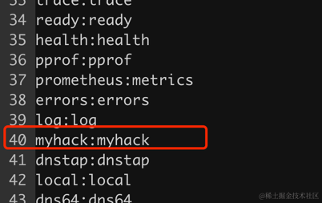
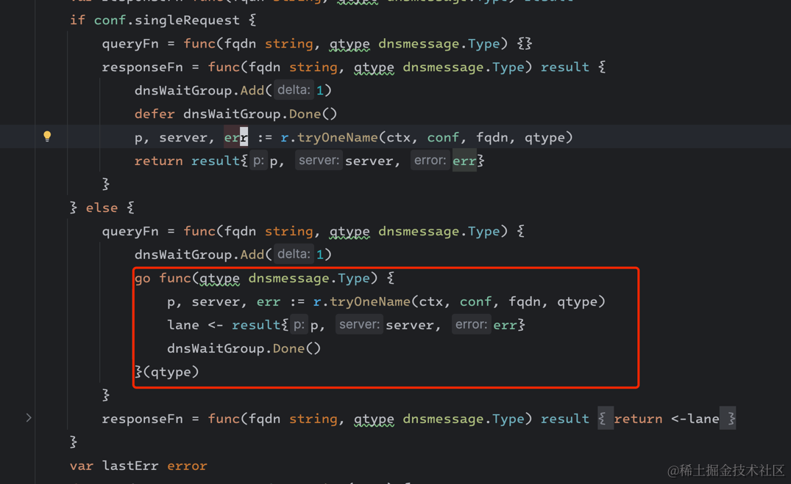
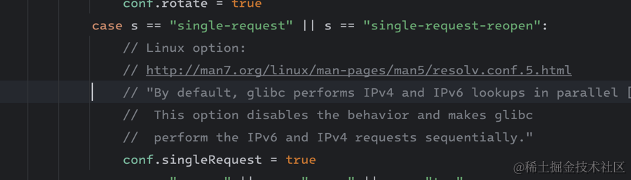

这篇文章我们来介绍一下 DNS 相关的内容，DNS 协议非常简单，但是现实中遇到 DNS 却非常多，这篇文章结合我们遇到的一些详细介绍
DNS 协议以及在各大语言的实现的一些细节。

## libc 中的 DNS 相关的函数

```c
#include <sys/types.h>
#include <sys/socket.h>
#include <netdb.h>

int getaddrinfo(const char * node,
               const char * service,
               const struct addrinfo * hints,
               struct addrinfo ** res);
```

其中：

*   node: 主机名或地址的字符串，比如可以是一个域名如"example.com"
*   service：包含一个服务名或一个十进制端口号，这里可以直接传 NULL
*   hints: 指向addrinfo结构的指针，可以用来可以指定协议族（如IPv4或IPv6）、套接字类型（如流或数据报）和协议（如TCP或UDP）
*   struct addrinfo \*\*res：入参当返回值，是一个指向addrinfo结构指针的指针。当函数成功返回时，res将指向一个addrinfo结构链表，其中包含了关于请求的网络地址的信息

一个典型的 getaddrinfo 解析域名的程序如下：

```c
#include <stdio.h>
#include <string.h>
#include <stdlib.h>
#include <netdb.h>
#include <sys/types.h>
#include <sys/socket.h>
#include <arpa/inet.h>

int main(int argc, char *argv[]) {
    if (argc != 2) {
        printf("Usage: %s hostname\n", argv[1]);
        return 1;
    }

    struct addrinfo hints, *res, *p;
    char ipstr[INET6_ADDRSTRLEN];
    int status;

    memset(&hints, 0, sizeof hints);
    hints.ai_family = AF_UNSPEC; // AF_INET 或 AF_INET6
    hints.ai_socktype = SOCK_DGRAM;

    if ((status = getaddrinfo(argv[1], NULL, &hints, &res)) != 0) {
        fprintf(stderr, "getaddrinfo: %s\n", gai_strerror(status));
        return 2;
    }

    printf("IP addresses for %s:\n", argv[1]);

    for (p = res; p != NULL; p = p->ai_next) {
        void *addr;
        if (p->ai_family == AF_INET) { // IPv4
            struct sockaddr_in *ipv4 = (struct sockaddr_in *) p->ai_addr;
            addr = &(ipv4->sin_addr);
        } else { // IPv6
            struct sockaddr_in6 *ipv6 = (struct sockaddr_in6 *) p->ai_addr;
            addr = &(ipv6->sin6_addr);
        }

        inet_ntop(p->ai_family, addr, ipstr, sizeof ipstr);
        printf("  %s\n", ipstr);
    }

    freeaddrinfo(res); // 释放链表

    return 0;
}
```

## 从 strace 看 dns 处理的过程

```powershell
48 openat(AT_FDCWD, "/etc/nsswitch.conf", O_RDONLY|O_CLOEXEC) = 3
54 openat(AT_FDCWD, "/etc/host.conf", O_RDONLY|O_CLOEXEC) = 3
59 openat(AT_FDCWD, "/etc/resolv.conf", O_RDONLY|O_CLOEXEC) = 3
127 socket(AF_INET, SOCK_DGRAM|SOCK_CLOEXEC|SOCK_NONBLOCK, IPPROTO_IP) = 3
128 connect(3, {sa_family=AF_INET, sin_port=htons(53), sin_addr=inet_addr("127.0.0.53")}, 16) = 0
131 sendmmsg(3, [{msg_hdr={msg_name=NULL, msg_namelen=0, msg_iov=[{iov_base="\210\252\1\0\0\1\0\0\0\0\0\0\3www\6google\3com\0\0\1\0\    1", iov_len=32}], msg_iovlen=1, msg_controllen=0, msg_flags=0}, msg_len=32}, {msg_hdr={msg_name=NULL, msg_namelen=0, msg_iov=[{i    ov_base="\221\274\1\0\0\1\0\0\0\0\0\0\3www\6google\3com\0\0\34\0\1", iov_len=32}], msg_iovlen=1, msg_controllen=0, msg_flags=0},     msg_len=32}], 2, MSG_NOSIGNAL) = 2
132 poll([{fd=3, events=POLLIN}], 1, 5000)  = 1 ([{fd=3, revents=POLLIN}])
133 ioctl(3, FIONREAD, [48])                = 0
134 recvfrom(3, "\210\252\201\200\0\1\0\1\0\0\0\0\3www\6google\3com\0\0\1\0\1"..., 2048, 0, {sa_family=AF_INET, sin_port=htons(53),     sin_addr=inet_addr("127.0.0.53")}, [28->16]) = 48
138 recvfrom(3, "\221\274\201\200\0\1\0\1\0\0\0\0\3www\6google\3com\0\0\34\0\1"..., 65536, 0, {sa_family=AF_INET, sin_port=htons(53)    , sin_addr=inet_addr("127.0.0.53")}, [28->16]) = 60
139 close(3)
```

可以看到它首先读取了

### /etc/nsswitch.conf

nsswitch 是 Name Service Switch 的缩写，在 linux 中 `/etc/nsswitch.conf` 用来配置各种 Name Service 的查询源和查询顺序，以
host 为例，我们可以通过这个文件来配置指定是先从本地文件还是先从 dns 服务器获取域名解析结果。比如下面这个配置指定了系统解析主机名的顺序和方式：

```powershell
#hosts:     db files nisplus nis dns
hosts:      files dns myhostname
```

*   files: 先从本地 host 文件（/etc/hosts）查找
*   dns: 如果在 /etc/hosts 文件中没有找到相应的条目，系统将使用 DNS (域名系统) 来解析主机名
*   myhostname: 如果 DNS 也无法解析，最后系统会尝试解析本机的主机名

nsswitch.conf 文件的内容一般不需要我们手动去配置，按这个默认值规则即可。 值得注意的是，有一些容器镜像，比如 busybox 没有这个文件。

### `/etc/host.conf`

`/etc/host.conf` 这个配置文件一般不用去关心，它主要用来控制主机名解析的行为，比如 "multi off" 限制在 /etc/hosts
文件中,如果一个主机名对应了多个IP地址,则只有第一个IP地址会被使用和解析。

## `/etc/resolv.conf`

这可能是所有 dns 配置中最重要的一个文件了,它指定了系统在进行域名解析时应该使用的DNS服务器的IP地址以及其他相关的配置信息。

一个常见的 k8s 容器内的 /etc/resolv.conf 内容如下：

```powershell
$ cat /etc/resolv.conf

search pro.svc.cluster.local svc.cluster.local cluster.local
nameserver 127.0.0.53
options ndots:2 single-request-reopen
```

其中：

*   nameserver: 指定DNS服务器的IP地址。可以指定多个 nameserver，可以并发或者按顺序来查询
*   search：定义域名的搜索列表，当查询的主机名不是完整的 FQDN
    时，比如只指定了主机名，没有域名后缀，就会在search列表中的各个域名依次拼接上主机名进行查询，直到查询成功或者查遍整个列表。它的行为与
    ndots 有关，后面会介绍。
*   options 用于指定额外的配置项，比如这里的 ndots、single-request-reopen

## ndots

ndots 的设置主要是为了提高域名解析的效率和准确性,决定是先查「原始域名」还是查 「原始域名 + search domain」

*   如果域名中点的数量大于等于 ndots，那么就先查原始域名（不添加 search domain），如果没有得到结果，再按「原始域名 + search
    domain」遍历来拼起来查
*   如果域名中点的数量小于 ndots 值,则先按照「原始域名 + search domain」遍历来查，如果全部没有找到，最后再查原始域名

我们来做一下实验，配置如下

```powershell
$ cat /etc/resolv.conf

search pro.svc.cluster.local svc.cluster.local cluster.local
nameserver 127.0.0.53
options ndots:2 single-request-reopen

$ sudo tshark -i lo -Y "udp.port==53 or udp.port==5353"
```

这个时候来 ping `a.b.c.d`（ndots 大于等于 2），可以看到一次查找了下面这些域名：

*   a.b.c.d
*   a.b.c.d.pro.svc.cluster.local
*   a.b.c.d.svc.cluster.local
*   a.b.c.d.cluster.local



这个时候我们来 ping 一个短一点的域名 `baidu.com`（ndots 小于 2）

*   baidu.com.pro.svc.cluster.local
*   baidu.com.svc.cluster.local
*   baidu.com.cluster.local
*   baidu.com



Netty 中关于 dns ndots 的处理逻辑也是这样，核心的代码在 `io/netty/resolver/dns/DnsResolveContext.java` 的 resolve 函数中：

```java
  void resolve(final Promise<List<T>> promise) {
      final String[] searchDomains = parent.searchDomains(); // search domian 列表
      if (searchDomains.length == 0 || parent.ndots() == 0 || StringUtil.endsWith(hostname, '.')) {
          // 如果 ndots 为 0 或者 search domain 列表为空 或者 hostname 以 . 结尾，直接解析域名 hostname
          internalResolve(hostname, promise);
      } else {
          // 判断 hostname 中的 . 的个数是否大于等于 ndots 值，如果大于等于 ndots，则不加 search domain 开始解析
          final boolean startWithoutSearchDomain = hasNDots(); 
          // 根据 ndots 决定第一个解析的域名是 hostname 还是 hostname + '.' + searchDomains[0]
          final String initialHostname = startWithoutSearchDomain ? hostname : hostname + '.' + searchDomains[0];
          // search domain 的 index
          final int initialSearchDomainIdx = startWithoutSearchDomain ? 0 : 1;

          final Promise<List<T>> searchDomainPromise = parent.executor().newPromise();
          searchDomainPromise.addListener(new FutureListener<List<T>>() {
              private int searchDomainIdx = initialSearchDomainIdx;
              @Override
              public void operationComplete(Future<List<T>> future) {
                  Throwable cause = future.cause();
                  if (cause == null) {
                      // 处理成功的返回
                  } else {
                      if (DnsNameResolver.isTransportOrTimeoutError(cause)) {
                          promise.tryFailure(new SearchDomainUnknownHostException(cause, hostname, expectedTypes,
                                  searchDomains));
                      } else if (searchDomainIdx < searchDomains.length) {
                          Promise<List<T>> newPromise = parent.executor().newPromise();
                          newPromise.addListener(this);
                          // 如果解析不成功，继续拼接下一个 search domain 进行解析
                          doSearchDomainQuery(hostname + '.' + searchDomains[searchDomainIdx++], newPromise);
                      } else if (!startWithoutSearchDomain) {
                        // 如果 search domain 全部都解析过，则把原始的 hostname 进行解析（小于 dnots 的场景）
                          internalResolve(hostname, promise);
                      } else {
                          promise.tryFailure(new SearchDomainUnknownHostException(cause, hostname, expectedTypes,
                                  searchDomains));
                      }
                  }
              }
          });
          doSearchDomainQuery(initialHostname, searchDomainPromise);
      }
  }
```

## 令人诟病的 libc DNS 阻塞解析

由于 libc 的 DNS 解析函数 gethostbyname() 或 getaddrinfo() 等函数过程是阻塞的,因此如果 DNS
服务器响应慢或者发生故障,就会导致应用程序线程长时间阻塞,影响整体性能，比如 Java 的默认实现是基于 libc 来实现的。

如果我们要想解决这个问题，可以针对不同的开发语言或者框架来做不同的对应策略：

*   比如 C/C++ 体系可以使用非阻塞 DNS 解析库,如 c-ares
*   Java 体系可以使用 netty-resolver-dns 等框架
*   使用线程池模拟异步
*   使用不依赖 libc DNS 解析的语言，比如 Go 重新实现了 DNS 解析的逻辑，使得解析过程中只会阻塞当前 goroutine
*   使用 DNS 缓存服务,如 nscd、dnsmasq 等,提高缓存查询的效率,减少对外部 DNS 服务器的查询,间接规避这个问题

## Node.js 的 DNS 实现

Node.js 宣称天然是异步的，但是它却是直接使用了 libc 的接口，我们来看看它是如何来实现的。Node.js 底层使用 libuv 来实现异步驱动。
libuv 是一个跨平台、高性能、事件驱动的 IO，起初是专为 Node.js 设计的，提供了跨平台的文件 I/O 和线程功能。

它的主要模块如下。


通过这个图可以看到 libuv 对于网络事件的处理和文件 IO、DNS 的处理是不一样。DNS 的处理使用的是线程池，具体的逻辑后面会介绍。

Node 的 DNS 解析不是自己实现的，而是省事直接用了 libc 中的 `getaddrinfo` 不幸的是，getaddrinfo 的实现是同步阻塞的，这与
Node 的异步显然是不搭的，于是 Node 使用线程池来调用 getaddrinfo，模拟异步。

这部分逻辑是 Node 的核心依赖 libuv 实现的，libuv 是一个基于事件驱动的异步 io 库，本身的事件循环部分是单线程的，如果出现阻塞或耗时的操作，不可以阻塞主循环。于是
libuv 实现了一个线程池来处理阻塞、耗时的操作，比如 DNS 等。

### 线程池初始化

初始化线程池的逻辑在 `deps/uv/src/threadpool.c` 的 `init_threads` 方法中。libuv 默认会开启 4
个线程，可以通过 `UV_THREADPOOL_SIZE` 环境变量修改，最大不能超过 1024，然后初始化了 3 个队列，然后创建并启动线程。

```c
static uv_thread_t default_threads[4];
#define MAX_THREADPOOL_SIZE 1024

static void init_threads(void) {

  nthreads = ARRAY_SIZE(default_threads); // 默认 4 个线程
  val = getenv("UV_THREADPOOL_SIZE");
  if (val != NULL)
    nthreads = atoi(val);
  if (nthreads > MAX_THREADPOOL_SIZE)
    nthreads = MAX_THREADPOOL_SIZE; // 最大不超过 1024


  // 这里很关键，初始化了三个队列
  QUEUE_INIT(&wq); // 主队列
  QUEUE_INIT(&slow_io_pending_wq); // SlowIO队列
  QUEUE_INIT(&run_slow_work_message); // 特殊标识节点

  // 这里真正创建线程
  for (i = 0; i < nthreads; i++)
    if (uv_thread_create(threads + i, worker, &sem))
      abort();
  // 等所有线程启动完然后继续执行
  for (i = 0; i < nthreads; i++)
    uv_sem_wait(&sem);
}
```

libuv 将任务分为三大类型，CPU 型、FastIO 和 SlowIO，我们这的 DNS 请求就属于 SlowIO 这一类，文件操作属于 FastIO。

```c
enum uv__work_kind {
  UV__WORK_CPU,
  UV__WORK_FAST_IO,
  UV__WORK_SLOW_IO
};
```

这里对几个核心的变量做一些说明

*   wq：任务主队列，用于处理 `UV__WORK_CPU` 和 `UV__WORK_FAST_IO`，收到此类任务，就将其出入到此队列的尾部，然后唤醒 worker
    线程去处理
*   slow\_io\_pending\_wq：用于处理 `UV__WORK_SLOW_IO`，收到 SlowIO 类型的任务插入到此队列
*   run\_slow\_work\_message：特殊标识节点，用于表示存在 SlowIO 时，会将这个作为一个标识节点放入主队列 wq 中，当 SlowIO
    类型请求所有都处理完毕时，将这个标记节点从 wq 中移除

### 线程池中任务的生产和消费

任务产生具体的逻辑在 `deps/uv/src/threadpool.c` 的 `post` 方法中。`post` 方法的主要功能是下面这些：

*   如果任务是 SlowIO，则任务插入到 slow\_io\_pending\_wq 队尾，同时在主队列 wq 中插入特殊标识节点
    run\_slow\_work\_message，告诉主队列这里有一个 SlowIO 要处理。
*   如果不是 SlowIO 就简单的将任务插入到主队列 wq 尾部

随后就是唤醒空闲线程起来干活，处理任务。

```c
static void post(QUEUE* q, enum uv__work_kind kind) {
  if (kind == UV__WORK_SLOW_IO) {
    // 如果是 SlowIO 任务，就插入到 slow_io_pending_wq 中
    QUEUE_INSERT_TAIL(&slow_io_pending_wq, q);
    if (!QUEUE_EMPTY(&run_slow_work_message)) {
      uv_mutex_unlock(&mutex);
      return;
    }
    q = &run_slow_work_message; // 特殊消息节点 run_slow_work_message，给主队列 wq 插入一个特殊的标识节点 run_slow_work_message，告诉主队列这里有一个慢 IO 任务队列需要处理
  }
  
  QUEUE_INSERT_TAIL(&wq, q); // 不管什么任务，都入队尾
  if (idle_threads > 0) 
    uv_cond_signal(&cond); // 唤醒空闲线程起来干活
}
```

任务的消费在 `deps/uv/src/threadpool.c` 的 `worker` 方法中。worker 方法的主要作用就是从队列中窃取任务执行。如果是
SlowIO，需要做的一个处理是控制 SlowIO 的线程数不超过线程池大小的一半。

```c
static void worker(void* arg) {
  // ...
  for (;;) {
    /* `mutex` should always be locked at this point. */

    /* Keep waiting while either no work is present or only slow I/O
       and we're at the threshold for that. */
    // 当队列为空或 SlowIO 任务个数达到阈值（2）时，进入阻塞等待唤醒
    while (QUEUE_EMPTY(&wq) ||
           (QUEUE_HEAD(&wq) == &run_slow_work_message &&
            QUEUE_NEXT(&run_slow_work_message) == &wq &&
            slow_io_work_running >= slow_work_thread_threshold())) {
      idle_threads += 1;
      uv_cond_wait(&cond, &mutex);
      idle_threads -= 1;
    }

    // ...
    w = QUEUE_DATA(q, struct uv__work, wq);
    // 调用 SlowIO 真正的逻辑，DNS 解析线程会阻塞在这里
    w->work(w);

    // 执行完 SlowIO 任务，slow_io_work_running 计数减一
    if (is_slow_work) {
      /* `slow_io_work_running` is protected by `mutex`. */
      slow_io_work_running--;
    }
  }
}
```

在我们这里 SlowIO 线程数阈值等于 2，计算方式如下。

```c
static unsigned int slow_work_thread_threshold(void) {
  return (nthreads + 1) / 2; // (4+1)/2=2
}
```

当 SlowIO 任务的个数达到两个时，当前处理 SlowIO 的线程会阻塞等待 SlowIO 有任务完成。

这样就可以避免出现 SlowIO 任务把所有的线程池占满，导致其它类型的任务没有机会执行。

下面是一个正在解析域名的 Node.js 线程堆栈截图：



我们之前遇到过一个实际的案例，大家可以看这篇更详细的文章：<https://juejin.cn/post/7158654267824275470>

## DNS 与缓存

很多开发语言和框架为了提高 dns 解析的性能会提供缓存的能力，比如 Java、Netty 框架、Apache HttpClient 等。我们来看看 Java
语言是如何处理 DNS 缓存的。

为了提高性能,JVM会将DNS解析结果缓存在内存中,避免每次都向DNS服务器查询。它的DNS缓存分为正向缓存和负向缓存两种:

*   正向缓存是指缓存成功解析的主机名到IP地址的映射关系，
*   负向缓存是指缓存无法解析的主机名条目,避免重复查询。

正向缓存由 `networkaddress.cache.ttl` 参数进行配置,成功解析的域名在 JVM 缓存中的生存时间（TTL，Time-To-Live）。当 JVM
第一次解析某个域名时，它会将解析结果（IP 地址）缓存起来。后续对同一域名的解析请求将直接从缓存中获取结果，而不会再次查询 DNS
服务器，从而提高了解析效率。

正向缓存 `networkaddress.cache.ttl` 的默认值跟 java 的 Security Manager 是否启用有很大的关系：

*   如果未启用 Security Manager ，默认值为 30 秒
*   如果启用了 Security Manager，默认值为 -1（永久缓存）。

负向缓存由 `networkaddress.cache.negative.ttl`
参数用于设置JVM负向DNS缓存的生存时间,控制无法解析的域名在 JVM 缓存中的生存时间。当 JVM
无法解析某个域名时，它会将这个失败结果缓存起来。后续对同一域名的解析请求将直接从缓存中获取失败结果，而不会再次查询 DNS
服务器，从而避免了不必要的 DNS 查询开销。

`networkaddress.cache.negative.ttl` 该参数的默认值为 10 秒，可以在 java.security 文件中进行修改。将其设置为 0
表示禁用对失败结果的缓存，而设置为 -1 则表示永久缓存失败结果

我们可以通过下面几种方式修改 Java DNS 缓存参数

*   在 JVM 启动时通过命令行参数 -Dsun.net.inetaddr.ttl 和 -Dsun.net.inetaddr.negative.ttl 设置参数值
*   java.security.Security.setProperty 或者 System.setProperty() 方法设置参数值

下面是一个持续请求 [www.baidu.com](http://www.baidu.com) 域名的 java 程序的 dns 抓包请求

```java
import java.net.InetAddress;
import java.net.UnknownHostException;

public class DnsJava3 {
    public static void main(String[] args) throws UnknownHostException, InterruptedException {
        String addrArg = args[0];

        while (true) {
            InetAddress[] addresses = InetAddress.getAllByName(addrArg);
            Thread.sleep(100);
        }
    }
}
```


```powershell
$ java -cp . DnsJava3 www.baidu.com
```

可以看到每个 30s 才会对域名重新解析。


手动修改 sun.net.inetaddr.ttl 参数为 3s，再次运行上面的程序

    $ java -Dsun.net.inetaddr.ttl=3 -cp . DnsJava3 www.baidu.com

可以看到此时每隔 3 s会对域名重新解析。


除了应用层的缓存，很多系统也引入了本地DNS缓存服务,如nscd、dnsmasq等,让多个应用程序共享DNS查询结果,减少对上游服务器的压力。

## Golang 是如何解析域名的

因为尽可能不依赖 glibc，且 libc 中的解析是阻塞的，与 go 的协程格格不入。Golang 的 DNS 是独立实现的，我们来看下它的实现。

golang提供了两种域名解析方法：内置默认使用 Go 自己实现的解析器，在特定的条件下使用使用cgo调用 glibc 解析器（也可以通过环境变量强制指定）

```go
func initConfVal() {
	confVal.netGo = netGo || dnsMode == "go"
	confVal.netCgo = netCgo || dnsMode == "cgo"

    // mac 和 ios 系统使用系统 libc 来查询 dns
	// Darwin pops up annoying dialog boxes if programs try to do
	// their own DNS requests. So always use cgo instead, which
	// avoids that.
	if runtime.GOOS == "darwin" || runtime.GOOS == "ios" {
		confVal.forceCgoLookupHost = true
		return
	}
	

    // 读取 /etc/nsswitch.conf
    confVal.nss = parseNSSConfFile("/etc/nsswitch.conf")

    // 读取 /etc/resolv.conf
	confVal.resolv = dnsReadConfig("/etc/resolv.conf")
	// 读取 resolv.conf 失败则强制使用 cgo 调用 glibc，从注释里也有看到，这里就是把锅甩给 glibc，反正大概率是失败的。
	if confVal.resolv.err != nil && !os.IsNotExist(confVal.resolv.err) &&
		!os.IsPermission(confVal.resolv.err) {
		// If we can't read the resolv.conf file, assume it
		// had something important in it and defer to cgo.
		// libc's resolver might then fail too, but at least
		// it wasn't our fault.
		confVal.forceCgoLookupHost = true
	}
} 
```

它定义了一套查找的顺序，

```go

// hostLookupOrder specifies the order of LookupHost lookup strategies.
// It is basically a simplified representation of nsswitch.conf.
// "files" means /etc/hosts.
type hostLookupOrder int

const (
	// hostLookupCgo means defer to cgo.
	hostLookupCgo      hostLookupOrder = iota
	hostLookupFilesDNS                 // files first
	hostLookupDNSFiles                 // dns first
	hostLookupFiles                    // only files
	hostLookupDNS                      // only DNS
)

/ hostLookupOrder determines which strategy to use to resolve hostname.
// The provided Resolver is optional. nil means to not consider its options.
func (c *conf) hostLookupOrder(r *Resolver, hostname string) (ret hostLookupOrder) {
	fallbackOrder := hostLookupCgo // 
	if c.netGo || r.preferGo() {
        // 如果强制使用 go 内置的解析器，则 fallbackOrder 为先 file 再 dns
		fallbackOrder = hostLookupFilesDNS 
	}
	if c.forceCgoLookupHost || c.resolv.unknownOpt || c.goos == "android" {
		return fallbackOrder
	}

	nss := c.nss
	srcs := nss.sources["hosts"]
	
	// If /etc/nsswitch.conf doesn't exist or doesn't specify any
	// sources for "hosts", assume Go's DNS will work fine.
	if os.IsNotExist(nss.err) || (nss.err == nil && len(srcs) == 0) {
        // 如果 nsswitch.conf 中的 hosts 读取失败，则直接返回先 files 再 dns 的策略
		return hostLookupFilesDNS
	}
	if nss.err != nil {
		return fallbackOrder
	}

	var mdnsSource, filesSource, dnsSource bool
	var first string
	for _, src := range srcs {
	    // 处理 myhostname 类型
		if src.source == "myhostname" {
            // 判断 hostname 是不是 localhost 或者 gw
			if isLocalhost(hostname) || isGateway(hostname) {
				return fallbackOrder
			}
			continue
		}
		// 处理 files 和 dns 类型
		if src.source == "files" || src.source == "dns" {
			if src.source == "files" {
				filesSource = true
			} else if src.source == "dns" {
				dnsSource = true
			}
			if first == "" {
				first = src.source
			}
			continue
		}
		return fallbackOrder
	}

	// Cases where Go can handle it without cgo and C thread
	// overhead.
	// 根据 /etc/nsswitch.conf 返回解析顺序
	switch {
	case filesSource && dnsSource:
		if first == "files" {
			return hostLookupFilesDNS
		} else {
			return hostLookupDNSFiles
		}
	case filesSource:
		return hostLookupFiles
	case dnsSource:
		return hostLookupDNS
	}

	// Something weird. Let libc deal with it.
	return fallbackOrder
}
```

如果 `/etc/nsswitch.conf` 不存在或者里面指定的 host 顺序是 files dns，那么 go 这里的解析顺序就是 hostLookupFilesDNS，也就是
/etc/hosts文件优先，解析不到再去查 dns。

## 为什么 single-request、single-request-reopen 配置很重要

这两个参数的定义在 linux 的文档： <https://man7.org/linux/man-pages/man5/resolv.conf.5.html>

*   single-request：串行发送A类型和AAAA类型请求，使用同一个源端口
*   single-request-reopen: 发送 A 类型和 AAA 类型的请求使用不同的源端口，在我的机器上实测也是串行发送

下面是在没有 single-request 和 single-request-reopen 配置的情况下

```powershell
$ cat /etc/resolv.conf
nameserver 127.0.0.1
options ndots:2 attempts:1

$ curl http://test.ya.me:8080/index.html

$ sudo tcpdump -i any udp port 53 -nn

18:49:19.622957 IP 127.0.0.1.57986 > 127.0.0.1.53: 6394+ A? test.ya.me. (28)
18:49:19.622988 IP 127.0.0.1.57986 > 127.0.0.1.53: 8961+ AAAA? test.ya.me. (28)
18:49:20.623543 IP 127.0.0.1.53 > 127.0.0.1.57986: 6394*- 1/0/0 A 127.0.0.1 (54)
18:49:22.623876 IP 127.0.0.1.53 > 127.0.0.1.57986: 8961 ServFail*- 0/0/0 (28)
```

可以看到此时glibc 使用同一个端口，并行发起 A 和 AAAA 记录请求。

下面是 single-request 配置下的抓包结果：

```powershell
$ cat /etc/resolv.conf
nameserver 127.0.0.1
options ndots:2  single-request attempts:1

$ curl http://test.ya.me:8080/index.html

$ sudo tcpdump -i any udp port 53 -nn

17:57:33.894391 IP 127.0.0.1.39119 > 127.0.0.1.53: 57602+ A? test.ya.me. (28)
17:57:34.895832 IP 127.0.0.1.53 > 127.0.0.1.39119: 57602*- 1/0/0 A 127.0.0.1 (54)
17:57:34.896032 IP 127.0.0.1.39119 > 127.0.0.1.53: 51208+ AAAA? test.ya.me. (28)
17:57:37.897355 IP 127.0.0.1.53 > 127.0.0.1.39119: 51208 ServFail*- 0/0/0 (28)
```

可以看到在 single-request 下，glibc 使用了相同的端口，串行发送 A 和 AAAA 记录。

下面是 single-request-reopen 配置下的抓包结果：

```powershell
$ cat /etc/resolv.conf
nameserver 127.0.0.1
options ndots:2  single-request-reopen attempts:1

$ curl http://test.ya.me:8080/index.html

$ sudo tcpdump -i any udp port 53 -nn

18:04:46.283105 IP 127.0.0.1.51892 > 127.0.0.1.53: 14609+ A? test.ya.me. (28)
18:04:47.284042 IP 127.0.0.1.53 > 127.0.0.1.51892: 14609*- 1/0/0 A 127.0.0.1 (54)
18:04:47.284304 IP 127.0.0.1.59491 > 127.0.0.1.53: 13335+ AAAA? test.ya.me. (28)
18:04:50.285343 IP 127.0.0.1.53 > 127.0.0.1.59491: 13335 ServFail*- 0/0/0 (28)
```

可以看到在 single-request-reopen 下，glibc 使用了不同的端口，串行发送 A 和 AAAA 记录。

| 配置                  | 是否用同一个端口 | 并发/串行查询 A 和 AAAA |
| --------------------- | ---------------- | ----------------------- |
| default               | 是               | 并发                    |
| single-request        | 是               | 串行                    |
| single-request-reopen | 否               | 串行                    |

可能你会好奇为什么这两个配置有什么必要。这与 conntrack 有关。当glibc这样的客户端通过同一个UDP套接字并行发送A(IPv4)
和AAAA(IPv6) DNS查询时:

*   第一个DNS查询(例如AAAA)被DNAT并通过conntrack,创建一个条目
*   第二个DNS查询(例如A)在第一个查询被确认之前被DNAT并到达，conntrack将其视为新连接。
*   conntrack会认为第二个DNS查询数据包是无效的新连接,因此将其丢弃。

这就会导致其中一个DNS查询(通常是第二个)被丢弃。客户端必须等待5秒的UDP超时才能重试,导致DNS解析延迟。

可以使用下面几种方案规避：

*   开启 single-request：串行发送 A 和 AAAA 请求
*   开启 single-request-reopen：使用不同的源端口，避免了五元组冲突
*   使用 TCP 的方式来查询 DNS

## 解析 AAAA 记录慢可能带来的请求慢

当对一个域名进行解析时，各大开发语言和框架比较常见的做法是等 A 和 AAAA 记录都解析完再返回结果，一般 A 记录解析都没有太大问题，但
AAAA 记录有一些配置不当可能会导致响应高。

比如 curl 命令使用 glibc 的 gethostbyname
调用来解析域名，glibc 默认会按并发查询 A 记录和 AAAA 记录，如果 A 记录解析较快正常返回，AAAA 返回时间较长，则会导致建连时间变长。

我们来实际模拟一下返回 AAAA 解析时间过长的例子。这个可以通过很多方式实现，比如 iptables 等，这里我们采用灵活性更高的写一个
coredns 插件的方式，顺便介绍 coredns 插件的用法。这里我们要实现的插件的名字叫 myhack，它实现下面两个功能

*   对 test.ya.me 域名的 AAAA 返回 servfail（你可以改为 nxdomain），同时 delay 3s。
*   对 test.ya.me 域名 A 正常返回，delay 1s

首先我们需要先拉取 coredns 的代码，然后 build，不出意外应该可以可以编译出可执行 coredns 文件。

```powershell
$ wget https://github.com/coredns/coredns/archive/refs/tags/v1.11.1.tar.gz
$ tar -xzvf v1.11.1.tar.gz
$ cd coredns-1.11.1
$ go build
```

接下来我们来修改 plugin.cfg，新增 myhack

```powershell
$ vim plugin.cfg
```



然后在 plugin 目录新增 myhack 的代码

```powershell
» tree plugin/myhack
plugin/myhack
└── myhack.go
```

<!---->

```go
package myhack

import (
	"context"
	"github.com/coredns/caddy"
	"github.com/coredns/coredns/core/dnsserver"
	"github.com/coredns/coredns/plugin"
	"github.com/coredns/coredns/request"
	"github.com/miekg/dns"
	"time"
)

type MyHack struct {
	Next plugin.Handler
}

func (e MyHack) Name() string { return "myhack" }

func (e MyHack) ServeDNS(ctx context.Context, w dns.ResponseWriter, r *dns.Msg) (int, error) {
	state := request.Request{W: w, Req: r}
	a := new(dns.Msg)
	a.SetReply(r)
	a.Authoritative = true

	if state.QType() == dns.TypeAAAA && state.Name() == "test.ya.me." {
		a.Rcode = dns.RcodeServerFailure
		time.Sleep(3 * time.Second)
        w.WriteMsg(a)
        return dns.RcodeSuccess, nil
	} else if state.QType() == dns.TypeA && state.Name() == "test.ya.me." {
		time.Sleep(1 * time.Second)
		plugin.NextOrFailure(e.Name(), e.Next, ctx, w, r)
		return dns.RcodeSuccess, nil
	} else {
		plugin.NextOrFailure(e.Name(), e.Next, ctx, w, r)
		return dns.RcodeSuccess, nil
	}

}

func (e MyHack) Ready() bool { return true }

func init() {
	plugin.Register("myhack", func(c *caddy.Controller) error {
		dnsserver.GetConfig(c).AddPlugin(func(next plugin.Handler) plugin.Handler {
			return MyHack{Next: next}
		})
		return nil
	})
}
```

然后就可以执行 go generate 和 go build 重新编译 CoreDNS，在编译参数中加入 myhack 插件

```powershell
go generate
go build
```

在 Corefile 中引入该插件

```powershell
 » cat Corefile
.:53 {
	hosts {
		127.0.0.1 test.ya.me
	}
	errors
	log
	myhack
	forward . 8.8.8.8
}
```

然后运行 coredns

```powershell
sudo ./coredns -conf  ./Corefile
```

这样就通过自定义一个 myhack 插件，拦截了对 test.ya.me AAAA 记录的查询，delay 了 3s，并返回了 SERVFAIL 状态码。对其他查询则照常处理。

我们来实测一下，先来看下 curl 的表现

```powershell
» curl -w "time cost:\n\                                                                                                        130 ↵
connect: %{time_connect}\n\
DNS: %{time_namelookup}\n\
redirect: %{time_redirect}\n\
start_transfer: %{time_starttransfer}\n\
time_total : %{time_total}\n" http://test.ya.me:8080/index.html
```


```powershell
time cost:
connect: 3.513601
DNS: 3.513321
redirect: 0.000000
start_transfer: 3.520263
time_total : 3.520334
```

从 curl 结果可以看到 DNS 总共花了 3s 多才返回，请求的大部分时间都花在了 DNS 解析上。通过抓包可以同步确认 A 和 AAAA
同时发起请求，然后 3s 之后返回了 SERVFAIL，而且 A 和 AAAA 记录请求使用的同一个端口 51640

```powershell
17:27:09.683761 IP 127.0.0.1.51640 > 127.0.0.1.53: 11238+ A? test.ya.me. (28)
17:27:09.683803 IP 127.0.0.1.51640 > 127.0.0.1.53: 14317+ AAAA? test.ya.me. (28)
17:27:10.684291 IP 127.0.0.1.53 > 127.0.0.1.51640: 11238*- 1/0/0 A 127.0.0.1 (54)
17:27:12.684989 IP 127.0.0.1.53 > 127.0.0.1.51640: 14317 ServFail*- 0/0/0 (28)
```

在 single-request-reopen 参数启动的情况下：

```powershell
$ curl -w "time cost:\n\                                                                                               
connect: %{time_connect}\n\
DNS: %{time_namelookup}\n\
redirect: %{time_redirect}\n\
start_transfer: %{time_starttransfer}\n\
time_total : %{time_total}\n" http://test.ya.me:8080/index.html

time cost:
connect: 4.514744
DNS: 4.514463
redirect: 0.000000
start_transfer: 4.519724
time_total : 4.519795
```

single-request-reopen 开启的情况下，A 和 AAAA 请求变为了串行请求，从 curl 结果可以看到 DNS 总共花了 4s 多才返回，请求的大部分时间都花在了
DNS 解析上， 通过抓包可以同步确认 A 记录在 1s
后返回，随即发起了 AAAA 请求，然后 3s 之后返回了 SERVFAIL。而且 A 和 AAAA 记录请求使用的不同的端口 47216 和 53798

```powershell
17:01:38.628275 IP 127.0.0.1.47216 > 127.0.0.1.53: 25909+ A? test.ya.me. (28)
17:01:39.629133 IP 127.0.0.1.53 > 127.0.0.1.47216: 25909*- 1/0/0 A 127.0.0.1 (54)
17:01:39.629438 IP 127.0.0.1.53798 > 127.0.0.1.53: 20027+ AAAA? test.ya.me. (28)
17:01:42.630356 IP 127.0.0.1.53 > 127.0.0.1.53798: 20027 ServFail*- 0/0/0 (28)
```

我们来看看 go 程序的行为：

```go
package servfail

import (
	"fmt"
	"io/ioutil"
	"net/http"
)

func main() {
	resp, err := http.Get("http://test.ya.me:8080/index.html")
	if err != nil {
		fmt.Println("Error:", err)
		return
	}
	defer resp.Body.Close()

	fmt.Printf("Status: %s\n", resp.Status)
	fmt.Printf("Header: %s\n", resp.Header)
	body, err := ioutil.ReadAll(resp.Body)
	if err != nil {
		fmt.Println("Error:", err)
		return
	}

	fmt.Println(string(body))
}
```

通过抓包可以同步确认 A 和 AAAA 同时发起请求，然后 3s 之后返回了 SERVFAIL，与 glibc 的实现不同的是，A 和 AAAA 记录请求使用的是不同的端口。

```powershell
17:35:17.167091 IP 127.0.0.1.39336 > 127.0.0.1.53: 60722+ [1au] AAAA? test.ya.me. (39)
17:35:17.167142 IP 127.0.0.1.53841 > 127.0.0.1.53: 21045+ [1au] A? test.ya.me. (39)
17:35:18.167474 IP 127.0.0.1.53 > 127.0.0.1.53841: 21045*- 1/0/1 A 127.0.0.1 (65)
17:35:20.168024 IP 127.0.0.1.53 > 127.0.0.1.39336: 60722 ServFail*- 0/0/1 (39)
```

在 single-request-reopen 开启的情况下，花了 4s 多这个请求才返回

```powershell
» time go run DnsGo2.go
Status: 404 Not Found
Header: map[Connection:[keep-alive] Content-Length:[0] Date:[Mon, 22 Apr 2024 09:04:21 GMT] Server:[ecstatic-3.3.2]]

go run DnsGo2.go  0.29s user 0.14s system 10% cpu 4.213 total
```

从抓包也可以确定在 single-request-reopen 的情况下 go 也是按顺序请求 A 和 AAAA 记录。

```powershell
17:04:17.142554 IP 127.0.0.1.41331 > 127.0.0.1.53: 10953+ [1au] A? test.ya.me. (39)
17:04:18.143980 IP 127.0.0.1.53 > 127.0.0.1.41331: 10953*- 1/0/1 A 127.0.0.1 (65)
17:04:18.144530 IP 127.0.0.1.38270 > 127.0.0.1.53: 47188+ [1au] AAAA? test.ya.me. (39)
17:04:21.145302 IP 127.0.0.1.53 > 127.0.0.1.38270: 47188 ServFail*- 0/0/1 (39)
```

这部分源码逻辑在 `src/net/dnsclient_unix.go`中



Go 中把 single-request 和 single-request-reopen 都统一当做了 single-request。


