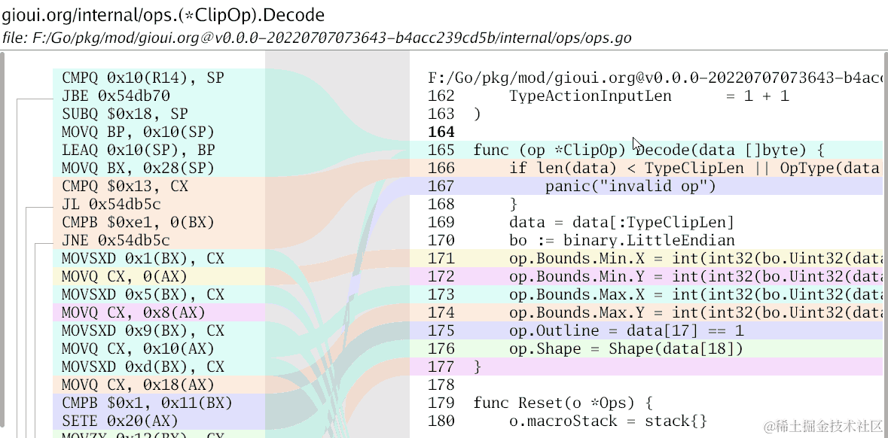
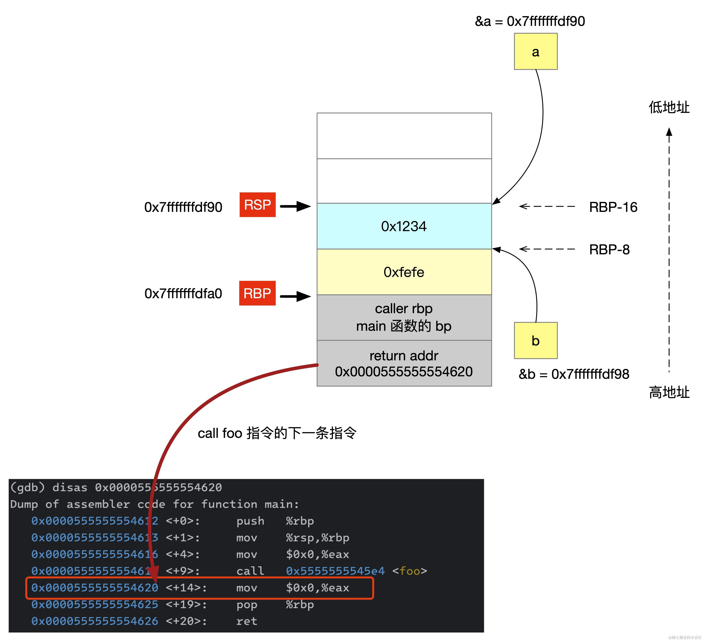
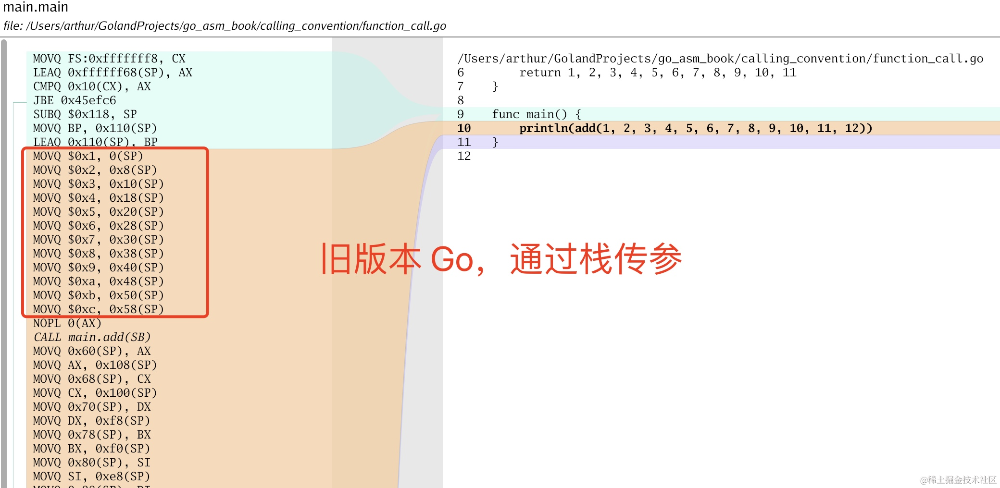
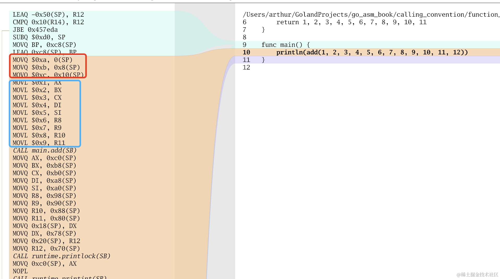
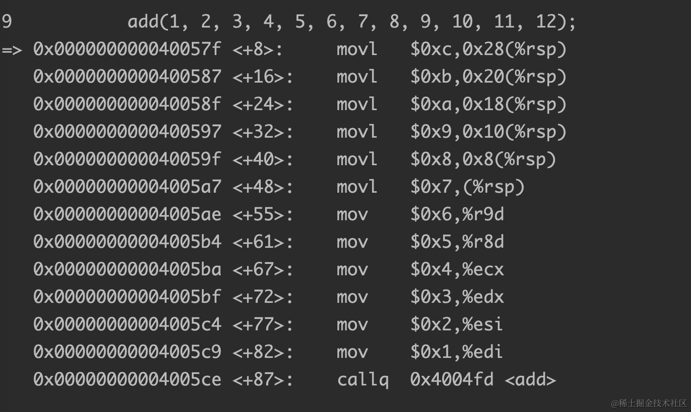
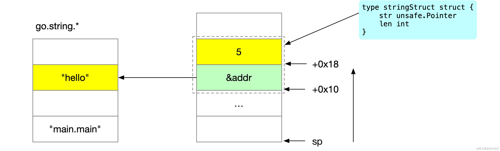
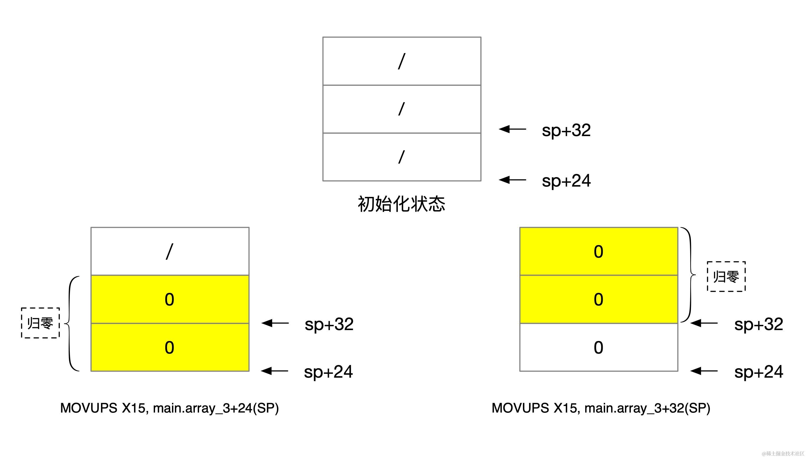
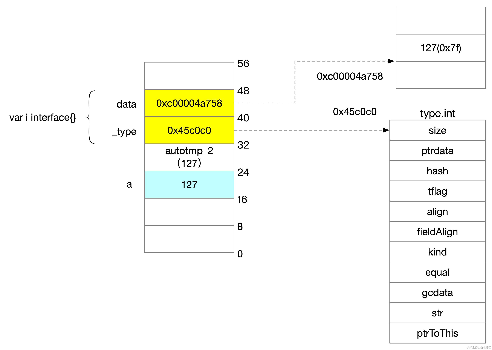
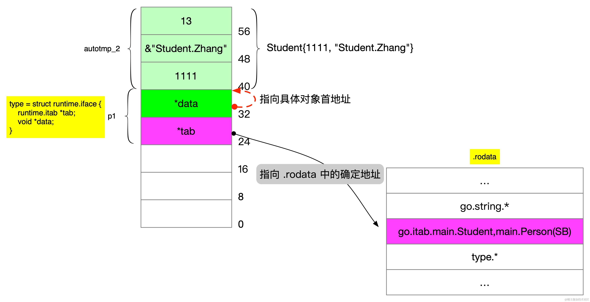
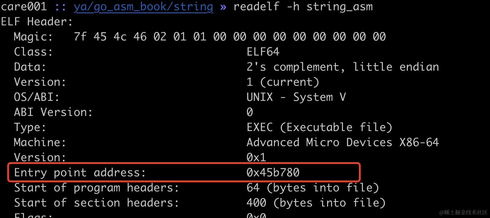

> 这篇文章是我在「Go 夜读」上做的分享的一个简要的文字版记录，大家可以结合视频 <https://www.bilibili.com/video/BV14U411o7ZU> 一起看。

## 为什么要卷汇编

*   **褪去花里胡哨语法糖的外衣**。现代高级编程语言往往包含许多语法糖，这些语法糖虽然简化了编程过程，但也隐藏了许多底层细节。通过学习汇编语言，你可以看到计算机是如何执行每一条指令的，从而更好地理解计算机的工作原理。这种深入的理解不仅能提升你的编程技能，还能帮助你在解决复杂问题时做出更优化的决策。

*   **在孰优孰劣的争论中保持理性**。学习汇编语言可以让你在各种语言孰优孰劣的争论中保持理性。通过学习汇编语言，你可以更客观地评估不同语言的优缺点，而不是被表面的语法糖所迷惑，在合理的场景选择和使用它们。
*   **以不变应万变的方式去学习新语言**。汇编语言的语法和结构相对固定，通过理解汇编语言可以帮助你更快地学习新语言。


这篇文章的主要内容如下：

*   查看汇编的方法
*   plan9 汇编
*   调用规约
*   string 的表示
*   slice 的表示
*   array 的表示
*   interface 的表示
*   channel 的语法糖
*   Go 入口函数简要介绍

查看汇编常见的有下面这几种方法。

*   查看汇编的可视化神器：`lensm`



非 gui 界面可选的比较多，有下面这些：

*   go tool compile -N -l -S xxx.go
*   go tool objdump
*   delve
*   GDB


## Plan9 汇编

Plan9 汇编强烈推荐长坤大佬《Go 语言原本》关于 plan9 的章节：

<https://golang.design/under-the-hood/zh-cn/part1basic/ch01basic/asm/>

### Plan9 汇编伪寄存器

4 个伪寄存器 FP、PC、SB 和 SP，其中最常用的是 FP 和 SP。

*   SB（Static base pointer）：用于访问全局符号，比如函数、全局变量。
*   FP（Frame pointer）：用于访问函数的参数和返回值。
*   PC（Program counter）：对应 x86 平台的 IP 寄存器，保存 CPU 下一条要运行的指令。
*   SP（Stack pointer）：指向当前栈帧的栈顶。


### plan9 源操作数与目标操作数方向

plan9 汇编与 AT\&T 类型类似，采用源操作数在前、目的操作数在后的方式：

    movl $0x2,%eax   # 将立即数0x2移动到eax寄存器


## 栈帧

当一个函数被调用时，系统都需要为其分配一块内存空间，用于存储这次函数调用所需的信息。这块特殊的内存区域就被称为"栈帧"（Stack
Frame）。当函数执行完毕后，栈帧也将被自动清除，关闭栈帧，为下一次函数调用腾出空间。

### 栈的边界

栈帧在内存中是一段连续的内存空间，通过 SP 和 BP 这两个寄存器来表示栈的边界。

*   SP 寄存器（Stack Pointer）用于指向当前的栈顶位置，在 x86 架构中，栈是向下增长的（向更低的地址增长），执行 push 和 pop
    指令会自动修改 SP，当往栈压入数据时，SP 会减小，当从栈上弹出数据时，ESP 会增加。

*   BP 寄存器（Base Pointer），也称为基址指针寄存器，它通常用来存储当前函数栈帧的基地址。在函数调用过程中，BP 寄存器的值通常在函数的入口处被保存，并在函数退出前被恢复。


### 函数序言

在函数调用时，经常会看到这样一段函数序言（Prologue）汇编指令：

```powershell
pushq   %rbp       // 将调用者的BP值保存到栈上
movq    %rsp, %rbp // 将当前的SP值复制到BP，此时BP指向栈帧的开始位置
subq    $16, %rsp  // 会栈分配 16 字节的空间（栈向下生长，减去 16 表示栈扩大 16 字节）
```


### 函数调用过程发生了什么

```c
void bar(long a, long b) {
}

void foo() {
    long a = 0x1234;
    long b = 0xfefe;
    bar(a, b);
}

int main() {
    foo();
}

```

```powershell
$ gcc -O0 -g stack_frame_test.c
$ gdb ./a.out
(gdb) b 7
Breakpoint 1 at 0x5fc: file stack_frame_test.c, line 7.
(gdb) r
Starting program: /data/dev/a.out 

Breakpoint 1, foo () at stack_frame_test.c:7
7           bar(a, b);
(gdb) disas /m


```

我们来查看一下内存布局：

```powershell
gdb) i r rsp
rsp            0x7fffffffdf90      0x7fffffffdf90
(gdb) i r rbp
rbp            0x7fffffffdfa0      0x7fffffffdfa0
(gdb) p &a
$1 = (long *) 0x7fffffffdf90
(gdb) p &b
$2 = (long *) 0x7fffffffdf98
(gdb) x/32bx $rbp - 16
0x7fffffffdf90: 0x34 0x12 0x00 0x00 0x00 0x00 0x00 0x00a
0x7fffffffdf98: 0xfe 0xfe 0x00 0x00 0x00 0x00 0x00 0x00b
0x7fffffffdfa0: 0xb0 0xdf 0xff 0xff 0xff 0x7f 0x00 0x00caller bp
0x7fffffffdfa8: 0x20 0x46 0x55 0x55 0x55 0x55 0x00 0x00ret addr
```

此时的 rbp 指向的是栈底，在高地址，栈的大小是 0x10(16)，为了显示完整的栈空间，我们这里查看了从 rbp 再往前的总共 32
字节的数据。从低到高依次是：

*   foo 的 return addr，对应于 main 函数 foo 函数调用的下一行指令地址，也就是 foo 返回以后应该继续执行的位置；
*   caller bp 这里是 main 函数调用 foo 函数，这里的 caller bp 是 main 函数的 bp 值；
*   八字节的 long 型变量 b；
*   八字节的 long 型变量 a。

内部布局如下图所示：



与函数调用十分相关的是的概念是「调用规约」。


### 调用规约（calling convention）

调用规约是一种约定，用于规定如何在程序中调用函数。它涉及到参数的传递方式、返回值的处理和寄存器的使用。

常见的调用规约：

*   cdecl（C Declaration）：逆序向被调用方函数传递参数。
*   stdcall（Standard Call）：与 cdecl 类似。
*   fastcall：优先寄存器传递参数。
*   thiscall：C++ 类成员调用 this 指针而特别设定的调用规范。

Go 在 1.17 之前使用基于栈的调用规约，从 1.17 开始使用基于寄存器的调用规约（访问寄存器的速度要远高于内存），对于参数个数少于 10 个的函数调用，参数通过寄存器传递而不是栈。

```go
//go:noinline
func add(x int, y int, z int, a, b, c int, d, e, f int, g, h, l int) (int, int, int, int, int, int, int, int, int, int, int) {
	println(x, y)
	return 1, 2, 3, 4, 5, 6, 7, 8, 9, 10, 11
}

func main() {
	println(add(1, 2, 3, 4, 5, 6, 7, 8, 9, 10, 11, 12))
}
```

旧版基于栈的调用规约，所有的参数通过栈传递参数：



新版 go 基于寄存器的调用规约，前 10 个参数通过寄存器传参，更多的参数通过栈来传递。



64 位 Linux x86-64 程序使用 6 个寄存器（RDI、RSI、RDX、RCX、R8、R9）传递前几项参数，用 RAX 存储返回值。

```c
int main() {
    int res = add(1, 2, 3, 4, 5, 6, 7, 8, 9, 10, 11, 12);
}
```



接下来我们来从汇编看 Go 常用数据结构，首先我们来看下字符串在各个语言是如何表示的。


## string 的表示

首先我们来看下 C 中的字符串的表示：

```c
gcc -g -O0 string_test.c

#include <stdio.h>

int main() {
    char s[] = "hello"; // `hello\0`
    int len = sizeof(s) / sizeof(s[0]);
    printf("len = %d\n", len);
}


len = 6
```

可以看到 C 中的字符串采用末尾添加 `\0`的方式来表示字符串，这样省掉了一个表示字符串长度的字段。

我们来看 Go 中的 string：

```go
package main

func main() {
	var a = "hello"
	println(a)
}
```

第四行 `var a = "hello"` 对应的汇编代码为：

```powershell
LEAQ 0xc91b(IP), AX // 将字符串常量 "hello" 的指针地址加载到 AX 寄存器
MOVQ AX, 0x10(SP)   // 将 AX 寄存器存储到 `SP+0x10` 处。                     
MOVQ $0x5, 0x18(SP) // 将字符串的长度 5 存储到 `SP+0x18` 处。
```

Go 中 string 的内存表示如下：

```go
src/runtime/string.go

type stringStruct struct {
    str unsafe.Pointer
    len int
}
```

由两部分构成，str 是一个指向真正数据的指针，len 表示字符串长度，如下所示：



当 string 作为参数传递时，是值拷贝还是引用拷贝？以下面的这段代码为例：

```go
package main

func foo(str string) {
	println(str)
	str = "haha"
	println(str)
}
func main() {
	var a = "hello"
	print(a)
	foo(a)
	println(a)
}
```

main 函数中 foo 调用对应的汇编为：

```powershell
MOVQ 0x10(SP), AX  // 拷贝 str 指针                      
MOVQ 0x18(SP), BX  // 拷贝 len                     
CALL main.foo(SB)  // 调用函数
```

通过汇编我们可以看到，string 通过函数传递实际是浅拷贝了 string 结构体的两个字段。


## array 的表示

首先我们来思考，Go 的数组需要一个额外的字段来存储长度吗？以下面的代码为例：

```go
package main

func main() {
	array := [5]int{1, 2, 3, 4, 5}
	_ = array
}


MOVQ $0x1, 0(SP)        
MOVQ $0x2, 0x8(SP)      
MOVQ $0x3, 0x10(SP)     
MOVQ $0x4, 0x18(SP)     
MOVQ $0x5, 0x20(SP)  
```

可以看到汇编中，并没有出现对长度赋值的逻辑，这是因为 go 中的数组长度是编译期确定的，因此没有必要用一个额外的字段来存储数组的长度。

它对应的内存布局如下：

    ┌─────────────────┐◀────────  sp+0x20   ▲
    │        5        │                     │
    ├─────────────────┤                     │
    │        4        │                     │
    ├─────────────────┤                     │
    │        3        │                     │
    ├─────────────────┤                     │
    │        2        │                     │
    ├─────────────────┤◀────────  sp+0x8    │
    │        1        │                     │
    └─────────────────┘◀────────  sp        │

接下来我们来看下 array 初始化的一些有意思的细节，这部分内容比较长，需要你耐心观看。

在 Go 语言中当定义一个数组没有进行显式初始化时，数组中的所有元素会被初始化为数组对应元素类型的默认值。比如：

```go
package main

func main() {
	var array [10]int
	_ = array
}
```

array 变量中的所有元素都被初始化为了 0，这一步是如何实现的呢？是类似这样来实现的吗？

```go
func foo() {
	var array [10]int
	for i := 0; i < 10; i++ {
		array[i] = 0
	}
}
```

我们来看下 C++ 中是如何实现的，以下面的代码为例：

```cpp
#include <iostream>

int main() {
    char array1[5] = {0};
    char array2[256] = {0};
    char array3[1 * 1024 * 1024] = {0};
    std::cout << array1[0] << std::endl;
    std::cout << array2[0] << std::endl;
    std::cout << array3[0] << std::endl;
}

```

对应的汇编如下：

```powershell
char array1[5] = {0};
=> 0x0000000000400858 <+27>:    movl   $0x0,-0x100130(%rbp)
   0x0000000000400862 <+37>:    movb   $0x0,-0x10012c(%rbp)

char array2[256] = {0};
   0x0000000000400869 <+44>:    lea    -0x100120(%rbp),%rsi // 将 array2 的地址赋值给 SI 寄存器
   0x0000000000400870 <+51>:    mov    $0x0,%eax
   0x0000000000400875 <+56>:    mov    $0x20,%edx // 将 DX 赋值为 32
   0x000000000040087a <+61>:    mov    %rsi,%rdi  // 将数组首地址赋值给 DI
   0x000000000040087d <+64>:    mov    %rdx,%rcx  // CX 是循环计数器
   0x0000000000400880 <+67>:    rep stos %rax,%es:(%rdi) // AX 是源操作数，DI 是目标寄存器

char array3[1 * 1024 * 1024] = {0};
   0x0000000000400883 <+70>:    lea    -0x100020(%rbp),%rax
   0x000000000040088a <+77>:    mov    $0x100000,%edx
   0x000000000040088f <+82>:    mov    $0x0,%esi
   0x0000000000400894 <+87>:    mov    %rax,%rdi
   0x0000000000400897 <+90>:    callq  0x4006d0 <memset@plt>
```

我们来详细看看不同大小的数组编译期是如何实现的。

在数组较小时，使用较少的几个 `MOV*` 指令就可以完成赋值的操作，比如这里的 array1，当数组稍大时，会分配 `REP STOS` 指令，比一堆的 `MOV*` 赋值指令更短。

`STOS*` 指令的作用是将 AX 寄存器的值当作源操作数，存储到 DI 寄存器中，当与 REP 组合使用时，可以使用 CX 寄存器作为循环计数器，进行多次循环，将 AX 寄存器的值不断拷贝到 DI 寄存器所指向的内存地址中，DI 寄存器则会每次循环以后自动调整，相当于下面这个过程。

```c
void rep_stos(char array[]) {
    int64_t *di = (int64_t *) array; // 一次操作 8 字节
    int64_t ax = 0;
    int64_t cx = 32;
    do {
        *di = ax;
        di++;
    } while (--cx != 0);
}
```

当数组大小再大一点，编译器采用调用 memset 函数来实现。

看完了 C++ 的实现，我们来看看 go 中是如何做的：

```go
  1 package main
  2
  3 func main() {
  4         var array_1 [1]int
  5         var array_2 [2]int
  6         var array_3 [3]int
  7         var array_9 [9]int
  8         var array_10 [10]int
  9         var array_64 [64]int
 10         var array_128 [128]int
 11         var array_1024 [1024]int
 12         _ = array_128
 13         _ = array_1
 14         _ = array_2
 15         _ = array_3
 16         _ = array_9
 17         _ = array_10
 18         _ = array_64
 19         _ = array_1024
 20 }

```

对应的汇编指令如下：

```powershell
 (array_asm_05.go:4)	MOVQ	$0, main.array_1(SP)
 (array_asm_05.go:5)	MOVUPS	X15, main.array_2+8(SP)
 (array_asm_05.go:6)	MOVUPS	X15, main.array_3+24(SP)
 (array_asm_05.go:6)	MOVUPS	X15, main.array_3+32(SP)
 (array_asm_05.go:7)	MOVUPS	X15, main.array_9+48(SP)
 (array_asm_05.go:7)	MOVUPS	X15, main.array_9+56(SP)
 (array_asm_05.go:7)	MOVUPS	X15, main.array_9+72(SP)
 (array_asm_05.go:7)	MOVUPS	X15, main.array_9+88(SP)
 (array_asm_05.go:7)	MOVUPS	X15, main.array_9+104(SP)
 (array_asm_05.go:8)	LEAQ	main.array_10+120(SP), DI
 (array_asm_05.go:8)	LEAQ	-48(DI), DI
 (array_asm_05.go:8)	NOP
 (array_asm_05.go:8)	DUFFZERO	$336
 (array_asm_05.go:9)	LEAQ	main.array_64+200(SP), DI
 (array_asm_05.go:9)	NOP
 (array_asm_05.go:9)	DUFFZERO	$184
 (array_asm_05.go:10)	LEAQ	main.array_128+712(SP), DI
 (array_asm_05.go:10)	NOP
 (array_asm_05.go:10)	DUFFZERO	$0
 (array_asm_05.go:11)	LEAQ	main.array_1024+1736(SP), DI
 (array_asm_05.go:11)	MOVL	$1024, CX
 (array_asm_05.go:11)	XORL	AX, AX
 (array_asm_05.go:11)	REP
 (array_asm_05.go:11)	STOSQ
```

当数组大小为 1（数组占用内存为 8）时，Go 使用了 `MOVQ $0` 这一条汇编指令来实现：

```powershell
4         var array_1 [1]int
(array_asm_05.go:4)	MOVQ	$0, main.array_1(SP)
```

当数组大小 1 < size < 10，也就是数组占用内存大小 8 < size < 80 时，都是使用多个 `MOVUPS` 来一次性归零 16 字节的数据。

```powershell
5         var array_2 [2]int
 (array_asm_05.go:5)	MOVUPS	X15, main.array_2+8(SP)
```

数组大小是奇数，比如 3，数组内存大小为 24，不是 16 的倍数，怎么用 `MOVUPS` 来实现呢？

```powershell
6         var array_3 [3]int
 (array_asm_05.go:6)	MOVUPS	X15, main.array_3+24(SP)
 (array_asm_05.go:6)	MOVUPS	X15, main.array_3+32(SP)
```

可以看到，这里调用了两次 movups，归零了 24 字节的内存区域，中间的 8 字节被重复归零了。



当数组大小 10 <= size <= 128，也就是数组占用内存大小 80 <= size <= 1024 时，会调用 duffzero 的方式来清零。

接下来我们来重点看看 duffzero 的实现：

```powershell
 (array_asm_05.go:8)	LEAQ	main.array_10+120(SP), DI
 (array_asm_05.go:8)	LEAQ	-48(DI), DI
 (array_asm_05.go:8)	NOP
 (array_asm_05.go:8)	DUFFZERO	$336
```

为了更好地理解 buffzero，我们需要先了解一下达夫设备（Duff’s device），下面是一段简单的内存拷贝代码：

```c
void copy_v1(char *to, char *from, int count) {
    do {
        *to++ = *from++;
    } while (--count > 0);
}
```

这样的实现会导致每拷贝一次，就判断一次循环是否结束，打断 cpu 执行流。下面是一个稍微好一点的版本：

```c
void copy_v2(char *to, char *from, int count) {
    int n = count / 8;
    // 处理 8 的整数倍部分
    do {
        *to++ = *from++;
        *to++ = *from++;
        *to++ = *from++;
        *to++ = *from++;
        *to++ = *from++;
        *to++ = *from++;
        *to++ = *from++;
        *to++ = *from++;
    } while (--n > 0);
    // 处理不能被 8 整除情况下的零头
    n = count % 8;
    do {
        *to++ = *from++;
    } while (--n > 0);
}
```

这样拷贝 8 字节才判断一次循环是否结束。但还不是很完美，在处理零头时，可能还是会有多次循环退出的判断。

如果利用 case 没有 break 情况下 **“fall-through”** 的特性，可以解决上面的处理零头的问题。

```c
void copy_v3(char *to, char *from, int count) {
    int n = count / 8;
    do {
        *to++ = *from++;
        *to++ = *from++;
        *to++ = *from++;
        *to++ = *from++;
        *to++ = *from++;
        *to++ = *from++;
        *to++ = *from++;
        *to++ = *from++;
    } while (--n > 0);

    n = count % 8;
    switch (n) {
        case 7: *to++ = *from++;
        case 6: *to++ = *from++;
        case 5: *to++ = *from++;
        case 4: *to++ = *from++;
        case 3: *to++ = *from++;
        case 2: *to++ = *from++;
        case 1: *to++ = *from++;
        case 0: ;
    }
}
```

传统的复制循环通常会在最后处理剩余的字节，而 Duff's Device 则是在开始时就处理剩余部分。

```c
void copy_v4(char *to, char *from, int count) {
    int n = (count + 7) / 8; // 计算需要完整复制 8 个字节的循环次数。
    // 根据剩余字节数跳转到对应的 case 标签,从而在循环开始时就复制剩余部分。
    switch (count % 8) {  
        case 0:
            do {
                *to++ = *from++;
                case 7: *to++ = *from++; // 复制第 7 个字节
                case 6: *to++ = *from++; // 复制第 6 个字节
                case 5: *to++ = *from++;
                case 4: *to++ = *from++;
                case 3: *to++ = *from++;
                case 2: *to++ = *from++;
                case 1: *to++ = *from++; // 复制第 1 个字节
            } while (--n > 0); //执行完整循环 n 次
    }
}
```

go 语言的 duffzero 参考的达夫设备的思路，`zeroAMD64` 总共生成了 16 块相同的汇编代码，每块代码都调用了 4 次 `MOVUPS` 归零 64 字节的内存区域。因此 duffzero 最多能操作的数据区域是 16 \* 64 = 1024 字节。

```go
func zeroAMD64(w io.Writer) {
	// X15: zero
	// DI: ptr to memory to be zeroed
	// DI is updated as a side effect.
	fmt.Fprintln(w, "TEXT runtime·duffzero<ABIInternal>(SB), NOSPLIT, $0-0")
	for i := 0; i < 16; i++ {
		fmt.Fprintln(w, "\tMOVUPS\tX15,(DI)")
		fmt.Fprintln(w, "\tMOVUPS\tX15,16(DI)")
		fmt.Fprintln(w, "\tMOVUPS\tX15,32(DI)")
		fmt.Fprintln(w, "\tMOVUPS\tX15,48(DI)")
		fmt.Fprintln(w, "\tLEAQ\t64(DI),DI") 
		fmt.Fprintln(w)
	}
	fmt.Fprintln(w, "\tRET")
}
```

生成的 `runtime·duffzero` 函数如下（同样的代码块有 16 块）：

```powershell
TEXT runtime·duffzero<ABIInternal>(SB), NOSPLIT, $0-0
	MOVUPS	X15,(DI)
	MOVUPS	X15,16(DI)
	MOVUPS	X15,32(DI)
	MOVUPS	X15,48(DI)
	LEAQ	64(DI),DI

	MOVUPS	X15,(DI)
	MOVUPS	X15,16(DI)
	MOVUPS	X15,32(DI)
	MOVUPS	X15,48(DI)
	LEAQ	64(DI),DI

	...

	MOVUPS	X15,(DI)
	MOVUPS	X15,16(DI)
	MOVUPS	X15,32(DI)
	MOVUPS	X15,48(DI)
	LEAQ	64(DI),DI

	RET
```

以 `var array_10 [10]int` 为例，它需要归零的区域大小为 80，它从 `runtime·duffzero` 汇编函数的 336 处开始执行。

```powershell
 (array_asm_05.go:8)	LEAQ	main.array_10+120(SP), DI
 (array_asm_05.go:8)	LEAQ	-48(DI), DI
 (array_asm_05.go:8)	NOP
 (array_asm_05.go:8)	DUFFZERO	$336
```

我们用 gdb 调试一下这个 go 程序，在 `runtime.duffzero` 处打一个断点：

```powershell
0x0000000000455330 <+336>:	movups %xmm15,0x30(%rdi)
0x0000000000455335 <+341>:	lea    0x40(%rdi),%rdi
0x0000000000455339 <+345>:	movups %xmm15,(%rdi)
0x000000000045533d <+349>:	movups %xmm15,0x10(%rdi)
0x0000000000455342 <+354>:	movups %xmm15,0x20(%rdi)
0x0000000000455347 <+359>:	movups %xmm15,0x30(%rdi)
0x000000000045534c <+364>:	lea    0x40(%rdi),%rdi
0x0000000000455350 <+368>:	retq
```

可以看到 336 处往后倒 ret 中间正好有 5 次 movups，因为 movups 每次归零 16 字节，这样 5 次归零就可以归零 80 字节的数据。

如果是刚好清空 1024 字节的数据，是不是偏移量就变为 0 了？比如我们测试代码中的 `var array_128 [128]int`，它对应的汇编代码如下：

```powershell
(array_asm_05.go:10)	LEAQ	main.array_128+712(SP), DI
(array_asm_05.go:10)	NOP
(array_asm_05.go:10)	DUFFZERO	$0
```

确实如我们所料，偏移量为 0，会运行完 `runtime.duffzero` 所有的汇编代码，也就是执行 16 \* 16 = 1024 字节的归零。

超过 1024 字节的清零操作 duffzero 已经处理不了，这里 Go 使用了跟 C/C++ 同样的汇编实现方式，使用 `REP STOSQ`指令，比一堆的 `MOV*` 赋值指令更短。

以 `var array_1024 [1024]int` 为例，它对应的汇编指令为：

```powershell
(array_asm_05.go:11)	LEAQ	main.array_1024+1736(SP), DI
(array_asm_05.go:11)	MOVL	$1024, CX
(array_asm_05.go:11)	XORL	AX, AX
(array_asm_05.go:11)	REP
(array_asm_05.go:11)	STOSQ
```

第一行 LEAQ 将 array\_1024 数组的首地址拷贝到 DI 寄存器中，前面介绍过，在 REP STOSQ 指令模式中，CX 寄存器用来做循环计数器，`MOVL $1024, CX` 将循环的次数设置为 1024，接下来的 `XORL AX, AX` 用来将 AX 寄存器置为 0，接下来就是 REP STOSQ 循环调用 1024 次，每次复制 8 字节的 0 到 DI 指向的内存空间。

看完了数组的归零，我们来看下 slice 的底层数据结构。

## slice 的实现

不同于数组就是简单的一块连续内存，slice 因为要支持动态大小的特性，底层的数据结构稍有不同。

```go
type slice struct {
	array unsafe.Pointer
	len   int
	cap   int
}
```

slice 有三个属性，指向底层数组的指针 array，切片的可用长度 len，以及切片的容量 cap。

```go
package main

func main() {
	slice := []int{1, 2, 3, 4, 5}
	_ = slice
}

```

对应的汇编代码如下：

```powershell
 (slice_01.go:4)	MOVUPS	X15, main..autotmp_2(SP)
 (slice_01.go:4)	MOVUPS	X15, main..autotmp_2+8(SP)
 (slice_01.go:4)	MOVUPS	X15, main..autotmp_2+24(SP) 
 
 (slice_01.go:4)	MOVQ	AX, main..autotmp_1+40(SP)
 (slice_01.go:4)	MOVQ	$1, main..autotmp_2(SP)
 (slice_01.go:4)	MOVQ	$2, main..autotmp_2+8(SP)
 (slice_01.go:4)	MOVQ	$3, main..autotmp_2+16(SP)
 (slice_01.go:4)	MOVQ	$4, main..autotmp_2+24(SP)
 (slice_01.go:4)	MOVQ	main..autotmp_1+40(SP), AX
 (slice_01.go:4)	MOVQ	$5, 32(AX)
 (slice_01.go:4)	MOVQ	main..autotmp_1+40(SP), AX
 (slice_01.go:4)	MOVQ	AX, main.slice+48(SP)
 (slice_01.go:4)	MOVQ	$5, main.slice+56(SP)
 (slice_01.go:4)	MOVQ	$5, main.slice+64(SP)
```

*   前三行汇编通过三次 MOVUPS 指令将 slice 的底层数组先清空。
*   接下来的 4\~5 行将数组的起始地址先存储到一个临时的变量中，这里记为 autotmp\_2。
*   接下来的 5\~11 行对底层数组赋值。


## interface 的表示

Go 有两种数据结构表示接口：

*   runtime.eface 表示不含任何方法的接口；
*   runtime.iface 表示包含方法的接口。

首先我们来看下空的 interface 是如何表示的。

空 interface 指的是没有方法的接口，可以容纳任意数据结构，空接口只需要保存值的类型和对应的值即可。我们以下面的代码为例来探究空 interface 的底层数据结构：

```go
package main

func main() {
	var i interface{}
	var a = 127
	i = a
	println(i)
}
```

使用 gdb 进行调试：

```c
(gdb) p i
$5 = {_type = 0x0, data = 0x0}
(gdb) pt i
type = struct runtime.eface {
    runtime._type *_type;
    void *data;
}

type eface struct {
	_type *_type
	data  unsafe.Pointer
}
```

通过查看 i 变量的类型，可以看到空 interface 的结构是 runtime.eface，它有两个字段 `runtime._type` 类型的\_type 和裸指针类型 data。

我们先来看  `runtime._type` 类型，它的字段比较多，包含了类型的大小、类型哈希、类型的 type 枚举等。

```go
type _type struct {
	size       uintptr
	ptrdata    uintptr
	hash       uint32
	tflag      tflag
	align      uint8
	fieldAlign uint8
	kind       uint8 
	equal func(unsafe.Pointer, unsafe.Pointer) bool
	gcdata    *byte
	str       nameOff
	ptrToThis typeOff
}
```

`i = a` 被赋值以后这里的 kind 为 2，表示 i 的基础类型为 `KindInt`。

```powershell
(gdb) p *(i._type)
$8 = {
    size = 8,
    ptrdata = 0, 
    hash = 3413333906, 
    tflag = 15 '\017', 
    align = 8 '\b', 
    fieldAlign = 8 '\b', 
    kind = 2 '\002',
    equal = {void (void *, void *, bool *)},
    gcdata = 0x47ae34 "", 
    str = 323, 
    ptrToThis = 9984
}
```

eface 的第一个字段 data 是这一个指针，指向真实数据存储，用 gdb 的 x/8bx 命令查看 data 指针开始的 8 字节内存值。

```powershell
(gdb) p i.data
$10 = (void *) 0xc000048758
(gdb) x/8bx i.data
0xc000048758:	0x7f	0x00	0x00	0x00	0x00	0x00	0x00	0x00
```

内存中的值为 0x7f，也就是 127。

接下来重点来看看 `i = a` 对应的汇编：

```powershell
var i interface{}
var a = 127
i = a
	
(interface_01.go:6)	MOVQ	$127, main..autotmp_2+24(SP)
(interface_01.go:6)	LEAQ	type.int(SB), AX  // AX=type.int
(interface_01.go:6)	MOVQ	AX, main.i+32(SP) // i._type=type.int

(interface_01.go:6)	LEAQ	main..autotmp_2+24(SP), AX // AX=127
(interface_01.go:6)	MOVQ	AX, main.i+40(SP) // i.data=127
```

这个过程如下：



非空接口的实现与空接口的实现其实是很类似的，以下面的代码为例：

```go
package main

type Person interface {
	Eat()
	Code()
	Sleep()
}
type Student struct {
	Id   int
	Name string
}

func (s Student) Eat()   {}
func (s Student) Code()  {}
func (s Student) Sleep() {}

func main() {
	var p1 Person = Student{1111, "Student.Zhang"}
	p1.Eat()
}
```

使用 gdb 来进行调试 `var p1 Person = Student{1111, "Student.Zhang"}`：

```powershell
(gdb) pt p1
type = struct runtime.iface {
    runtime.itab *tab;
    void *data;
}
(gdb) p p1
$2 = {
  tab = 0x47bb98 <Student,main.Person>,
  data = 0xc00004a740
}
```

`runtime.iface` 结构如下：

```go
type iface struct {
	tab  *itab
	data unsafe.Pointer
}
```

iface 有两个字段：

*   data 是存放具体对象的私有数据，一般会存储对象的地址。
*   tab 是一个指向 `runtime.itab` 类型的指针，存放了接口本身的类型、赋值给此接口的动态类型、接口中的函数指针等信息。

```go
type itab struct {
	inter *interfacetype // 8 byte
	_type *_type 8 byte
	hash  uint32 // 4 byte, copy of _type.hash. Used for type switches.
	_     [4]byte // 4 byte
	fun   [1]uintptr // 8 byte  variable sized. fun[0]==0 means _type does not implement inter.
}
```

*   inter：类型为 interfacetype，用来表示接口本身的类型。
*   \_type：用来表示此接口的具体类型。
*   hash：是 `_type.hash` 的拷贝，用来快速判断两个类型是否一致。
*   \_：上一个字段 hash 只有 4 字节，这里用来对齐到 8 字节。
*   fun： 可变长数组的首地址，用来存放具体类型的方法地址，用于实现方法调用。

`var p1 Person = Student{1111, "Student.Zhang"}` 这个过程如下：




## channel 的实现

channel 的语法在各类语言中都是比较简洁和新颖的，不过一切都是语法糖，常见的语法对应的真正实现如下：

| go                     | 实现                            |
| ---------------------- | ------------------------------- |
| ch = make(chan int)    | ch = runtime.makechan(int, 0)   |
| ch = make(chan int, 1) | ch = runtime.makechan(int, 1)   |
| ch <- 100              | runtime.chansend1(100)          |
| x := <-ch              | x = runtime.chanrecv1(\&ch)     |
| x, ok := <-ch          | x, ok = runtime.chanrecv2(\&ch) |
| close(ch)              | runtime.closechan()             |
|                        |                                 |

非阻塞模式下，发送和接收操作将立即得到执行结果，而不会等待。

```go
select {
case v := <-ch:
	println(v)
default:
	println("default")
}
```

对应的汇编如下：

```powershell
// 准备 runtime.selectnbrecv 的参数
0350 (ch.go:30)  MOVQ    main.ch+48(SP), BX
0355 (ch.go:30)  MOVQ    BX, main..autotmp_3+80(SP)
0360 (ch.go:30)  LEAQ    main..autotmp_4+40(SP), AX

// runtime.selectnbrecv(&ch)
0365 (ch.go:30)  CALL    runtime.selectnbrecv(SB)

// AL 寄存器存储 selectnbrecv 的返回值,表示是否成功接收到数据
0374 (ch.go:30)  TESTB   AL, AL
// 跳转处理 println(v)
0376 (ch.go:30)  JNE     380
// 跳转处理 println("default")
0378 (ch.go:30)  JMP     418
// 处理 print(v)
0380 (ch.go:30)  MOVQ    main..autotmp_4+40(SP), AX
0385 (ch.go:30)  MOVQ    AX, main.v+24(SP)
0390 (ch.go:31)  CALL    runtime.printlock(SB)
0395 (ch.go:31)  MOVQ    main.v+24(SP), AX
0400 (ch.go:31)  CALL    runtime.printint(SB)
0405 (ch.go:31)  CALL    runtime.printnl(SB)
0410 (ch.go:31)  CALL    runtime.printunlock(SB)

 // 处理 println("default")
0418 (ch.go:33)  CALL    runtime.printlock(SB)
0423 (ch.go:33)  LEAQ    go:string."default\n"(SB), AX
0430 (ch.go:33)  MOVL    $8, BX
0435 (ch.go:33)  CALL    runtime.printstring(SB)
0440 (ch.go:33)  CALL    runtime.printunlock(SB)
```

非阻塞实现的 select 对应的伪代码如下：

```powershell
if selectnbrecv(&ch, &v) {
    println(v)
} else {
    println("default")
}
```


## 入口函数

go 的可执行文件只不过是一个普通的 elf 文件，我们可以通过 readelf 或者 gdb 等工具获取可执行文件的入口。



接下来我们在 0x45b780 处加一个断点，然后逐个函数进行跟踪，最终进到了核心的 `runtime.rt0_go` 函数：

```powershell
(gdb) b *0x45b780
Breakpoint 1 at 0x45b780: file /data/dev/ya/go/src/runtime/rt0_linux_amd64.s, line 8.
(gdb) r
Starting program: /data/dev/ya/go_asm_book/string/string_asm

Breakpoint 1, _rt0_amd64_linux () at /data/dev/ya/go/src/runtime/rt0_linux_amd64.s:8
8		JMP	_rt0_amd64(SB)

(gdb) b _rt0_amd64
Breakpoint 5 at 0x459b20: file /data/dev/ya/go/src/runtime/asm_amd64.s, line 16.
(gdb) c
Continuing.

Breakpoint 5, _rt0_amd64 () at /data/dev/ya/go/src/runtime/asm_amd64.s:16
16		MOVQ	0(SP), DI	// argc
(gdb) disas
Dump of assembler code for function _rt0_amd64:
=> 0x0000000000459b20 <+0>:	mov    (%rsp),%rdi
   0x0000000000459b24 <+4>:	lea    0x8(%rsp),%rsi
   0x0000000000459b29 <+9>:	jmp    0x459b40 <runtime.rt0_go>
```

在真正看这个汇编之前我们先来看下 g 和 m 的结构，方便我们更好的理解。

g 结构体的定义如下：

```go
type g struct {
    // g 的栈
    stack       stack 
    // offset known to liblink
    stackguard0 uintptr 
    // offset known to liblink
    stackguard1 uintptr 
    _panic    *_panic 
    // innermost defer
    _defer    *_defer 
    // 属于哪个 M
    m         *m      
    ...
}
```

m 结构体的定义如下：

```go
type m struct {
  // 每次启动一个 M 都会第一个创建的 goroutine，G0 仅用于负责调度的 G
	g0      *g  
	morebuf gobuf
	divmod  uint32
	_       uint32 
	procid        uint64
	gsignal       *g 
	goSigStack    gsignalStack
	sigmask       sigset 
	// 	tlsSlots = 6
	tls           [tlsSlots]uintptr
	mstartfn      func()
  // 当前正在运行的g
	curg          *g
}	
```

`runtime·rt0_go` 详细的注释版本如下：

```powershell
TEXT runtime·rt0_go(SB),NOSPLIT|TOPFRAME,$0
	// copy arguments forward on an even stack
	MOVQ	DI, AX		// argc
	MOVQ	SI, BX		// argv
	SUBQ	$(5*8), SP		// 分配堆栈大小

	MOVQ	AX, 24(SP) // argc 放在 SP+24 处
	MOVQ	BX, 32(SP) // argv 放在 SP+32 处

  // 初始化 g0
	MOVQ	$runtime·g0(SB), DI     // 把 g0 的地址存入 DI
	LEAQ	(-64*1024+104)(SP), BX  // BX = SP-6*1024+104，g0栈的大小
	MOVQ	BX, g_stackguard0(DI) // DI+16 = BX
	MOVQ	BX, g_stackguard1(DI) // DI+24 = BX
	MOVQ	BX, (g_stack+stack_lo)(DI) // g0栈的低地址（栈底）
	MOVQ	SP, (g_stack+stack_hi)(DI) // g0栈的高地址（栈顶）
```


```powershell
    // 表示 m_tls 表示 m0 结构体中 tls 数据的偏移量
	LEAQ	runtime·m0+m_tls(SB), DI // DI = &m0->tls
	CALL	runtime·settls(SB) // DI 是第一个参数

	// 当前的 TLS（线程本地存储）的基地址存储到指定的寄存器 BX 中。
	//  get_tls(r) MOVQ TLS, r => MOV TLS BX
	get_tls(BX) // BX = m0->tls[0]
	LEAQ	runtime·g0(SB), CX // CX = &runtime->g0

    // 这条指令的作用是将 runtime.g0 的地址（寄存器 CX 中的值）存储到 TLS 中
    // 以便在当前线程中轻松访问 g0
    // g 是一个辅助函数，用于从 TLS 中获取 goroutine 指针 
    // #define g(r) 0(r)(TLS*1) => 0(BX)(TLS*1)
    
    MOVQ	CX, g(BX) // m0->tls[0] = &runtime->g0
    LEAQ	runtime·m0(SB), AX // AX = &runtime->m0
    
    // g0 和 m0 互相绑定
    MOVQ	CX, m_g0(AX) // m0->g0 = g0
    MOVQ	AX, g_m(CX)  // g0->m = m0
    
    MOVL	24(SP), AX		// copy argc
    MOVL	AX, 0(SP)
    MOVQ	32(SP), AX		// copy argv
    MOVQ	AX, 8(SP)
    CALL	runtime·args(SB)
    CALL	runtime·osinit(SB)
    CALL	runtime·schedinit(SB) // 调度器初始化
    
    // 调用runtime·newproc创建goroutine，指向函数为runtime·main
    MOVQ	$runtime·mainPC(SB), AX
    PUSHQ	AX
    
    CALL	runtime·newproc(SB) // 创建 main goroutine
    POPQ	AX
    
    // start this M
    // 主线程进入调度循环，运行刚刚创建的 goroutine
    CALL	runtime·mstart(SB) 
    
    RET
```

其实很有很多内容没有涵盖到，比如：

*   tls
*   可变参数
*   Goroutine
*   ...

授之以鱼不如授之以渔，希望通过这篇文章介绍的方法，可以帮助你更自由地研究 go 中各类问题。
