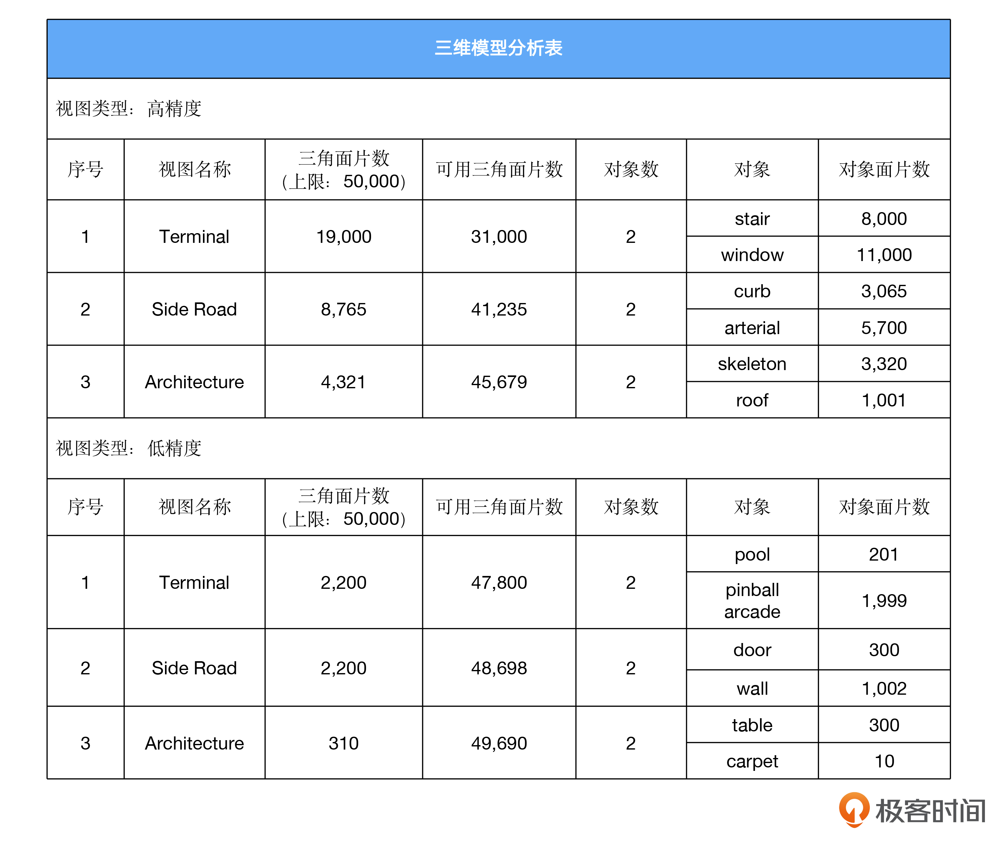
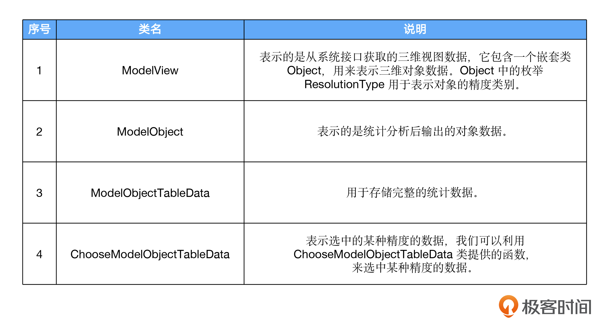
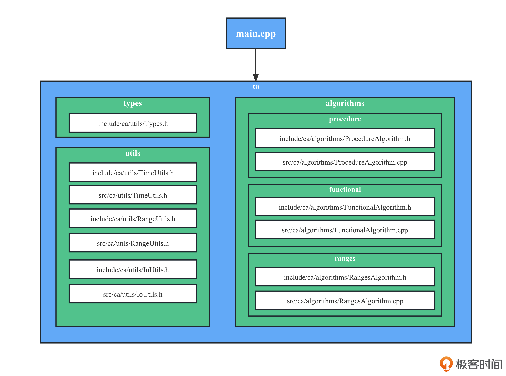

# 13｜Ranges实战：数据序列函数式编程
你好，我是卢誉声。

通过前面的学习，我们已经了解到，C++ Ranges作为基础编程工具，可以大幅加强函数式编程的代码可读性和可维护性，解决了C++传统函数式编程的困境。在C++20的加持下，我们终于可以优雅地处理大规模数据了。

在讲解完Ranges的概念和用法后，我们还是有必要通过实战来融会贯通C++ Ranges。它的用法比较灵活，在熟练使用后，我相信你会在今后的代码实现中对它爱不释手。

在处理规模型数据时，函数式编程特别有用。为了让你建立更直观的感受，今天我为你准备了一个实战案例，设计一个简单的统计分析程序，用来分析三维视图中的对象。

好，话不多说，让我们从工程的基本介绍开始吧（课程完整代码，你可以从 [这里](https://github.com/samblg/cpp20-plus-indepth) 获取）。

## 模块设计

在这个实战案例里，我们主要是展示Ranges的强大功能，而非数据本身的严谨性和正确性。因此，你可以重点关注处理数据的部分。

那么， **要分析统计的数据长什么样子呢？** 我们假设一个三维模型包含多个视图，每个视图包含一定量的三维对象。某个三维对象中的三角面片就组成了逻辑上的三维对象。同时，三维模型会将视图分成高精度视图和低精度视图。

我造了一份简单的数据，一个三维模型的统计分析表是后面这样。



在这个案例中，我们先从系统接口获取数据，再基于这些数据生成表中的统计数据。系统接口的数据格式，都定义在了关键数据类型这个头文件（include/Types.h）中。代码是后面这样。

```c++
#pragma once

#include <cstdint>
#include <string>
#include <chrono>
#include <vector>

namespace ca::types {
    namespace chrono = std::chrono;

    using Id = int32_t;
    using ZonedTime = chrono::zoned_time<std::chrono::system_clock::duration, const chrono::time_zone*>;

    // 从API接口获取到的视图数据
    struct ModelView {
        // API接口中的三维对象数据
        struct Object {
            // 对象精度类型
            enum class ResolutionType {
                High,
                Low
            };

            // 对象类型ID
            Id objectTypeID;
            // 对象名称
            std::string name;
            // 对象中各部件的面片数量（数组）
            std::vector<int32_t> meshCounts;
        };

        // 视图ID
        Id viewId = 0;
        // 视图类型名称
        std::string viewTypeName;
        // 视图名称
        std::string viewName;
        // 创建时间
        std::string createdAt;
        // 三维对象列表
        std::vector<Object> viewObjectList;

        // 操作符重载，需要供算法使用
        bool operator<(const ModelView& rhs) const {
            if (createdAt < rhs.createdAt) {
                return true;
            }

            if (viewName > rhs.viewName) {
                return true;
            }

            return false;
        }

        bool operator>(const ModelView& rhs) const {
            if (createdAt > rhs.createdAt) {
                return true;
            }

            if (viewName < rhs.viewName) {
                return true;
            }

            return false;
        }

        bool operator>=(const ModelView& rhs) const {
            return *this == rhs || *this > rhs;
        }

        bool operator<=(const ModelView& rhs) const {
            return *this == rhs || *this < rhs;
        }

        bool operator==(const ModelView& rhs) const {
            return createdAt == rhs.createdAt && viewName == rhs.viewName;
        }
    };

    // 统计后存储的对象数据
    struct ModelObject {
        // 视图序号
        int32_t viewOrder = 0;
        // 视图ID
        Id viewId = 0;
        // 视图类型名称
        std::string viewTypeName;
        // 视图名称
        std::string viewName;
        // 视图创建时间
        ZonedTime createdAt;

        // 对象类型ID
        Id objectTypeID = 0;
        // 对象名称
        std::string objectName;
        // 对象包含的三角面片数量
        int32_t meshCount = 0;
        // 对象在视图中的序号
        int32_t viewObjectIndex = 0;
        // 视图中剩余已用三角面片数量
        int32_t viewUsedMeshCount = 0;
        // 视图中可用三角面片数量上限
        int32_t viewTotalMeshCount = 0;
        // 视图中剩余可用三角面片数量
        int32_t viewFreeMeshCount = 0;
        // 视图中对象数量
        size_t viewObjectCount = 0;

        // 获取完整视图名称
        std::string getCompleteViewName() const {
            return viewTypeName + "/" + viewName;
        }

        // 获取对象Key
        std::string getObjectKey() const {
            return getObjectKey(objectTypeID, viewId);
        }

        // 根据objectTypeID和viewId获取对象Key
        static std::string getObjectKey(Id objectTypeID, Id viewId) {
            return std::to_string(objectTypeID) + "-" + std::to_string(viewId);
        }
    };

    // 所有统计后的对象数据
    struct ModelObjectTableData {
        // 高精度对象
        std::vector<ModelObject> highResolutionObjects;
        // 低精度对象
        std::vector<ModelObject> lowResolutionObjects;
        // 三角面片数
        int32_t meshCount;
    };

    // 被选择的某种精度的数据
    struct ChoseModelObjectTableData {
        // 当前对象数据
        const ModelObjectTableData* objectTableData;
        // 选择精度类型
        ModelView::Object::ResolutionType resolutionType;

        // 获取当前对象数据
        const std::vector<ModelObject>& getCurrentModelObjects() const {
            return resolutionType == ModelView::Object::ResolutionType::Low ?
                objectTableData->lowResolutionObjects : objectTableData->highResolutionObjects;
        }
    };

    // 从统计后的对象数据中选择某种精度的数据
    inline ChoseModelObjectTableData chooseModelObjectTable(
        const ModelObjectTableData& objectTableData,
        ModelView::Object::ResolutionType resolutionType
    ) {
        return {
            .objectTableData = &objectTableData,
            .resolutionType = resolutionType,
        };
    }
}

```

在这段代码中，定义了几个类，具体说明我用表格的形式做了整理。



至于类的数据成员，你可以对照文稿中的代码来具体了解。现在，我们有了关键数据类型定义，在这个基础上，我们就可以开始考虑如何设计程序的模块了。

这次，我们采用传统C++模块划分来实现整个工程。在学习的过程中，你可以思考一下，如何使用C++ Modules来改造代码的组织方式。

后面我画了示意图，方便你了解模块的结构和划分。



从图里可以看到，除了main.cpp作为程序入口以外，所有代码都放在ca（ca指的是correlations algorithm，即统计算法）模块下。该模块包含了三个子模块。

- types：基础类型定义。
- utils：工具模块，包括时间工具库、输入输出工具库和Ranges工具库。
- algorithms：算法模块，包括procedure、functional、ranges单个子模块，分别对应过程化算法实现、函数式算法实现和基于Ranges的函数式算法实现。

因为我们关注的重点是 **跟Ranges库相关的逻辑**，所以我们就沿着主模块（main函数）和算法模块（algorithms）这条路线，利用Ranges来实现相关的统计分析功能。至于工具模块，只是提供了一些基本工具函数，不是我们学习的重点，你可以参考完整的 [工程代码](https://github.com/samblg/cpp20-plus-indepth/tree/main/13)，了解其具体实现。

## 主模块

在主模块中，我定义了统计分析的接口，代码实现在src/main.cpp中。

```c++
#include "data.h"

#include "ca/IoUtils.h"
#include "ca/algorithms/ProcedureAlgorithm.h"
#include "ca/algorithms/FunctionalAlgorithm.h"
#include "ca/algorithms/RangesAlgorithm.h"

#include <iostream>
#include <set>

int main() {
    using ca::types::ModelObjectTableData;
    using ResolutionType = ca::types::ModelView::Object::ResolutionType;

    // 获取对象信息
    auto modelObjectsInfo = getModelObjectsInfo();

    auto& highResolutionObjectSet = modelObjectsInfo.highResolutionObjectSet;
    int32_t meshCount = modelObjectsInfo.meshCount;
    auto& modelViews = modelObjectsInfo.modelViews;

    // 过程化算法实现
    auto procedureObjectTable = ca::algorithms::procedure::parseModelObjectTableData(
        modelViews,
        highResolutionObjectSet,
        meshCount
    );
    std::cout << ca::types::chooseModelObjectTable(procedureObjectTable, ResolutionType::High) << std::endl;
    std::cout << ca::types::chooseModelObjectTable(procedureObjectTable, ResolutionType::Low) << std::endl;

    // 函数式算法实现（传统STL）
    ModelObjectTableData functionalObjectTable = {
        .meshCount = meshCount
    };
    ca::algorithms::functional::parseModelObjectTableData(
        modelViews.begin(),
        modelViews.end(),
        highResolutionObjectSet,
        meshCount,
        std::back_inserter(functionalObjectTable.lowResolutionObjects),
        std::back_inserter(functionalObjectTable.highResolutionObjects)
    );
    std::cout << ca::types::chooseModelObjectTable(functionalObjectTable, ResolutionType::High) << std::endl;
    std::cout << ca::types::chooseModelObjectTable(functionalObjectTable, ResolutionType::Low) << std::endl;

    // 函数式算法实现（Ranges）
    auto rangesObjectTable = ca::algorithms::ranges::parseModelObjectTableData(modelViews, highResolutionObjectSet, meshCount);
    std::cout << ca::types::chooseModelObjectTable(rangesObjectTable, ResolutionType::High) << std::endl;
    std::cout << ca::types::chooseModelObjectTable(rangesObjectTable, ResolutionType::Low) << std::endl;

    return 0;
}

```

从实现代码可以看到，我们首先调用了getModelObjectsInfo函数，通过系统接口获取视图数据。视图数据是一个结构体，包括后面这些数据。

- modelViews：视图数据列表。
- highResolutionObjectSet：高精度的对象集合。
- meshCount：每个视图可以使用的三角面片的数量上限。

接着，分别调用了以下3个不同的算法接口，使用不同范式实现了对相同数据的处理。

1.过程式接口：ca::algorithms:: **procedure**::parseModelObjectTableData。

2.传统函数式接口：ca::algorithms:: **functional**::parseModelObjectTableData。

3.基于Ranges的函数式接口：ca::algorithms:: **ranges**::parseModelObjectTableData。

传统函数式算法接口的输入参数比较特殊，由于传统的STL算法在数据的输入输出上，都使用迭代器而非容器，因此我们也模仿这种风格。最后，我们还需要调用chooseModelObjectTable来选择高精度或低精度对象，并将对象通过cout输出到标准输出中。

现在，我们来看一下刚才提到的getModelObjectsInfo函数，通过系统接口获取视图数据。该函数声明在include/data.h中。

```c++
#pragma once

#include "ca/Types.h"
#include <set>
#include <string>
#include <cstdint>

struct ModelObjectsInfo {
    // 视图数据列表
    std::vector<ca::types::ModelView> modelViews;
    // 高精度对象集合
    std::set<std::string> highResolutionObjectSet;
    // 3D模型可用三角面片总数
    int32_t meshCount;
};

ModelObjectsInfo getModelObjectsInfo();

```

函数的实现代码在src/data.cpp中。

```c++
#include "data.h"

ModelObjectsInfo getModelObjectsInfo() {
    return {
        .modelViews = {
            {
                .viewId = 1,
                .viewTypeName = "Building",
                .viewName = "Terminal",
                .createdAt = "2020-09-01T08:00:00+0800",
                .viewObjectList = {
                    {
                        .objectTypeID = 1,
                        .name = "stair",
                        .meshCounts = { 2000, 3000, 3000 },
                    },
                    {
                        .objectTypeID = 2,
                        .name = "window",
                        .meshCounts = { 3000, 4000, 4000 },
                    },
                    {
                        .objectTypeID = 3,
                        .name = "pool",
                        .meshCounts = { 100, 101 },
                    },
                    {
                        .objectTypeID = 4,
                        .name = "pinball arcade",
                        .meshCounts = { 1000, 999 },
                    },
                },
            },
            {
                .viewId = 2,
                .viewTypeName = "Building",
                .viewName = "Side Road",
                .createdAt = "2020-09-01T08:00:00+0800",
                .viewObjectList = {
                    {
                        .objectTypeID = 5,
                        .name = "curb",
                        .meshCounts = { 1000, 1000, 1000, 65 },
                    },
                    {
                        .objectTypeID = 6,
                        .name = "arterial",
                        .meshCounts = { 1000, 2000, 2700 },
                    },
                    {
                        .objectTypeID = 7,
                        .name = "door",
                        .meshCounts = { 60, 40, 200 },
                    },
                    {
                        .objectTypeID = 8,
                        .name = "wall",
                        .meshCounts = { 200, 500, 302 },
                    },
                },
            },
            {
                .viewId = 3,
                .viewTypeName = "Building",
                .viewName = "Architecture",
                .createdAt = "2020-09-01T08:00:00+0800",
                .viewObjectList = {
                    {
                        .objectTypeID = 9,
                        .name = "skeleton",
                        .meshCounts = { 1000, 1000, 1000, 320 },
                    },
                    {
                        .objectTypeID = 10,
                        .name = "roof",
                        .meshCounts = { 500, 501 },
                    },
                    {
                        .objectTypeID = 11,
                        .name = "table",
                        .meshCounts = { 50, 50, 100, 100 },
                    },
                    {
                        .objectTypeID = 12,
                        .name = "carpet",
                        .meshCounts = { 2, 2, 2, 1, 3 },
                    },
                },
            },
        },
        .highResolutionObjectSet = {
            "1-1",
            "2-1",
            "5-2",
            "6-2",
            "9-3",
            "10-3",
        },
        .meshCount = 50000,
    };
}

```

在这里，我选择直接返回了硬编码的数据，这种方式充分利用了C++20的初始化表达式扩展，让初始化代码变得和直接编写JSON一样简单。数据本身就是需求中表格的详细数据。

我在这里简化了数据初始化的过程，你也可以考虑使用外部数据作为程序的输入。

接下来，我们重点看看算法模块，其中包含了关键的Ranges用法，所以该模块是整个工程实战的重头戏。

## 算法模块

算法模块分别包含传统过程式实现，函数式实现（基于传统STL）和采用Ranges的函数式实现的分析算法。

为什么要展示不同方案呢？这是为了让你有个对比，也能突出使用Ranges版本的优势。

### 过程化实现

先来看过程化算法，我们先编写头文件include/ca/algorithms/ProcedureAlgorithm.h。

```c++
#pragma once
#include "ca/Types.h"
#include <set>

namespace ca::algorithms::procedure {
    ca::types::ModelObjectTableData parseModelObjectTableData(
        // 视图数据
        std::vector<ca::types::ModelView> modelViews,
        // 高精度对象集合
        const std::set<std::string>& highResolutionObjectSet,
        // 三角面片数上限
        int32_t meshCount
    );
}

```

这里声明了几个简单的数据成员变量，对照代码和注释，你就能知道它们的用途。

接下来，我们来看具体的算法实现。

```c++
#include "ca/algorithms/ProcedureAlgorithm.h"
#include "ca/TimeUtils.h"
#include <iostream>
#include <map>
#include <cstdint>
#include <iostream>
#include <algorithm>
#include <numeric>

namespace ca::algorithms::procedure {
    using ca::types::ModelObjectTableData;
    using ca::types::ModelView;
    using ca::types::ModelObject;
    using ca::utils::timePointFromString;

    ModelObjectTableData parseModelObjectTableData(
        std::vector<ModelView> modelViews,
        const std::set<std::string>& highResolutionObjectSet,
        int32_t meshCount
    ) {
        std::cout << "[PROCEDURE] Parse model objects table data" << std::endl;

        // 对视图数组进行排序
        std::sort(modelViews.begin(), modelViews.end());

        // 低精度对象
        std::vector<ModelObject> highResolutionObjects;
        // 高精度对象
        std::vector<ModelObject> lowResolutionObjects;

        int32_t viewOrder = 0;
        // 遍历视图
        for (const auto& modelView : modelViews) {
            auto viewId = modelView.viewId;
            auto& viewTypeName = modelView.viewTypeName;
            auto& viewName = modelView.viewName;
            auto& viewObjectList = modelView.viewObjectList;
            auto& createdAt = modelView.createdAt;
            viewOrder++;

            // 本视图的低精度对象
            std::vector<ModelObject> lowResolutionModelObjects;
            // 本视图的低精度对象面片数总和
            int32_t lowResolutionMeshCounts = 0;
            // 本视图的高精度对象
            std::vector<ModelObject> highResolutionModelObjects;
            // 本视图的高精度对象面片数总和
            int32_t doubleResolutionMeshCounts = 0;

            // 遍历视图的对象信息，将对象的数据按高低精度添加到各自的数组并更改统计数据
            for (const auto& viewObject : modelView.viewObjectList) {
                // 遍历meshCounts计算对象的总面片数
                int32_t objectMeshCount = 0;
                for (int meshCount : viewObject.meshCounts) {
                    objectMeshCount += meshCount;
                }

                ModelObject modelObject = {
                    .viewOrder = viewOrder,
                    .viewId = viewId,
                    .viewTypeName = viewTypeName,
                    .viewName = viewName,
                    .createdAt = timePointFromString(createdAt),
                    .objectTypeID = viewObject.objectTypeID,
                    .objectName = viewObject.name,
                    .meshCount = objectMeshCount
                };

                // 确定对象是否是高精度对象
                if (highResolutionObjectSet.find(modelObject.getObjectKey()) == highResolutionObjectSet.end()) {
                    // 低精度对象
                    lowResolutionMeshCounts += objectMeshCount;
                    lowResolutionModelObjects.push_back(modelObject);
                }
                else {
                    // 高精度对象
                    doubleResolutionMeshCounts += objectMeshCount;
                    highResolutionModelObjects.push_back(modelObject);
                }
            }

            // 计算低精度视图统计信息，原地修改低精度对象信息
            for (auto& modelObject : lowResolutionModelObjects) {
                modelObject.viewUsedMeshCount = lowResolutionMeshCounts;
                modelObject.viewTotalMeshCount = meshCount;
                modelObject.viewFreeMeshCount = meshCount - lowResolutionMeshCounts;
                modelObject.viewObjectCount = lowResolutionModelObjects.size();

                lowResolutionObjects.push_back(modelObject);
            }

            // 计算高精度视图统计信息，原地修改高精度对象信息
            for (auto& modelObject : highResolutionModelObjects) {
                modelObject.viewUsedMeshCount = doubleResolutionMeshCounts;
                modelObject.viewTotalMeshCount = meshCount;
                modelObject.viewFreeMeshCount = meshCount - doubleResolutionMeshCounts;
                modelObject.viewObjectCount = highResolutionModelObjects.size();

                highResolutionObjects.push_back(modelObject);
            }
        }

        // 返回数据
        return ModelObjectTableData{
            .highResolutionObjects = highResolutionObjects,
            .lowResolutionObjects = lowResolutionObjects,
            .meshCount = meshCount,
        };
    }
}

```

这里，我们按照标准的过程化编程思路进行编程，这是一种非常平凡的方法——按部就班地处理数据。但是，有必要提一下这段代码的两个特性。

1.除了sort函数以外，统计分析基本都通过for循环完成。

2.在数据处理时，存在大量的原地修改。

这几点特性在过程化编程中很常见。不过，这种原地修改数据的行为，不利于数据的处理和计算。

虽然原地修改数据可能在简单的程序中很实用，但在复杂的程序中，理论上每个变量应该都只有唯一用途，这么做会让一个变量在程序的不同位置上具备不同的用途。在并行程序中，这种行为会引发数据竞争，反而可能降低并行程序处理性能。所以，在很多时候，对于一个复杂数据处理程序，我们应该避免原地修改数据。

### 传统STL函数式实现

那么，如果用函数式编程的方法实现，会有什么变化呢？接下来，我们就看看基于传统STL的、函数式算法的实现版本。

先看头文件的定义，具体代码放在了include/ca/algorithms/FunctionalAlgorithm.h下面。

```c++
#pragma once
#include "ca/Types.h"
#include <set>
#include <vector>

namespace ca::algorithms::functional {
    using ModelObjectOutputIterator = std::back_insert_iterator<std::vector<ca::types::ModelObject>>;
    void parseModelObjectTableData(
        // 视图begin迭代器
        std::vector<ca::types::ModelView>::const_iterator modelViewsBegin,
        // 视图end迭代器
        std::vector<ca::types::ModelView>::const_iterator modelViewsEnd,
        // 高精度对象集合
        const std::set<std::string>& highResolutionObjectSet,
        // 三角面片数上限
        int32_t meshCount,
        // 低精度对象输出迭代器，用于输出插入低精度对象
        ModelObjectOutputIterator lowResolutionObjectOutputIterator,
        // 高精度对象输出迭代器，用于输出插入高精度对象
        ModelObjectOutputIterator highResolutionObjectOutputIterator
    );
}

```

接下来，是这种方法的具体实现，代码在src/ca/algorithms/FunctionalAlgorithm.cpp中。建议你大致浏览一下代码，想想和前面过程化实现有什么不同，然后我们再进一步探讨。

```c++
#include "ca/algorithms/FunctionalAlgorithm.h"
#include "ca/TimeUtils.h"
#include <iostream>
#include <map>
#include <tuple>
#include <cstdint>
#include <iostream>
#include <algorithm>
#include <numeric>

using ca::types::ModelObjectTableData;
using ca::types::ModelView;
using ca::types::ModelObject;
using ca::utils::timePointFromString;

namespace ca::algorithms::functional {
    static void extractHighOrLowResolutionObjects(
        // 排序后的视图数组
        const std::vector<ca::types::ModelView>& modelViews,
        // 高精度对象集合
        const std::set<std::string>& highResolutionObjectSet,
        // 三角面片数上限
        int32_t meshCount,
        // 是否要提取高精度数据，参数为true时提取高精度数据，参数为false时提取低精度数据
        bool isHigh,
        // 对象输出迭代器，用于输出插入对象数据（高精度或双精度）
        ModelObjectOutputIterator outputIterator
    );

    void parseModelObjectTableData(
        std::vector<ModelView>::const_iterator modelViewsBegin,
        std::vector<ModelView>::const_iterator modelViewsEnd,
        const std::set<std::string>& highResolutionObjectSet,
        int32_t meshCount,
        ModelObjectOutputIterator lowResolutionObjectOutputIterator,
        ModelObjectOutputIterator highResolutionObjectOutputIterator
    ) {
        std::cout << "[FUNCTIONAL] Parse model object data" << std::endl;

        // 对视图数组进行排序
        std::vector<ModelView> sortedModelViews;
        std::copy(modelViewsBegin, modelViewsEnd, std::back_inserter(sortedModelViews));
        std::sort(sortedModelViews.begin(), sortedModelViews.end());

        // 提取低精度对象数据，通过lowResolutionObjectOutputIterator输出数据
        extractHighOrLowResolutionObjects(
            sortedModelViews,
            highResolutionObjectSet,
            meshCount,
            false,
            lowResolutionObjectOutputIterator
        );

        // 提取高精度对象数据，通过highResolutionObjectOutputIterator输出数据
        extractHighOrLowResolutionObjects(
            sortedModelViews,
            highResolutionObjectSet,
            meshCount,
            true,
            highResolutionObjectOutputIterator
        );
    }

    static void extractHighOrLowResolutionObjects(
        const std::vector<ca::types::ModelView>& modelViews,
        const std::set<std::string>& highResolutionObjectSet,
        int32_t meshCount,
        bool isHigh,
        ModelObjectOutputIterator outputIterator
    ) {
        // 生成对象数据（高精度或双精度）
        // 将模型三维对象数组转换成一个新数组，数组元素是每个视图的对象数组（返回的是二维数组）
        std::vector<std::vector<ModelObject>> objectsOfViews;
        auto modelViewsData = modelViews.data();

        std::transform(
            modelViews.begin(), modelViews.end(), std::back_inserter(objectsOfViews),
            [modelViewsData, &highResolutionObjectSet, meshCount, isHigh](const auto& modelView) {
                // 通过视图指针地址计算视图序号
                int32_t viewOrder = static_cast<int32_t>(&modelView - modelViewsData + 1);

                // 筛选满足要求的对象（高精度或低精度）
                const std::vector<ModelView::Object>& viewObjectList = modelView.viewObjectList;
                std::vector<ModelView::Object> filteredViewObjectList;
                std::copy_if(
                    viewObjectList.begin(), viewObjectList.end(),
                    std::back_inserter(filteredViewObjectList),
                    [&modelView, &highResolutionObjectSet, isHigh](const ModelView::Object& viewObject) {
                        auto viewId = modelView.viewId;
                        auto objectTypeID = viewObject.objectTypeID;
                        // 通过ModelObject::getObjectKey获取对象的key（格式为objectTypeID-viewId）
                        auto objectKey = ModelObject::getObjectKey(objectTypeID, viewId);

                        // 如果高精度对象集合中存在该对象返回true，可以筛选出高精度对象
                        // 如果不存在则返回false，可以筛选出低精度对象
                        return highResolutionObjectSet.contains(objectKey) == isHigh;
                    }
                );

                // 计算各对象总面片数，生成对象数组
                std::vector<ModelObject> highResolutionObjects;
                std::transform(
                    filteredViewObjectList.begin(), filteredViewObjectList.end(), std::back_inserter(highResolutionObjects),
                    [&modelView, &highResolutionObjectSet, &filteredViewObjectList, viewOrder](const auto& viewObject) {
                        auto viewId = modelView.viewId;
                        auto& viewTypeName = modelView.viewTypeName;
                        auto& viewName = modelView.viewName;
                        auto& viewObjectList = modelView.viewObjectList;
                        auto& createdAt = modelView.createdAt;
                        auto objectTypeID = viewObject.objectTypeID;

                        // 求对象总面片数
                        const auto& meshCounts = viewObject.meshCounts;
                        auto objectMeshCount = std::accumulate(meshCounts.begin(), meshCounts.end(), 0);

                        return ModelObject{
                            .viewOrder = viewOrder,
                            .viewId = viewId,
                            .viewTypeName = viewTypeName,
                            .viewName = viewName,
                            .createdAt = timePointFromString(createdAt),
                            .objectTypeID = viewObject.objectTypeID,
                            .objectName = viewObject.name,
                            .meshCount = objectMeshCount
                        };
                    }
                );

                // 求视图已占用面片数
                auto viewUsedMeshCount = std::accumulate(
                    highResolutionObjects.begin(), highResolutionObjects.end(), 0,
                    [](int32_t prev, const auto& modelObject) {
                        return prev + modelObject.meshCount;
                    }
                );

                // 生成完整的对象数据
                std::vector<ModelObject> resultModelObjects;
                auto viewObjectCount = highResolutionObjects.size();
                std::transform(
                    highResolutionObjects.begin(), highResolutionObjects.end(), std::back_inserter(resultModelObjects),
                    [viewUsedMeshCount, meshCount, viewObjectCount](const auto& incomingModelObject) {
                        // 返回全新的ModelObject对象，不原地修改数据
                        return ModelObject{
                            .viewOrder = incomingModelObject.viewOrder,
                            .viewId = incomingModelObject.viewId,
                            .viewTypeName = incomingModelObject.viewTypeName,
                            .viewName = incomingModelObject.viewName,
                            .createdAt = incomingModelObject.createdAt,
                            .objectTypeID = incomingModelObject.objectTypeID,
                            .objectName = incomingModelObject.objectName,
                            .meshCount = incomingModelObject.meshCount,
                            .viewUsedMeshCount = viewUsedMeshCount,
                            .viewTotalMeshCount = meshCount,
                            .viewFreeMeshCount = meshCount - viewUsedMeshCount,
                            .viewObjectCount = viewObjectCount,
                    };
                    }
                );

                // 返回完整的对象数据
                return resultModelObjects;
            }
        );

        // 展平二维数组
        std::for_each(
            objectsOfViews.begin(), objectsOfViews.end(),
            [&outputIterator](const auto& modelObjects) {
                outputIterator = std::copy(modelObjects.begin(), modelObjects.end(), outputIterator);
            }
        );
    }
}

```

看完这段代码实现，有没有什么感想或发现？

**没错，代码更复杂了？！**

这比纯粹的过程式代码还要长，函数parseModelObjectTableData的计算过程，总共分为三步。

第一步，采用sort算法函数排序视图数组。第二步，调用extractHighOrLowResolutionObjects提取低精度对象数据，通过lowResolutionObjectOutputIterator输出数据。第三步，还是调用上一步的函数，通过highResolutionObjectOutputIterator输出数据。

在这个函数中，我们调用了transform算法，将对象的数组转换成一个新数组。同时，为了把二维数组展平成一维数组，我们通过for\_each将二维数组中的子数组的数据，都拷贝到了最终的输出迭代器中。

现在，我们分析一下这种传统函数式编程方案有哪些特点。

**首先，它基于STL实现，所有的任务都转换成了函数。**

包括将循环都转换成了transform（映射）、copy\_if（筛选）和accumulate（聚合计算）。其中，transform算法将一个数组中的元素映射到另一个数组中，类似于Python和JavaScript中的map函数。

在代码的第85行，copy\_if算法遍历了迭代器中的数据，将符合copy\_if中条件函数的元素写入到输出迭代器中，本质类似于Python和JavaScript中filter的效果。

**其次，数据处理过程中尽量避免出现副作用。**

比如说，在原地排序前，我们先复制数据。在transform和copy\_if时，都创建了一个新的空数组，然后通过back\_inserter获取插入迭代器，然后将输入插入到新数组中。同时，避免在transform的过程中修改输入参数（输入数组的元素）。

**最后，在复杂的计算过程中，将类似的任务提取出来，然后分段处理数组。**

比如说，在第46行和55行，调用了两次extractHighOrLowResolutionObjects函数，也就是需要遍历两次视图，所以相对于过程化版本需要多一次循环。但是，从时间复杂度上看，没有本质区别。

接下来，我们思考这样一个问题—— **如果比较传统STL函数式编程和过程实现的方案，哪种方案编程效率更高？**

从表面上看，这种编码方案比过程式方案复杂。

但是，考虑到并行化处理问题，比如将高精度、低精度的计算任务分别放在两个线程上执行。那么，由于这种函数式处理方式不会产生对数据的副作用，在处理大规模数据时，无需担心数据竞争和加锁的问题。因此，这种编程方案，执行效率反而更高。

不过，这段代码看起来还是过于冗长了，而且编码效率低下。所以，我们还是得靠Ranges库来改善函数式编程的开发效率。

### 基于Ranges的函数式实现

现在，让我们聚焦在Ranges库上，看看基于Ranges的函数式算法是怎么实现的。

头文件定义在include/ca/algorithms/RangesAlgorithm.h中。

```c++
#pragma once
#include "ca/Types.h"
#include <set>
namespace ca::algorithms::ranges {
    ca::types::ModelObjectTableData parseModelObjectTableData(
        // 视图数据
        std::vector<ca::types::ModelView> modelViews,
        // 高精度对象集合
        const std::set<std::string>& highResolutionObjectSet,
        // 三角面片数上限
        int32_t meshCount
    );
}

```

对头文件对应的具体实现是这样。

```c++
#include "ca/algorithms/RangesAlgorithm.h"
#include "ca/TimeUtils.h"
#include "ca/RangeUtils.h"
#include <iostream>
#include <ranges>
#include <algorithm>
#include <numeric>

using ca::types::ModelObjectTableData;
using ca::types::ModelView;
using ca::types::ModelObject;
using ca::utils::timePointFromString;

namespace ca::algorithms::ranges {
    namespace ranges = std::ranges;
    namespace views = std::views;

    using ca::utils::sizeOfRange;
    using ca::utils::views::to;

    // 提取对象
    static std::vector<ModelObject> extractHighOrLowResolutionObjects(
        // 排序后的视图数组
        const std::vector<ca::types::ModelView>& modelViews,
        // 高精度对象集合
        const std::set<std::string>& highResolutionObjectSet,
        // 三角面片数上限
        int32_t meshCount,
        // 是否要提取高精度数据，参数为true时提取高精度数据，参数为false时提取低精度数据
        bool isDouble
    );

    ca::types::ModelObjectTableData parseModelObjectTableData(
        std::vector<ca::types::ModelView> modelViews,
        const std::set<std::string>& highResolutionObjectSet,
        int32_t meshCount
    ) {
        std::cout << "[RANGES] Parse model objects table data" << std::endl;

        // 对视图数组进行排序
        ranges::sort(modelViews);

        return ca::types::ModelObjectTableData{
            // 提取低精度对象数据
            .highResolutionObjects = extractHighOrLowResolutionObjects(
                modelViews,
                highResolutionObjectSet,
                meshCount,
                true
            ),
            // 提取高精度对象数据
            .lowResolutionObjects = extractHighOrLowResolutionObjects(
                modelViews,
                highResolutionObjectSet,
                meshCount,
                false
            ),
            .meshCount = meshCount,
        };
    }

    static std::vector<ModelObject> extractHighOrLowResolutionObjects(
        const std::vector<ca::types::ModelView>& modelViews,
        const std::set<std::string>& highResolutionObjectSet,
        int32_t meshCount,
        bool isHigh
    ) {
        auto modelViewsData = modelViews.data();

        // 生成对象数据（高精度或双精度）
        // 将模型三维对象数组转换成一个新数组，数组元素是每个视图的对象数组（返回的是二维数组）
        return modelViews |
            views::transform([modelViewsData, &highResolutionObjectSet, meshCount, isHigh](const auto& modelView) {
            // 通过视图指针地址计算视图序号
                int32_t viewOrder = static_cast<int32_t>(&modelView - modelViewsData + 1);
                const std::vector<ModelView::Object>& viewObjectList = modelView.viewObjectList;

                auto filteredModelObjects = viewObjectList |
                    // 筛选满足要求的对象（高精度或低精度）
                    views::filter([&modelView, &highResolutionObjectSet, isHigh](const ModelView::Object& viewObject) {
                        auto viewId = modelView.viewId;
                        auto objectTypeID = viewObject.objectTypeID;
                        auto objectKey = ModelObject::getObjectKey(objectTypeID, viewId);

                        return highResolutionObjectSet.contains(objectKey) == isHigh;
                    }) |
                    // 计算各对象总面片数，生成对象数组
                    views::transform([&modelView, &highResolutionObjectSet, viewOrder](const auto& viewObject) {
                        auto viewId = modelView.viewId;
                        auto& viewTypeName = modelView.viewTypeName;
                        auto& viewName = modelView.viewName;
                        auto& viewObjectList = modelView.viewObjectList;
                        auto& createdAt = modelView.createdAt;
                        auto objectTypeID = viewObject.objectTypeID;

                        const auto& meshCounts = viewObject.meshCounts;
                        auto objectMeshCount = std::accumulate(meshCounts.begin(), meshCounts.end(), 0);

                        return ModelObject{
                            .viewOrder = viewOrder,
                            .viewId = viewId,
                            .viewTypeName = viewTypeName,
                            .viewName = viewName,
                            .createdAt = timePointFromString(createdAt),
                            .objectTypeID = viewObject.objectTypeID,
                            .objectName = viewObject.name,
                            .meshCount = objectMeshCount
                        };
                    });

                    // 计算视图已占用面片数
                    auto viewUsedMeshCount = std::accumulate(
                        filteredModelObjects.begin(),
                        filteredModelObjects.end(),
                        0,
                        [](int32_t prev, const auto& modelObject) { return prev + modelObject.meshCount; }
                    );

                    // 计算视图中的对象数量
                    size_t viewObjectCount = sizeOfRange(filteredModelObjects);

                    // 生成包含统计信息的对象数据
                    return filteredModelObjects |
                        views::transform(
                            [viewUsedMeshCount, meshCount, viewObjectCount](const auto& incomingModelObject) {
                                return ModelObject{
                                    .viewOrder = incomingModelObject.viewOrder,
                                    .viewId = incomingModelObject.viewId,
                                    .viewTypeName = incomingModelObject.viewTypeName,
                                    .viewName = incomingModelObject.viewName,
                                    .createdAt = incomingModelObject.createdAt,
                                    .objectTypeID = incomingModelObject.objectTypeID,
                                    .objectName = incomingModelObject.objectName,
                                    .meshCount = incomingModelObject.meshCount,
                                    .viewUsedMeshCount = viewUsedMeshCount,
                                    .viewTotalMeshCount = meshCount,
                                    .viewFreeMeshCount = meshCount - viewUsedMeshCount,
                                    .viewObjectCount = viewObjectCount,
                                };
                            }
                        ) |
                        to<std::vector<ModelObject>>();
            }) |
            to<std::vector<std::vector<ModelObject>>>() |
            views::join |
            to<std::vector<ModelObject>>();
    }
}

```

你应该感觉到了，这段代码的基本结构和传统的STL版本一样，但是明显简洁不少——最后的代码形式更像函数式编程语言。

这都得益于Ranges带来的以下两个关键变化。

**第一，采用视图替换原本的算法。** 比如说，用views::transform替换std::transform、views::filter替换std::copy\_if，并使用views::join替代std::for\_each，让二维数组展平为一维数组。这样一来，我们就可以直接通过range对象作为输入参数，而不再需要手动获取迭代器，代码更加清晰明了。

**第二，采用视图管道替换原本的过程化衔接。** 比如说，筛选视图中的高精度/低精度对象（ModelView::Object）以及生成对象（ModelObject）的过程，被改写成了视图管道的连接。二维数组的生成与展平过程也通过views::join和视图管道实现。

我们通过Ranges大幅减少了临时变量的定义。否则，在复杂的函数式编码过程中，给这么多临时变量起名，几乎是一个不可能完成的任务。

不过受限于C++20（不考虑C++20的后续演进标准）提供的支持，现在的代码还有几点不足。

第一，算法函数accumulate其实是在头文件<numeric>中，因此并没有提供针对视图的实现，这里我们还是用了迭代器作为输入，希望C++之后能提供其range版本。

第二，视图views::join可以将诸如T<T<E>>这种类型转换为T<E>，也就是将子数组的元素都 “join” 到一起。但是，这个函数无法直接连接嵌套视图，因此，我们需要一个视图适配器，将视图转换为具体容器类型，然后通过join进行转换。

第三，将视图转换为容器需要通过模板函数to<>实现。但这个视图是C++23标准中的，C++20中并没有提供该视图，也就意味着正常情况这段代码无法在C++20中通过编译！

标准不支持，那我们自己实现不就可以了，为此我们在Ranges工具库中实现了模板函数to<>，具体定义在Ranges工具库头文件include/ca/RangeUtils.h中。

```c++
#pragma once

#include <ranges>
#include <algorithm>
#include <numeric>

namespace ca::utils {
    template <std::ranges::range T>
    size_t sizeOfRange(
        T& range
    ) {
        return static_cast<size_t>(std::accumulate(
            range.begin(),
            range.end(),
            0,
            [](int32_t prev, const auto& value) { return prev + 1; }
        ));
    }

    namespace views {
        template <class Container>
        struct ToFn {
        };

        template <class Container>
        ToFn<Container> to() {
            return ToFn<Container>();
        }

        template <class Container, std::ranges::viewable_range Range>
        Container operator | (Range range, const ToFn<Container>& fn) {
            Container container{};
            std::ranges::copy(range, std::back_inserter(container));

            return container;
        }
    }
}

```

由于C++20并不支持自定义视图类型的range适配器闭包对象，这里我们再了解一下实现视图管道的变通方案。

首先回顾一下视图管道。视图管道是一种语法糖：假定C是一个视图适配器闭包对象，R是一个Range对象，编译器可以自动将以下代码中的第1行，转换成第2行的形式。

```c++
R | C
C(R)

```

这里的 \| 就是视图管道的操作符。只不过这种语法糖要求视图适配器闭包对象，要按照特定要求实现operator()操作符重载。但在C++20中，自定义的视图类型是无法通过operator()操作符重载获得视图管道支持的。

虽然编译器无法给予语法糖支持，但开发者可以通过C++标准的操作符重载实现相同的效果。假设R是Range对象的类型，P是自定义适配器闭包对象的类型，如果我们实现下列代码中的函数，就可以实现与视图管道相同的效果了。

```c++
auto operator | (R r, P p) {
  return p(r);
}

```

其实，这么做就是实现了operator \| 的操作符重载，可以针对特定类型的R与P，将R \| P这种表达式转换为P(R）。

如果你希望支持所有的Range视图，那么可以使用concept将该函数定义成后面的形式。

```c++
template <std::ranges::viewable_range R>
auto operator | (R r, P p) {
  return p(r);
}

```

看，这不就实现了跟range适配器闭包对象一样的效果了嘛。

只不过，这种方式要求我们定义一个类型P，作为操作符重载的“占位符”。因此，在这里我们又总结出一个新的概念——将这种不是视图，但为了模拟range适配器闭包对象，而创建的类似于range适配器闭包的类型，称之为“仿range适配器闭包”。

这是受到了C++的仿函数的启发，也是通过()操作符重载来模仿函数行为。虽然需要一些技巧，不过在编译器支持C++23之前，在现阶段我们还需要这种变通方式，希望你能掌握这种编程技巧。

## 总结

这一讲，我们结合一个简单的统计分析程序案例。为了方便你对比，在算法模块我还给出了过程化实现方案和传统STL函数式的实现方案。

通过这一讲的学习，相信你已经直观地感受到了Ranges的强大功能。Ranges可以大幅提高C++中函数式编程的代码可读性，降低代码复杂度，提高函数式编程效率。我们可以通过Ranges库中的视图来简化数据处理过程，并利用管道来替换原有的过程化衔接。

在处理大规模数据的时候，利用Ranges库我们几乎可以避免声明临时变量。现在，C++中的函数式编程变得更加现代，也跟其他支持函数式编程语言一样，实现了类似的编程范式。其实Ranges还有更多使用场景，期待你在日常开发中多多探索。

## 课后思考

我们在一讲中使用Ranges库实现了对数据集合的处理。那么，你能否结合Ranges库实现以下功能？

1.输入一组数据，数据由一系列的字符串组成，每个字符串是一个句子。比如：

- “ C++ 20 is much more powerful than ever before ”
- “ I am learning C++ 20, C++ 23 and C++ 26 ”

2.剔除每个字符串中的数字，返回新的数组。

3.处理的过程中，结合C++ Coroutines来实现异步处理（你可以尝试复用前面课程的代码）。

欢迎把你的代码贴出来，与大家一起分享。我们一同交流。下一讲见！