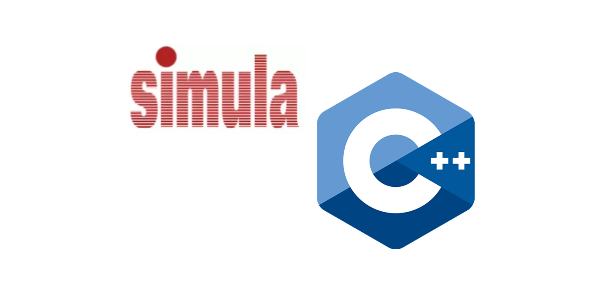
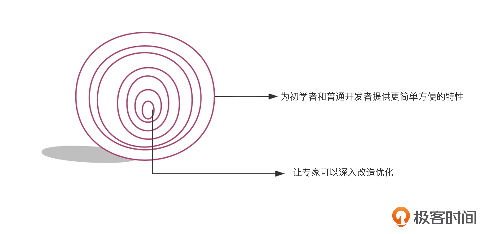

# 23｜未来展望：透过未来标准演进看C++设计哲学
你好，我是卢誉声。

你应该已经发现，自现代C++标准演进开始，其设计哲学是一以贯之的。新特性都是围绕着“将计算提前到编译时而非运行时”设计，进而大幅提升C++程序的性能。

这种高级抽象能力在编程语言领域都是罕见的，而且C++表现得尤其优秀。这也是C++能在编程语言排行榜以及工业界持续发展、长盛不衰的重要原因之一。

在第20讲至22讲，我们已经一窥C++的未来演进标准和设计哲学。那么，这样一套严谨的标准演进路线和设计哲学，是如何诞生和发展的呢？这一讲，就让我们深入探究C++的语言设计哲学、核心范式，洞悉C++语言的未来。

## C++的标准化进程

想要洞悉未来，就得先了解历史，我们先来看看C++的标准化进程。

C++的设计与标准化过程通常可以划分为两个阶段。第一阶段从1979年开始，C++之父Bjarne Stroustrup开始设计C++，并将其用于自己的Unix内核开发工作中，这个时候名字还叫C with Classes。BS在设计语言的同时，开发了一个名为Cfront的工具，将其设计的语言“翻译”为标准的C代码，这个Cfront也就是一个C语言的预处理器。

接着，C++开始逐渐为人所知，并慢慢应用到工业界中，自然就出现了大量其他的实现。这时C++没有统一标准，因此各个编译器都会有自己的不同实现。由于C++超乎想象的广泛应用，ANSI（美国国家标准学会）在1989年成立了C++标准委员会，致力于建立C++标准，在1998年推出了C++98标准，并在2003年推出了针对C++98标准的修正案。

第二阶段从2006年开始（至今还未结束），这时C++98标准和其03修正案已经成为工业界的正式标准，大部分编译器已经提供了良好兼容性，标准委员会开始展望下一代的C++将会有天翻地覆的改变，大家都认为一定能在2010年之前完成这个新标准，因此将其命名为C++0x。

不过事与愿违，由于新特性太多，甚至其改变接近于一门新语言，最终标准被延迟到了2011年正式发布，变成了我们所熟知的C++11。从C++11开始，这门语言已经和第一阶段的语言设计产生了很多不同之处。我们也是从这个时候开始，习惯性地将C++11及其后续演进标准叫做现代C++。

现在，我们将分别从两个阶段讨论C++设计理念的前世今生，及其未来演进。

## C++的早期设计理念

C++的早期设计理念更多来自Bjarne Stroustrup最初的设计，理解它的两个关键词是 **零开销** 和 **高级抽象**。

### 零开销

我们刚才提到过，BS之所以设计C++，是为了有一个更好的工具来编写一个特殊版本的Unix内核，这种Unix内核可以通过本地网络或共享内存在多处理器上运行。

由于C语言当时已经足够成熟，而且BS就在C语言之父Dennis Ritchie和Brian Kernighan办公室隔壁，因此他选择C语言作为这个新工具的基础。当时的C++自然就具备一个和C相同的设计理念——这种新语言必须能够直接高效地操作硬件。

由于BS希望将C++用于系统内核开发，因此C++也有一个隐形的设计要求： **语言设计必须要能够与硬件设施直接映射，无论什么抽象都不能给代码增添任何性能负担**，这一点基本贯彻至今。

### 高层抽象

如果只是零开销，C++必定只能是另一个更好的C，BS设计C++的目的就是在C的基础上提供类似于Simula语言的特性，比如可扩展的强静态类型检查、支持类、支持类的继承，以及协程（你没看错，那个时候就已经提到C++20才支持的协程了😄）。

因此，C++中添加的第一个特性就是类，作为最基础的面向对象能力，这也是为什么一开始命名为 “C with Classes”。BS认为一个对象需要在开始工作之前完成初始化，结束工作后释放相应资源，因此设计了构造函数与析构函数。

同时，C++还引入了模板作为泛型编程的基础，然后引入了异常处理与RAII，用来解决C中错误处理的难题。

通过这里讨论的一些高层抽象特性，我们可以发现，虽然那是一个“面向对象”编程盛行的年代，但是C++并不是一门“纯粹的面向对象语言”，BS的设计理念也是如此。

到C++98标准与03修正案为止，C++也还是这样一门语言，即便在ANSI标准委员会成立后加入了更多的特性，其设计理念没有明显的变化。

## C++的未来演进

回顾了C++的早期设计理念，现在我们再根据C++的标准演进讨论一下C++未来演进的理念。

说到C++演进，就不得不提到HOPL。

HOPL是History of Programming Languages的缩写，是ACM下的一个会议，会议的主要内容是各种编程语言的设计、发展和哲学。从成立至今举办过4次，分别是1978年、1993年、2007年和2021年，大概每14-15年左右举办一次，HOPL4就是2021年举办的第4次HOPL。

C++之父Bjarne Stroustrup在HOPL4上发表论文 “Thriving in a Crowded and Changing World: C++ 2006–2020” 就重点阐述了2006到2020年的标准演化过程，这是我们了解C++发展进程的重要论文。

接下来，我们依据这篇论文的内容，围绕C++核心范式、洋葱理论等内容，展开讨论C++的未来演进。

### 核心范式

核心范式决定了这是一门什么样的编程语言，C++的核心语言范式依然是：支持面向对象编程、支持泛型编程、可扩展的静态类型安全。由此可知，C++这门语言的核心理念并没有发生变化。

但是，说完全没有变化是不准确的，毕竟我们都可以说C++11和C++20是两门“新的语言”了嘛。

我们可以根据C++11和C++20将第二阶段分为两个周期：第一周期就是C++11以及14、17这两个用于完善C++11的标准；第二周期就是C++20以及所能预见的23、26两个标准。

在第一周期（从C++11到C++17），我们可以看到C++从type\_traits开始到Concepts为止，对编译时计算与模板元编程提供了更好的支持，极大丰富了模板编程的应用场景。

从C++20开始，不断在完善标准库Ranges支持，因此C++明显会更好地支持现在编程语言的潮流——函数式编程，在复杂的数据处理方面建立了无与伦比的优势。

因此，我们可以看到 **C++的目标依然是成为一个通用编程语言，但是会以核心编程为基础不断向外扩展延伸，适用于更多的问题场景**。

我的感受是，C++是近似“实用主义”思路下的产物，必然是不被某种范式的“原教旨主义者”喜爱的。

### 依然是效率

无论C++添加了多少新特性，有一个原则是永远不变的——语言特性必须能够直接映射到硬件，从而实现零负担的抽象。换言之，大部分的语言特性，必须在编译时映射成确定的指令（包括操作数），不能等到运行时再动态确定执行路径。

到目前为止，基本（除了虚函数、多重继承以及动态类型转换需要至少多一次访存，或者动态确定执行路径以外）没有太多关键特性违反这个原则，这才是C++的核心生命力所在，也是C++与大部分的现代语言的关键区别。

如果违反这个原则，那么C++也就失去了核心竞争力，因此未来C++的演进是不会变更这个原则的。

### 编译时计算

编译时计算，脱胎于C++98中的（通过模板这一特性提供的）模板元编程。非常奇妙的是，模板元编程并不是C++模板设计之初有意支持的，而是在标准讨论过程中偶尔提出，随后由C++社区发扬光大的。

模板自身其实是图灵完备的——这也是一个意外。

由于越来越多的库实现并利用了模板元编程（比如Boost）。因此，从C++11开始，C++逐渐补充越来越多的模板元编程特性支持。

C++11提出了type\_traits与constexpr，并在C++17中提出模板逻辑操作符来完善了相关的检测逻辑。到C++20时，Concepts和Constraints的正式建立，让C++的模板编程迎来了全新的风格与技术。

至于预计会在C++26列入标准的静态反射（static reflection），则是在现有技术上建立的更加划时代的特性。

随着C++标准更新，constexpr也得到了更强力的支持，越来越多的特性可以在constexpr中使用。这标志着C++在进一步鼓励我们去使用编译时计算，从而更高效地解决对应的问题——因为这的确可以换取运行时更高的效率，这也是C++目前的一个演进趋势。

### 要不要一层层剥开

C++的一个新思路是洋葱原则（onion principle）。

C++的优势在于底层硬件映射与高层抽象能力的结合。很明显，这并非是为编程初学者设计的语言，如果没有很好地了解计算机的底层知识，驾驭C++“复杂”的特性是令人生畏的，编写高质量的C++代码往往比其他语言要困难。

为了解决这个问题，C++做了很多努力，并提出了 **洋葱原则**，为初学者和普通开发者提供更简单方便的特性，让专家可以深入改造优化，这样可以满足各种技术层次开发人员的需求。对照上图，你会发现这非常形象，初学者使用只需要关注洋葱的表面，而专家则可以根据自己的需求去逐渐剥开一层一层的细节。

洋葱原则具体是怎么体现的呢？我在这里举了几个例子。

C++的容器一直都有一个allocator模板参数，允许我们定义容器的内存分配策略。初学者无需关心这个参数，但如果项目中需要使用到内存池或资源池，或者想要控制元素内存对齐的场景时，就可以自己实现allocator来实现相关行为。

C++11引入了统一初始化表达式，允许很多类型（比如容器）都可以像数组那样定义初始数据，也支持通过这种方式调用普通的构造函数，初学者用起来非常方便。但如果我们是库的开发者，就需要了解如何使用initializer\_list这个类型来接收初始化表达式传入的数据。

这样的特性在新标准越来越多，这也就是C++在设计过程中逐渐出现的一种思路，毕竟这样才能同时满足不同场景下的需求，同时让我们在大部分情况下可以更专注于业务处理，而不是那些琐碎的实现细节。

### 哦，你不能让我改代码

C++标准演进的一个大问题其实在于对旧特性的兼容，对于这么一门历史如此之长的语言，自然会有大量的遗留代码。

然而，早期标准中必定有一些因时代原因或其他因素，在目前看来已不合理的特性，在标准演进时，如果随意修改或者废弃特性会产生很严重的后果——开发者会发现，切换到新标准要对原来的代码做翻天覆地的修改。

因此，C++的设计与演进都会尽量去兼容很多看似不合理的旧有特性。比如BS自己在设计C++的时候，就想修改C中不直观的指针类型声明方式，但出于对C的兼容，又不得不保留了这种类型声明方式。

不过随着时代变化，越来越多一开始就学习C++的开发者也意识到这个问题时，标准委员会就在C++11里支持使用using定义类型别名。这在一定程度上缓解了typedef与C类型声明方式不直观的问题，而且也不影响原来使用typedef的代码，毕竟是引入了一个新的特性。

向下兼容是一把双刃剑，毕竟很多旧特性的确会阻碍语言的发展。最典型的就是C++11中废弃了容易被误用的auto\_ptr，然后引入了新的unique\_ptr和shared\_ptr作为替代。这样的修改显然很必要，且在众多特性变化中占比很小，只是在不得已的情况下才会出现。

C++也会废弃、变更一些不再必要或者无人使用的特性。当然这一设计原则也会在标准的未来演进中持续下去。

### 语言还是要解决实际问题

C++对加入标准库中的特性是非常慎重的，因此相对于很多现代语言，C++的标准库的规模实在太小了，这也阻碍了C++在普通业务系统中的应用，毕竟集成大量第三方库是容易出问题的。

因此，在目前的演化中，我们会发现C++标准库在飞速扩充，包括C++11中引入的thread和concurrent，C++17中引入的filesystem，C++20中引入的ranges、format，C++23中引入的mdspan，以及预计在C++26中引入的networking库，以及其他大量针对高性能计算与科学计算的支持。

这正是因为C++标准越来越关注如何解决实际问题，所以添加新特性虽然稳重，但的确能够解决我们的实际需求，至少我本人在编写新项目代码时真的从中受益良多。

在C++标准未来演化过程中这点是令人非常兴奋的——啊，终于有这个特性了！

## 总结

C++之父Bjarne Stroustrup提出了后C++11时代的“列车模型”，列车如期而至，如期发车，C++标准的演进就像列车一般，在预定时间发车，没赶上的特性不得不等待下一班。

不过ISO标准化进程一般是以十年为单位的，这么大的时间跨度也会带来一系列问题：

- 由多委员会联合设计。
- 一些未经验证的想法也可能进入标准。
- 僵化和延迟。

为了解决这样的问题，让现代C++追随甚至引领发展，这种“主要—次要—主要”的列车模型是非常重要的。如果说C++11是主要更新，那么C++14、C++17就更像是列车模型中的次要更新，而下一个主要更新是C++20——看到了么，正好十年。

C++早期的核心设计理念在标准的演化过程中并未改变，在此基础上，静态特性和编译时计算已经变得越来越重要，因为是提升运行时性能的一种有效途径，它将是未来C++发展的核心议题。

同时，洋葱原则也很好地阐释了C++要迎面解决的问题，一方面它要通过新的标准体系以及特性逐渐丰富的标准库，让初学者解决实际问题时可以开箱即用，更容易上手。另一方面，它还会继续提供超级抽象和极高的编程灵活度，让有经验的C++开发者能够深入改造和优化。

## 课后思考

在很多时候，我们甚至将C++11、C++20看作一门“新语言”。你的实际工作中是否实际使用到了C++11和C++20，回顾一下它们让你的开发有了什么改变？

欢迎分享你的感悟，与大家一起分享。我们一起讨论，下一讲见。