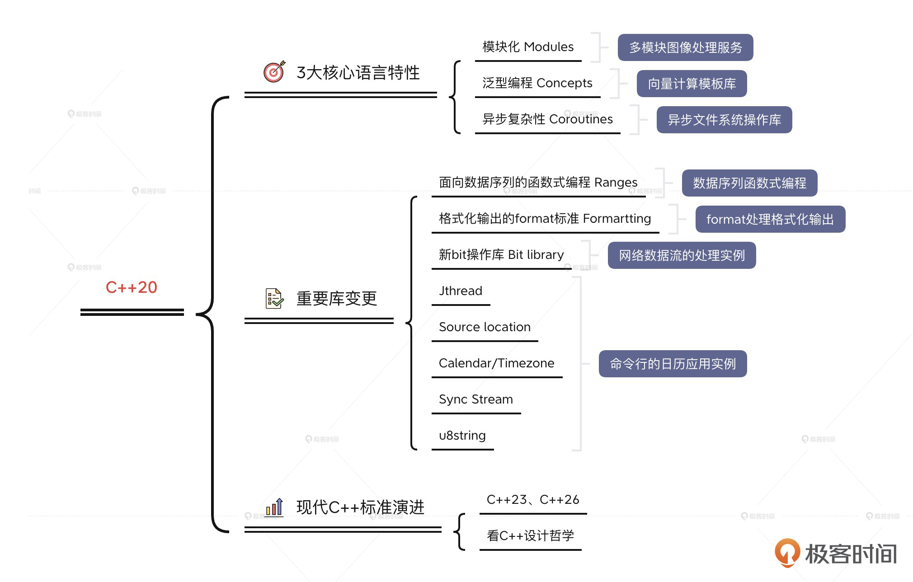

# 开篇词｜为什么掌握现代C++新特性如此重要？
你好，我是卢誉声。

很高兴能在这个专栏与你再见，一起在这个纷繁复杂、瞬息万变的世界中，探寻C++发展至今最大的一次语言变革——C++20，学习和掌握现代C++带来的新编程思想。

离上一次专栏 [《动态规划面试宝典》](https://time.geekbang.org/column/intro/100060501) 结课也快两年了，不知道你的成长如何，我的职业生涯伴随着诸多编程语言的学习和使用在螺旋式前进。作为C++及其现代演进标准的忠实拥趸，我的工作始终离不开C++，同时，看到其他编程语言在各自擅长的领域开疆拓土，也让我对C++的发展及其设计哲学有了更深的理解。

尤其是C++20，让我深刻体会到了什么是现代C++的优雅永不过时，你甚至完全可以把它当作一门全新的现代编程语言来用。

不过，每次提到C++编程，无论你是使用C++的开发者，还是使用其他编程语言和开发环境的开发者，我们对C++的评价往往都是“复杂且难学”。为什么C++会留下这样的口碑？追根溯源，主要有两个原因。

第一个原因是C++的包容性，即向前兼容。

C++类似Objective-C，是C语言的超集，它希望尽量向下兼容C的一切语法和特性（在C99标准之前甚至是完全兼容），因此足够接近硬件底层。但这是把双刃剑。

虽然C99之前语法足够简单，但实际使用的复杂性并不低，而C++为了兼容C语言的语法付出了很大的代价，并在此基础上设计并发展出了多范式的编程模型，这意味着可以继续采用面向过程的编程模式，也可以转向面向对象。与此同时，现代C++还提供了一组函数式编程工具。

因此， **在现代C++得到发展以前，实际开发时到底要选用何种范式或者如何合理组合，一直让我们很头痛**。

C++兼容C有什么代价呢？比如，C的指针类型声明就备受C++之父Bjarne Stroustrup诟病，但是为了向前兼容，不得不在这种声明模式下继续扩展。

第二个原因是C++的设计哲学，“不为任何抽象付出不可接受的多余运行时性能损耗”。

纵观C++40多年的演进历程，可以发现每一次演进所支持的都是和编译时相关的新特性，而相对来说，运行时特性非常少，除了在面向对象的编程模型基础上提出的多态以外，几乎再无运行时特性（其他的均以库的形式提供）。这是因为C++是零成本抽象，也就是说，开发者在使用C++表达抽象概念时，无需忍受多余的运行时性能开销。

因此， **虽然C++具备很多高级抽象的语法特性，但在设计与具体使用过程中，我们仍然需要考虑各种各样的问题**，包括基础对象内存模型、虚函数的设计、基于模板的泛型系统、基于模板的静态反射体系，以及到目前为止都是由编译器决定可选的垃圾回收（在其他现代语言中可以说是必备的特性了），这就让我们学习和使用C++变得更复杂了。

的确，这真够复杂的。一门编程语言必定有其局限性，这也是为什么“更为现代”的Go和Rust出现了，试图解决一些问题，特别是安全性方面。

不过作为语言的使用者，你肯定会问，那今后的C++学习和使用会有哪些变化呢？这个问题，我曾有幸问过C++之父Bjarne Stroustrup。

> 诸如Go和Rust编程语言新贵，它们在发力解决安全性和易用性方面的问题，规避缓冲区溢出这样的漏洞，甚至Linux kernel也开始考虑或采纳对 Rust 的支持，您是否觉得这会成为C++的一个潜在的巨大威胁和挑战？

他的回答简单明了。

> “每隔几年，就会出现C++的挑战者，我相信它们一定会有支持者。但是，C++的独特的语言特性、应用场景，以及C++标准发展的方向，会让C++继续茁壮成长。”

我特别喜欢这个回答。是啊，劣势固然存在，但C++经过历史的检验，在高性能计算、低延迟处理、图形学领域以及机器学习等前沿技术领域有着难以替代的优势。

C++的“复杂且难学”一定程度上取决于向前兼容的能力和设计哲学，但正因如此，维护多年的系统仍然能与全新开发的系统友好地对接和集成，C++的包容性和多样性也让它极具发展力。

自C++11标准诞生以来，我们正式迈入现代C++世界，而C++20及后续演进标准作为继C++11之后的又一次重大变革，给我们带来了新思想、新工具，让我们从容面对以往难以解决的问题，也是我们这门课将学习的重点内容。

### C++新特性

首先，C++20给我们带来了相当重要的三个核心语言特性变更：Modules、Concepts和Coroutines。

Modules从语言层面解决了一个鱼与熊掌不可兼得的关键问题——传统头文件编译范式 **编译性能和符号隔离之间二选一的难题**。有了Modules，C++就能更好地解决符号隔离问题和编译性能问题，这种变化是史无前例的，可以大幅度提高我们开发者的效率。在这之前，我们普遍认为此问题无解。

Concepts是一个C++20的编译期谓语，它根据开发者定义的接口规则，实现了泛型编程中的编译时检查，提升模板元编程代码的可读性，给出了更好的错误信息。在此之前， **模板元编程最为致命的问题就是缺乏良好定义的接口**，导致编译错误晦涩难懂，库的调用者也痛苦不堪。

Coroutines可以在几乎零开销的情况下大幅降低 **C++系统的开发复杂度**，同时可以非侵入式地为现有代码扩展协程接口，它为并发编程、异步编程、异常处理、流处理等场景提供全新的便捷工具。在此之前，我们需要占用更多的资源和系统级封装来实现类似功能，编码和维护的开销很大。

除了这三个核心语言特性变更，C++20及后续演进标准中还提供了更优雅的函数式编程基础设施——Ranges/Constrained algorithms以及诸多重要的库变更。

**更重要的是，在这些新特性和库变更的基础上，我们有了一个新的C++编程范式**——它足够现代、简约，而且带来了解决问题的全新思路，通过C++20及后续演进标准的高级抽象，在不妥协性能的前提下，优化和简化开发手段。

我给你简单举几个例子。

- 通过Modules这一高级概念抽象，解决了模块定义和符号隔离与编译性能间的互斥问题；
- 利用Concepts这一高级接口抽象，提供了模板接口的编译时类型检查能力，同时不牺牲编译期性能；
- 使用Coroutines这一高级异步抽象，实现了基于协程的异步处理框架，屏蔽了协程实现的底层复杂性；
- 通过Ranges这一高级类型抽象，提供极为便捷的集合处理的语言特性支持，驱动我们用函数式编程来实现优雅代码的编写，特别是在大规模数据处理场景。

可以看出，C++20及后续演进标准对C++进行了全面升级，重点降低编程语言的学习成本、让C++的代码变得更简单、解决长期存在于泛型编程中的语言缺陷、大幅提高开发者构建C++系统的效率。

总的来说，如果你是新手，C++将更加友好，学习和掌握更易上手。如果你是有经验的C++开发者，新的编程思想也值得掌握，这些质的变化，将对你的日常开发工作产生巨大影响，而我们也需要更新编程思想来充分利用这些高级抽象，毕竟，编程思想决定了开发者解决问题的能力上限。

既然学习和掌握C++20及后续演进标准中的新特性和库变更这么重要，我们该如何学习呢？

### 课程结构

我精心为你打磨了课程结构，分为三个章节。

**第一章：核心语言重要变更**

我们将学习三大核心语言特性变更，Modules、Concepts、Coroutines。从这些新特性的推出的背景开始，掌握概念细节，最后，我会带你在实际工程项目代码中体会这些核心变更的强大之处。同时，我们还会对比这些高级抽象与传统编码方案，加深你对新特性的感性认知和理解。

**第二章：重要库变更**

我们将通过两个实战案例串联起一系列重要的标准库变更，用网络数据流的处理实例来学习Ranges、Formating和Bit manipulation，用命令行的日历应用实例来学习其他的几个重要标准库变更。从实战中，你不仅会学习和掌握这些库带来的便利之处，还能加深对C++设计哲学的理解。

学习这部分内容，你会快速掌握使用现代C++库解决问题的便捷性和编程思路。

**第三章：现代C++标准演进**

第三章，我们将讨论C++20后续演进标准，即C++23和C++26会带来的令人激动的新特性，在C++23固化的新特性的基础上，进一步探索下一个Major提案C++26中预计引入的新特性。我会通过符合目前提案的实例介绍如何使用这些新特性解决问题，帮助你理解C++未来的语言演进方向。

通过这部分内容，你会快速把握现代C++的演进特点和发展方向，洞悉未来。

要特别说明的是，在整个学习过程中，从新概念的理解到运用，我们都将围绕项目实例展开。我十分认同实践的重要性，特别是现代C++的新特性，其实任何新知识也是类似的，如果不能很快投入使用，作为开发者的你，其实很容易忘记这些融会了地球上最聪敏的一群人智慧的结晶。

如何在实际工程项目中通过这些新特性解决问题，将是我们学习的重点，课程中的代码案例也都是可以直接编译运行的项目代码（课程配套代码点击 [这里](https://github.com/samblg/cpp20-plus-indepth) 获取）。

在接下来的学习之旅中，期待你能吸收新的编程思想融汇到自己解决问题的思路中，在实际项目中灵活运用现代C++提供的新特性。下一讲见！