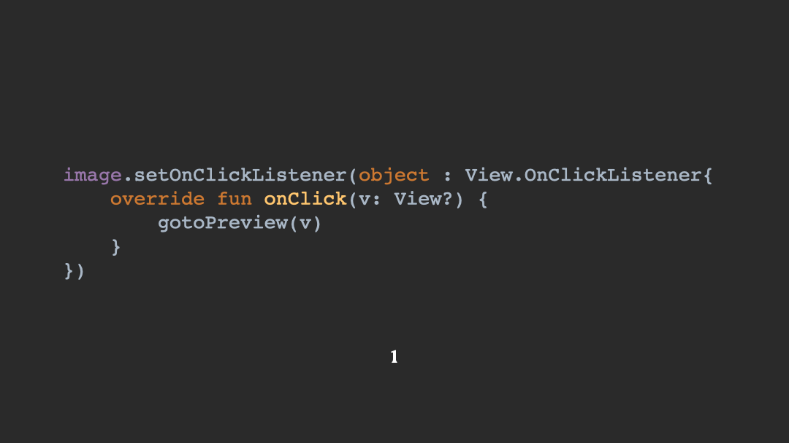
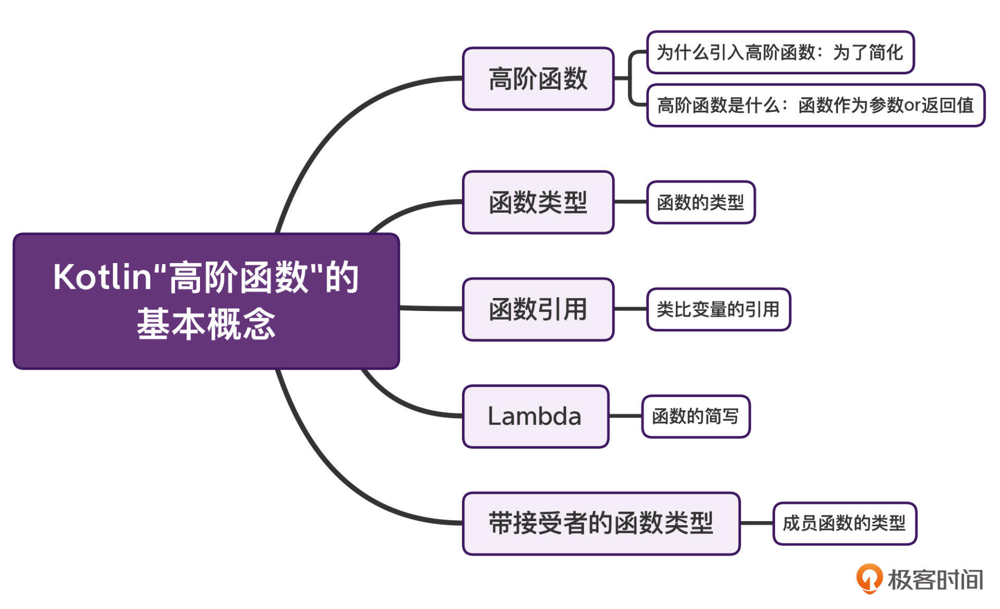

# 07 | 高阶函数：为什么说函数是Kotlin的“一等公民”？
你好，我是朱涛。

高阶函数在Kotlin里有着举足轻重的地位。**它是Kotlin函数式编程的基石，是各种框架的关键元素。**高阶函数掌握好了，我们理解协程的launch、async函数就会轻松一些，阅读协程的源代码也会不那么吃力；高阶函数理解透彻了，我们学习Jetpack Compose也会得心应手，在特定业务场景下，我们甚至可以用它来实现自己的DSL（Domain Specific Language）。

不过，如果你没有函数式编程的相关经验，在初次接触高阶函数的时候，很可能会被绕晕。因为它是一个全新的概念，你很难从经典的C/Java里找到同等的概念迁移过来（Java从1.8开始才引入相关概念）。然而，对于高阶函数这么重要的概念，Kotlin官方文档又惜字如金。

文档里只是突兀地介绍了高阶函数、函数类型、Lambda表达式的简单用法，接着就丢出一段复杂的代码案例，然后丢出一个更复杂的概念，“带接收者的函数类型”（Function Types With Receiver），接着又丢出了一段更复杂的代码案例。说实话，这真的让人难以理解。

所以今天这节课，我会采用Java和Kotlin对照的方式，来给你讲解Kotlin高阶函数的核心概念。并且我会通过一个实际案例，来帮助你理解其中最晦涩难懂的“带接收者的函数类型”，为你今后的Kotlin学习之路打下坚实的基础。

<!-- [[[read_end]]] -->

## Kotlin为什么要引入高阶函数？

想要掌握好高阶函数，我们首先要知道，Kotlin为什么要引入这一全新的概念。这个问题，Kotlin官方并没有给出解释，但是我们很容易在它的使用上找到蛛丝马迹。

我们来看个实际的例子，这是Android中的View定义，这里我省略了大部分代码，主要是想带你来看看Kotlin高阶函数的一个典型使用场景。

> 补充：如果你不了解Android开发也没关系，Java Swing中也有类似的代码模式。如果两者你都不熟悉，借助我提供的注释，也不难理解。

```kotlin
    // View.java
    
    // 成员变量
    private OnClickListener mOnClickListener;
    private OnContextClickListener mOnContextClickListener;
    
    // 监听手指点击事件
    public void setOnClickListener(OnClickListener l) {
        mOnClickListener = l;
    }
    
    // 为传递这个点击事件，专门定义了一个接口
    public interface OnClickListener {
        void onClick(View v);
    }
    
    // 监听鼠标点击事件
    public void setOnContextClickListener(OnContextClickListener l) {
        getListenerInfo().mOnContextClickListener = l;
    }
    
    // 为传递这个鼠标点击事件，专门定义了一个接口
    public interface OnContextClickListener {
        boolean onContextClick(View v);
    }
```

这段代码，其实是一个典型的“可以用高阶函数来优化”的例子。让我们来看看它都做了什么：

* 首先，为了设置点击事件的监听，代码里特地定义了一个OnClickListener接口；
* 接着，为了设置鼠标点击事件的监听，又专门定义了一个OnContextClickListener接口。

乍一看，我们貌似是可以复用同一个接口就行了，对吧？但事实上，**借助高阶函数，我们一个接口都不必定义**。

当然了，上面的代码是Android团队十几年前用Java写的，在那个场景下，这么写代码是完全没问题的。可是这段代码在使用的时候，问题更大。比如，我们可以来看看如下所示的Android里设置点击监听的代码：

```kotlin
    // 设置手指点击事件
    image.setOnClickListener(new View.OnClickListener() {
        @Override
        public void onClick(View v) {
            gotoPreview();
        }
    });
    
    // 设置鼠标点击事件
    image.setOnContextClickListener(new View.OnContextClickListener() {
        @Override
        public void onContextClick(View v) {
            gotoPreview();
        }
    });
```

看完了这两段代码之后，你有没有觉得这样的代码会很啰嗦？因为，真正逻辑只有一行代码：gotoPreview\(\)，而实际上我们却写了6行代码。


如果我们将其中的核心逻辑提取出来，会发现这样才是最简单明了的：

```kotlin
    //                      { gotoPreview() } 就是 Lambda
    //                             ↑
    image.setOnClickListener({ gotoPreview() })
    image.setOnContextClickListener({ gotoPreview() })
```

那么，Kotlin语言的设计者是怎么做的呢？实际上他们是分成了两个部分：

* 用函数类型替代接口定义；
* 用Lambda表达式作为函数参数。

这里我们再来看看与前面View.java的等价Kotlin代码：

```kotlin
    //View.kt
    //                     (View) -> Unit 就是「函数类型 」
    //                       ↑        ↑ 
    var mOnClickListener: ((View) -> Unit)? = null
    var mOnContextClickListener: ((View) -> Unit)? = null
    
    // 高阶函数
    fun setOnClickListener(l: (View) -> Unit) {
        mOnClickListener = l;
    }
    
    // 高阶函数
    fun setOnContextClickListener(l: (View) -> Unit) {
        mOnContextClickListener = l;
    }
```

那么通过对比，我们能看到，Kotlin中引入高阶函数会带来几个**好处**：一个是针对定义方，代码中减少了两个接口类的定义；另一个是对于调用方来说，代码也会更加简洁。这样一来，就大大减少了代码量，提高了代码可读性，并通过减少类的数量，提高了代码的性能。


> 注：关于“inline”，我会在下节课中详细介绍。

通过上面的例子，我们已经清楚高阶函数存在的意义和价值了。不过，前面出现的一些新的概念我们还没来得及详细解释，比如，**函数类型、Lambda，它们到底是什么呢？还有高阶函数的具体定义是什么呢？**

接下来，我会通过一个具体的代码案例，来给你一一解读与高阶函数关系密切的概念及使用定义，让你能进一步夯实函数式编程的基础知识。

## 理解高阶函数的相关概念

首先，我们来了解下什么是函数类型。

### 函数类型

顾名思义，函数类型（Function Type）就是**函数的类型**。如果你之前没有函数式编程的经验，刚接触这个概念的话也许会觉得奇怪：函数也有类型吗？

是的，既然变量可以有类型，函数也可以有。在Kotlin的世界里，[函数是一等公民](https://kotlinlang.org/docs/lambdas.html)。你可以将其理解为Kotlin里的VIP，普通人有的东西，VIP当然也有。比如，我们可以仔细看看下面的函数：

```kotlin
    //         (Int,  Int) ->Float 这就是 add 函数的类型
    //           ↑     ↑      ↑
    fun add(a: Int, b: Int): Float { return (a+b).toFloat() }
```

请注意这里我给出代码注释，第二行注释里面的“↑”代表的是一种映射关系。其实，将第三行代码里的“Int Int Float”抽出来，就代表了该函数的类型。

我们可以用更精练的语言来描述函数类型的规律：**将函数的“参数类型”和“返回值类型”抽象出来后，就得到了“函数类型”**。\(Int, Int\) \->Float就代表了参数类型是两个Int，返回值类型为Float的函数类型。

理解了函数类型以后，我们再来看**函数的引用**。普通的变量也有引用的概念，我们可以将一个变量赋值给另一个变量。而这一点，在函数上也是同样适用的，函数也有引用，并且也可以赋值给变量。

```kotlin
    // 函数赋值给变量                    函数引用
    //    ↑                              ↑
    val function: (Int, Int) -> Float = ::add
```

### 高阶函数

好，接着我们再来看看高阶函数的具体定义。当然，前面解释了这么多，现在我们对高阶函数应该已经有了比较清晰的认识了，我们用Kotlin实现的View点击事件函数，它就是一个高阶函数。

而它明确的定义其实是这样的：**高阶函数是将函数用作参数或返回值的函数。**

这句话有点绕，我们还是直接看例子吧。如果我们将Android里点击事件的监听用Kotlin来实现的话，它其实就是一个典型的高阶函数。

```kotlin
    //                      函数作为参数的高阶函数
    //                              ↓
    fun setOnClickListener(l: (View) -> Unit) { ... }
```

换句话说，一个函数的参数或是返回值，它们当中有一个是函数的情况下，这个函数就是高阶函数。

### Lambda

而前面我们还提到过，Kotlin语言的设计者是用Lambda表达式作为函数参数的，那么这里的Lambda，就可以理解为是**函数的简写**：

```kotlin
    fun onClick(v: View): Unit { ... }
    setOnClickListener(::onClick)
    
    // 用 Lambda 表达式来替代函数引用
    setOnClickListener({v: View -> ...})
```

那么，如果你够细心的话，可能已经发现了一个问题：Android并没有提供View.java的Kotlin实现，那么为什么我们的Demo里面可以用Lambda来简化事件监听呢？

```kotlin
    // 在实际开发中，我们经常使用这种简化方式
    setOnClickListener({ gotoPreview() }
```

原因是这样的，由于OnClickListener符合SAM转换的要求，因此编译器自动帮我们做了一层转换，让我们可以用Lambda表达式来简化我们的函数调用。

那么，SAM又是个什么鬼？

### SAM转换

SAM是Single Abstract Method的缩写，意思就是只有一个抽象方法的类或者接口。但在Kotlin和Java 8里，**SAM代表着只有一个抽象方法的接口**。只要是符合SAM要求的接口，编译器就能进行SAM转换，也就是我们可以使用Lambda表达式，来简写接口类的参数。

注意，Java 8中的SAM有明确的名称，叫做**函数式接口**（FunctionalInterface）。FunctionalInterface的限制如下，缺一不可：

* 必须是接口，抽象类不行；
* 该接口有且仅有一个抽象的方法，抽象方法个数必须是1，默认实现的方法可以有多个。

也就是说，对于View.java来说，它虽然是Java代码，但Kotlin编译器知道它的参数OnClickListener符合SAM转换的条件，所以会自动做以下转换。

转换前：

```kotlin
    public void setOnClickListener(OnClickListener l)
```

转换后：

```kotlin
    fun setOnClickListener(l: (View) -> Unit)
    // 实际上是这样：
    fun setOnClickListener(l: ((View!) -> Unit)?)
```

其中，\(\(View\!\) \-> Unit\)\?代表的是这个参数可能为空。

## Lambda表达式引发的8种写法

当一个函数的参数是SAM的情况下，我们同样也可以使用Lambda作为参数。所以，**我们既可以用匿名内部类的方式传参，也可以使用Lambda的方式传参**。这两种方式在我们前面都已经提到过了。然而，在这两种写法的中间，还有6种“过渡状态”的写法。这对大部分初学者简直是噩梦：同样的代码，能有8种不同的写法，确实也挺懵的。

而要理解Lambda表达式的简写逻辑，其实很简单，那就是：**多写**。你也可以跟着我接下来的流程来一起写一写。

* 第1种写法

这是原始代码，它的本质是用 object 关键字定义了一个匿名内部类：

```kotlin
    image.setOnClickListener(object: View.OnClickListener {
        override fun onClick(v: View?) {
            gotoPreview(v)
        }
    })
```

* 第2种写法

在这种情况下，object关键字可以被省略。这时候它在语法层面就不再是匿名内部类了，它更像是Lambda表达式了，因此它里面override的方法也要跟着删掉：

```kotlin
    image.setOnClickListener(View.OnClickListener { v: View? ->
        gotoPreview(v)
    })
```

上面的`View.OnClickListener`被称为SAM Constructor（SAM构造器），它是编译器为我们生成的。

* 第3种写法

由于Kotlin的Lambda表达式是不需要SAM Constructor的，所以它也可以被删掉：

```kotlin
    image.setOnClickListener({ v: View? ->
        gotoPreview(v)
    })
```

* 第4种写法

由于Kotlin支持类型推导，所以View可以被删掉：

```kotlin
    image.setOnClickListener({ v ->
        gotoPreview(v)
    })
```

* 第5种写法

当Kotlin Lambda表达式只有一个参数的时候，它可以被写成it：

```kotlin
    image.setOnClickListener({ it ->
        gotoPreview(it)
    })
```

* 第6种写法

Kotlin Lambda的it是可以被省略的：

```kotlin
    image.setOnClickListener({
        gotoPreview(it)
    })
```

* 第7种写法

当Kotlin Lambda作为函数的最后一个参数时，Lambda可以被挪到外面：

```kotlin
    image.setOnClickListener() {
        gotoPreview(it)
    }
```

* 第8种写法

当Kotlin只有一个Lambda作为函数参数时，\(\)可以被省略：

```kotlin
    image.setOnClickListener {
        gotoPreview(it)
    }
```

这里，我把这8种写法的演进过程以动图的形式展现了出来，让你对Lambda这几种写法的差异有一个更加直观的认识。



按照这个流程，在IDE里多写几遍，你自然就会理解了。一定要写，光看是记不住的。

好了，到这里，你就搞明白这些概念是什么意思了。下面我们来做一个小的总结，在后续的Kotlin学习当中，这些都是要铭记在心的。

* 将函数的参数类型和返回值类型抽象出来后，我们就得到了函数类型。比如`(View) -> Unit` 就代表了参数类型是View，返回值类型为Unit的函数类型。
* 如果一个函数的“参数”或者“返回值”的类型是函数类型，那这个函数就是高阶函数。很明显，我们刚刚就写了一个高阶函数，只是它比较简单而已。
* Lambda就是函数的一种简写。

然后，你也可以再通过一张图来回顾下函数类型、高阶函数以及Lambda表达式三者之间的关系：


你也可以再回过头来看看官方文档提供的例子：

```kotlin
    fun <T, R> Collection<T>.fold(
        initial: R, 
        combine: (acc: R, nextElement: T) -> R
    ): R {
        var accumulator: R = initial
        for (element: T in this) {
            accumulator = combine(accumulator, element)
        }
        return accumulator
    }
```

你看到这个函数类型：\(acc: R, nextElement: T\) \-> R，是不是瞬间就懂了呢？这个函数接收了两个参数，第一个参数类型是R，第二个参数是T，函数的返回类型是R。

## 难点：带接收者的函数类型

那么现在，我们就把高阶函数这个知识点理解得有80\%了。而在这节课一开始，我还提到，在Kotlin的函数类型这个知识点当中，还有一个特殊的概念，叫做**带接收者的函数类型**，它尤其晦涩难懂。

说实话，这个名字也对初学者不太友好，“带接收者的函数类型”，这里面的每一个字我都认识，可放到一块我就懵了。所以我们其实还是绕不开一个问题：为什么？

### 为什么要引入带接收者的函数类型？

这里，让我们先来看一下Kotlin的标准函数apply的使用场景。

不用 apply：

```kotlin
    if (user != null) {
        ...
        username.text = user.name
        website.text = user.blog
        image.setOnClickListener { gotoImagePreviewActivity(user) }
    }
```

使用apply：

```kotlin
    user?.apply {
        ...
        username.text = name
        website.text = blog
        image.setOnClickListener { gotoImagePreviewActivity(this) }
    }
```

请问这个apply方法应该怎么实现呢？

上面的写法其实是简化后的Lambda表达式，让我们来反推一下，看看它简化前是什么样的：

```kotlin
    // apply 肯定是个函数，所以有 ()，只是被省略了
    user?.apply() {
        ...
    }
    
    // Lambda 肯定是在 () 里面
    user?.apply({ ... })
    
    // 由于 gotoImagePreviewActivity(this) 里的 this 代表了 user
    // 所以 user 应该是 apply 函数的一个参数，而且参数名为：this
    user?.apply({ this: User -> ... })
```

所以，现在问题非常明确了，apply其实是接收了一个Lambda表达式：`{ this: User \-> ... }`。那么现在，我们就尝试来实现这个apply方法：

```kotlin
    fun User.apply(self: User, block: (self: User) -> Unit): User{
        block(self)
        return this
    }
    
    user?.apply(self = user) { self: User ->
                username.text = self.name
                website.text = self.blog
                image.setOnClickListener { gotoImagePreviewActivity(this) }
    }
```

由于Kotlin里面的函数形参是不允许被命名为this的，因此我这里用的是self。另外，这里我们自己写出来的apply，仍然还要通过self.name这样的方式来访问成员变量，但Kotlin的语言设计者能做到这样：

```kotlin
    //           改为this             改为this
    //               ↓                    ↓ 
    fun User.apply(this: User, block: (this: User) -> Unit): User{
    //    这里还要传参数
    //         ↓ 
        block(this)
        return this
    }
    
    user?.apply(this = user) { this: User ->
        ...
    //               this 可以省略
    //                   ↓ 
        username.text = this.name
        website.text = blog
        image.setOnClickListener { gotoImagePreviewActivity(this) }
    }
```

从上面的例子能看到，我们反推的apply实现会比较繁琐：

* 需要我们传入this：user\?.apply\(this = user\)。
* 需要我们自己调用：block\(this\)。

因此，Kotlin就引入了带接收者的函数类型，可以简化apply的定义：

```kotlin
    //              带接收者的函数类型
    //                     ↓  
    fun User.apply(block: User.() -> Unit): User{
    //  不用再传this
    //       ↓ 
        block()
        return this
    }
    
    user?.apply { this: User ->
    //               this 可以省略
    //                   ↓
        username.text = this.name
        website.text = this.blog
        image.setOnClickListener { gotoImagePreviewActivity(this) }
    }
```

现在，关键来了。上面的apply方法是不是看起来就像是在User里，增加了一个成员方法apply\(\)？

```kotlin
    class User() {
        val name: String = ""
        val blog: String = ""
    
        fun apply() {
            // 成员方法可以通过 this 访问成员变量
            username.text = this.name
            website.text = this.blog
            image.setOnClickListener { gotoImagePreviewActivity(this) }
        }
    }
```

所以，从外表上看，带接收者的函数类型，就等价于成员方法。但**从本质上讲，它仍是通过编译器注入this来实现的**。

我们可以再通过一张图，来理解下什么是带接收者的函数类型：


看到这里，也许你会想起前面我们讲过的“扩展函数”。那么，带接收者的函数类型，是否也能代表扩展函数呢？

答案是肯定的。毕竟，**从语法层面讲，扩展函数就相当于成员函数。**

## 实战与思考

在[第5讲](https://time.geekbang.org/column/article/475058)当中，我们实现了“单例的抽象类模板”，在课程的最后，我还给你留了一个思考题：

> 我们的抽象类模板BaseSingleton是否还有改进的空间？

这里，让我们先回顾一下BaseSingleton的代码：

```kotlin
                         
    abstract class BaseSingleton<in P, out T> {
        @Volatile
        private var instance: T? = null
        //                       ①
        //                       ↓
        protected abstract fun creator(param: P): T
    
        fun getInstance(param: P): T =
            instance ?: synchronized(this) {
                instance ?: creator(param).also { instance = it }
        }
    }
    
    class PersonManager private constructor(name: String) {
        companion object : BaseSingleton<String, PersonManager>() {
            override fun creator(param: String): PersonManager = PersonManager(param)
        }
    }
```

从上面的代码我们可以看到，BaseSingleton是单例抽象模板，而PersonManager则是实际的单例类。

在前面的[第2讲](https://time.geekbang.org/column/article/473349)里，我们就讨论过Person的isAdult应该是属性，而walk则应该是方法。那么现在，请看注释①，它是我们定义的一个抽象方法，名字叫做creator。这时候，相信你马上就能反应过来：creator应该定义成属性。

可是，**如何才能将一个方法改成属性呢？**答案当然就是刚学过的：**高阶函数**。

运用这节课学到的知识，我们很容易就能将creator改成一个类型为：`(P)->T`的属性，如下所示：

```kotlin
    abstract class BaseSingleton<in P, out T> {
        @Volatile
        private var instance: T? = null
        //               变化在这里，函数类型的属性
        //                  ↓              ↓
        protected abstract val creator: (P)-> T
    
        fun getInstance(param: P): T =
            instance ?: synchronized(this) {
                instance ?: creator(param).also { instance = it }
        }
    }
```

上面的代码中，我们将creator改成了一个抽象的属性，如果其他的单例类继承了BaseSingleton这个类，就必须实现这个creator属性。不过，这时候一个问题就出现了：**PersonManager该怎么写呢？**

如果我们依葫芦画瓢，在实现creator的时候传入PersonManager的构造函数，会发现代码报错：类型不匹配。

```kotlin
    class PersonManager private constructor(name: String) {
        companion object : BaseSingleton<String, PersonManager>() {
        //             报错，类型不匹配
        //                  ↓ 
            override val creator = PersonManager(name)
        }
    }
```

这段代码报错的原因其实也很简单，creator的类型是一个\(String\)-> PersonManager，而PersonManager构造函数这个表达式的值类型，是PersonManager类型。**前者是函数类型，后者是普通对象类型**。那么，如何才能正确实现creator这个函数类型的属性呢？

答案就是我们前面刚学的：**函数引用**！

```kotlin
    class PersonManager private constructor(name: String) {
        companion object : BaseSingleton<String, PersonManager>() {
        //                             函数引用
        //                                ↓ 
            override val creator = ::PersonManager
        }
    }
```

从上面的代码中可以看到，我们直接将PersonManager的构造函数，以函数引用的方式传给了creator这个属性，这样就成功地实现了这个函数类型的属性。

在这个案例里，我们将函数引用以及高阶函数应用到了单例抽象类模板当中，而在这个过程当中，我们也就能更加透彻地理解这两个特性的使用场景了。

这里我制作了一个代码的转换动图，帮你建立一个更加直观的认识。


从这个动图里，我们可以清晰地看到某些元素的转移过程。比如泛型P、T，还有PersonManager的构造函数，这些都是代码中的关键元素。这些关键元素只是换了一种语法排列规则：**从函数的语法变成了属性的语法，语法从复杂变得简洁，其中的关键元素并未丢失**。

因此，这两种代码是完全等价的，但后者更加简洁易懂。

## 小结

到现在为止，咱们高阶函数部分的内容就进入尾声了。让我们再来做一次总结：

* **为什么引入高阶函数？**答：为了简化。
* **高阶函数是什么？**答：函数作为参数or返回值。
* **函数类型是什么？**答：函数的类型。
* **函数引用是什么？**答：类比变量的引用。
* **Lambda是什么？**答：可以简单理解为“函数的简写”（官方定义我们以后再讨论）。
* **带接收者的函数类型是什么？**答：可以简单理解为“成员函数的类型”。



事实上，对于初学者来说，要一下子理解并掌握Kotlin“高阶函数”不是一件容易的事情。在掌握好这节课内容的基础上，我们可以尝试去读一些优秀的代码。

比如Kotlin官方的源代码[StandardKt](https://github.com/JetBrains/kotlin/blob/1.5.30/libraries/stdlib/src/kotlin/util/Standard.kt)，你可以去分析其中的with、let、also、takeIf、repeat、apply，来进一步加深对高阶函数的理解。还有就是[CollectionsKt](https://github.com/JetBrains/kotlin/blob/1.5.30/libraries/stdlib/common/src/generated/_Collections.kt)，你可以去分析其中的map、flatMap、fold、groupBy等操作符，从而对高阶函数的应用场景有一个更具体的认知。

另外，在[第](https://time.geekbang.org/column/article/473349)[2讲](https://time.geekbang.org/column/article/473349)的时候，我们曾经提到过：理论上讲，Kotlin与Java是完全兼容的。那么问题来了，**Kotlin引入全新的高阶函数，最终变成JVM字节码后是怎么执行呢？**毕竟，JVM可不知道什么是高阶函数啊。

答案其实也很简单：**匿名内部类**。

而这样又引出了另一个问题：所以Kotlin弄了个这么高端的高阶函数，最终还是以匿名内部类的形式在运行呗？那它们两者的性能差不多？这不是多此一举吗？

答案当然是否定的，Kotlin高阶函数的性能，在极端情况下可以达到匿名内部类的100倍！具体是怎么回事儿呢？别着急，下节课讲“inline”时，我们就会来详细探讨。

## 小作业

请你去阅读一下Kotlin官方的标准函数库[StandardKt的源代码](https://github.com/JetBrains/kotlin/blob/1.5.30/libraries/stdlib/src/kotlin/util/Standard.kt)，尝试去解析其中任意一个高阶函数的原理和意义，并分享出来，我们一起探讨。

```kotlin
    public inline fun <R> run(block: () -> R): R {
        contract {
            callsInPlace(block, InvocationKind.EXACTLY_ONCE)
        }
        return block()
    }
    
    public inline fun <T, R> T.run(block: T.() -> R): R {
        contract {
            callsInPlace(block, InvocationKind.EXACTLY_ONCE)
        }
        return block()
    }
    
    public inline fun <T, R> with(receiver: T, block: T.() -> R): R {
        contract {
            callsInPlace(block, InvocationKind.EXACTLY_ONCE)
        }
        return receiver.block()
    }
    
    public inline fun <T> T.apply(block: T.() -> Unit): T {
        contract {
            callsInPlace(block, InvocationKind.EXACTLY_ONCE)
        }
        block()
        return this
    }
    
    public inline fun <T> T.also(block: (T) -> Unit): T {
        contract {
            callsInPlace(block, InvocationKind.EXACTLY_ONCE)
        }
        block(this)
        return this
    }
    
    
    public inline fun <T, R> T.let(block: (T) -> R): R {
        contract {
            callsInPlace(block, InvocationKind.EXACTLY_ONCE)
        }
        return block(this)
    }
    
    public inline fun <T> T.takeIf(predicate: (T) -> Boolean): T? {
        contract {
            callsInPlace(predicate, InvocationKind.EXACTLY_ONCE)
        }
        return if (predicate(this)) this else null
    }
    
    public inline fun <T> T.takeUnless(predicate: (T) -> Boolean): T? {
        contract {
            callsInPlace(predicate, InvocationKind.EXACTLY_ONCE)
        }
        return if (!predicate(this)) this else null
    }
    
    public inline fun repeat(times: Int, action: (Int) -> Unit) {
        contract { callsInPlace(action) }
    
        for (index in 0 until times) {
            action(index)
        }
    }
```

好了，这节课就到这里，如果觉得有收获，非常欢迎你把今天的内容分享给更多的朋友，咱们下节课再见。