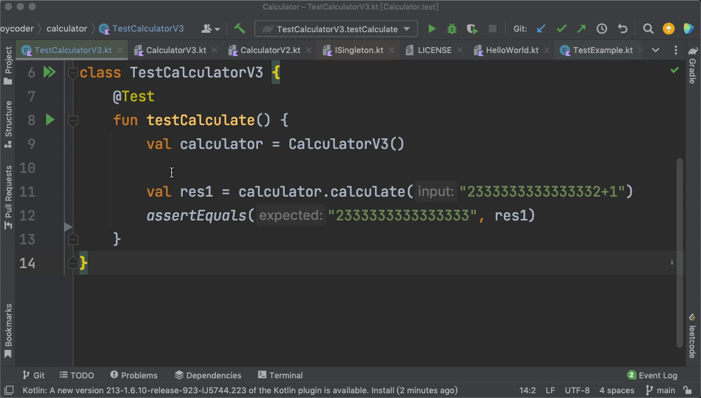

# 11 | 注解与反射：进阶必备技能
你好，我是朱涛。今天这节课，我们来学习一下Kotlin的**注解**（Annotation）和**反射**（Reflection）。

注解和反射，是Kotlin当中比较难理解的内容了。和前面我们学习的[泛型](https://time.geekbang.org/column/article/480022)一样，注解与反射都是比较抽象的概念。我们现在已经知道，Kotlin的泛型，就是在代码架构的层面进行的一种抽象，从而达到代码逻辑尽可能复用的目的。那么，注解与反射，它们存在的意义是什么呢？

答案是：提高代码的**灵活性**。

灵活性，就让注解与反射同样有着举足轻重的地位，借助这两种技术，我们可以做许多有趣的事情。Kotlin与Java领域，有许多著名的开源库，比如大名鼎鼎的[Spring Boot](https://spring.io/projects/spring-boot)、[Retrofit](https://github.com/square/retrofit)、[Gson](https://github.com/google/gson)等，都会用到这两种技术。

所以，只有深刻理解了注解和反射，我们才可能理解那些著名开源库的设计思路，也才可能读懂这些世界顶级开发者的代码。

当然，课程进行到这里，学习的难度也越来越高了，不过你也不要因此产生畏难的情绪，只要你能多思考、多练习，把对知识点的理解都落实到代码上，那我相信你对Kotlin的掌握情况、代码能力甚至架构能力，都会有一个质的飞跃。并且，在课程中我也会尽量用通俗易懂的语言、例子来给你介绍这些陌生的概念知识，让你在学习的过程中可以轻松一些。

<!-- [[[read_end]]] -->

好，下面我们就正式开始吧。

## 认识注解

注解，可能是我们眼里**最熟悉的陌生人**。虽然经常见面，但我们并不真的认识它。

实际上，注解几乎无处不在，比如说，我们经常能在Kotlin标准库当中看见“\@Deprecated”这样的注解，它代表了被标注的代码“已废弃”。如果你有Java的编程经验，你一定见过“\@Override”这个注解，它代表了重写。

而就算你没有任何编程经验，你也已经在前面的课程中见到过注解了。比如我们在[第4讲](https://time.geekbang.org/column/article/473656)的单元测试代码当中，就用到了\@Test这个注解；在[第8讲](https://time.geekbang.org/column/article/477295)的性能测试代码中，我们用到了\@Benchmark这个注解。

其实，要理解Kotlin的注解也并不困难，因为在我们的生活当中也有类似的概念，那就是**便利贴**。


比如在学习的时候，你看到书本里的某个知识点有了新的感悟，就会拿起便利贴，写下来你当时的想法，然后贴到书本当中去。

另一个例子就是，我们经常会在论文或者维基百科当中看到的“注解”。


所以，从这个角度来看，我们很容易就能想清楚注解到底是什么。其实，它就是“对已有数据进行补充的一种数据”。这话读起来有点绕，让我用更通俗的语言来解释一下：

* 我们学习的时候，写下来的便利贴注解，其实就是对知识点的补充。
* 维基百科当中的注解，其实就是对它描述内容的一种补充。

因此，**Kotlin当中的注解，其实就是“程序代码的一种补充”**。

现在我们就拿第4讲中的单元测试代码为例，来看看它的作用。

```kotlin
    class TestCalculatorV3 {
    //   注解
    //    ↓
        @Test
        fun testCalculate() {
            val calculator = CalculatorV3()
    
            val res1 = calculator.calculate("2333333333333332+1")
            assertEquals("2333333333333333", res1)
        }
    }
```

上面这段代码中的“\@Test”，它的作用是告诉我们的IDE，testCalculate\(\)这个方法是一个测试方法。IDE检测到这个注解以后，就会在旁边的工具栏展示出一个绿色的三角形按钮，方便我们直接运行这个测试方法。

如果我们删掉“\@Test”这个注解，这段代码就会变成一段普通的Kotlin代码，而旁边工具栏的绿色三角形按钮也会消失。



从这个例子里，我们其实就能体会到注解的灵活性。我们开发者只需要用Kotlin的语法写代码即可，至于代码是不是用来做单元测试，我们用一个简单的“\@Test”注解就可以搞定。这中间有**解耦**的思想在里面。

认识到注解是什么以后，我们后面的学习就很简单了。接下来，我们就来看看注解的定义还有使用。

### 注解的定义

首先，让我们来看看注解是如何定义的。Kotlin的源代码当中，提供了很多内置的注解，比如\@Deprecated、\@JvmStatic、\@JvmOverloads等等。除了Kotlin默认就有的注解以外，我们也可以定义自己的注解。

比如说，如果我们想定义一个\@Deprecated注解，应该怎么做呢？其实非常简单，总体结构和定义一个普通的Kotlin类差不多，只是多了一些额外的东西。

```kotlin
    @Target(CLASS, FUNCTION, PROPERTY, ANNOTATION_CLASS, CONSTRUCTOR, PROPERTY_SETTER, PROPERTY_GETTER, TYPEALIAS)
    @MustBeDocumented
    public annotation class Deprecated(
        val message: String,
        val replaceWith: ReplaceWith = ReplaceWith(""),
        val level: DeprecationLevel = DeprecationLevel.WARNING
    )
```

从上面的代码里，我们可以看到，\@Deprecated这个注解的定义上面，还有其他的注解\@Target、\@MustBeDocumented。这样的注解，我们叫做**元注解**，即它本身是注解的同时，还可以用来修饰其他注解。

Kotlin常见的元注解有四个：

* **\@Target**，这个注解是指定了被修饰的注解都可以用在什么地方，也就是**目标**；
* **\@Retention**，这个注解是指定了被修饰的注解是不是编译后可见、是不是运行时可见，也就是**保留位置**；
* **\@Repeatable**，这个注解是允许我们在同一个地方，多次使用相同的被修饰的注解，使用场景比较少；
* **\@MustBeDocumented**，指定被修饰的注解应该包含在生成的API文档中显示，这个注解一般用于SDK当中。

这里，你需要注意的是Target和Retention的取值：

```kotlin
    public enum class AnnotationTarget {
        // 类、接口、object、注解类
        CLASS,
        // 注解类
        ANNOTATION_CLASS,
        // 泛型参数
        TYPE_PARAMETER,
        // 属性
        PROPERTY,
        // 字段、幕后字段
        FIELD,
        // 局部变量
        LOCAL_VARIABLE,
        // 函数参数
        VALUE_PARAMETER,
        // 构造器
        CONSTRUCTOR,
        // 函数
        FUNCTION,
        // 属性的getter
        PROPERTY_GETTER,
        // 属性的setter
        PROPERTY_SETTER,
        // 类型
        TYPE,
        // 表达式
        EXPRESSION,
        // 文件
        FILE,
        // 类型别名
        TYPEALIAS
    }
    
    public enum class AnnotationRetention {
        // 注解只存在于源代码，编译后不可见
        SOURCE,
        // 注解编译后可见，运行时不可见
        BINARY,
        // 编译后可见，运行时可见
        RUNTIME
    }
```

在这段代码的注释当中，我详细解释了Target和Retention的取值，以及它们各自代表的意义。现在我们就可以回过头，来看看我们定义的“\@Deprecated”到底是什么含义。

通过\@Target的取值，我们可以看到，\@Deprecated只能作用于这些地方：类、 函数、 属性、注解类、构造器、属性getter、属性setter、类型别名。此外，\@Deprecated这个类当中还包含了几个成员：message代表了废弃的提示信息；replaceWith代表了应该用什么来替代废弃的部分；level代表警告的程度，分别是WARNING、ERROR、HIDDEN。

OK，现在我们已经知道如何定义注解了，接下来看看如何用它。我们仍然以\@Deprecated注解为例。

### 注解的使用

假设现在我们要开发一个计算器，第一个版本的Calculator代码出现了问题，然后这个问题在CalculatorV3当中修复了。这时候，我们希望所有的调用方都将Calculator改为CalculatorV3。这种情况，\@Deprecated这个注解就恰好符合我们的需求。

```kotlin
    @Deprecated(
        message = "Use CalculatorV3 instead.",
        replaceWith = ReplaceWith("CalculatorV3"),
        level = DeprecationLevel.ERROR
    )
    class Calculator {
        // 错误逻辑
        fun add(a: Int, b: Int): Int = a - b
    }
    
    class CalculatorV3 {
        // 正确逻辑
        fun add(a: Int, b: Int): Int = a + b
    }
```

在上面的代码中，我们使用\@Deprecated修饰了Calculator这个类。message代表了报错的提示信息；replaceWith代表了正确的解决方案；DeprecationLevel.ERROR则代表了IDE会把这个问题当作是错误的来看待。

现在，我们再来看看\@Deprecated的实际效果：


可以看到，当我们在代码当中使用了Calculator的时候，IDE会报错，鼠标挪到报错处后，IDE会显示message当中的内容“Use CalculatorV3 instead.”。另外，IDE还会提供一个快速修复的选项“Replace with CalculatorV3”，只要我们点击那个选项，我们的Calculator就会被直接替换成CalculatorV3，从而达到修复错误的目的。

还有，由于我们使用的level是DeprecationLevel.ERROR，所以IDE会直接报错。而如果我们使用的是DeprecationLevel.WARNING，IDE就只会提示一个警告，而不是错误了。

好了，到这里，我们就了解了注解要如何定义和使用。其实啊，只要我们真正理解了Kotlin的注解到底是什么东西，前面的这些注解的语法是很容易就能记住的。不过，Kotlin注解在使用的时候，还有一个细节需要注意，那就是注解的**精确使用目标**。

我们看一个具体的例子，比如[Dagger](https://github.com/google/dagger)当中的\@Inject注解：

```kotlin
    object Singleton {
    //    ①
    //    ↓
        @set:Inject
        lateinit var person: Person
    //     ↑
    //     ②
    }
```

这段代码，是一个简单的Dagger使用场景。如果你不熟悉Dagger，那也没关系，你只需要关注一下上面的两个注释。

* **注释①**：如果去掉set这个标记，直接使用\@Inject这个注解，我们的程序将无法正常工作。这是因为Kotlin当中的一个var修饰的属性，它会有多种含义：这个属性背后的字段（field）、这个属性对应的setter、还有这个属性对应的getter，在没有明确标注出来要用哪个的时候，\@Inject根本不知道该如何决定。因此，这里的“\@set:Inject”的作用，就是明确标记出注解的精确使用目标（Use-site targets）。
* **注释②**：如果没有lateinit这个关键字，person这个属性是必须要有初始值的，要么直接赋值，要么在构造函数当中被赋值。因为如果它不被初始化，person这个属性将为空，而这个就和它的类型“不可为空的Person类型”冲突了。而加上lateinit修饰的属性，即使它是不可为空的，编译器也会允许它无初始值。但当我们需要依赖注入的时候，常常需要与lateinit结合使用。

实际上，注解的精确使用目标，一般是和注解一起使用的，在上面的例子当中，set就是和\@Inject一起使用的。而除了set以外，Kotlin当中还有其他的使用目标：

* file，作用于文件；
* property，作用于属性；
* field，作用于字段；
* get，作用于属性getter；
* set，作用于属性setter；
* receiver，作用于扩展的接受者参数；
* param，作用于构造函数参数；
* setparam，作用于函数参数；
* delegate，作用于委托字段。

好，理解了注解这个特性之后，我们再来看看Kotlin的反射。

## 认识反射

反射，是Kotlin当中另一个比较抽象的概念。如果说**注解是最熟悉的陌生人**，那**反射就单纯只是个陌生人**了。因为，我们很少会在平时的业务开发当中直接用到反射。但是，在架构设计的时候，反射却可以极大地提升架构的灵活性。很多热门的开源库，也都喜欢用反射来做一些不同寻常的事情。因此，反射也是极其重要的一个语法特性。

所有的计算机程序其实都是服务于真实世界，用来解决实际问题的。所以，其实我们也通过一些真实世界的例子来理解反射的本质。


古人云：吾日三省吾身，指的是人的自我反省能力。**反射，则是程序自我反省的能力。**人的自我反省的能力，跟程序的反射，它们之间有许多相似之处。

* 人类可以**反省自己当前的状态**，比如说，我们随时可以知道自己是不是困了。而在Kotlin当中，程序可以通过反射来检查代码自身的状态，比如说，判断某个变量，它是不是可变的。
* 另外，人类反省自己的状态以后，还可以**主动改变自己的状态**。比如说，困了就休息一会儿、饿了就吃饭、渴了就喝点水。而在Kotlin当中，我们可以在运行时，用反射来查看变量的值是否符合预期，如果不符合预期，我们就可以动态修改这个变量的值，即使这个变量是private的甚至是final的。
* 还有，人类可以**根据状态作出不同的决策**。比如说，上班的路上，如果快迟到了，我们就会走快点，如果时间很充足，就可以走慢一点。而在程序世界里，[JSON解析](https://github.com/google/gson/blob/master/UserGuide.md)经常会用到\@SerializedName这个注解，如果属性有\@SerializedName修饰的话，它就以指定的名称为准，如果没有，那就直接使用属性的名称来解析。

所以，总的来看，Kotlin反射具备这三个特质：

* **感知**程序的状态，包含程序的运行状态，还有源代码结构；
* **修改**程序的状态；
* 根据程序的状态，**调整**自身的决策行为。

### 反射的应用

在Kotlin当中，反射库并没有直接集成到标准库当中。这是为了方便一些对程序安装包敏感的应用，可以根据实际需求来选择是否要用Kotlin反射。比如，在Android开发当中，我们对安装包体积就十分敏感，如果没有反射的需求，就完全不需要多引入这个依赖。

而对应的，如果我们需要用到反射，就必须要引入这个依赖：

```kotlin
    implementation "org.jetbrains.kotlin:kotlin-reflect"
```

前面我们刚了解过Kotlin反射的三个特质，那么在这里，我们就用代码来探索下这三种特质。  
在正常情况下，我们写出来的程序，其实也可以感知自身部分的状态。比如，我们前面课程中写的计算器程序，还有词频统计程序，本质上都是对输入数据状态的感知。不过，它们感知的状态十分有限。

假设，现在有一个待实现的函数readMembers。这个函数的参数obj可能是任何的类型，我们需要读取obj当中所有的成员属性的名称和值，那么具体该怎么做呢？

```kotlin
    fun main() {
        val student = Student("Tom", 99.5, 170)
        val school = School("PKU", "Beijing...")
    
        readMembers(student)
        readMembers(school)
    }
    
    fun readMembers(obj: Any) {
        // 读取obj的所有成员属性的名称和值
    }
    
    data class Student(
        val name: String,
        val score: Double,
        val height: Int
    )
    
    data class School(
        val name: String,
        var address: String
    )
    
    // 要求readMembers函数能够输出以下内容：
    
    Student.height=170
    Student.name=Tom
    Student.score=99.5
    School.address=Beijing...
    School.name=PKU
```

从上面的代码，我们可以看到，readMembers\(\)这个函数无法提前知道参数是什么类型，但是，在这个函数当中，我们还是要能够准确找到obj的所有成员属性，然后输出它们的名称和值。  
对于这样的问题，也许你会第一时间想到用when表达式，写出类似这样的代码：

```kotlin
    fun readMembers(obj: Any) {
        when(obj) {
            is Student -> { /*...*/ }
            is School -> { /*...*/}
            else -> { /*...*/}
        }
    }
```

但是，在这个例子里，我们是只有Student、School这两种情况，而在实际情况下，obj可能的类型是成千上万的，我们根本无法用when的方式提前硬编码进行预测。比如你可以再看看下面这段示例：

```kotlin
    fun readMembers(obj: Any) {
        when(obj) {
            is Student -> { /*...*/ }
            is School -> { /*...*/}
            // 硬编码的话，这里要写成千上万个逻辑分支，根本不可能做到
            else -> { /*...*/}
        }
    }
```

可见，即使我们有心想要写上万个逻辑分支，那当中的代码量也是不可想象的。因此，对于类似这样的问题，我们就可以考虑使用反射了。

```kotlin
    fun readMembers(obj: Any) {
        obj::class.memberProperties.forEach {
            println("${obj::class.simpleName}.${it.name}=${it.getter.call(obj)}")
        }
    }
```

看，通过反射，简单的几行代码就搞定了这个需求。如果你是第一次接触反射，可能会觉得上面的代码有点难懂，我来带你分析一下。

首先，是**obj::class**，这是Kotlin反射的语法，我们叫做**类引用**，通过这样的语法，我们就可以读取一个变量的“类型信息”，并且就能拿到这个变量的类型，它的类型是KClass。

```kotlin
    public actual interface KClass<T : Any> : KDeclarationContainer, KAnnotatedElement, KClassifier {
    
        public actual val simpleName: String?
    
        public actual val qualifiedName: String?
    
        override val members: Collection<KCallable<*>>
        // 省略部分代码
    }
```

这个KClass其实就代表了一个Kotlin类，通过obj::class，我们就可以拿到这个类型的所有信息，比如说，类的名称“obj::class.simpleName”。而如果要获取类的所有成员属性，我们访问它的扩展属性memberProperties就可以了。

```kotlin
    val <T : Any> KClass<T>.memberProperties: Collection<KProperty1<T, *>>
        get() = (this as KClassImpl<T>).data().allNonStaticMembers.filter { it.isNotExtension && it is KProperty1<*, *> } as Collection<KProperty1<T, *>>
```

在拿到所有的成员属性以后，我们可以通过**forEach**遍历所有的属性，它的类型是KProperty1，同时也是KCallable的子类，我们通过调用属性的getter.call\(\)，就可以拿到obj属性的值了。

这样，到目前为止，我们的程序就已经可以感知到自身的状态了，接下来我们来尝试修改自身的状态，这是反射的第二个特质。

具体需求是这样的：如果传入的参数当中，存在String类型的address变量，我们就将其改为China。

```kotlin
    fun main() {
        val student = Student("Tom", 99.5, 170)
        val school = School("PKU", "Beijing...")
    
        readMembers(student)
        readMembers(school)
    
        // 修改其中的address属性
        modifyAddressMember(school)
    
        readMembers(school)
        readMembers(student)
    }
    
    fun modifyAddressMember(obj: Any) {
        obj::class.memberProperties.forEach {
            if (it.name == "address" && // ①
                it is KMutableProperty1 && // ②
                it.setter.parameters.size == 2 && // ③
                it.getter.returnType.classifier == String::class // ④
            ) {
                // ⑤
                it.setter.call(obj, "China")
                println("====Address changed.====")
            }
        }
    }
    
    // 运行结果：
    Student.height=170
    Student.name=Tom
    Student.score=99.5
    // 注意这里
    School.address=Beijing...
    School.name=PKU
    ====Address changed.====
    // 注意这里
    School.address=China
    School.name=PKU
    Student.height=170
    Student.name=Tom
    Student.score=99.5
```

从上面的代码中，我们可以看到，当我们运行了modifyAddressMember\(school\)这行代码以后，反射代码就会检查传入的变量当中，是否存在String类型的address，如果存在，就会将它的值修改为“China”。

这里你可以关注下我在其中标出来的四个注释，它们就代表了关键的逻辑：

* 注释①，判断属性的名称是否为address，如果不是，则跳过；
* 注释②，判断属性是否可变，在我们的例子当中address是用var修饰的，因此它的类型是KMutableProperty1；
* 注释③，我们在后面要调用属性的setter，所以我们要先判断setter的参数是否符合预期，这里setter的参数个数应该是2，第一个参数是obj自身，第二个是实际的值；
* 注释④，根据属性的getter的返回值类型returnType，来判断属性的类型是不是String类型；
* 注释⑤，调用属性的setter方法，传入obj，还有“China”，来完成属性的赋值。

好，到这里，我们就已经了解了反射的两种特质，分别是感知程序的状态和修改程序的状态。现在只剩下第三种，根据程序状态作出不同决策。这个其实非常容易做到。

假如在前面的例子的基础上，我们想要增加一个功能：如果传入的参数没有符合需求的address属性，我们就输出一行错误日志。这其实也就代表了根据程序的状态，作出不同的行为。比如，我们可以看看下面这段示例，其中的else分支就是我们的决策行为“输出错误日志”：

```kotlin
    fun modifyAddressMember(obj: Any) {
        obj::class.memberProperties.forEach {
            if (it.name == "address" &&
                it is KMutableProperty1 &&
                it.getter.returnType.classifier == String::class
            ) {
                it.setter.call(obj, "China")
                println("====Address changed.====")
            } else {
                // 差别在这里
                println("====Wrong type.====")
            }
        }
    }
    
    // 输出结果：
    Student.height=170
    Student.name=Tom
    Student.score=99.5
    School.address=Beijing...
    School.name=PKU
    ====Address changed.====
    ====Wrong type.====  // 差别在这里
    School.address=China
    School.name=PKU
    Student.height=170
    Student.name=Tom
    Student.score=99.5
```

在前面的几个案例当中，我们用到了Kotlin反射的几个关键的反射Api和类：KClass、KCallable、KParameter、KType。现在，我们来进一步看看它们的关键成员。

**KClass代表了一个Kotlin的类，下面是它的重要成员：**

* simpleName，类的名称，对于匿名内部类，则为null；
* qualifiedName，完整的类名；
* members，所有成员属性和方法，类型是`Collection<KCallable<*>>`；
* constructors，类的所有构造函数，类型是`Collection<KFunction<T>>>`；
* nestedClasses，类的所有嵌套类，类型是`Collection<KClass<*>>`；
* visibility，类的可见性，类型是`KVisibility?`，分别是这几种情况，PUBLIC、PROTECTED、INTERNAL、PRIVATE；
* isFinal，是不是final；
* isOpen，是不是open；
* isAbstract，是不是抽象的；
* isSealed，是不是密封的；
* isData，是不是数据类；
* isInner，是不是内部类；
* isCompanion，是不是伴生对象；
* isFun，是不是函数式接口；
* isValue，是不是Value Class。

**KCallable代表了Kotlin当中的所有可调用的元素，比如函数、属性、甚至是构造函数。下面是KCallable的重要成员：**

* name，名称，这个很好理解，属性和函数都有名称；
* parameters，所有的参数，类型是`List<KParameter>`，指的是调用这个元素所需的所有参数；
* returnType，返回值类型，类型是KType；
* typeParameters，所有的类型参数\(比如泛型\)，类型是`List<KTypeParameter>`；
* call\(\)，KCallable对应的调用方法，在前面的例子中，我们就调用过setter、getter的call\(\)方法。
* visibility，可见性；
* isSuspend，是不是挂起函数。

**KParameter，代表了`KCallable`当中的参数，它的重要成员如下：**

* index，参数的位置，下标从0开始；
* name，参数的名称，源码当中参数的名称；
* type，参数的类型，类型是KType；
* kind，参数的种类，对应三种情况：INSTANCE是对象实例、EXTENSION\_RECEIVER是扩展接受者、VALUE是实际的参数值。

**KType，代表了Kotlin当中的类型，它重要的成员如下：**

* classifier，类型对应的Kotlin类，即KClass，我们前面的例子中，就是用的classifier == String::class来判断它是不是String类型的；
* arguments，类型的类型参数，看起来好像有点绕，其实它就是这个类型的泛型参数；
* isMarkedNullable，是否在源代码中标记为可空类型，即这个类型的后面有没有“\?”修饰。

所以，归根结底，**反射，其实就是Kotlin为我们开发者提供的一个工具**，通过这个工具，我们可以让程序在运行的时候“自我反省”。这里的“自我反省”一共有三种情况，其实跟我们的现实生活类似。

* 第一种情况，程序在运行的时候，可以通过反射来查看自身的状态。
* 第二种情况，程序在运行的时候，可以修改自身的状态。
* 第三种情况，程序在运行的时候，可以根据自身的状态调整自身的行为。

## 小结

好了，让我们来做个简单的总结吧。

注解和反射，是Kotlin当中十分重要的特性，它们可以极大地提升程序的灵活性。那么，在使用注解和反射的时候，你要知道，**注解，其实就是“程序代码的一种补充”，而反射，其实就是“程序代码自我反省的一种方式”。**

在这节课当中，我们已经分别见识了注解与反射的威力。那么，如果我们将它们两者结合起来使用会产生什么样的反应呢？我们将在下节课当中揭晓！

## 思考题

这节课，我们学习了Kotlin的注解、反射，其实Java当中也是有注解与反射的。那么你知道Kotlin和Java之间有哪些异同点吗？欢迎给我留言，我们一起交流探讨。

好了，我们下节课再见吧！