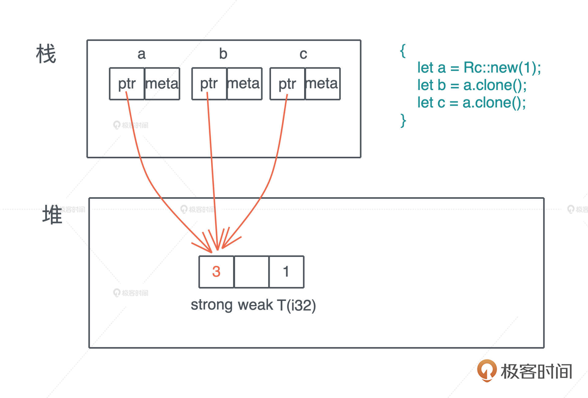
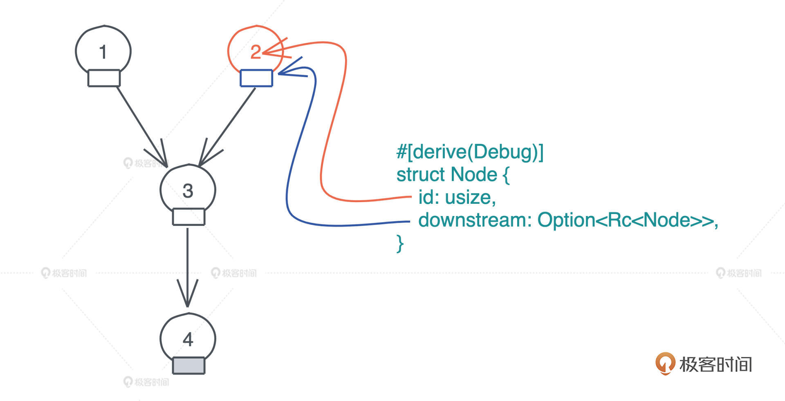
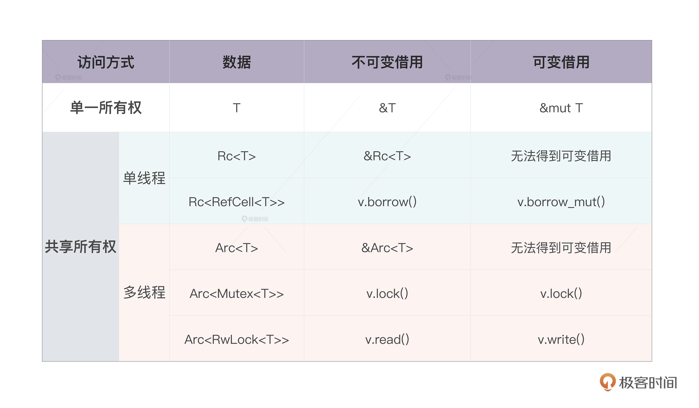

# 09｜所有权：一个值可以有多个所有者么？
你好，我是陈天。

之前介绍的单一所有权规则，能满足我们大部分场景中分配和使用内存的需求，而且在编译时，通过 Rust 借用检查器就能完成静态检查，不会影响运行时效率。

但是，规则总会有例外，在日常工作中有些特殊情况该怎么处理呢？

* 一个有向无环图（DAG）中，某个节点可能有两个以上的节点指向它，这个按照所有权模型怎么表述？
* 多个线程要访问同一块共享内存，怎么办？

我们知道，这些问题在程序运行过程中才会遇到，在编译期，所有权的静态检查无法处理它们，所以为了更好的灵活性，Rust 提供了**运行时的动态检查**，来满足特殊场景下的需求。

这也是 Rust 处理很多问题的思路：编译时，处理大部分使用场景，保证安全性和效率；运行时，处理无法在编译时处理的场景，会牺牲一部分效率，提高灵活性。后续讲到静态分发和动态分发也会有体现，这个思路很值得我们借鉴。

那具体如何在运行时做动态检查呢？运行时的动态检查又如何与编译时的静态检查自洽呢？

Rust 的答案是使用引用计数的智能指针：**Rc（Reference counter） 和 Arc（Atomic reference counter）**。这里要特别说明一下，Arc 和 ObjC/Swift 里的 ARC（Automatic Reference Counting）不是一个意思，不过它们解决问题的手段类似，都是通过引用计数完成的。

<!-- [[[read_end]]] -->

## Rc

我们先看 Rc。对某个数据结构 T，我们可以创建引用计数 Rc，使其有多个所有者。Rc 会把对应的数据结构创建在堆上，我们在第二讲谈到过，堆是唯一可以让动态创建的数据被到处使用的内存。

```
    use std::rc::Rc;
    fn main() {    
      let a = Rc::new(1);
    }
    

```

之后，如果想对数据创建更多的所有者，我们可以通过 clone\(\) 来完成。

**对一个 Rc 结构进行 clone\(\)，不会将其内部的数据复制，只会增加引用计数**。而当一个 Rc 结构离开作用域被 drop\(\) 时，也只会减少其引用计数，直到引用计数为零，才会真正清除对应的内存。

```
    use std::rc::Rc;
    fn main() {
        let a = Rc::new(1);
        let b = a.clone();
        let c = a.clone();
    }
    

```

上面的代码我们创建了三个 Rc，分别是 a、b 和 c。它们共同指向堆上相同的数据，也就是说，堆上的数据有了三个共享的所有者。在这段代码结束时，c 先 drop，引用计数变成 2，然后 b drop、a drop，引用计数归零，堆上内存被释放。

你也许会有疑问：为什么我们生成了对同一块内存的多个所有者，但是，编译器不抱怨所有权冲突呢？

仔细看这段代码：首先 a 是 Rc::new\(1\) 的所有者，这毋庸置疑；然后 b 和 c 都调用了 a.clone\(\)，分别得到了一个新的 Rc，所以从编译器的角度，abc 都各自拥有一个 Rc。如果文字你觉得稍微有点绕，看看 Rc 的 clone\(\) 函数的实现，就很清楚了（[源代码](https://doc.rust-lang.org/src/alloc/rc.rs.html#1433-1453)）：

```
    fn clone(&self) -> Rc<T> {
        // 增加引用计数
        self.inner().inc_strong();
        // 通过 self.ptr 生成一个新的 Rc 结构
        Self::from_inner(self.ptr)
    }
    

```

所以，Rc 的 clone\(\) 正如我们刚才说的，不复制实际的数据，只是一个引用计数的增加。

你可能继续会疑惑：Rc 是怎么产生在堆上的？并且为什么这段堆内存不受栈内存生命周期的控制呢？

### Box::leak\(\)机制

上一讲我们讲到，在所有权模型下，堆内存的生命周期，和创建它的栈内存的生命周期保持一致。所以 Rc 的实现似乎与此格格不入。的确，如果完全按照上一讲的单一所有权模型，Rust 是无法处理 Rc 这样的引用计数的。

Rust必须提供一种机制，让代码可以像 C/C加加 那样，**创建不受栈内存控制的堆内存**，从而绕过编译时的所有权规则。Rust 提供的方式是 Box::leak\(\)。

Box 是 Rust 下的智能指针，它可以强制把任何数据结构创建在堆上，然后在栈上放一个指针指向这个数据结构，但此时堆内存的生命周期仍然是受控的，跟栈上的指针一致。我们后续讲到智能指针时会详细介绍 Box。

Box::leak\(\)，顾名思义，它创建的对象，从堆内存上泄漏出去，不受栈内存控制，是一个自由的、生命周期可以大到和整个进程的生命周期一致的对象。

所以我们相当于主动撕开了一个口子，允许内存泄漏。注意，在 C/C加加 下，其实你通过 malloc 分配的每一片堆内存，都类似 Rust 下的 Box::leak\(\)。我很喜欢 Rust 这样的设计，它符合最小权限原则（[Principle of least privilege](https://en.wikipedia.org/wiki/Principle_of_least_privilege)），最大程度帮助开发者撰写安全的代码。

**有了 Box::leak\(\)，我们就可以跳出 Rust 编译器的静态检查**，保证 Rc 指向的堆内存，有最大的生命周期，然后我们再通过引用计数，在合适的时机，结束这段内存的生命周期。如果你对此感兴趣，可以看 [Rc::new\(\) 的源码](https://doc.rust-lang.org/src/alloc/rc.rs.html#342-350)。

插一句，在学习语言的过程中，不要因为觉得自己是个初学者，就不敢翻阅标准库的源码，相反，遇到不懂的地方，如果你去看对应的源码，得到的是第一手的知识，一旦搞明白，就会学得非常扎实，受益无穷。

搞明白了 Rc，我们就进一步理解 Rust 是如何进行所有权的静态检查和动态检查了：

* 静态检查，靠编译器保证代码符合所有权规则；
* 动态检查，通过 Box::leak 让堆内存拥有不受限的生命周期，然后在运行过程中，通过对引用计数的检查，保证这样的堆内存最终会得到释放。

### 实现 DAG

现在我们用 Rc 来实现之前无法实现的 DAG。

假设 Node 就只包含 id 和指向下游（downstream）的指针，因为 DAG 中的一个节点可能被多个其它节点指向，所以我们使用 `Rc<Node>` 来表述它；一个节点可能没有下游节点，所以我们用 `Option<Rc<Node>>` 来表述它。

要建立这样一个 DAG，我们需要为 Node 提供以下方法：

* new\(\)：建立一个新的 Node。
* update\_downstream\(\)：设置 Node 的 downstream。
* get\_downstream\(\)：clone 一份 Node 里的 downstream。

有了这些方法，我们就可以创建出拥有上图关系的 DAG 了（[代码1](https://play.rust-lang.org/?version=stable&mode=debug&edition=2018&gist=455a14b85949d11a3368019aec7b238b)）：

```
    use std::rc::Rc;
    
    #[derive(Debug)]
    struct Node {
        id: usize,
        downstream: Option<Rc<Node>>,
    }
    
    impl Node {
        pub fn new(id: usize) -> Self {
            Self {
                id,
                downstream: None,
            }
        }
    
        pub fn update_downstream(&mut self, downstream: Rc<Node>) {
            self.downstream = Some(downstream);
        }
    
        pub fn get_downstream(&self) -> Option<Rc<Node>> {
            self.downstream.as_ref().map(|v| v.clone())
        }
    }
    
    fn main() {
        let mut node1 = Node::new(1);
        let mut node2 = Node::new(2);
        let mut node3 = Node::new(3);
        let node4 = Node::new(4);
        node3.update_downstream(Rc::new(node4));
    
        node1.update_downstream(Rc::new(node3));
        node2.update_downstream(node1.get_downstream().unwrap());
        println!("node1: {:?}, node2: {:?}", node1, node2);
    }
    

```

## RefCell

在运行上述代码时，细心的你也许会疑惑：整个 DAG 在创建完成后还能修改么？

按最简单的写法，我们可以在上面的代码1的 `main()` 函数后，加入这段代码（[代码2](https://play.rust-lang.org/?version=stable&mode=debug&edition=2018&gist=5fc82318fefff9f736391aaac84fbf52)），来修改 Node3 使其指向一个新的节点 Node5：

```
    let node5 = Node::new(5);
    let node3 = node1.get_downstream().unwrap();
    node3.update_downstream(Rc::new(node5));
    
    println!("node1: {:?}, node2: {:?}", node1, node2);
    

```

然而，它无法编译通过，编译器会告诉你“node3 cannot borrow as mutable”。

这是因为**Rc 是一个只读的引用计数器**，你无法拿到 Rc 结构内部数据的可变引用，来修改这个数据。这可怎么办？

这里，我们需要使用 RefCell。

和 Rc 类似，RefCell 也绕过了 Rust 编译器的静态检查，允许我们在运行时，对某个只读数据进行可变借用。这就涉及 Rust 另一个比较独特且有点难懂的概念：[内部可变性（interior mutability）](https://doc.rust-lang.org/book/ch15-05-interior-mutability.html)。

### 内部可变性

有内部可变性，自然能联想到外部可变性，所以我们先看这个更简单的定义，对比着学。

当我们用 `let mut` 显式地声明一个可变的值，或者，用 `&mut` 声明一个可变引用时，编译器可以在编译时进行严格地检查，保证只有可变的值或者可变的引用，才能修改值内部的数据，这被称作外部可变性（exterior mutability），外部可变性通过 `mut` 关键字声明。

然而，这样不够灵活，有时候我们希望能够绕开这个编译时的检查，对并未声明成 `mut` 的值或者引用，也想进行修改。也就是说，**在编译器的眼里，值是只读的，但是在运行时，这个值可以得到可变借用，从而修改内部的数据**，这就是 `RefCell` 的用武之地。

我们看一个简单的例子（[代码2](https://play.rust-lang.org/?version=stable&mode=debug&edition=2018&gist=99c4faa2e3f3a976d3c61c3f82764e28)）：

```
    use std::cell::RefCell;
    
    fn main() {
        let data = RefCell::new(1);
        {
            // 获得 RefCell 内部数据的可变借用
            let mut v = data.borrow_mut();
            *v += 1;
        }
        println!("data: {:?}", data.borrow());
    }
    

```

在这个例子里，data 是一个 RefCell，其初始值为 1。可以看到，我们并未将 data 声明为可变变量。之后我们可以通过使用 RefCell 的 `borrow_mut()` 方法，来获得一个可变的内部引用，然后对它做加 1 的操作。最后，我们可以通过 RefCell 的 `borrow()` 方法，获得一个不可变的内部引用，因为加了 1，此时它的值为 2。

你也许奇怪，这里为什么要把获取和操作可变借用的两句代码，用花括号分装到一个作用域下？

因为根据所有权规则，在同一个作用域下，我们**不能同时有活跃的可变借用和不可变借用**。通过这对花括号，我们明确地缩小了可变借用的生命周期，不至于和后续的不可变借用冲突。

这里再想一步，如果没有这对花括号，这段代码是无法编译通过？还是运行时会出错（[代码3](https://play.rust-lang.org/?version=stable&mode=debug&edition=2018&gist=0af48f1237504aaadbe7da1f1853a838)）？

```
    use std::cell::RefCell;
    
    fn main() {
        let data = RefCell::new(1);
        
        let mut v = data.borrow_mut();
        *v += 1;
        
        println!("data: {:?}", data.borrow());
    }
    

```

如果你运行代码3，编译没有任何问题，但在运行到第 9 行时，会得到：“already mutably borrowed: BorrowError” 这样的错误。可以看到，所有权的借用规则在此依旧有效，只不过它在运行时检测。

这就是外部可变性和内部可变性的重要区别，我们用下表来总结一下：

### 实现可修改DAG

好，现在我们对 RefCell 有一个直观的印象，看看如何使用它和 Rc 来让之前的 DAG 变得可修改。

首先数据结构的 downstream 需要 Rc 内部嵌套一个 RefCell，这样，就可以利用 RefCell 的内部可变性，来获得数据的可变借用了，同时 Rc 还允许值有多个所有者。

完整的代码我放到这里了（[代码4](https://play.rust-lang.org/?version=stable&mode=debug&edition=2018&gist=abbb6881ed94a9881ed96ace779d3734)）：

```
    use std::cell::RefCell;
    use std::rc::Rc;
    
    #[derive(Debug)]
    struct Node {
        id: usize,
        // 使用 Rc<RefCell<T>> 让节点可以被修改
        downstream: Option<Rc<RefCell<Node>>>,
    }
    
    impl Node {
        pub fn new(id: usize) -> Self {
            Self {
                id,
                downstream: None,
            }
        }
    
        pub fn update_downstream(&mut self, downstream: Rc<RefCell<Node>>) {
            self.downstream = Some(downstream);
        }
    
        pub fn get_downstream(&self) -> Option<Rc<RefCell<Node>>> {
            self.downstream.as_ref().map(|v| v.clone())
        }
    }
    
    fn main() {
        let mut node1 = Node::new(1);
        let mut node2 = Node::new(2);
        let mut node3 = Node::new(3);
        let node4 = Node::new(4);
    
        node3.update_downstream(Rc::new(RefCell::new(node4)));
        node1.update_downstream(Rc::new(RefCell::new(node3)));
        node2.update_downstream(node1.get_downstream().unwrap());
        println!("node1: {:?}, node2: {:?}", node1, node2);
    
        let node5 = Node::new(5);
        let node3 = node1.get_downstream().unwrap();
        // 获得可变引用，来修改 downstream
        node3.borrow_mut().downstream = Some(Rc::new(RefCell::new(node5)));
    
        println!("node1: {:?}, node2: {:?}", node1, node2);
    }
    
    

```

可以看到，通过使用 `Rc<RefCell<T>>` 这样的嵌套结构，我们的 DAG 也可以正常修改了。

## Arc 和 Mutex/RwLock

我们用 Rc 和 RefCell 解决了 DAG 的问题，那么，开头提到的多个线程访问同一块内存的问题，是否也可以使用 Rc 来处理呢？

不行。因为 Rc 为了性能，使用的不是线程安全的引用计数器。因此，我们需要另一个引用计数的智能指针：Arc，它实现了线程安全的引用计数器。

Arc 内部的引用计数使用了 [Atomic Usize](https://doc.rust-lang.org/src/alloc/sync.rs.html#303-312) ，而非普通的 usize。从名称上也可以感觉出来，Atomic Usize 是 usize 的原子类型，它使用了 CPU 的特殊指令，来保证多线程下的安全。如果你对原子类型感兴趣，可以看 [std::sync::atomic 的文档](https://doc.rust-lang.org/std/sync/atomic/index.html)。

Rust 实现两套不同的引用计数数据结构，完全是为了性能考虑，从这里我们也可以感受到 Rust 对性能的极致渴求。**如果不用跨线程访问，可以用效率非常高的 Rc；如果要跨线程访问，那么必须用 Arc**。

同样的，RefCell 也不是线程安全的，如果我们要在多线程中，使用内部可变性，Rust 提供了 Mutex 和 RwLock。

这两个数据结构你应该都不陌生，Mutex是互斥量，获得互斥量的线程对数据独占访问，RwLock是读写锁，获得写锁的线程对数据独占访问，但当没有写锁的时候，允许有多个读锁。读写锁的规则和 Rust 的借用规则非常类似，我们可以类比着学。

Mutex 和 RwLock 都用在多线程环境下，对共享数据访问的保护上。刚才中我们构建的 DAG 如果要用在多线程环境下，需要把 `Rc<RefCell<T>>` 替换为 `Arc<Mutex<T>>` 或者 `Arc<RwLock<T>>`。更多有关 Arc/Mutex/RwLock 的知识，我们会在并发篇详细介绍。

## 小结

我们对所有权有了更深入的了解，掌握了 Rc / Arc、RefCell / Mutex / RwLock 这些数据结构的用法。

如果想绕过“一个值只有一个所有者”的限制，我们可以使用 **Rc / Arc 这样带引用计数的智能指针**。其中，Rc 效率很高，但只能使用在单线程环境下；Arc 使用了原子结构，效率略低，但可以安全使用在多线程环境下。

然而，Rc / Arc 是不可变的，如果想要修改内部的数据，**需要引入内部可变性**，在单线程环境下，可以在 Rc 内部使用 RefCell；在多线程环境下，可以使用 Arc 嵌套 Mutex 或者 RwLock 的方法。

你可以看这张表快速回顾：

### 思考题

 1.     运行下面的代码，查看错误，并阅读 [std::thread::spawn](https://doc.rust-lang.org/std/thread/fn.spawn.html) 的文档，找到问题的原因后，修改代码使其编译通过。

```
    fn main() {
      let arr = vec![1];
    
      std::thread::spawn(|| {
        println!("{:?}", arr);
      });
    }
    

```

2.  你可以写一段代码，在 main\(\) 函数里生成一个字符串，然后通过 `std::thread::spawn` 创建一个线程，让 main\(\) 函数所在的主线程和新的线程共享这个字符串么？提示：使用 [std::sync::Arc](https://doc.rust-lang.org/std/sync/struct.Arc.html)。

  3.  我们看到了 Rc 的 clone\(\) 方法的实现：

```
    fn clone(&self) -> Rc<T> {
        // 增加引用计数
        self.inner().inc_strong();
        // 通过 self.ptr 生成一个新的 Rc 结构
        Self::from_inner(self.ptr)
    }
    

```

你有没有注意到，这个方法传入的参数是 `&self` ，是个不可变引用，然而它调用了 `self.inner().inc_strong()` ，光看函数名字，它用来增加 self 的引用计数，可是，为什么这里对 self 的不可变引用可以改变 self 的内部数据呢？

欢迎在留言区分享你的思考。恭喜你完成了 Rust 学习的第九次打卡，如果你觉得有收获，也欢迎分享给你身边的朋友，邀TA一起讨论。

## 参考资料

1.  clone\(\) 函数的[实现源码](https://doc.rust-lang.org/src/alloc/rc.rs.html#1433-1453)
2.  [最小权限原则](https://en.wikipedia.org/wiki/Principle_of_least_privilege)
3.  Rc::new\(\) 的[源码](https://doc.rust-lang.org/src/alloc/rc.rs.html#342-350)
4.  Arc 内部的引用计数使用了 [Atomic Usize](https://doc.rust-lang.org/src/alloc/sync.rs.html#303-312)
5.  Atomic Usize 是 usize 的原子类型： [std::sync::atomic 的文档](https://doc.rust-lang.org/std/sync/atomic/index.html)
6.  内部可变性：除了 RefCell 之外，Rust 还提供了 Cell。如果你想对 RefCell 和 Cell 进一步了解，可以看 Rust 标准库里[cell 的文档](https://doc.rust-lang.org/std/cell/index.html)。