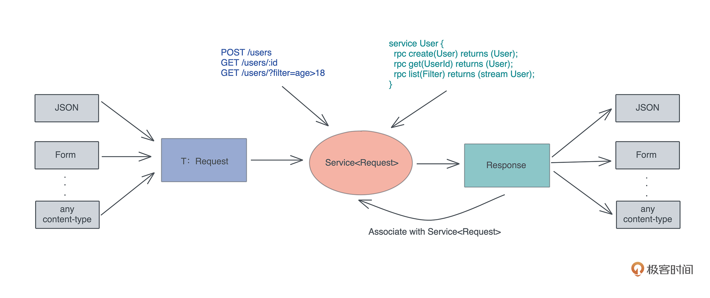
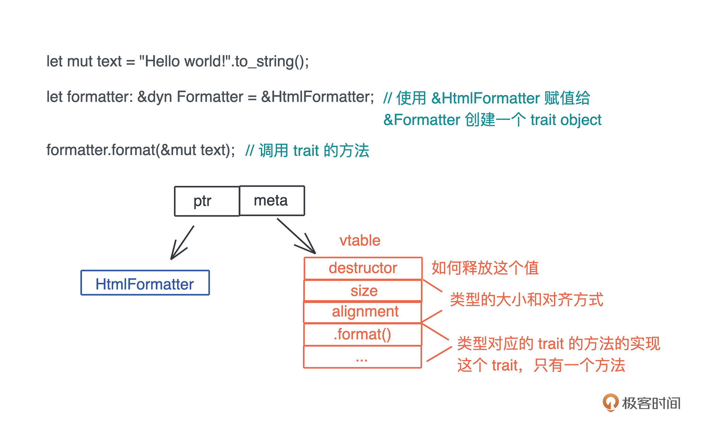
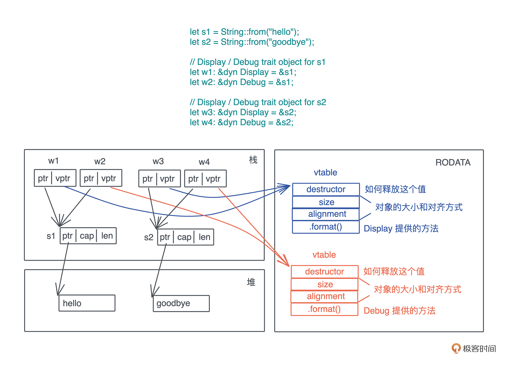
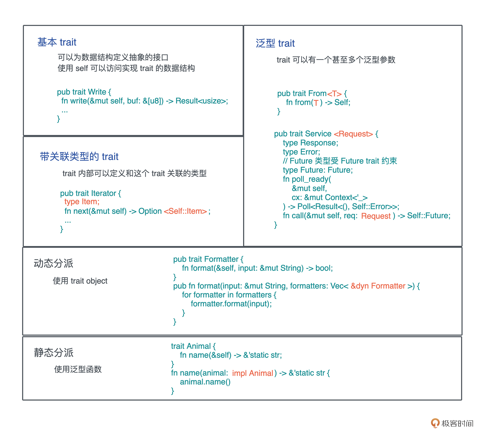

# 13｜类型系统：如何使用trait来定义接口？
你好，我是陈天。

通过上一讲的学习，我们对 Rust 类型系统的本质有了认识。作为对类型进行定义、检查和处理的工具，类型系统保证了某个操作处理的数据类型是我们所希望的。

在Rust强大的泛型支持下，我们可以很方便地定义、使用泛型数据结构和泛型函数，并使用它们来处理参数多态，让输入输出参数的类型更灵活，增强代码的复用性。

今天我们继续讲多态中另外两种方式：特设多态和子类型多态，看看它们能用来解决什么问题、如何实现、如何使用。

如果你不太记得这两种多态的定义，我们简单回顾一下：特设多态包括运算符重载，是指同一种行为有很多不同的实现；而把子类型当成父类型使用，比如 Cat 当成 Animal 使用，属于子类型多态。

这两种多态的实现在Rust中都和 trait 有关，所以我们得先来了解一下 trait 是什么，再看怎么用 trait 来处理这两种多态。

## 什么是 trait？

trait 是 Rust 中的接口，它**定义了类型使用这个接口的行为**。你可以类比到自己熟悉的语言中理解，trait 对于 Rust 而言，相当于 interface 之于 Java、protocol 之于 Swift、type class 之于 Haskell。

在开发复杂系统的时候，我们常常会强调接口和实现要分离。因为这是一种良好的设计习惯，它把调用者和实现者隔离开，双方只要按照接口开发，彼此就可以不受对方内部改动的影响。

<!-- [[[read_end]]] -->

trait 就是这样。它可以把数据结构中的行为单独抽取出来，使其可以在多个类型之间共享；也可以作为约束，在泛型编程中，限制参数化类型必须符合它规定的行为。

### 基本 trait

我们来看看基本 trait 如何定义。这里，以标准库中 [std::io::Write](https://doc.rust-lang.org/std/io/trait.Write.html) 为例，可以看到这个 trait 中定义了一系列方法的接口：

```
    pub trait Write {
        fn write(&mut self, buf: &[u8]) -> Result<usize>;
        fn flush(&mut self) -> Result<()>;
        fn write_vectored(&mut self, bufs: &[IoSlice<'_>]) -> Result<usize> { ... }
        fn is_write_vectored(&self) -> bool { ... }
        fn write_all(&mut self, buf: &[u8]) -> Result<()> { ... }
        fn write_all_vectored(&mut self, bufs: &mut [IoSlice<'_>]) -> Result<()> { ... }
        fn write_fmt(&mut self, fmt: Arguments<'_>) -> Result<()> { ... }
        fn by_ref(&mut self) -> &mut Self where Self: Sized { ... }
    }
    

```

这些方法也被称作关联函数（associate function）。**在 trait 中，方法可以有缺省的实现**，对于这个 Write trait，你只需要实现 write 和 flush 两个方法，其他都有[缺省实现](https://doc.rust-lang.org/src/std/io/mod.rs.html#1310-1629)。

如果你把 trait 类比为父类，实现 trait 的类型类比为子类，那么缺省实现的方法就相当于子类中可以重载但不是必须重载的方法。

在刚才定义方法的时候，我们频繁看到两个特殊的关键字：Self 和 self。

* Self 代表当前的类型，比如 File 类型实现了 Write，那么实现过程中使用到的 Self 就指代 File。
* self 在用作方法的第一个参数时，实际上是 self: Self 的简写，所以 \&self 是 self: \&Self, 而 \&mut self 是 self: \&mut Self。

光讲定义，理解不太深刻，我们构建一个 BufBuilder 结构实现 Write trait，结合代码来说明。（[Write trait 代码](https://play.rust-lang.org/?version=stable&mode=debug&edition=2018&gist=0a852b9832e4edd4f9760ca5355eb9f2)）：

```
    use std::fmt;
    use std::io::Write;
    
    struct BufBuilder {
        buf: Vec<u8>,
    }
    
    impl BufBuilder {
        pub fn new() -> Self {
            Self {
                buf: Vec::with_capacity(1024),
            }
        }
    }
    
    // 实现 Debug trait，打印字符串
    impl fmt::Debug for BufBuilder {
        fn fmt(&self, f: &mut fmt::Formatter) -> fmt::Result {
            write!(f, "{}", String::from_utf8_lossy(&self.buf))
        }
    }
    
    impl Write for BufBuilder {
        fn write(&mut self, buf: &[u8]) -> std::io::Result<usize> {
            // 把 buf 添加到 BufBuilder 的尾部
            self.buf.extend_from_slice(buf);
            Ok(buf.len())
        }
    
        fn flush(&mut self) -> std::io::Result<()> {
            // 由于是在内存中操作，所以不需要 flush
            Ok(())
        }
    }
    
    fn main() {
        let mut buf = BufBuilder::new();
        buf.write_all(b"Hello world!").unwrap();
        println!("{:?}", buf);
    }
    

```

从代码中可以看到，我们实现了 write 和 flush 方法，其它的方法都用缺省实现，这样 BufBuilder 对 Write trait 的实现是完整的。如果没有实现 write 或者 flush，Rust 编译器会报错，你可以自己尝试一下。

数据结构一旦实现了某个 trait，那么这个 trait 内部的方法都可以被使用，比如这里我们调用了 `buf.write_all()` 。

那么 `write_all()` 是如何被调用的呢？我们回去看 write\_all 的签名：

```
    fn write_all(&mut self, buf: &[u8]) -> Result<()>
    

```

它接受两个参数：\&mut self 和 \&\[u8\]，第一个参数传递的是 buf 这个变量的可变引用，第二个参数传递的是 b"Hello world\!"。

### 基本 trait 练习

好，搞明白 trait 基本的定义和使用后，我们来尝试定义一个 trait 巩固下。

假设我们要做一个字符串解析器，可以把字符串的某部分解析成某个类型，那么可以这么定义这个 trait：它有一个方法是 parse，这个方法接受一个字符串引用，返回 Self。

```
    pub trait Parse {
      fn parse(s: &str) -> Self;
    }
    

```

这个 parse 方法是 trait 的静态方法，因为它的第一个参数和 self 无关，所以在调用时需要使用 `T::parse(str)` 。

我们来尝试为 u8 这个数据结构来实现 parse，比如说：“123abc” 会被解析出整数 123，而 “abcd” 会被解析出 0。

要达到这样的目的，需要引入一个新的库 [Regex](https://github.com/rust-lang/regex) 使用正则表达式提取需要的内容，除此之外，还需要使用 [str::parse 函数](https://doc.rust-lang.org/std/primitive.str.html#method.parse) 把一个包含数字的字符串转换成数字。

整个代码如下（[Parse trait 练习代码](https://play.rust-lang.org/?version=stable&mode=debug&edition=2018&gist=859d0c3e69b38c0728b8566d1a08ea2e)）：

```
    use regex::Regex;
    pub trait Parse {
        fn parse(s: &str) -> Self;
    }
    
    impl Parse for u8 {
        fn parse(s: &str) -> Self {
            let re: Regex = Regex::new(r"^[0-9]+").unwrap();
            if let Some(captures) = re.captures(s) {
                // 取第一个 match，将其捕获的 digits 换成 u8
                captures
                    .get(0)
                    .map_or(0, |s| s.as_str().parse().unwrap_or(0))
            } else {
                0
            }
        }
    }
    
    #[test]
    fn parse_should_work() {
        assert_eq!(u8::parse("123abcd"), 123);
        assert_eq!(u8::parse("1234abcd"), 0);
        assert_eq!(u8::parse("abcd"), 0);
    }
    
    fn main() {
        println!("result: {}", u8::parse("255 hello world"));
    }
    

```

这个实现并不难，如果你感兴趣的话，可以再尝试为 f64 实现这个 Parse trait，比如 “123.45abcd” 需要被解析成 123.45。

在实现 f64 的过程中，你是不是感觉除了类型和用于捕获的 regex 略有变化外，整个代码基本和上面的代码是重复的？作为开发者，我们希望 Don’t Repeat Yourself（DRY），所以这样的代码写起来很别扭，让人不舒服。有没有更好的方法？

有！上一讲介绍了泛型编程，所以**在实现 trait 的时候，也可以用泛型参数来实现 trait**，需要注意的是，要对泛型参数做一定的限制。

* 第一，不是任何类型都可以通过字符串解析出来，在例子中，我们只能处理数字类型，并且这个类型还要能够被 [str::parse](https://doc.rust-lang.org/std/primitive.str.html#method.parse) 处理。

具体看文档，str::parse 是一个泛型函数，它返回任何实现了 FromStr trait 的类型，所以这里**对泛型参数的第一个限制是，它必须实现了 FromStr trait**。

* 第二，上面代码当无法正确解析字符串的时候，会直接返回 0，表示无法处理，但我们使用泛型参数后，无法返回 0，因为 0 不一定是某个符合泛型参数的类型中的一个值。怎么办？

其实返回 0 的目的是为处理不了的情况，返回一个缺省值，在 Rust 标准库中有 Default trait，绝大多数类型都实现了这个 trait，来为数据结构提供缺省值，所以**泛型参数的另一个限制是 Default**。

好，基本的思路有了，来看看代码吧（[Parse trait DRY代码](https://play.rust-lang.org/?version=stable&mode=debug&edition=2018&gist=cefbce6d981c2ef7705ef663de7b9f74)）：

```
    use std::str::FromStr;
    
    use regex::Regex;
    pub trait Parse {
        fn parse(s: &str) -> Self;
    }
    
    // 我们约束 T 必须同时实现了 FromStr 和 Default
    // 这样在使用的时候我们就可以用这两个 trait 的方法了
    impl<T> Parse for T
    where
        T: FromStr + Default,
    {
        fn parse(s: &str) -> Self {
            let re: Regex = Regex::new(r"^[0-9]+(\.[0-9]+)?").unwrap();
            // 生成一个创建缺省值的闭包，这里主要是为了简化后续代码
            // Default::default() 返回的类型根据上下文能推导出来，是 Self
            // 而我们约定了 Self，也就是 T 需要实现 Default trait
            let d = || Default::default();
            if let Some(captures) = re.captures(s) {
                captures
                    .get(0)
                    .map_or(d(), |s| s.as_str().parse().unwrap_or(d()))
            } else {
                d()
            }
        }
    }
    
    #[test]
    fn parse_should_work() {
        assert_eq!(u32::parse("123abcd"), 123);
        assert_eq!(u32::parse("123.45abcd"), 0);
        assert_eq!(f64::parse("123.45abcd"), 123.45);
        assert_eq!(f64::parse("abcd"), 0f64);
    }
    
    fn main() {
        println!("result: {}", u8::parse("255 hello world"));
    }
    

```

通过对带有约束的泛型参数实现 trait，一份代码就实现了 u32 / f64 等类型的 Parse trait，非常精简。不过，看这段代码你有没有感觉还是有些问题？当无法正确解析字符串时，我们返回了缺省值，难道不是应该返回一个错误么？

是的。**这里返回缺省值的话，会跟解析 “0abcd” 这样的情况混淆，不知道解析出的 0，究竟是出错了，还是本该解析出 0**。

所以更好的方式是 parse 函数返回一个 Result\<T, E>：

```
    pub trait Parse {
        fn parse(s: &str) -> Result<Self, E>;
    }
    

```

但这里 Result 的 E 让人犯难了：要返回的错误信息，在 trait 定义时并不确定，不同的实现者可以使用不同的错误类型，这里 trait 的定义者最好能够把这种灵活性留给 trait 的实现者。怎么办？

想想既然 trait 允许内部包含方法，也就是关联函数，可不可以进一步包含关联类型呢？答案是肯定的。

### 带关联类型的 trait

Rust 允许 trait 内部包含关联类型，实现时跟关联函数一样，它也需要实现关联类型。我们看怎么为 Parse trait 添加关联类型：

```
    pub trait Parse {
        type Error;
        fn parse(s: &str) -> Result<Self, Self::Error>;
    }
    

```

有了关联类型 Error，Parse trait 就可以在出错时返回合理的错误了，看修改后的代码（[Parse trait DRY.2代码](https://play.rust-lang.org/?version=stable&mode=debug&edition=2018&gist=3fe64849f7f6e05222303b237707bb58)）：

```
    use std::str::FromStr;
    
    use regex::Regex;
    pub trait Parse {
        type Error;
        fn parse(s: &str) -> Result<Self, Self::Error>
        where
            Self: Sized;
    }
    
    impl<T> Parse for T
    where
        T: FromStr + Default,
    {
        // 定义关联类型 Error 为 String
        type Error = String;
        fn parse(s: &str) -> Result<Self, Self::Error> {
            let re: Regex = Regex::new(r"^[0-9]+(\.[0-9]+)?").unwrap();
            if let Some(captures) = re.captures(s) {
                // 当出错时我们返回 Err(String)
                captures
                    .get(0)
                    .map_or(Err("failed to capture".to_string()), |s| {
                        s.as_str()
                            .parse()
                            .map_err(|_err| "failed to parse captured string".to_string())
                    })
            } else {
                Err("failed to parse string".to_string())
            }
        }
    }
    
    #[test]
    fn parse_should_work() {
        assert_eq!(u32::parse("123abcd"), Ok(123));
        assert_eq!(
            u32::parse("123.45abcd"),
            Err("failed to parse captured string".into())
        );
        assert_eq!(f64::parse("123.45abcd"), Ok(123.45));
        assert!(f64::parse("abcd").is_err());
    }
    
    fn main() {
        println!("result: {:?}", u8::parse("255 hello world"));
    }
    

```

上面的代码中，我们允许用户把错误类型延迟到 trait 实现时才决定，这种带有关联类型的 trait 比普通 trait，更加灵活，抽象度更高。

trait 方法里的参数或者返回值，都可以用关联类型来表述，而在实现有关联类型的 trait 时，只需要额外提供关联类型的具体类型即可。

### 支持泛型的 trait

到目前为止，我们一步步了解了基础 trait 的定义、使用，以及更为复杂灵活的带关联类型的 trait。所以结合上一讲介绍的泛型，你有没有想到这个问题：trait 的定义是不是也可以支持泛型呢？

比如要定义一个 Concat trait 允许数据结构拼接起来，那么自然而然地，我们希望 String 可以和 String 拼接、和 \&str 拼接，甚至和任何能转换成 String 的数据结构拼接。这个时候，就需要 Trait 也支持泛型了。

来看看标准库里的操作符是如何重载的，以 [std::ops::Add](https://doc.rust-lang.org/std/ops/trait.Add.html) 这个用于提供加法运算的 trait 为例：

```
    pub trait Add<Rhs = Self> {
        type Output;
        #[must_use]
        fn add(self, rhs: Rhs) -> Self::Output;
    }
    

```

这个 trait 有一个泛型参数 Rhs，代表加号右边的值，它被用在 add 方法的第二个参数位。这里 Rhs 默认是 Self，也就是说你用 Add trait ，如果不提供泛型参数，那么加号右值和左值都要是相同的类型。

我们来定义一个复数类型，尝试使用下这个 trait（[Add trait 练习代码1](https://play.rust-lang.org/?version=stable&mode=debug&edition=2018&gist=685e20867a539e5b559df7976b34f574)）：

```
    use std::ops::Add;
    
    #[derive(Debug)]
    struct Complex {
        real: f64,
        imagine: f64,
    }
    
    impl Complex {
        pub fn new(real: f64, imagine: f64) -> Self {
            Self { real, imagine }
        }
    }
    
    // 对 Complex 类型的实现
    impl Add for Complex {
        type Output = Self;
    
        // 注意 add 第一个参数是 self，会移动所有权
        fn add(self, rhs: Self) -> Self::Output {
            let real = self.real + rhs.real;
            let imagine = self.imagine + rhs.imagine;
            Self::new(real, imagine)
        }
    }
    
    fn main() {
        let c1 = Complex::new(1.0, 1f64);
        let c2 = Complex::new(2 as f64, 3.0);
        println!("{:?}", c1 + c2);
        // c1、c2 已经被移动，所以下面这句无法编译
        // println!("{:?}", c1 + c2);
    }
    

```

复数类型有实部和虚部，两个复数的实部相加，虚部相加，得到一个新的复数。注意 add 的第一个参数是 self，它会移动所有权，所以调用完两个复数 c1 + c2 后，根据所有权规则，它们就无法使用了。

所以，Add trait 对于实现了 Copy trait 的类型如 u32、f64 等结构来说，用起来很方便，但对于我们定义的 Complex 类型，执行一次加法，原有的值就无法使用，很不方便，怎么办？能不能对 Complex 的引用实现 Add trait 呢？

可以的。我们为 \&Complex 也实现 Add（[Add trait 练习代码2](https://play.rust-lang.org/?version=stable&mode=debug&edition=2018&gist=b37f69ec583cccf49276e8db61e5fc1b)）：

```
    // ...
    
    // 如果不想移动所有权，可以为 &Complex 实现 add，这样可以做 &c1 + &c2
    impl Add for &Complex {
        // 注意返回值不应该是 Self 了，因为此时 Self 是 &Complex
        type Output = Complex;
    
        fn add(self, rhs: Self) -> Self::Output {
            let real = self.real + rhs.real;
            let imagine = self.imagine + rhs.imagine;
            Complex::new(real, imagine)
        }
    }
    
    fn main() {
        let c1 = Complex::new(1.0, 1f64);
        let c2 = Complex::new(2 as f64, 3.0);
        println!("{:?}", &c1 + &c2);
        println!("{:?}", c1 + c2);
    }
    

```

可以做 \&c1 + \&c2，这样所有权就不会移动了。

讲了这么多，你可能有疑问了，这里都只使用了缺省的泛型参数，那定义泛型有什么用？

我们用加法的实际例子，来回答这个问题。之前都是两个复数的相加，现在设计一个复数和一个实数直接相加，相加的结果是实部和实数相加，虚部不变。好，来看看这个需求怎么实现（[Add trait 练习代码3](https://play.rust-lang.org/?version=stable&mode=debug&edition=2018&gist=cc02b2ed6e8ec3e593d0e9d5b7f1b6c6)）：

```
    // ...
    
    // 因为 Add<Rhs = Self> 是个泛型 trait，我们可以为 Complex 实现 Add<f64>
    impl Add<f64> for &Complex {
        type Output = Complex;
    
        // rhs 现在是 f64 了
        fn add(self, rhs: f64) -> Self::Output {
            let real = self.real + rhs;
            Complex::new(real, self.imagine)
        }
    }
    
    fn main() {
        let c1 = Complex::new(1.0, 1f64);
        let c2 = Complex::new(2 as f64, 3.0);
        println!("{:?}", &c1 + &c2);
        println!("{:?}", &c1 + 5.0);
        println!("{:?}", c1 + c2);
    }
    

```

通过使用 Add ，为 Complex 实现了和 f64 相加的方法。**所以泛型 trait 可以让我们在需要的时候，对同一种类型的同一个 trait，有多个实现**。

这个小例子实用性不太够，再来看一个实际工作中可能会使用到的泛型 trait，你就知道这个支持有多强大了。

[tower::Service](https://docs.rs/tower/0.4.8/tower/trait.Service.html) 是一个第三方库，它定义了一个精巧的用于处理请求，返回响应的经典 trait，在不少著名的第三方网络库中都有使用，比如处理 gRPC 的 [tonic](https://docs.rs/tonic/0.5.2/tonic/)。

看 Service 的定义：

```
    // Service trait 允许某个 service 的实现能处理多个不同的 Request
    pub trait Service<Request> {
        type Response;
        type Error;
        // Future 类型受 Future trait 约束
        type Future: Future;
        fn poll_ready(
            &mut self, 
            cx: &mut Context<'_>
        ) -> Poll<Result<(), Self::Error>>;
        fn call(&mut self, req: Request) -> Self::Future;
    }
    

```

这个 trait 允许某个 Service 能处理多个不同的 Request。我们在 Web 开发中使用该 trait 的话，每个 Method+URL 可以定义为一个 Service，其 Request 是输入类型。

注意对于某个确定的 Request 类型，只会返回一种 Response，所以这里 Response 使用关联类型，而非泛型。如果有可能返回多个 Response，那么应该使用泛型 Service\<Request, Response>。

未来讲网络开发的时候再详细讲这个 trait，现在你只要能理解泛型 trait 的广泛应用场景就可以了。

### trait 的“继承”

在 Rust 中，一个 trait 可以“继承”另一个 trait 的关联类型和关联函数。比如 trait B: A ，是说任何类型 T，如果实现了 trait B，它也必须实现 trait A，换句话说，**trait B 在定义时可以使用 trait A 中的关联类型和方法**。

可“继承”对扩展 trait 的能力很有帮助，很多常见的 trait 都会使用 trait 继承来提供更多的能力，比如 tokio 库中的 [AsyncWriteExt](https://docs.rs/tokio/1.10.0/tokio/io/trait.AsyncWriteExt.html)、futures 库中的 [StreamExt](https://docs.rs/futures/0.3.16/futures/stream/trait.StreamExt.html)。

以 StreamExt 为例，由于 StreamExt 中的方法都有缺省的实现，且所有实现了 Stream trait 的类型都实现了 StreamExt：

```
    impl<T: ?Sized> StreamExt for T where T: Stream {}
    

```

所以如果你实现了 Stream trait，就可以直接使用 StreamExt 里的方法了，非常方便。

好，到这里trait就基本讲完了，简单总结一下，trait 作为对不同数据结构中相同行为的一种抽象。除了基本 trait 之外，

* 当行为和具体的数据关联时，比如字符串解析时定义的 Parse trait，我们引入了带有关联类型的 trait，把和行为有关的数据类型的定义，进一步延迟到 trait 实现的时候。
* 对于同一个类型的同一个 trait 行为，可以有不同的实现，比如我们之前大量使用的 From，此时可以用泛型 trait。

可以说 Rust 的 trait 就像一把瑞士军刀，把需要定义接口的各种场景都考虑进去了。

而特设多态是同一种行为的不同实现。所以其实，**通过定义 trait 以及为不同的类型实现这个 trait，我们就已经实现了特设多态**。

刚刚讲过的 Add trait 就是一个典型的特设多态，同样是加法操作，根据操作数据的不同进行不同的处理。Service trait 是一个不那么明显的特设多态，同样是 Web 请求，对于不同的 URL，我们使用不同的代码去处理。

## 如何做子类型多态？

从严格意义上说，子类型多态是面向对象语言的专利。**如果一个对象 A 是对象 B 的子类，那么 A 的实例可以出现在任何期望 B 的实例的上下文中**，比如猫和狗都是动物，如果一个函数的接口要求传入一个动物，那么传入猫和狗都是允许的。

Rust 虽然没有父类和子类，但 trait 和实现 trait 的类型之间也是类似的关系，所以，Rust 也可以做子类型多态。看一个例子（[代码](https://play.rust-lang.org/?version=stable&mode=debug&edition=2018&gist=21d316e5ce9338cfeba6b5a4f7a3b479)）：

```
    struct Cat;
    struct Dog;
    
    trait Animal {
        fn name(&self) -> &'static str;
    }
    
    impl Animal for Cat {
        fn name(&self) -> &'static str {
            "Cat"
        }
    }
    
    impl Animal for Dog {
        fn name(&self) -> &'static str {
            "Dog"
        }
    }
    
    fn name(animal: impl Animal) -> &'static str {
        animal.name()
    }
    
    fn main() {
        let cat = Cat;
        println!("cat: {}", name(cat));
    }
    

```

这里 impl Animal 是 T: Animal 的简写，所以 name 函数的定义和以下定义等价：

```
    fn name<T: Animal>(animal: T) -> &'static str;
    

```

上一讲提到过，这种泛型函数会根据具体使用的类型被单态化，编译成多个实例，是静态分派。

静态分派固然很好，效率很高，**但很多时候，类型可能很难在编译时决定**。比如要撰写一个格式化工具，这个在 IDE 里很常见，我们可以定义一个 `Formatter` 接口，然后创建一系列实现：

```
    pub trait Formatter {
        fn format(&self, input: &mut String) -> bool;
    }
    
    struct MarkdownFormatter;
    impl Formatter for MarkdownFormatter {
        fn format(&self, input: &mut String) -> bool {
            input.push_str("\nformatted with Markdown formatter");
            true
        }
    }
    
    struct RustFormatter;
    impl Formatter for RustFormatter {
        fn format(&self, input: &mut String) -> bool {
            input.push_str("\nformatted with Rust formatter");
            true
        }
    }
    
    struct HtmlFormatter;
    impl Formatter for HtmlFormatter {
        fn format(&self, input: &mut String) -> bool {
            input.push_str("\nformatted with HTML formatter");
            true
        }
    }
    

```

首先，使用什么格式化方法，只有当打开文件，分析出文件内容之后才能确定，我们无法在编译期给定一个具体类型。其次，一个文件可能有一到多个格式化工具，比如一个 Markdown 文件里有 Rust 代码，同时需要 `MarkdownFormatter` 和 `RustFormatter` 来格式化。

这里如果使用一个 Vec\<T> 来提供所有需要的格式化工具，那么，下面这个函数其 formatters 参数该如何确定类型呢？

```
    pub fn format(input: &mut String, formatters: Vec<???>) {
        for formatter in formatters {
            formatter.format(input);
        }
    }
    

```

正常情况下，`Vec<>` 容器里的类型需要是一致的，但此处无法给定一个一致的类型。

所以我们要有一种手段，告诉编译器，此处需要并且仅需要任何实现了 `Formatter` 接口的数据类型。**在 Rust 里，这种类型叫Trait Object**，表现为 `&dyn Trait` 或者 `Box<dyn Trait>`。

这里，`dyn` 关键字只是用来帮助我们更好地区分普通类型和 Trait 类型，阅读代码时，看到 dyn 就知道后面跟的是一个 trait 了。

于是，上述代码可以写成：

```
    pub fn format(input: &mut String, formatters: Vec<&dyn Formatter>) {
        for formatter in formatters {
            formatter.format(input);
        }
    }
    

```

这样可以在运行时，构造一个 `Formatter` 的列表，传递给 `format` 函数进行文件的格式化，这就是**动态分派**（dynamic dispatching）。

看最终调用的[格式化工具代码](https://play.rust-lang.org/?version=stable&mode=debug&edition=2018&gist=73f88c0bc0911026335ceba5cb670603)：

```
    pub trait Formatter {
        fn format(&self, input: &mut String) -> bool;
    }
    
    struct MarkdownFormatter;
    impl Formatter for MarkdownFormatter {
        fn format(&self, input: &mut String) -> bool {
            input.push_str("\nformatted with Markdown formatter");
            true
        }
    }
    
    struct RustFormatter;
    impl Formatter for RustFormatter {
        fn format(&self, input: &mut String) -> bool {
            input.push_str("\nformatted with Rust formatter");
            true
        }
    }
    
    struct HtmlFormatter;
    impl Formatter for HtmlFormatter {
        fn format(&self, input: &mut String) -> bool {
            input.push_str("\nformatted with HTML formatter");
            true
        }
    }
    
    pub fn format(input: &mut String, formatters: Vec<&dyn Formatter>) {
        for formatter in formatters {
            formatter.format(input);
        }
    }
    
    fn main() {
        let mut text = "Hello world!".to_string();
        let html: &dyn Formatter = &HtmlFormatter;
        let rust: &dyn Formatter = &RustFormatter;
        let formatters = vec![html, rust];
        format(&mut text, formatters);
    
        println!("text: {}", text);
    }
    

```

这个实现是不是很简单？学到这里你在兴奋之余，不知道会不会感觉有点负担，又一个Rust新名词出现了。别担心，虽然 Trait Object 是 Rust 独有的概念，但是这个概念并不新鲜。为什么这么说呢，来看它的实现机理。

### Trait Object 的实现机理

当需要使用 Formatter trait 做动态分派时，可以像如下例子一样，将一个具体类型的引用，赋给 `&Formatter` ： 

HtmlFormatter 的引用赋值给 Formatter 后，会生成一个 Trait Object，在上图中可以看到，**Trait Object 的底层逻辑就是胖指针**。其中，一个指针指向数据本身，另一个则指向虚函数表（vtable）。

vtable 是一张静态的表，Rust 在编译时会为使用了 trait object 的类型的 trait 实现生成一张表，放在可执行文件中（一般在 TEXT 或 RODATA 段）。看下图，可以帮助你理解：

在这张表里，包含具体类型的一些信息，如 size、aligment 以及一系列函数指针：

* 这个接口支持的所有的方法，比如 `format()` ；
* 具体类型的 drop trait，当 Trait object 被释放，它用来释放其使用的所有资源。

这样，当在运行时执行 `formatter.format()` 时，formatter 就可以从 vtable 里找到对应的函数指针，执行具体的操作。

所以，**Rust 里的 Trait Object 没什么神秘的，它不过是我们熟知的 C加加 / Java 中 vtable 的一个变体而已**。

这里说句题外话，C加加 / Java 指向 vtable 的指针，在编译时放在类结构里，而 Rust 放在 Trait object 中。这也是为什么 Rust 很容易对原生类型做动态分派，而 C加加/Java 不行。

事实上，Rust 也并不区分原生类型和组合类型，对 Rust 来说，所有类型的地位都是一致的。

不过，你使用 trait object 的时候，要注意对象安全（object safety）。只有满足对象安全的 trait 才能使用 trait object，在[官方文档](https://doc.rust-lang.org/book/ch17-02-trait-objects.html)中有详细讨论。

那什么样的 trait 不是对象安全的呢？

**如果 trait 所有的方法，返回值是 Self 或者携带泛型参数，那么这个 trait 就不能产生 trait object**。

不允许返回 Self，是因为 trait object 在产生时，原来的类型会被抹去，所以 Self 究竟是谁不知道。比如 Clone trait 只有一个方法 clone\(\)，返回 Self，所以它就不能产生 trait object。

不允许携带泛型参数，是因为 Rust 里带泛型的类型在编译时会做单态化，而 trait object 是运行时的产物，两者不能兼容。

比如 From trait，因为整个 trait 带了泛型，每个方法也自然包含泛型，就不能产生 trait object。如果一个 trait 只有部分方法返回 Self 或者使用了泛型参数，那么这部分方法在 trait object 中不能调用。

## 小结

今天完整地介绍了 trait 是如何定义和使用的，包括最基本的 trait、带关联类型的 trait，以及泛型 trait。我们还回顾了通过 trait 做静态分发以及使用 trait object 做动态分发。

今天的内容比较多，不太明白的地方建议你多看几遍，你也可以通过下图来回顾这一讲的主要内容：

trait 作为对不同数据结构中相同行为的一种抽象，它可以让我们**在开发时，通过用户需求，先敲定系统的行为，把这些行为抽象成 trait，之后再慢慢确定要使用的数据结构，以及如何为数据结构实现这些 trait**。

所以，trait 是你做 Rust 开发的核心元素。什么时候使用什么 trait，需要根据需求来确定。

但是需求往往不是那么明确的，尤其是因为我们要把用户需求翻译成系统设计上的需求。这种翻译能力，得靠足够多源码的阅读和思考，以及足够丰富的历练，一点点累积成的。**因为 Rust 的 trait 再强大，也只是一把瑞士军刀，能让它充分发挥作用的是持有它的那个人**。

以在 get hands dirty 系列中写的代码为例，我们使用了 trait 对系统进行解耦，并增强其扩展性，你可以简单回顾一下。比如第 5 讲的 Engine trait 和 SpecTransform trait，使用了普通 trait：

```
    // Engine trait：未来可以添加更多的 engine，主流程只需要替换 engine
    pub trait Engine {
        // 对 engine 按照 specs 进行一系列有序的处理
        fn apply(&mut self, specs: &[Spec]);
        // 从 engine 中生成目标图片，注意这里用的是 self，而非 self 的引用
        fn generate(self, format: ImageOutputFormat) -> Vec<u8>;
    }
    // SpecTransform：未来如果添加更多的 spec，只需要实现它即可
    pub trait SpecTransform<T> {
        // 对图片使用 op 做 transform
        fn transform(&mut self, op: T);
    }
    

```

第 6 讲的 Fetch/Load trait，使用了带关联类型的 trait：

```
    // Rust 的 async trait 还没有稳定，可以用 async_trait 宏
    #[async_trait]
    pub trait Fetch {
        type Error;
        async fn fetch(&self) -> Result<String, Self::Error>;
    }
    
    pub trait Load {
        type Error;
        fn load(self) -> Result<DataSet, Self::Error>;
    }
    

```

## 思考题

1.对于 Add\<Rhs> trait，如果我们不用泛型，把 Rhs 作为 Add trait 的关联类型，可以么？为什么？

2.如下代码能编译通过么，为什么？

```
    use std::{fs::File, io::Write};
    fn main() {
        let mut f = File::create("/tmp/test_write_trait").unwrap();
        let w: &mut dyn Write = &mut f;
        w.write_all(b"hello ").unwrap();
        let w1 = w.by_ref();
        w1.write_all(b"world").unwrap();
    }
    

```

3.在 Complex 的例子中，c1 + c2 会导致所有权移动，所以我们使用了 \&c1 + \&c2 来避免这种行为。除此之外，你还有什么方法能够让 c1 + c2 执行完之后还能继续使用么？如何修改 Complex 的代码来实现这个功能呢？

```
        // c1、c2 已经被移动，所以下面这句无法编译
        // println!("{:?}", c1 + c2);
    

```

4.学有余力的同学可以挑战一下，[Iterator](https://doc.rust-lang.org/std/iter/trait.Iterator.html) 是 Rust 下的迭代器的 trait，你可以阅读 Iterator 的文档获得更多的信息。它有一个关联类型 Item 和一个方法 next\(\) 需要实现，每次调用 next，如果迭代器中还能得到一个值，则返回 Some\(Item\)，否则返回 None。请阅读[如下代码](https://play.rust-lang.org/?version=stable&mode=debug&edition=2018&gist=6310cafc64afbd4762dd7997533f7d31)，想想看如何实现 SentenceIter 这个结构的迭代器？

```
    struct SentenceIter<'a> {
        s: &'a mut &'a str,
        delimiter: char,
    }
    
    impl<'a> SentenceIter<'a> {
        pub fn new(s: &'a mut &'a str, delimiter: char) -> Self {
            Self { s, delimiter }
        }
    }
    
    impl<'a> Iterator for SentenceIter<'a> {
        type Item; // 想想 Item 应该是什么类型？
    
        fn next(&mut self) -> Option<Self::Item> {
            // 如何实现 next 方法让下面的测试通过？
            todo!()
        }
    }
    
    
    
    #[test]
    fn it_works() {
        let mut s = "This is the 1st sentence. This is the 2nd sentence.";
        let mut iter = SentenceIter::new(&mut s, '.');
        assert_eq!(iter.next(), Some("This is the 1st sentence."));
        assert_eq!(iter.next(), Some("This is the 2nd sentence."));
        assert_eq!(iter.next(), None);
    }
    
    fn main() {
        let mut s = "a。 b。 c";
        let sentences: Vec<_> = SentenceIter::new(&mut s, '。').collect();
        println!("sentences: {:?}", sentences);
    }
    

```

今天你已经完成了Rust学习的第13次打卡。我们下节课见～

## 延伸阅读

使用 trait 有两个注意事项：

* 第一，在定义和使用 trait 时，我们需要遵循孤儿规则（Orphan Rule）。

trait 和实现 trait 的数据类型，至少有一个是在当前 crate 中定义的，也就是说，你不能为第三方的类型实现第三方的 trait，当你尝试这么做时，Rust 编译器会报错。我们在第6讲的 SQL查询工具query中，定义了很多简单的直接包裹已有数据结构的类型，就是为了应对孤儿规则。

* 第二，Rust 对含有 async fn 的 trait ，还没有一个很好的被标准库接受的实现，如果你感兴趣可以看[这篇文章](https://smallcultfollowing.com/babysteps/blog/2019/10/26/async-fn-in-traits-are-hard/)了解它背后的原因。

在第5讲Thumbor图片服务器我们使用了 async\_trait 这个库，为 trait 的实现添加了一个标记宏 #\[async\_trait\]。这是目前最推荐的无缝使用 async trait 的方法。未来 async trait 如果有了标准实现，我们不需要对现有代码做任何改动。

使用 async\_trait 的代价是每次调用会发生额外的堆内存分配，但绝大多数应用场景下，这并不会有性能上的问题。

还记得当时写get hands dirty系列时，说我们在后面讲到具体知识点会再回顾么。你可以再回去看看（第5讲）在Thumbor图片服务器中定义的 Engine / SpecTransform，以及（第6讲）在SQL查询工具query中定义的 Fetch / Load，想想它们的作用以及给架构带来的好处。

另外，有同学可能好奇为什么我说“ vtable 会为每个类型的每个 trait 实现生成一张表”。这个并没有在任何公开的文档中提及，不过既然它是一个数据结构，我们就可以通过打印它的地址来追踪它的行为。我写了一段代码，你可以自行运行来进一步加深对 vtable 的理解（[代码](https://play.rust-lang.org/?version=stable&mode=debug&edition=2018&gist=1d161189515edb54c339657f41d28973)）：

```
    use std::fmt::{Debug, Display};
    use std::mem::transmute;
    
    fn main() {
        let s1 = String::from("hello world!");
        let s2 = String::from("goodbye world!");
        // Display / Debug trait object for s
        let w1: &dyn Display = &s1;
        let w2: &dyn Debug = &s1;
    
        // Display / Debug trait object for s1
        let w3: &dyn Display = &s2;
        let w4: &dyn Debug = &s2;
    
        // 强行把 triat object 转换成两个地址 (usize, usize)
        // 这是不安全的，所以是 unsafe
        let (addr1, vtable1): (usize, usize) = unsafe { transmute(w1) };
        let (addr2, vtable2): (usize, usize) = unsafe { transmute(w2) };
        let (addr3, vtable3): (usize, usize) = unsafe { transmute(w3) };
        let (addr4, vtable4): (usize, usize) = unsafe { transmute(w4) };
    
        // s 和 s1 在栈上的地址，以及 main 在 TEXT 段的地址
        println!(
            "s1: {:p}, s2: {:p}, main(): {:p}",
            &s1, &s2, main as *const ()
        );
        // trait object(s / Display) 的 ptr 地址和 vtable 地址
        println!("addr1: 0x{:x}, vtable1: 0x{:x}", addr1, vtable1);
        // trait object(s / Debug) 的 ptr 地址和 vtable 地址
        println!("addr2: 0x{:x}, vtable2: 0x{:x}", addr2, vtable2);
    
        // trait object(s1 / Display) 的 ptr 地址和 vtable 地址
        println!("addr3: 0x{:x}, vtable3: 0x{:x}", addr3, vtable3);
    
        // trait object(s1 / Display) 的 ptr 地址和 vtable 地址
        println!("addr4: 0x{:x}, vtable4: 0x{:x}", addr4, vtable4);
    
        // 指向同一个数据的 trait object 其 ptr 地址相同
        assert_eq!(addr1, addr2);
        assert_eq!(addr3, addr4);
    
        // 指向同一种类型的同一个 trait 的 vtable 地址相同
        // 这里都是 String + Display
        assert_eq!(vtable1, vtable3);
        // 这里都是 String + Debug
        assert_eq!(vtable2, vtable4);
    }
    

```

（如果你觉得有收获，也欢迎你分享给身边的朋友，邀他一起讨论～）