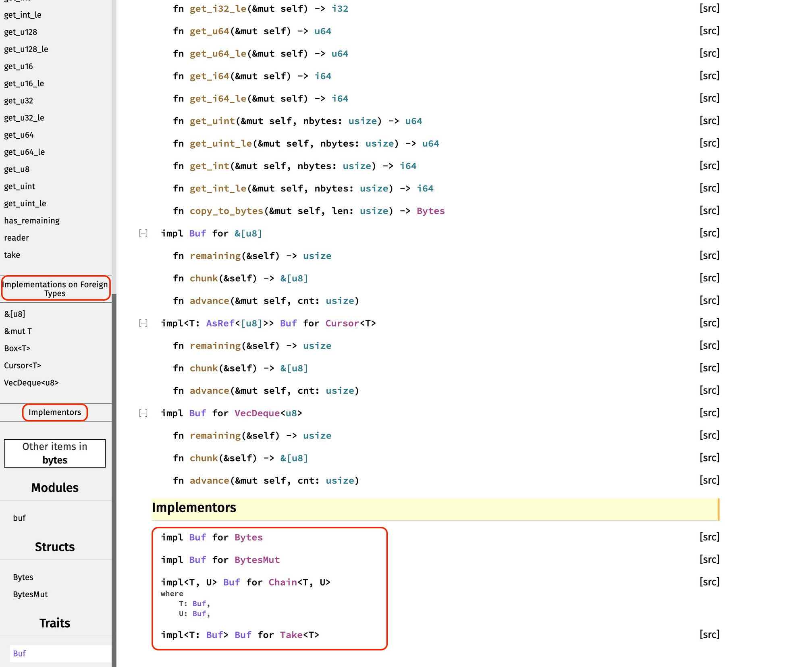
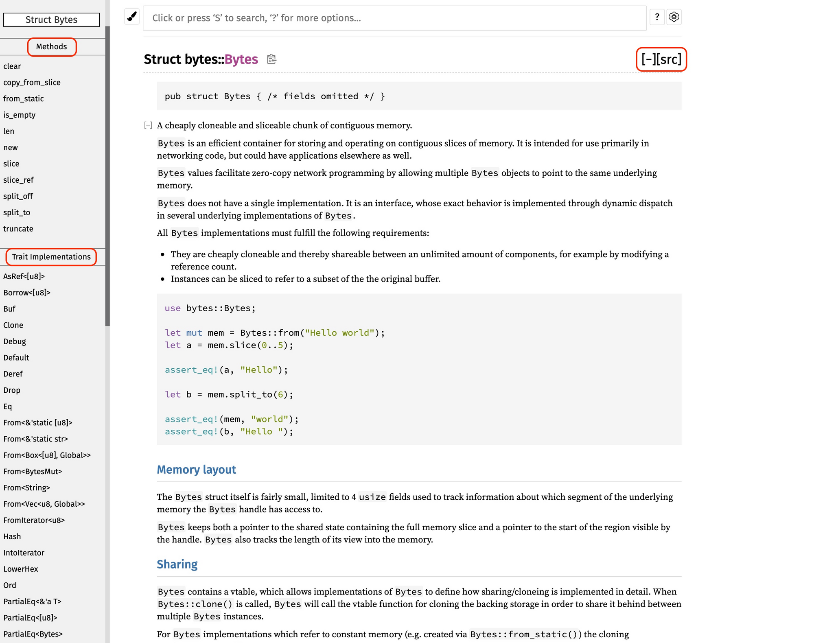
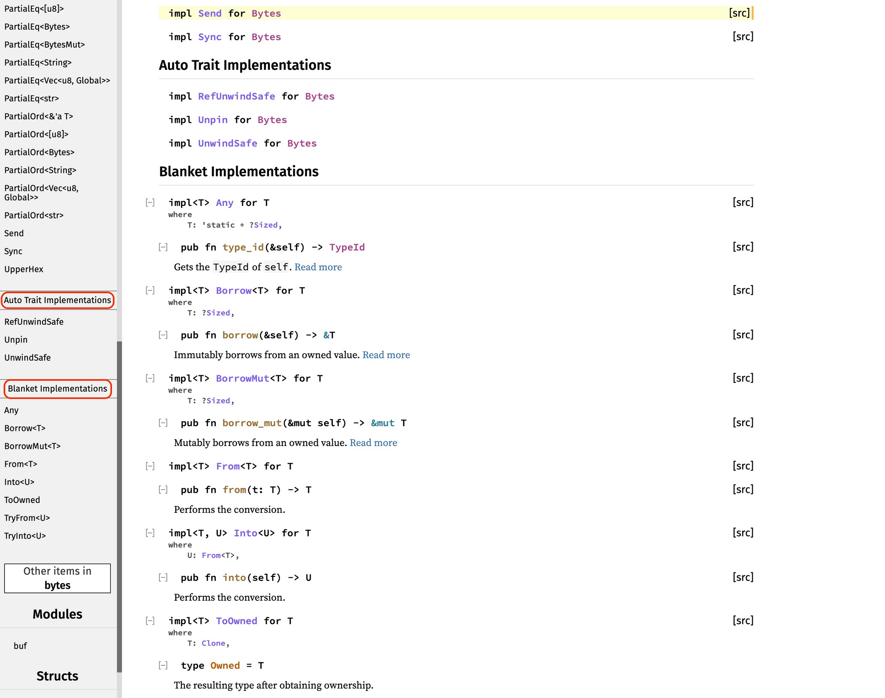
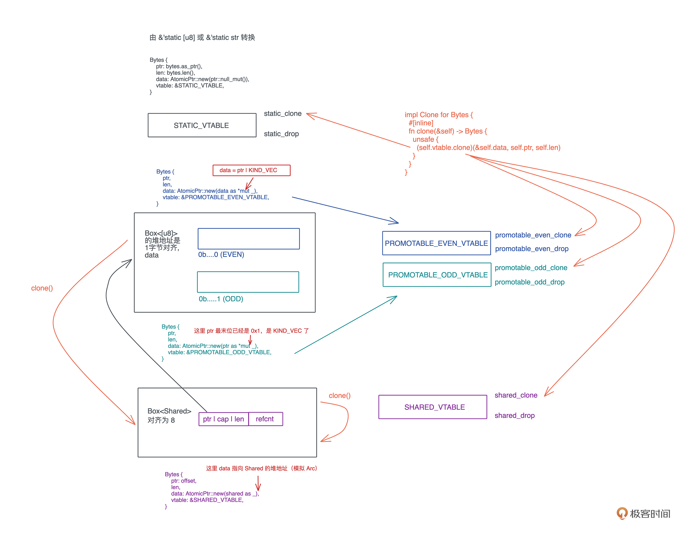

# 20｜4 Steps ：如何更好地阅读Rust源码？
你好，我是陈天。

到目前为止，Rust 的基础知识我们就学得差不多了。这倒不是说已经像用筛子一样，把基础知识仔细筛了一遍，毕竟我只能给你提供学习Rust的思路，扫清入门障碍。老话说得好，师傅领进门修行靠个人，在 Rust 世界里打怪升级，还要靠你自己去探索、去努力。

虽然不能帮你打怪，但是打怪的基本技巧可以聊一聊。所以在开始阶段实操引入大量新第三方库之前，我们非常有必要先聊一下这个很重要的技巧：**如何更好地阅读源码**。

其实会读源码是个终生受益的开发技能，却往往被忽略。在我读过的绝大多数的编程书籍里，很少有讲如何阅读代码的，就像世间的书籍千千万万，“如何阅读一本书”这样的题材却凤毛麟角。

当然，在解决“如何”之前，我们要先搞明白“为什么”。

## 为什么要阅读源码？

如果课程的每一讲你都认真看过，会发现时刻都在引用标准库的源码，让我们在阅读的时候，不光学基础知识，还能围绕它的第一手资料也就是源代码展开讨论。

如果说他人总结的知识是果实，那源代码就是结出这果实的种子。只摘果子吃，就是等他人赏饭，非常被动，也不容易分清果子的好坏；如果靠朴素的源码种子结出了自己的果实，确实前期要耐得住寂寞施肥浇水，但收割的时刻，一切尽在自己的掌控之中。

<!-- [[[read_end]]] -->

作为开发者，我们每天都和代码打交道。经过数年的基础教育和职业培训，我们都会“写”代码，或者至少会抄代码和改代码。但是，会读代码的其实并不多，会读代码又真正能读懂一些大项目源码的，少之又少。

这种怪状，真要追究起来，就是因为**前期我们所有的教育和培训都在强调怎么写代码**，并没有教怎么读代码，而走入工作后，大多数场景也都是一个萝卜一个坑，**我们只需要了解系统的一个局部就能开展工作，读和工作内容不相干的代码，似乎没什么用**。

那没有读过大量代码究竟有什么问题，毕竟工作好像还是能正常开展？就拿跟写代码有很多相通之处的写作来对比。

小时候我们都经历过读课文、背课文、写作文的过程。除了学习语法和文法知识外，从小学开始，经年累月，阅读各种名家作品，经过各种写作训练，才累积出自己的写作能力。所以可以说，写作建立在大量阅读基础上。

而我们写代码的过程就很不同了，在学会基础的语法和试验了若干 example 后，跳过了大量阅读名家作品的阶段，直接坐火箭般蹿到自己开始写业务代码。

这样跳过了大量的代码阅读有三个问题：

首先没有足够积累，我们很容易**养成 StackOverflow driven 的写代码习惯**。

遇到不知如何写的代码，从网上找现成的答案，找个高票的复制粘贴，改一改凑活着用，先完成功能再说。写代码的过程中遇到问题，就开启调试模式，要么设置无数断点一步步跟踪，要么到处打印信息试图为满是窟窿的代码打上补丁，导致写代码的整个过程就是一部调代码的血泪史。

其次，**因为平时基础不牢靠，我们靠边写边学的进步是最慢的**。道理很简单，前辈们踩过坑总结的经验教训，都不得不亲自用最慢的法子一点点试着踩一遍。

最后还有一个非常容易被忽略的天花板问题，**周围能触达的那个最强工程师开发水平的上限，就是我们的上限**。

但是如果重视读源码平时积累，并且具备一定阅读技巧，这三个问题就能迎刃而解。就像写作文形容美女时，你立即能想到“肌肤胜雪、明眸善睐、齿如含贝、气若幽兰……”，而不是憋了半天就三字“哇美女”。为了让我们在写代码的时候，摆脱只会“哇美女”这样的初级阶段，多读源码非常关键。

### 三大功用

读源码的第一个好处是，**知识的源头在你这里，你可以根据事实来分辨是非，而不是迷信权威**。比如说之前讲 Rc 时（[第9讲](https://time.geekbang.org/column/article/416722)），我们通过源码引出 Box::leak ，回答了为啥 Rc 可以突破 Rust 单一所有权的桎梏；谈到 FnOnce 时（[第19讲](https://time.geekbang.org/column/article/424009)），通过源码一眼看透为啥 FnOnce 只能调用一次。

未来你在跟别人分享的时候，可以很自信地回答这些问题，而不必说因为《陈天的 Rust 第一课》里是这么说的，这也解决了刚才的第一个问题。

通过源码我们还学到了很多技巧。比如 Rc::clone\(\) 如何使用内部可变性来保持 Clone trait 的不可变约束（[第9讲](https://time.geekbang.org/column/article/416722)）；Iterator 里的方法如何通过不断构造新的 Iterator 数据结构，来支持 lazy evaluation （[第16讲](https://time.geekbang.org/column/article/422975)）。

未来你在写代码时，这些技巧都可以使用，从“哇美女”的初级水平到可以试着使用“一笑倾城，再笑倾国”的地步。这是读源码的第二个好处，**看别人的代码，积累了素材，开拓了思路，自己写代码时可以“文思如泉涌，下笔如有神”**。

最后一个能解决的问题就是打破天花板了。累积素材是基础，被启发出来的思路将这些素材串成线，才形成了自己的知识。

优秀的代码读得越多，越能引发思考，从而引发更多的阅读，形成一个飞轮效应，让自己的知识变得越来越丰富。而知识的融会贯通，最终形成读代码的第三大功用：**通过了解、吸收别人的思想，去芜存菁，最终形成自己的思想或者说智慧**。

当然从素材、到知识、再到智慧，要长期积累，并非一朝一夕之功。搞明白“为什么”给到我们的三个学习方向，所以现在来进一步解决“如何”，分享一下我的方法论，为你的积累助助力。

## 如何阅读源码呢？

我们以第三方库 [Bytes](https://docs.rs/bytes/1.1.0/bytes/) 为例，来看看如何阅读源码。希望你跟着今天的节奏走，不管是否关心 bytes 的实现，都先以它为蓝本，把基本方法熟悉一遍，再扩展到更多代码的阅读，比如 [hyper](https://github.com/hyperium/hyper)、[nom](https://github.com/Geal/nom)、[tokio](https://github.com/tokio-rs/tokio)、[tonic](https://github.com/hyperium/tonic) 等。

Bytes 是 tokio 下一个高效处理网络数据的库，代码本身 3.5k LoC（不包括 2.1k LoC 注释），加上测试 5.3k。代码结构非常简单：

```
    ❯ tree src
    src
    ├── buf
    │   ├── buf_impl.rs
    │   ├── buf_mut.rs
    │   ├── chain.rs
    │   ├── iter.rs
    │   ├── limit.rs
    │   ├── mod.rs
    │   ├── reader.rs
    │   ├── take.rs
    │   ├── uninit_slice.rs
    │   ├── vec_deque.rs
    │   └── writer.rs
    ├── bytes.rs
    ├── bytes_mut.rs
    ├── fmt
    │   ├── debug.rs
    │   ├── hex.rs
    │   └── mod.rs
    ├── lib.rs
    ├── loom.rs
    └── serde.rs
    

```

能看到，脉络很清晰，是很容易阅读的代码。

先简单讲一下读 Rust 代码的顺序：从 crate 的大纲开始，先了解目标代码能干什么、怎么用；然后学习核心 trait，看看它支持哪些功能；之后再掌握主要的数据结构，开始写一些示例代码；最后围绕自己感兴趣的情景深入阅读。

至于为什么这么读，我们边读边具体说明。

### step1：从大纲开始

我们先从文档的大纲入手。Rust 的文档系统是所有编程语言中处在第一梯队的，即便不是最好的，也是最好之一。它的文档和代码结合地很紧密，可以来回跳转。

Rust 几乎所有库的文档都在 [docs.rs](http://docs.rs) 下，比如 Bytes 的文档可以通过 [docs.rs/bytes](http://docs.rs/bytes) 访问：  


首先阅读 crate 的文档，这样可以快速了解这个 crate 是做什么的，就像阅读一本书的时候，可以从书的序和前言入手了解梗概。除此之外，我们还可以看一下源码根目录下的 [README.md](https://github.com/tokio-rs/bytes)，作为补充资料。

有了大致了解后，你就可以深入了解自己感兴趣的内容。我们就按照初学的顺序来看。

对于 Bytes，我们看到它有两个 trait Buf / BufMut 以及两个数据结构 Bytes/BytesMut，没有 crate 级别的函数。接下来就是深入阅读代码了。

我看的顺序一般是：trait → struct → 函数/方法。因为这和我们写代码的思考方式非常类似：

* 先从需求的流程中敲定系统的行为，需要定义什么接口 trait；
* 再考虑系统有什么状态，定义了哪些数据结构struct；
* 最后到实现细节，包括如何为数据结构实现 trait、数据结构自身有什么算法、如何把整个流程串起来等等。

### step2：熟悉核心 trait 的行为

所以先看trait，我们以 Buf trait 为例。点进去看文档，主页面给了这个 trait 的定义和一个使用示例。  


注意左侧导航栏的 “required Methods” 和 “Provided Methods”，前者是实现这个 trait 需要实现的方法，后者是缺省方法。也就是说数据结构只要实现了这个 trait 的三个方法：advance\(\)、chunk\(\) 和 remaining\(\)，就可以自动实现所有的缺省方法。当然，你也可以重载某个缺省方法。

导航栏继续往下拉，可以看到 bytes 为哪些 “foreign types” 实现了 Buf trait，以及当前模块有哪些 implementors。这些信息很重要，说明了这个 trait 的生态：  


对于其它数据类型（foreign type）：

* 切片 \&\[u8\]、VecDeque\<u8> 都实现了 Buf trait；
* 如果 T 满足 Buf trait，那么 \&mut T、Box\<T> 也实现了 Buf trait；
* 如果 T 实现了 AsRef\<\[u8\]>，那 Cursor\<T> 也实现了 Buf trait。

所以回过头来，上一幅图文档给到的示例，一个 \&\[u8\] 可以使用 Buf trait 里的方法就顺理成章了：

```
    use bytes::Buf;
    
    let mut buf = &b"hello world"[..];
    
    assert_eq!(b'h', buf.get_u8());
    assert_eq!(b'e', buf.get_u8());
    assert_eq!(b'l', buf.get_u8());
    
    let mut rest = [0; 8];
    buf.copy_to_slice(&mut rest);
    
    assert_eq!(&rest[..], &b"lo world"[..]);
    

```

而且也知道了，如果未来为自己的数据结构 T 实现 Buf trait，那么我们无需为 Box\<T>，\&mut T 实现 Buf trait，这省去了在各种场景下使用 T 的诸多麻烦。

看到这里，我们目前还没有深入源码，但已经可以学习到高手定义 trait 的一些思路：

* 定义好 trait 后，**可以考虑一下标准库的数据结构**，哪些可以实现这个 trait。
* 如果未来别人的某个类型 T ，实现了你的 trait，**那他的 \&T、\&mut T、Box\<T> 等衍生类型，是否能够自动实现这个 trait**。

好，接着看左侧导航栏中的 “implementors”，Bytes、BytesMut、Chain、Take 都实现了 Buf trait，这样我们知道了在这个 crate 里，哪些数据结构实现了这个 trait，之后遇到它们就知道都能用来做什么了。

现在，对 Buf trait 以及围绕着它的生态，我们已经有了一个基本的认识，后面你可以从几个方向深入学习：

* Buf trait 某个缺省方法是如何实现的，比如 [get\_u8\(\)](https://docs.rs/bytes/1.1.0/src/bytes/buf/buf_impl.rs.html#287-292)。
* 其它类型是如何实现 Buf trait 的，比如 [\&\[u8\]](https://docs.rs/bytes/1.1.0/src/bytes/buf/buf_impl.rs.html#1021-1036)。

你甚至不用 clone bytes 的源码，在 [docs.rs](http://docs.rs) 里就可以直接完成这些代码的阅读，非常方便。

### step3：掌握主要的struct

扫完 trait 的基本功能后，我们再来看数据结构。以 Bytes 这个结构为例：  


一般来说，好的文档会给出数据结构的介绍、用法、使用时的注意事项，以及一些代码示例。了解了数据结构的基本介绍后，继续看看它的内部结构：

```
    /// ```text
    ///
    ///    Arc ptrs                   +---------+
    ///    ________________________ / | Bytes 2 |
    ///   /                           +---------+
    ///  /          +-----------+     |         |
    /// |_________/ |  Bytes 1  |     |         |
    /// |           +-----------+     |         |
    /// |           |           | ___/ data     | tail
    /// |      data |      tail |/              |
    /// v           v           v               v
    /// +-----+---------------------------------+-----+
    /// | Arc |     |           |               |     |
    /// +-----+---------------------------------+-----+
    /// ```
    pub struct Bytes {
        ptr: *const u8,
        len: usize,
        // inlined "trait object"
        data: AtomicPtr<()>,
        vtable: &'static Vtable,
    }
    
    pub(crate) struct Vtable {
        /// fn(data, ptr, len)
        pub clone: unsafe fn(&AtomicPtr<()>, *const u8, usize) -> Bytes,
        /// fn(data, ptr, len)
        pub drop: unsafe fn(&mut AtomicPtr<()>, *const u8, usize),
    }
    

```

数据结构的代码往往会有一些注释，帮助你理解它的设计。对于 Bytes 来说，顺着代码往下看：

* 它内部使用了裸指针和长度，模拟一个切片，指向内存中的一片连续地址；
* 同时，还使用了 AtomicPtr 和手工打造的 Vtable 来模拟了 trait object 的行为。
* 看 Vtable 的样子，大概可以推断出 Bytes 的 clone\(\) 和 drop\(\) 的行为是动态的，这是个很有意思的发现。

不过先不忙继续探索它如何实现这个行为的，继续看文档。

和 trait 类似的，在左侧的导航栏，有一些值得关注的信息（上图+下图）：这个数据结构有哪些方法（Methods）、实现了哪些 trait（Trait implementations），以及 Auto trait / Blanket trait 的实现。  


可以看到，Bytes 除了实现了刚才讲过的 Buf trait 外，还实现了很多标准 trait。

这也带给我们新的启发：**我们自己的数据结构，也应该尽可能实现需要的标准 trait**，包括但不限于：AsRef、Borrow、Clone、Debug、Default、Deref、Drop、PartialEq/Eq、From\<T>、Hash、IntoIterator（如果是个集合类型）、PartialOrd/Ord 等。

注意，除了这些 trait 外，Bytes 还实现了 Send / Sync。如果看很多我们接触过的数据结构，比如 Vec\<T>，[Send / Sync 是自动实现的](https://doc.rust-lang.org/std/vec/struct.Vec.html#impl-Send)，但 Bytes 需要手工实现：

```
    unsafe impl Send for Bytes {}
    unsafe impl Sync for Bytes {}
    

```

这是因为之前讲过，如果你的数据结构里使用了不支持 Send / Sync 的类型，编译器默认这个数据结构不能跨线程安全使用，不会自动添加 Send / Sync trait 的实现。但如果你能确保跨线程的安全性，可以手工通过 unsafe impl 实现它们。

了解一个数据结构实现了哪些 trait，非常有助于理解它如何使用。所以，**标准库里的主要 trait 我们一定要好好学习，多多使用，最好能形成肌肉记忆**。这样，学习别人的代码时，效率会很高。比如我看 Bytes 这个数据结构，扫一下它实现了哪些 trait，就基本能知道：

* 什么数据结构可以转化成 Bytes，也就是如何生成 Bytes 结构；
* Bytes 可以跟谁比较；
* Bytes 是否可以跨线程使用；
* 在使用中，Bytes 的行为和谁比较像（看 Deref trait）。

这就是肌肉记忆的好处。你可以去 [crates.io](http://crates.io) 的 [Data structures](https://crates.io/categories/data-structures) 类别下多翻翻不同的库，比如 [IndexMap](https://docs.rs/indexmap/1.7.0/indexmap/map/struct.IndexMap.html)，看看它实现了哪些标准 trait，不了解的就看看那些 trait 的文档，也可以回顾[第 14 讲](https://time.geekbang.org/column/article/421324)（有哪些必须掌握的 trait）。

当你了解了数据结构的基本文档，知道它实现了哪些方法和哪些 trait 后，基本上，这个数据结构的使用就不在话下了。你也可以看源代码里的 examples 目录或者 tests 目录，看看数据结构对外是如何使用的，作为参考。

对于 bytes 库，它没有额外的 examples 目录，所以我们可以看 [tests/test\_bytes.rs](https://github.com/tokio-rs/bytes/blob/master/tests/test_bytes.rs) 来理解 Bytes 类型可以如何使用。现在，你应该能比较从容地使用这个Bytes 库了，不妨尝试写一些自己的示例代码，感受它的能力。

### step4：深入研究实现逻辑

当 trait 和数据结构都掌握好，我们已经可以从它的接口上学到很多开发上的思想和技巧，一些关键接口，也了解了足够多的实现细节。获得的知识对使用这个库来做一些事情已经绰绰有余。

大部分对源代码的学习，可以就此止步。因为对我们来说，没有太富余的时间把每个遇到的库都从头到尾研究一番，只要搞明白如何使用好 Rust 生态中可用的库来构建想构建的系统，就足够了。

但有些时候，我们希望能够更深入一步。

比如说想更好地使用这个库，希望进一步了解 Bytes 是如何做到在多线程中可以共享数据的，它跟 Arc\<Vec\> 有什么区别， Arc\<Vec\> 是不是可以完成 Bytes 的工作？又或者说，在实现某个系统时，我们也想像 Bytes 这样，实现数据结构自己的 vtable，让数据结构更灵活。

这时就要去深入按主题阅读代码了。这里我推荐**“主题阅读”或者说“情境阅读”，就是围绕着一个特定的使用场景，以这个场景的主流程为脉络，搞明白实现原理**。

这时，光靠 [docs.rs](http://docs.rs) 上的代码已经满足不了我们的需求，我们要把代码 clone 下来，用 VS Code 打开仔细研究。下图展示了本地 \~/projects/opensource/rust 目录下的代码，它们都是我在不同时期，为了不同的目的，在某些场景下阅读过的源代码：  


我们就继续以 Bytes 如何实现自己的 vtable 为例，深入看 Bytes 是如何 clone 的？看 clone 的实现：

```
    impl Clone for Bytes {
        #[inline]
        fn clone(&self) -> Bytes {
            unsafe { (self.vtable.clone)(&self.data, self.ptr, self.len) }
        }
    }
    

```

它用了 vtable 的 clone 方法，传入了 data ，指向数据的指针以及长度。根据这个信息，我们如果能找到 Bytes 定义的所有 vtable，以及每个 vtable 的 clone\(\) 做了什么事，就足以了解 Bytes 是如何实现 vtable 的了。

因为这一讲并非讲解 Bytes 是如何实现的，就不详细一步步带读代码了。相信你很快从代码中能够找到 STATIC\_VTABLE、PROMOTABLE\_EVEN\_VTABLE、PROMOTABLE\_ODD\_VTABLE 和 SHARED\_VTABLE 这四张表。

后三张表是处理动态数据的，在使用时如果 Bytes 的来源是 Vec\<u8>、Box\<\[u8\]> 或者 String，它们统统被转换成 Box\<\[u8\]>，并在第一次 clone\(\) 时，生成类似 Arc\<T> 的 Shared 结构，维护引用计数。

由于 Bytes 的 ptr 指向这个 Bytes 的起始地址，而 data 指向引用计数的地址，所以，你可以在这段内存上，生成任意多的、大小不同、起始位置不一样的 Bytes 结构，它们都

用同一个引用计数。这要比 Arc\<Vec\> 要灵活得多。具体流程，你可以看下图：  


在围绕着情景读代码时，**建议你使用绘图工具，边读边记录**（我用的excalidraw），非常有助于你理解代码脉络，不至于在无穷无尽的跳转中迷失了方向。

同时，善用 gdb 等工具来辅助阅读，就像第 17 讲我们剖析 HashMap 结构那样。一个场景理解完毕，这张脉络图也出来了，你可以对它稍作整理，使其成为自己知识库的一部分。

你也可以在团队内部的分享会上，对着图来分享代码，帮助团队更好地理解某些复杂的逻辑。所谓 learning by teaching，在分享的过程中，相当于又学了一遍，也许之前迷茫的地方会茅塞顿开，也许别人一个不经意的问题会让你思考之前没有想到的点。

## 小结

阅读别人的代码，尤其是优秀的代码，能帮助你快速地成长。

Rust 为了让代码和文档可读性更强，在工具链上做了巨大的努力，让我们在读源码或者别人代码的时候，很容易厘清代码的主要流程和使用方式。今天讲的阅读代码尤其是阅读 Rust 代码的很多技巧，少有人分享但又很重要，掌握好它，你就掌握了通向大牛之路的钥匙。

注意阅读的顺序：从大纲开始，先了解目标代码能干什么，怎么用；然后学习它的主要 trait；之后是数据结构，搞明白后再看看示例代码（examples）或者集成测试（tests），自己写一些示例代码；最后，围绕着自己感兴趣的情景深入阅读。并不是所有的代码都需要走到最后一步，你要根据自己的需要和精力量力而行。

### 思考题

1.我们一起大致分析了 Bytes 的 clone\(\) 的使用的场景，你能用类似的方式研究一下 drop\(\) 是怎么工作的么？

2.仔细看 Buf trait 里的方法，想想为什么它为 \&mut T 实现了 Buf trait，但没有为 \&T 实现 Buf trait 呢？如果你认为你找到了答案，再想想为什么它可以为 \&\[u8\] 实现 Buf trait 呢？

3.花点时间看看 BufMut trait 的文档。Vec 可以使用 BufMut 么？如果可以，试着写写代码在 Vec 上调用 BufMut 的各种接口，感受一下。

4.如果有余力，可以研究一下 BytesMut。重点看一下 split\_off\(\) 方法是如何实现的。

欢迎你在留言区分享自己读源码的一些故事，欢迎抢答思考题。感谢你的一路坚持，今天你完成了Rust学习的第20次打卡，我们下节课开始第一个阶段的实操，下节课见～

## 参考资料

如果在阅读 Bytes 的 clone\(\) 场景时，对于 PROMOTABLE\_EVEN\_VTABLE、PROMOTABLE\_ODD\_VTABLE 这两张表比较迷惑，且不明白为什么会根据 ptr \& 0x1 是否等于 0 来提供不同的 vtable：

```
    impl From<Box<[u8]>> for Bytes {
        fn from(slice: Box<[u8]>) -> Bytes {
            // Box<[u8]> doesn't contain a heap allocation for empty slices,
            // so the pointer isn't aligned enough for the KIND_VEC stashing to
            // work.
            if slice.is_empty() {
                return Bytes::new();
            }
    
            let len = slice.len();
            let ptr = Box::into_raw(slice) as *mut u8;
    
            if ptr as usize & 0x1 == 0 {
                let data = ptr as usize | KIND_VEC;
                Bytes {
                    ptr,
                    len,
                    data: AtomicPtr::new(data as *mut _),
                    vtable: &PROMOTABLE_EVEN_VTABLE,
                }
            } else {
                Bytes {
                    ptr,
                    len,
                    data: AtomicPtr::new(ptr as *mut _),
                    vtable: &PROMOTABLE_ODD_VTABLE,
                }
            }
        }
    }
    

```

这是因为，Box\<\[u8\]> 是 1 字节对齐，所以 Box\<\[u8\]> 指向的堆地址可能末尾是 0 或者 1。而 data 这个 AtomicPtr 指针，在指向 Shared 结构时，这个结构的对齐是 2/4/8 字节（16/32/64 位 CPU 下），末尾一定为 0：

```
    struct Shared {
        // holds vec for drop, but otherwise doesnt access it
        _vec: Vec<u8>,
        ref_cnt: AtomicUsize,
    }
    

```

所以这里用了一个小技巧，以 data 指针末尾是否为 0x1 来区别，当前的 Bytes 是升级成共享，类似于 Arc 的结构（KIND\_ARC），还是依旧停留在非共享的，类似 Vec 的结构（KIND\_VEC）。  
这个复用指针最后几个 bit 记录一些 flag 的小技巧，在很多系统中都会使用。比如 Erlang VM，在存储 list 时，因为地址的对齐，最后两个 bit 不会被用到，所以当最后一个 bit 是 1 时，代表这是个指向 list 元素的地址。这种技巧，如果你不知道的话，看代码会很懵，一旦了解就没那么神秘了。

如果你觉得有收获，欢迎分享～