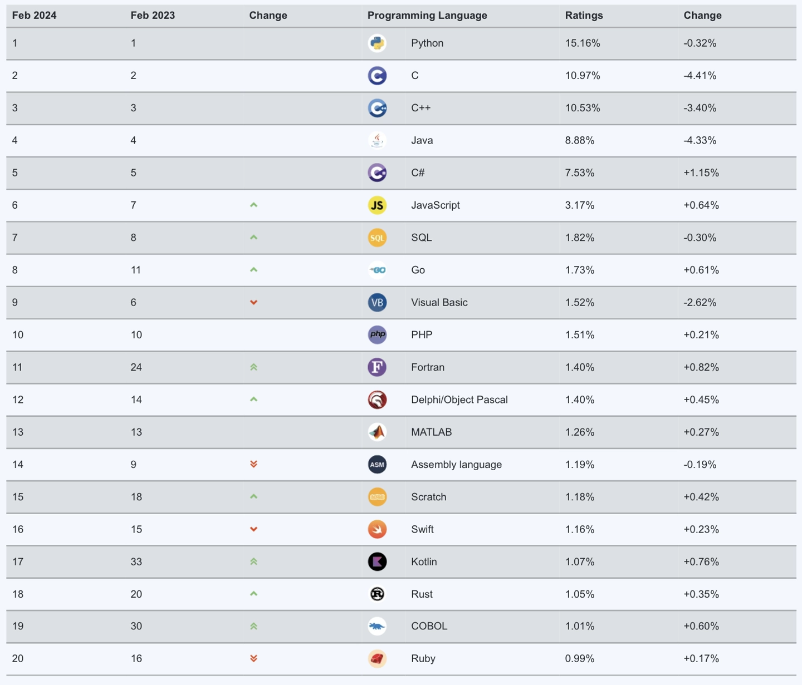

# 01｜源起：动态编程语言如何引爆虚拟机的革命？
你好，我是海纳。欢迎你加入学习，迈出从零开始实现Python虚拟机的第一步。

在正式开始之前，我想先带你回顾一下编程语言的发展历史，在这个过程中你会看到编程语言虚拟机是如何产生的，它为了填补静态语言的缺陷演化出了哪些能力，还有不同编程语言的实现策略。学完了这节课的内容你就能回答“虚拟机从哪儿来”这个问题了。

## 编程语言的发展

计算机技术发展到今天，诞生了很多编程语言，这些语言的工作原理各不相同。根据它们与硬件平台的远近关系，我们可以把编程语言粗略地划分为 **以汇编为代表的底层语言和以 C++、Java 为代表的高级语言。**

汇编语言的特点是直接与硬件平台提供的寄存器、内存、IO 端口打交道，能力十分强大，所以早期操作系统镜像的加载和初始化经常会使用汇编语言来实现；语言助记符（例如mov、add）几乎与CPU指令一一对应，使用汇编语言基本不需要考虑编译器的影响，这就让编程人员对代码有绝对的控制权。但是汇编语言因为太接近底层，这就使得其 **表达能力不强，开发效率低**。

为了提高应用程序的开发效率，人们发明了高级语言。C语言是非常重要的一个语言，它保留了内嵌汇编，并且可以通过链接器将汇编语言开发的模块与C语言开发的模块链接在一起；同时C语言的指针也保留了汇编语言中内存操作的逻辑。它是一门承上启下的语言，大多数操作系统都是用C语言开发的，说C语言是计算机行业的基石也不过分。


后来，随着应用软件的规模越来越大，面向对象的编程思想开始流行。面向对象的语言也应运而生，典型代表就是 C++。面向对象的编程方式可以让开发者们以模块化、对象化的思想进行设计和开发，大大提高了编程语言的抽象能力。到目前为止，面向对象的编程方式仍然是当今世界的主流。

C++语言虽然开发速度很快，运行性能也好，但仍然有两个主要的痛点。

第一个是 **内存管理**，使用C++的时候，编程人员要十分小心地使用内存，因为稍不注意就容易引起内存泄漏，比如下面我给出的这个示例。

```c++
void foo() {
  Data * data = new Data();
  //…
  //many other codes
  if (some_condition())
  return;
  //...
  //many other codes
  delete data;
  return;
}

```

在some\_condition条件满足的情况下，foo方法就直接返回了，漏掉了delete语句。这一块内存没有被释放，但却没有任何变量引用它了。也就是说，应用程序再也无法正常访问这块内存了。这就是 **内存泄漏**。

如果函数体比较小，逻辑相对简单，一般不会犯这种错误，但如果逻辑比较复杂，尤其是多人多版本维护同一份代码的情况下，自己添加的return逻辑将别人添加的delete跳过去就非常常见了。

第二个痛点就是 **跨平台**。当前主流的体系结构是 x86 和 Arm，操作系统包括 Windows、Linux、Android 等等，跨平台是指同一份代码可以在多种不同的体系结构和操作系统上正确执行。

C/C++这类语言是静态编译的，它们编译生成的是可执行程序，例如 Windows 系统上的.exe文件，可执行程序中代码段里的内容是与平台直接相关的，在x86系统上，就会产生x86的机器指令，在Arm系统上，就会产生Arm的机器指令。

另外，还要考虑 **编译器、操作系统以及运行时库** 的影响。

同样的 C++ 代码，不同版本的编译器和操作系统会产生不同的机器指令，同时应用程序所依赖的动态链接库也会有不兼容的情况。静态编译为应用程序的分发和部署带来了困难。

## 编程语言虚拟机

为了解决这些问题，编程语言虚拟机就应运而生了，它要解决的问题主要是屏蔽硬件差异和自动内存管理，在这个基础上，又发展出了即时编译等新的特性。

### 屏蔽硬件差异

编程语言虚拟机的一个重要能力就是屏蔽硬件差异。以 Java 为例，Java 源代码文件会被 javac 先编译生成 class 文件，多个 class 文件可以集中在一起，生成一个 jar 文件。

通常，一个模块会压缩成一个 jar 文件，而应用程序就以 jar 包的方式分发和部署。class 文件的格式是固定的，它的代码段里全部是 Java 字节码。不管在什么硬件环境下，相同的字节码得到的执行结果一定是相同的。

字节码的设计非常类似于CPU指令，它有自己定义的数值计算、位操作、比较操作、跳转操作等。所以 **人们把这种专门为某一类编程语言所开发的字节码以及其解释器合并称为编程语言虚拟机。**

我们可以借助一个例子来了解Java虚拟机的工作原理，你可以看一下我给出的Java代码。

```java
void foo() {
  int a = 2;
  int b = 3;
  int c = a + b;
}

```

它编译的Java字节码如下所示：

```java
0: iconst_2
1: istore_1
2: iconst_3
3: istore_2
4: iload_1
5: iload_2
6: iadd
7: istore_3
8: return

```

我们可以使用下图来描述这个字节码的执行过程。Java的执行过程可以通过高级数据结构的栈来实现，而不必关心CPU的具体体系结构。


对字节码文件进行加载、分析、执行的逻辑都在Java语言虚拟机里封装了。在不同的硬件平台和不同的操作系统上，Java语言虚拟机的实现各不相同，但是它提供的字节码执行器的功能是完全相同的。Java早期推广的时候，曾经以“write once, run everywhere”作为重要的特性进行宣传，指的主要就是Java语言虚拟机屏蔽硬件差异的能力。

### 自动内存管理

使用C++进行开发时，开发人员要十分注意内存的使用，避免不合理的内存分配和内存泄漏问题。如果能够自动地回收和整理不被引用的内存，就可以彻底避免内存泄漏了，这就是 **垃圾回收机制**。

编程语言自动内存管理的研究开始得比较早，在当今主流的带有垃圾回收的编程语言（例如Java、Python、Ruby、Go）被开发出来之前，垃圾回收的算法就已经非常成熟了。

大体上，垃圾回收可以分为 **引用计数** 和 **Tracing GC** 两大类，其中引用计数的代表就是CPython，也就是我们平常最常使用的社区版Python。而大多数编程语言虚拟机基本上都使用Tracing GC。Tracing GC的家族非常庞大，在这里我们不展开讨论了。在后面自动内存管理那部分，我们会继续深入地讨论这个问题。

### 编译和执行

在讲解屏蔽硬件差异的时候，我举了Java字节码的例子。但其实编程语言还可以有更多的实现，我们选择几个代表来看一下。

第一类是以Java为代表的有字节码的虚拟机，前边已经介绍过了，这里不再详细介绍了。

第二类是以 V8 为代表的 JavaScript 虚拟机。V8 是谷歌公司开发的，用于执行 JavaScript 的虚拟机，Chrome 里的 JS 都是由 V8 解释执行的。

众所周知，网页上的JS代码都是以源代码的形式由服务端发送到客户端，然后客户端来执行的。相比Java的执行过程，这一过程中缺少了编译生成字节码的步骤。

实际上V8是比较特殊的，它根本不需要生成字节码，而是直接将源代码翻译成树形结构，我们称之为 **抽象语法树**。然后，V8的执行器就通过后序遍历这棵树，在访问语法树上的不同结点时，执行与这个结点相对应的动作，最终完成代码的解释执行。这种做法是把源代码的编译和程序的执行直接绑定在一起。

第三类是以Go为代表的静态编译的类型。如果对 Go 语言的源代码进行编译的话，你会发现，即使是很小的一段代码，编译的可执行程序的体积也会很大，这是因为Go在编译的时候直接将虚拟机与用户代码链接在了一起。

这种直接静态编译的好处是，既能通过虚拟机实现对硬件平台和操作系统的屏蔽，又能提供很好的执行效率。

可见，在编译策略和执行器的选择上，编程语言的实现是有多种选择的。没有哪一种选择是十全十美的，只能根据编程语言所面临的场景以及它所要解决的问题来具体决策。

## Python的策略

Python比较灵活，一方面它规定了自己的字节码，但它又不要求程序必须以字节码文件（.pyc）来发布。它完全支持甚至鼓励应用程序以源代码的方式发行。

本质上，在Python虚拟机内部，源代码也是先编译成字节码然后再执行的，也就是说 **Python的编译器 Python 虚拟机的一部分**，它不像 Java 虚拟机，javac 用于编译，和执行是分离的。你可以回忆一下Python中的 eval 功能，其实eval 就是调用了Python内置的编译器，来编译字符串。

当然Python虚拟机也有其他的开源实现，例如，Jython是一种用Java实现的Python语言，它的原理与CPython大有不同，它放弃了Python的原生字节码，直接将py源代码文件翻译成了由Java字节码组成的class文件。而我们知道，class 文件是可以直接在Java虚拟机上执行的，这样一来，Python代码就可以自由地使用各种强大的Java类库。通过编译，Jython实现了Python与Java的无缝衔接。

## 我们的策略

我们课程的定位是 **从零开始实现 Python 语言**，所以内容上包括从源码编译到字节码文件、虚拟机加载执行、运行时库、内存管理等模块。

我们将采用 C++ 作为基础的开发语言来实现编译器，而不是C语言或者Java，主要是考虑到相比C语言，C++的表达能力更强，开发速度更快。相比Java，C++直接操作内存的能力更强，对整个程序的内存使用有更好、更精细地掌握，这是我们开发一个内存管理系统的必要条件。

我所用的平台是 x86 64 位的 ubuntu，你完全可以使用其他体系结构的其他操作系统来进行实验。因为我们的代码使用了 CMake 来进行管理，所以即使你使用 Windows 系统或者 macOS 都没有太大的问题。

C++的编译器可以使用 GCC，也可以使用 LLVM，这对我们的项目没有影响。你可以选用自己习惯的开发工具，VSCode、JetBrain 或者 VIM 都可以，这些工具对代码的实现也没什么特别的影响。

## 总结

这节课我们介绍了几种不同的编程语言的对比，并且通过示例说明了高级语言采用语言虚拟机的核心原因。语言虚拟机带来了三个明显的优势。

1. 虚拟机可以屏蔽硬件差异，实现了一次构建，多处运行的能力。
2. 虚拟机可以自动管理内存，将程序员从内存泄漏、空指针、重复释放等问题里解放出来，更多地将精力聚焦到业务逻辑上。
3. 支持语言的动态特性，例如运行时修改类定义、反射等。

最后，我们决定使用CMake和C++来构建语言虚拟机。下一节课我们就开始着手构建项目了。

注：点击链接查看 [课程代码地址](https://gitee.com/hinus/pythonvm/tree/geektime/)

## 思考题

TIOBE 是编程语言的热度排行榜，请你说一说排行榜前十名的编程语言，哪些是静态编译语言，哪些是依赖虚拟机的动态语言？欢迎你把你的答案分享到评论区，也欢迎你把这节课的内容分享给其他朋友，我们下节课再见！

