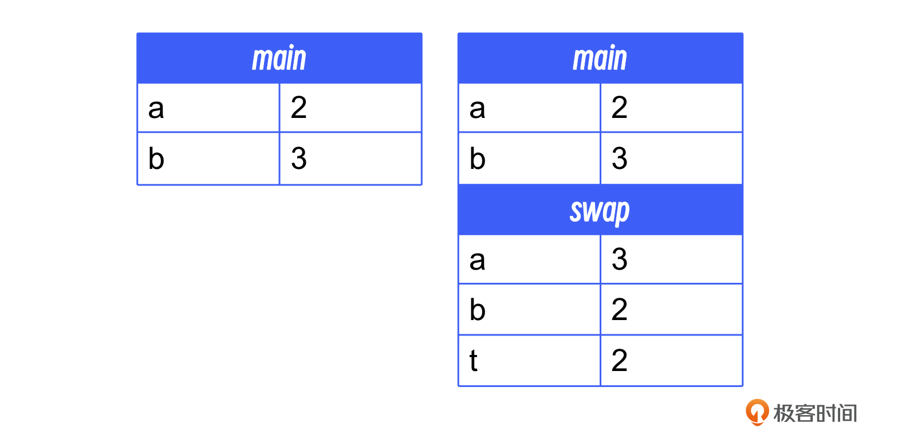
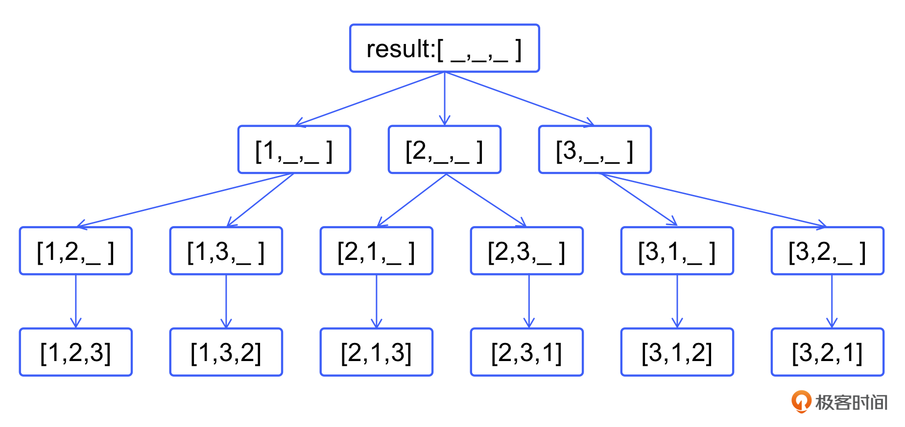
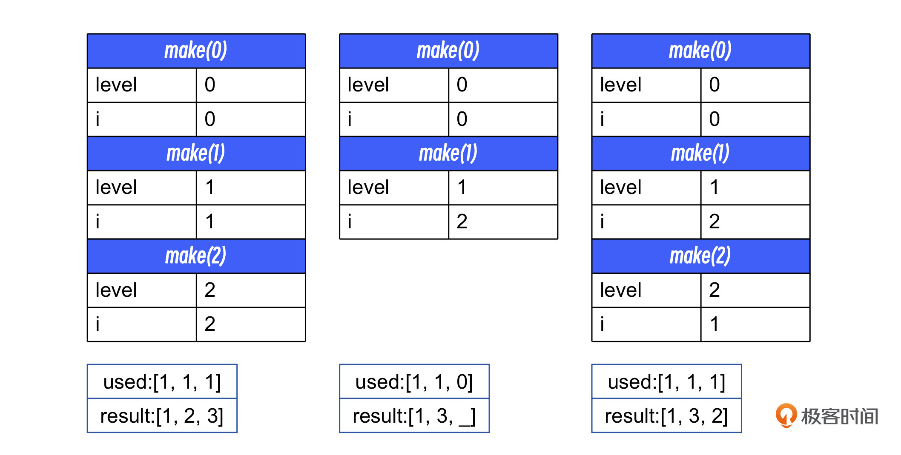

# 08｜函数和栈帧：深入区分函数的静态描述和动态记录
你好，我是海纳。

前几节课我们实现了Python虚拟机基本的功能，从这一节课开始，我们将开始实现函数的功能。函数是编程语言最重要的特性，它是对逻辑的封装，也是构成一个复杂软件的基本元素，所以它的重要性可想而知。

在实现函数功能之前，我想通过这一节课把函数和栈帧之间的关系深入地讲解清楚，这样你在实现函数的时候，头脑中才能有清晰的全景图。

我相信，你在工作中肯定遇到过栈溢出（StackOverflow）的错误，比如在写递归函数的时候，当漏掉退出条件，或者退出条件不小心写错了，就会出现栈溢出错误。我们也经常听说缓冲区溢出会带来严重的安全问题，这在日常的工作中都是要避免的。

## **函数与栈帧**

当我们在调用一个函数的时候，CPU会在栈空间里开辟一小块区域，这个函数的局部变量都在这一小块区域里存活。当函数调用结束的时候，这一小块区域里的局部变量就会被回收。这一小块区域很像一个框子，所以大家就命名它为stack frame。frame本身是框子的意思，在翻译的时候被译为帧，现在它的中文名字就是栈帧。

所以我们可以说， **栈帧本质上是一个函数的活动记录。** 当某个函数正在执行时，它的活动记录就会存在，当函数执行结束时，活动记录也会被销毁。

不过，你要注意的是，在一个函数执行的时候，它可以调用其他函数，这个时候它的栈帧还是存在的。例如，A函数调用B函数，这个时候A的栈帧不会被销毁，而是会在A栈帧的下方，再去创建B函数的栈帧。只有当B函数执行完了，B的栈帧也被销毁了，CPU才会回到A的栈帧里继续执行。

我们举个例子说明一下，就很好理解了。你可以看一下这个代码。

```c++
#include <stdio.h>

void swap(int a, int b) {
    int t = a;
    a = b;
    b = t;
}

void main() {
    int a = 2;
    int b = 3;
    swap(a, b);
    printf("a is %d, b is %d\n", a, b);
}

```

可以看到，在swap函数中，a和b的值做了一次交换，但是在main函数里，打印a和b的值，a还是2，b还是3。这是为什么呢？从栈帧的角度，这个问题就非常容易理解了。



在main函数执行的时候，main的栈帧里存在变量a和b。当main在调用swap方法的时候，会在main的帧下面新建swap的栈帧。swap的帧里也有局部变量a和b，但是明显这个a、b与main函数里的a、b没有任何关系，不管对swap的帧里的a/b变量做任何操作都不会影响main函数的栈帧。

如果我们确实想在 swap 函数里实现 main 函数中的变量交换，那就需要使用指针或者引用，这样传入 swap 函数中的两个值就是 main 函数栈帧中 a、b 两个变量的地址。

接下来，我们再通过一个递归的例子来加深对栈的理解。由于递归执行的过程会出现函数自己调用自己的情况，也就是说，一个函数会对应多个同时活跃的记录（即栈帧）。所以理解了递归函数的执行过程，我们就能更加深刻地理解栈帧与函数的关系。

## 递归实现回溯法

在算法设计中，回溯法是一种被广泛应用的算法。它可以用于搜索剪枝操作，可以解决的典型问题，包括打印全排列、八皇后问题、搜索迷宫等等。这节课我们就通过打印全排列来讲解如何使用函数栈来实现回溯法。

对于一个数列，将它的所有可能的排列全部列出来，就叫作这个数列的全排列。例如，对于数列 \[1, 2, 3\]，它的全排列是：

```plain
1, 2, 3
1, 3, 2
2, 1, 3
2, 3, 1
3, 1, 2
3, 2, 1

```

实现全排列的代码：

```c++
#include <stdio.h>

// 定义数列长度
const int N = 3;
// 指标某一个值是否被使用
int used[N] = {0, };
// 用于存储一个全排列的结果
int result[N] = {0, };

void print() {
	for (int i = 0; i < N; i++) {
		printf("%d ", result[i]);
	}
	printf("\n");
}

// 使用回溯法构造全排列。level代表位置。
// make 函数的作用是搜索 level 所对应位置的数字。
void make(int level) {
	if (level == N) {
		print();
		return;
	}
	for (int i = 0; i < N; i++) {
		if (!used[i]) {
			used[i] = 1;
			result[level] = i + 1;
			make(level + 1);
			used[i] = 0;
		}
	}
}

int main() {
	make(0);
	return 0;
}

```

接下来，我们以一棵树的形式从整体上介绍回溯法的执行过程。



如图所示，以最顶层为第 0 层，最底层为第 3 层。每一层的作用就是确定 result 数组对应位置的数。例如，第 1 层可以确定 result 数组的第一位（下标为 0），第 2 层可以确定第二位（下标为1）。

先准备一个备选集合，包含了所有要排列的数字。当一个数字被挑选出来放入结果数组时，就把它从备选集合中去掉。可以使用 used 数组来表达备选集合，当一个数字所对应的位置为 1 时，就表示这个数字已经从备选集合中剔除了。当其对应的位置为 0 时，就表示该数字尚未使用。

在程序开始执行时，used 数组都是 0，代表所有的数都没有被使用，备选集合中包括了 {1, 2, 3} 三个数字。

然后，程序访问第 1 层，从备选集合中选择数字 1 放入结果数组 result 中，然后将其所对应的 used 数组的值改为 1。

接下来，程序访问第 2 层，从备选集合中选择数字 2 放入结果数组 result 中，然后将其所对应的 used 数组的值改为 1。

最后，程序访问第 3 层，从备选集合中选择数字 3 放入结果数组 result 中，然后将其所对应的 used 数组的值改为 1。此时，result 数组就是一个合法的排列了，程序执行 print 方法将其打印出来。

接着，就是最重要的回溯步骤了，程序从第三层返回第二层，将数字 3 的 used 状态从 1 改回0， **这也意味着 3 被归还回了备选集合**。接着程序再从第二层返回第一层，并将数字 2 的 used 状态从 1 改回0，也就是 2 被归还回了备选集合。

然后，从备选集合中选择数字 3 放入结果数组 result 中，这样程序就从第一层进入了右子树分支，最终会生成\[1, 3, 2\] 这个排列。

后面的步骤我就不再重复了，你可以自己尝试用纸笔画出完整的过程。

那么，在真实的 CPU 上，这些步骤是如何完成的呢？



如上图所示，在 main 函数的执行过程中，调用了 make 函数，参数 level 的值为 0。在 make 函数内部有一个循环，循环中再次调用了 make 函数， 传给它的参数是 level + 1，也就是 1。

注意，make(0) 中的 i 变量和 make(1) 中的 i 变量是不同的两个值，它们各自存活于自己的活动空间，也就是栈帧中。

在上图中，当 make(2) 中的 i 值为 3 时，整个循环也就执行完了，所以 used\[2\] 就会被改为0（第 29 行）。然后程序就返回到 make(1) 中继续执行，从make函数返回之后的第一件事就是把 used\[1\] 改为0（同样是第 29 行）。接下来在make(1)执行下一次循环，此时 i 的值变成 2。这样就得到了 result 的前两位是{1, 3}。

图中清楚地描述了函数执行时，内存空间的创建和销毁情况，从图中展示的过程可以看出，函数的活动空间遵循了 **先创建后销毁，后创建先销毁** 的原则，或者简称为后进先出（Last In First Out，LIFO），而这正是栈这种数据结构的特点，所以函数执行时所使用的活动记录就叫作函数栈。而其中的活跃记录就是函数栈帧。

## 更多回溯法的例子

回溯法能解决很多问题，这里我再举一个打印幻方的例子。

幻方由一组排放在正方形中的整数组成，它的每行、每列以及每一条主对角线的和都相等。通常幻方由从 1 到 N 的平方个连续整数组成，其中 N 为正方形的行或列的数目。所以 N 阶幻方有 N 行 N 列，并且所填充的数字为 1 到 N 的平方。我国传统文化中的洛书就是一种三阶幻方。

这里我提供了一个打印三阶幻方的例子，你可以用前面的方法自己分析整个程序的设计思路和执行过程，从而加深对回溯法和函数栈帧的理解。

```c++
#include <iostream>
using namespace std;

const int N = 9;
int used[N] = {0, };
int result[N] = {0, };

void print() {
	for (int i = 0; i < N; i++) {
		printf("%d ", result[i]);
	}
	printf("\n");
}

void make(int level) {
    // 检查第一行的和为15
	if (level == 3 && result[0] + result[1] + result[2] != 15)
		return;
    // 检查第二行的和为15
	if (level == 6 && result[3] + result[4] + result[5] != 15)
		return;
    // 检查第一列的和为15
	if (level == 7 && result[0] + result[3] + result[6] != 15)
		return;
    // 检查对角线的和
	if (level == 7 && result[2] + result[4] + result[6] != 15)
		return;
    // 检查第二列的和
	if (level == 8 && result[1] + result[4] + result[7] != 15)
		return;

    // 以下分别检查第三行，第三列，对角线
	if (level == 9 && result[2] + result[5] + result[8] != 15)
		return;
	if (level == 9 && result[6] + result[7] + result[8] != 15)
		return;
	if (level == 9 && result[0] + result[4] + result[8] != 15)
		return;
	if (level == N) {
		print();
		return;
	}
	for (int i = 0; i < N; i++) {
		if (!used[i]) {
			used[i] = 1;
			result[level] = i + 1;
			make(level + 1);
			used[i] = 0;
		}
	}
}

int main() {
	make(0);
	return 0;
}

```

除了三阶幻方的例子，你还可以思考一下，下面这几个问题使用递归函数如何求解。

1. 八皇后问题，在8×8格的国际象棋上摆放八个皇后，使其不能互相攻击，即任意两个皇后都不能处于同一行、同一列或同一斜线上，问一共有多少种摆法。
2. 汉诺塔问题，​给定三根柱子，记为 A、B、C，其中 A 柱子上有 n 个盘子，从上到下编号为 1 到 n，且上面的盘子一定比下面的盘子小。问：将 A 柱上的盘子经由 B 柱移动到 C 柱最少需要多少次？要求一次只能移动一个盘子，并且大的盘子不能压在小盘子上。

这两道题的栈是如何变化的，也欢迎你在评论区讨论。

## 总结

这节课我们一起学习了栈帧的作用，并通过生成全排列的例子，分析了栈帧创建和销毁的过程，以此来揭示函数和栈帧的关系。栈帧就是函数的活动记录，当函数被调用时，栈帧创建；当函数调用结束后，栈帧消失。

在程序的执行过程中，尤其是递归程序的执行过程中，你可以清楚地观察到栈帧的创建、销毁，满足后入先出的规律。这也是人们把管理函数的活跃记录的区域称为栈的原因。

只有深刻地理解函数与栈帧之间的关系，才能正确地在虚拟机中实现代表函数的FunctionObject和代表栈帧的FrameObject。下一节课，我们就将真正地在虚拟机中实现函数栈帧。

## 思考题

如果多个线程执行了同一份函数的代码，内存是如何组织的呢？请你使用纸笔画出示意图，并思考一下函数与栈帧是什么关系？一对多、一对一，还是多对一？欢迎你把思考后的结果分享到评论区，也欢迎你把这节课的内容分享给其他朋友，我们下节课再见！