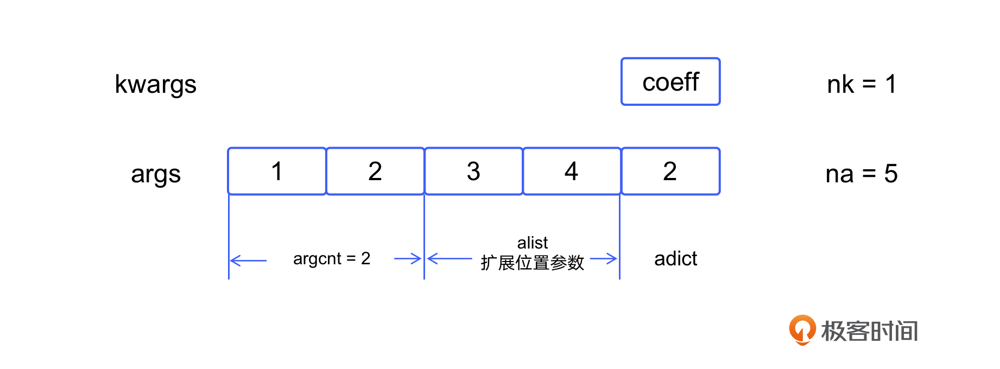
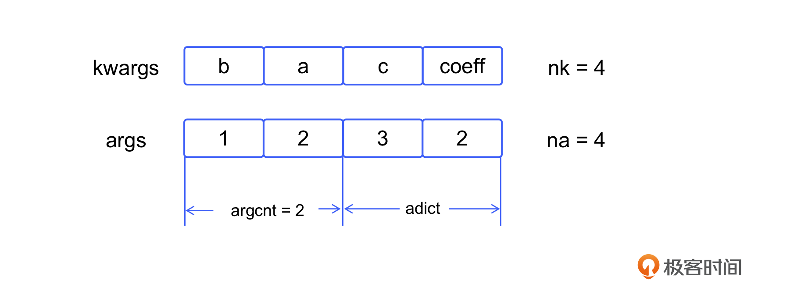

# 16｜字典（下）：位置参数和闭包依赖字典实现
你好，我是海纳。

前边三节课，我们实现了列表和字典的功能。在讲解列表和字典的实现时，我们反复强调，它们是 Python 语言中的核心数据结构。这是因为 Python 语言有很多高级特性都依赖于这两个结构，它们几乎无处不在。

在讲解方法和函数的时候，有一些高级功能没能实现，因为这些特性都依赖于列表和字典。在实现了列表和字典以后，这节课我们就来完善函数中与列表、字典相关的特性。

从这个过程中你可以体会到，开发一个系统，往往是各个功能模块相互依赖，这就需要我们进行 **螺旋式地开发**。例如，我们先提供了最简陋的整数和字符串类型，字符串的内建方法则要等到函数和方法完成以后再来完善，而有一些方法的参数或者返回值又是列表，所以只能等列表功能完成以后才能把这些功能全部实现。

## 灵活多变的函数参数

Python 的函数参数十分灵活多变，很难再采取小步快走的方式来进行实现和讲解，很多功能是相互纠缠在一起的，所以我们先通过几个测试用例，了解了 Python 参数传递的全部细节以后，再来动手做这部分的设计。

### 键参数

第一个要研究的是键参数，我们看下面的测试用例：

```python
def foo(a, b):
    return a / b

print foo(b = 2, a = 6)

```

这个例子的运行结果是 3。注意，第 4 行参数传递的顺序与第一行参数定义的顺序并不相同。在传参的时候，我们把形参的名字也一起带上了，这就指明了 a 是 6，b 是 2。

我们观察一下这种写法所对应的字节码。

```plain
  4           8 LOAD_NAME                1 (print)
             10 LOAD_NAME                0 (foo)
             12 LOAD_CONST               2 (2)
             14 LOAD_CONST               3 (6)
             16 LOAD_CONST               4 (('b', 'a'))
             18 CALL_FUNCTION_KW         2
             20 CALL_FUNCTION            1
             22 POP_TOP
             24 LOAD_CONST               5 (None)
             26 RETURN_VALUE

```

你会注意到一条新的指令 **CALL\_FUNCTION\_KW**。当使用键参数进行函数调用时，编译器就会生成 CALL\_FUNCTION\_KW 指令，而不再是普通的 CALL\_FUNCTION（第 6 行）。作为对比，你可以看到调用 print 函数时，使用的是 CALL\_FUNCTION 指令（第 7 行）。

在执行 CALL\_FUNCTION\_KW 之前，虚拟机要先执行 3 个 LOAD\_CONST，往栈上加载数据（第 3 至 5 行），分别是实际参数 2、实际参数 6和形式参数 `('b', 'a')`。

CALL\_FUNCTION\_KW 的指令参数是 2，代表这次调用有两个键参数。

搞清楚键参数以后，我们再来看扩展位置参数。

### 扩展位置参数

很多现代的编程语言，都可以定义带有不定项参数的函数，例如在 C 语言中，我们最常用的 printf 就是一个可以接受不定项参数的函数，也就是说它的参数个数可以是任意的。

Python 中使用扩展参数的方式来支持不定项参数，例如：

```python
def sum(*args):
    t = 0
    for i in args:
        t += i

    return t

print(sum(1, 2, 3, 4))

```

sum 函数的定义里，形式参数只有一个 args，使用星号修饰，这代表了 args 是一个列表，所有调用时传给 sum 函数的实际参数都会被放到列表 args 中。

在 sum 函数里通过遍历这个列表，就可以访问到列表中所有元素，然后对这些元素进行求和。args 参数就被称为 sum 函数的扩展参数。

我们还是通过 show\_file 工具来探究这一段代码背后的秘密。

```plain
      code
         argcount 0
         nlocals 3
         stacksize 3
         flags 0047
         ......

```

首先要注意 flags 的值，在这个例子中是 0x47。我们对照 CPython 源码中的定义，看看 flags 可以取哪些值，分别代表什么意思。

```c++
// Include/cpython/code.h
#define CO_OPTIMIZED    0x0001
#define CO_NEWLOCALS    0x0002
#define CO_VARARGS      0x0004
#define CO_VARKEYWORDS  0x0008
#define CO_NESTED       0x0010
#define CO_GENERATOR    0x0020
/* The CO_NOFREE flag is set if there are no free or cell variables.
   This information is redundant, but it allows a single flag test
   to determine whether there is any extra work to be done when the
   call frame it setup.
*/
#define CO_NOFREE       0x0040

```

从这些定义里可以看出，0x47 是 CO\_OPTIMIZED、CO\_NEWLOCALS、CO\_VARARGS 和 CO\_NOFREE 的组合。

其中，CO\_OPTIMIZED 和 CO\_NEWLOCALS 对我们的影响不大，这里先不关注了。CO\_NOFREE 代表函数没有引用自由变量，稍后我会解释什么是自由变量。

在当前场景中，最重要的是 CO\_VARARGS，代表了 sum 函数带有扩展参数。其次要注意的点是，argcount 的值为 0，说明参数 args 并没有被当成参数来对待，而被认为是一个 **局部变量**，和 t、i 一样，所以 nlocals 的值是 3。除此之外，sum 方法和其他的普通方法并没有什么区别。

### 扩展键参数

通过扩展位置参数，我们可以将不定项的位置参数传给函数，同样，Python 也可以使用扩展键参数来将不定项的键参数传递给函数，你参考下面的例子。

```python
def foo(**kwargs):
    for k, v in kwargs.items():
        print(k)
        print(v)

foo(a = 1, b = 2)

```

使用两个星号修饰 kwargs，这指明了它是一个字典对象，(a:1) 和 (b:2) 这两组键值对都被存储到这个对象里。既然是字典对象，那么可以接受的参数个数就是没有限制的。你可以把这个特性与扩展位置参数相互对照着看，加深理解。

通过 show\_file 工具，我们可以看到 foo 函数的相关属性。

```plain
      code
         argcount 0
         nlocals 3
         stacksize 3
         flags 004b

```

foo 函数的 flags 值是 0x4b，这表示 CO\_VARKEYWORDS 被置位，代表了 foo 函数带有扩展键参数。同样，argcount 值为 0，所以 kwargs 被视为局部变量，而不是函数参数。

这里我强调一下，在 Python 的语法中规定了默认值参数，扩展位置参数和扩展键参数都必须按照一定的顺序排列，例如以下函数定义都是不合法的：

```python
def foo(**kw, *arg):
def foo(a = 2, b):
def foo(*args, a):

```

而这样的定义是合法的：

```python
def foo(a, b = 2, *args, **kw):

```

在语法中做了这样的规定以后，虚拟机的实现就变得简单了，我们不用担心扩展位置参数可以出现在任意位置，只要按顺序先处理位置参数、默认参数、键参数，再处理扩展位置参数，最后处理扩展键参数就好了。

## 在 frame 中处理参数

在最早实现函数基本功能的时候，我们就说过，调用函数的时候，最重要的步骤是把传进某个函数的参数放到这个函数所对应的 frame 中的正确位置，以便于函数的字节码在执行的时候访问到这些参数。

经过之前三节课的探索，我们已经知道了，CodeObject 的 argcount 代表了函数所能接受的参数，而扩展位置参数和扩展键参数都不计入 argcount 中。

在之前的实现中，参数都被安放在 \_fast\_locals 里。研究字节码就可以知道扩展位置参数和扩展键参数也是放在 \_fast\_locals 里。它们位于正常普通的位置参数后面。

经过这些简单的分析，我们可以修改 FrameObject 的构造函数，来处理扩展参数了。先从 CALL\_FUNCTION\_KW 的实现开始。

```c++
void Interpreter::eval_frame() {
    ...
    while (_frame->has_more_codes()) {
	    unsigned char op_code = _frame->get_op_code();
        ...
        switch (op_code) {
		...
            case ByteCode::CALL_FUNCTION_KW:
                assert(op_arg > 0);
                arg_cnt = op_arg;
                kwargs = POP()->as<HiList>();
                args = new ArrayList<HiObject*>(arg_cnt);
                while (arg_cnt--) {
                    args->set(arg_cnt, POP());
                }

                fo = static_cast<FunctionObject*>(POP());
                build_frame(fo, args, kwargs);

                if (args != NULL) {
                    delete args;
                    args = NULL;
                }

                break;
        ...
        }
    }
}

```

kwargs 是一个列表，其中包含了键参数的名字。args 则是ArrayList，其中包含了所有的参数真实值（第 12 至 15 行，这里需要你结合字节码来理解）。

fo 代表要调用的函数，通过 build\_frame 来调用它（第 17 和 18 行），虚拟机将实参原封不动地传到 build\_frame 中了。接下来，我们看 build\_frame 怎么处理这些实参。

```c++
void Interpreter::build_frame(HiObject* callable, ObjList args, HiList* kwargs) {
    if (callable->klass() == NativeFunctionKlass::get_instance()) {
        PUSH(((FunctionObject*)callable)->call(args));
    }
    else if (MethodObject::is_method(callable)) {
        MethodObject* method = (MethodObject*) callable;
        // return value is ignored here, because they are handled
        // by other pathes.
        if (!args) {
            args = new ArrayList<HiObject*>(1);
        }
        args->insert(0, method->owner());
        build_frame(method->func(), args, kwargs);
    }
    else if (callable->klass() == FunctionKlass::get_instance()) {
        FrameObject* frame = new FrameObject((FunctionObject*) callable, args, kwargs);
        frame->set_sender(_frame);
        _frame = frame;
    }
}

```

build\_frame 中最重要的修改是创建 FrameObject 的时候，把键参数列表也带上了（第 16 行）。所以 FrameObject 构造函数的逻辑变得复杂了很多。我先列出最终的代码，再详细解释。

```c++
FrameObject::FrameObject (FunctionObject* func, ObjList args, HiList* kwargs) {
    _codes   = func->_func_code;
    _consts  = _codes->_consts;
    _names   = _codes->_names;

    _locals  = new HiDict();
    _globals = func->_globals;
    _fast_locals = new ArrayList<HiObject*>();

    const int argcnt  = _codes->_argcount;
    const int na = args == nullptr ? 0 : args->length();
    const int nk = kwargs == nullptr ? 0 : kwargs->size();

    if (na < argcnt) {
        _codes->_co_name->print();
        printf(" missing %d required positional argument\n", argcnt - na);
        assert(false);
    }

    if (func->_defaults) {
        int dft_cnt = func->_defaults->length();
        int argnum  = _codes->_argcount;

        while (dft_cnt--) {
            _fast_locals->set(--argnum, func->_defaults->get(dft_cnt));
        }
    }

    HiList* alist = nullptr;
    if (_codes->_flag & FunctionObject::CO_VARARGS) {
        alist = new HiList();
    }

    HiDict* adict = nullptr;
    if (_codes->_flag & FunctionObject::CO_VARKEYWORDS) {
        adict = new HiDict();
    }

    for (int i = 0; i < argcnt; i++) {
        _fast_locals->set(i, args->get(i));
    }

    if (argcnt < na - nk) {
        if (_codes->_flag & FunctionObject::CO_VARARGS) {
            for (int i = argcnt; i < na - nk; i++) {
                alist->append(args->get(i));
            }
        }
        else {
            report_error("got an unexpected keyword argument",
                _codes->_co_name, args->get(argcnt));
        }
    }

    if (nk > 0) {
        for (int i = 0; i < nk; i++) {
            HiObject* key = kwargs->get(i);
            HiObject* value = args->get(na - nk + i);

            int index = _codes->_var_names->index(key);

            if (index < 0 || index >= argcnt) {
                if (_codes->_flag & FunctionObject::CO_VARKEYWORDS) {
                    adict->put(key, value);
                }
                else {
                    report_error("got an unexpected keyword argument",
                        _codes->_co_name, key);
                }
                continue;
            }

            if (index < na - nk) {
                report_error("got multiple values for argument", _codes->_co_name, key);
            }

            _fast_locals->set(index, value);
        }
    }

    if (_codes->_flag & FunctionObject::CO_VARARGS) {
        _fast_locals->add(alist);
    }

    if (_codes->_flag & FunctionObject::CO_VARKEYWORDS) {
        _fast_locals->add(adict);
    }

    _stack   = new HiList();

    _pc      = 0;
    _sender  = NULL;
}

```

这段代码非常长，其中融合了好多种机制的处理，但如果从功能上进行划分，你就会发现其逻辑并不难。

首先，要理解这个函数中出现的所有变量代表的含义。

1. args 代表实际传入的参数，na 是它的长度，代表实际传入的参数个数。
2. kwargs 代表键参数的名称，nk 是它的长度，代表键参数的个数。
3. argcnt 是 CodeObject 的参数个数，这个值指示的是形式参数的个数，所以是固定值。
4. alist 是一个列表，用于存储扩展位置参数，它只在函数的 CO\_VARARGS 标志位被打开的时候起作用（第 29 至 32 行）。
5. adict 是一个字典，用于存储扩展键参数，它只在函数的 CO\_VARKEYWORDS 标志位被打开的时候起作用（第 34 至 37 行）。

我们以一个具体的例子来说明这些变量的具体取值，比如以下代码：

```python
def calc(a, b, *args, **kwargs):
    coeff = kwargs.get("coeff")

    if coeff is None:
        return 0

    t = a + b
    for i in args:
        t += i

    return coeff * t

print(calc(1, 2, 3, 4, coeff = 2))

```

在这个例子中，最后一行的作用是调用 calc 函数并且打印结果。我们来看一下这里的各个参数的取值情况。

1. args 是实际传入的参数，所以它的值为 `(1, 2, 3, 4, 2)`，共 5 个元素，na 就是 5。
2. kwargs 是实际的键参数名称列表，它的值为 `("coeff")`，共 1 个元素，nk 就是为 1。
3. argcnt 是 calc 函数的形式参数数量，它的值永远是 2，不受调用时传入的实际参数的个数影响。
4. 在 calc 函数内部，参数 a 的值是 1，b 的值是 2。3、4 这两个参数就是扩展位置参数，它们会被存储在 alist 中。
5. coeff 参数和其取值 2 会被作为一个键值对存储在 adict 中。

我把各个参数的具体值用图表示出来，这样可以让你更直观地理解它们之间的关系。



再举一个例子来说明键参数是如何被处理的。

```python
print(calc(b = 1, a = 2, c = 3, coeff = 2))

```

这里的各个参数取值情况如下：

1. args 是实际传入的参数，所以其值为 `(1, 2, 3, 2)`，共 4 个元素，na 就是 4。
2. kwargs 是实际的键参数名称列表，其值为 `("b", "a", "c", "coeff")`，共 4 个元素，nk 就是4。
3. 在 calc 函数内部，参数 a 的值为 2，b 的值为 1。c 和 coeff，会被存储在 adict 中。
4. 这个例子中没有任何扩展位置参数，所以 alist 为空指针。

同样，这个例子也可以使用图来表示。



通过这两个例子理解了各个变量的作用以后，我们再回来研究 FrameObject 构造函数的代码。

构造方法先处理参数默认值（第 20 至 27 行），这是之前就已经实现好的，这里就不再解释了。构造方法接着处理扩展位置参数（第 43 至 53 行），na 代表实际的参数数量，nk 代表键参数数量，所以 na - nk 就是所有的位置参数数量。argcnt 代表函数能接受的位置参数数量。如果 argcnt 小于 na - nk，就意味着实参比形参多了，这些多出来的参数就需要被放到 alist 中（第 44 到 48 行）。

接下来，构造函数会处理扩展键参数（第 55 至 79 行）。我们先判断键参数的名称在CodeObject 对象的 var\_names 中的位置，使用 index 变量表示（第 57 至 60 行）。

如果 index 小于 0，意味着 var\_names 中没有这个变量名，例如第二个例子中的c = 3。如果 index 大于 argcnt 就意味着这个变量名是一个局部变量，而不是形式参数，例如两个例子中都使用到的coeff = 2。这两种情况都应该把键参数放到 adict 中（第 62 至 71 行）。

如果 index 值落入位置参数的范围内（第 73 至 75 行），也需要报错，因为这种情况意味着位置参数有两个取值。例如下面这个例子中，变量 a 就被赋值两次，这种情况就会报错。

```python
print(sum(1, 2, a = 3))

```

经过这样的修改，我们的虚拟机就可以处理 Python 中各种复杂的键参数和扩展参数了。重新编译后，我们上面所举的例子都可以得到符合预期的执行结果。

## 总结

过去三节课我们实现了虚拟机中最重要的两个数据结构，列表和字典。在完成了这两种数据结构以后，我们在这一节课将函数处理参数的功能补齐了。

调用一个函数时，最普通的传参方式是只提供参数值，这种方式就是 **位置参数**。也可以通过参数名称来指定参数值，这种传参方式被称为 **键参数**。对于不定项参数，Python 使用一个列表来存储它们，列表使用一个星号修饰，这种方式就是 **扩展位置参数**。如果键参数的名称不在函数定义的形参之内，它们就会被存储在一个字典中，字典使用两个星号修饰，这种方式就是 **扩展键参数**。

我们通过两个例子来说明各种传参混合在一起使用时应该如何处理。在这个基础上，重新实现了 FrameObject 的构造函数以处理参数。代码篇幅虽然长，但结合图示，并不难理解。

实现了列表和字典这两个基础结构以后，我们就完善了函数功能，下节课我们会继续完善对象功能。

## 思考题

这节课的例子不能完全覆盖 FrameObject 中的所有分支，请你再多设计几个测试用例来验证各个分支语句的实现是否正确。将我们的虚拟机与 Python 3.8 进行对比，看看结果是否符合预期。欢迎你把你实验的结果分享到评论区，也欢迎你把这节课的内容分享给其他朋友，我们下节课再见！