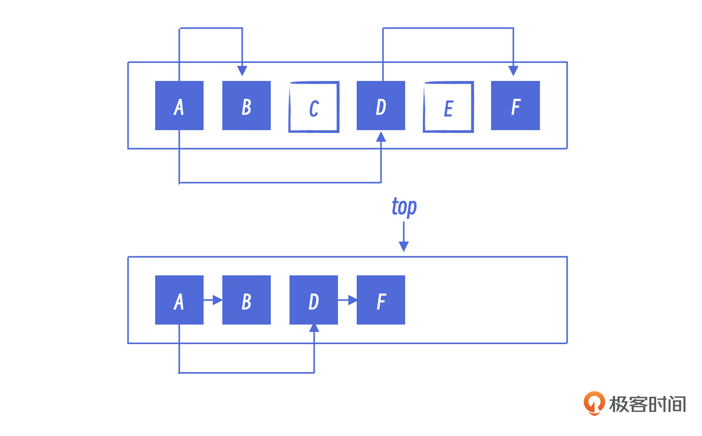
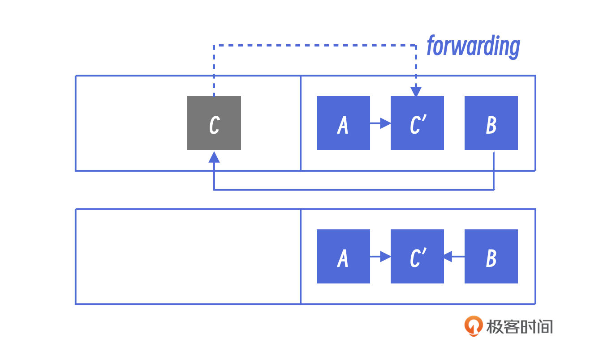
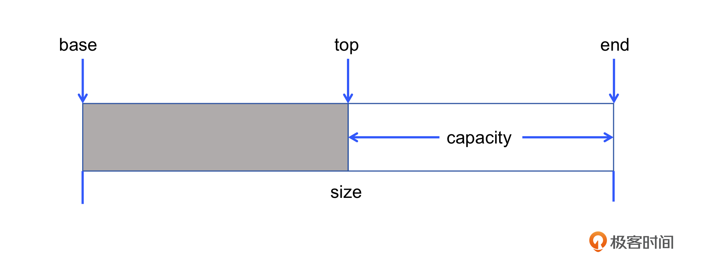

# 23｜复制算法：最简单高效的垃圾回收算法
你好，我是海纳。

上一节课，我们讲到GC算法大致可以分为两大类：引用计数法和基于可达性分析的算法。在基于可达性分析的GC算法中，最基础、最重要的一类算法是基于Copy的GC算法（后面简称Copy算法）。

Copy 算法是最简单实用的一种模型，也是我们学习GC算法的基础。而且它被广泛地使用在各类语言虚拟机中，例如 JVM 中的 Scavenge 算法就是以它为基础的改良版本。

这一节课，我们就从Copy算法的基本原理开始讲起，再逐步拓展到GC算法的具体实现。

## 复制回收

基于Copy的GC算法最早是在1963年，由Marvin Minsky提出来的。算法的第一步是把空间分成两部分，一个叫分配空间（Allocation Space），一个是幸存者空间（Survivor Space）。分配对象时，新的对象都创建在分配空间里。

在垃圾回收阶段，把分配空间里的活动对象复制到幸存者空间，把原来的分配空间全部清空。然后把这两个空间交换，就是说分配空间变成下一轮的幸存者，现在的幸存者空间变成分配空间。

在有些文献和代码实现中，分配空间也会被称为 from 空间，幸存者空间也被称为 to 空间。在课程中，为了强调复制的方向性，讨论垃圾回收的时候，主要还是使用 from 空间和 to 空间来指代分配空间和幸存者空间。但当讨论内存分配的时候，也会混合着使用 eden 和 survivor 这一组名词。

接下来，我们就来介绍最基本的算法原理。

## 算法描述

最基础的Copy算法，就是把程序运行的堆分成大小相同的两半，一半是From空间，一半是To空间。当创建新对象的时候，都是在From空间里进行内存的分配。等From空间满了以后，垃圾回收器就会把活跃对象复制到To空间，把原来的From空间全部清空。然后再把这两个空间交换，也就是说To空间变成下一轮的From空间，现在的From空间变成To空间。你可以通过我给出的图示看一下具体过程。



可以看到，图里的from空间已经满了，如果想再创建一个新的对象是无法满足的。这个时候就会执行GC算法将活跃对象都拷贝到新的空间中去。

假设A对象作为根对象是存活的，而A引用了B和D，所以B和D是活跃的。D又引用了F，所以F也是活跃的。这时候，要是已经没有任何地方引用C对象和E对象，那么C和E就是垃圾了。当GC算法开始执行以后，就会把A、B、D、F都拷贝到To空间中去。拷贝完成后，From空间就清空了，并且From空间与To空间相互交换。

这个时候，top指针指向了新的From空间，并且是可用内存的开始处。如果需要再分配新的对象的话，就会从top指针开始进行内存分配。

我们知道，GC算法包括对象分配和回收两个方面。下面，我们分别从这两个方面对copy算法进行考察。先来看copy算法的内存分配是怎么做的。

### 分配对象

从刚刚的介绍里我们知道，在From空间里，所有的对象都是从头向后紧密排列的，也就是说对象与对象之间是没有空隙的。而所有的可用内存全部在From空间的尾部，也就是图里top指针所指向的位置之后。

那么，当我们需要在堆里创建一个新的对象时，就非常容易了，只需要将top指针向后移动就可以了。top指针始终指向最后分配的对象的末尾。每当分配一个新对象时，只需要移动一次指针即可，这种分配效率非常高。

如果按这种方式进行新对象的创建，那么对象与对象之间可以保证没有任何空隙，因为后一个对象是顶着前一个对象分配的，所以这种方式也叫做 **碰撞指针（Bump-pointer）**。

了解了copy算法的内存分配过程后，我们再来看回收的过程。

### 复制对象回收空间

复制GC算法，最核心的就是如何实现复制。根据刚刚的描述，我们自己就可以写出一个基于深度优先搜索的算法，它的伪代码如下所示：

```c++
void copy_gc() {
    for (obj in roots) {
        *obj = copy(obj);
    }
}
obj * copy(obj) {
    new_obj = to_space.allocate(obj.size);
    copy_data(new_obj, obj, size);
    for (child in obj) {
        *child = copy(child);
    }
    return new_obj;
}

```

可以看到，算法是从roots的遍历开始的，然后对每一个roots中的对象都执行copy方法（第2～4行）。copy方法会在To空间中申请一块新的内存（第7行），然后将对象拷贝到To空间（第8行），再对这个对象所引用到的对象进行递归的拷贝（第9~11行），最后返回新空间的地址（第12行）。

如果你比较了解深度优先搜索算法，就会发现，刚刚的代码中缺少了对重复访问对象的判断。考虑到有两个对象A和B，它们都引用了对象C，而且它们都是活跃对象，现在我们对这个图进行深度优先遍历。


在遍历过程中，A先拷到 to space，然后C又拷过去，这时候空间里的引用是这种状态：


A和C都拷到新的空间里了，原来的引用关系还是正确的。但我们的算法在拷贝B对象的时候，先完成B的复制，然后你就会发现，此时我们还会把C再复制一次。这样，在To空间里就会有两个C对象了，这显然是错的。我们必须要想办法解决这个问题。

在一般的深度优先搜索算法中，我们只需要为每个结点增加一个标志位visited，以表示这个结点是否被访问过。但这只能解决重复访问的问题，还有一件事情我们没有做到：新空间中B对象对C对象的引用没有修改。这是因为我们在拷贝B的时候，并不知道它所引用的对象在新空间中的地址。

解决这个问题的办法是使用forwarding指针。也就是说每个对象的头部引入一个新的域（field），叫做forwarding。正常状态下，它的值是NULL，如果一个对象被拷贝到新的空间里以后，就把它的新地址设到旧空间对象的forwarding指针里。

当我们访问完B以后，对于它所引用的C，我们并不能知道C是否被拷贝，更不知道它被拷贝到哪里去了。此时，我们就可以在C上留下一个地址，告诉后来的人，这个地址已经变化了，你要找的对象已经搬到新地方了，请沿着这个新地址去寻找目标对象。这就是forwarding指针的作用。我用一张图片展示了这个过程，你可以看一下。



如果你还不太明白，我再给你举一个形象点的例子：你拿到一张画，上面写着武穆遗书在临安皇宫花园里。等你去花园里找到一个盒子，却发现里面的武穆遗书已经不在了，里面留了另一幅画，告诉你它在铁掌峰第二指节。显然，有人移动过武穆遗书，并把新的地址告诉你了，等你第二次访问，到达临安的时候，根据新的地址就能找到真正的武穆遗书了。

到这里，我们就可以彻底完成copy gc的算法了，你可以看一下完整的算法伪代码。

```
void copy_gc() {
    for (obj in roots) {
        *obj = copy(obj);
    }
}
obj * copy(obj) {
    if (!obj.visited) {
        new_obj = to_space.allocate(obj.size);
        copy_data(new_obj, obj, size);
        obj.visited = true;
        obj.forwarding = new_obj;
        for (child in obj) {
            *child = copy(child);
        }
    }
    return obj.forwarding;
}

```

这样一来，我们就借助深度优先搜索算法完成了一次图的遍历。

## 算法实现

在普通的应用程序中，有大量的对象生命周期并不长。很多对象都是创建了以后很快就变成了垃圾。比如，一个函数退出以后，它所使用的局部变量就全都变成垃圾了。在这种情况下，执行 Copy GC 时，存活的对象会比较少，算法就有很高的吞吐量。

刚刚我们介绍的 Copy 算法还有一个明显的问题：使用递归算法来实现图的深度优化遍历，很容易出现栈空间不足的情况。所以在这里，我们只能选择非递归的方法。

下面我们就分步骤来实现 Copy 算法。首先，就是要把所有对象都在堆里管理起来。

### 建堆

实现 GC 的第一步是 **创建虚拟机的堆**，以后所有对象的内存分配就都在这个堆里进行。先定义虚拟机的堆。

```c++
class Space {
friend class Heap;
private:
    char*  _base;
    char*  _top;
    char*  _end;
    size_t _size;
    size_t _capacity;
    double _rate;

    Space(size_t size);
    ~Space();

public:
    void* allocate(size_t size);
    void clear();
    bool can_alloc(size_t size);
    bool has_obj(char* obj);
    double rate()  { return _rate; }
};

class Heap {
private:
    Space* mem_1;
    Space* mem_2;

    Space* eden;
    Space* survivor;

    Space* metaspace;

    Heap(size_t size);

public:
    static size_t MAX_CAP;
    static Heap* instance;
    static Heap* get_instance();

    ~Heap();

    void* allocate(size_t size);
    void* allocate_meta(size_t size);
    void copy_live_objects();
    double rate() { return eden->rate(); }

    void gc();
};

```

Space 代表了一个独立的空间，上一节课我们已经讲过 survivor 空间和 eden 空间的关系。一个空间的基本属性包括它的起始起址 \_base、尾地址 \_end、总的容量 \_size、当前可用内存的开始地址 \_top，以及当前可用内存的总量 \_capacity。



如图所示， \_size 总是等于 \_end 减去 \_base。在堆刚创建的时候，\_capacity 等于 \_end 减去 \_top。当需要在堆空间中分配内存的时候，我们只需要把 \_top 向后增加，并实时更新 \_capacity 的值即可。所以 Space 可以这样实现：

```c++
Space::Space(size_t size) {
    _size = size;
    _base = (char*)malloc(size);
    _end  = _base + size;
    _top  = (char*)(((uintptr_t)(_base + 15)) & -16);
    _capacity = _end - _top;
}

Space::~Space() {
    if (_base) {
        free(_base);
        _base = 0;
    }

    _top = 0;
    _end = 0;
    _capacity = 0;
    _size = 0;
}

void Space::clear() {
}

void* Space::allocate(size_t size) {
    size = (size + 7) & -8;
    char* start = _top;
    _top       += size;
    _capacity  -= size;
    _rate       = _capacity * 1.0 / _size;
    //printf("after allocate %lx, _top is %p\n", size, _top);
    return start;
}

bool Space::can_alloc(size_t size) {
    return _capacity > size;
}

bool Space::has_obj(char* obj) {
    return obj >= _base && _end > obj;
}

```

构造函数中使用与操作（第 5 行），对起始地址进行了一次对齐，这样可以保证空间地址是以 16 字节对齐的。同样的代码技巧还出现在第 28 行，这行代码的意义十分重大，它保证了我们从堆里分配出来的对象地址都是 8 字节对齐的，从而保证了 **每个对象指针的低三位都是 0**。后面我们会充分利用这三位来做一些辅助的功能。

定义好了空间以后，我们再来看堆的具体实现。Heap 类代表了虚拟机堆，它包含了三个空间，分别是 survivor 空间、eden 空间和 meta 空间。

survivor 和 eden 空间，前边已经介绍过了，这里不再赘述。我们会把 Klass 放到 meta 空间里，meta 空间中的信息相对稳定，不需要频繁回收，把 Klass 放到这里是比较合适的。

```c++
Heap*  Heap::instance = nullptr;
size_t Heap::MAX_CAP = 2 * 1024 * 1024;

Heap* Heap::get_instance() {
    if (instance == nullptr)
        instance = new Heap(MAX_CAP);

    return instance;
}

Heap::Heap(size_t size) {
    mem_1 = new Space(size);
    mem_2 = new Space(size);
    metaspace = new Space(size / 16);

    mem_1->clear();
    mem_2->clear();
    metaspace->clear();

    eden = mem_1;
    survivor = mem_2;
}

Heap::~Heap() {
    if (mem_1) {
        delete mem_1;
        mem_1 = nullptr;
    }

    if (mem_2) {
        delete mem_2;
        mem_2 = nullptr;
    }

    if (metaspace) {
        delete metaspace;
        metaspace = nullptr;
    }

    eden = nullptr;
    survivor = nullptr;
}

void* Heap::allocate(size_t size) {
    if (!eden->can_alloc(size)) {
        gc();
    }

    return eden->allocate(size);
}

void* Heap::allocate_meta(size_t size) {
    if (!metaspace->can_alloc(size)) {
        return nullptr;
    }

    return metaspace->allocate(size);
}

void Heap::copy_live_objects() {
}

void Heap::gc() {
}

```

Heap 的构造函数（第 11 至 22 行）指定堆中每个 space 的容量大小，其中定义了三个不同的空间，mem\_1、mem\_2 和 metaspace。survivor 和 eden 是 mem\_1、mem\_2 的别名而已。

allocate 方法（第 44 至第 50 行）定义了从堆中申请内存的逻辑。如果当前的 eden 区足够分配，那就直接分配，如果不够分配，就调用一次 gc 方法，进行内存回收，然后再分配。这里要注意的是，执行完垃圾回收以后，eden 指针指向的已经不是原来的那个 space 了，因为 Copy 算法会交换 eden 和 survivor 指针。当然，我们现在只是提供了一个空白的 gc 方法，还不能真正地复制对象。

allocate\_meta 方法（第 52 至第 59 行）定义了从 meta 空间中申请内存的逻辑。所有的 Klass 都是存放在这个空间的。由于我们的垃圾回收算法在回收时不会回收 meta 空间内的对象，所以如果 meta 空间不够用的时候，就只能报错退出。

gc 方法还是空白的，留着以后补充完善。它的功能主要包含两个，一是调用 copy\_live\_objects 将存活对象复制到 survivor 空间中去，二是交换 eden 和 survivor 指针。copy\_live\_objects 方法目前也是空白，它的作用是复制活跃对象到幸存者空间。下节课我们会补充上。

### 在堆中创建对象

建立好堆空间以后，虚拟机就不再直接使用 new 操作符创建对象了，而是全部统一在堆中分配对象。

我们以前的代码里大量使用 new 来操作对象，如果要手动修改这些地方会是一个巨大的工作量，而且很容易出错。所以这里正确的做法是把 new 重载掉。我们以 HiObject 类为例来看一下具体怎么做。

```c++
// [runtime/universe]
class Universe {
public:
    ...
    static Heap* heap;
    static void genesis();
};

Heap* Universe::heap          = nullptr;

void Universe::genesis() {
    heap = Heap::get_instance();
    ...
}

// [object/hiObject]
class HiObject {
    ...
public:
    ...
    void* operator new(size_t size);
};

void* HiObject::operator new(size_t size) {
    return Universe::heap->allocate(size);
}

```

在 C++ 中，使用 new 来创建对象包含三个步骤，一是分配内存，二是调用A()构造对象，三是返回分配指针。

我们看一个代码示例。

```c++
A* a = new A();

```

分配内存这个操作就是由 operator new(size\_t) 来完成的，如果类 A 重载了 operator new，那么将调用 A::operator new(size\_t)，否则调用全局 ::operator new(size\_t)，::operator new(size\_t) 是 C++ 默认提供的。其中 operator new 所带的唯一一个参数是 sizeof(A)，它指示了要创建一个 A 类型的对象所需要的内存大小。

通过这种方式，所有 HiObject 的子类在实例化的时候，都会通过虚拟机的堆分配内存。由于 HiObjet 类是所有 Python 对象的超类，这就意味着所有的 Python 对象全部都已经被管理起来了。

按照同样的思路，我们再把 Klass 也管理起来。

```c++
// [runtime/universe]
class Universe {
public:
    ...
    static ArrayList<Klass*>* klasses;
};

ArrayList<Klass*>* Universe::klasses   = NULL;

void Universe::genesis() {
    heap = Heap::get_instance();
    klasses = new ArrayList<Klass*>();
    ...
}

// [object/klass]
class Klass {
public:
    ...
    void* operator new(size_t size);
};

void* Klass::operator new(size_t size) {
    return Universe::heap->allocate_meta(size);
}

Klass::Klass() {
    Universe::klasses->add(this);
    _klass_dict = NULL;
    _name = NULL;
    _super = NULL;
    _mro   = NULL;
}

```

在 Universe 里新增了一个元素类型为 Klass 指针的 ArrayList，名字为 klasses，用于记录整个虚拟机中所有的 Klass。通过这种方式可以知道虚拟机创建了哪些 Klass，方便我们快速遍历。

到此为止，编译运行，就会发现程序能正常执行。但这并不能说明现在的虚拟机是不是完全正确的，因为内存泄漏可能不会立即导致程序崩溃。为了检查内存泄漏，在 linux 平台上，我们可以使用 valgrind 这个工具。通过 apt-get install 来安装这个工具，然后再使用 valgrind 运行一下我们的虚拟机。

```plain
# valgrind ./vm/pvm __pycache__/test_list.pyc
 Address 0x6042e38 is 0 bytes after a block of size 8 alloc'd
   at 0x4C2B800: operator new[](unsigned long)
   by 0x40AC37: HiString::HiString(char const*) (hiString.cpp:76)
   by 0x4137AB: FrameObject::FrameObject(CodeObject*) (frameObject.cpp:15)
   by 0x411E7E: Interpreter::run(CodeObject*) (interpreter.cpp:137)
   by 0x40984B: main (main.cpp:19)

HEAP SUMMARY:
    in use at exit: 4,325,993 bytes in 65 blocks
  total heap usage: 80 allocs, 15 frees, 4,335,047 bytes allocated

LEAK SUMMARY:
   definitely lost: 329 bytes in 53 blocks
   indirectly lost: 0 bytes in 0 blocks
     possibly lost: 0 bytes in 0 blocks
   still reachable: 4,325,664 bytes in 12 blocks
        suppressed: 0 bytes in 0 blocks
Rerun with --leak-check=full to see details of leaked memory

```

valgrind 的检查结果明确地指出我们的程序有内存泄漏（第 14 行）。第 3 行到第 7 行则把发生内存泄漏的调用栈打印出来了。

很明显，我们在 HiString 中使用字符串数组的时候，不是从虚拟机堆里直接分配的。这是因为对于 char 类型的数组，我们没有重载它的 operator new，所以这一行程序，仍然是从系统堆里进行内存分配。修改的办法也很简单，只需要把 new 直接替换掉就行了。

```c++
HiString::HiString(const char* x) {
    _length = strlen(x);
    // _value = new char[_length + 1];
    _value = (char*)Universe::heap->allocate(_length + 1);
    strcpy(_value, x);

    set_klass(StringKlass::get_instance());
}

```

然后，我们就可以反复地使用 valgrind 来检查内存泄漏，直到所有的泄漏点都被修复。

在这个过程中，有两个地方的修复方案是有点特别的，一个是 ArrayList，另一个是 Map 和 MapEntry。我们先来看 ArrayList 原来的代码。

```c++
template <typename T>
void ArrayList<T>::expand() {
    T* new_array = new T[_length << 1];
    for (int i = 0; i < _length; i++) {
        new_array[i] = _array[i];
    }
    delete[] _array;
    _array = new_array;

    _length <<= 1;
    printf("expand an array to %d, size is %d\n", _length, _size);
}

```

这是一个泛型方法，我们不知道 T 的具体类型，所以也不可能为 T 增加数组 new 操作。这里就需要一种新的技巧，那就是 placement new，也叫做定位 new。

定位 new 表达式在已分配的原始内存中初始化一个对象，它和 new 的其他版本的不同之处在于，它不分配内存。相反，它接受一个已经分配好的内存地址，然后在这块内存里初始化一个对象。这就使我们能够在特定的预分配的内存地址构造一个对象。简单来说，就是定位 new 可以让我们有办法单独地调用构造函数。它的语法是：

```c++
new (place_address) type
new (place_address) type (initializer-list)

```

我们可以使用定位 new 来改造 ArrayList 的 expand 方法。

```c++
template <typename T>
void ArrayList<T>::expand() {
    void* temp = Universe::heap->allocate(sizeof(T) * (_length << 1));
    T* new_array = new(temp)T[_length << 1];
    for (int i = 0; i < _length; i++) {
        new_array[i] = _array[i];
    }
    // we do not rely on this, but gc.
    //delete[] _array;
    _array = new_array;

    _length <<= 1;
    printf("expand an array to %d, size is %d\n", _length, _size);
}

```

首先，使用 allocate 在堆里分配一块内存，然后使用定位 new，T 类型的构造函数会被调用，用于初始化这块内存。

第 9 行释放原来数组的那行代码被删掉了，这是因为这块内存现在已经全部由内存管理器托管了，无法再通过 delete 将其释放。对于这块内存，将来进行垃圾回收的时候，就会被自动清理掉。

Map 的实现中也应该做相应的修改。此外，Map 中还有一点需要注意的是，MapEntry 的 new 操作符的重载。由于在 Map 中创建 MapEntry 时全都是数组的形式操作的，所以我们没有必要去关心 MapEntry 的 new 操作符，只需要关心它的 new \[\] 操作符。

```c++
template <typename K, typename V>
void* MapEntry<K, V>::operator new[](size_t size) {
    return Universe::heap->allocate(size);
}

```

把这些地方都做完修改以后，内存泄漏的问题就全部修复了。

## 总结

这节课我们继续讲解了垃圾回收算法中的 Copy 算法。Copy 算法也是基于对象之间引用的关系的一种垃圾回收算法。它把堆空间分成两块，一块叫 Eden 空间，一块叫 Survivor 空间。新对象在 Eden 空间中分配，当 eden 空间不足时，就会发生垃圾回收。垃圾回收的过程是把存活对象复制到 Survivor 空间中，然后再将两个空间指针进行交换。

接下来，我们实现了堆，并把所有的 Python 对象都创建在堆里，这样就解决了内存泄漏问题。这个功能主要是通过重载 new 操作符而实现的。

这节课我们把垃圾回收算法所需的结构都准备好了，下节课我们具体地实现复制对象的逻辑。

## 思考题

Hotspot 中的 Scavenge 回收器也是基于 Copy 的算法，但是它的堆空间与我们这里所讲的最简单的对半分的方案有所不同。你可以查阅相关资料，思考两种不同实现的优缺点各是什么？欢迎你把你查阅之后的结果分享到评论区，也欢迎你把这节课的内容分享给其他朋友，我们下节课再见！