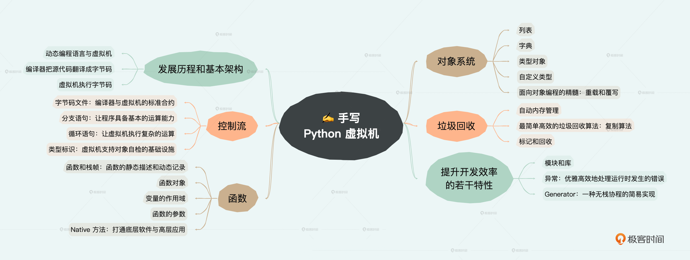

# 开篇词｜从0开始，打造一个属于自己的Python引擎
你好，我是海纳，一个热爱钻研编程的技术老兵。欢迎你加入这个专栏，和我一起探究Python虚拟机的底层奥秘。

屈指算来，我从事编程语言虚拟机和编译器的开发工作已经十余年了。特别是在华为的这些年，我的主要工作就是开发和维护各种动态语言虚拟机，其中包括Python 虚拟机、JavaScript 虚拟机和 Java 语言虚拟机 Hotspot等等。最近一段时间因为AI的大火，我又开始转战网络设备中的静态编译器以及 AI 编译器的开发。

因为在这个领域钻研的时间比较久，很多相关的知识也就自然而然地沉淀下来了。所以我也有幸把这些知识凝结成了文字，出版了《自己动手写 Python 虚拟机》一书，并在极客时间上撰写了专栏 [《编程高手必学的内存知识》](https://time.geekbang.org/column/intro/100094901?utm_campaign=geektime_search&utm_content=geektime_search&utm_medium=geektime_search&utm_source=geektime_search&utm_term=geektime_search&tab=catalog)。可以说这些都是我多年经验的一个精华版，我在华为带新人的时候，就是通过这些知识帮助一个又一个的新员工快速融入编译器开发团队的。

## 我们为什么要手写Python虚拟机？

其实我之前一直在想怎样才能又快又扎实地掌握编译器、虚拟机这些底层的核心技术，也尝试过很多方法，后来经过反复试验我发现 **自己动手写一个虚拟机是学习编译器最好，也是最直接的方法**。

### 传统高校课程与工业级编译器的鸿沟

但恰恰这也是传统教育中缺失的一块内容， **现在高校传统课堂中的编译器课程和工业界真正可商用的编译器还有非常大的差距**。编译器开发涉及到中间代码生成与优化、目标代码生成以及与具体硬件平台相关的存储管理、指令集架构等知识，内容复杂且技术细节多样化。高校课程很难在短时间内把这么多内容都教授给学生。

目前国内高校的《编译原理》课程主要还是在介绍编译器前端算法。但是仅仅实现一个编译器前端无法让一个编程语言真正地运行起来。也就是说，在学习完《编译原理》之后，我们并不能真正地设计出属于自己的编程语言，这是一个巨大的遗憾。而且在目前编译人才越来越紧缺的情况下，这个问题暴露得更加明显了。

### 编译人才库告急

目前国内芯片自主研发进程加快，越来越多的公司开始筹建自己的编译器团队。如今，不光是传统的芯片公司需要编译器开发人员，互联网公司、智能驾驶企业，甚至物流行业、医药行业都在开发自己领域的大模型，这导致 **AI 编译器领域对相关人才的需求越来越大**。

但是，现在编译器领域的人才供给并不能满足这样的需求，很多毕业生并没有受过专业的训练，这一块的知识是缺失的，甚至有些领域内的工程师对虚拟机的底层工作原理了解得也不够透彻，遇到内存管理、编译优化等生产上的问题时，还是没有办法快速解决。

为了填补这部分知识，我就有了再写一门专栏的打算，希望让更多人通过和我一起手写虚拟机将自己的编译基础打扎实，成为编译人才库中的一员。

### Python虚拟机的独特优势

虚拟机的种类很多，我们为什么选择Python虚拟机呢？主要是因为Python虚拟机的优势太明显了。

1. Python 虚拟机设计了一种基于栈的字节码，执行过程简洁高效。
2. Python 语言既支持面向对象编程，也支持将函数做为语言的第一类公民，实现虚拟机的同时可以加深对面向对象编程和函数式编程的理解。
3. Python 语言包含了丰富的内建对象，实现这些内建对象有利于我们深刻地理解现代语言运行时库的设计。
4. Python 虚拟机支持自动内存管理，实现一个简单的内存管理模块可以让我们快速地掌握垃圾回收中的关键知识点。

可以说，Python虚拟机是我们自己实现一个虚拟机的最佳选择。事实也证明了这一点，我们团队的很多新人都是通过《自己动手写 Python 虚拟机》这本书快速上手编译开发的。之前我在向华为总裁任正非先生汇报时提到过这本书，任总对此做了批示：“ **人一生只要写好一本书就可以，一定要在一个领域里坚持深入地钻研下去。**”

这也是我想要写这个专栏的原因，因为2018年《自己动手写 Python 虚拟机》出版的时候，实现的字节码版本是 Python 2.7。随着时间的发展，现在的商用场景中，Python3 已经成为主流，2.7 就显得不合时宜了。我想像任总说的那样，写好这本书，一直更新下去，追随社区中的最新语法，让我们的虚拟机不断地升级。

### Python 3 发生了哪些变化？

Python 3 相对于 Python 2发生了很多变化，除了广为人知的 print 由关键字变成函数、废除 xrange、True 和 False 成为编译期常量等特性，新版本还修复了一些语法缺陷，这里我举两个例子。

第一个例子是 **命名空间泄露问题**。

```python
for i in range(10):
    lst = [i for i in range(10)]
    print(i)

```

如果使用 Python 2 执行，就会打印 10 个 9，而使用 Python 3 执行，则会打印从 0 到 9，共 10 个数字。显然，Python 2 的结果并不符合人们的直觉，而 Python 3 版本对这一点进行了修复。

第二个例子是 **构建闭包的方法**。以下代码是其他函数式语言中常见的构造闭包的例子。但是在 Python 2 中却无法编译通过。这是因为编译器会把 count 误认为是局部变量，而不是自由变量。

```python
def foo():
    count = 0
    def bar():
        count += 1
        print(count)

    return bar

f = foo()
f()
f()

```

Python 3 中引入了 nonlocal 关键字，告诉编译器第 4 行所使用的 count 变量不是局部变量，从而修复了这个问题。

```python
def foo():
    count = 0
    def bar():
        nonlocal count
        count += 1
        print(count)

    return bar

f = foo()
f()
f()

```

如果你对 Python 虚拟机的工作原理不够了解的话，这两个例子的执行结果可能会让你感到费解。不过你也不用急着去寻找答案，因为你在和我动手实操的过程中会领悟到其中的奥秘，那个时候你就会有“不识庐山真面目，只缘身在此山中”的绝妙感觉。

## 课程设计

做为一个实践性很强的专栏，《手写Python虚拟机》既包含了编程语言、编译器和虚拟机的理论讲解，又包含了大量的实验步骤。所以我按照不同的模块把专栏分成了 6 个部分，由浅入深地为你讲解原理并带你实际动手开发。



**第一章 编程语言的发展历程与基本架构**

这一章我们会深入探讨虚拟机的起源与演进，了解它的核心优势，学习编译器是如何将源代码转化为字节码的，我们还会通过实例看到虚拟机的执行过程，包括字节码序列化、解释执行及JIT编译技术。这些都是Python虚拟机相关的背景知识，是我们后面具体实操的理论基础。

**第二章 控制流**

学完这一章的内容，你会了解到 Python字节码指令集、字节码文件的格式、虚拟机如何对字节码文件进行加载等内容。然后我们就可以实现最基本的控制流，例如分支结构、循环结构。也就是说，虚拟机已经具备了基本的计算能力。

**第三章 函数的实现机制**

函数作为 Python 语言的第一类公民，可以做为参数传递给其他函数，也可以做为返回值被传出函数之外。这是函数式编程最基本的特性，但要实现函数式编程，还需要理解自由变量、闭包等特性，所以这一章我们会全面了解语言虚拟机是如何实现这些高级特性的。

**第四章 对象系统和语言内建对象**

面向对象编程的三大特征是封装、继承和多态。在这一章中，你会看到虚拟机是如何实现通过类型创建对象，以及如何表达类型之间的继承关系这些基本内容的，然后我们会进一步掌握运行时识别、函数覆写、操作符重载等面向对象编程中的高级主题。

**第五章 内存管理与垃圾回收**

这一章我们会学习 Python对象的内存分配策略，包括静态分配与动态分配的原理与实现。同时也对垃圾回收算法（如引用计数、标记清除、分代回收）的选择与实现有初步的了解。垃圾回收算法是一个独立且庞大的体系，而这一章将成为你学习垃圾回收算法的第一课，带你轻松走进内存管理知识殿堂。

**第六章 异常、迭代、模块系统**

异常、迭代、模块系统等高级主题相对独立，但同时也有一些依赖关系。在前五章的基础上，你完全有能力自己设计并实现这些主题。所以这一部分的内容相对简略，以说明架构设计为主，你可以根据我给出的架构设计，自己动手实现这些高级特性。

专栏里包含一套完整的 [代码](https://gitee.com/hinus/pythonvm/tree/geektime/)，源码中的每次提交都实现了一个功能，这些功能与专栏章节是相互对应的，你可以通过提交记录轻松地与具体章节对应起来。每节课也会有实验环节以及详细的步骤说明，方便你跟随我一步步实现一个简化版的Python虚拟机。此外，专栏里还穿插了很多我个人的经验分享、设计决策背后的思考以及对Python解释器的现有实现（如 CPython）与 Java 语言虚拟机 Hotspot 的比较分析，加深你对Python虚拟机内部工作原理的理解。

不过“授人以鱼，不如授人以渔”，我希望你能领会专栏背后分析问题的思路和方法，而不是以实现一个具体的虚拟机为目标。最好的情况是，你只需要阅读专栏中的理论部分，然后自己独立地实现一个虚拟机，只有在真正遇到架构和设计上的困难，才去参考我给出的代码。

自己动手一个个敲出来的代码以及实现虚拟机过程中的思考将会成为你编程路上一笔宝贵的财富。期待在实践中看到你的成果，也期待听到你在学习中的心得和体会。希望能和你一起度过一段美好而富有成果的学习时光。