# 一、设计模式简介

## 1.1.什么是设计模式？

“**每个模式描述了一个不断重复发生的问题，及该问题的解决方案的核心**。这样，你就能一次又一次地使用该方案而不必做重复劳动”。——Christopher Alexander

## 1.2.如何解决复杂性？

- 分解
  - 人们**面对复杂性有一个常见的做法**：即**分而治之，将大问题分解为多个小问题**，将复杂问题分解为多个简单问题。
- 抽象
  - 更高层次来讲，**人们处理复杂性有一个通用的技术，即抽象**。由于不能掌握全部的复杂对象，我们选择忽视它的非本质细节，而去**处理泛化和理想化了的对象模型**。

## 1.3.面向对象设计原则

### 1.3.1 依赖倒置原则（DIP）

  + **高层模块(稳定)不应该依赖于低层模块(变化)，二者都应该依赖于抽象(稳定)** 。
  + **抽象(稳定)**不应该依赖于**实现细节(变化)** ，实现细节应该依赖于抽象(稳定)。

### 1.3.2. 开放封闭原则（OCP）

  + **对扩展开放，对更改封闭**。
  + 类模块应该是可扩展的，但是不可修改。

### 1.3.3. 单一职责原则（SRP）

  + **一个类应该仅有一个引起它变化的原因**。
  + 变化的方向隐含着类的责任。

### 1.3.4. Liskov 替换原则（LSP）

  + **子类必须能替换其基类(IS-A)**。
  + 继承表达类型抽象。

### 1.3.5. 接口隔离原则（ISP）

  + **不应该强迫客户程序依赖它们不用的方法**。
  + 接口应该小而完备。

### 1.3.6. 优先使用对象组合，而不是类继承

  + 类继承通常为“白箱复用”，对象组合通常为“黑箱复用” 。
  + **继承在某种程度上破坏了封装性，子类父类耦合度高**。
  + 而对象组合则只要求被组合的对象具有良好定义的接口，耦合度低。

### 1.3.7. 封装变化点

  + **使用封装来创建对象之间的分界层**，让设计者可以在一侧修改，而不影响另一侧，从而实现层次间的松耦合。

### 1.3.8. 针对接口编程，而不是针对实现编程

  + 不将变量类型声明为某个特定的具体类，**声明为某个接口**。
  + 客户程序无需获知对象的具体类型，只知对象所具有的接口。
  + 减少系统中各部分的依赖关系，从而实现“高内聚、松耦合”的类型设计方案。

## 1.4.GOF-23模式分类

### 1.4.1 从目的上看

- 创建型（Creational）模式：**将对象的部分创建工作延迟到子类或者其他对象**，从而应对需求变化为创建对象时具体类型实现引来的冲击。
- 结构性（Structural）模式：**通过类继承或者对象组合获得更灵活的结构**，从而应对需求变化为为对象的结构带来的冲击。
- 行为型（Behavioral）模式：**通过类继承或者对象组合来或分类与对象间的职责**，从而应对需求变化为多个交互的对象带来的冲击。

### 1.4.2 从范围来看：

- **类模式处理类与子类的静态关系**。
- **对象行为模式处理对象间的动态关系**。

表1  GoF 的 23 种设计模式的分类表

| 分类     |             创建型模式              |                        结构型模式                         |                                           行为型模式                                           |
| :------- | :---------------------------------: | :-------------------------------------------------------: | :--------------------------------------------------------------------------------------------: |
| 类模式   |              工厂方法               |                        (类）适配器                        |                                      模板方法、~~解释器~~                                      |
| 对象模式 | 单例 、原型、 抽象工厂 、~~建造者~~ | 代理 (对象）、适配器 、桥接 、装饰 、外观 、享元 、组合、 | 策略 、~~命令~~、 职责链 、状态 、观察者 、~~中介者~~、 ~~迭代器~~ 、~~访问者~~ 、~~备忘录~~、 |

### 1.4.3 从封装变化角度对模式分类（~~不常用~~）

- 组件协作:
  • Template Method
  • Observer / Event
  • Strategy
- 单一职责:
  • Decorator
  • Bridge
- 对象创建:
  • Factory Method
  • Abstract Factory
  • Prototype
  • ~~**Builder**~~
- 对象性能:
  • Singleton
  • Flyweight
- 接口隔离:
  • Façade
  • Proxy
  • ~~**中介者 Mediator**~~
  • Adapter
- 状态变化:
  • ~~**备忘录 Memento**~~
  • State
- 数据结构:
  • Composite
  • ~~**Iterator**~~
  • Chain of Resposibility
- 行为变化:
  • ~~**Command**~~
  • ~~**Visitor**~~
- 领域问题:
  • ~~**解释器 Interpreter**~~

## 1.5.重构到模式 Refactoring to Patterns

- 可以**满足 “应对变化,提高复用”的设计才是好的面向对象设计** 。
- 现代软件设计的特征是“需求的频繁变化”。**设计模式的要点是“寻找变化点,然后在变化点处应用设计模式,从而来更好地应对需求的变化”.“什么时候、什么地点应用设计模式”比“理解设计模式结构本身”更为重要。**
- 设计模式的应用不宜先入为主,一上来就使用设计模式是对设计模式的最大误用。**没有一步到位的设计模式。**敏捷软件开发实践提倡的“`Refactoring to Patterns`”，**重构获得模式，是目前普遍公认的最好的使用设计模式的方法**。

## 1.6.重构关键技法

- 静态 -> 动态
- 早绑定 -> 晚绑定
- 继承 -> 组合
- 编译时依赖 -> 运行时依赖
- 紧耦合 -> 松耦合

# 二、面向对象下的类关系（UML）

请看以下这个类图，类之间的关系是我们需要关注的：

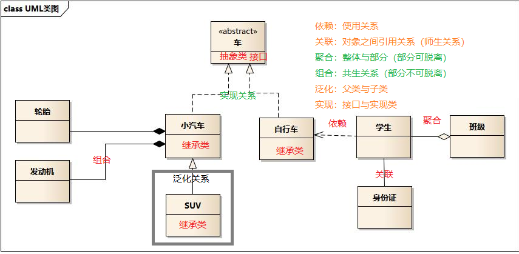

- 车的类图结构为<<abstract>>，表示车是一个抽象类；
- 它有两个继承类：小汽车和自行车；它们之间的关系为实现关系，使用带空心箭头的虚线表示；
- 小汽车为与SUV之间也是继承关系，它们之间的关系为泛化关系，使用带空心箭头的实线表示；
- 小汽车与发动机之间是组合关系，使用带实心箭头的实线表示；
- 学生与班级之间是聚合关系，使用带空心箭头的实线表示；
- 学生与身份证之间为关联关系，使用一根实线表示；
- 学生上学需要用到自行车，与自行车是一种依赖关系，使用带箭头的虚线表示；

## 2.1.依赖关系(dependency)

**依赖**（`Dependency`）关系是一种**使用关系**，**带箭头的虚线**(-->)指向被依赖的类。

## 2.2.关联关系(association)

**关联**（`Association`）关系是**对象之间的一种引用关系**，用于表示一类对象与另一类对象之间的联系，**如老师和学生**等。**实线来表示**，在代码中通常将一个**类的对象作为**另一个类的**成员变量**来实现关联关系。

## 2.3.聚合关系(aggregation)

**聚合**（Aggregation）关系是关联关系的一种，是强关联关系，**是整体和部分之间的关系，是 has-a 的关系**。

**聚合关系也是通过成员对象来实现的**，其中成员对象是整体对象的一部分，但是**成员对象可以脱离整体对象而独立存在**。例如，**学校与老师的关系**，学校包含老师，但如果学校停办了，老师依然存在。**带空心菱形的实线**

## 2.4.组合关系(composition)

在**组合关系中**，整体对象可以控制部分对象的生命周期，一旦整体对象不存在，部分对象也将不存在，**部分对象不能脱离整体对象而存在**。**带实心菱形的实线来表示，菱形指向整体**（**头和嘴关系**，没了头，嘴也不存在了）

## 2.5.泛化关系(generalization)

**泛化**（Generalization）关系是对象之间耦合度最大的一种关系，表示一般与特殊的关系，**是父类与子类之间的关系**，是一种继承关系，是 is-a 的关系。**带空心三角箭头的实线来表示，箭头从子类指向父类。**

## 2.6.实现关系(realize)

**实现（Realization）关系**是接口与实现类之间的关系。**带空心三角箭头的虚线来表示，箭头从实现类指向接口。**

## 2.7.时序图（Sequence Diagram）

[UML时序图笔记 fly_zxy](https://blog.csdn.net/fly_zxy/article/details/80911942)

描述对象之间发送消息的时间顺序显示多个对象之间的动态协作。

建模元素主要有：对象（Actor）、生命线（Lifeline）、控制焦点（Focus of control）、消息（Message）等。

# 三、一句话描述23种设计模式

1. **单例**（Singleton）模式：类只生成一个实例，该类提供了一个**全局访问点供外部获取该实例**，其拓展是有限多例模式。

2. **原型**（Prototype）模式：将一个对象作为原型，通过**对其复制，克隆出多个与原型类似的新实例**。

3. **工厂方法**（Factory Method）模式：定义一个用于**创建产品的接口**，由**子类决定生产什么产品**。

4. **抽象工厂**（AbstractFactory）模式：提供一个**创建产品族的接口**，其每个**子类可以生产一系列**相关的产品。

5. **代理**（Proxy）模式：为某对象提供一种**代理以控制对该对象的访问，从而限制、增强或修改该对象的一些特性**。

6. **适配器**（Adapter）模式：将一个类的**接口A转换成客户希望的另一个接口B**，使得原本由于接口不兼容而不能一起工作的那些类能一起工作。

7. **桥接**（Bridge）模式：**将抽象与实现分离，使各自可独立变化**。

   用**组合关系代替继承关系来实现**，从而降低了抽象和实现这两个可变维度的耦合度。

8. **装饰**（Decorator）模式：**动态的给对象增加一些职责**，即增加其额外的功能。

9. **外观**（Facade）模式：**为多个复杂的子系统，提供一致接口**，使这些子系统更加容易被访问。

10. **享元**（Flyweight）模式：运用**共享技术**来有效地**支持大量细粒度对象的复用**。

11. 组合（Composite）模式：将对象组合成树状层次结构，使用户对单个对象和组合对象具有一致的访问性。

12. **模板方法**（TemplateMethod）模式：**定义算法骨架，且将算法的一些步骤延迟到子类**，使子类不改变算法结构的情况下，重定义某些特定步骤**（大部分框架）**。

13. **策略**（Strategy）模式：**封装一系列算法，使其可相互替换，且算法改变不影响使用算法的客户**。

14. **职责链**（Chain of Responsibility）模式：**把请求从链中的一个对象传到下一个对象，直到请求被响应为止**。通过这种方式去除对象之间的耦合。

15. **状态**（State）模式：**对象的内部状态发生改变时，改变其行为**。

16. **观察者**（Observer）模式：**一系列对象之间的一对多关系，当一个对象发生改变时，其他订阅者都会接受到通知**。

**不常用**

1. ~~**命令**（Command）模式~~：将一个请求封装为一个对象，使**发出请求**的责任和**执行请求**的责任**分割开**。
2. ~~**建造者**（Builder）模式~~：将一个**复杂对象分解成多个相对简单**的部分，然后根据不同需要分别创建它们，最后构建成该复杂对象。
3. ~~**中介者**（Mediator）模式~~：定义一个**中介对象来简化原有对象之间的交互关系**，降低系统中对象间的耦合度，使原有对象之间不必相互了解。
4. ~~**迭代器**（Iterator）模式~~：提供一种方法来**顺序访问**聚合对象中的一系列**数据**，**而不暴露**聚合**对象的内部表示**。
5. ~~**访问者**（Visitor）模式~~：在不改变集合元素的前提下，**为一个集合中的每个元素提供多种访问方式**，即每个元素有多个访问者对象访问。
6. ~~**备忘录**（Memento）模式~~：在不破坏封装性的前提下，**获取并保存一个对象的内部状态**，以便以后恢复它。
7. ~~解释器（Interpreter）模式~~：提供如何定义语言的文法，以及对语言句子的解释方法，即解释器。

# 四、23种设计模式详述

## “组件协作”模式

**现代软件专业分工之后**的第一个**结果是**“**框架与应用程序的划分**”，“组件协作”模式通过**晚期绑定**,来实现框架与应用程序之间的**松耦合**,是二者之间协作时常用的模式。

经典模式:
• Template Method
• Observer / Event
• Strategy

### 4.1.模板方法 （Template Method）

**动机（Motivation）**

+ 在软件构建过程中，对于某一项任务，**它常常有稳定的整体操作结构，但各个子步骤却有很多改变的需求**，或者由于固有的原因（比如框架与应用之间的关系）而无法和任务的整体结构同时实现。
+ 如何在确定**稳定操作**结构的前提下，来灵活**应对各个子步骤的变化**或者晚期实现需求？

**模式定义**

- 定义一个操作中的算法的 **骨架(稳定)** ，而将一些步骤延迟 **(变化)** 到子类中。**Template Method使得子类可以不改变(复用)一个算法的结构即可重定义(override 重写)该算法的某些特定步骤**。														——《 设计模式》 GoF

**要点总结**

+ **`Template Method`模式**是一种非常基础性的设计模式，在面向对象系统中有着大量的应用。**利用**（**虚函数的多态性**）**为很多应用程序框架提供了灵活的扩展点**，是代码复用方面的基本实现结构。
  
+ 除了可以灵活应对子步骤的变化外， **“不要调用我，让我来调用你” 的反向控制结构**是Template Method的典型应用。

+ 被Template Method调用的**虚方法**可以（抽象方法、纯虚方法），但一般推荐将它们设置为`protected`方法。

  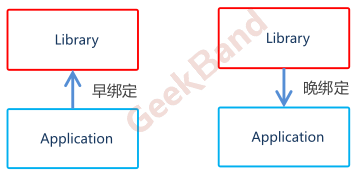

```cpp
//程序库开发人员
class Library{
  public:
    //稳定 template method
    void Run(){
        Step1();
        Step2();//支持变化 ==> 虚函数的多态调用
        Step3();
        Step4(); //支持变化 ==> 虚函数的多态调用
        Step5();
    }
    virtual ~Library() {}
  protected:
    void Step1(){}//稳定
    void Step3(){}//稳定
    void Step5(){}//稳定

    virtual bool Step2() = 0; //变化
    virtual void Step4() = 0; //变化
};

//应用程序开发人员
class Application : public Library
{
  protected:
	virtual bool Step2(){    //... 子类重写实现
		return true;
	}

	virtual void Step4(){     //... 子类重写实现
	}
};

int main()
{
	Library *pLib = new Application();
	pLib->Run();

	delete pLib;
}
```


```cpp
//应用程序开发人员  旧版使用方法
int main()
{
	Library lib;
	Application app;
	lib.Step1();
	app.Step2();
	lib.Step3();
	app.Step4();
	lib.Step5();
}
```


### 4.2.策略模式（ Strategy）

**动机**（Motivation）

+ 在软件构建过程中，某些对象使用的**算法可能多种多样，经常改**变，如果将这些算法都编码到对象中，将会使对象变得异常复杂；而且**有时候支持不使用的算法也是一个性能负担**。
+ 如何在**运行时根据需要透明地更改对象的算法**？将算法与对象本身解耦，从而避免上述问题？

**模式定义**

- ​	定义一系列算法，把它们一个个封装起来，并且使它们可互相替换（变化）。该模式使得**算法可独立于使用它的客户程序(稳定)而变化（扩展，子类化）**。			——《设计模式》 GoF

**要点总结**

+ **Strategy**及其子类为组件**提供了一系列可重用的算法**，从而在**运行时**方便根据需要**在各个算法之间**进行**切换**。

+ Strategy模式提供了用条件判断语句以外的另一种选择，**消除条件判断语句，就是在解耦合**。**含有许多条件判断语句的代码通常都需要Strategy模式**。

+ 如果Strategy对象没有实例变量，那么各个上下文可以**共享同一个Strategy对象，从而节省对象开销**。

  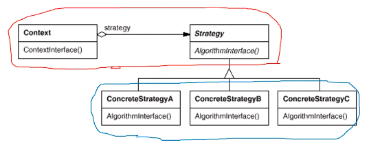

  

  ```cpp
  class TaxStrategy{ //抽象税
  public:
      virtual double Calculate(const Context& context)=0;
      virtual ~TaxStrategy(){}
  };
  
  class CNTax : public TaxStrategy{
  public:
      virtual double Calculate(const Context& context){
          //***********
      }
  };
  
  //扩展
  //*********************************
  class FRTax : public TaxStrategy{
  public:
  	virtual double Calculate(const Context& context){
  		//.........
  	}
  };
  
  
  class SalesOrder{
  private:
      TaxStrategy* strategy; //抽象税
  public:
      SalesOrder(StrategyFactory* strategyFactory){    // 工厂模式
          this->strategy = strategyFactory->NewStrategy();
      }
      ~SalesOrder(){
          delete this->strategy;
      }
      public double CalculateTax(){
          //...
          Context context();
          double val = strategy->Calculate(context); //多态调用
          //...
      }
  };
  ```
  
  ```cpp
  //通常方式，多次if判断解决
  enum TaxBase {
  	CN_Tax,
	FR_Tax       //更改
  };
  
  class SalesOrder{
      TaxBase tax;
  public:
      double CalculateTax(){
          //...
          if (tax == CN_Tax){
              //CN***********
          }
  		else if (tax == FR_Tax){  //更改
  			//...
  		}
          //....
     }  
  };
  ```
  

### 4.3.观察者模式 （Observer ）

**动机**（Motivation）

+ 在软件构建过程中，我们需要为某些对象建立**一种“通知依赖关系”** ——一个对象**（目标对象）的状态**发生改变，所有的依赖对象**（观察者对象）都将得到通知**。如果这样的**依赖关系过于紧密**，将使软件**不能很好地抵御变化**。

  > 如：需要进度提示，原有GUI改成控制台，不一定有现成的基类。

+ 使用面向对象技术，可以将这种依赖关系弱化，并形成一种稳定的依赖关系。从而实现软件体系结构的松耦合。

  ****

**模式定义**

- 定义对象间的一种**一对多（变化）的依赖关系**，以便当**一个对象(Subject)的状态发生改变时，所有依赖于它的对象都得到通知并自动更新**。										——《 设计模式》 GoF


**要点总结**

+ 使用面向对象的抽象，**`Observer`模式使得我们可以独立地改变目标与观察者，从而松耦合**。
+ **目标发送通知时**，无需指定观察者，通知（可以携带通知信息作为参数）会**自动传播**。
+ **观察者自己决定是否需要订阅通知，目标对象对此一无所知**。
+ `Observer`模式是**基于事件的UI框架中非常常用的设计模式**，也是MVC模式的一个重要组成部分。

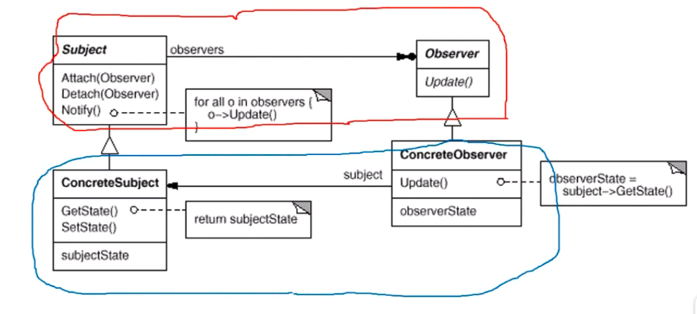

```cpp
class IProgress{
public:
	virtual void DoProgress(float value)=0;
	virtual ~IProgress(){}
};

class FileSplitter{
	List<IProgress*>  m_iprogressList; // 抽象通知机制，支持多个观察者
public:
	void split(){
		//1.读取大文件
		//2.分批次向小文件中写入
		for (int i = 0; i < m_fileNumber; i++){
			onProgress(progressValue);//发送通知
		}
	}
	void addIProgress(IProgress* iprogress){
		m_iprogressList.push_back(iprogress);
	}

	void removeIProgress(IProgress* iprogress){
		m_iprogressList.remove(iprogress);
	}

protected:
	virtual void onProgress(float value){ //触发
        
		List<IProgress*>::iterator itor=m_iprogressList.begin();
		while (itor != m_iprogressList.end() )
			(*itor)->DoProgress(value); //更新进度条
			itor++;
		}
	}
};
// 调用
// 观察者 ConsoleNotifier
class ConsoleNotifier : public IProgress {
public:
	virtual void DoProgress(float value){		cout << ".";	}
};

// 观察者 MainForm
class MainForm : public Form, public IProgress{
	ProgressBar* progressBar; //GUI 显示
public:
	virtual void DoProgress(float value){
		progressBar->setValue(value);
	}
    //订阅
	void Button1_Click(){

		ConsoleNotifier cn;//观察者 ConsoleNotifier
		FileSplitter splitter(filePath, number);//被观察者 FileSplitter

		splitter.addIProgress(this); //订阅通知
		splitter.addIProgress(&cn); //订阅通知
        
		splitter.split();
		splitter.removeIProgress(this);
	}
};
```

## “单一职责”模式

在软件组件的设计中，如果**责任划分的不清晰**，使用**继承得到的结果**往往是随着需求的变化，**子类急剧膨胀，同时充斥着重复的代码**，这个时候的关键是划分责任。

典型模式，责任上表现突出

- Decorator
- Bridge

### 4.4.装饰模式（ Decorator ）（组合 > 多继承）

**动机**（Motivation）

+ 在某些情况下我们可能会“**过度地使用继承来扩展对象的功能**”，**由于继承为类型引入的静态特质**，使得这种扩展方式**缺乏灵活性**；并且随着子类的增多（扩展功能的增多），**各种子类的组合（扩展功能的组合）会导致更多子类的膨胀**。
+ 如何使“对象功能的扩展”能够根据需要来动态地实现？同时避免“扩展功能的增多”带来的子类膨胀问题？从而使得任何“功能扩展变化”所导致的影响将为最低？

**模式定义**

+ **动态（组合）地给一个对象增加一些额外的职责。**就增加功能而言，**装饰模式`Decorator`比生成子类（继承）更为灵活**（消除重复代码 & 减少子类个数）。——《设计模式》GoF

  

**要点总结**

+ **通过采用组合而非继承的手法**， Decorator模式**实现了在运行时动态**扩展对象功能的能力，而且**可以根据需要扩展多个功能**。避免了使用继承带来的“灵活性差”和“多子类衍生问题”。

+ **Decorator类在接口上表现为is-a Component的继承关系**，即Decorator类继承了Component类所具有的接口。但**在实现上又表现为has-a Component的组合关系**，即Decorator类又使用了另外一个Component类。

+ Decorator模式的目的并非解决“多子类衍生的多继承”问题，**Decorator模式应用的要点在于解决“主体类在多个方向上的扩展功能”——是为“装饰”的含义**。

  **示例1内部继承结构**

  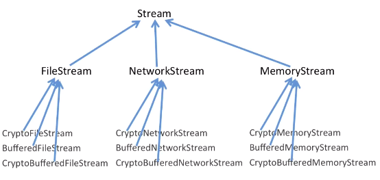

  实例2：**用组合代替继承**，运行时编译

  实例3：将共同的部分提出，类关系图如下,子类大大减少

  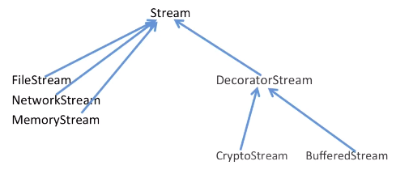

  ```cpp
  //业务操作
  class Stream{
  public：
      virtual char Read(int number)=0;
      virtual void Seek(int position)=0;
      virtual void Write(char data)=0;
      virtual ~Stream(){}
  };
  //主体类
  class FileStream: public Stream{
  public:
      virtual char Read(int number){} //读文件流
      virtual void Seek(int position){} //定位文件流
      virtual void Write(char data){} //写文件流
  };
  class NetworkStream :public Stream{};
  class MemoryStream :public Stream{};
  
  
  //扩展操作  old
  class CryptoFileStream :public FileStream{};
  void Process(){ 
      //编译时装配 
      CryptoFileStream *fs1 = new CryptoFileStream();
      BufferedFileStream *fs2 = new BufferedFileStream();
      CryptoBufferedFileStream *fs3 =new CryptoBufferedFileStream();
  }
  
  
  //装饰模式
  DecoratorStream: public Stream{ //接口
  protected:
      Stream* stream;//实现
      DecoratorStream(Stream * stm):stream(stm){}
  };
  
  class CryptoStream: public DecoratorStream {
  public:
      CryptoStream(Stream* stm):DecoratorStream(stm){}
      virtual char Read(int number){
          //额外的加密操作...
          stream->Read(number);//读文件流
      }
      virtual void Seek(int position){
          //额外的加密操作...
          stream::Seek(position);//定位文件流
          //额外的加密操作...
      }
      virtual void Write(byte data){
          //额外的加密操作...
          stream::Write(data);//写文件流
          //额外的加密操作...
      }
  };
  
  class BufferedStream : public DecoratorStream{
      Stream* stream;//...
  public:
      BufferedStream(Stream* stm):DecoratorStream(stm){
      }
      //...
  };
  
  void Process(){
      //运行时装配
      FileStream* s1 =new FileStream();
      CryptoStream* s2 = new CryptoStream(s1);
      BufferedStream* s3 = new BufferedStream(s1);
      BufferedStream* s4 = new BufferedStream(s2);
  }
  
  ```
  

### 4.5.桥模式（ Bridge）

**动机**（Motivation）

+ 由于某些类型的**固有的实现逻辑**，使得它们**具多个纬度的变化**。
+ 如何应对这种“多维度的变化”？如何利用面向对象技术来使得类型可以**轻松地沿着两个乃至多个方向变化**，而不引入额外的复杂度？

**模式定义**

- **将抽象部分(业务功能)与实现部分(平台实现)分离**，使它们都可以独立地变化。  ——《设计模式》GoF

  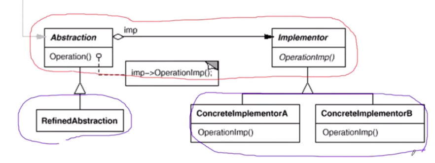


**要点总结**

+ `Bridge`模式使用“**对象间的组合关系**”解耦了抽象和实现之间固有的绑定关系，使得抽象和实现可以沿着各自的维度来变化。**所谓抽象和实现沿着各自纬度的变化，即“子类化”它们**。
+ **Bridge模式有时候类似于多继承方案**，但是**多继承方案往往违背单一职责原则**（即一个类只有一个变化的原因），复用性比较差。**Bridge模式是比多继承方案更好的解决方法**。
+ Bridge模式的应用一般在“两个非常强的变化维度”，有时一个类也有多于两个的变化维度，这时可用Bridge的扩展模式。

```cpp
class Messager{//业务
protected:
     class MessagerImp* messagerImp;//平台
public:
    virtual void Login(string username, string password)=0;
    virtual ~Messager(){}
};
class MessagerImp{// 平台
public:
    virtual void PlaySound()=0;
    virtual void Connect()=0;
    virtual ~MessagerImp(){}
};


//平台实现 n
class PCMessagerImp : public MessagerImp{};
class MobileMessagerImp : public MessagerImp{
public:
    virtual void PlaySound(){
        //==========
    }
    virtual void Connect(){
        //==========
    }
};

//业务抽象 m
//类的数目：1+n+m
class MessagerLite :public Messager {
public:
    virtual void Login(string username, string password){
        messagerImp->Connect();
        //........
    }
};

class MessagerPerfect  :public Messager {
public:
    virtual void Login(string username, string password){
        messagerImp->PlaySound();
        //********
        messagerImp->Connect();
        //........
    }
};
void Process(){
    //运行时装配
    MessagerImp* mImp=new PCMessagerImp();
    Messager *m =new Messager(mImp);
}
// 简单易理解
	App* gameApp = new GameApp;
    App* translateApp = new TranslateApp;
    MobilePhone* mi = new XiaoMi;
    MobilePhone* hua = new HuaWei;
```

```cpp
class Messager{//多个变化方向，基础操作+额外操作。
public:
    virtual void Login(string username, string password)=0;
    virtual void PlaySound()=0;
    virtual void Connect()=0;
    
    virtual ~Messager(){}
};
//平台实现
class PCMessagerBase : public Messager{
public:
    virtual void PlaySound(){}//**********
    virtual void Connect(){}//**********
};
//业务抽象
class PCMessagerLite : public PCMessagerBase {
public:
    virtual void Login(string username, string password){
        PCMessagerBase::Connect();}//........
};
class PCMessagerPerfect : public PCMessagerBase {
public:
    virtual void Login(string username, string password){
        PCMessagerBase::PlaySound();
        //********
        PCMessagerBase::Connect();
        //........
    }
};
class MobileMessagerBase : public Messager{};
class MobileMessagerLite : public MobileMessagerBase {};
class MobileMessagerPerfect : public MobileMessagerBase {};

void Process(){
        //编译时装配
        Messager *m = new PCMessagerPerfect();
}
```

## “对象创建”模式

- 通过**“对象创建”模式绕开`new`**，来**避免对象创建（new）过程中**所导致的紧耦合（**依赖具体类**），从而支持**对象创建的稳定**。它是接口抽象之后的第一步工作。
- 典型模式
  - Factory Method
  - Abstract Factory
  - Prototype
  - ~~Builder~~

### 4.6.工厂方法（ Factory Method）

**动机**（Motivation）

+ 在软件系统中，经常面临着创建对象的工作；**由于需求的变化，需要创建的对象的具体类型经常变化。**
+ 如何应对这种变化？如何绕过常规的对象创建方法(new)，提供一种“封装机制”来避免客户程序和这种“具体对象创建工作”的紧耦合？

**模式定义**

- **定义一个用于创建对象的接口，让子类决定实例化哪一个类**。Factory Method使得一个类的实例化延迟（目的：解耦，手段：虚函数）到子类。									——《设计模式》GoF

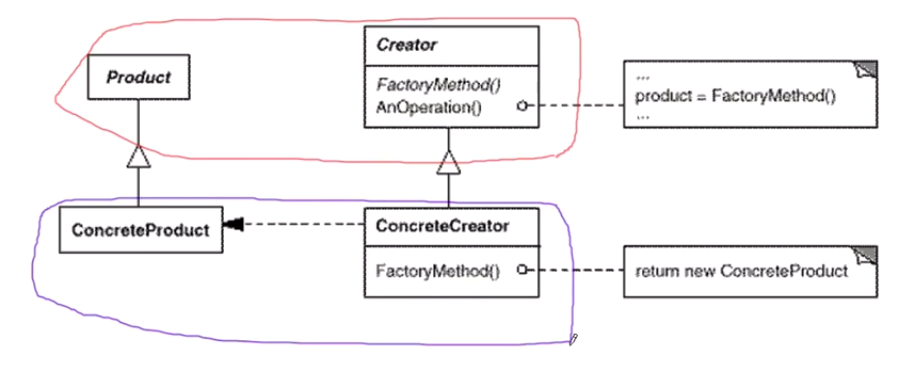

**要点总结**

+ Factory Method模式用于隔离类对象的使用者和具体类型之间的耦合关系。面对一个经常变化的具体类型，紧耦合关系(new)会导致软件的脆弱。
+ Factory Method模式通过面向对象的手法，**将所要创建的具体对象工作延迟到子类**，从而**实现一种扩展**（而非更改）的策略，较好地解决了这种紧耦合关系。
+ Factory Method模式解决“单个对象”的需求变化。**缺点在于要求创建方法/参数相同**。

```cpp
//抽象类
class ISplitter{
public:
    virtual void split()=0;
    virtual ~ISplitter(){}
};
//工厂基类
class SplitterFactory{
public:
    virtual ISplitter* CreateSplitter()=0;
    virtual ~SplitterFactory(){}
};

//具体类
class BinarySplitter : public ISplitter{};
class TxtSplitter: public ISplitter{};

//具体工厂
class BinarySplitterFactory: public SplitterFactory{
public:
    virtual ISplitter* CreateSplitter(){
        return new BinarySplitter();
    }
};
class MainForm : public Form{
     SplitterFactory*  factory;//工厂
public:
	void Button1_Click(){
		ISplitter * splitter=  new BinarySplitter();//依赖具体类
         ISplitter * splitter = factory->CreateSplitter(); //多态new
         splitter->split();
	}
};
```

### 4.7.抽象工厂（ Abstract Factory）

**动机(motivation)**

+ 软件系统中，经常面临着“**一系列相互依赖的对象的创建工作**”；同时，由于需求的变化，往往存在更多系列对象的创建工作。
+ 如何应对这种变化？如何绕过常规的对象创建方法(new)，提供一种“封装机制”来避免客户程序和这种“多系列具体对象创建工作”的紧耦合。

**模式定义**

- 提供一个接口，**让该接口负责创建一系列”相关或者相互依赖的对象“，无需指定它们具体的类**。——《设计模式》GoF

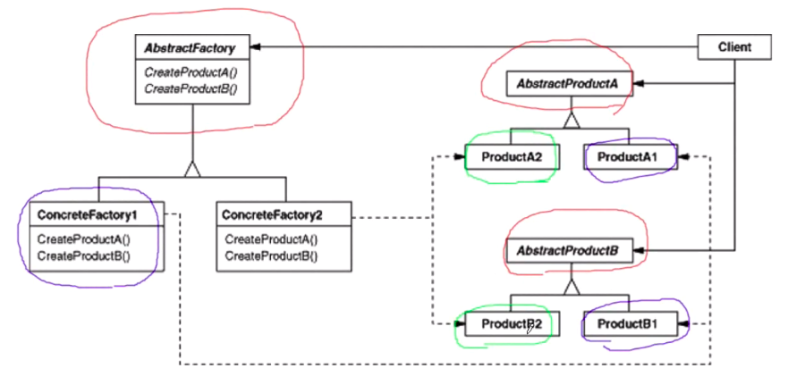

**要点总结**

+ 如果没有应对”多系列对象创建“的需求变化，则没有必要使用Abstract Factory模式，这时候使用简单的工厂即可。
+ **”系列对象“指的是在某一个特定系列的对象之间有相互依赖、或作用的关系。不同系列的对象之间不能相互依赖。**
+ Abstract Factory模式主要在于应用”新系列“的需求变动。**其缺点在与难以应对”新对象“的需求变动**。

```cpp
//数据库访问有关的基类
class IDBConnection{};
class IDBCommand{};

class IDBFactory{
public:
    virtual IDBConnection* CreateDBConnection()=0;
    virtual IDBCommand* CreateDBCommand()=0;
};

//支持SQL Server
class SqlConnection: public IDBConnection{};
class SqlCommand   : public IDBCommand{};

class SqlDBFactory:public IDBFactory{
public:
    virtual IDBConnection* CreateDBConnection()=0;
    virtual IDBCommand* CreateDBCommand()=0;
};

class EmployeeDAO{
    class IDBFactory* dbFactory;
public:
    vector<EmployeeDO> GetEmployees(){
        class IDBConnection* connection = dbFactory->CreateDBConnection();
        connection->ConnectionString("...");

        class IDBCommand* command = dbFactory->CreateDBCommand();
        command->CommandText("...");
        command->SetConnection(connection); //关联性
    }
};
```

### 4.8.原型模式（Prototype）

将上述工厂模式代码的抽象类和工厂基类合二为一

**动机**

- 在软件系统中，经常面临这“**某些结构复杂的对象”**的创建工作；由于需求的变化，这些对象经常面临着剧烈的变化，但是它们却拥有比较稳定一致的接口。
- 如何应对这种变化？如何向“客户程序(使用这些对象的程序)”隔离出“这些易变对象”，从而使得依赖这些”易变对象“的客户程序不随着需求改变而改变。

**应用的比较少**

**模式定义**

使用原型实例指定创建对象的种类，**然后通过拷贝这些原型来创建新的对象**。

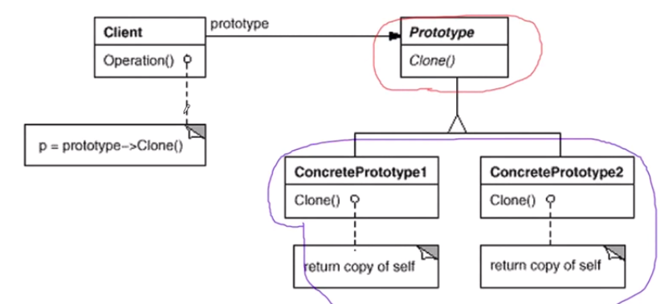

**要点总结**

- Prototype模式同样用于隔离对象的使用者和具体类型(易变类)之间的耦合关系，它同样要求这些“易变类”**拥有稳定的接口。**
- Prototype模式对于**“如何创建易变类的实体对象“采用”原型克隆“的方法来做，** 它使得我们可以非常灵活地动态创建”拥有某些稳定接口“的新对象——所需工作仅仅是**注册一个新类的对象(即原型)， 然后在任何需要的地方Clone。**
- Prototype模式中的Clone方法可以利用某些框架中的**序列化来实现深拷贝**。（Java/C#）

```cpp
//抽象类
class ISplitter{
public:
    virtual void split()=0;
    virtual ISplitter* clone()=0; //通过克隆自己来创建对象

    virtual ~ISplitter(){}
};
//具体类
class BinarySplitter : public ISplitter{
public:
    virtual ISplitter* clone(){
        return new BinarySplitter(*this);
    }
};

class TxtSplitter: public ISplitter{
public:
    virtual ISplitter* clone(){
        return new TxtSplitter(*this);
    }
};
//Client
class MainForm : public Form{
    ISplitter*  prototype;//原型对象
public:
    MainForm(ISplitter*  prototype){
        this->prototype=prototype;
    }
    void Button1_Click(){
        ISplitter * splitter= prototype->clone(); //克隆原型
        splitter->split();
    }
};

```

### ~~4.9.构建器（Builder）~~

**动机**（Motivation）

- 在软件系统中，有时候面临着“**一个复杂对象”的创建**工作，其通常由各个部分的子对象用一定的算法构成；由于需求的变化，这 个**复杂对象的各个部分经常面临着剧烈的变化**，但是将它们**组合**在一起的**算法却相对稳定。**
- 如何应对这种变化？如何提供一种**“封装机制”来隔离出“复杂对象的各个部分”的变化，**从而保持系统中的“稳定构建算法”不随着需求改变而改变？

**模式定义**

将一个复杂对象的构造与其表示相分离，**使得同样的构建过程（稳定）**可以创建不同的表示（变化）。

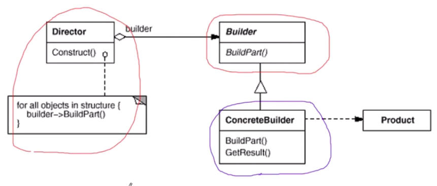

**要点总结**

- Builder 模式主要用于“分步骤构建一个复杂的对象”。在这其中“分步骤”是一个**稳定的算法**，而复杂**对象的各个部分则经常变化。**
- **变化点在哪里，封装哪里**—— Builder模式主要在于应对“复杂对象各个部分”的频繁需求变动。**其缺点在于难以应对“分步骤构建算法”的需求变动。**
- 在Builder模式中，要注意不同语言中构造器内调用虚函数的差别（**C++(构造函数中不可以调用虚函数)** vs. C#)。

```cpp
class House{
    //....
};
class StoneHouse: public House{};

class HouseBuilder {
public:
    House* GetResult(){ return pHouse;  }
    virtual ~HouseBuilder(){}
protected:
    House* pHouse;
    virtual void BuildPart1()=0;
    virtual void BuildPart2()=0;
    virtual void BuildPart3()=0;
};
//建造者类：创建和提供实例；
class StoneHouseBuilder: public HouseBuilder{
protected:
    virtual void BuildPart1(){/* pHouse->Part1 = ...;*/}
    virtual void BuildPart2(){}
    virtual void BuildPart3(){}
};

// Director类：管理建造出来的实例的依赖关系。

class HouseDirector{
public:
    HouseBuilder* pHouseBuilder;

    HouseDirector(HouseBuilder* pHouseBuilder){
        this->pHouseBuilder=pHouseBuilder;
    }

    House* Construct(){
        pHouseBuilder->BuildPart1();
        for (int i = 0; i < 4; i++){
            pHouseBuilder->BuildPart2();
        }
        bool flag=pHouseBuilder->BuildPart3();
        if(flag){
            pHouseBuilder->BuildPart4();
        }
        pHouseBuilder->BuildPart5();
        return pHouseBuilder->GetResult();
    }
};
```


## “对象性能”模式

- 面向对象很好的解决了“抽象”的问题，但是不可避免的要付出一定的代价。对于通常情况来讲，面向对象的成本大都可以忽略不计。但是某些情况下，面向对象带来的成本必须谨慎处理。
- 典型模式
  - Singleton
  - Flyweight

### 5.10.单件模式（Singleton）

**动机**(Motivation)

- 在软件系统中，经常有这样一些特殊的类，必须保证它们在系统中只存在一个实例，才能确保它们的逻辑正确性、以及良好的效率。
- 如何绕过常规的构造器，提供一种机制来保证一个类只有一个实例？
- 这应该是类设计者的责任，而不是使用者的责任。

[示例代码](https://github.com/yangmiemie99/NoteBook/tree/master/CPP-Design-Patterns/12_课件_Singleton)

**模式定义**

保证一个类仅有一个实例，并提供一个该实例的全局访问点。 ——《设计模式》GoF

**要点总结**

- Singleton模式中的实例构造器可以设置为protected以允许子类派生。
- Singleton模式一般不要支持拷贝构造函数和Clone接口，因为这有可能导致多个对象实例，与Singleton模式的初中违背。
- 如何实现多线程环境下安全的Singleton？注意对双检查锁的正确实现。

```cpp
class Singleton{
private:
    Singleton();
    Singleton(const Singleton& other);
public:
    static Singleton* getInstance();
    static Singleton* m_instance;
};
Singleton* Singleton::m_instance=nullptr;

//线程非安全版本
Singleton* Singleton::getInstance() {
    if (m_instance == nullptr) {
        m_instance = new Singleton();
    }
    return m_instance;
}

//线程安全版本，但锁的代价过高
Singleton* Singleton::getInstance() {
    Lock lock;
    if (m_instance == nullptr) {
        m_instance = new Singleton();
    }
    return m_instance;
}

//双检查锁，但由于内存读写reorder不安全
Singleton* Singleton::getInstance() {

    if(m_instance==nullptr){
        Lock lock;
        if (m_instance == nullptr) {
            m_instance = new Singleton();
        }
    }
    return m_instance;
}


//C++ 11版本之后的跨平台实现 (volatile)
std::atomic<Singleton*> Singleton::m_instance;
std::mutex Singleton::m_mutex;

Singleton* Singleton::getInstance() {
    Singleton* tmp = m_instance.load(std::memory_order_relaxed);
    std::atomic_thread_fence(std::memory_order_acquire);//获取内存fence
    if (tmp == nullptr) {
        std::lock_guard<std::mutex> lock(m_mutex);
        tmp = m_instance.load(std::memory_order_relaxed);
        if (tmp == nullptr) {
            tmp = new Singleton;
            std::atomic_thread_fence(std::memory_order_release);//释放内存fence
            m_instance.store(tmp, std::memory_order_relaxed);
        }
    }
    return tmp;
}

```


### 5.11.享元模式（flyweight）

**动机**

- 在软件系统中采用纯粹对象方案的问题在于**大量细颗粒读的对象**会很快的充斥系统中，从而**带来很高的运行代价**——主要指**内存需求方面的代价**。
- 如何在避免大量细颗粒度对象问题的同时，让外部客户程序依然能够透明的使用面向对象的方式来操作。

**模式定义**

运用**共享技术**有效地支持大量细颗粒读的对象。

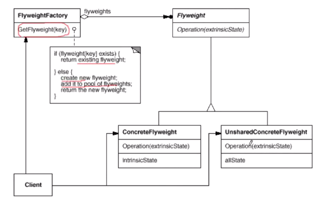

[享元模式 示例](https://github.com/yangmiemie99/NoteBook/tree/master/CPP-Design-Patterns/13_课件_Flyweight享元模式)

**要点总结**

- 面向对象和好地解决了抽象性的问题，但是作为一个运行在机器中的程序实体，我们需要考虑对象的代价问题。Flyweight主要解决了面向对象的代价问题，一般不触及面向对象的抽象性问题。
- **Flyweight采用对象共享的做法来降低系统中对象的个数。**从而降低细颗粒对象给系统带来的内存压力。在具体实现方面，要注意对象状态的处理。
- 对象的数量太大从而导致对象内存开销加大——什么样的数量才算大？这需要我们仔细的根据具体应用情况进行评估，而不能凭空臆断。

```cpp
class Font {
    //unique object key
    string key;
    //object state
    //....
public:
    Font(const string& key){/* ... */}
};


class FontFactory{
    map<string,Font* > fontPool;
public:
    Font* GetFont(const string& key){
        map<string,Font*>::iterator item=fontPool.find(key);
        if(item!=footPool.end()){
            return fontPool[key];
        }else{
            Font* font = new Font(key);
            fontPool[key]= font;//std::map[]赋值
            return font;
        }
    }
    void clear(){
        //...
    }
};
```


## “接口隔离模式”

- 在组件构建过程中，某些接口直接的依赖常常会带来很多问题、甚至无法实现。采用添加一层**间接**（稳定）接口，来隔离本来互相紧密关联的接口是一种常见的解决方案。
- 典型模式
  - Facade 门面模式
  - Proxy 代理模式
  - Adapter 适配器
  - Mediator 中介者

### 6.12.（Facade）门面模式

系统间耦合的复杂度

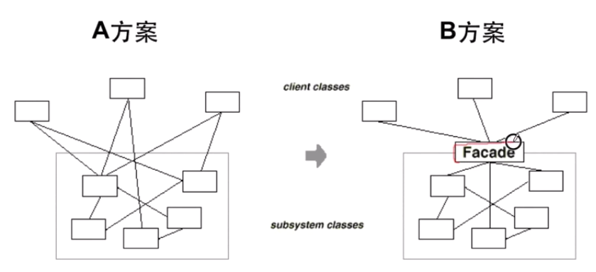

**动机**

- 上述A方案的问题在于随着外部客户程序和各子系统的演化，这种**过多的耦合面临很多变化的挑战**。
- 如何简化外部客户程序和系统间的交互接口？如何将**外部客户程序的演化**和**内部子系统的变化**之间的依赖相互**解耦**？

**模式定义**

为子系统中的一组接口提供一致（稳定）的界面，Facade模式定义了一个高层接口，这个接口使得这一子系统更加容易使用（复用）。

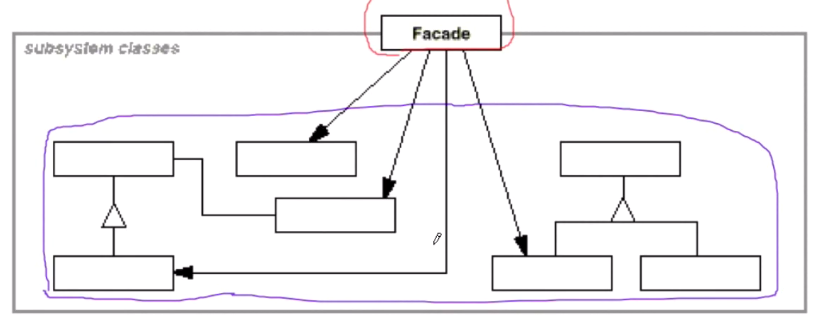

**要点总结**

- 从客户程序的角度来看，`Facade`模式简化了整个组件系统的接口，对于组件内部与外部客户程序来说，达到了一种“解耦”的效果——**内部子系统的任何变化不会影响到Facade接口的变化。**
- Facade设计模式更注重从架构的层次去看整个系统，而不是单个类的层次。**Facade很多时候是一种架构设计模式**。
- Facade设计模式并非是一个集装箱，可以任意地放进任何多个对象。Facade设计模式中组件的内部应该是“**相互耦合关系比较大的一系列组件**”，而不是一个简单的功能集合。

**主要优点**

- 降低了**子系统与客户端之间的耦合度**，使得子系统的变化不会影响调用它的客户类。


- 对客户屏蔽了子系统组件，减少了客户处理的对象数目，并**使得子系统使用起来更加容易**。


- **降低了大型软件系统中的编译依赖性**，简化了系统在不同平台之间的移植过程，因为编译一个子系统不会影响其他的子系统，也不会影响外观对象。

**主要缺点**

- 不能很好地限制客户使用子系统类。


- **增加新的子系统可能需要修改外观类或客户端的源代码**，违背了“开闭原则”。

```cpp
class Television {
public:
    void On() {cout << "电视机打开" << endl;}
    void Off() {cout << "电视机关闭" << endl;}
};

//灯
class Light {
public:
    void On() {cout << "灯打开" << endl;}
    void Off() {cout << "灯关闭" << endl;}
};

//音响
class Audio {
public:
    void On() {cout << "音响打开" << endl;}
    void Off() {cout << "音响关闭" << endl;}
};

//麦克风
class Mircophone {
public:
    void On() {cout << "麦克风打开" << endl;}
    void Off() {cout << "麦克风关闭" << endl;}
};

//DVD播放器
class DVDPlayer {
public:
    void On() {cout << "DVD播放器打开" << endl;}
    void Off() {cout << "DVD播放器关闭" << endl;}
};

//游戏机
class GameMachine {
public:
    void On() {cout << "游戏机打开" << endl;}
    void Off() {cout << "游戏机关闭" << endl;}
};

//KTV模式
class KTVMode {
public:
    KTVMode() {
        pTv = new Television;
        pLight = new Light;
        pAudio = new Audio;
        pMicrophone = new Mircophone;
        pDvd = new DVDPlayer;
    }
    void OnKtv() {
        pTv->On();
        pLight->Off();
        pAudio->On();
        pMicrophone->On();
        pDvd->On();
    }
    void OffKtv() {
        pTv->Off();
        pLight->On();
        pAudio->Off();
        pMicrophone->Off();
        pDvd->Off();
    }
    ~KTVMode() {
        delete pTv;
        delete pLight;
        delete pAudio;
        delete pMicrophone;
        delete pDvd;
    }

    Television* pTv;
    Light* pLight;
    Audio* pAudio;
    Mircophone* pMicrophone;
    DVDPlayer* pDvd;
};

void test01() {
    KTVMode* ktv = new KTVMode;
    ktv->OnKtv();
}

int main() {
    test01();
    return 0;
}

```


### 6.13.（Proxy） 代理模式

**动机**

- 在面向对象系统中，**有些对象由于某些原因**（比如对象创建的开销很大，或者某些操作需要**安全控制**，或者需要进程外的访问等）**直接访问会给使用者或者系统结构带来很多麻烦。**
- 如何在**不失透明操作（一致性）**对象的同时来管理/控制这些对象特有的复杂性？增加间接层是常见的解决方式。

**模式定义**

为其他对象**提供一种代理以控制**（隔离，使用接口）对这个对象的访问。

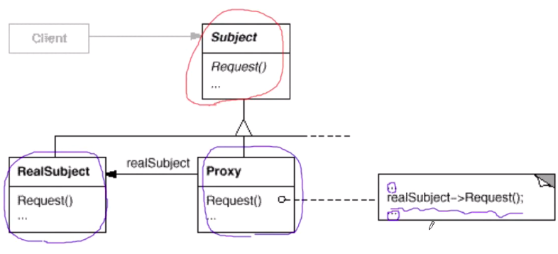

具体到设计会比较复杂。

**要点总结**

- **“增加一层间接层”是软件系统中对许多复杂问题的一种常见解决方法**。在面向对象系统中，直接使用某些对象会带来很多问题，作为间接层proxy对象便是解决这一问题的常用手段。
- 具体proxy设计模式的实现方法，实现粒度相差很大，很有可能对单个对象左细颗粒度控制，如copy-on-write技术，有些可能对组件模块提供抽象代理层（分布式架构，需要网络访问等等），在架构层次对对象左proxy。
- proxy并不要求保持接口完整的一致性，只要能够间接控制，有时候损及一些透明性也是可以接受的。

```cpp
class ISubject{
public:
    virtual void process();
};//抽象类
class RealSubject: public ISubject{
public:
    virtual void process(){
        //....
    }
};

//Proxy的设计
class SubjectProxy: public ISubject{
public:
    virtual void process(){
        //对RealSubject的一种间接访问
        //....
    }
};


class ClientApp{
    ISubject* subject;
public:
    ClientApp(){
        subject=new SubjectProxy();
       // subject=new RealSubject();
    }
    void DoTask(){
        //...
        subject->process();
        
        //....
    }
};
```


### 6.14.（Adapter）适配器

**动机**

- 在软件先系统中，由于应用环境的变化，常常需要将“一些现存的对象”放在新的环境中应用，但是新环境要求的接口是这些现存对象所不满足的。
- 如何应对这种“**迁移的变化**”？如何既能利用现有对象的良好实现，又能满足新的应用环境索要求的接口。

**模式定义**

**将一个类的接口转化成客户希望的另一个接口。**Adapter模式使得原本由于接口不兼容而不能一起工作的那些类可以一起工作。

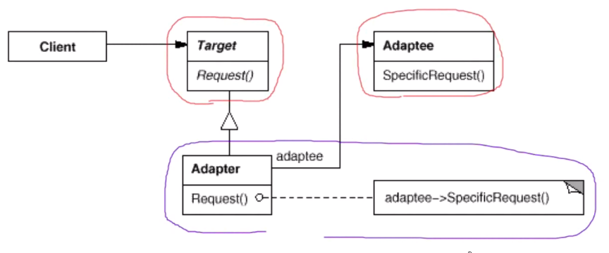

adaptee现存对象。adapter适配器用组合的方式包含现存对象，继承自Target代表与Target有相同的接口。


**模式定义**

将一个类的接口转化成客户希望的另一个接口。Adapter模式使得**原本由于接口不兼容而不能一起工作的那些类可以一起工作。**

**要点总结**

- adapter模式主要应用于“希望复用一些现存的类，但是接口又与复用环境要求不一致的情况“，在遗留代码复用、类库迁移等方买你非常有用。

- GoF23定义了良好总Adapter模式的实现结构：对象适配器和类适配器。但是类适配器采用”多继承“的实现方式，一般不推荐使用。**对象适配器采用”对象组合的方式“，更符合松耦合的精神。**

- Adapter模式可以实现的非常灵活，不必拘泥 于Gof23定义的两种结构。例如，完全可以将Adapter模式中的**”现存对象“**（deque，queue）作为新的接口方法参数，达到适配的目的。

- **缺点：过多地使用适配器，会让系统非常零乱，不易整体进行把握**。比如，明明看到调用的是 A 接口，其实内部被适配成了 B 接口的实现，一个系统如果太多出现这种情况，无异于一场灾难。

  **因此如果不是很有必要，可以不使用适配器，而是直接对系统进行重构**。

```cpp
//目标接口（新接口）
class ITarget{
public:
    virtual void process()=0;
};

//遗留接口（老接口）
class IAdaptee{
public:
    virtual void foo(int data)=0;
    virtual int bar()=0;
};

//遗留类型
class OldClass: public IAdaptee{
    //....
};

//对象适配器
class Adapter: public ITarget{ //继承，新接口
protected:
    IAdaptee* pAdaptee;//组合，老接口
public:
    Adapter(IAdaptee* pAdaptee){
        this->pAdaptee=pAdaptee;
    }
    virtual void process(){
        int data=pAdaptee->bar();
        pAdaptee->foo(data);
    }
};
//类适配器
class Adapter: public ITarget,//新接口，public继承
        protected OldClass{ //多继承，旧接口，protected继承
}
int main(){
    IAdaptee* pAdaptee=new OldClass();
    ITarget* pTarget=new Adapter(pAdaptee);
    pTarget->process();
}

class stack{
    deqeue container;
};
class queue{
    deqeue container;
};
```


### ~~6.15.（Mediator） 中介者~~（MQTT服务器）

**动机**

- 在软件构建过程中，经常会出现**多个对象相互关联交互**的情况，对象之间常常会维持一种**复杂的**引用关系，如果遇到一些需求更改，这些直接的引用关系面临不断的变化。
- 在这种情况下，我们可以使用一个”中介对象”来管理对象间的关系，**避免相互交互的对象之间的紧耦合关系**，从而更好的抵御变化。

**模式定义**

用一个中介对象来封装（封装变化）一系列的对象交互。中介者使各对象不需要**显示的相互引用**（编译时依赖 -》 运行时依赖），从而使其耦合松散（管理变化），而且可以独立地改变他们之间的交互。

结构

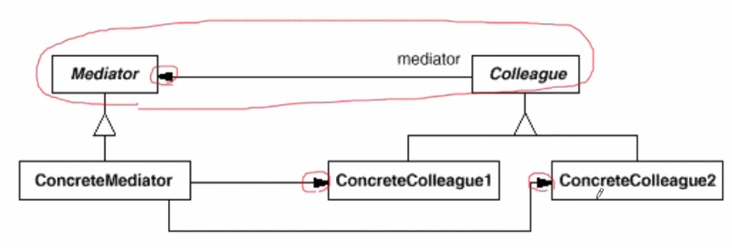

concreteCollegue本身是相互依赖的，经过中介，不相互依赖了。Meidator和Colleague相互依赖。

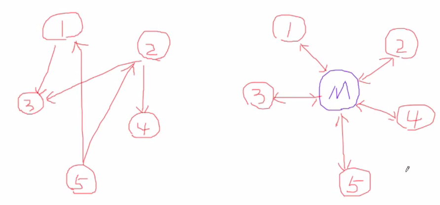

**要点总结**

- 将多个对象间复杂的关联关系解耦，**Mediator模式将多个对象间的控制逻辑进行集中管理**，变“多个对象互相关联”为“多个对象和一个中介者关联”

- 随着控制逻辑的复杂化，Mediator具体对象的实现可能相当复杂。这时候可以对Mediator独享进行分解处理。

- Facade模式是解耦**系统间（单向）的对象**关联关系;Mediator模式是解耦**系统内各个对象之间**（双向）的关联关系。

- 由于ConcreteMediator控制了集中化，于是就把交互复杂性变为了中介者的复杂性，**这就使得中介者会变得比任何一个ConcreteColleague都复杂**。

  ```cpp
  class Mediator;
  class Colleague //抽象同事
  {
  public:
      Colleague(Mediator* mediator);
      virtual ~Colleague();
      virtual void Notify(std::string message) = 0;
      void Send(std::string message);
  
  private:
      Mediator*       m_Mediator;
  };
  
  //同事
  class ConcreteColleague1 : public Colleague
  {
  public:
      ConcreteColleague1(Mediator* mediator);
      void Notify(std::string message) override;
  
  private:
      Mediator*       m_Mediator;
  };
  
  
  class Colleague;
  class Mediator{
  public:
      Mediator();
      void Send(std::string message, Colleague* colleague);
  
      void SetColleague1(Colleague* colleague);
      void SetColleague2(Colleague* colleague);
  private:
      Colleague*      m_Colleague1;
      Colleague*      m_Colleague2;
  };
  
  
  using namespace std;
  
  int main()
  {
      Mediator* mediator = new Mediator();
  
      Colleague* c1 = new ConcreteColleague1(mediator);
      Colleague* c2 = new ConcreteColleague2(mediator);
  
      mediator->SetColleague1(c1);
      mediator->SetColleague2(c2);
  
      c1->Send("吃了吗");
      c2->Send("我吃过了，你呢");
      return 0;
  }
  ```

  

## “状态变化”模式

- 在组件构建过程中，某些对象的状态经常面临变化，如何对这些变化进行有效的管理？同时又维持高层模块的稳定？“状态变化”模式这一问题提供了一种解决方案。
- State
- Memento

### 7.16.State状态模式

**动机**

- 在软件构建过程中，某些对象的**状态如果改变**，其**行为也会随之而发生变化**，比如文档处于只读状态，其支持的行为和读写状态支持的行为就可能完全不同。
- 如何在运行时根据对象的状态来透明地更改对象的行为？而不会为对象操作和状态转化之间引入紧耦合？


**模式定义**

- **允许一个对象在其内部状态改变时改变他的行为。**从而使得对象看起来似乎修改了其行为。

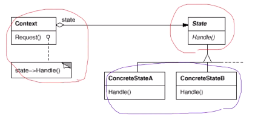

**要点总结**

- **State模式将所有与一个特定状态相关的行为都放入一个State的子类对象中**，在对象状态切换时，切换相应的对象;但同时维持State的接口，**这样实现了具体操作与状态转换之间的解耦合。**
- **为不同的状态引入不同的对象使得状态转换变得更加明确**，而且可以保证不会出现状态不一致的情况，因为转换是原子性的——即要么彻底转换过来。要么不转化。
- 如果State对象没有实例变量，那么**上下文可以共享同一个State对象**，从而节省对象开销。

```cpp
//原始if判断方式
enum NetworkState
{
    Network_Open,
    Network_Close,
    Network_Connect,
};

class NetworkProcessor{
    NetworkState state;
public:
    void Operation1(){
        if (state == Network_Open){
            //**********
            state = Network_Close;
        }
        else if (state == Network_Close){
            //..........
            state = Network_Connect;
        }
        else if (state == Network_Connect){
            //$$$$$$$$$$
            state = Network_Open;
        }
    }

    public void Operation2(){
        if (state == Network_Open){
            //**********
            state = Network_Connect;
        }
        else if (state == Network_Close){
            //.....
            state = Network_Open;
        }
        else if (state == Network_Connect){
            //$$$$$$$$$$
            state = Network_Close;
        }
    }
    public void Operation3(){
    }
};
```

```cpp
class NetworkState{

public:
    NetworkState* pNext;
    virtual void Operation1()=0;
    virtual void Operation2()=0;
    virtual void Operation3()=0;

    virtual ~NetworkState(){}
};
class OpenState :public NetworkState{
    static NetworkState* m_instance;
public:
    static NetworkState* getInstance(){
        if (m_instance == nullptr) {
            m_instance = new OpenState();
        }
        return m_instance;
    }

    void Operation1(){
        //**********
        pNext = CloseState::getInstance();
    }
    
    void Operation2(){
        //..........
        pNext = ConnectState::getInstance();
    }
    
    void Operation3(){
        //$$$$$$$$$$
        pNext = OpenState::getInstance();
    }
};
class CloseState:public NetworkState{ }
//...

class NetworkProcessor{
    NetworkState* pState;
public:
    NetworkProcessor(NetworkState* pState){
        this->pState = pState;
    }
    void Operation1(){
        //...
        pState->Operation1();
        pState = pState->pNext;
        //...
    }
    void Operation2(){
        //...
        pState->Operation2();
        pState = pState->pNext;
        //...
    }
    void Operation3(){
        //...
        pState->Operation3();
        pState = pState->pNext;
        //...
    }
};
```

### ~~7.17.Memento备忘录~~

**动机**

- 在软件构建的过程中，某些对象的状态在转换的过程中，可能由于某种需要，要求程序能够回溯到对象之前处于某个点的状态。如果使用一些公有接口来让其他对象得到对象的状态，便会暴露对象的细节实现。
- 如何实现对象**状态的良好保存与修复**？但同时又不会因此而破坏对本身的**封装性**。

**模式定义**

在不破坏封装性的前提下，捕获一个对象的内部状态，**并在该对象之外保存这个状态**。这样以后就可以将该对象恢复到原先保存的状态。

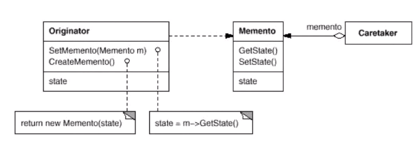

**要点总结**

- 备忘录（Memento）存储原发器（Originator）对象的内部状态，在需要时恢复原发器状态。

- 备忘录模式的核心是信息隐藏，即Originator需要向外接隐藏信息，保持其封装性。但同时又需要将状态保持到外界。

- 由于相待语言进行时（C#，Java），都具有相当的对象序列化支持，因此往往采用效率更高、又较容易正确实现的序列化方案来支持Memento模式。

- ```cpp
  class Memento{
      string state;
      //..
  public:
      Memento(const string & s) : state(s) {}
      string getState() const { return state; }
      void setState(const string & s) { state = s; }
  };
  class Originator{
      string state;
      //....
  public:
      Originator() {}
      Memento createMomento() {
          Memento m(state);
          return m;
      }
      void setMomento(const Memento & m) {
          state = m.getState();
      }
  };
  int main(){
      Originator orginator;
      //捕获对象状态，存储到备忘录
      Memento mem = orginator.createMomento();
      //... 改变orginator状态
      //从备忘录中恢复
      orginator.setMomento(memento);
  }
  ```

  

## “数据结构”模式

- 常常一些组件在内部具有特定的数据模式，如果让客户程序依赖这些特定的数据结构，将极大的破坏组件的复用。这时候，**将这些特定的数据结构封装在内部，在外部提供统一的接口**，来实现特定**数据结构无关**的访问，是一种行之有效的解决方案。
- 典型模式
  - Composite
  - Iterator
  - Chain of Resposible

### 8.18.Composite组合模式

**动机**

- 在软件在某些情况下，客户代码**过多地依赖于对象容器复杂的内部实现结构**，对象容器内部实现结构（而非抽象接口）的变化引起客户代码的频繁变化，带来了代码的维护性、扩展性等弊端。
- 如何“客户代码与复杂的对象容器结构”解耦合？额昂对象容器实现自身的复杂结构，从而使客户代码就像处理简单对象一样来处理复杂的对象容器。

**模式定义**

将对象组合成**树形结构**以表示“部分-整体”的层次结构。**Composite使得用户对单个对象和组合对象的使用具有一致性**（稳定）。

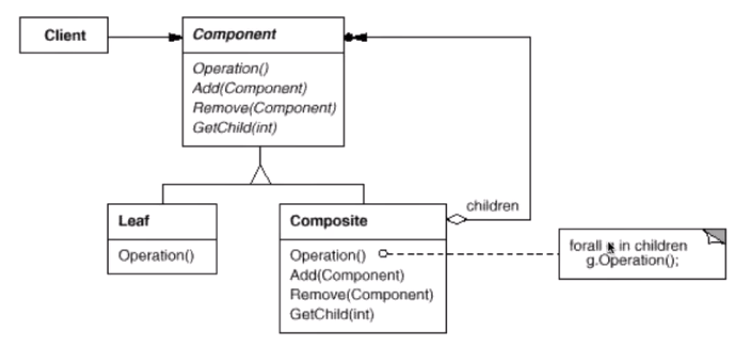

**要点总结**

- 组合模式采用树形结构来实现更普遍存在的对象容器，**从而将“一对多”的关系转化为“一对一”的关系**，使得客户代码可以**一致地**（复用）处理对象和对象容器，无需关心处理的是单个的对象，还是组合的对象容器。

- 将“客户代码与复杂的对象容器结构”解耦是Composite的核心思想，解耦之后，**客户代码将与纯粹的抽象接口**——而非对象容器内部实现结构——发生依赖，从而更能“应付变化”。

- Composite模式在具体实现中，可以让父对象中的子对象反向追溯;**如果父对象有频繁的遍历需求，可以使用缓存技巧来改善效率。**

  核心：**通过多态的递归调用来解耦内部和外部的依赖关系。**

```cpp
class Component{//接口
public:
    virtual void process() = 0;
    virtual ~Component(){}
};

//树节点
class Composite : public Component{//继承接口Component
    string name;
    list<Component*> elements;//组合，
public:
    Composite(const string & s) : name(s) {}
    void add(Component* element) {
        elements.push_back(element);
    }
    void remove(Component* element){
        elements.remove(element);
    }
    
    void process(){
        
        //1. process current node
        //2. process leaf nodes
        for (auto &e : elements)
            e->process(); //多态调用
         
    }
};

//叶子节点
class Leaf : public Component{
    string name;
public:
    Leaf(string s) : name(s) {}
    void process(){
        //process current node
    }
};


void Invoke(Component & c){
    //...
    c.process();
    //...
}


int main()
{

    Composite root("root");
    Composite treeNode1("treeNode1");
    Composite treeNode2("treeNode2");
    Composite treeNode3("treeNode3");
    Composite treeNode4("treeNode4");
    Leaf leat1("left1");
    Leaf leat2("left2");
    
    root.add(&treeNode1);
    treeNode1.add(&treeNode2);
    treeNode2.add(&leaf1);
    
    root.add(&treeNode3);
    treeNode3.add(&treeNode4);
    treeNode4.add(&leaf2);
    
    process(root);
    process(leaf2);
    process(treeNode3);
  
}
```

### ~~8.19.Iterator迭代器~~

**动机**

- 在软件构建过程中，集合对象内部结构常常变化各异。但对于这些集合对象，我们希望在**不暴露其在内部结构的同时**，可以让外部客户代码透明地访问其中包含的元素；同时这种“透明遍历”也可以为“同一种算法在多种集合对象上进行操作“提供了可能。
- 使用面向对象技术将这种遍历机制抽象为”迭代器对象“ 为”应对变化中的集合对象“提供了一种优雅的方式。

**模式定义**

提供一种方法**顺序访问一个聚合对象中的各个元素**，而**又不暴露（稳定）该对象的内部表示**。

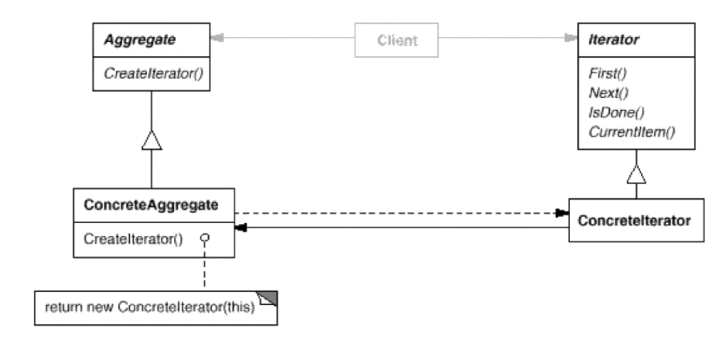

**要点总结**

- 迭代抽象：访问一个对象的内容而无需暴露它的内部表示。
- 迭代多态：为遍历不同的集合结构提供一个统一的接口，从而支持同样的算法在不同的集合结构上进行操作。
- 迭代器的健壮性考虑：遍历的同时更改迭代器所在的集合结构，会导致问题。

```cpp
template<typename T>
class Iterator
{
public:
    virtual void first() = 0;
    virtual void next() = 0;
    virtual bool isDone() const = 0;
    virtual T& current() = 0;
};

template<typename T>
class MyCollection{
public:
    Iterator<T> GetIterator(){
        //...
    }
};

template<typename T>
class CollectionIterator : public Iterator<T>{
    MyCollection<T> mc;
public:
    CollectionIterator(const MyCollection<T> & c): mc(c){ }
    void first() override {}
    void next() override {}
    bool isDone() const override{}
    T& current() override{}
};

void MyAlgorithm()
{
    MyCollection<int> mc;
    Iterator<int> iter= mc.GetIterator();
    for (iter.first(); !iter.isDone(); iter.next()){
        cout << iter.current() << endl;
    }
}
```


### 8.20.Chain of Resposibility职责链

**动机**

- 在软件构建过程中，一个请求可能被多个对象处理，但是**每个请求在运行时只能有一个接受者**，如果显示指定，将必不可少的带来请求发送者与接受者的紧耦合。
- 如何**使请求的发送者不需要指定具体的接受者？**让请求的接受者如何自己在运行时句顶来处理请求，从而让两者解耦。

**模式定义**

**使多个对象都有机会处理请求**，从而避免请求的发送者和接收者直接的耦合关系。**将这些对象连接成一条链，**并沿着这条链传递请求，直到一个对象处理它为止。

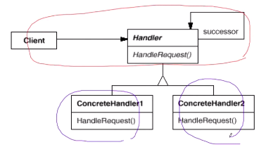

**要点总结**

- 职责链模式的应用场合在于“一个请求可能有多个接受者，但是最后真正接受者只有一个“，这时候请求发送者与接受者的耦合有可能出现”变化脆弱“的症状，职责链的目的就是将二者解耦合，从而更好的应对变化。
- 应用了职责链模式后，对象的职责分配将更具灵活性。我们可以在**运行时动态**添加/修改请求的处理职责。
- 如果请求传递到职责链的末尾仍然得不到出路，应该有一个合理的缺省机制。这也是每一个接受对象的责任，而不是发出请求的对象的责任。

```cpp
#include <iostream>
#include <string>
using namespace std;

enum class RequestType
{
    REQ_HANDLER1,
    REQ_HANDLER2,
    REQ_HANDLER3
};

class Reqest
{
    string description;
    RequestType reqType;
public:
    Reqest(const string & desc, RequestType type) : description(desc), reqType(type) {}
    RequestType getReqType() const { return reqType; }
    const string& getDescription() const { return description; }
};

class ChainHandler{
    ChainHandler *nextChain;
    void sendReqestToNextHandler(const Reqest & req){
        if (nextChain != nullptr)
            nextChain->handle(req);
    }
protected:
    virtual bool canHandleRequest(const Reqest & req) = 0;
    virtual void processRequest(const Reqest & req) = 0;
public:
    ChainHandler() { nextChain = nullptr; }
    void setNextChain(ChainHandler *next) { nextChain = next; }
    void handle(const Reqest & req){
        if (canHandleRequest(req))
            processRequest(req);
        else
            sendReqestToNextHandler(req);
    }
};


class Handler1 : public ChainHandler{
protected:
    bool canHandleRequest(const Reqest & req) override{
        return req.getReqType() == RequestType::REQ_HANDLER1;
    }
    void processRequest(const Reqest & req) override{
        cout << "Handler1 is handle reqest: " << req.getDescription() << endl;
    }
};
        
class Handler2 : public ChainHandler{
protected:
    bool canHandleRequest(const Reqest & req) override {
        return req.getReqType() == RequestType::REQ_HANDLER2;
    }
    void processRequest(const Reqest & req) override{
        cout << "Handler2 is handle reqest: " << req.getDescription() << endl;
    }
};

class Handler3 : public ChainHandler{
protected:
    bool canHandleRequest(const Reqest & req) override{
        return req.getReqType() == RequestType::REQ_HANDLER3;
    }
    void processRequest(const Reqest & req) override{
        cout << "Handler3 is handle reqest: " << req.getDescription() << endl;
    }
};

int main(){
    Handler1 h1;
    Handler2 h2;
    Handler3 h3;
    h1.setNextChain(&h2);
    h2.setNextChain(&h3);
    
    Reqest req("process task ... ", RequestType::REQ_HANDLER3);
    h1.handle(req);
    return 0;
}
```


## ”行为变化“模式

- 在组件的构建过程中，组件的行为变化经常导致组件本身剧烈的变化。”行为变化“模式将组件的行为和组件本身进行解耦，从而**支持组件行为的变化，**实现两者之间的松耦合。
- 经典模式
  - Command
  - Visitor

### ~~9.21.Command命令模式~~

**动机**

- 在软件构建的过程中，”行为请求者”与“行为实现者“通常呈现一种紧耦合。在某些场合——比如需要对行为进行”记录、撤销/重（redo,undo）、事务“等处理，这种无法抵御变化的紧耦合是不适合的。
- 在这种情况下，如何将”请求者“与”行为实现者“解耦？将一组行为抽象为对象，可以实现二者实现之间的松耦合。

**模式定义**

将一个**请求（行为）封装成一个对象**，从而使你可用不同的请求对客户进行参数化；对请求排队或记录请求日志，以及支持可撤销操作。

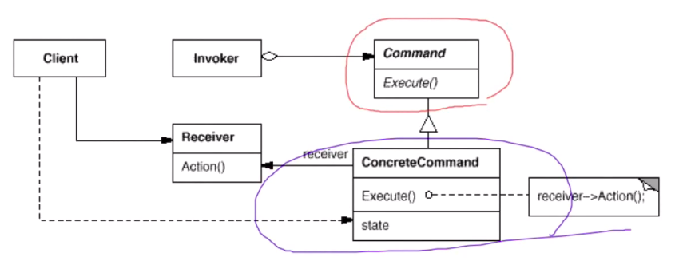

**要点总结**

- 命令模式的根本目的在于将”行为请求者“与”行为实现者“解耦，在面向兑现嗯语言中，常见的实现手段是**”将行为抽象为对象“。**
- 实现命令接口的具体命令对象ConcreteCommand有时候根据需要可能会保存一些额外的状态信息。通过使用Composite模式，可以将多个”命令“封装为一个”复合命令“，MacroCommand
- Command模式与C++中函数对象有一些类似。但两者定义行为接口的规范有所区别：Command以面向对象中的”接口-实现“来定义行为**接口规范**，更严格，但性能有损失；C++函数对象以函数签名来定义行为接口规范，更灵活，性能更高。

```cpp
#include <iostream>
#include <vector>
#include <string>
using namespace std;


class Command
{
public:
    virtual void execute() = 0;
};

class ConcreteCommand1 : public Command
{
    string arg;
public:
    ConcreteCommand1(const string & a) : arg(a) {}
    void execute() override
    {
        cout<< "#1 process..."<<arg<<endl;
    }
};

class ConcreteCommand2 : public Command
{
    string arg;
public:
    ConcreteCommand2(const string & a) : arg(a) {}
    void execute() override
    {
        cout<< "#2 process..."<<arg<<endl;
    }
};
        
        
class MacroCommand : public Command
{
    vector<Command*> commands;
public:
    void addCommand(Command *c) { commands.push_back(c); }
    void execute() override
    {
        for (auto &c : commands)
        {
            c->execute();
        }
    }
};    
int main()
{

    ConcreteCommand1 command1(receiver, "Arg ###");
    ConcreteCommand2 command2(receiver, "Arg $$$");
    
    MacroCommand macro;
    macro.addCommand(&command1);
    macro.addCommand(&command2);
    
    macro.execute();
}
```

### ~~9.22.Visitor访问器~~

**动机**

- 在软件构建过程中，由于**需求的改变，某些层次结构中常常需要增加新的行为（方法）**，如果直接在基类中做这样的更改，将会给子类带来很繁重的变更负担，甚至破坏原有的设计。
- 如何在不更改类层次结构的前提下，**在运行时**根据需要透明地为层次结构上的**各个类动态添加新的操作，**从而避免上述问题。

首先`Visitor`有一个前提，**我能预料到要为整个类层次添加新的操作。但我不知道要加什么操作，要加几个操作。**

**模式定义**

表示一个作用于某**对象结构**中的各元素的操作。使得可以在不改变（稳定）各元素的类的前提下定义（扩展）作用域这些元素的新操作。


模式的缺点：visitor 稳定的前提是Element所有子类都确定。条件苛刻

**要点总结**

- 访问器模式通过所谓的双重分发来实现**不更改（不添加新的操作-编译时）Element类层次结构的前提下**，在运行时透明地为类层次结构上的各个类动态添加新的操作（支持变化）。
- 所谓双重分发即Visitor模式中间包括了两个多态的分发（注意其中的多态机制）：第一个accept方法的多态辨析；第二个为visitElementX方法的多态辨析。
- visitor模式最大的缺点在于**扩展类层次结构（添加新的Element子类），会导致Visitor类的改变**因此Visitor模式适用于**Element类层次结构稳定，而其中操作经常面临频繁改动。**

```cpp
#include <iostream>
using namespace std;
class Visitor;
class Visitor{
public:
    virtual void visitElementA(ElementA& element) = 0;
    virtual void visitElementB(ElementB& element) = 0;
    virtual ~Visitor(){}
};
class Element{
public:
    virtual void accept(Visitor& visitor) = 0; //第一次多态辨析
    virtual ~Element(){}
};

class ElementA : public Element{
public:
    void accept(Visitor &visitor) override {
        visitor.visitElementA(*this);
    }
};

class ElementB : public Element{
public:
    void accept(Visitor &visitor) override {
        visitor.visitElementB(*this); //第二次多态辨析
    }

};


//==================================

//扩展1
class Visitor1 : public Visitor{
public:
    void visitElementA(ElementA& element) override{
        cout << "Visitor1 is processing ElementA" << endl;
    }
        
    void visitElementB(ElementB& element) override{
        cout << "Visitor1 is processing ElementB" << endl;
    }
};
     
//扩展2
class Visitor2 : public Visitor{
public:
    void visitElementA(ElementA& element) override{
        cout << "Visitor2 is processing ElementA" << endl;
    }
    
    void visitElementB(ElementB& element) override{
        cout << "Visitor2 is processing ElementB" << endl;
    }
};
        

int main()
{
    Visitor2 visitor;
    ElementB elementB;
    elementB.accept(visitor);// double dispatch
    
    ElementA elementA;
    elementA.accept(visitor);

    
    return 0;
}
```


## ~~“领域规则”模式~~

- 在特定领域中。**某些变化虽然频繁，但可以抽象为某种规则**。这时候，结合特定领域，将问题抽象为语法规则，从而给出在该领域下一般性解决方案。
- 常见模式
  - 解析器Interpreter

### ~~9.23.解析器Interpreter~~

**动机**

- 在软件构建过程中，如果某一特定领域的问题比较复杂，类似的结构不断重复出现，如果使用普通的编程方式来实现将面临非常频繁的变化。
- 在这种情况下，**将特定领域的问题表达为某种特定语法规则下的句子**，然后构建一个解释器来解释这样的句子，从而达到解决问题的目的。

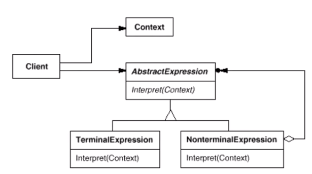

**模式定义**

给定一个语言，定义它文法的一种表示，并定义一种解释器，这个解释器使用该表示来解释语言中的句子。

**要点总结**

- 解释器模式的应用场合是Interpreter模式应用中的难点，只有满足“业务规则频繁变化，且类似结构不断重复出现，并且**容易抽象为语法规则“**的问题才适合Interpreter模式。
- 使用Interperter模式来表示文法规则，从而可以使用**面向对象**的技巧来方便地”扩展“文法。
- Interpreter模式比较适合简单的文法表示，对于复杂的文法表示，Interpreter模式会产生比较大的类层次结构，需要求助于语法分析生成器这样的标准工具。

```cpp

#include <iostream>
#include <map>
#include <stack>

using namespace std;

class Expression {
public:
    virtual int interpreter(map<char, int> var)=0;
    virtual ~Expression(){}
};

//变量表达式
class VarExpression: public Expression {
    
    char key;
    
public:
    VarExpression(const char& key)
    {
        this->key = key;
    }
    
    int interpreter(map<char, int> var) override {
        return var[key];
    }
    
};

//符号表达式
class SymbolExpression : public Expression {
    
    // 运算符左右两个参数
protected:
    Expression* left;
    Expression* right;
    
public:
    SymbolExpression( Expression* left,  Expression* right):
        left(left),right(right){
        
    }
    
};

//加法运算
class AddExpression : public SymbolExpression {
    
public:
    AddExpression(Expression* left, Expression* right):
        SymbolExpression(left,right){
        
    }
    int interpreter(map<char, int> var) override {
        return left->interpreter(var) + right->interpreter(var);
    }
    
};

//减法运算
class SubExpression : public SymbolExpression {
    
public:
    SubExpression(Expression* left, Expression* right):
        SymbolExpression(left,right){
        
    }
    int interpreter(map<char, int> var) override {
        return left->interpreter(var) - right->interpreter(var);
    }
    
};


Expression*  analyse(string expStr) {
    
    stack<Expression*> expStack;
    Expression* left = nullptr;
    Expression* right = nullptr;
    for(int i=0; i<expStr.size(); i++)
    {
        switch(expStr[i])
        {
            case '+':
                // 加法运算
                left = expStack.top();
                right = new VarExpression(expStr[++i]);
                expStack.push(new AddExpression(left, right));
                break;
            case '-':
                // 减法运算
                left = expStack.top();
                right = new VarExpression(expStr[++i]);
                expStack.push(new SubExpression(left, right));
                break;
            default:
                // 变量表达式
                expStack.push(new VarExpression(expStr[i]));
        }
    }
   
    Expression* expression = expStack.top();

    return expression;
}

void release(Expression* expression){
    
    //释放表达式树的节点内存...
}

int main(int argc, const char * argv[]) {
    
    
    string expStr = "a+b-c+d-e";
    map<char, int> var;
    var.insert(make_pair('a',5));
    var.insert(make_pair('b',2));
    var.insert(make_pair('c',1));
    var.insert(make_pair('d',6));
    var.insert(make_pair('e',10));

    
    Expression* expression= analyse(expStr);
    
    int result=expression->interpreter(var);
    
    cout<<result<<endl;
    
    release(expression);
    
    return 0;
}


```


# 总结

## 一个目标

- 管理变化提高复用

## 两个手段

- 分解
- 抽象

## 八大原则

- 依赖倒置原则
- 开放封闭原则
- 单一职责原则
- 里式替换原则
- 接口隔离原则
- 对象组合优于类继承
- 封装变化点
- 面向接口编程

## 重构技法

- 静态 -> 动态
- 早绑定 -> 晚绑定
- 继承 -> 组合
- 编译时依赖 -> 运行时依赖
- 紧耦合 -> 松耦合

## 关注稳定点和变化点

什么时候不用模式

- 代码可读性很差时
- 需求理解还很浅时
- 变化还没有显现时
- 不是系统的关键依赖点
- 项目没有复用价值时
- 项目将要发布的时候

## 经验之谈

- 不要为了模式而模式
- 关注抽象类&接口
- 理清变化点和稳定点
- 审视依赖关系
- 要有Framework和Application的区隔思维（写Framework的时候要考虑为应用程序开发人员去留什么样的接口，留什么样的扩展点）
- 良好的实际是演化的结果

## 设计模式成长之路

- ”手中无剑，心中无剑“：见模式而不知
- ”手中有剑，心中无剑“：可以识别模式，作为应用开发人员使用模式
- ”手中有剑，心中有剑“：作为框架开发人员为应用设计某些模式
- ”手中无剑，心中有剑“：忘掉模式，只有原则

